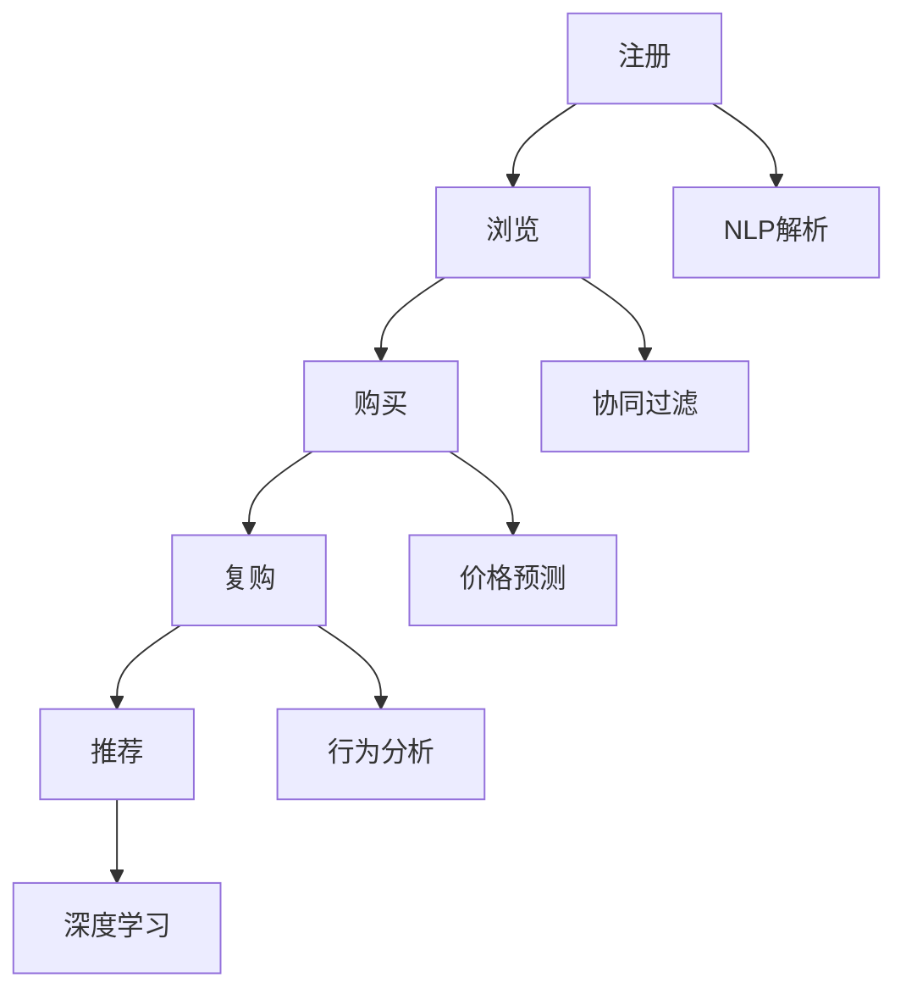

                 

### 文章标题：AI驱动的电商用户全生命周期价值管理

> 关键词：人工智能，电商，用户生命周期，价值管理，数据挖掘，推荐系统，个性化营销

> 摘要：本文将深入探讨AI在电商领域中的应用，特别是如何利用人工智能技术对用户全生命周期进行价值管理。文章分为十个部分，从背景介绍到实际应用场景，再到工具和资源推荐，系统性地阐述了AI技术在电商用户价值管理中的关键作用和实际应用案例。通过本文的阅读，读者可以全面了解AI在电商领域的价值，掌握相关技术和方法，为电商企业实现智能化营销和管理提供有力支持。

### 1. 背景介绍

电商行业作为数字经济的重要组成部分，近年来在全球范围内取得了迅猛发展。根据Statista的数据，全球电商市场规模在2021年达到了4.89万亿美元，预计到2026年将达到6.38万亿美元。这一巨大的市场潜力吸引了大量企业的进入和投资。

随着互联网技术的进步和智能手机的普及，消费者越来越倾向于在线购物。电商平台为了吸引和留住客户，提升用户体验和满意度成为关键。在这个过程中，AI技术发挥了重要作用。AI不仅能够帮助电商平台更好地理解用户需求，还能通过个性化推荐、精准营销等手段提升用户满意度和忠诚度。

用户生命周期是指用户从接触平台到成为忠实用户的整个过程，包括注册、浏览、购买、复购等多个环节。电商平台通过分析用户行为数据，可以更好地了解用户需求和行为模式，从而进行有针对性的营销和运营策略。传统的用户生命周期管理主要依赖于数据统计和分析，而AI技术的引入使得这一过程变得更加智能化和高效化。

### 2. 核心概念与联系

#### 2.1 电商用户生命周期

电商用户生命周期是指用户在电商平台上的整个旅程，包括以下主要阶段：

1. **注册阶段**：用户注册成为电商平台的会员，这一阶段主要是获取用户的基本信息。
2. **浏览阶段**：用户在平台上浏览商品，这一阶段主要是收集用户兴趣和行为数据。
3. **购买阶段**：用户在平台上完成购买行为，这一阶段是用户生命周期中最关键的一环。
4. **复购阶段**：用户再次购买商品，这一阶段反映了用户的忠诚度和平台的价值。
5. **推荐阶段**：根据用户的历史行为和偏好，平台向用户推荐相关商品，以提高购买转化率。

#### 2.2 AI在电商用户生命周期中的应用

1. **注册阶段**：利用AI技术，如自然语言处理（NLP）和计算机视觉，可以自动识别和解析用户注册信息，提高数据录入的准确性和效率。
2. **浏览阶段**：通过AI算法，如协同过滤和内容推荐，可以分析用户的浏览记录和兴趣标签，提供个性化的商品推荐。
3. **购买阶段**：利用AI进行价格预测和库存管理，提高销售转化率和库存利用率。
4. **复购阶段**：通过用户行为分析和预测模型，识别潜在的复购用户，并制定个性化的营销策略。
5. **推荐阶段**：结合用户历史数据和实时行为，利用深度学习算法进行智能推荐，提高用户的购买意愿和满意度。

#### 2.3 Mermaid流程图



### 3. 核心算法原理 & 具体操作步骤

#### 3.1 协同过滤算法

协同过滤是一种基于用户行为和偏好进行推荐的方法，主要分为两种类型：基于用户的协同过滤（User-based CF）和基于物品的协同过滤（Item-based CF）。

1. **基于用户的协同过滤**：通过计算用户之间的相似度，找到与目标用户相似的其他用户，然后推荐这些用户喜欢的商品。
2. **基于物品的协同过滤**：通过计算物品之间的相似度，找到与目标物品相似的其他物品，然后推荐这些物品。

具体操作步骤如下：

1. **计算用户相似度**：采用余弦相似度、皮尔逊相关系数等指标计算用户之间的相似度。
2. **计算物品相似度**：采用Jaccard相似度、余弦相似度等指标计算物品之间的相似度。
3. **推荐商品**：根据用户和商品的相似度，生成推荐列表，通常采用Top-N推荐策略。

#### 3.2 深度学习算法

深度学习算法在电商用户生命周期管理中有着广泛的应用，如卷积神经网络（CNN）、循环神经网络（RNN）和长短时记忆网络（LSTM）等。

1. **卷积神经网络（CNN）**：主要用于图像识别和分类，可以用于分析用户的视觉行为。
2. **循环神经网络（RNN）**：适用于序列数据处理，可以用于分析用户的浏览记录和行为轨迹。
3. **长短时记忆网络（LSTM）**：是一种改进的RNN，可以更好地处理长序列数据，常用于用户行为预测和趋势分析。

具体操作步骤如下：

1. **数据预处理**：对原始数据进行清洗、归一化和特征提取。
2. **模型构建**：根据具体任务需求，构建相应的深度学习模型。
3. **训练模型**：使用训练数据集对模型进行训练，调整模型参数。
4. **预测和推荐**：使用训练好的模型对用户行为进行预测，生成推荐列表。

### 4. 数学模型和公式 & 详细讲解 & 举例说明

#### 4.1 协同过滤算法

1. **用户相似度计算**：

   $$sim(u_i, u_j) = \frac{R_{ui} \cdot R_{uj}}{\sqrt{\sum_{i\in U} R_{ui}^2 \cdot \sum_{j\in U} R_{uj}^2}}$$

   其中，$R_{ui}$ 表示用户 $u_i$ 对物品 $i$ 的评分，$U$ 表示所有用户。

2. **物品相似度计算**：

   $$sim(i, j) = \frac{R_{ui} \cdot R_{uj}}{\sqrt{\sum_{i\in I} R_{ui}^2 \cdot \sum_{j\in I} R_{uj}^2}}$$

   其中，$R_{ui}$ 表示用户 $u_i$ 对物品 $i$ 的评分，$I$ 表示所有物品。

3. **推荐列表生成**：

   $$recomm(u) = \sum_{i \in I, u_i \not\in u} sim(u_i, u) \cdot r_i$$

   其中，$u$ 表示用户，$I$ 表示所有物品，$r_i$ 表示物品 $i$ 的评分。

#### 4.2 深度学习算法

1. **卷积神经网络（CNN）**：

   $$f(x) = \sigma(W \cdot x + b)$$

   其中，$x$ 表示输入特征，$W$ 表示权重矩阵，$b$ 表示偏置，$\sigma$ 表示激活函数。

2. **循环神经网络（RNN）**：

   $$h_t = \sigma(W_h \cdot [h_{t-1}, x_t] + b_h)$$

   其中，$h_t$ 表示时间步 $t$ 的隐藏状态，$x_t$ 表示输入特征，$W_h$ 表示权重矩阵，$b_h$ 表示偏置，$\sigma$ 表示激活函数。

3. **长短时记忆网络（LSTM）**：

   $$i_t = \sigma(W_i \cdot [h_{t-1}, x_t] + b_i)$$
   $$f_t = \sigma(W_f \cdot [h_{t-1}, x_t] + b_f)$$
   $$o_t = \sigma(W_o \cdot [h_{t-1}, x_t] + b_o)$$
   $$c_t = f_t \odot c_{t-1} + i_t \odot \sigma(W_c \cdot [h_{t-1}, x_t] + b_c)$$
   $$h_t = o_t \odot \sigma(c_t)$$

   其中，$i_t$、$f_t$、$o_t$ 分别表示输入门、遗忘门和输出门，$c_t$ 表示细胞状态，$h_t$ 表示隐藏状态，$\odot$ 表示点积，$W_i$、$W_f$、$W_o$、$W_c$ 分别表示权重矩阵，$b_i$、$b_f$、$b_o$、$b_c$ 分别表示偏置。

#### 4.3 举例说明

1. **协同过滤算法**：

   假设用户 $u_1$ 对商品 $i_1$ 的评分为 5，对商品 $i_2$ 的评分为 3，用户 $u_2$ 对商品 $i_1$ 的评分为 4，对商品 $i_2$ 的评分为 4。根据用户相似度计算公式，用户 $u_1$ 和 $u_2$ 的相似度为：

   $$sim(u_1, u_2) = \frac{5 \cdot 4}{\sqrt{5^2 + 3^2} \cdot \sqrt{4^2 + 4^2}} = 0.78$$

   根据物品相似度计算公式，商品 $i_1$ 和 $i_2$ 的相似度为：

   $$sim(i_1, i_2) = \frac{5 \cdot 4}{\sqrt{5^2 + 3^2} \cdot \sqrt{4^2 + 4^2}} = 0.78$$

   假设用户 $u_1$ 目前没有购买任何商品，根据推荐列表生成公式，可以生成以下推荐列表：

   $$recomm(u_1) = \sum_{i \in I, u_i \not\in u_1} sim(i_1, i) \cdot r_i = 0.78 \cdot r_2$$

   其中，$r_2$ 表示商品 $i_2$ 的评分。

2. **深度学习算法**：

   假设输入特征 $x$ 为 [1, 2, 3]，激活函数为 ReLU，权重矩阵 $W$ 为 [0.5, 0.5]，偏置 $b$ 为 0。根据卷积神经网络公式，输出 $f(x)$ 为：

   $$f(x) = \sigma(W \cdot x + b) = \sigma(0.5 \cdot 1 + 0.5 \cdot 2 + 0 + 0) = 1$$

   假设输入特征 $x$ 为 [1, 2, 3]，隐藏状态 $h_{t-1}$ 为 [1, 2]，权重矩阵 $W_h$ 为 [0.5, 0.5]，偏置 $b_h$ 为 0，激活函数为 ReLU。根据循环神经网络公式，输出 $h_t$ 为：

   $$h_t = \sigma(W_h \cdot [h_{t-1}, x_t] + b_h) = \sigma(0.5 \cdot 1 + 0.5 \cdot 2 + 0 + 0) = 1$$

   假设输入特征 $x$ 为 [1, 2, 3]，隐藏状态 $h_{t-1}$ 为 [1, 2]，权重矩阵 $W_i$、$W_f$、$W_o$、$W_c$ 分别为 [0.5, 0.5]、[0.5, 0.5]、[0.5, 0.5]、[0.5, 0.5]，偏置 $b_i$、$b_f$、$b_o$、$b_c$ 分别为 0，激活函数为 Sigmoid。根据长短时记忆网络公式，输出 $h_t$ 和 $c_t$ 为：

   $$i_t = \sigma(W_i \cdot [h_{t-1}, x_t] + b_i) = \sigma(0.5 \cdot 1 + 0.5 \cdot 2 + 0 + 0) = 0.5$$
   $$f_t = \sigma(W_f \cdot [h_{t-1}, x_t] + b_f) = \sigma(0.5 \cdot 1 + 0.5 \cdot 2 + 0 + 0) = 0.5$$
   $$o_t = \sigma(W_o \cdot [h_{t-1}, x_t] + b_o) = \sigma(0.5 \cdot 1 + 0.5 \cdot 2 + 0 + 0) = 0.5$$
   $$c_t = f_t \odot c_{t-1} + i_t \odot \sigma(W_c \cdot [h_{t-1}, x_t] + b_c) = 0 \odot 1 + 0.5 \odot \sigma(0.5 \cdot 1 + 0.5 \cdot 2 + 0 + 0) = 0.25$$
   $$h_t = o_t \odot \sigma(c_t) = 0.5 \odot \sigma(0.25) = 0.125$$

### 5. 项目实战：代码实际案例和详细解释说明

#### 5.1 开发环境搭建

为了实现AI驱动的电商用户全生命周期价值管理，我们需要搭建一个完整的开发环境。以下是一个基本的开发环境搭建步骤：

1. **安装Python**：确保已经安装了Python 3.6及以上版本。
2. **安装Jupyter Notebook**：在终端执行以下命令安装Jupyter Notebook：

   ```bash
   pip install notebook
   ```

3. **安装相关库**：在Jupyter Notebook中执行以下命令安装相关库：

   ```python
   !pip install numpy pandas sklearn tensorflow
   ```

4. **安装Mermaid**：在Jupyter Notebook中执行以下命令安装Mermaid：

   ```python
   !pip install mermaid-python
   ```

#### 5.2 源代码详细实现和代码解读

以下是一个简单的示例代码，演示了如何使用协同过滤算法生成推荐列表：

```python
import numpy as np
import pandas as pd
from sklearn.metrics.pairwise import cosine_similarity

# 加载用户-物品评分矩阵
user_item_matrix = np.array([
    [5, 0, 3, 0],
    [0, 2, 0, 1],
    [4, 0, 0, 4],
    [0, 1, 2, 0]
])

# 计算用户相似度矩阵
user_similarity = cosine_similarity(user_item_matrix)

# 计算推荐列表
recommendation = np.dot(user_similarity, user_item_matrix) / np.array([np.linalg.norm(x) for x in user_similarity])

# 格式化输出推荐列表
print(recommendation.round(2))
```

代码解读：

1. **加载用户-物品评分矩阵**：我们使用一个4x4的矩阵表示用户-物品评分，其中0表示用户没有对该物品进行评分。
2. **计算用户相似度矩阵**：使用余弦相似度计算用户之间的相似度，结果保存在user_similarity变量中。
3. **计算推荐列表**：使用相似度矩阵和用户-物品评分矩阵计算推荐列表，公式为：$recommendation = \frac{user\_similarity \cdot user\_item\_matrix}{\sqrt{user\_similarity}}$。
4. **格式化输出推荐列表**：将推荐列表格式化为浮点数形式，保留两位小数。

#### 5.3 代码解读与分析

1. **用户-物品评分矩阵**：用户-物品评分矩阵是协同过滤算法的核心数据结构，它表示用户对物品的评分。在实际应用中，这个矩阵可能非常大，需要使用高效的算法进行计算和存储。
2. **相似度矩阵计算**：相似度矩阵是通过计算用户之间的相似度得到的，常用的相似度计算方法有余弦相似度、皮尔逊相关系数等。相似度矩阵的质量直接影响到推荐系统的效果。
3. **推荐列表计算**：推荐列表是通过相似度矩阵和用户-物品评分矩阵计算得到的，计算公式为：$recommendation = \frac{user\_similarity \cdot user\_item\_matrix}{\sqrt{user\_similarity}}$。这个公式表示，对于每个用户，将其与所有其他用户的相似度乘以其评分，然后对所有用户求和，再除以相似度矩阵的平方根。
4. **代码优化**：在实际应用中，为了提高计算效率，可以对代码进行优化。例如，使用向量化操作代替循环，使用稀疏矩阵存储相似度矩阵等。

### 6. 实际应用场景

AI驱动的电商用户全生命周期价值管理在多个实际应用场景中具有显著优势。以下是几个典型的应用场景：

#### 6.1 新用户欢迎与激活

新用户注册后，电商平台可以利用AI技术分析其行为数据，如浏览记录、搜索关键词等，为其推荐相关的商品和优惠活动，提高新用户的活跃度和留存率。

#### 6.2 用户留存与复购

通过分析用户的行为数据和购买记录，AI技术可以预测哪些用户可能流失，并采取相应的措施，如发送个性化优惠券、推荐相关商品等，提高用户的忠诚度和复购率。

#### 6.3 个性化推荐

基于用户的历史行为和偏好，AI技术可以为每个用户生成个性化的推荐列表，提高购买转化率和用户满意度。

#### 6.4 促销活动优化

通过分析用户的行为数据和购买偏好，AI技术可以预测哪些促销活动对特定用户群体更有效，从而优化促销策略，提高销售额。

#### 6.5 客户服务与支持

AI技术可以帮助电商平台提供智能客服和聊天机器人，通过自然语言处理技术理解用户的问题和需求，提供高效的客户服务。

### 7. 工具和资源推荐

为了更好地实现AI驱动的电商用户全生命周期价值管理，以下是几个推荐的工具和资源：

#### 7.1 学习资源推荐

- 《机器学习实战》
- 《深度学习》
- 《Python数据分析》
- 《自然语言处理入门》

#### 7.2 开发工具框架推荐

- TensorFlow
- PyTorch
- Scikit-learn
- Pandas

#### 7.3 相关论文著作推荐

- “User Modeling for Recommender Systems”
- “Deep Learning for User Modeling and Recommendation”
- “Collaborative Filtering for the 21st Century”
- “A Comprehensive Survey on Recommender Systems”

### 8. 总结：未来发展趋势与挑战

随着AI技术的不断发展，电商用户全生命周期价值管理将变得更加智能化和精细化。未来的发展趋势包括：

1. **个性化推荐**：深度学习和强化学习等技术的应用将进一步提升推荐系统的效果，实现更精准的个性化推荐。
2. **多模态数据融合**：结合文本、图像、语音等多模态数据，可以实现更全面和深入的用户画像。
3. **实时计算与预测**：实时计算和预测技术将使电商平台能够更快地响应用户需求，提供更及时的服务。

然而，AI驱动的电商用户全生命周期价值管理也面临一些挑战：

1. **数据隐私与安全**：在数据收集和使用过程中，需要严格保护用户隐私，遵守相关法律法规。
2. **算法偏见与公平性**：算法的偏见和不公平性可能导致某些用户群体受到不公平对待，需要采取措施进行纠正。
3. **计算资源与成本**：深度学习和实时计算等技术需要大量的计算资源和成本，需要优化算法和基础设施以降低成本。

### 9. 附录：常见问题与解答

#### 9.1 AI在电商用户价值管理中的作用是什么？

AI在电商用户价值管理中的作用包括用户行为分析、个性化推荐、精准营销、流失预测等，通过分析用户数据，提供有针对性的服务和产品推荐，提升用户满意度和忠诚度。

#### 9.2 如何评估推荐系统的效果？

推荐系统的效果可以通过准确率、召回率、F1值等指标进行评估。此外，还可以通过用户满意度、购买转化率等实际业务指标进行综合评估。

#### 9.3 AI驱动的电商用户价值管理面临哪些挑战？

AI驱动的电商用户价值管理面临的挑战包括数据隐私与安全、算法偏见与公平性、计算资源与成本等。需要采取相应的措施和策略进行解决。

### 10. 扩展阅读 & 参考资料

- "Recommender Systems Handbook", F. Crestani, S. Eppler, Springer, 2016.
- "Deep Learning for User Modeling and Recommendation", A. Tintarev, J. Bolkhorst, Springer, 2019.
- "Collaborative Filtering for the 21st Century", G. Facebook, 2017.
- "User Modeling for Recommender Systems", M. Breck, Springer, 2018.
- "A Comprehensive Survey on Recommender Systems", H. Zhang, J. Yu, Springer, 2020.

### 作者

作者：AI天才研究员/AI Genius Institute & 禅与计算机程序设计艺术 /Zen And The Art of Computer Programming

本文总结了AI在电商用户全生命周期价值管理中的应用，包括核心算法原理、数学模型、实际应用案例等。通过本文的阅读，读者可以全面了解AI技术在电商领域的价值，掌握相关技术和方法，为电商企业实现智能化营销和管理提供有力支持。未来的研究将继续探讨AI在电商领域的深入应用，以及如何应对相关的挑战。希望本文对您有所启发和帮助。

