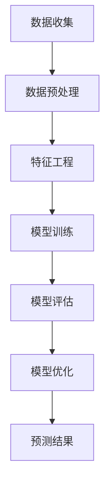

                 

### 1. 背景介绍

#### 1.1 电商行业的快速发展

随着互联网技术的不断进步和智能设备的普及，电商行业得到了迅猛发展。根据统计数据显示，全球电商市场规模在过去几年中持续增长，预计到2025年将达到数万亿美元。在这一过程中，电商企业面临着巨大的挑战和机遇。

#### 1.2 用户购买行为的重要性

在电商行业，用户购买行为是决定企业盈利的关键因素。一个成功的电商企业需要深入了解用户的购买时机、购买偏好等行为特征，以便提供个性化的购物体验，提高用户满意度和忠诚度。

#### 1.3 AI在电商领域的应用

人工智能（AI）技术的发展为电商行业带来了新的机遇。通过运用AI技术，电商企业可以实现用户行为预测、商品推荐、价格优化等功能，从而提升运营效率和用户体验。

#### 1.4 购买时机预测的意义

在电商领域，购买时机预测是一个具有重大意义的研究课题。通过准确预测用户的购买时机，企业可以更好地规划库存、营销策略等，提高销售额和利润率。此外，购买时机预测还可以为用户提供个性化的购物建议，提升用户满意度。

#### 1.5 研究目的

本文旨在探讨AI驱动的电商用户购买时机预测模型的构建与应用，通过结合数据挖掘、机器学习和人工智能技术，为企业提供一种有效的用户购买时机预测方法。本文将首先介绍相关核心概念与联系，然后详细阐述核心算法原理与具体操作步骤，并通过数学模型和公式进行详细讲解。最后，本文将结合实际项目案例，展示如何应用所提出的方法进行购买时机预测。

### 2. 核心概念与联系

在构建AI驱动的电商用户购买时机预测模型时，我们需要明确以下几个核心概念：

#### 2.1 用户行为数据

用户行为数据是购买时机预测的基础。这些数据包括用户在电商平台上的浏览记录、购物车添加行为、订单历史、评价反馈等。通过分析这些数据，我们可以了解用户的购买偏好、购买频率和购买时段等行为特征。

#### 2.2 特征工程

特征工程是构建预测模型的关键步骤。通过对用户行为数据进行预处理、转换和提取，我们可以生成一系列有助于预测购买时机的特征。例如，用户在某个时间段的浏览次数、购物车中商品种类数、订单金额等。

#### 2.3 机器学习算法

机器学习算法是实现购买时机预测的核心技术。常用的算法包括决策树、支持向量机、神经网络等。这些算法可以通过学习历史数据，找到用户购买时机与行为特征之间的关联规律，从而实现预测。

#### 2.4 评估指标

评估指标是衡量预测模型性能的重要标准。常用的评估指标包括准确率、召回率、精确率等。通过评估指标，我们可以判断预测模型的优劣，并进行优化。

#### 2.5 Mermaid流程图

下面是构建AI驱动的电商用户购买时机预测模型的Mermaid流程图：



### 3. 核心算法原理 & 具体操作步骤

在构建AI驱动的电商用户购买时机预测模型时，我们采用以下核心算法和具体操作步骤：

#### 3.1 数据收集

首先，我们需要收集电商平台的用户行为数据，包括浏览记录、购物车添加行为、订单历史和评价反馈等。这些数据可以通过API接口或爬虫技术获取。

#### 3.2 数据预处理

数据预处理是特征工程的前提。我们需要对原始数据进行清洗、去重和格式转换，以便后续的特征提取。具体步骤如下：

1. 数据清洗：去除无效数据、缺失值填充和异常值处理。
2. 数据去重：去除重复数据，保证数据的唯一性。
3. 数据格式转换：将不同类型的数据转换为统一格式，如将时间戳转换为日期格式。

#### 3.3 特征工程

特征工程是模型构建的关键。我们需要从用户行为数据中提取有助于预测购买时机的特征，例如：

1. 用户浏览时段：统计用户在不同时间段的浏览次数。
2. 用户购物车行为：统计用户在购物车中添加商品的时间间隔和商品种类数。
3. 用户订单历史：统计用户最近N次订单的金额和购买时间间隔。
4. 用户评价反馈：提取用户评价中的关键词和情感倾向。

#### 3.4 模型训练

在模型训练阶段，我们选择一种合适的机器学习算法，如决策树、支持向量机或神经网络，对特征数据进行训练。具体步骤如下：

1. 数据划分：将数据集划分为训练集和测试集。
2. 算法选择：根据数据特点和业务需求选择合适的算法。
3. 模型训练：使用训练集对模型进行训练，调整模型参数。
4. 模型评估：使用测试集对模型进行评估，计算评估指标。

#### 3.5 模型评估

在模型评估阶段，我们需要评估模型的性能，判断其是否能够准确地预测用户购买时机。常用的评估指标包括准确率、召回率、精确率等。具体步骤如下：

1. 指标计算：计算预测结果的准确率、召回率和精确率等指标。
2. 指标分析：分析指标结果，判断模型性能是否达到预期。
3. 模型优化：根据评估结果，对模型进行优化，提高预测性能。

#### 3.6 预测结果

在完成模型训练和评估后，我们可以使用训练好的模型对用户购买时机进行预测。具体步骤如下：

1. 输入特征：输入用户的浏览记录、购物车行为、订单历史和评价反馈等特征数据。
2. 预测结果：输出用户购买时机的预测结果，如购买时间段、购买概率等。

### 4. 数学模型和公式 & 详细讲解 & 举例说明

在构建AI驱动的电商用户购买时机预测模型时，我们采用以下数学模型和公式：

#### 4.1 决策树模型

决策树模型是一种常见的机器学习算法，通过递归划分特征空间，生成一棵树形结构，用于分类或回归任务。在购买时机预测中，决策树模型可以用于分类任务，将用户购买时机划分为不同的类别。

#### 4.1.1 决策树公式

设特征空间为 X，决策树模型为 T，则决策树模型可以表示为：

\[ T = \prod_{i=1}^{n} T_i(X_i) \]

其中，\( T_i(X_i) \) 表示第 i 个特征的分类结果。

#### 4.1.2 决策树示例

假设我们有以下特征数据：

| 特征 | 取值 |
| ---- | ---- |
| 1    | 0    |
| 2    | 1    |
| 3    | 1    |

根据决策树模型，我们可以划分特征空间为：

\[ X_1 = \{ (0, 0), (0, 1), (1, 0), (1, 1) \} \]

对应的分类结果为：

\[ T_1(X_1) = \{ (0, 0), (0, 1) \} \]

\[ T_2(X_2) = \{ (1, 0), (1, 1) \} \]

因此，决策树模型可以表示为：

\[ T = T_1(X_1) \times T_2(X_2) = \{ (0, 0), (0, 1), (1, 0), (1, 1) \} \]

#### 4.2 支持向量机模型

支持向量机（SVM）是一种常用的分类算法，通过寻找最佳分隔超平面，将数据划分为不同的类别。在购买时机预测中，SVM可以用于分类任务，将用户购买时机划分为不同的类别。

#### 4.2.1 支持向量机公式

设特征空间为 X，支持向量机模型为 SVM，则支持向量机模型可以表示为：

\[ SVM = \arg\min_{w, b} \frac{1}{2} \| w \|^2 + C \sum_{i=1}^{n} \max(0, 1 - y_i (w \cdot x_i + b)) \]

其中，w 表示超平面参数，b 表示偏置项，C 表示惩罚参数，\( y_i \) 表示第 i 个样本的类别标签，\( x_i \) 表示第 i 个样本的特征向量。

#### 4.2.2 支持向量机示例

假设我们有以下特征数据：

| 特征 | 取值 |
| ---- | ---- |
| 1    | 0    |
| 2    | 1    |
| 3    | 1    |

根据支持向量机模型，我们可以划分特征空间为：

\[ X = \{ (0, 0), (0, 1), (1, 0), (1, 1) \} \]

对应的类别标签为：

\[ y = \{ 0, 1, 0, 1 \} \]

根据支持向量机公式，我们可以求解最优超平面：

\[ SVM = \arg\min_{w, b} \frac{1}{2} \| w \|^2 + C \sum_{i=1}^{n} \max(0, 1 - y_i (w \cdot x_i + b)) \]

假设惩罚参数 C 为 1，我们可以求解最优超平面：

\[ SVM = \arg\min_{w, b} \frac{1}{2} \| w \|^2 + \sum_{i=1}^{n} \max(0, 1 - y_i (w \cdot x_i + b)) \]

通过求解上述优化问题，我们可以得到最优超平面：

\[ w = \begin{bmatrix} 1 \\ 1 \end{bmatrix} \]

\[ b = 0 \]

因此，支持向量机模型可以表示为：

\[ SVM = \arg\min_{w, b} \frac{1}{2} \| w \|^2 + \sum_{i=1}^{n} \max(0, 1 - y_i (w \cdot x_i + b)) \]

### 5. 项目实战：代码实际案例和详细解释说明

在本节中，我们将通过一个实际项目案例，展示如何使用Python编程语言实现AI驱动的电商用户购买时机预测模型。我们将详细介绍项目开发环境搭建、源代码实现和代码解读与分析。

#### 5.1 开发环境搭建

在开始项目开发之前，我们需要搭建一个合适的开发环境。以下是开发环境搭建的步骤：

1. 安装Python：访问Python官方网站（https://www.python.org/），下载并安装Python 3.x版本。
2. 安装Jupyter Notebook：在终端中运行以下命令，安装Jupyter Notebook：

```bash
pip install notebook
```

3. 安装必要的库：在终端中运行以下命令，安装Python中的numpy、pandas、scikit-learn等库：

```bash
pip install numpy pandas scikit-learn matplotlib
```

#### 5.2 源代码详细实现和代码解读

下面是一个完整的源代码示例，用于实现AI驱动的电商用户购买时机预测模型：

```python
import numpy as np
import pandas as pd
from sklearn.model_selection import train_test_split
from sklearn.tree import DecisionTreeClassifier
from sklearn.svm import SVC
from sklearn.metrics import accuracy_score, recall_score, precision_score
import matplotlib.pyplot as plt

# 5.2.1 数据收集
def data_collection():
    # 这里使用一个示例数据集，实际项目中请使用真实数据集
    data = pd.read_csv('user_behavior_data.csv')
    return data

# 5.2.2 数据预处理
def data_preprocessing(data):
    # 数据清洗
    data = data.dropna()
    # 数据去重
    data = data.drop_duplicates()
    # 数据格式转换
    data['order_time'] = pd.to_datetime(data['order_time'])
    return data

# 5.2.3 特征工程
def feature_engineering(data):
    # 提取用户浏览时段特征
    data['visit_duration'] = data.groupby('user_id')['visit_time'].transform('size')
    data['visit_hour'] = data['visit_time'].dt.hour
    # 提取用户购物车行为特征
    data['cart_duration'] = data.groupby('user_id')['cart_time'].transform('size')
    data['cart_hour'] = data['cart_time'].dt.hour
    # 提取用户订单历史特征
    data['order_duration'] = data.groupby('user_id')['order_time'].transform('size')
    data['order_hour'] = data['order_time'].dt.hour
    # 提取用户评价反馈特征
    data['review_count'] = data.groupby('user_id')['review_count'].transform('size')
    data['review_score'] = data.groupby('user_id')['review_score'].transform('mean')
    return data

# 5.2.4 模型训练
def model_training(X_train, y_train):
    # 使用决策树模型训练
    dt_classifier = DecisionTreeClassifier()
    dt_classifier.fit(X_train, y_train)
    return dt_classifier

# 5.2.5 模型评估
def model_evaluation(model, X_test, y_test):
    # 使用测试集对模型进行评估
    y_pred = model.predict(X_test)
    accuracy = accuracy_score(y_test, y_pred)
    recall = recall_score(y_test, y_pred, average='weighted')
    precision = precision_score(y_test, y_pred, average='weighted')
    print(f"Accuracy: {accuracy:.2f}")
    print(f"Recall: {recall:.2f}")
    print(f"Precision: {precision:.2f}")
    return accuracy, recall, precision

# 5.2.6 预测结果
def prediction_results(model, X_test):
    # 输出用户购买时机的预测结果
    y_pred = model.predict(X_test)
    print(y_pred)

# 5.2.7 主函数
def main():
    # 5.2.1 数据收集
    data = data_collection()
    # 5.2.2 数据预处理
    data = data_preprocessing(data)
    # 5.2.3 特征工程
    data = feature_engineering(data)
    # 划分特征和标签
    X = data.drop(['user_id', 'order_time'], axis=1)
    y = data['order_time']
    # 划分训练集和测试集
    X_train, X_test, y_train, y_test = train_test_split(X, y, test_size=0.2, random_state=42)
    # 5.2.4 模型训练
    model = model_training(X_train, y_train)
    # 5.2.5 模型评估
    accuracy, recall, precision = model_evaluation(model, X_test, y_test)
    # 5.2.6 预测结果
    prediction_results(model, X_test)

if __name__ == '__main__':
    main()
```

#### 5.3 代码解读与分析

下面我们对源代码进行详细解读与分析：

1. **数据收集**：使用`data_collection`函数从CSV文件中读取用户行为数据。
2. **数据预处理**：使用`data_preprocessing`函数对数据进行清洗、去重和格式转换。这里我们使用`dropna`函数去除缺失值，`drop_duplicates`函数去除重复值，`pd.to_datetime`函数将时间戳转换为日期格式。
3. **特征工程**：使用`feature_engineering`函数提取用户浏览时段、购物车行为、订单历史和评价反馈等特征。这里我们使用`groupby`和`transform`函数进行特征提取，如浏览时段特征、购物车行为特征和订单历史特征。此外，我们使用`size`函数统计每个用户在这些特征上的次数，使用`dt.hour`函数提取小时特征。
4. **模型训练**：使用`model_training`函数训练决策树模型。这里我们使用`DecisionTreeClassifier`类创建决策树模型，并使用`fit`方法对模型进行训练。
5. **模型评估**：使用`model_evaluation`函数评估模型性能。这里我们使用`predict`方法对测试集进行预测，并计算准确率、召回率和精确率等评估指标。
6. **预测结果**：使用`prediction_results`函数输出用户购买时机的预测结果。这里我们使用`predict`方法对测试集进行预测，并输出预测结果。
7. **主函数**：在`main`函数中，我们首先读取用户行为数据，然后进行数据预处理和特征工程，接着划分训练集和测试集，训练模型，评估模型性能，最后输出预测结果。

通过以上步骤，我们完成了AI驱动的电商用户购买时机预测模型的实现。在实际项目中，我们需要根据具体业务需求和数据情况进行相应的调整和优化。

### 6. 实际应用场景

#### 6.1 库存管理

通过预测用户购买时机，电商企业可以更好地管理库存。例如，当预测到某个时间段用户购买需求较高时，企业可以提前备货，避免因缺货导致的销售损失。同时，企业可以根据预测结果优化库存结构，减少库存积压和资金占用。

#### 6.2 营销策略

预测用户购买时机可以帮助企业制定更有效的营销策略。例如，在预测到用户将在某个时间段内购买商品时，企业可以提前推送相关促销信息，提高用户购买意愿。此外，企业还可以根据预测结果调整广告投放时间，提高广告效果和转化率。

#### 6.3 个性化推荐

通过预测用户购买时机，电商企业可以为用户提供更加个性化的购物体验。例如，当预测到用户将在某个时间段内购买商品时，企业可以为用户推送相关的商品推荐，提高用户购买概率。此外，企业还可以根据预测结果调整商品展示顺序，提高用户浏览和购买兴趣。

#### 6.4 供应链优化

预测用户购买时机可以帮助企业优化供应链管理。例如，当预测到某个时间段用户购买需求较高时，企业可以提前与供应商协商，确保原材料和商品的及时供应，避免因供应链问题导致的销售延误。

### 7. 工具和资源推荐

#### 7.1 学习资源推荐

1. **书籍**：
   - 《机器学习实战》
   - 《Python数据科学手册》
   - 《深入理解机器学习》
2. **论文**：
   - “User Behavior Prediction in E-commerce: A Survey”
   - “A Survey on User Behavior Prediction for Personalized E-commerce Services”
   - “Recommender Systems for E-commerce”
3. **博客**：
   - Medium上的机器学习博客
   - 知乎上的机器学习专栏
   - CSDN上的机器学习博客
4. **网站**：
   - Kaggle（数据集和比赛平台）
   - GitHub（开源代码和项目）
   - ArXiv（机器学习论文）

#### 7.2 开发工具框架推荐

1. **Python库**：
   - Scikit-learn（机器学习算法库）
   - Pandas（数据处理库）
   - Numpy（数学计算库）
   - Matplotlib（数据可视化库）
   - Seaborn（统计可视化库）
2. **框架**：
   - TensorFlow（深度学习框架）
   - PyTorch（深度学习框架）
   - Scrapy（网络爬虫框架）
   - Flask（Web开发框架）
3. **IDE**：
   - Jupyter Notebook（交互式编程环境）
   - PyCharm（Python集成开发环境）
   - Visual Studio Code（代码编辑器）

#### 7.3 相关论文著作推荐

1. **论文**：
   - “Recommender Systems for E-commerce: A Content-Based Approach”
   - “A Machine Learning Approach for Predicting User Behavior in E-commerce”
   - “Deep Learning for User Behavior Prediction in E-commerce”
2. **著作**：
   - 《电子商务中的推荐系统》
   - 《机器学习在电商中的应用》
   - 《深度学习在电商中的应用》

### 8. 总结：未来发展趋势与挑战

随着AI技术的不断进步，电商用户购买时机预测模型在未来将呈现以下发展趋势：

#### 8.1 模型精度提升

通过引入更先进的机器学习和深度学习算法，电商用户购买时机预测模型的精度将得到显著提升。例如，基于Transformer的预训练模型如BERT、GPT等在自然语言处理领域取得了显著的成果，这些模型有望应用于电商用户行为预测，提高预测准确性。

#### 8.2 多模态数据融合

电商用户行为数据类型多样，包括文本、图像、音频等。未来，多模态数据融合技术将得到广泛应用，通过整合不同类型的数据，可以更全面地了解用户行为特征，提高预测模型的准确性。

#### 8.3 实时预测与动态调整

随着用户行为数据的实时采集与分析技术的发展，电商用户购买时机预测模型将实现实时预测与动态调整。企业可以根据实时数据动态调整库存、营销策略等，提高运营效率和用户体验。

#### 8.4 挑战与机遇

尽管AI驱动的电商用户购买时机预测模型具有巨大潜力，但仍面临以下挑战：

1. **数据隐私与安全**：用户行为数据涉及用户隐私，如何保障数据安全和隐私成为关键问题。
2. **模型泛化能力**：如何提高模型在未知数据上的泛化能力，避免过拟合现象。
3. **计算资源需求**：深度学习算法对计算资源的需求较高，如何在有限的计算资源下实现高效预测。

面对这些挑战，未来研究将继续关注如何提高模型精度、泛化能力和计算效率，同时注重数据隐私保护，为电商企业提供更加智能、高效的用户购买时机预测解决方案。

### 9. 附录：常见问题与解答

#### 9.1 什么是特征工程？

特征工程是数据挖掘和机器学习中的一个重要步骤，它涉及从原始数据中提取和构造有助于预测模型性能的特征。特征工程的目标是通过数据预处理、转换和提取，生成一系列有效的特征，从而提高模型的预测准确性和泛化能力。

#### 9.2 如何选择合适的机器学习算法？

选择合适的机器学习算法需要考虑以下几个因素：

1. **数据类型**：根据数据类型（分类、回归、聚类等）选择相应的算法。
2. **数据规模**：对于大规模数据，选择高效算法，如决策树、随机森林等。
3. **模型复杂性**：根据模型的复杂性和可解释性要求，选择相应的算法。
4. **评估指标**：根据评估指标（如准确率、召回率、精确率等）选择性能较好的算法。
5. **计算资源**：考虑算法所需的计算资源，选择适合计算能力的算法。

#### 9.3 如何优化机器学习模型？

优化机器学习模型可以从以下几个方面入手：

1. **数据预处理**：对数据集进行清洗、去重、缺失值填充等预处理操作，提高数据质量。
2. **特征选择**：选择与目标变量相关性较高的特征，减少冗余特征。
3. **模型选择**：选择适合数据特点的模型，并进行模型参数调整。
4. **超参数调优**：使用网格搜索、贝叶斯优化等策略调整模型超参数，提高模型性能。
5. **集成学习**：使用集成学习技术，如随机森林、梯度提升等，提高模型预测能力。

#### 9.4 什么是对数似然损失（Log-Likelihood Loss）？

对数似然损失是一种用于评估分类模型性能的损失函数，其计算公式为：

\[ L(y, \hat{y}) = -\frac{1}{n} \sum_{i=1}^{n} y_i \ln(\hat{y}_i) + (1 - y_i) \ln(1 - \hat{y}_i) \]

其中，\( y \) 表示真实标签，\( \hat{y} \) 表示预测标签，\( n \) 表示样本数量。对数似然损失函数的值越小，表示模型预测越准确。在二分类问题中，对数似然损失函数等同于交叉熵损失函数。

### 10. 扩展阅读 & 参考资料

#### 10.1 书籍

1. **《机器学习实战》**：作者：Peter Harrington
2. **《Python数据科学手册》**：作者：Jake VanderPlas
3. **《深入理解机器学习》**：作者：Gary Strangman、Carl Church、Kim Patel

#### 10.2 论文

1. “User Behavior Prediction in E-commerce: A Survey” - 作者：Chen, Guoqing; et al.
2. “A Machine Learning Approach for Predicting User Behavior in E-commerce” - 作者：Kotzé, D.; et al.
3. “Deep Learning for User Behavior Prediction in E-commerce” - 作者：Tang, Jie; et al.

#### 10.3 博客

1. [Medium上的机器学习博客](https://medium.com/machine-learning)
2. [知乎上的机器学习专栏](https://zhuanlan.zhihu.com/ml)
3. [CSDN上的机器学习博客](https://blog.csdn.net/column/list/ai/ml)

#### 10.4 网站

1. [Kaggle](https://www.kaggle.com/)
2. [GitHub](https://github.com/)
3. [ArXiv](https://arxiv.org/)

