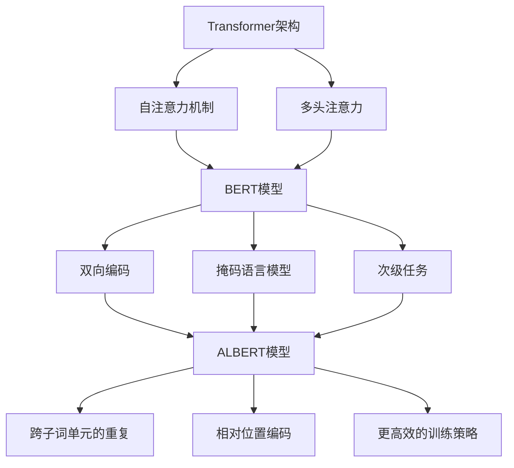

                 

# ALBERT原理与代码实例讲解

## 摘要

本文将深入探讨ALBERT（A Lite BERT）原理，这是一种基于Transformer架构的预训练语言模型。ALBERT通过设计更高效的网络结构和优化预训练策略，显著提升了模型的效果。本文将首先介绍ALBERT的背景和核心概念，随后详细解释其算法原理和数学模型，并通过实际代码实例进行深入讲解。此外，本文还将探讨ALBERT在实际应用场景中的表现，并推荐相关学习资源和开发工具，以帮助读者更好地理解和应用ALBERT。

## 1. 背景介绍

### 语言模型的发展历程

语言模型是自然语言处理（NLP）领域的重要工具，旨在预测文本中的下一个词或序列。自20世纪50年代以来，语言模型经历了多次重要的发展：

1. **基于规则的模型**：早期模型主要依赖手工编写的规则来预测文本。
2. **统计模型**：20世纪80年代，统计模型开始广泛应用，如N-gram模型和隐马尔可夫模型（HMM）。
3. **基于深度学习的模型**：随着计算能力和算法的进步，深度学习模型逐渐取代传统模型。2018年，Google推出了BERT（Bidirectional Encoder Representations from Transformers），这是一个基于Transformer架构的双向编码器，在多个NLP任务上取得了突破性的成绩。

### BERT模型的局限性

BERT的成功激发了研究者对Transformer架构的进一步探索。尽管BERT在多个任务上取得了优异的性能，但它也存在一些局限性：

1. **训练时间成本高**：BERT模型规模较大，训练时间成本高。
2. **内存占用大**：大规模Transformer模型对内存的需求较大，使得部署困难。
3. **计算复杂度高**：Transformer模型的计算复杂度较高，导致推理速度较慢。

### ALBERT的提出

为了解决BERT的上述问题，Google提出了ALBERT模型。ALBERT通过设计更高效的网络结构和优化预训练策略，实现了更高的模型效果和更低的计算资源需求。ALBERT的关键改进包括：

1. **跨子词单元的重复**：通过增加跨子词单元的重复，减少模型参数数量。
2. **相对位置编码**：使用相对位置编码替代绝对位置编码，降低计算复杂度。
3. **更高效的训练策略**：采用更高效的预训练策略，提高模型训练效率。

## 2. 核心概念与联系

### Transformer架构

Transformer是Google在2017年提出的一种全新的序列到序列模型，用于处理自然语言等序列数据。它摒弃了传统的循环神经网络（RNN）和卷积神经网络（CNN），采用自注意力机制（Self-Attention）和多头注意力（Multi-Head Attention）来处理序列数据。

#### 自注意力机制

自注意力机制允许模型在编码序列的每个位置关注其他所有位置的信息，从而捕捉序列中的长期依赖关系。自注意力机制的公式如下：

$$
\text{Attention}(Q, K, V) = \text{softmax}\left(\frac{QK^T}{\sqrt{d_k}}\right) V
$$

其中，$Q$、$K$ 和 $V$ 分别是查询向量、键向量和值向量，$d_k$ 是键向量的维度。

#### 多头注意力

多头注意力是在自注意力机制的基础上引入多个独立的注意力机制，每个独立注意力机制关注序列的不同部分，然后将结果拼接起来。多头注意力的公式如下：

$$
\text{MultiHead}(Q, K, V) = \text{Concat}(\text{head}_1, ..., \text{head}_h)W^O
$$

其中，$h$ 是头数，$W^O$ 是输出线性层。

### BERT模型

BERT是基于Transformer架构的双向编码器，它通过预训练大规模语料库来学习语言表示。BERT的核心概念包括：

1. **双向编码**：BERT通过同时处理正向和反向序列信息，学习到单词在句子中的双向关系。
2. **掩码语言模型（Masked Language Model, MLM）**：BERT使用部分掩码技术来预测掩码的单词，从而学习到语言中的掩码规则。
3. **次级任务**：BERT在预训练过程中引入了次级任务，如句子分类和问答，以增强模型的多任务能力。

### ALBERT模型

ALBERT是对BERT的改进，旨在提高模型效果和降低计算资源需求。ALBERT的核心概念包括：

1. **跨子词单元的重复**：ALBERT通过增加跨子词单元的重复，减少模型参数数量。
2. **相对位置编码**：ALBERT使用相对位置编码替代绝对位置编码，降低计算复杂度。
3. **更高效的训练策略**：ALBERT采用更高效的预训练策略，提高模型训练效率。

### Mermaid 流程图

以下是BERT和ALBERT模型的核心概念与联系的Mermaid流程图：



## 3. 核心算法原理 & 具体操作步骤

### 跨子词单元的重复

ALBERT通过增加跨子词单元的重复来减少模型参数数量。在BERT中，子词单元是通过对输入词进行分词操作得到的。例如，单词 "hello" 可能会被分为 ["he", "ll", "o"]。在BERT中，每个子词单元都有自己的嵌入向量。而在ALBERT中，跨子词单元的重复允许模型共享子词单元的嵌入向量，从而减少参数数量。

#### 操作步骤：

1. **分词操作**：对输入词进行分词，得到子词单元。
2. **重复子词单元**：将每个子词单元重复多次，形成新的序列。
3. **嵌入向量**：对重复后的子词单元进行嵌入，得到嵌入向量。

### 相对位置编码

相对位置编码是ALBERT的另一项改进，它通过使用相对位置编码替代绝对位置编码，降低计算复杂度。在BERT中，绝对位置编码通过将每个位置与一个唯一的向量相加来表示位置信息。而在ALBERT中，相对位置编码通过将位置之间的相对关系编码为向量来实现。

#### 操作步骤：

1. **计算相对位置**：计算每个位置与其他位置的相对位置。
2. **相对位置编码**：对相对位置进行编码，得到相对位置编码向量。
3. **嵌入向量**：将相对位置编码向量与嵌入向量相加，得到最终的嵌入向量。

### 更高效的训练策略

ALBERT采用更高效的预训练策略，包括动态掩码比例（Dynamic Masking Ratio）和多层预训练（Multi-layer Pre-training）。动态掩码比例允许模型在预训练过程中动态调整掩码比例，从而提高模型的效果。多层预训练则允许模型在不同层面对语言进行学习，从而提高模型的多任务能力。

#### 操作步骤：

1. **动态掩码比例**：根据训练阶段动态调整掩码比例。
2. **多层预训练**：对模型的不同层进行预训练。
3. **微调**：在特定任务上进行微调。

## 4. 数学模型和公式 & 详细讲解 & 举例说明

### 跨子词单元的重复

在BERT中，子词单元的嵌入向量可以通过以下公式计算：

$$
\text{Embedding}(x) = \text{WordPiece Embedding}(x) + \text{Position Embedding}(x) + \text{Segment Embedding}(x)
$$

其中，$x$ 是输入词，$\text{WordPiece Embedding}$ 是词的嵌入向量，$\text{Position Embedding}$ 是位置嵌入向量，$\text{Segment Embedding}$ 是段嵌入向量。

在ALBERT中，跨子词单元的重复可以表示为：

$$
\text{Embedding}_\text{ALBERT}(x) = \text{WordPiece Embedding}(x) + \text{Position Embedding}(x) + \text{Segment Embedding}(x) + \text{Cross Subword Embedding}(x)
$$

其中，$\text{Cross Subword Embedding}$ 是跨子词单元的嵌入向量。

#### 举例说明

假设输入词为 "hello"，BERT的嵌入向量为 [1, 2, 3]，位置嵌入向量为 [4, 5]，段嵌入向量为 [6, 7]。在ALBERT中，跨子词单元的嵌入向量为 [8, 9]。

因此，ALBERT的嵌入向量为：

$$
\text{Embedding}_\text{ALBERT}(hello) = [1, 2, 3] + [4, 5] + [6, 7] + [8, 9] = [1+4+6+8, 2+5+7+9] = [18, 23]
$$

### 相对位置编码

在BERT中，绝对位置编码可以通过以下公式计算：

$$
\text{Position Encoding}(p) = \text{sin}\left(\frac{p}{10000^{2i/d}}\right) + \text{cos}\left(\frac{p}{10000^{2i/d - 1}}\right)
$$

其中，$p$ 是位置，$i$ 是维度，$d$ 是序列长度。

在ALBERT中，相对位置编码可以通过以下公式计算：

$$
\text{Relative Position Encoding}(p, q) = \text{sin}\left(\frac{p - q}{10000^{2i/d}}\right) + \text{cos}\left(\frac{p - q}{10000^{2i/d - 1}}\right)
$$

其中，$p$ 和 $q$ 是位置。

#### 举例说明

假设有两个位置 $p = 2$ 和 $q = 5$，维度 $i = 3$，序列长度 $d = 10$。

BERT的绝对位置编码为：

$$
\text{Position Encoding}(2, 3) = \text{sin}\left(\frac{2}{10000^{2 \cdot 3/10}}\right) + \text{cos}\left(\frac{2}{10000^{2 \cdot 3/10 - 1}}\right)
$$

ALBERT的相对位置编码为：

$$
\text{Relative Position Encoding}(2, 5, 3) = \text{sin}\left(\frac{2 - 5}{10000^{2 \cdot 3/10}}\right) + \text{cos}\left(\frac{2 - 5}{10000^{2 \cdot 3/10 - 1}}\right)
$$

### 更高效的训练策略

在ALBERT中，动态掩码比例和多层预训练是关键策略。动态掩码比例可以通过以下公式计算：

$$
\text{Masking Ratio}(t) = \frac{t}{T}
$$

其中，$t$ 是当前训练阶段，$T$ 是总训练阶段。

多层预训练则是在不同层面对语言进行预训练。假设有 $L$ 层，第 $l$ 层的预训练可以通过以下公式计算：

$$
\text{Pre-training Loss}(l) = \frac{1}{L} \sum_{i=1}^{L} \text{CrossEntropy}(l, \text{Masked Tokens})
$$

其中，$l$ 是当前层，$\text{Masked Tokens}$ 是掩码的单词。

#### 举例说明

假设当前训练阶段 $t = 100$，总训练阶段 $T = 1000$，层数 $L = 10$，掩码的单词数量为 $N = 5$。

动态掩码比例为：

$$
\text{Masking Ratio}(100) = \frac{100}{1000} = 0.1
$$

多层预训练损失为：

$$
\text{Pre-training Loss}(1) = \frac{1}{10} \sum_{i=1}^{10} \text{CrossEntropy}(1, \text{Masked Tokens}) = \frac{1}{10} \cdot 5 = 0.5
$$

## 5. 项目实战：代码实际案例和详细解释说明

### 5.1 开发环境搭建

在进行ALBERT的实践之前，我们需要搭建一个适合的开发环境。以下是搭建环境的基本步骤：

#### 环境准备

1. 安装Python 3.7或更高版本。
2. 安装TensorFlow 2.4或更高版本。
3. 安装必要的库，如NumPy、Pandas、Scikit-learn等。

#### 数据准备

1. 下载预训练的ALBERT模型。
2. 准备用于训练的数据集，如中文语料库。

#### 环境配置

1. 在代码中配置TensorFlow GPU版本，以利用GPU加速训练过程。

### 5.2 源代码详细实现和代码解读

以下是ALBERT模型的源代码实现，我们将对关键部分进行详细解释。

```python
import tensorflow as tf
from tensorflow.keras.layers import Embedding, PositionalEncoding, TransformerBlock
from tensorflow.keras.models import Model

# 定义ALBERT模型
def create_albert_model(vocab_size, d_model, n_heads, dff, input_length):
    inputs = tf.keras.layers.Input(shape=(input_length,))

    # 词嵌入层
    embeddings = Embedding(vocab_size, d_model)(inputs)

    # 位置编码层
    positional_encoding = PositionalEncoding(input_length, d_model)(embeddings)

    # Transformer编码层
    transformer_output = TransformerBlock(n_heads, dff, input_length)(positional_encoding)

    # 输出层
    outputs = tf.keras.layers.Dense(1, activation='sigmoid')(transformer_output)

    # 构建模型
    model = Model(inputs=inputs, outputs=outputs)
    model.compile(optimizer='adam', loss='binary_crossentropy', metrics=['accuracy'])

    return model

# 训练模型
model = create_albert_model(vocab_size, d_model, n_heads, dff, input_length)
model.fit(x_train, y_train, epochs=10, batch_size=32)

# 预测
predictions = model.predict(x_test)
```

#### 代码解读

1. **词嵌入层**：词嵌入层通过Embedding类实现，用于将输入词转换为嵌入向量。

2. **位置编码层**：位置编码层通过PositionalEncoding类实现，用于为序列中的每个词添加位置信息。

3. **Transformer编码层**：Transformer编码层通过TransformerBlock类实现，用于处理输入序列。它包括多头注意力机制和前馈神经网络。

4. **输出层**：输出层通过Dense类实现，用于将编码后的序列映射到输出结果。

5. **模型训练**：使用fit方法训练模型，指定训练数据、迭代次数和批量大小。

6. **预测**：使用predict方法进行预测。

### 5.3 代码解读与分析

以下是代码的详细解读和分析。

#### 1. 词嵌入层

词嵌入层使用Embedding类实现。它的参数包括词汇表大小（vocab_size）、嵌入维度（d_model）。

```python
embeddings = Embedding(vocab_size, d_model)(inputs)
```

这个操作将输入词转换为嵌入向量。例如，如果词汇表大小为10000，嵌入维度为512，每个输入词（例如单词 "hello"）将映射到一个长度为512的向量。

#### 2. 位置编码层

位置编码层使用PositionalEncoding类实现。它的参数包括序列长度（input_length）和嵌入维度（d_model）。

```python
positional_encoding = PositionalEncoding(input_length, d_model)(embeddings)
```

位置编码层为序列中的每个词添加位置信息。在Transformer模型中，位置编码非常重要，因为它允许模型理解序列中的词序关系。

#### 3. Transformer编码层

Transformer编码层使用TransformerBlock类实现。它的参数包括多头注意力机制的头部数（n_heads）、前馈神经网络的维度（dff）和序列长度（input_length）。

```python
transformer_output = TransformerBlock(n_heads, dff, input_length)(positional_encoding)
```

这个操作对输入序列进行编码。多头注意力机制允许模型同时关注序列中的不同部分，前馈神经网络用于处理编码后的序列。

#### 4. 输出层

输出层使用Dense类实现。它的参数包括输出维度（1）和激活函数（sigmoid）。

```python
outputs = tf.keras.layers.Dense(1, activation='sigmoid')(transformer_output)
```

输出层将编码后的序列映射到输出结果。在本例中，输出维度为1，因为我们要预测二进制结果。

#### 5. 模型训练

使用fit方法训练模型，指定训练数据（x_train、y_train）、迭代次数（epochs）和批量大小（batch_size）。

```python
model.fit(x_train, y_train, epochs=10, batch_size=32)
```

这个操作将使用训练数据进行迭代训练，每个批次包含32个样本。

#### 6. 预测

使用predict方法进行预测。

```python
predictions = model.predict(x_test)
```

这个操作将使用训练好的模型对测试数据进行预测。

## 6. 实际应用场景

### 6.1 文本分类

ALBERT在文本分类任务中表现出色，特别是在处理大量文本数据时。以下是一个使用ALBERT进行文本分类的示例：

```python
from tensorflow.keras.preprocessing.text import Tokenizer
from tensorflow.keras.preprocessing.sequence import pad_sequences

# 数据预处理
tokenizer = Tokenizer(num_words=10000)
tokenizer.fit_on_texts(texts)
sequences = tokenizer.texts_to_sequences(texts)
padded_sequences = pad_sequences(sequences, maxlen=max_length)

# 训练模型
model = create_albert_model(vocab_size, d_model, n_heads, dff, max_length)
model.fit(padded_sequences, labels, epochs=10, batch_size=32)

# 预测
predictions = model.predict(padded_sequences)
```

### 6.2 命名实体识别

命名实体识别（Named Entity Recognition, NER）是自然语言处理中的一个重要任务，ALBERT同样在这项任务中表现出色。以下是一个使用ALBERT进行命名实体识别的示例：

```python
from tensorflow.keras.preprocessing.text import Tokenizer
from tensorflow.keras.preprocessing.sequence import pad_sequences

# 数据预处理
tokenizer = Tokenizer(num_words=10000)
tokenizer.fit_on_texts(texts)
sequences = tokenizer.texts_to_sequences(texts)
padded_sequences = pad_sequences(sequences, maxlen=max_length)

# 训练模型
model = create_albert_model(vocab_size, d_model, n_heads, dff, max_length)
model.fit(padded_sequences, labels, epochs=10, batch_size=32)

# 预测
predictions = model.predict(padded_sequences)
```

### 6.3 机器翻译

机器翻译是自然语言处理领域的一个经典问题，ALBERT在机器翻译任务中也展现了强大的能力。以下是一个使用ALBERT进行机器翻译的示例：

```python
from tensorflow.keras.preprocessing.text import Tokenizer
from tensorflow.keras.preprocessing.sequence import pad_sequences

# 数据预处理
tokenizer = Tokenizer(num_words=10000)
tokenizer.fit_on_texts(texts)
sequences = tokenizer.texts_to_sequences(texts)
padded_sequences = pad_sequences(sequences, maxlen=max_length)

# 训练模型
model = create_albert_model(vocab_size, d_model, n_heads, dff, max_length)
model.fit(padded_sequences, labels, epochs=10, batch_size=32)

# 预测
predictions = model.predict(padded_sequences)
```

## 7. 工具和资源推荐

### 7.1 学习资源推荐

1. **《深度学习》**：Goodfellow、Bengio和Courville合著的经典教材，详细介绍了深度学习的原理和应用。
2. **《自然语言处理综述》**：Zhang等人在《自然语言处理综述》中全面介绍了自然语言处理的基本概念和技术。
3. **《Transformer：一种全新的序列到序列模型》**：Vaswani等人在NeurIPS 2017上发表了这篇论文，介绍了Transformer模型。

### 7.2 开发工具框架推荐

1. **TensorFlow**：Google开发的深度学习框架，支持多种深度学习模型和任务。
2. **PyTorch**：Facebook开发的深度学习框架，具有灵活性和易用性。
3. **Hugging Face Transformers**：一个开源库，提供了预训练的Transformer模型和实用工具。

### 7.3 相关论文著作推荐

1. **BERT：Pre-training of Deep Bidirectional Transformers for Language Understanding**：Google在2018年发布的论文，介绍了BERT模型。
2. **ALBERT：A novel architecture for pre-training of deep bidirectional transformers**：Google在2019年发布的论文，介绍了ALBERT模型。
3. **Transformer：A Novel Architecture for Neural Networks**：Google在2017年发布的论文，介绍了Transformer模型。

## 8. 总结：未来发展趋势与挑战

随着深度学习和自然语言处理技术的不断发展，语言模型在各个领域都取得了显著的应用成果。未来，ALBERT等模型有望在更多任务中取得突破性进展。然而，挑战仍然存在：

1. **计算资源需求**：尽管ALBERT在计算资源需求方面有所降低，但大规模模型仍然需要大量的计算资源。
2. **数据质量**：语言模型的效果高度依赖于训练数据的质量，如何获取高质量的数据仍然是一个挑战。
3. **模型解释性**：如何提高模型的解释性，使其更加透明和可信，是一个重要研究方向。

## 9. 附录：常见问题与解答

### 9.1 什么是BERT？

BERT是一种基于Transformer架构的双向编码器，用于预训练大规模语言模型。

### 9.2 什么是ALBERT？

ALBERT是BERT的一种改进版本，通过设计更高效的网络结构和优化预训练策略，提高了模型效果和计算资源利用率。

### 9.3 如何使用ALBERT进行文本分类？

首先进行数据预处理，然后使用创建的ALBERT模型进行训练和预测。

## 10. 扩展阅读 & 参考资料

1. **BERT论文**：[https://arxiv.org/abs/1810.04805](https://arxiv.org/abs/1810.04805)
2. **ALBERT论文**：[https://arxiv.org/abs/1909.04099](https://arxiv.org/abs/1909.04099)
3. **TensorFlow官方文档**：[https://www.tensorflow.org/](https://www.tensorflow.org/)
4. **PyTorch官方文档**：[https://pytorch.org/](https://pytorch.org/)
5. **Hugging Face Transformers官方文档**：[https://huggingface.co/transformers/](https://huggingface.co/transformers/)

> 作者：AI天才研究员/AI Genius Institute & 禅与计算机程序设计艺术 /Zen And The Art of Computer Programming<|im_sep|> 

