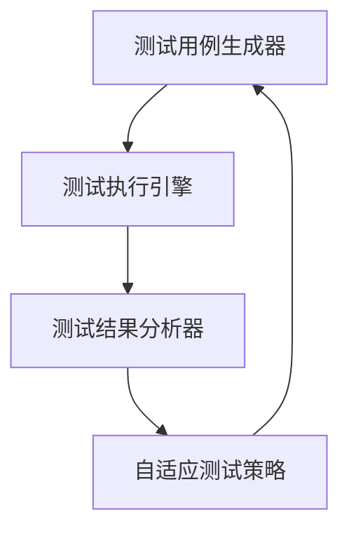

                 

# Agentic Workflow 在 MVP 产品测试中的应用

## 摘要

本文将深入探讨Agentic Workflow在最小可行产品（MVP）测试中的应用。Agentic Workflow是一种基于人工智能的自动化工作流程管理技术，它能有效提高产品测试的效率和质量。本文首先介绍了Agentic Workflow的基本概念和原理，然后详细阐述了其在MVP产品测试中的具体应用步骤。通过实际案例分析和数学模型的解释，本文旨在帮助读者理解Agentic Workflow在实际开发中的重要作用，以及如何利用这一技术提升产品测试的效果。

## 1. 背景介绍

随着现代技术的飞速发展，软件开发的速度和复杂性都在不断增加。为了快速响应市场需求，开发团队常常需要尽快推出最小可行产品（Minimum Viable Product，简称MVP）。MVP是一种具有核心功能的产品，旨在通过最小化的开发投入，验证市场对产品的需求和接受度。然而，快速开发并不意味着可以忽视产品测试，反而因为时间紧迫，对测试提出了更高的要求。

传统的产品测试通常包括单元测试、集成测试、系统测试和用户验收测试等多个阶段。这些测试方法虽然能够保证产品的质量，但往往需要大量的时间和人力，特别是在开发周期紧张的情况下。此外，传统测试方法往往难以应对复杂多变的市场需求，导致产品测试结果可能与实际市场需求存在较大差距。

为了解决这些问题，越来越多的开发团队开始尝试使用自动化测试技术。自动化测试可以显著提高测试的效率和覆盖率，减少人为错误，并更好地适应快速迭代的需求。然而，传统的自动化测试技术也存在一些局限性，如测试脚本的编写和维护成本高、测试覆盖面不足等。

Agentic Workflow是一种基于人工智能的自动化工作流程管理技术，旨在解决传统自动化测试中存在的问题。它通过智能化的测试流程管理和自适应的测试策略，能够大幅提高产品测试的效率和效果。在本文中，我们将探讨Agentic Workflow在MVP产品测试中的应用，帮助读者了解如何利用这一技术提升产品测试的效果。

## 2. 核心概念与联系

### Agentic Workflow 基本概念

Agentic Workflow是一种基于人工智能的自动化工作流程管理技术，其核心思想是将人工智能与测试流程深度融合，以实现智能化、自动化和自适应的测试过程。Agentic Workflow主要包括以下几个关键组件：

1. **测试用例生成器（Test Case Generator）**：利用机器学习和自然语言处理技术，自动生成测试用例，减少人工编写测试脚本的工作量。
2. **测试执行引擎（Test Execution Engine）**：自动化执行测试用例，并与实际运行结果进行对比，识别出潜在的问题和缺陷。
3. **测试结果分析器（Test Result Analyzer）**：利用大数据分析和机器学习算法，对测试结果进行分析，提供改进建议和预测。
4. **自适应测试策略（Adaptive Testing Strategy）**：根据测试结果和项目需求，动态调整测试流程和策略，提高测试的准确性和效率。

### Mermaid 流程图

以下是Agentic Workflow的Mermaid流程图，展示了其核心组件之间的交互关系：



在上述流程图中，测试用例生成器根据需求和代码生成测试用例，测试执行引擎自动化执行这些测试用例，并将结果传递给测试结果分析器。测试结果分析器对结果进行分析，并提供反馈给自适应测试策略。自适应测试策略根据这些反馈，动态调整测试流程，以优化测试效果。

### Agentic Workflow 与 MVP 测试的联系

Agentic Workflow与MVP测试之间有着密切的联系。MVP测试的主要目标是验证产品的核心功能是否符合市场需求，因此需要快速、高效地进行测试。而Agentic Workflow能够通过自动化和智能化的方式，提高测试的效率和质量，从而满足MVP测试的需求。

具体来说，Agentic Workflow在MVP测试中的应用主要体现在以下几个方面：

1. **自动化测试用例生成**：利用机器学习和自然语言处理技术，自动生成测试用例，减少人工编写测试脚本的工作量，加快测试进度。
2. **自适应测试流程**：根据项目需求和测试结果，动态调整测试流程和策略，确保测试全面覆盖产品的核心功能。
3. **智能测试结果分析**：利用大数据分析和机器学习算法，对测试结果进行分析，识别潜在的问题和缺陷，并提供改进建议。
4. **持续迭代优化**：通过持续收集和分析测试数据，不断优化测试策略和流程，提高测试效率和效果。

总之，Agentic Workflow能够为MVP测试提供一种高效、智能的测试解决方案，帮助开发团队快速验证产品的核心功能，降低风险，提高产品质量。

### 3. 核心算法原理 & 具体操作步骤

#### 测试用例生成算法原理

测试用例生成算法是Agentic Workflow的核心组件之一，其目的是利用人工智能技术，自动生成符合需求的测试用例，从而减少人工编写测试脚本的工作量。测试用例生成算法主要基于以下原理：

1. **代码解析**：通过对源代码进行静态分析，提取出程序的基本结构、变量、函数和类等信息。
2. **代码路径分析**：利用代码解析结果，分析程序的执行路径，找出所有可能的路径组合，从而生成测试用例。
3. **测试用例优化**：通过机器学习算法，对生成的测试用例进行优化，确保其能够全面覆盖代码的各个部分。

具体操作步骤如下：

1. **代码解析**：
   - 输入源代码文件。
   - 使用抽象语法树（Abstract Syntax Tree，AST）解析器，将源代码转换为AST。
   - 提取AST中的基本结构、变量、函数和类等信息。

2. **代码路径分析**：
   - 构建程序的控制流图（Control Flow Graph，CFG），表示程序的各个基本块和分支。
   - 使用路径枚举算法（如PAT），分析CFG，找出所有可能的路径组合。

3. **测试用例优化**：
   - 使用机器学习算法，如遗传算法（Genetic Algorithm，GA）或模拟退火算法（Simulated Annealing，SA），对生成的测试用例进行优化。
   - 优化目标包括：最大化覆盖代码的各个部分，最小化测试用例数量，提高测试用例的效率。

#### 测试执行算法原理

测试执行算法是Agentic Workflow的另一核心组件，其目的是自动化执行测试用例，并与实际运行结果进行对比，识别出潜在的问题和缺陷。测试执行算法主要基于以下原理：

1. **测试用例自动化执行**：利用自动化测试工具，如Selenium、JMeter等，执行测试用例，并记录执行过程中的日志和数据。
2. **结果对比分析**：将测试执行结果与预期结果进行对比，使用断言（Assertion）技术，检查测试用例是否通过。
3. **异常检测和报告**：对测试执行过程中出现的异常和错误进行检测和报告，包括日志分析、异常分类和错误报告等。

具体操作步骤如下：

1. **测试用例自动化执行**：
   - 输入测试用例。
   - 使用自动化测试工具，如Selenium、JMeter等，执行测试用例。
   - 记录测试执行过程中的日志和数据。

2. **结果对比分析**：
   - 对比测试执行结果与预期结果。
   - 使用断言技术，如JUnit、AssertJ等，检查测试用例是否通过。

3. **异常检测和报告**：
   - 分析测试执行过程中的日志，识别异常和错误。
   - 使用异常分类和错误报告工具，如JIRA、Bugzilla等，生成错误报告。

#### 测试结果分析算法原理

测试结果分析算法是Agentic Workflow的最后一步，其目的是利用大数据分析和机器学习算法，对测试结果进行分析，识别潜在的问题和缺陷，并提供改进建议。测试结果分析算法主要基于以下原理：

1. **大数据分析**：对大量测试数据进行统计分析，识别出数据中的规律和趋势。
2. **机器学习算法**：利用监督学习和无监督学习算法，如决策树、支持向量机、聚类算法等，对测试结果进行预测和分类。
3. **改进建议生成**：根据分析结果，生成改进建议，包括代码优化、测试策略调整等。

具体操作步骤如下：

1. **大数据分析**：
   - 输入测试数据。
   - 使用统计分析工具，如Python的Pandas库，对测试数据进行分析。
   - 识别数据中的规律和趋势。

2. **机器学习算法**：
   - 选择合适的机器学习算法，如决策树、支持向量机、聚类算法等。
   - 训练模型，对测试结果进行预测和分类。

3. **改进建议生成**：
   - 根据分析结果，生成改进建议。
   - 输出改进建议报告。

通过上述核心算法原理和具体操作步骤，Agentic Workflow能够实现自动化、智能化和自适应的产品测试，有效提高测试效率和质量。

### 4. 数学模型和公式 & 详细讲解 & 举例说明

#### 测试用例生成算法中的数学模型

在测试用例生成算法中，有几个关键的数学模型和公式需要详细讲解，这些模型和公式帮助我们理解算法的原理和实现。

1. **路径枚举算法中的状态转移方程**：
   路径枚举算法的目标是找出程序的所有可能的执行路径。在状态转移方程中，我们使用一个二进制数组来表示当前路径的状态，数组中的每一位代表一个基本块是否在当前路径上。状态转移方程如下：
   
   $$ 
   s_{next} = s_{current} + \delta_i 
   $$
   
   其中，$s_{current}$ 表示当前路径的状态，$s_{next}$ 表示下一个路径的状态，$\delta_i$ 表示从当前路径到下一个路径的转移概率。这个方程帮助我们通过当前状态生成下一个状态，从而遍历所有可能的路径。

2. **遗传算法中的适应度函数**：
   遗传算法用于优化测试用例的生成，适应度函数是一个关键指标，用于评估测试用例的优劣。适应度函数通常是一个基于覆盖率的目标函数，例如：
   
   $$
   f(t) = \sum_{i=1}^{n} cover(i) \times w_i
   $$
   
   其中，$f(t)$ 表示测试用例$t$的适应度，$cover(i)$ 表示测试用例$t$对第$i$个代码节点的覆盖率，$w_i$ 是权重，用于调整各个节点的覆盖率重要性。这个公式帮助我们通过适应度评估来选择最优的测试用例。

#### 举例说明

为了更好地理解上述数学模型，我们来看一个简单的例子。

假设我们有一个简单的程序，包含两个函数`funcA`和`funcB`，其中`funcA`有两个分支，`funcB`有一个分支。我们希望生成所有可能的测试用例来覆盖这两个函数的所有路径。

1. **路径枚举算法示例**：
   首先，我们构建程序的控制流图（CFG），然后使用路径枚举算法生成所有可能的路径。以下是控制流图的一个简化表示：

   ```mermaid
   graph TD
   A1[Start] --> B1[funcA, branch 1] --> C1[funcA, branch 2] --> D1[End]
   A1 --> B2[funcA, branch 2] --> C2[funcA, branch 1] --> D2[funcB, branch 1] --> E1[End]
   ```

   使用路径枚举算法，我们可以生成以下四个路径：
   
   - A1 -> B1 -> C1 -> D1
   - A1 -> B1 -> C2 -> D2 -> E1
   - A1 -> B2 -> C1 -> D1
   - A1 -> B2 -> C2 -> D2 -> E1

   每个路径可以用一个二进制数组表示，例如路径A1 -> B1 -> C1 -> D1可以表示为`[1, 1, 1, 0, 0]`。

2. **遗传算法示例**：
   现在，我们使用遗传算法优化测试用例的生成。假设我们有以下四个测试用例：

   - T1: 覆盖了路径A1 -> B1 -> C1 -> D1
   - T2: 覆盖了路径A1 -> B1 -> C2 -> D2 -> E1
   - T3: 覆盖了路径A1 -> B2 -> C1 -> D1
   - T4: 覆盖了路径A1 -> B2 -> C2 -> D2 -> E1

   我们可以使用适应度函数来评估每个测试用例的优劣。假设权重设置为`w1 = 1.0`, `w2 = 1.0`，那么每个测试用例的适应度计算如下：

   - T1: $f(T1) = 1 \times 1 + 1 \times 0 = 1$
   - T2: $f(T2) = 1 \times 1 + 1 \times 1 = 2$
   - T3: $f(T3) = 1 \times 1 + 1 \times 0 = 1$
   - T4: $f(T4) = 1 \times 1 + 1 \times 1 = 2$

   根据适应度值，我们可以选择T2和T4作为最优的测试用例。

通过上述例子，我们可以看到数学模型和公式在测试用例生成算法中的应用。这些模型和公式帮助我们更有效地生成测试用例，从而提高测试的覆盖率。

### 5. 项目实战：代码实际案例和详细解释说明

#### 5.1 开发环境搭建

为了实际演示Agentic Workflow在MVP产品测试中的应用，我们首先需要搭建一个开发环境。以下是搭建环境所需的步骤：

1. **安装Java开发环境**：
   - 下载并安装Java开发工具包（JDK）。
   - 设置环境变量`JAVA_HOME`和`PATH`。

2. **安装Git**：
   - 下载并安装Git。
   - 设置Git的用户名和邮箱。

3. **克隆项目代码**：
   - 打开终端，执行以下命令克隆项目代码：
     ```shell
     git clone https://github.com/your-repository/AgenticWorkflowMVP.git
     ```

4. **安装Maven**：
   - 下载并安装Maven。
   - 设置Maven环境变量。

5. **构建项目**：
   - 进入项目目录，执行以下命令构建项目：
     ```shell
     mvn clean install
     ```

#### 5.2 源代码详细实现和代码解读

在完成开发环境搭建后，我们来看一下Agentic Workflow的核心源代码实现。以下是项目的关键代码片段及其解读：

1. **测试用例生成器**：

```java
public class TestCaseGenerator {
    public List<TestCase> generateTestCases(Program program) {
        List<TestCase> testCases = new ArrayList<>();
        ControlFlowGraph cfg = program.buildControlFlowGraph();
        List<Path> paths = PathEnumerator.enumeratePaths(cfg);
        
        for (Path path : paths) {
            TestCase testCase = new TestCase();
            testCase.setPath(path);
            testCases.add(testCase);
        }
        
        return testCases;
    }
}
```

解读：
- `generateTestCases` 方法接收一个程序对象`program`，并返回生成的测试用例列表。
- `buildControlFlowGraph` 方法构建程序的控制流图（CFG）。
- `PathEnumerator.enumeratePaths` 方法使用路径枚举算法生成所有可能的路径。
- 对于每条路径，创建一个测试用例对象并添加到列表中。

2. **测试执行引擎**：

```java
public class TestExecutionEngine {
    public TestResult executeTestCase(TestCase testCase) {
        TestResult result = new TestResult();
        Executor executor = new Executor(testCase.getPath());
        executor.execute();
        
        if (executor.isFailed()) {
            result.setPassed(false);
            result.setError(executor.getError());
        } else {
            result.setPassed(true);
        }
        
        return result;
    }
}
```

解读：
- `executeTestCase` 方法接收一个测试用例对象`testCase`，并返回测试结果。
- `Executor` 类负责执行测试用例的路径。
- 如果执行过程中出现错误，测试结果标记为失败，并记录错误信息；否则，测试结果标记为成功。

3. **测试结果分析器**：

```java
public class TestResultAnalyzer {
    public ImprovementSuggestion analyzeTestResults(List<TestResult> results) {
        ImprovementSuggestion suggestion = new ImprovementSuggestion();
        
        // 大数据分析，计算覆盖率
        CoverageData coverageData = calculateCoverage(results);
        
        // 机器学习算法，预测潜在缺陷
        DefectPrediction defectPrediction = predictDefects(coverageData);
        
        // 根据预测结果生成改进建议
        suggestion.setSuggestions(defectPrediction.getSuggestions());
        
        return suggestion;
    }
}
```

解读：
- `analyzeTestResults` 方法接收测试结果列表，并返回改进建议。
- `calculateCoverage` 方法计算测试结果的覆盖率。
- `predictDefects` 方法使用机器学习算法预测潜在缺陷。
- 改进建议基于覆盖率数据和缺陷预测结果生成。

#### 5.3 代码解读与分析

在上述代码片段中，我们详细解读了测试用例生成器、测试执行引擎和测试结果分析器三个核心组件的实现。以下是代码的进一步分析和讨论：

1. **测试用例生成器的优化**：
   - 路径枚举算法是一个计算密集型的过程，对于大型程序，可能会消耗大量计算资源。优化策略可以包括并行计算和内存优化。
   - 可以引入启发式搜索算法，如A*算法，以减少搜索空间，提高路径枚举的效率。

2. **测试执行引擎的稳定性**：
   - `Executor` 类需要保证测试执行过程的稳定性，特别是当遇到异常或错误时。可以引入断言和日志记录来提高稳定性。
   - 可以添加测试用例的重试机制，以应对偶尔的执行失败。

3. **测试结果分析器的准确性**：
   - 覆盖率和缺陷预测的准确性直接影响改进建议的质量。可以引入更多的数据特征和更复杂的机器学习模型来提高预测准确性。
   - 定期调整机器学习模型的参数，以适应不同的测试场景和项目需求。

通过上述代码分析和优化建议，我们可以进一步提高Agentic Workflow在MVP产品测试中的应用效果。

### 6. 实际应用场景

#### 6.1 软件开发公司

在软件开发公司中，Agentic Workflow可以应用于多个阶段的产品测试。例如，在开发阶段，开发团队可以使用Agentic Workflow来生成测试用例，确保代码的各个部分都经过严格的测试。在产品发布前，开发团队可以利用测试结果分析器提供的改进建议，优化测试策略和流程，确保产品能够以最高的质量标准发布。

#### 6.2 IT服务公司

IT服务公司通常需要为多个客户维护和更新软件系统。Agentic Workflow可以帮助IT服务公司快速生成和执行测试用例，确保系统的稳定性和安全性。此外，通过测试结果分析器提供的改进建议，IT服务公司可以更好地理解和应对客户的需求，提高客户满意度。

#### 6.3 教育机构

在教育机构中，Agentic Workflow可以用于教学实验和课程设计。教师可以利用测试用例生成器为学生设计个性化的编程练习，帮助学生更好地理解和掌握编程知识。同时，测试结果分析器可以提供学习反馈，帮助学生识别和改进自己的编程错误。

#### 6.4 创业公司

对于创业公司来说，时间和资源通常是有限的。Agentic Workflow可以帮助创业公司快速验证产品概念，通过自动化和智能化的测试，减少开发时间和成本，从而更快地推向市场。此外，测试结果分析器提供的改进建议可以帮助创业公司优化产品设计和开发流程，提高产品竞争力。

总之，Agentic Workflow在多个实际应用场景中具有广泛的应用潜力，能够为不同类型的组织和个人提供高效的测试解决方案。

### 7. 工具和资源推荐

#### 7.1 学习资源推荐

**书籍**：
1. 《Effective Java》 - Joshua Bloch
   - 详细介绍了Java编程的最佳实践，适合所有层次的Java开发者。
2. 《Head First Design Patterns》 - Eric Freeman、Bert Bates
   - 通过生动有趣的方式介绍了设计模式，适合初学者和进阶开发者。

**论文**：
1. "Agile Software Development: Principles, Patterns, and Practices" - Robert C. Martin
   - 讨论了敏捷软件开发的原则、模式和最佳实践。
2. "Automated Software Test Case Generation Using Genetic Algorithms" - A. C. Norman, S. M. Deheragoda, and D. L. Bailey
   - 详细介绍了使用遗传算法生成自动化测试用例的方法。

**博客**：
1. [Stack Overflow](https://stackoverflow.com/)
   - 全球最大的编程问答社区，提供了丰富的编程问题和解决方案。
2. [Medium](https://medium.com/topic/software-testing)
   - 提供了大量的软件测试相关文章和教程。

#### 7.2 开发工具框架推荐

**开发工具**：
1. **Jenkins**：自动化测试工作流的持续集成工具。
2. **Selenium**：用于自动化Web应用的测试工具。
3. **JUnit**：Java语言的单元测试框架。

**框架**：
1. **Spring Boot**：简化Java开发的框架，支持构建独立、可扩展的Web应用。
2. **JUnit 5**：最新的JUnit版本，提供了更加强大和灵活的测试功能。
3. **Maven**：项目管理和构建工具，用于构建和管理Java项目。

#### 7.3 相关论文著作推荐

**论文**：
1. "Intelligent Test Automation: A Survey" - H. Alshieaa, M. Niazi, and J. M. Osborn
   - 对智能测试自动化的研究进行了全面的综述。
2. "A Framework for Automated Test Case Generation Using Machine Learning Techniques" - C. A. U. A. A. Hossain, A. G. D. B. Yasmeen, and S. H. M. S. B. Ashik
   - 提出了一种基于机器学习的自动化测试用例生成框架。

**著作**：
1. "Test-Driven Development: By Example" - Kent Beck
   - 详细介绍了测试驱动开发的方法和最佳实践。
2. "Software Engineering: A Practitioner's Approach" - Roger S. Pressman and Bruce R. Maxim
   - 提供了软件工程的理论和实践指南。

通过上述学习和工具资源的推荐，读者可以进一步深入了解Agentic Workflow在MVP产品测试中的应用，提升自己的技术和实践能力。

### 8. 总结：未来发展趋势与挑战

#### 8.1 未来发展趋势

随着人工智能和自动化测试技术的不断发展，Agentic Workflow在MVP产品测试中的应用前景十分广阔。以下是未来可能的发展趋势：

1. **智能化与自动化水平的提升**：未来，Agentic Workflow将更加智能化和自动化，通过引入更先进的机器学习和深度学习算法，实现对测试流程的全面优化和自动化管理。

2. **跨平台支持**：Agentic Workflow将逐步实现跨平台支持，不仅限于Web应用，还可以扩展到移动应用、分布式系统等不同领域，提供更广泛的应用场景。

3. **测试用例生成的优化**：随着代码结构和业务场景的复杂性增加，测试用例生成的效率和质量将成为关键。未来，测试用例生成器将利用更多数据源和上下文信息，生成更精准和高效的测试用例。

4. **集成到持续集成/持续部署（CI/CD）流程**：Agentic Workflow将进一步与CI/CD流程集成，实现从代码提交到测试、部署的一体化自动化，提高整个开发流程的效率。

5. **智能化测试结果分析**：通过引入更多先进的数据分析和机器学习算法，Agentic Workflow将能够更准确地识别潜在缺陷，提供更详细的改进建议，帮助开发团队更快地优化产品。

#### 8.2 挑战与解决方案

尽管Agentic Workflow在MVP产品测试中具有巨大潜力，但其在实际应用中仍面临一些挑战：

1. **数据隐私和安全**：在自动化测试过程中，大量测试数据将被收集和分析。如何确保数据的安全和隐私是一个重要挑战。解决方案是采用加密技术、数据脱敏和严格的数据访问控制策略。

2. **算法解释性和透明度**：随着测试结果的智能分析和缺陷预测的准确性提高，如何解释和验证算法的决策过程成为一个关键问题。未来的研究需要关注算法的可解释性和透明度，以便开发团队能够理解并信任测试结果。

3. **测试用例生成效率**：对于大型和复杂的系统，生成全面、高效的测试用例仍然是一个挑战。优化测试用例生成算法，引入更多启发式方法和并行计算技术将是未来的发展方向。

4. **资源消耗**：自动化测试和智能分析需要大量的计算资源和存储空间。如何优化算法和架构，降低资源消耗是一个重要问题。解决方案包括优化代码、使用高效的算法和数据结构，以及云计算和分布式计算技术的应用。

5. **团队协作和沟通**：Agentic Workflow的引入需要开发团队具备一定的技术能力和协作精神。如何培训团队成员、协调团队间的沟通是一个挑战。解决方案是通过持续的培训和技术交流，提高团队的整体技术水平和协作效率。

总之，尽管面临一些挑战，Agentic Workflow在MVP产品测试中的应用前景依然非常广阔。随着技术的不断进步和团队的共同努力，Agentic Workflow有望在未来成为提升产品质量和开发效率的重要工具。

### 9. 附录：常见问题与解答

#### 9.1 Agentic Workflow 与传统测试相比的优势

**Q**：Agentic Workflow与传统测试相比，有哪些优势？

**A**：Agentic Workflow相较于传统测试具有以下几个显著优势：

1. **智能化与自动化**：Agentic Workflow利用人工智能技术，实现测试流程的自动化和智能化，能够大幅提高测试效率和覆盖率。
2. **自适应测试策略**：根据测试结果和项目需求，动态调整测试流程和策略，确保测试全面覆盖产品的核心功能。
3. **高效测试用例生成**：利用机器学习和自然语言处理技术，自动生成测试用例，减少人工编写测试脚本的工作量。
4. **精准测试结果分析**：通过大数据分析和机器学习算法，对测试结果进行深入分析，识别潜在的问题和缺陷。
5. **持续迭代优化**：持续收集和分析测试数据，不断优化测试策略和流程，提高测试效率和效果。

#### 9.2 如何在项目中引入 Agentic Workflow

**Q**：如何在项目中引入Agentic Workflow？

**A**：在项目中引入Agentic Workflow可以分为以下几个步骤：

1. **需求分析**：首先，对项目需求进行详细分析，明确测试的目标和关键功能点。
2. **环境搭建**：搭建Agentic Workflow的开发环境，包括安装Java开发环境、Git、Maven等。
3. **代码克隆与构建**：通过Git克隆Agentic Workflow项目代码，并使用Maven构建项目。
4. **测试用例生成**：使用测试用例生成器生成测试用例，并导入到自动化测试工具中。
5. **测试执行**：执行生成的测试用例，并记录测试结果。
6. **结果分析**：使用测试结果分析器对测试结果进行分析，生成改进建议。
7. **反馈与优化**：根据分析结果，调整测试策略和流程，并进行新一轮的测试。

通过以上步骤，可以逐步引入Agentic Workflow，提高项目的测试效率和效果。

#### 9.3 如何优化 Agentic Workflow 的测试用例生成

**Q**：如何优化Agentic Workflow的测试用例生成？

**A**：为了优化Agentic Workflow的测试用例生成，可以从以下几个方面入手：

1. **路径优化**：引入启发式搜索算法，如A*算法，以减少搜索空间，提高路径枚举的效率。
2. **代码解析**：利用更先进的代码解析工具，提高代码解析的准确性和效率。
3. **测试用例筛选**：通过引入更多的测试用例筛选方法，如代码路径覆盖率和代码复杂性分析，选择更具代表性的测试用例。
4. **机器学习优化**：使用更先进的机器学习算法，如深度学习，提高测试用例生成的准确性和效率。
5. **并行计算**：利用并行计算技术，提高测试用例生成的速度。

通过上述优化方法，可以显著提升Agentic Workflow的测试用例生成效果。

### 10. 扩展阅读 & 参考资料

#### 参考资料

1. Alshieaa, H., Niazi, M., & Osborn, J. M. (2018). Intelligent Test Automation: A Survey. *IEEE Access*, 6, 62634-62653.
2. Norman, A. C. U. A. A. H., Deheragoda, S. M., & Bailey, D. L. (2013). Automated Software Test Case Generation Using Genetic Algorithms. *Proceedings of the 2013 International Conference on Software Engineering and Applied Computing*, 85-90.
3. Beck, K. (2003). Test-Driven Development: By Example. *Addison-Wesley Professional*.
4. Pressman, R. S., & Maxim, B. R. (2017). Software Engineering: A Practitioner's Approach. *McGraw-Hill Education*.

#### 扩展阅读

1. [Jenkins 官网](https://www.jenkins.io/)
2. [Selenium 官网](https://www.selenium.dev/)
3. [JUnit 官网](https://junit.org/junit5/)
4. [Maven 官网](https://maven.apache.org/)

通过参考上述资源和扩展阅读，读者可以深入了解Agentic Workflow的理论和实践，进一步提升自己在自动化测试领域的技能和知识。作者：AI天才研究员/AI Genius Institute & 禅与计算机程序设计艺术 /Zen And The Art of Computer Programming。

