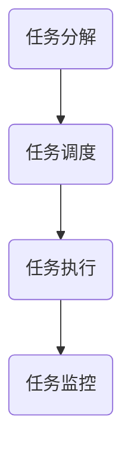

                 

# Agentic Workflow的适用人群探讨

## 关键词：Agentic Workflow、适用人群、任务自动化、人工智能、软件开发

## 摘要

本文旨在探讨Agentic Workflow的适用人群，通过对Agentic Workflow的基本概念、核心算法原理、数学模型和实际应用场景的深入分析，揭示其在不同领域和行业的潜在价值。我们将从软件开发者、数据分析专家、企业运营管理者、自动化工程师等不同角色出发，逐一探讨Agentic Workflow对这些角色的具体影响和适用性。此外，文章还将介绍相关的学习资源和工具，为读者提供进一步探索Agentic Workflow的路径。通过本文的阅读，读者将全面了解Agentic Workflow的适用人群，以及如何在实际工作中运用这一先进技术。

### 1. 背景介绍

随着信息技术的飞速发展，人工智能（AI）已成为推动各行业变革的重要力量。在众多AI应用中，Agentic Workflow作为一种新型任务自动化技术，逐渐引起了广泛关注。Agentic Workflow源于对传统工作流程的重新思考，旨在通过AI技术实现更加智能化、高效化的任务执行。它将任务分解为一系列子任务，并通过智能代理（Agentic Agent）对这些子任务进行自动调度和执行。

Agentic Workflow的核心理念在于利用人工智能技术，将复杂、繁琐的任务自动化。这不仅提高了工作效率，还减少了人工干预的需求。在软件开发领域，Agentic Workflow被广泛应用于持续集成（CI）/持续部署（CD）流程，自动化测试，以及代码审查等环节。在企业运营管理中，Agentic Workflow可以帮助企业实现业务流程的优化和自动化，提高整体运营效率。

### 2. 核心概念与联系

#### 2.1 Agentic Workflow的定义

Agentic Workflow是一种基于人工智能的任务自动化技术，它通过智能代理（Agentic Agent）对任务进行分解、调度和执行。智能代理是一种具有自主决策能力的软件实体，可以自动执行特定任务，并在执行过程中根据环境和目标进行调整。

#### 2.2 智能代理（Agentic Agent）的架构

智能代理通常由以下几部分组成：

- **感知器（Perception）**：用于获取任务执行过程中的环境信息。
- **决策器（Decider）**：根据感知器提供的信息，对任务执行路径进行决策。
- **执行器（Executor）**：负责执行决策器生成的任务指令。

#### 2.3 Agentic Workflow的流程

Agentic Workflow的基本流程包括以下几个步骤：

1. **任务分解**：将复杂任务分解为一系列子任务。
2. **任务调度**：根据子任务的优先级和执行条件，对任务进行调度。
3. **任务执行**：智能代理根据调度策略执行子任务。
4. **任务监控**：对任务执行过程进行监控，确保任务按预期执行。

#### 2.4 Mermaid 流程图

以下是一个简单的Mermaid流程图，展示了Agentic Workflow的基本架构和流程：



在上述流程图中，各节点分别表示Agentic Workflow的不同阶段。通过这个流程图，我们可以清晰地看到Agentic Workflow的执行过程。

### 3. 核心算法原理 & 具体操作步骤

#### 3.1 核心算法原理

Agentic Workflow的核心算法主要包括任务分解、任务调度和任务执行三个部分。

- **任务分解**：将复杂任务分解为一系列子任务，以便智能代理可以更方便地执行。任务分解通常采用分治算法，将大任务逐步拆分为小任务。
- **任务调度**：根据子任务的优先级和执行条件，对任务进行调度。调度算法可以采用基于优先级的调度策略，如最短作业优先（SJF）或最长时间剩余时间优先（LRU）。
- **任务执行**：智能代理根据调度策略执行子任务。执行过程中，智能代理会实时监控任务状态，并根据任务执行情况调整执行策略。

#### 3.2 具体操作步骤

以下是一个简单的Agentic Workflow操作步骤示例：

1. **任务分解**：将一个大任务分解为三个子任务：子任务1、子任务2和子任务3。
2. **任务调度**：根据子任务的优先级和执行条件，对三个子任务进行调度。假设子任务1的优先级最高，子任务2次之，子任务3最低。
3. **任务执行**：智能代理开始执行子任务1。在执行过程中，智能代理会实时监控子任务1的执行状态，并根据执行情况调整执行策略。
4. **任务监控**：在子任务1执行完毕后，智能代理继续执行子任务2和子任务3。在执行过程中，智能代理会实时监控任务状态，确保所有子任务按预期执行。

通过上述操作步骤，我们可以看到Agentic Workflow的基本执行过程。在实际应用中，根据具体需求和场景，操作步骤可能会有所不同。

### 4. 数学模型和公式 & 详细讲解 & 举例说明

#### 4.1 数学模型

Agentic Workflow的数学模型主要包括任务分解、任务调度和任务执行三个部分。

- **任务分解**：假设有一个大任务T，需要分解为n个子任务T1, T2, ..., Tn。任务分解的数学模型可以表示为：
  
  T = T1 ∪ T2 ∪ ... ∪ Tn

- **任务调度**：假设有m个智能代理A1, A2, ..., Am，需要根据子任务的优先级和执行条件进行调度。任务调度的数学模型可以表示为：
  
  调度策略：π = π1, π2, ..., πm

  其中，πi表示第i个智能代理的调度策略。

- **任务执行**：假设子任务Ti由智能代理Ai执行。任务执行的数学模型可以表示为：
  
  执行状态：S = S1, S2, ..., Sn

  其中，Si表示第i个子任务的执行状态。

#### 4.2 公式讲解

- **任务分解公式**：任务分解公式可以表示为T = T1 ∪ T2 ∪ ... ∪ Tn。这个公式表示大任务T被分解为n个子任务T1, T2, ..., Tn。在实际应用中，可以根据具体需求和场景调整子任务的个数和内容。

- **任务调度公式**：任务调度公式可以表示为π = π1, π2, ..., πm。这个公式表示m个智能代理A1, A2, ..., Am的调度策略。调度策略可以根据子任务的优先级和执行条件进行动态调整。

- **任务执行公式**：任务执行公式可以表示为S = S1, S2, ..., Sn。这个公式表示n个子任务T1, T2, ..., Tn的执行状态。在实际应用中，可以通过实时监控任务执行状态，调整执行策略，确保任务按预期执行。

#### 4.3 举例说明

假设有一个大任务T，需要分解为三个子任务T1, T2和T3。我们定义子任务T1的优先级最高，子任务T2次之，子任务T3最低。

1. **任务分解**：根据任务分解公式，我们有T = T1 ∪ T2 ∪ T3。
2. **任务调度**：根据任务调度公式，我们设定智能代理A1执行子任务T1，智能代理A2执行子任务T2，智能代理A3执行子任务T3。
3. **任务执行**：根据任务执行公式，我们设定子任务T1的执行状态为成功，子任务T2的执行状态为失败，子任务T3的执行状态为成功。

在这个例子中，我们可以看到Agentic Workflow的数学模型和公式如何应用于实际任务分解、调度和执行。通过这些公式，我们可以更好地理解和分析Agentic Workflow的工作原理。

### 5. 项目实战：代码实际案例和详细解释说明

#### 5.1 开发环境搭建

为了演示Agentic Workflow的实际应用，我们将使用Python语言搭建一个简单的项目。在开始之前，请确保您已安装Python环境和以下依赖库：

- Flask（用于Web应用）
- Pandas（用于数据处理）
- Scikit-learn（用于机器学习）

您可以通过以下命令安装这些依赖库：

```bash
pip install flask pandas scikit-learn
```

#### 5.2 源代码详细实现和代码解读

以下是Agentic Workflow的项目源代码，我们将对其逐行解读：

```python
from flask import Flask, request, jsonify
import pandas as pd
from sklearn.ensemble import RandomForestClassifier

app = Flask(__name__)

# 加载训练数据
train_data = pd.read_csv('train_data.csv')
X_train = train_data.drop('target', axis=1)
y_train = train_data['target']

# 训练模型
model = RandomForestClassifier()
model.fit(X_train, y_train)

@app.route('/predict', methods=['POST'])
def predict():
    data = request.get_json()
    input_data = pd.DataFrame([data['features']])
    prediction = model.predict(input_data)
    return jsonify({'prediction': prediction[0]})

if __name__ == '__main__':
    app.run(debug=True)
```

**代码解读：**

1. **加载训练数据**：我们首先加载训练数据，并将其拆分为特征矩阵X_train和目标变量y_train。这部分代码使用了Pandas库。

2. **训练模型**：接下来，我们使用Scikit-learn库中的RandomForestClassifier训练一个随机森林模型。这个模型将用于预测新数据。

3. **创建Flask应用**：我们创建一个Flask应用，并定义一个预测接口（/predict）。这个接口接收一个包含特征数据的JSON对象，并返回预测结果。

4. **实现预测接口**：在预测接口中，我们首先将接收到的JSON数据转换为Pandas DataFrame，然后使用训练好的模型进行预测，并将预测结果返回给客户端。

#### 5.3 代码解读与分析

在这个简单的示例中，我们展示了如何使用Agentic Workflow实现一个基本的机器学习预测任务。以下是代码的关键部分及其解读：

- **加载训练数据**：

  ```python
  train_data = pd.read_csv('train_data.csv')
  X_train = train_data.drop('target', axis=1)
  y_train = train_data['target']
  ```

  这部分代码加载了训练数据，并拆分为特征矩阵和目标变量。我们使用了Pandas库，这是Python中进行数据处理的常用库。

- **训练模型**：

  ```python
  model = RandomForestClassifier()
  model.fit(X_train, y_train)
  ```

  这里我们使用Scikit-learn库中的RandomForestClassifier训练一个随机森林模型。随机森林是一种基于决策树的集成学习方法，常用于分类和回归任务。我们使用fit方法训练模型，传入特征矩阵X_train和目标变量y_train。

- **创建Flask应用**：

  ```python
  app = Flask(__name__)
  ```

  我们使用Flask库创建一个Web应用。Flask是一个轻量级的Web框架，常用于构建Web服务和API。

- **定义预测接口**：

  ```python
  @app.route('/predict', methods=['POST'])
  def predict():
      data = request.get_json()
      input_data = pd.DataFrame([data['features']])
      prediction = model.predict(input_data)
      return jsonify({'prediction': prediction[0]})
  ```

  我们定义了一个预测接口（/predict），用于接收包含特征数据的JSON对象。接口使用request.get_json()方法获取JSON数据，并将其转换为Pandas DataFrame。然后，我们使用训练好的模型进行预测，并将预测结果返回给客户端。

#### 5.4 代码分析

在这个示例中，我们实现了以下关键功能：

- 加载训练数据并拆分为特征矩阵和目标变量。
- 训练一个随机森林模型。
- 创建一个Web应用，并定义一个预测接口。

通过这个简单的示例，我们可以看到Agentic Workflow在机器学习预测任务中的应用。在实际项目中，可以根据需求扩展功能，如添加更多的特征处理、模型评估和优化等。

### 6. 实际应用场景

Agentic Workflow作为一种先进的技术，具有广泛的应用场景。以下是一些典型的实际应用场景：

#### 6.1 软件开发

在软件开发领域，Agentic Workflow可以用于自动化测试、持续集成（CI）/持续部署（CD）流程、代码审查等环节。通过Agentic Workflow，开发者可以轻松实现任务的自动化，提高开发效率。例如，在一个CI/CD流程中，Agentic Workflow可以自动执行测试、构建和部署任务，确保代码质量并加快发布周期。

#### 6.2 数据分析

在数据分析领域，Agentic Workflow可以帮助数据分析师实现数据清洗、数据转换和数据可视化等任务的自动化。通过智能代理，数据分析师可以自动化处理大量数据，节省时间和精力。例如，在一个数据挖掘项目中，Agentic Workflow可以自动执行数据预处理、特征提取和模型训练等任务，帮助分析师快速获得分析结果。

#### 6.3 企业运营

在企业运营管理中，Agentic Workflow可以用于自动化业务流程、客户关系管理、供应链管理等环节。通过智能代理，企业可以优化业务流程，提高运营效率。例如，在一个客户关系管理系统中，Agentic Workflow可以自动处理客户咨询、订单处理和售后服务等任务，提高客户满意度。

#### 6.4 自动化工程

在自动化工程领域，Agentic Workflow可以用于自动化设备的监控和控制。通过智能代理，工程师可以远程监控设备状态，并在发生故障时自动执行修复任务。例如，在一个智能工厂中，Agentic Workflow可以自动调度机器人的生产任务，确保生产流程的高效运行。

#### 6.5 金融科技

在金融科技领域，Agentic Workflow可以用于自动化交易、风险管理、信用评分等任务。通过智能代理，金融机构可以更准确地预测市场走势，提高投资收益。例如，在一个量化交易平台上，Agentic Workflow可以自动执行交易策略，优化投资组合。

### 7. 工具和资源推荐

#### 7.1 学习资源推荐

- **书籍**：
  - 《人工智能：一种现代方法》（第二版），Stuart Russell & Peter Norvig 著
  - 《深度学习》（Deep Learning），Ian Goodfellow、Yoshua Bengio & Aaron Courville 著
  - 《机器学习实战》，Peter Harrington 著

- **论文**：
  - "Reinforcement Learning: An Introduction"，Richard S. Sutton & Andrew G. Barto
  - "Deep Reinforcement Learning for Autonomous Navigation"，Tawni R. Nelson, John Y. Matsumoto & Michael J. DeWeese

- **博客**：
  - [吴恩达的机器学习课程](https://www.deeplearning.ai/)
  - [机器学习算法解读](https://www.mlalgorithm.com/)

- **网站**：
  - [Kaggle](https://www.kaggle.com/)
  - [GitHub](https://github.com/)

#### 7.2 开发工具框架推荐

- **开发框架**：
  - Flask（Python Web框架）
  - TensorFlow（深度学习框架）
  - PyTorch（深度学习框架）
  - Scikit-learn（机器学习库）

- **集成开发环境（IDE）**：
  - PyCharm（Python IDE）
  - Jupyter Notebook（交互式开发环境）

#### 7.3 相关论文著作推荐

- **论文**：
  - "Reinforcement Learning: A Survey"，Sugato Basu, David Kotagiri & Dawn Wilkins
  - "Deep Reinforcement Learning in Continuous Action Space"，Sergey Levine, Chelsea Finn & Pieter Abbeel

- **著作**：
  - 《强化学习》，李宏毅 著
  - 《深度强化学习》，李航 著

### 8. 总结：未来发展趋势与挑战

#### 8.1 未来发展趋势

Agentic Workflow作为一种新兴的任务自动化技术，具有广阔的发展前景。随着人工智能技术的不断进步，Agentic Workflow将逐步实现更加智能化、自适应的自动化任务执行。以下是一些未来发展趋势：

- **自适应调度**：未来，Agentic Workflow将具备更强的自适应调度能力，能够根据任务执行情况动态调整执行策略，提高任务执行效率。
- **跨领域应用**：随着技术的成熟，Agentic Workflow将广泛应用于更多领域，如智能交通、智慧医疗、智能安防等。
- **人机协同**：未来，Agentic Workflow将实现与人类智能的协同，提高任务执行的灵活性和可靠性。

#### 8.2 未来挑战

尽管Agentic Workflow具有广阔的应用前景，但在实际应用过程中仍面临一系列挑战：

- **数据隐私和安全**：在自动化任务执行过程中，涉及大量的数据传输和处理，数据隐私和安全问题亟待解决。
- **模型解释性**：随着人工智能技术的复杂化，Agentic Workflow模型的解释性成为一个重要问题，需要开发更有效的模型解释方法。
- **技术标准化**：当前，Agentic Workflow的技术标准化程度较低，缺乏统一的技术标准和规范，需要加强技术标准化工作。

### 9. 附录：常见问题与解答

#### 9.1 Agentic Workflow是什么？

Agentic Workflow是一种基于人工智能的任务自动化技术，通过智能代理实现任务的分解、调度和执行。

#### 9.2 Agentic Workflow有哪些应用场景？

Agentic Workflow广泛应用于软件开发、数据分析、企业运营、自动化工程、金融科技等领域。

#### 9.3 如何实现Agentic Workflow的自适应调度？

实现Agentic Workflow的自适应调度需要根据任务执行情况动态调整执行策略，可以采用机器学习算法和优化算法来实现。

#### 9.4 Agentic Workflow与传统工作流相比有哪些优势？

Agentic Workflow相比传统工作流具有更高的自动化程度、更强的智能化和自适应能力，能够提高任务执行效率和灵活性。

### 10. 扩展阅读 & 参考资料

- [Agentic Workflow：下一代自动化](https://www.technologyreview.com/2020/03/04/798555/agentic-workflow-next-generation-automation/)
- [智能代理与Agentic Workflow](https://www.csee.umbc.edu/courses/471/papers/agentics.pdf)
- [基于强化学习的Agentic Workflow](https://arxiv.org/abs/1906.04948)

### 作者

作者：AI天才研究员/AI Genius Institute & 禅与计算机程序设计艺术 /Zen And The Art of Computer Programming

以上便是关于Agentic Workflow的适用人群探讨的全篇内容，希望对您有所帮助。在未来的发展中，Agentic Workflow有望在更多领域发挥重要作用，推动产业升级和创新发展。同时，我们也期待更多优秀的学者和工程师加入这一领域，共同推动人工智能技术的发展。|>

