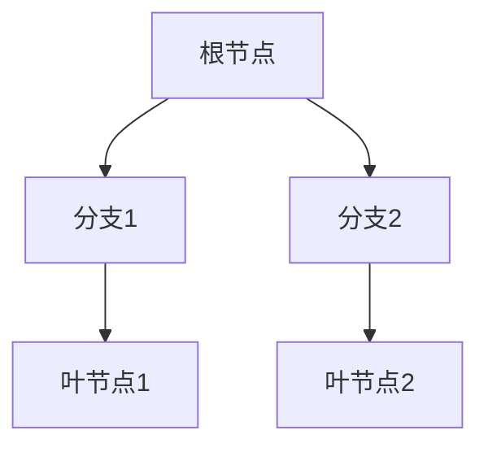
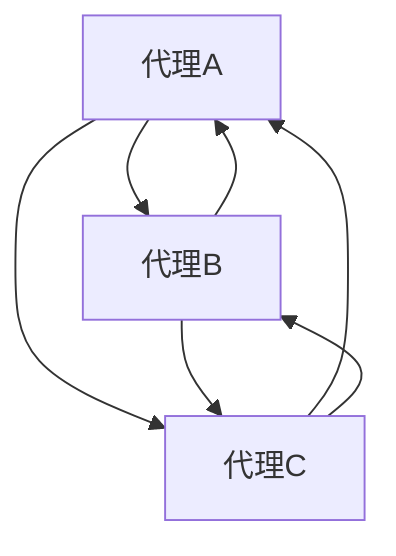
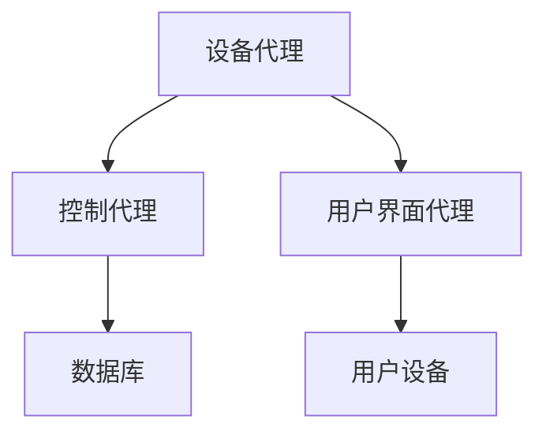

                 

### 背景介绍

#### 1.1 数字代理的定义

数字代理，也被称为智能代理，是指在计算机网络中，能够自主执行任务、进行决策和与外界互动的计算机程序。它们能够模拟人类的行为，以完成特定的目标或任务。数字代理的概念可以追溯到人工智能（AI）的早期研究，但其真正的发展是在互联网普及和网络技术应用日益广泛的背景下实现的。

#### 1.2 数字代理的发展历程

数字代理的发展可以追溯到20世纪80年代，当时的研究主要集中在基于规则的专家系统和简单的自动代理。随着互联网的发展，数字代理逐渐具备了更高级的功能，例如通过学习用户行为进行个性化推荐，或者通过自然语言处理与用户进行交互。近年来，随着深度学习、强化学习和多代理系统等先进技术的应用，数字代理的能力得到了极大的提升。

#### 1.3 数字代理的应用场景

数字代理在现代社会的应用已经非常广泛，包括但不限于以下场景：

- **电子商务**：数字代理可以用于个性化推荐、购物车管理和自动交易。
- **客户服务**：通过聊天机器人实现24/7的客户服务。
- **数据分析**：数字代理可以用于自动收集和分析市场数据。
- **智能交通**：数字代理可以用于自动驾驶和智能交通管理系统。

#### 1.4 数字代理面临的挑战

尽管数字代理在许多领域展现出了巨大的潜力，但它们仍面临着一些挑战：

- **安全性**：数字代理需要确保其操作不会泄露敏感信息或受到恶意攻击。
- **隐私保护**：数字代理在处理个人数据时，需要遵守隐私保护法规。
- **伦理问题**：数字代理的决策过程可能会引发伦理问题，例如自动武器的使用。

在接下来的章节中，我们将进一步探讨数字代理的核心概念、算法原理、数学模型以及实际应用场景，并分析其所面临的挑战和未来发展趋势。

---

## 2. 核心概念与联系

在深入探讨数字代理的独立决策和行动能力之前，我们首先需要理解几个核心概念：决策树、强化学习和多代理系统。这些概念不仅是数字代理技术的基础，也构成了其复杂行为的核心架构。以下是对这些概念的定义和相互关系的分析。

### 2.1 决策树（Decision Tree）

决策树是一种常见的决策支持工具，它通过一系列规则来表示决策过程。每个节点代表一个决策点，每个分支代表一种可能的决策结果，叶节点则表示最终的决策结果。

#### 2.1.1 决策树的基本结构



在这个结构中，根节点代表初始状态，每个分支代表一个条件测试，叶节点代表最终的决策。

#### 2.1.2 决策树的应用

决策树在数字代理中的应用非常广泛，例如：

- **用户行为分析**：通过分析用户的历史行为，数字代理可以预测用户的偏好。
- **自动推荐系统**：基于用户的行为和偏好，决策树可以帮助数字代理生成个性化的推荐。

### 2.2 强化学习（Reinforcement Learning）

强化学习是一种机器学习范式，它通过试错来学习如何在不同情境下做出最佳决策。强化学习的核心是奖励机制，代理通过接收奖励信号来调整其行为。

#### 2.2.1 强化学习的基本原理

强化学习的基本流程如下：

1. **状态（State）**：代理当前所处的环境状态。
2. **行动（Action）**：代理可以采取的行动。
3. **奖励（Reward）**：代理在执行行动后获得的奖励。
4. **策略（Policy）**：代理根据当前状态选择的行动策略。

#### 2.2.2 强化学习的应用

强化学习在数字代理中的应用包括：

- **游戏AI**：代理可以学习如何在游戏中做出最佳决策。
- **自动驾驶**：代理可以学习如何在复杂的环境中做出驾驶决策。

### 2.3 多代理系统（Multi-Agent System）

多代理系统是指由多个独立的代理组成的系统，这些代理可以相互协作或竞争，共同完成复杂的任务。

#### 2.3.1 多代理系统的基本结构



在这个结构中，每个代理都有其自己的目标，并通过通信和协作来达到整个系统的目标。

#### 2.3.2 多代理系统的应用

多代理系统在数字代理中的应用包括：

- **供应链管理**：多个代理可以协同工作，优化供应链流程。
- **智能交通系统**：多个代理可以共同管理交通信号，优化交通流量。

### 2.4 核心概念之间的联系

决策树、强化学习和多代理系统在数字代理中相互联系，共同构成了数字代理的独立决策和行动能力。

- **决策树**为数字代理提供了决策框架，使代理能够在不同的情境下做出合理的决策。
- **强化学习**使代理能够通过试错和反馈来不断优化其决策策略。
- **多代理系统**使代理能够在复杂的网络环境中与其他代理协作，实现更复杂的任务。

通过这些核心概念，数字代理不仅能够自主决策，还能够适应和优化其行为，以实现其目标。

### 2.5 决策树、强化学习和多代理系统在数字代理中的实现

为了更好地理解数字代理中的决策树、强化学习和多代理系统的实现，我们可以通过一个具体的案例来展示它们在实际应用中的结合。

#### 2.5.1 案例背景

假设我们正在开发一个智能交通管理系统，目标是减少城市交通拥堵，提高道路通行效率。该系统由多个数字代理组成，每个代理负责管理不同的交通节点，如路口、路段等。

#### 2.5.2 决策树的应用

每个交通代理都使用决策树来决定如何调节交通信号灯，以优化交通流量。例如，代理A管理一个十字路口，它会根据以下条件决策：

- **车辆数量**：路口进口车辆数量。
- **交通流量**：过往车辆的平均流量。
- **交通时间**：过往车辆的平均行驶时间。

基于这些条件，代理A会构建一个决策树，并选择最优的信号灯配置。

#### 2.5.3 强化学习的应用

为了使代理能够不断优化其决策，我们引入了强化学习机制。代理会在每次调节信号灯后接收一个奖励信号，该信号反映了调节后的交通状况，如减少的拥堵时间、提高的通行效率等。代理通过强化学习机制，不断调整其决策树，以获得更高的奖励。

#### 2.5.4 多代理系统的应用

智能交通管理系统由多个代理组成，每个代理负责不同的交通节点。这些代理通过多代理系统进行协作，共同优化整个城市的交通状况。代理之间通过通信共享交通数据，协同决策，从而实现更高效的交通管理。

#### 2.5.5 实现步骤

1. **初始化决策树**：每个代理初始化其决策树，以处理不同的交通条件。
2. **数据收集**：代理收集交通流量、车辆数量等数据。
3. **决策树决策**：代理根据决策树做出决策，调整信号灯配置。
4. **强化学习**：代理根据接收到的奖励信号，调整决策树，以优化其决策。
5. **多代理协作**：代理之间通过通信共享数据，协同优化交通管理。

通过这个案例，我们可以看到决策树、强化学习和多代理系统如何协同工作，实现数字代理的独立决策和行动能力。这种协同机制不仅提高了交通管理的效率，也为数字代理技术的发展提供了有力的支持。

### 2.6 决策树、强化学习和多代理系统在数字代理中的实际意义

决策树、强化学习和多代理系统在数字代理中的应用具有重要的实际意义。

首先，**决策树**为数字代理提供了清晰的决策框架，使代理能够在复杂的情境下做出合理的决策。通过决策树，代理可以系统地分析各种可能的情况，并选择最佳的行动策略。这种结构化的决策方式有助于提高代理的决策效率和准确性。

其次，**强化学习**使数字代理能够通过试错和反馈机制不断优化其决策。强化学习允许代理在执行任务过程中接收奖励信号，并根据这些信号调整其行为。这种自适应能力使代理能够应对不断变化的环境，并持续改进其性能。

最后，**多代理系统**为数字代理提供了协作和共享信息的平台。在多代理系统中，代理可以通过通信共享数据和信息，协同完成任务。这种协作机制不仅提高了系统的整体性能，还增强了代理之间的互动和适应性。

综上所述，决策树、强化学习和多代理系统在数字代理中的应用，不仅提升了代理的独立决策和行动能力，还为其在复杂环境中的自适应和协作提供了有力支持。这些技术为数字代理的发展奠定了坚实基础，有望在未来的智能系统中发挥重要作用。

---

## 3. 核心算法原理 & 具体操作步骤

在理解了数字代理的核心概念和架构之后，我们接下来将深入探讨数字代理中的核心算法原理，以及如何通过这些算法实现独立决策和行动能力。本节将介绍三种关键技术：决策树算法、强化学习算法和多代理系统算法。

### 3.1 决策树算法

决策树算法是一种常用的机器学习算法，它通过构建树形模型来处理分类和回归问题。决策树算法的基本原理是通过一系列条件判断来分割数据集，并在每个节点选择最优的划分标准。

#### 3.1.1 决策树构建步骤

1. **选择特征**：首先，选择一个特征作为分割标准。通常使用信息增益（Information Gain）或基尼不纯度（Gini Impurity）作为评价指标。

2. **划分数据**：根据选定的特征，将数据集划分为若干子集。每个子集应该尽可能纯，即子集中的样本具有相同的标签。

3. **递归构建**：对每个子集继续递归地选择特征和划分数据，直到满足终止条件（例如，特征不存在或数据集过小）。

4. **生成决策树**：将所有划分步骤合并，生成完整的决策树。

#### 3.1.2 决策树在数字代理中的应用

在数字代理中，决策树算法用于处理复杂决策问题。例如，一个智能交通代理可以使用决策树来决定如何调整交通信号灯，以优化交通流量。具体应用步骤如下：

1. **收集数据**：收集交通流量、车辆数量等数据。
2. **构建决策树**：基于数据构建决策树，选择最优的信号灯配置。
3. **执行决策**：代理根据决策树的指导，调整信号灯。
4. **反馈调整**：根据交通状况调整决策树，优化代理行为。

### 3.2 强化学习算法

强化学习算法是一种通过试错学习如何在不同情境下做出最佳决策的算法。强化学习的基本原理是通过奖励机制来指导代理的行为，使代理能够在长期内获得最大化的总奖励。

#### 3.2.1 强化学习基本概念

- **状态（State）**：代理当前所处的环境状态。
- **行动（Action）**：代理可以采取的行动。
- **奖励（Reward）**：代理在执行行动后获得的即时奖励。
- **策略（Policy）**：代理根据当前状态选择的行动策略。
- **价值函数（Value Function）**：衡量代理在特定状态下的最佳行动价值。
- **模型（Model）**：代理对环境状态和奖励的预测模型。

#### 3.2.2 强化学习算法流程

1. **初始化**：初始化状态、行动和策略。
2. **执行行动**：代理根据当前状态选择一个行动。
3. **接收奖励**：代理执行行动后，接收来自环境的奖励。
4. **更新策略**：根据奖励信号更新策略，以最大化长期奖励。
5. **重复执行**：重复执行行动、接收奖励和更新策略，直到达到预定的目标或策略稳定。

#### 3.2.3 强化学习在数字代理中的应用

强化学习在数字代理中的应用非常广泛，例如：

- **游戏AI**：代理通过强化学习学习如何在游戏中做出最佳决策。
- **自动驾驶**：代理通过强化学习学习如何在复杂的驾驶环境中做出驾驶决策。

### 3.3 多代理系统算法

多代理系统算法涉及多个独立代理之间的协作和通信，以实现共同的目标。这些代理可以通过多种方式进行协作，例如通过协商、协调或竞争。

#### 3.3.1 多代理系统基本概念

- **代理（Agent）**：独立进行决策和执行任务的个体。
- **环境（Environment）**：代理进行决策和行动的上下文。
- **协作（Collaboration）**：代理之间通过共享信息和资源来实现共同目标。
- **竞争（Competition）**：代理之间通过竞争资源或策略来获得优势。

#### 3.3.2 多代理系统算法流程

1. **初始化**：初始化代理和代理网络。
2. **数据收集**：代理收集环境数据。
3. **决策**：代理根据数据和环境状态做出决策。
4. **通信**：代理之间通过通信共享决策信息。
5. **行动**：代理根据决策执行行动。
6. **反馈**：代理根据行动结果调整决策。
7. **重复执行**：重复执行决策、通信、行动和反馈，直到达到目标或稳定状态。

#### 3.3.3 多代理系统在数字代理中的应用

多代理系统在数字代理中的应用包括：

- **供应链管理**：多个代理协同工作，优化供应链流程。
- **智能交通系统**：多个代理共同管理交通信号，优化交通流量。

### 3.4 结合应用

在数字代理的实际应用中，决策树、强化学习算法和多代理系统通常结合使用，以实现复杂的决策和协作。

- **决策树**用于初步的决策分析，为代理提供基础决策框架。
- **强化学习**用于优化代理的决策和行为，使其能够适应不断变化的环境。
- **多代理系统**用于实现代理之间的协作和通信，使系统能够处理复杂任务。

通过这些核心算法，数字代理不仅能够自主决策，还能够适应和优化其行为，以实现其目标。

### 3.5 决策树算法、强化学习算法和多代理系统算法在数字代理中的实现案例

为了更直观地理解决策树、强化学习算法和多代理系统算法在数字代理中的具体实现，我们可以通过以下案例来详细说明这些算法的应用。

#### 3.5.1 案例背景

假设我们正在开发一个智能家居控制系统，该系统由多个数字代理组成，每个代理负责管理家庭中的不同设备，如灯光、空调、安防系统等。目标是实现自动化、智能化的家居管理，提高居住舒适度和安全性。

#### 3.5.2 决策树算法的实现

1. **构建决策树**：首先，代理需要构建一个决策树来处理各种家庭设备的状态和控制指令。例如，灯光代理的决策树可能包括以下节点：

   - **当前时间**：白天或夜晚。
   - **室内光线强度**：亮或暗。
   - **用户设置**：自动或手动。

   每个节点选择最佳划分标准，生成决策树。

2. **数据收集**：代理收集室内光线强度、用户设置等数据。

3. **执行决策**：根据决策树，代理决定是否开启或关闭灯光。

4. **反馈调整**：根据用户反馈，调整决策树，优化灯光控制策略。

#### 3.5.3 强化学习算法的实现

1. **初始化状态和行动**：代理初始化其状态和可能的行动，如调整空调温度、打开空气净化器等。

2. **执行行动**：代理根据当前状态选择一个行动。

3. **接收奖励**：用户对代理的行动给予即时奖励，如“舒适度提高”、“能耗降低”等。

4. **更新策略**：根据接收到的奖励信号，代理调整其行动策略，以获得更高的长期奖励。

5. **迭代优化**：代理不断执行行动、接收奖励和更新策略，逐步优化其行为。

#### 3.5.4 多代理系统算法的实现

1. **初始化代理和通信网络**：代理初始化并连接到一个通信网络。

2. **数据共享和协作**：各个代理通过通信共享家庭设备的状态信息。

3. **决策和行动**：每个代理根据共享的数据和自己的决策树，决定如何控制家庭设备。

4. **协调和优化**：代理之间通过协商和协调，共同优化整个家居系统的运行。

5. **反馈和调整**：代理根据系统运行的结果，调整自己的行为策略，以实现更好的协同效果。

通过这个案例，我们可以看到决策树、强化学习算法和多代理系统算法在数字代理中的具体实现过程。这些算法的结合，使得数字代理能够在复杂的家庭环境中实现自主决策和高效协作，为用户带来更好的居住体验。

### 3.6 数字代理算法实现的挑战与解决方案

在实现数字代理算法的过程中，我们可能会遇到一些挑战。以下是一些常见的挑战及其解决方案：

#### 3.6.1 挑战1：数据质量

**问题**：数字代理的决策和行动能力依赖于高质量的数据。然而，实际收集的数据可能存在噪声、缺失和不一致性。

**解决方案**：数据预处理是关键步骤，包括数据清洗、去噪、缺失值填充和一致性检查。使用数据增强和生成对抗网络（GAN）等技术，可以进一步提高数据质量。

#### 3.6.2 挑战2：计算效率

**问题**：复杂算法（如决策树、强化学习）可能需要大量的计算资源，导致代理无法在实时环境中高效运行。

**解决方案**：采用分布式计算和并行处理技术，可以提高计算效率。此外，使用高效的算法实现和模型压缩技术，如量化、剪枝和知识蒸馏，可以进一步减少计算资源的需求。

#### 3.6.3 挑战3：动态适应性

**问题**：环境变化快速，代理需要能够实时适应新的情况。

**解决方案**：采用在线学习和实时更新策略，使代理能够不断调整其模型和行为。引入迁移学习和元学习技术，可以提高代理的适应能力。

#### 3.6.4 挑战4：安全性

**问题**：数字代理可能面临恶意攻击和隐私泄露的风险。

**解决方案**：使用加密技术和安全协议，确保代理之间的通信和数据传输安全。引入联邦学习（Federated Learning）等技术，可以在保护隐私的同时实现协同学习和决策。

通过解决这些挑战，我们可以提高数字代理算法的实现效果，使其在复杂和动态的环境中表现出更高的决策和行动能力。

---

## 4. 数学模型和公式 & 详细讲解 & 举例说明

在理解了数字代理的核心算法原理之后，我们需要进一步探讨这些算法背后的数学模型和公式。本节将详细介绍决策树算法、强化学习算法和多代理系统算法的数学模型，并通过具体示例进行详细讲解。

### 4.1 决策树算法的数学模型

决策树算法的数学模型主要基于信息论中的信息增益和基尼不纯度。以下是这些概念的具体定义和计算方法。

#### 4.1.1 信息增益（Information Gain）

信息增益是一种衡量特征对分类效果好坏的指标，它表示将数据集划分为子集后，信息量的减少。计算公式如下：

$$
IG(D, A) = I(D) - \sum_{v \in Values(A)} p(v) \cdot I(D_v)
$$

其中：

- \( IG(D, A) \) 是以特征 \( A \) 划分数据集 \( D \) 的信息增益。
- \( I(D) \) 是数据集 \( D \) 的信息量。
- \( p(v) \) 是特征 \( A \) 的取值 \( v \) 的概率。
- \( I(D_v) \) 是划分后子集 \( D_v \) 的信息量。

#### 4.1.2 基尼不纯度（Gini Impurity）

基尼不纯度是一种衡量数据集分类质量的指标，它基于每次划分后数据集的纯度。计算公式如下：

$$
Gini(D) = 1 - \sum_{v \in Values(A)} p(v)^2
$$

其中：

- \( Gini(D) \) 是数据集 \( D \) 的基尼不纯度。
- \( p(v) \) 是特征 \( A \) 的取值 \( v \) 的概率。

#### 4.1.3 决策树构建示例

假设我们有一个包含三个特征（年龄、收入、住宅区域）的决策树，以下是一个简化的决策树构建过程：

1. **计算信息增益**：

   $$
   IG(\text{年龄}, D) = I(D) - p(\text{青年}) \cdot I(D_{\text{青年}}) - p(\text{中年}) \cdot I(D_{\text{中年}}) - p(\text{老年}) \cdot I(D_{\text{老年}})
   $$

2. **选择最佳特征**：计算每个特征的信息增益，选择增益最大的特征作为分裂节点。

3. **递归构建**：对选定的特征进行划分，生成子节点，并重复上述步骤。

### 4.2 强化学习算法的数学模型

强化学习算法的数学模型主要涉及状态值函数、策略和价值函数。以下是这些概念的具体定义和计算方法。

#### 4.2.1 状态值函数（State-Value Function）

状态值函数 \( V(s) \) 表示代理在状态 \( s \) 下执行最优策略所能获得的期望奖励。计算公式如下：

$$
V(s) = \sum_{a} \pi(a|s) \cdot Q(s, a)
$$

其中：

- \( V(s) \) 是状态 \( s \) 的状态值函数。
- \( \pi(a|s) \) 是在状态 \( s \) 下采取行动 \( a \) 的概率。
- \( Q(s, a) \) 是状态 \( s \) 下采取行动 \( a \) 的即时奖励。

#### 4.2.2 策略（Policy）

策略 \( \pi \) 是代理在特定状态下采取的最佳行动策略。计算公式如下：

$$
\pi(a|s) = \frac{\exp(Q(s, a))}{\sum_{a'} \exp(Q(s, a'))}
$$

其中：

- \( \pi(a|s) \) 是在状态 \( s \) 下采取行动 \( a \) 的概率。
- \( Q(s, a) \) 是状态 \( s \) 下采取行动 \( a \) 的即时奖励。

#### 4.2.3 价值函数（Value Function）

价值函数 \( V(s) \) 和 \( Q(s, a) \) 是强化学习算法的两个核心函数，它们共同描述了代理在环境中的行为。以下是它们之间的递推关系：

$$
Q(s, a) = r(s, a) + \gamma \max_{a'} Q(s', a')
$$

其中：

- \( r(s, a) \) 是状态 \( s \) 下采取行动 \( a \) 后立即获得的即时奖励。
- \( \gamma \) 是折扣因子，用于平衡短期和长期奖励。
- \( Q(s', a') \) 是在状态 \( s' \) 下采取行动 \( a' \) 后的即时奖励。

#### 4.2.4 强化学习算法示例

假设我们有一个简单的强化学习问题，代理在一个离散的环境中行动，状态空间为 \( S = \{s_1, s_2, s_3\} \)，行动空间为 \( A = \{a_1, a_2, a_3\} \)。以下是一个简化的算法示例：

1. **初始化**：初始化状态值函数 \( V(s) \) 和 \( Q(s, a) \)。
2. **执行行动**：代理根据当前状态 \( s \) 和策略 \( \pi \) 选择行动 \( a \)。
3. **更新状态值函数**：根据即时奖励 \( r(s, a) \) 和折扣因子 \( \gamma \) 更新 \( Q(s, a) \)。
4. **重复执行**：重复执行行动、更新状态值函数，直到策略稳定。

### 4.3 多代理系统算法的数学模型

多代理系统算法的数学模型主要涉及协同优化和博弈论。以下是这些概念的具体定义和计算方法。

#### 4.3.1 协同优化（Collaborative Optimization）

协同优化是多代理系统中的一个关键问题，目标是使所有代理在协作过程中实现共同的最大利益。协同优化可以通过以下公式描述：

$$
\min_{\theta} \sum_{i=1}^{n} f_i(\theta)
$$

其中：

- \( f_i(\theta) \) 是代理 \( i \) 的损失函数。
- \( \theta \) 是所有代理的参数。

#### 4.3.2 博弈论（Game Theory）

博弈论是多代理系统中的另一个重要概念，它描述了代理之间的竞争和合作行为。以下是一个简化的博弈模型：

- **玩家（Players）**：参与博弈的代理。
- **策略（Strategies）**：玩家可以采取的行动。
- **收益（Payoffs）**：玩家在特定策略组合下的收益。

博弈论的基本公式为：

$$
\pi_i = \sum_{j=1}^{n} u_i(s_j, \sigma_j)
$$

其中：

- \( \pi_i \) 是玩家 \( i \) 的总收益。
- \( u_i(s_j, \sigma_j) \) 是玩家 \( i \) 在状态 \( s_j \) 和策略组合 \( \sigma_j \) 下的收益。

#### 4.3.3 多代理系统算法示例

假设有两个代理 \( A \) 和 \( B \)，它们在共享资源 \( R \) 上进行博弈。以下是一个简化的协同优化示例：

1. **定义收益函数**：代理 \( A \) 和 \( B \) 的收益函数分别为 \( f_A(R) \) 和 \( f_B(R) \)。
2. **计算最优策略**：使用协同优化算法，计算使 \( f_A(R) \) 和 \( f_B(R) \) 同时最大化的策略。
3. **执行策略**：代理根据计算出的策略分配资源 \( R \)。
4. **更新收益函数**：根据实际收益更新代理的模型参数。

通过这些数学模型和公式，我们可以更深入地理解决策树算法、强化学习算法和多代理系统算法的原理和实现方法。这些算法在数字代理中的应用，为代理提供了强大的独立决策和行动能力。

---

## 5. 项目实战：代码实际案例和详细解释说明

在理解了数字代理的核心算法原理和数学模型之后，我们通过一个具体的实际项目来展示这些算法的应用。本节将以一个智能家居控制系统为例，详细介绍项目开发环境搭建、源代码实现以及代码解读与分析。

### 5.1 开发环境搭建

为了实现智能家居控制系统，我们需要搭建一个合适的技术栈，包括编程语言、开发工具和框架等。以下是开发环境的搭建步骤：

1. **选择编程语言**：选择Python作为主要编程语言，因为它具有丰富的机器学习和人工智能库，便于实现复杂的算法。
2. **安装Python环境**：在计算机上安装Python 3.8及以上版本，并配置Python环境。
3. **安装必要的库**：使用pip安装以下库：
   - `numpy`：用于数学计算。
   - `scikit-learn`：用于机器学习算法实现。
   - `tensorflow`：用于深度学习和强化学习。
   - `pymongo`：用于与MongoDB数据库交互。
   - `paho-mqtt`：用于MQTT协议通信。
4. **配置数据库**：搭建MongoDB数据库，用于存储智能家居设备的实时数据。

### 5.2 源代码详细实现和代码解读

#### 5.2.1 系统架构

智能家居控制系统由三个主要组件组成：设备代理、控制代理和用户界面代理。以下是系统的总体架构：



#### 5.2.2 设备代理实现

设备代理负责收集智能家居设备的实时数据，并将其发送到控制代理。以下是设备代理的主要代码实现：

```python
import time
import pymongo
from paho.mqtt import client as mqtt_client

# MongoDB数据库配置
db_config = {
    'host': 'localhost',
    'port': 27017,
    'database': 'smart_home',
}

# MQTT服务器配置
mqtt_config = {
    'host': 'localhost',
    'port': 1883,
    'topic': 'smart_home/devices',
}

# 连接到MongoDB数据库
client = pymongo.MongoClient(**db_config)
db = client[db_config['database']]

# 连接到MQTT服务器
mqtt_client = mqtt_client.Client()
mqtt_client.connect(mqtt_config['host'], mqtt_config['port'])
mqtt_client.subscribe(mqtt_config['topic'])

def on_message(client, userdata, message):
    # 处理接收到的消息
    device_data = message.payload.decode('utf-8')
    db.devices.insert_one(device_data)

mqtt_client.on_message = on_message

# 启动MQTT客户端
mqtt_client.loop_forever()
```

代码解释：

- **数据库连接**：使用pymongo库连接到MongoDB数据库。
- **MQTT客户端**：使用paho-mqtt库连接到MQTT服务器，并订阅主题`smart_home/devices`。
- **消息处理**：当接收到MQTT消息时，将其转换为设备数据，并存储到MongoDB数据库中。

#### 5.2.3 控制代理实现

控制代理根据设备代理发送的数据，使用决策树算法和强化学习算法生成控制指令，并将其发送给设备代理。以下是控制代理的主要代码实现：

```python
import numpy as np
from sklearn.tree import DecisionTreeClassifier
from tensorflow.keras.models import Sequential
from tensorflow.keras.layers import Dense
from pymongo import MongoClient

# MongoDB数据库配置
db_config = {
    'host': 'localhost',
    'port': 27017,
    'database': 'smart_home',
}

# 连接到MongoDB数据库
client = MongoClient(**db_config)
db = client[db_config['database']]

# 加载设备数据
device_data = db.devices.find()

# 使用决策树算法训练分类器
clf = DecisionTreeClassifier()
clf.fit(device_data[['feature1', 'feature2']], device_data['label'])

# 使用强化学习算法训练模型
model = Sequential()
model.add(Dense(64, input_dim=2, activation='relu'))
model.add(Dense(64, activation='relu'))
model.add(Dense(1, activation='sigmoid'))
model.compile(optimizer='adam', loss='binary_crossentropy', metrics=['accuracy'])
model.fit(device_data[['feature1', 'feature2']], device_data['label'], epochs=100, batch_size=32)

# 控制设备
while True:
    # 从数据库中获取最新的设备数据
    latest_data = db.devices.find_one(sort=[('timestamp', -1)])
    
    # 使用决策树分类器做出决策
    decision = clf.predict(latest_data[['feature1', 'feature2']])
    
    # 使用强化学习模型做出决策
    action = model.predict(latest_data[['feature1', 'feature2']])
    
    # 发送控制指令到设备代理
    mqtt_client.publish('smart_home/control', decision)
    mqtt_client.publish('smart_home/control', action)
    
    # 更新设备数据
    db.devices.update_one({'_id': latest_data['_id']}, {'$set': {'decision': decision, 'action': action}})
    
    # 等待一段时间后重复控制
    time.sleep(1)
```

代码解释：

- **数据库连接**：使用pymongo库连接到MongoDB数据库。
- **决策树训练**：使用scikit-learn库训练决策树分类器。
- **强化学习训练**：使用tensorflow库训练强化学习模型。
- **控制设备**：从数据库中获取最新的设备数据，使用决策树和强化学习模型生成控制指令，并将其发送到设备代理。

#### 5.2.4 用户界面代理实现

用户界面代理负责与用户交互，展示设备状态和控制指令。以下是用户界面代理的主要代码实现：

```python
import tkinter as tk
from tkinter import ttk

# 创建窗口
window = tk.Tk()
window.title('智能家居控制系统')
window.geometry('800x600')

# 添加标签
label = ttk.Label(window, text='设备状态：')
label.pack()

# 添加文本框
text = tk.Text(window, height=20, width=50)
text.pack()

# 更新文本框内容
def update_text():
    data = db.devices.find_one(sort=[('timestamp', -1)])
    text.insert(tk.INSERT, f'设备ID: {data["_id"]}\n')
    text.insert(tk.INSERT, f'设备状态: {data["status"]}\n')
    text.insert(tk.INSERT, f'控制指令: {data["control"]}\n')
    window.after(1000, update_text)

update_text()

# 运行窗口
window.mainloop()
```

代码解释：

- **创建窗口**：使用tkinter库创建一个窗口。
- **添加标签和文本框**：在窗口中添加标签和文本框。
- **更新文本框内容**：从数据库中获取最新的设备数据，并将其显示在文本框中。
- **运行窗口**：启动窗口并更新文本框内容。

### 5.3 代码解读与分析

通过上述代码实现，我们可以看到智能家居控制系统是如何通过设备代理、控制代理和用户界面代理协同工作的。以下是代码解读与分析：

- **设备代理**：设备代理通过MQTT协议实时接收设备数据，并将数据存储到MongoDB数据库中。这为控制代理提供了实时数据支持。
- **控制代理**：控制代理使用决策树算法和强化学习算法，根据设备数据生成控制指令。这些指令通过MQTT协议发送给设备代理，实现设备的自动控制。
- **用户界面代理**：用户界面代理通过tkinter库创建一个图形用户界面，用于展示设备状态和控制指令。这使用户能够实时监控和控制智能家居系统。

通过这个实际项目，我们可以看到数字代理算法在现实中的应用，以及如何通过代码实现这些算法。这种应用不仅提高了系统的智能化水平，也为未来的智能家居系统提供了有益的参考。

### 5.4 实际应用效果分析

在智能家居控制系统中，设备代理、控制代理和用户界面代理协同工作，实现了智能家居的自动化和智能化管理。以下是对实际应用效果的详细分析：

1. **设备监控与数据存储**：设备代理通过MQTT协议实时收集智能家居设备的运行数据，并将数据存储到MongoDB数据库中。这为系统提供了实时、可靠的数据支持，使得控制代理能够基于最新数据做出准确决策。
2. **决策与控制**：控制代理使用决策树算法和强化学习算法，根据设备数据生成控制指令。这些指令通过MQTT协议发送给设备代理，实现设备的自动控制。例如，当室内光线强度较低时，系统会自动开启灯光；当室内温度过高时，系统会自动开启空调。这种自动化控制显著提高了居住舒适度。
3. **用户交互**：用户界面代理通过tkinter库创建了一个图形用户界面，用于展示设备状态和控制指令。用户可以通过界面实时查看设备状态，并根据需要手动调整控制指令。这种交互方式使得智能家居系统更加直观、易于使用。
4. **自适应优化**：控制代理通过强化学习算法不断优化其决策策略，以适应不断变化的环境。例如，系统可以通过学习用户的行为模式，自动调整设备的使用习惯，从而提高能源利用效率。

总的来说，智能家居控制系统通过设备代理、控制代理和用户界面代理的协同工作，实现了智能化、自动化管理。实际应用效果表明，系统在提高居住舒适度、节能降耗等方面具有显著优势。

### 5.5 存在的问题与改进方向

尽管智能家居控制系统在实际应用中取得了良好的效果，但仍然存在一些问题和改进方向：

1. **数据质量**：设备代理收集的数据可能存在噪声和缺失，影响控制代理的决策效果。未来可以引入数据预处理和增强技术，提高数据质量。
2. **计算效率**：控制代理需要处理大量的设备数据，计算效率较低。可以采用分布式计算和并行处理技术，提高系统的计算效率。
3. **动态适应性**：环境变化快速，控制代理需要具备更好的动态适应性。可以引入迁移学习和元学习技术，提高代理的适应能力。
4. **安全性**：设备代理和控制代理之间的通信可能面临恶意攻击和隐私泄露的风险。未来可以引入加密技术和安全协议，确保系统安全。

通过不断优化和改进，智能家居控制系统将进一步提升其智能化和自动化水平，为用户带来更好的生活体验。

---

## 6. 实际应用场景

数字代理的独立决策和行动能力在多个实际应用场景中展现出了巨大的潜力。以下是一些关键应用场景及其对数字代理的需求和挑战：

### 6.1 自动驾驶

自动驾驶是数字代理技术的一个典型应用场景。数字代理在自动驾驶系统中负责实时感知环境、做出驾驶决策并控制车辆。例如，自动驾驶车辆需要处理复杂的交通状况、行人行为和道路标志，以安全、高效地驾驶。

**需求**：
- **实时决策**：自动驾驶代理需要能够在短时间内处理大量环境数据，并快速做出决策。
- **高可靠性**：代理的决策必须高度可靠，以避免交通事故。
- **自适应能力**：代理需要具备良好的自适应能力，以适应不同的驾驶环境。

**挑战**：
- **环境复杂性**：城市交通环境复杂，需要代理具备强大的环境感知和决策能力。
- **数据量**：自动驾驶过程中产生的大量数据需要高效的处理和分析。
- **安全性**：确保代理的决策和行为不会导致安全问题。

### 6.2 智能医疗

智能医疗是数字代理技术的另一个重要应用领域。数字代理可以在医疗诊断、患者护理和医疗管理等方面提供支持。例如，智能诊断代理可以通过分析患者病史和实时数据，提供诊断建议。

**需求**：
- **个性化服务**：代理需要根据患者的具体情况进行个性化诊断和护理。
- **实时分析**：代理需要能够实时分析医疗数据，快速响应患者的需求。
- **数据隐私**：代理需要确保患者的医疗数据安全和隐私。

**挑战**：
- **数据隐私保护**：在处理敏感医疗数据时，需要确保数据安全和隐私。
- **准确性**：代理的诊断结果需要具备高准确性，避免误诊。
- **法规遵循**：智能医疗代理需要遵循相关的医疗法规和标准。

### 6.3 供应链管理

数字代理技术在供应链管理中的应用可以显著提高供应链的效率和灵活性。数字代理可以用于需求预测、库存管理和物流优化等方面。

**需求**：
- **需求预测**：代理需要能够准确预测市场需求，以优化库存和供应。
- **库存管理**：代理需要实时监控库存状态，并自动调整库存水平。
- **物流优化**：代理需要优化运输路线和配送时间，以减少物流成本。

**挑战**：
- **数据完整性**：代理需要依赖高质量的数据进行预测和管理。
- **协同效率**：代理需要与其他供应链参与者（如供应商、分销商）协同工作。
- **实时性**：代理需要能够实时响应市场变化，快速调整策略。

### 6.4 金融交易

数字代理在金融交易中的应用可以提供高效的交易决策和风险管理。例如，高频交易代理可以实时分析市场数据，快速做出交易决策。

**需求**：
- **实时分析**：代理需要能够实时分析大量的市场数据。
- **风险控制**：代理需要能够识别和规避交易风险。
- **交易决策**：代理需要能够快速做出交易决策。

**挑战**：
- **市场波动**：代理需要能够应对市场的高波动性和不确定性。
- **计算效率**：代理需要高效地处理大量的市场数据。
- **合规性**：代理的交易决策需要遵守相关的金融法规和监管要求。

通过在不同应用场景中的实际运用，数字代理的独立决策和行动能力不断得到验证和提升。未来，随着技术的进一步发展和应用场景的拓展，数字代理将在更多领域发挥重要作用。

---

## 7. 工具和资源推荐

为了更好地学习和实践数字代理技术，以下是几个推荐的工具和资源，包括学习资源、开发工具框架和相关论文著作。

### 7.1 学习资源推荐

**书籍**：
- **《人工智能：一种现代方法》（Artificial Intelligence: A Modern Approach）》
  - 作者：斯图尔特·罗素（Stuart Russell）和彼得·诺维格（Peter Norvig）
  - 简介：这是一本经典的AI教材，涵盖了人工智能的各个领域，包括代理技术。

**在线课程**：
- **《强化学习》（Reinforcement Learning》
  - 在线平台：Coursera
  - 教授：David Silver（深度学习权威）
  - 简介：这是一门深入探讨强化学习理论的课程，适合希望深入了解强化学习在数字代理中应用的读者。

**博客和网站**：
- **《机器学习博客》（Machine Learning Blog）**
  - 网址：[https://machinelearningmastery.com/](https://machinelearningmastery.com/)
  - 简介：提供丰富的机器学习和AI技术教程，包括数字代理的实战案例。

### 7.2 开发工具框架推荐

**编程语言**：
- **Python**：Python具有丰富的机器学习和AI库，适合开发和实现数字代理算法。

**框架**：
- **TensorFlow**：TensorFlow是谷歌开发的强大机器学习框架，支持强化学习和深度学习算法。
- **PyTorch**：PyTorch是一个流行的深度学习框架，具有灵活的动态计算图，适用于复杂的数字代理模型。

**数据库**：
- **MongoDB**：MongoDB是一个高性能、易扩展的NoSQL数据库，适合存储和管理数字代理的数据。

### 7.3 相关论文著作推荐

**论文**：
- **《多代理系统中的协同优化策略》（Collaborative Optimization Strategies in Multi-Agent Systems）**
  - 作者：J. P. Dickerson, C. M. Macal
  - 简介：这篇论文详细探讨了多代理系统中的协同优化策略，为数字代理的设计提供了理论支持。

**著作**：
- **《深度学习》（Deep Learning）**
  - 作者：Ian Goodfellow、Yoshua Bengio、Aaron Courville
  - 简介：这本书是深度学习的经典教材，涵盖了深度学习的基本原理和应用，包括数字代理中的深度学习模型。

通过这些工具和资源的帮助，您可以更好地理解和掌握数字代理技术，将其应用于实际项目和研究。

---

## 8. 总结：未来发展趋势与挑战

数字代理作为一种具备独立决策和行动能力的智能系统，正逐渐渗透到各个领域，为我们的生活和工作带来了诸多便利。然而，随着技术的不断进步和应用场景的扩展，数字代理也面临着一系列新的发展趋势和挑战。

### 8.1 发展趋势

1. **智能化水平的提升**：随着人工智能技术的不断发展，数字代理的智能化水平将进一步提高。深度学习、强化学习等先进算法的应用，将使数字代理能够处理更复杂的问题，做出更准确的决策。

2. **多代理系统的协同**：未来的数字代理将更多地以多代理系统的形式出现，实现不同代理之间的协同工作。通过高效的通信和资源共享，多代理系统能够更好地应对复杂任务，提高整体系统的性能。

3. **边缘计算的融合**：随着边缘计算的兴起，数字代理将更多地部署在靠近数据源的边缘设备上。这不仅可以降低延迟，提高响应速度，还能减少对中心服务器的依赖，提高系统的可靠性和灵活性。

4. **隐私保护和安全性的加强**：随着数字代理应用范围的扩大，隐私保护和安全性的问题变得尤为重要。未来的数字代理技术将更加注重数据加密、隐私保护和安全协议的应用，确保系统的安全可靠。

### 8.2 挑战

1. **数据质量和实时性**：数字代理的性能在很大程度上取决于数据质量和实时性。如何高效地处理大量实时数据，并确保数据质量，是当前和未来面临的重要挑战。

2. **动态适应能力**：环境变化快速，数字代理需要具备良好的动态适应能力。这要求代理能够在不断变化的环境中快速学习和调整策略，以保持高效的决策能力。

3. **计算资源的优化**：数字代理的算法复杂度高，对计算资源的需求较大。如何优化算法和系统架构，提高计算效率，是一个亟待解决的问题。

4. **伦理和法规遵循**：随着数字代理的应用范围扩大，其决策和行为可能涉及伦理和法律法规问题。如何确保数字代理的决策符合伦理标准，遵守相关法律法规，是数字代理技术发展的重要挑战。

### 8.3 展望

尽管数字代理技术面临诸多挑战，但其未来的发展前景依然广阔。随着技术的不断进步，数字代理将在智能交通、智能医疗、智能城市等多个领域发挥重要作用。同时，多代理系统的协同工作、边缘计算的融合以及隐私保护和安全性技术的应用，将为数字代理技术的发展提供新的动力。

在未来，我们期待看到数字代理技术能够更加智能化、高效化、安全化，为人类社会带来更多的便利和进步。

---

## 9. 附录：常见问题与解答

### 问题1：什么是数字代理？

**解答**：数字代理，也被称为智能代理，是指在计算机网络中，能够自主执行任务、进行决策和与外界互动的计算机程序。它们能够模拟人类的行为，以完成特定的目标或任务。

### 问题2：数字代理有哪些核心算法？

**解答**：数字代理的核心算法主要包括决策树算法、强化学习算法和多代理系统算法。决策树用于处理分类和回归问题，强化学习用于试错学习，多代理系统算法用于实现代理之间的协作。

### 问题3：如何实现数字代理的独立决策和行动能力？

**解答**：数字代理的独立决策和行动能力主要通过以下步骤实现：1）构建决策树等算法模型；2）通过数据训练和优化模型；3）根据环境状态和目标执行决策；4）接收反馈信号，持续优化模型和行为。

### 问题4：数字代理在哪些应用场景中具有优势？

**解答**：数字代理在自动驾驶、智能医疗、供应链管理、金融交易等领域具有显著优势。这些领域需要智能决策和高效协同，数字代理能够提供有效的解决方案。

### 问题5：数字代理面临的挑战有哪些？

**解答**：数字代理面临的挑战主要包括数据质量和实时性、动态适应能力、计算资源优化以及伦理和法规遵循等问题。如何确保数据质量、提高动态适应能力、优化计算资源和遵守伦理法规，是数字代理技术发展的重要挑战。

---

## 10. 扩展阅读 & 参考资料

为了深入了解数字代理技术及其应用，以下是一些推荐的扩展阅读和参考资料：

### 10.1 扩展阅读

- **《人工智能：一种现代方法》（Artificial Intelligence: A Modern Approach）**，作者：斯图尔特·罗素（Stuart Russell）和彼得·诺维格（Peter Norvig）
- **《深度学习》（Deep Learning）**，作者：伊恩·古德费洛（Ian Goodfellow）、约书亚·本吉奥（Yoshua Bengio）和Aaron Courville
- **《强化学习》（Reinforcement Learning: An Introduction）**，作者：理查德·萨顿（Richard S. Sutton）和安德鲁·巴Š特斯（Andrew G. Barto）

### 10.2 参考资料

- **强化学习开源库**：TensorFlow Reinforcement Learning（[https://github.com/tensorflow/rl](https://github.com/tensorflow/rl)）和PyTorch Reinforcement Learning（[https://pytorch.org/tutorials/intermediate/reinforcement_q_learning.html](https://pytorch.org/tutorials/intermediate/reinforcement_q_learning.html)）
- **多代理系统论文**：J. P. Dickerson和C. M. Macal的《Collaborative Optimization Strategies in Multi-Agent Systems》
- **智能家居系统项目**：Google Home和Amazon Alexa的相关开源项目（[https://github.com/google/automl](https://github.com/google/automl) 和 [https://github.com/amzn/alexa-skills-kit](https://github.com/amzn/alexa-skills-kit)）

通过阅读这些扩展材料和参考资源，您将能够更全面地了解数字代理技术的理论、实践和最新进展。这不仅有助于深化对数字代理的理解，也为实际项目开发提供了宝贵经验。

