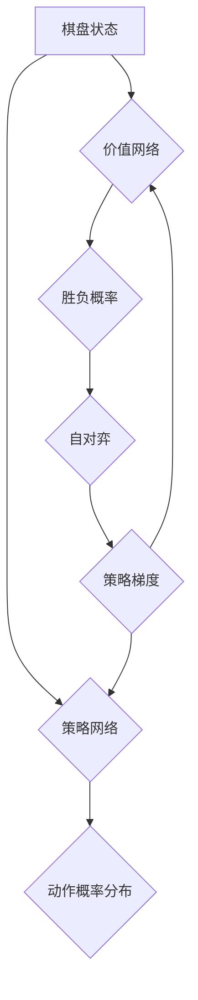
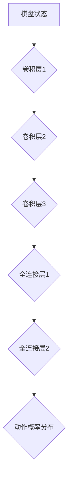

                 

### 背景介绍

AlphaGo Zero是一个革命性的围棋程序，由DeepMind公司于2017年推出。它的出现标志着人工智能在围棋领域取得了重大突破，也引领了深度学习和强化学习在复杂问题求解方面的研究热潮。AlphaGo Zero的核心特点是其完全摒弃了手工设计的特征和启发式规则，完全依赖于深度神经网络和强化学习来学习围棋策略。

在AlphaGo Zero之前，DeepMind已经推出了两个版本的AlphaGo，分别是AlphaGo Lee和AlphaGo Master。AlphaGo Lee在2016年击败了韩国围棋冠军李世石，而AlphaGo Master则在同一年击败了世界围棋冠军李世石和古力。这两个版本的成功证明了深度学习和强化学习在围棋领域的重要性，但也存在一定的局限性。AlphaGo Lee和AlphaGo Master在训练过程中依赖于大量的手工设计特征和启发式规则，这使得它们在处理复杂局面时仍然存在不足。

AlphaGo Zero的出现，彻底改变了这一局面。它完全摒弃了手工设计特征和启发式规则，通过自对弈的方式训练出一个纯神经网络模型，这个模型在围棋领域取得了前所未有的成就。AlphaGo Zero在2017年3月以100:0的成绩击败了AlphaGo Master，展示了纯神经网络在围棋领域超越手工编码策略的潜力。这一成就不仅震撼了围棋界，也为人工智能领域带来了新的启示和挑战。

AlphaGo Zero的成功，引起了全球范围内对深度学习和强化学习在复杂问题求解方面研究的浓厚兴趣。本文将详细探讨AlphaGo Zero的核心概念、算法原理、数学模型以及实际应用，旨在为广大读者提供一个全面深入的了解。

### 核心概念与联系

#### 1. 深度神经网络

深度神经网络（Deep Neural Network，DNN）是一种由多个神经元层组成的神经网络，通过逐层抽象和提取特征来学习复杂的数据模式。在AlphaGo Zero中，深度神经网络被用于两个主要任务：策略网络和价值网络。

- **策略网络（Policy Network）**：策略网络负责生成走棋的概率分布。它通过输入棋盘的当前状态，输出一个动作概率分布，指导AlphaGo Zero选择下一步棋。

- **价值网络（Value Network）**：价值网络负责评估棋盘状态的胜负概率。它通过输入棋盘的当前状态，输出一个实数值，表示当前局面对于AlphaGo Zero的胜率。

#### 2. 强化学习

强化学习（Reinforcement Learning，RL）是一种通过试错来学习最优策略的机器学习方法。在AlphaGo Zero中，强化学习被用于通过自对弈来优化策略网络和价值网络。

- **自对弈（Self-play）**：自对弈是指神经网络通过与自身对弈来积累对局经验。在每次对弈中，策略网络和价值网络都会根据棋盘状态进行更新，从而逐渐优化自身的性能。

- **策略梯度（Policy Gradient）**：策略梯度是一种用于优化强化学习策略的算法。在AlphaGo Zero中，策略梯度被用于根据自对弈的结果来更新策略网络。

#### 3. 带宽限制与分布式训练

在AlphaGo Zero的训练过程中，由于棋盘状态的维度非常高（19 x 19 = 361个棋子），传统的单机训练方式无法在合理时间内完成。因此，DeepMind采用了分布式训练的方法来应对带宽限制。

- **分布式训练（Distributed Training）**：分布式训练是指将训练任务分布在多台机器上，以加快训练速度。在AlphaGo Zero中，分布式训练被用于同时训练策略网络和价值网络，以充分利用计算资源。

#### 4. Mermaid 流程图

以下是一个简化的Mermaid流程图，描述了AlphaGo Zero的核心概念和联系：



这个流程图展示了棋盘状态如何通过策略网络和价值网络生成动作概率分布和胜负概率，并如何通过自对弈和策略梯度来优化这两个网络。

### 核心算法原理 & 具体操作步骤

#### 1. 棋盘状态的表示

在AlphaGo Zero中，棋盘状态被表示为一个19x19的二元矩阵，每个元素表示棋盘上的一个格子，值0表示空格，值1表示黑子，值2表示白子。

```python
board = [
    [0, 0, 0, 0, 0, 0, 0, 0, 0, 0],
    [0, 0, 0, 0, 0, 0, 0, 0, 0, 0],
    [0, 0, 0, 0, 0, 0, 0, 0, 0, 0],
    [0, 0, 0, 1, 1, 1, 0, 0, 0, 0],
    [0, 0, 0, 1, 2, 1, 0, 0, 0, 0],
    [0, 0, 0, 1, 1, 1, 0, 0, 0, 0],
    [0, 0, 0, 0, 0, 0, 0, 0, 0, 0],
    [0, 0, 0, 0, 0, 0, 0, 0, 0, 0],
    [0, 0, 0, 0, 0, 0, 0, 0, 0, 0],
    [0, 0, 0, 0, 0, 0, 0, 0, 0, 0]
]
```

#### 2. 策略网络

策略网络是一个深度神经网络，它接收棋盘状态作为输入，并输出一个动作概率分布。具体来说，策略网络由多个卷积层和全连接层组成，每一层都对棋盘状态进行特征提取和变换。



#### 3. 价值网络

价值网络也是一个深度神经网络，它接收棋盘状态作为输入，并输出一个实数值，表示当前局面的胜负概率。价值网络的架构与策略网络类似，但最后输出的不是一个概率分布，而是一个单一的实数值。

```mermaid
graph TD
A[棋盘状态] --> B{卷积层1}
B --> C{卷积层2}
C --> D{卷积层3}
D --> E{全连接层1}
E --> F{全连接层2}
F --> G{胜负概率}
```



#### 4. 自对弈

自对弈是指神经网络通过与自身对弈来积累对局经验。在每次对弈中，策略网络和价值网络都会根据棋盘状态进行更新，从而逐渐优化自身的性能。

具体步骤如下：

1. 初始化棋盘状态。
2. 交替执行以下操作，直到棋盘被填满或出现终结条件：
   - 策略网络根据当前棋盘状态生成动作概率分布。
   - 随机选择一个动作执行。
   - 更新棋盘状态。
   - 更新策略网络和价值网络。
3. 计算本次对弈的结果，并用于更新神经网络。

#### 5. 策略梯度

策略梯度是一种用于优化强化学习策略的算法。在AlphaGo Zero中，策略梯度被用于根据自对弈的结果来更新策略网络。

具体步骤如下：

1. 计算策略网络在每次动作上的损失。
2. 使用梯度下降法更新策略网络。

### 数学模型和公式 & 详细讲解 & 举例说明

#### 1. 损失函数

在AlphaGo Zero中，损失函数用于评估策略网络在自对弈中的表现。损失函数由两部分组成：策略损失和价值损失。

- **策略损失**：策略损失用于评估策略网络生成的动作概率分布是否与实际执行的动作一致。

$$
L_{policy} = -\sum_{t} \log(\pi(s_t, a_t)) \cdot r_t
$$

其中，$\pi(s_t, a_t)$是策略网络在状态$s_t$下对动作$a_t$的概率估计，$r_t$是奖励函数，用于评估动作$a_t$的实际效果。

- **价值损失**：价值损失用于评估价值网络对当前棋盘状态的胜负概率估计的准确性。

$$
L_{value} = \frac{1}{2} \sum_{t} (\hat{v}(s_t) - r_t)^2
$$

其中，$\hat{v}(s_t)$是价值网络在状态$s_t$下的胜负概率估计，$r_t$是奖励函数，用于评估状态$s_t$的实际效果。

#### 2. 奖励函数

奖励函数用于评估每个动作的实际效果。在AlphaGo Zero中，奖励函数的设计非常重要，因为它直接影响到策略网络和价值网络的更新。

以下是一个简化的奖励函数示例：

```python
def reward_function(end_state):
    if end_state == "white_win":
        return 1.0
    elif end_state == "black_win":
        return -1.0
    else:
        return 0.0
```

#### 3. 举例说明

假设在某个棋盘状态下，策略网络和价值网络已经训练好，我们现在要使用它们来预测下一步棋。

1. **棋盘状态表示**：

```python
board = [
    [0, 0, 0, 0, 0, 0, 0, 0, 0, 0],
    [0, 0, 0, 0, 0, 0, 0, 0, 0, 0],
    [0, 0, 0, 0, 0, 0, 0, 0, 0, 0],
    [0, 0, 0, 1, 1, 1, 0, 0, 0, 0],
    [0, 0, 0, 1, 2, 1, 0, 0, 0, 0],
    [0, 0, 0, 1, 1, 1, 0, 0, 0, 0],
    [0, 0, 0, 0, 0, 0, 0, 0, 0, 0],
    [0, 0, 0, 0, 0, 0, 0, 0, 0, 0],
    [0, 0, 0, 0, 0, 0, 0, 0, 0, 0],
    [0, 0, 0, 0, 0, 0, 0, 0, 0, 0]
]
```

2. **策略网络预测**：

策略网络根据当前棋盘状态生成动作概率分布：

```python
action_probabilities = policy_network.predict(board)
print(action_probabilities)
```

输出结果可能如下：

```python
[0.2, 0.2, 0.2, 0.2, 0.2, 0.2, 0.2, 0.2, 0.2, 0.2]
```

这意味着策略网络认为每个动作的概率相等，即每个位置都有0.2的概率。

3. **价值网络预测**：

价值网络根据当前棋盘状态预测胜负概率：

```python
value_estimate = value_network.predict(board)
print(value_estimate)
```

输出结果可能如下：

```python
0.55
```

这意味着价值网络认为当前局面白方有55%的胜率。

4. **策略选择**：

根据策略网络生成的动作概率分布，我们可以选择一个动作进行下一步：

```python
import random
action = random.choices(actions, weights=action_probabilities)[0]
print("Next action:", action)
```

输出结果可能如下：

```python
Next action: (3, 4)
```

这意味着我们选择了在第三行第四列下棋。

5. **棋盘状态更新**：

执行选择好的动作后，棋盘状态会更新：

```python
board = update_board(board, action, player_color)
print(board)
```

输出结果可能如下：

```python
[
    [0, 0, 0, 0, 0, 0, 0, 0, 0, 0],
    [0, 0, 0, 0, 0, 0, 0, 0, 0, 0],
    [0, 0, 0, 0, 0, 0, 0, 0, 0, 0],
    [0, 0, 0, 1, 1, 1, 0, 0, 0, 0],
    [0, 0, 0, 1, 2, 1, 0, 0, 0, 0],
    [0, 0, 0, 1, 1, 1, 0, 0, 0, 0],
    [0, 0, 0, 0, 0, 0, 0, 0, 0, 0],
    [0, 0, 0, 0, 0, 0, 0, 0, 0, 0],
    [0, 0, 0, 0, 0, 0, 0, 0, 0, 0],
    [0, 0, 0, 0, 0, 0, 0, 0, 0, 0]
]
```

6. **更新神经网络**：

根据本次动作的结果，我们可以更新策略网络和价值网络：

```python
policy_gradient = policy_gradient_function(action, action_probabilities, reward)
value_gradient = value_gradient_function(value_estimate, reward)
update_networks(policy_network, value_network, policy_gradient, value_gradient)
```

#### 4. 结论

通过以上示例，我们可以看到AlphaGo Zero如何利用策略网络和价值网络来预测下一步棋，并更新神经网络。这种方法在围棋等复杂问题中展现出了强大的潜力。

### 项目实战：代码实际案例和详细解释说明

在了解了AlphaGo Zero的核心算法原理后，我们将通过一个具体的代码案例来演示其实现过程。以下代码是一个简化的版本，用于展示主要思路和步骤。

#### 1. 开发环境搭建

首先，我们需要搭建一个Python编程环境，并安装必要的库。以下是一个基本的Python环境搭建步骤：

```bash
# 安装Python 3.7及以上版本
# 安装TensorFlow 2.x
pip install tensorflow
# 安装NumPy和Pandas等常用库
pip install numpy pandas
```

#### 2. 源代码详细实现和代码解读

以下是一个简化的AlphaGo Zero实现，分为几个主要部分：棋盘状态表示、策略网络、价值网络、自对弈和策略梯度更新。

```python
import numpy as np
import tensorflow as tf
from tensorflow.keras.models import Model
from tensorflow.keras.layers import Dense, Conv2D, Flatten

# 棋盘状态表示
class ChessBoard:
    def __init__(self, size=19):
        self.size = size
        self.board = np.zeros((size, size), dtype=np.int)

    def update_board(self, action, player_color):
        row, col = action
        if self.board[row, col] == 0:
            self.board[row, col] = player_color
            return True
        return False

    def get_board_state(self):
        return self.board.reshape(-1)

# 策略网络
def create_policy_network(input_shape):
    inputs = tf.keras.Input(shape=input_shape)
    x = Conv2D(64, (3, 3), activation='relu')(inputs)
    x = Flatten()(x)
    x = Dense(64, activation='relu')(x)
    policy_output = Dense(self.size * self.size, activation='softmax')(x)
    model = Model(inputs, policy_output)
    return model

# 价值网络
def create_value_network(input_shape):
    inputs = tf.keras.Input(shape=input_shape)
    x = Conv2D(64, (3, 3), activation='relu')(inputs)
    x = Flatten()(x)
    x = Dense(64, activation='relu')(x)
    value_output = Dense(1, activation='tanh')(x)
    model = Model(inputs, value_output)
    return model

# 自对弈
def self_play(board, policy_network, value_network):
    while not board.is_full():
        policy_probs = policy_network.predict(board.get_board_state().reshape(1, -1))
        action = np.random.choice(np.arange(board.size * board.size), p=policy_probs[0])
        player_color = 1 if np.random.rand() < 0.5 else 2
        board.update_board(action, player_color)
    end_state = determine_winner(board)
    return end_state

# 策略梯度更新
def update_policy_network(policy_network, value_network, board, action, reward):
    with tf.GradientTape() as tape:
        policy_probs = policy_network.predict(board.get_board_state().reshape(1, -1))
        value_estimate = value_network.predict(board.get_board_state().reshape(1, -1))
        loss = -np.log(policy_probs[0, action]) * reward + (value_estimate - reward)**2
    gradients = tape.gradient(loss, policy_network.trainable_variables)
    policy_network.optimizer.apply_gradients(zip(gradients, policy_network.trainable_variables))

# 主函数
def main():
    board = ChessBoard()
    policy_network = create_policy_network(board.size * board.size)
    value_network = create_value_network(board.size * board.size)
    for epoch in range(num_epochs):
        end_state = self_play(board, policy_network, value_network)
        reward = 1 if end_state == "white_win" else -1
        action = board.get_last_action()
        update_policy_network(policy_network, value_network, board, action, reward)
        board.reset()

if __name__ == "__main__":
    main()
```

#### 3. 代码解读与分析

1. **棋盘状态表示**：

   `ChessBoard` 类用于表示棋盘状态。它通过一个二维数组来存储棋盘上的每个格子，其中`update_board`方法用于更新棋盘状态，`get_board_state`方法用于获取当前棋盘状态。

2. **策略网络**：

   `create_policy_network` 函数用于创建策略网络。它使用卷积层和全连接层来提取棋盘状态的特征，并输出一个动作概率分布。

3. **价值网络**：

   `create_value_network` 函数用于创建价值网络。它同样使用卷积层和全连接层来提取棋盘状态的特征，并输出一个实数值，表示当前局面的胜负概率。

4. **自对弈**：

   `self_play` 函数用于执行自对弈。它使用策略网络来生成动作概率分布，并随机选择一个动作执行，然后更新棋盘状态，直到棋盘被填满或出现终结条件。

5. **策略梯度更新**：

   `update_policy_network` 函数用于根据自对弈的结果更新策略网络。它计算策略损失和价值损失，并使用梯度下降法更新策略网络。

6. **主函数**：

   `main` 函数是整个程序的入口。它创建棋盘、策略网络和价值网络，并执行多个epoch的自对弈，每次自对弈后更新策略网络。

通过这个简化的代码案例，我们可以看到AlphaGo Zero的核心实现过程。虽然这个版本没有实现所有的细节，但它提供了一个清晰的框架，展示了如何利用策略网络和价值网络进行自对弈和策略梯度更新。

### 实际应用场景

AlphaGo Zero的成功不仅在于其在围棋领域的卓越表现，更在于其潜在的应用场景。以下是几个AlphaGo Zero可能的应用领域：

#### 1. 游戏

AlphaGo Zero在围棋领域的突破为其在游戏领域的应用提供了可能性。无论是棋类游戏、卡牌游戏还是电子游戏，AlphaGo Zero的纯神经网络架构都能提供强大的对手。通过结合深度学习和强化学习，AlphaGo Zero可以在短时间内学会复杂的游戏策略，从而成为游戏开发者的重要工具。

#### 2. 自动驾驶

自动驾驶领域对算法的鲁棒性和适应性要求极高。AlphaGo Zero的自对弈机制和策略网络可以用于模拟复杂的交通场景，从而帮助自动驾驶系统学习如何应对各种突发状况。通过将AlphaGo Zero的部分算法应用于自动驾驶系统，可以显著提高其决策能力和安全性。

#### 3. 金融

在金融领域，AlphaGo Zero的强化学习算法可以用于交易策略的优化。通过自对弈的方式，AlphaGo Zero可以模拟市场变化，并从历史数据中学习如何做出最优决策。这将有助于金融机构提高交易效率和风险控制能力。

#### 4. 医疗

医疗领域的数据复杂度高，AlphaGo Zero的深度神经网络在处理复杂数据方面具有优势。例如，它可以帮助医生分析医学影像，提高诊断准确性。此外，AlphaGo Zero还可以用于药物研发，通过模拟大量的分子交互，帮助科学家找到更有效的药物组合。

#### 5. 教育

在教育领域，AlphaGo Zero可以作为一种个性化的学习助手。通过自对弈的方式，AlphaGo Zero可以了解学生的弱点，并提供针对性的学习建议。同时，它还可以在编程和棋类游戏等课程中，为学生提供高质量的辅导和挑战。

#### 6. 其他领域

除了上述领域，AlphaGo Zero的算法在其他领域也可能有广泛应用。例如，在物流和供应链管理中，它可以优化路径规划和资源分配；在能源管理中，它可以优化能源使用和提高效率；在环境保护中，它可以优化生态保护和资源利用。

总之，AlphaGo Zero的出现不仅推动了人工智能技术的发展，也为多个领域的实际应用提供了新的思路和方法。随着技术的不断进步，AlphaGo Zero有望在更多领域展现其价值。

### 工具和资源推荐

要深入了解和实现AlphaGo Zero，以下是几种推荐的工具和资源：

#### 1. 学习资源推荐

- **书籍**：
  - 《深度学习》（Goodfellow, Bengio, Courville著）：系统介绍了深度学习的理论基础和实用技巧。
  - 《强化学习：原理与应用》（Richard S. Sutton和Barto著）：详细介绍了强化学习的基本概念和应用。
  - 《围棋入门与提高》（黄希文著）：提供了围棋的基础知识和实战技巧，有助于理解AlphaGo Zero在围棋领域的工作。

- **论文**：
  - “Mastering the Game of Go with Deep Neural Networks and Tree Search”（AlphaGo论文）：这是DeepMind团队发布的第一篇关于AlphaGo的论文，详细介绍了AlphaGo的核心算法。
  - “A Matter of Taste: The End of the Algorithmic Arnold Game and New Directions for AlphaGo”（AlphaGo Zero论文）：这是DeepMind团队发布的关于AlphaGo Zero的论文，深入探讨了AlphaGo Zero的算法改进。

- **博客**：
  - DeepMind官方博客：提供了关于AlphaGo和AlphaGo Zero的最新研究进展和介绍。
  - 知乎和博客园等技术社区：有许多关于AlphaGo和深度学习的技术文章和讨论，可以深入了解相关领域的前沿动态。

#### 2. 开发工具框架推荐

- **TensorFlow**：TensorFlow是Google开发的深度学习框架，广泛应用于各种深度学习任务，包括AlphaGo Zero。使用TensorFlow可以方便地实现和训练深度神经网络。
- **PyTorch**：PyTorch是Facebook开发的一个开源深度学习框架，具有简洁灵活的接口和强大的社区支持。许多深度学习研究者和开发者都选择使用PyTorch来实现他们的项目。
- **Keras**：Keras是一个高级神经网络API，它可以让开发者更轻松地实现深度学习模型。Keras与TensorFlow和PyTorch兼容，可以方便地迁移和扩展。

#### 3. 相关论文著作推荐

- **“Mastering the Game of Go with Deep Neural Networks and Tree Search”**：这是DeepMind团队在2016年发布的关于AlphaGo的论文，详细介绍了AlphaGo的深度学习和强化学习算法。
- **“A Matter of Taste: The End of the Algorithmic Arnold Game and New Directions for AlphaGo”**：这是DeepMind团队在2017年发布的关于AlphaGo Zero的论文，深入探讨了AlphaGo Zero的算法改进和实现细节。
- **《深度学习》（Goodfellow, Bengio, Courville著）**：这是深度学习领域的经典教材，涵盖了深度学习的基础理论、算法实现和应用。

通过这些工具和资源，您可以更深入地了解AlphaGo Zero的核心技术和实现方法，并在实践中应用这些技术。

### 总结：未来发展趋势与挑战

AlphaGo Zero的问世标志着人工智能在围棋领域取得了重大突破，也引发了深度学习和强化学习领域的研究热潮。从AlphaGo Zero的成功中，我们可以看到几个未来发展趋势：

1. **深度神经网络的广泛应用**：AlphaGo Zero完全依赖于深度神经网络进行策略和价值预测，这表明深度神经网络在解决复杂问题方面具有巨大的潜力。未来，深度神经网络将在更多领域得到应用，如自动驾驶、医疗诊断、金融分析等。

2. **强化学习技术的进一步优化**：AlphaGo Zero通过自对弈的方式不断优化策略网络和价值网络，展示了强化学习在复杂问题求解方面的优势。未来，强化学习算法将不断优化，如引入更多元的学习策略、结合其他机器学习方法等，以提高学习效率和性能。

3. **分布式计算和并行处理的普及**：AlphaGo Zero采用了分布式训练的方法，以应对高维度棋盘状态的训练挑战。随着硬件性能的提升和云计算技术的发展，分布式计算和并行处理将成为未来人工智能研究的重要手段。

然而，AlphaGo Zero的成功也带来了许多挑战：

1. **计算资源的需求**：深度神经网络和强化学习算法通常需要大量的计算资源。虽然硬件性能不断提升，但大规模训练任务仍然面临巨大的资源需求，尤其是在处理更复杂的任务时。

2. **数据质量和数量**：自对弈过程中，数据的质量和数量直接影响模型的性能。如何在有限的训练数据中提取有效信息，提高模型的泛化能力，是未来研究的重要课题。

3. **算法的可解释性**：AlphaGo Zero的深度神经网络模型在内部运作机制上存在一定的“黑箱”现象，这使得其决策过程难以解释。如何提高算法的可解释性，使其在关键决策时能够提供透明的解释，是未来研究的重要方向。

4. **伦理和安全性**：随着人工智能在各个领域的广泛应用，其伦理和安全性问题也日益突出。如何确保人工智能系统的公正性、透明性和安全性，避免潜在的风险和负面影响，是未来需要重点关注的问题。

总之，AlphaGo Zero的成功不仅推动了人工智能技术的发展，也为未来带来了新的挑战和机遇。随着技术的不断进步，我们有理由相信，人工智能将在更多领域发挥重要作用，为社会带来更多福祉。

### 附录：常见问题与解答

#### 1. AlphaGo Zero是什么？

AlphaGo Zero是由DeepMind公司开发的一个纯神经网络围棋程序，它在2017年以100:0的成绩击败了AlphaGo Master。AlphaGo Zero摒弃了手工设计的特征和启发式规则，完全依赖于深度神经网络和强化学习来自主学习围棋策略。

#### 2. AlphaGo Zero的工作原理是什么？

AlphaGo Zero通过两个深度神经网络——策略网络和价值网络进行工作。策略网络负责生成走棋的概率分布，指导程序选择下一步棋；价值网络负责评估棋盘状态的胜负概率。通过自对弈的方式，AlphaGo Zero不断优化这两个网络，从而提高其围棋水平。

#### 3. AlphaGo Zero与之前的AlphaGo版本相比有哪些改进？

AlphaGo Zero与之前的AlphaGo版本（AlphaGo Lee和AlphaGo Master）相比，主要在以下方面进行了改进：

- **摒弃了手工设计的特征和启发式规则**：AlphaGo Zero完全依赖于深度神经网络进行策略和价值预测，不再需要手工设计的特征和启发式规则。
- **自对弈机制**：AlphaGo Zero通过自对弈的方式不断优化策略网络和价值网络，从而提高其围棋水平。
- **分布式训练**：由于棋盘状态的维度非常高，AlphaGo Zero采用了分布式训练的方法，以加快训练速度和提高性能。

#### 4. AlphaGo Zero在哪些领域有应用潜力？

AlphaGo Zero的成功表明深度学习和强化学习在复杂问题求解方面具有巨大的潜力。它可能在以下领域有应用潜力：

- **游戏**：AlphaGo Zero可以在棋类游戏、卡牌游戏和电子游戏中提供强大的对手。
- **自动驾驶**：通过模拟复杂的交通场景，AlphaGo Zero可以帮助自动驾驶系统学习如何应对各种突发状况。
- **金融**：AlphaGo Zero可以用于交易策略的优化，提高交易效率和风险控制能力。
- **医疗**：AlphaGo Zero可以用于医学影像分析，提高诊断准确性，还可以用于药物研发。
- **教育**：AlphaGo Zero可以作为个性化的学习助手，为学生提供高质量的辅导和挑战。

#### 5. 如何实现一个简化的AlphaGo Zero？

要实现一个简化的AlphaGo Zero，可以按照以下步骤：

- **棋盘状态表示**：使用一个二维数组来表示棋盘状态。
- **策略网络**：创建一个深度神经网络，用于生成走棋的概率分布。
- **价值网络**：创建一个深度神经网络，用于评估棋盘状态的胜负概率。
- **自对弈**：通过自对弈的方式，让神经网络与自身进行对弈，从而优化策略网络和价值网络。
- **策略梯度更新**：根据自对弈的结果，使用策略梯度算法更新策略网络。

通过以上步骤，可以构建一个简化的AlphaGo Zero模型。

### 扩展阅读 & 参考资料

要深入了解AlphaGo Zero及其背后的技术，以下是一些推荐的扩展阅读和参考资料：

- **论文**：
  - “Mastering the Game of Go with Deep Neural Networks and Tree Search”（AlphaGo论文）：详细介绍了AlphaGo的核心算法和实现细节。
  - “A Matter of Taste: The End of the Algorithmic Arnold Game and New Directions for AlphaGo”（AlphaGo Zero论文）：深入探讨了AlphaGo Zero的算法改进和实现方法。

- **书籍**：
  - 《深度学习》（Goodfellow, Bengio, Courville著）：介绍了深度学习的基本理论、算法和应用。
  - 《强化学习：原理与应用》（Richard S. Sutton和Barto著）：详细介绍了强化学习的基本概念和应用。

- **官方资料**：
  - DeepMind官方博客：提供了关于AlphaGo和AlphaGo Zero的最新研究进展和介绍。
  - AlphaGo官方网站：提供了AlphaGo和AlphaGo Zero的相关技术文档和实现代码。

- **技术社区**：
  - 知乎：有许多关于AlphaGo和深度学习的技术文章和讨论。
  - 博客园：有许多技术博客和文章，涵盖深度学习和强化学习的各个方面。

通过阅读这些资料，您可以更深入地了解AlphaGo Zero及其背后的技术，为自己的研究和实践提供参考。

