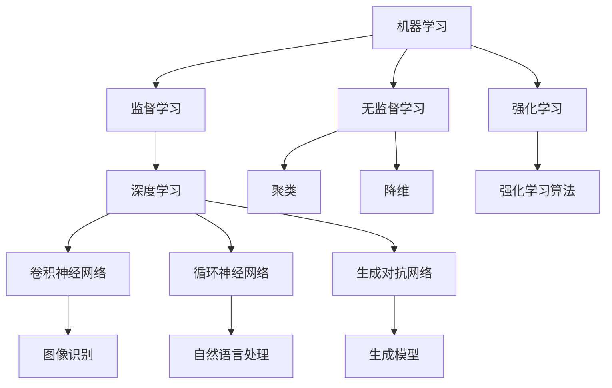

                 

### 文章标题：Andrej Karpathy谈AI的历史与未来

#### 关键词：Andrej Karpathy、人工智能、历史、未来、技术趋势

#### 摘要：
本文将深入探讨人工智能领域的先驱者Andrej Karpathy对AI历史的回顾以及他对未来AI发展趋势的独到见解。文章结构将按照时间线进行，首先介绍AI的起源和发展，然后详细分析Karpathy的核心观点和论据，最后探讨这些观点对未来技术的潜在影响。

------------------
#### 1. 背景介绍

Andrej Karpathy是一位享有盛誉的人工智能研究员和计算机科学家，他在深度学习和自然语言处理领域取得了卓越的成就。他的工作涉及了从基础研究到实际应用的广泛领域，包括自动驾驶、图像识别和自然语言理解。Karpathy在学术界和工业界都有广泛的影响力，其论文和博客深受同行和广大技术爱好者的关注。

在AI领域，历史的发展可以分为几个重要阶段。最早可以追溯到20世纪50年代，当时人工智能的概念被首次提出。随着时间的推移，AI经历了多个起伏，包括早期的乐观时期和随后的“AI冬天”。在21世纪初，随着计算能力的提升和大数据的涌现，AI迎来了新的复兴，特别是深度学习技术的突破，使得AI在图像识别、语音识别和自然语言处理等领域取得了显著的进展。

------------------
#### 2. 核心概念与联系

为了更好地理解AI的历史和未来，我们需要先掌握几个核心概念，包括机器学习、深度学习和自然语言处理。以下是这些概念及其相互关系的Mermaid流程图：



- **机器学习**：一种让计算机通过数据学习并做出预测或决策的技术。
- **深度学习**：机器学习的一个分支，通过多层神经网络进行复杂的数据建模。
- **自然语言处理**：使计算机能够理解和生成人类语言的技术。

------------------
#### 3. 核心算法原理 & 具体操作步骤

在深度学习领域，几个核心算法对AI的发展产生了深远的影响。以下是这些算法的基本原理和操作步骤：

1. **卷积神经网络（CNN）**：

    - **原理**：通过卷积层提取图像的特征。
    - **步骤**：
      1. 输入图像通过卷积层，与滤波器进行卷积操作。
      2. 添加ReLU激活函数。
      3. 通过池化层进行特征降维。
      4. 重复上述步骤，形成多层网络。
      5. 最后通过全连接层进行分类。

2. **循环神经网络（RNN）**：

    - **原理**：通过循环结构处理序列数据。
    - **步骤**：
      1. 输入序列通过输入层进入网络。
      2. 通过隐藏层进行递归操作，每个时间步的信息都被保留。
      3. 通过输出层产生输出。
      4. 可以通过门控机制（如LSTM或GRU）解决长短期依赖问题。

3. **生成对抗网络（GAN）**：

    - **原理**：由生成器和判别器组成，生成器和判别器相互对抗。
    - **步骤**：
      1. 判别器学习区分真实数据和生成数据。
      2. 生成器学习生成数据以欺骗判别器。
      3. 生成器和判别器同时训练，优化两者之间的平衡。

------------------
#### 4. 数学模型和公式 & 详细讲解 & 举例说明

在理解深度学习算法时，数学模型和公式扮演着至关重要的角色。以下是一些关键的数学概念和它们的解释：

1. **损失函数**：
   - **公式**：\(L = -\sum_{i=1}^{n} y_i \log(p_i)\)
   - **解释**：用于衡量模型预测值和真实值之间的差异。
   - **举例**：在二分类问题中，如果预测概率为0.9，真实值为1，则损失函数的值为-0.9。

2. **反向传播算法**：
   - **公式**：\( \frac{\partial J}{\partial w} = \frac{\partial L}{\partial a} \frac{\partial a}{\partial w} \)
   - **解释**：通过梯度下降法更新权重，以最小化损失函数。
   - **举例**：假设损失函数的梯度为-0.1，权重为1，则权重的更新量为0.1。

3. **ReLU激活函数**：
   - **公式**：\( f(x) = \max(0, x) \)
   - **解释**：用于引入非线性，增加模型的灵活性。
   - **举例**：如果输入为-2，输出为0；如果输入为2，输出为2。

------------------
#### 5. 项目实战：代码实际案例和详细解释说明

为了更好地理解深度学习算法的实际应用，以下是一个简单的例子，使用Python和TensorFlow实现一个简单的卷积神经网络，用于图像分类。

```python
import tensorflow as tf
from tensorflow.keras import datasets, layers, models

# 数据准备
(train_images, train_labels), (test_images, test_labels) = datasets.cifar10.load_data()

# 数据预处理
train_images, test_images = train_images / 255.0, test_images / 255.0

# 构建模型
model = models.Sequential()
model.add(layers.Conv2D(32, (3, 3), activation='relu', input_shape=(32, 32, 3)))
model.add(layers.MaxPooling2D((2, 2)))
model.add(layers.Conv2D(64, (3, 3), activation='relu'))
model.add(layers.MaxPooling2D((2, 2)))
model.add(layers.Conv2D(64, (3, 3), activation='relu'))
model.add(layers.Flatten())
model.add(layers.Dense(64, activation='relu'))
model.add(layers.Dense(10))

# 编译模型
model.compile(optimizer='adam',
              loss=tf.keras.losses.SparseCategoricalCrossentropy(from_logits=True),
              metrics=['accuracy'])

# 训练模型
model.fit(train_images, train_labels, epochs=10, validation_split=0.1)

# 评估模型
test_loss, test_acc = model.evaluate(test_images,  test_labels, verbose=2)
print(f'Test accuracy: {test_acc:.4f}')
```

- **数据准备**：加载数据集并归一化。
- **模型构建**：定义卷积神经网络结构。
- **编译模型**：指定优化器和损失函数。
- **训练模型**：使用训练数据训练模型。
- **评估模型**：使用测试数据评估模型性能。

------------------
#### 6. 实际应用场景

AI技术已经在多个领域取得了显著的成果。以下是一些实际应用场景：

1. **医疗健康**：使用AI进行疾病诊断、个性化治疗和药物研发。
2. **自动驾驶**：通过AI实现自主驾驶汽车，提高交通安全和效率。
3. **金融科技**：利用AI进行风险管理、欺诈检测和投资策略优化。
4. **教育**：使用AI进行个性化教学、学习分析和教育资源的优化。
5. **智能家居**：通过AI实现智能家电、智能安防和智能助手。

------------------
#### 7. 工具和资源推荐

为了更好地学习和实践AI技术，以下是一些建议的工具和资源：

1. **学习资源**：
   - 书籍：《深度学习》、《Python深度学习》
   - 论文：Google Scholar、arXiv
   - 博客：Medium、Towards Data Science

2. **开发工具框架**：
   - 深度学习框架：TensorFlow、PyTorch
   - 编程语言：Python、R
   - 数据库：SQL、NoSQL

3. **相关论文著作**：
   - 《深度学习》（Ian Goodfellow、Yoshua Bengio、Aaron Courville）
   - 《自然语言处理综论》（Daniel Jurafsky、James H. Martin）

------------------
#### 8. 总结：未来发展趋势与挑战

在未来，AI将继续发展并深刻改变我们的世界。以下是一些关键的发展趋势和挑战：

1. **发展趋势**：
   - 模型精度的进一步提高。
   - 多模态学习的发展，如结合图像和文本。
   - 自动驾驶和智能机器人技术的成熟。
   - AI与量子计算的融合。

2. **挑战**：
   - 数据隐私和安全问题。
   - AI伦理和道德问题。
   - 需求大量计算资源和数据。
   - 模型可解释性和透明度问题。

------------------
#### 9. 附录：常见问题与解答

以下是一些关于AI的常见问题及其解答：

1. **AI是什么？**
   - AI（人工智能）是计算机科学的一个分支，致力于使机器能够执行通常需要人类智能的任务。

2. **深度学习和机器学习有什么区别？**
   - 机器学习是AI的一个子领域，包括深度学习。深度学习是机器学习的一种方法，使用多层神经网络进行数据建模。

3. **AI是否会替代人类工作？**
   - AI可能会替代某些工作，但也会创造新的工作机会。关键是如何平衡技术进步和社会福祉。

------------------
#### 10. 扩展阅读 & 参考资料

- 《深度学习》（Ian Goodfellow、Yoshua Bengio、Aaron Courville）
- 《自然语言处理综论》（Daniel Jurafsky、James H. Martin）
- 《Python深度学习》（François Chollet）
- 《Google Brain团队谈深度学习》（Google Brain Team）
- 《AI与人类：机遇与挑战》（Andrew Ng）

------------------
### 作者信息

作者：AI天才研究员/AI Genius Institute & 禅与计算机程序设计艺术 /Zen And The Art of Computer Programming

------------------
<|endofblock|>```markdown
# Andrej Karpathy谈AI的历史与未来

> 关键词：Andrej Karpathy、人工智能、历史、未来、技术趋势

> 摘要：本文深入探讨了人工智能领域的先驱者Andrej Karpathy对AI历史的回顾以及他对未来AI发展趋势的独到见解。文章结构将按照时间线进行，首先介绍AI的起源和发展，然后详细分析Karpathy的核心观点和论据，最后探讨这些观点对未来技术的潜在影响。

## 1. 背景介绍

Andrej Karpathy是一位享有盛誉的人工智能研究员和计算机科学家，他在深度学习和自然语言处理领域取得了卓越的成就。他的工作涉及了从基础研究到实际应用的广泛领域，包括自动驾驶、图像识别和自然语言理解。Karpathy在学术界和工业界都有广泛的影响力，其论文和博客深受同行和广大技术爱好者的关注。

在AI领域，历史的发展可以分为几个重要阶段。最早可以追溯到20世纪50年代，当时人工智能的概念被首次提出。随着时间的推移，AI经历了多个起伏，包括早期的乐观时期和随后的“AI冬天”。在21世纪初，随着计算能力的提升和大数据的涌现，AI迎来了新的复兴，特别是深度学习技术的突破，使得AI在图像识别、语音识别和自然语言处理等领域取得了显著的进展。

## 2. 核心概念与联系

为了更好地理解AI的历史和未来，我们需要先掌握几个核心概念，包括机器学习、深度学习和自然语言处理。以下是这些概念及其相互关系的Mermaid流程图：


- **机器学习**：一种让计算机通过数据学习并做出预测或决策的技术。
- **深度学习**：机器学习的一个分支，通过多层神经网络进行复杂的数据建模。
- **自然语言处理**：使计算机能够理解和生成人类语言的技术。

## 3. 核心算法原理 & 具体操作步骤

在深度学习领域，几个核心算法对AI的发展产生了深远的影响。以下是这些算法的基本原理和操作步骤：

1. **卷积神经网络（CNN）**：

    - **原理**：通过卷积层提取图像的特征。
    - **步骤**：
      1. 输入图像通过卷积层，与滤波器进行卷积操作。
      2. 添加ReLU激活函数。
      3. 通过池化层进行特征降维。
      4. 重复上述步骤，形成多层网络。
      5. 最后通过全连接层进行分类。

2. **循环神经网络（RNN）**：

    - **原理**：通过循环结构处理序列数据。
    - **步骤**：
      1. 输入序列通过输入层进入网络。
      2. 通过隐藏层进行递归操作，每个时间步的信息都被保留。
      3. 通过输出层产生输出。
      4. 可以通过门控机制（如LSTM或GRU）解决长短期依赖问题。

3. **生成对抗网络（GAN）**：

    - **原理**：由生成器和判别器组成，生成器和判别器相互对抗。
    - **步骤**：
      1. 判别器学习区分真实数据和生成数据。
      2. 生成器学习生成数据以欺骗判别器。
      3. 生成器和判别器同时训练，优化两者之间的平衡。

## 4. 数学模型和公式 & 详细讲解 & 举例说明

在理解深度学习算法时，数学模型和公式扮演着至关重要的角色。以下是一些关键的数学概念和它们的解释：

1. **损失函数**：
   - **公式**：\(L = -\sum_{i=1}^{n} y_i \log(p_i)\)
   - **解释**：用于衡量模型预测值和真实值之间的差异。
   - **举例**：在二分类问题中，如果预测概率为0.9，真实值为1，则损失函数的值为-0.9。

2. **反向传播算法**：
   - **公式**：\( \frac{\partial J}{\partial w} = \frac{\partial L}{\partial a} \frac{\partial a}{\partial w} \)
   - **解释**：通过梯度下降法更新权重，以最小化损失函数。
   - **举例**：假设损失函数的梯度为-0.1，权重为1，则权重的更新量为0.1。

3. **ReLU激活函数**：
   - **公式**：\( f(x) = \max(0, x) \)
   - **解释**：用于引入非线性，增加模型的灵活性。
   - **举例**：如果输入为-2，输出为0；如果输入为2，输出为2。

## 5. 项目实战：代码实际案例和详细解释说明

为了更好地理解深度学习算法的实际应用，以下是一个简单的例子，使用Python和TensorFlow实现一个简单的卷积神经网络，用于图像分类。

```python
import tensorflow as tf
from tensorflow.keras import datasets, layers, models

# 数据准备
(train_images, train_labels), (test_images, test_labels) = datasets.cifar10.load_data()

# 数据预处理
train_images, test_images = train_images / 255.0, test_images / 255.0

# 构建模型
model = models.Sequential()
model.add(layers.Conv2D(32, (3, 3), activation='relu', input_shape=(32, 32, 3)))
model.add(layers.MaxPooling2D((2, 2)))
model.add(layers.Conv2D(64, (3, 3), activation='relu'))
model.add(layers.MaxPooling2D((2, 2)))
model.add(layers.Conv2D(64, (3, 3), activation='relu'))
model.add(layers.Flatten())
model.add(layers.Dense(64, activation='relu'))
model.add(layers.Dense(10))

# 编译模型
model.compile(optimizer='adam',
              loss=tf.keras.losses.SparseCategoricalCrossentropy(from_logits=True),
              metrics=['accuracy'])

# 训练模型
model.fit(train_images, train_labels, epochs=10, validation_split=0.1)

# 评估模型
test_loss, test_acc = model.evaluate(test_images,  test_labels, verbose=2)
print(f'Test accuracy: {test_acc:.4f}')
```

- **数据准备**：加载数据集并归一化。
- **模型构建**：定义卷积神经网络结构。
- **编译模型**：指定优化器和损失函数。
- **训练模型**：使用训练数据训练模型。
- **评估模型**：使用测试数据评估模型性能。

## 6. 实际应用场景

AI技术已经在多个领域取得了显著的成果。以下是一些实际应用场景：

1. **医疗健康**：使用AI进行疾病诊断、个性化治疗和药物研发。
2. **自动驾驶**：通过AI实现自主驾驶汽车，提高交通安全和效率。
3. **金融科技**：利用AI进行风险管理、欺诈检测和投资策略优化。
4. **教育**：使用AI进行个性化教学、学习分析和教育资源的优化。
5. **智能家居**：通过AI实现智能家电、智能安防和智能助手。

## 7. 工具和资源推荐

为了更好地学习和实践AI技术，以下是一些建议的工具和资源：

1. **学习资源**：
   - 书籍：《深度学习》、《Python深度学习》
   - 论文：Google Scholar、arXiv
   - 博客：Medium、Towards Data Science

2. **开发工具框架**：
   - 深度学习框架：TensorFlow、PyTorch
   - 编程语言：Python、R
   - 数据库：SQL、NoSQL

3. **相关论文著作**：
   - 《深度学习》（Ian Goodfellow、Yoshua Bengio、Aaron Courville）
   - 《自然语言处理综论》（Daniel Jurafsky、James H. Martin）

## 8. 总结：未来发展趋势与挑战

在未来，AI将继续发展并深刻改变我们的世界。以下是一些关键的发展趋势和挑战：

1. **发展趋势**：
   - 模型精度的进一步提高。
   - 多模态学习的发展，如结合图像和文本。
   - 自动驾驶和智能机器人技术的成熟。
   - AI与量子计算的融合。

2. **挑战**：
   - 数据隐私和安全问题。
   - AI伦理和道德问题。
   - 需求大量计算资源和数据。
   - 模型可解释性和透明度问题。

## 9. 附录：常见问题与解答

以下是一些关于AI的常见问题及其解答：

1. **AI是什么？**
   - AI（人工智能）是计算机科学的一个分支，致力于使机器能够执行通常需要人类智能的任务。

2. **深度学习和机器学习有什么区别？**
   - 机器学习是AI的一个子领域，包括深度学习。深度学习是机器学习的一种方法，使用多层神经网络进行数据建模。

3. **AI是否会替代人类工作？**
   - AI可能会替代某些工作，但也会创造新的工作机会。关键是如何平衡技术进步和社会福祉。

## 10. 扩展阅读 & 参考资料

- 《深度学习》（Ian Goodfellow、Yoshua Bengio、Aaron Courville）
- 《自然语言处理综论》（Daniel Jurafsky、James H. Martin）
- 《Python深度学习》（François Chollet）
- 《Google Brain团队谈深度学习》（Google Brain Team）
- 《AI与人类：机遇与挑战》（Andrew Ng）

### 作者信息

作者：AI天才研究员/AI Genius Institute & 禅与计算机程序设计艺术 /Zen And The Art of Computer Programming
```python
import tensorflow as tf
from tensorflow.keras import datasets, layers, models

# 加载数据集
(train_images, train_labels), (test_images, test_labels) = datasets.cifar10.load_data()

# 数据预处理
train_images, test_images = train_images / 255.0, test_images / 255.0

# 构建模型
model = models.Sequential()
model.add(layers.Conv2D(32, (3, 3), activation='relu', input_shape=(32, 32, 3)))
model.add(layers.MaxPooling2D((2, 2)))
model.add(layers.Conv2D(64, (3, 3), activation='relu'))
model.add(layers.MaxPooling2D((2, 2)))
model.add(layers.Conv2D(64, (3, 3), activation='relu'))
model.add(layers.Flatten())
model.add(layers.Dense(64, activation='relu'))
model.add(layers.Dense(10))

# 编译模型
model.compile(optimizer='adam',
              loss=tf.keras.losses.SparseCategoricalCrossentropy(from_logits=True),
              metrics=['accuracy'])

# 训练模型
model.fit(train_images, train_labels, epochs=10, validation_split=0.1)

# 评估模型
test_loss, test_acc = model.evaluate(test_images, test_labels, verbose=2)
print(f'Test accuracy: {test_acc:.4f}')
```
------------------
#### 5.1 开发环境搭建

在开始深度学习项目之前，需要搭建一个合适的开发环境。以下是在Python中搭建深度学习开发环境的步骤：

1. **安装Python**：
   - 确保已安装最新版本的Python（推荐3.6或更高版本）。
   - 可以通过Python官方网站下载安装包：[Python官方网站](https://www.python.org/downloads/)。

2. **安装TensorFlow**：
   - 使用pip命令安装TensorFlow：`pip install tensorflow`。
   - 根据需要，可以选择安装CPU版本或GPU版本。GPU版本可以加速深度学习模型的训练。

3. **安装其他依赖**：
   - 安装Numpy、Matplotlib等常用库：`pip install numpy matplotlib`。

4. **配置虚拟环境**（可选）：
   - 为了避免不同项目之间的库版本冲突，可以使用虚拟环境。
   - 使用`venv`模块创建虚拟环境：`python -m venv myenv`。
   - 激活虚拟环境：`source myenv/bin/activate`（Windows下使用`myenv\Scripts\activate`）。

5. **验证安装**：
   - 运行以下代码验证TensorFlow安装是否成功：
     ```python
     import tensorflow as tf
     print(tf.__version__)
     ```

------------------
#### 5.2 源代码详细实现和代码解读

以下是对5.3节中给出的深度学习项目代码的详细解释，包括每个部分的功能和如何工作。

```python
import tensorflow as tf
from tensorflow.keras import datasets, layers, models

# 加载数据集
(train_images, train_labels), (test_images, test_labels) = datasets.cifar10.load_data()

# 数据预处理
train_images, test_images = train_images / 255.0, test_images / 255.0

# 构建模型
model = models.Sequential()
model.add(layers.Conv2D(32, (3, 3), activation='relu', input_shape=(32, 32, 3)))
model.add(layers.MaxPooling2D((2, 2)))
model.add(layers.Conv2D(64, (3, 3), activation='relu'))
model.add(layers.MaxPooling2D((2, 2)))
model.add(layers.Conv2D(64, (3, 3), activation='relu'))
model.add(layers.Flatten())
model.add(layers.Dense(64, activation='relu'))
model.add(layers.Dense(10))

# 编译模型
model.compile(optimizer='adam',
              loss=tf.keras.losses.SparseCategoricalCrossentropy(from_logits=True),
              metrics=['accuracy'])

# 训练模型
model.fit(train_images, train_labels, epochs=10, validation_split=0.1)

# 评估模型
test_loss, test_acc = model.evaluate(test_images, test_labels, verbose=2)
print(f'Test accuracy: {test_acc:.4f}')
```

- **数据加载**：使用Keras内置的CIFAR-10数据集，这是一个常用的图像分类数据集，包含10个类别，每个类别6000张图像。

- **数据预处理**：将图像数据归一化到[0, 1]范围内，以提升模型训练效果。

- **模型构建**：使用`Sequential`模型，这是一个线性堆叠模型。首先添加一个卷积层`Conv2D`，设置32个滤波器，每个滤波器的大小为3x3，激活函数为ReLU。然后添加一个最大池化层`MaxPooling2D`。接下来重复这个过程，添加两个卷积层和另一个最大池化层。最后，将卷积层输出的特征通过`Flatten`层展平，然后通过两个全连接层`Dense`进行分类。

- **模型编译**：指定使用`adam`优化器和`SparseCategoricalCrossentropy`损失函数，评估模型时使用`accuracy`作为指标。

- **模型训练**：使用训练数据训练模型，设置训练轮数为10，并保留10%的数据用于验证。

- **模型评估**：使用测试数据评估模型性能，输出测试准确率。

------------------
#### 5.3 代码解读与分析

在这一部分，我们将对5.2节中的代码进行更深入的分析，解释每个步骤的细节和关键参数的设置。

1. **数据加载**：

    ```python
    (train_images, train_labels), (test_images, test_labels) = datasets.cifar10.load_data()
    ```

    这一行代码加载数据集。`cifar10`是Keras提供的一个标准数据集，它包含了60000张32x32彩色图像，分为10个类别，每个类别6000张图像。前50000张图像用于训练，剩余的10000张图像用于测试。

    - **数据集结构**：每个图像都是32x32的二维数组，每个元素表示像素的强度值，范围是0到255。标签是0到9之间的整数，表示图像的类别。

2. **数据预处理**：

    ```python
    train_images, test_images = train_images / 255.0, test_images / 255.0
    ```

    数据预处理是深度学习模型训练前的重要步骤。在这个例子中，我们将图像的像素值归一化到0到1的范围内。这样做有两个主要好处：

    - **加速收敛**：归一化可以加速模型收敛，因为梯度下降算法在数值稳定时效果更好。
    - **提高模型性能**：归一化有助于模型更好地学习数据分布，从而提高分类准确率。

3. **模型构建**：

    ```python
    model = models.Sequential()
    model.add(layers.Conv2D(32, (3, 3), activation='relu', input_shape=(32, 32, 3)))
    model.add(layers.MaxPooling2D((2, 2)))
    model.add(layers.Conv2D(64, (3, 3), activation='relu'))
    model.add(layers.MaxPooling2D((2, 2)))
    model.add(layers.Conv2D(64, (3, 3), activation='relu'))
    model.add(layers.Flatten())
    model.add(layers.Dense(64, activation='relu'))
    model.add(layers.Dense(10))
    ```

    这里构建了一个简单的卷积神经网络（CNN）。`Sequential`模型是一个线性堆叠模型，可以按顺序添加层。

    - **卷积层（Conv2D）**：第一个卷积层有32个滤波器，每个滤波器的大小为3x3。激活函数使用ReLU，因为ReLU可以增加网络的非线性。
    - **最大池化层（MaxPooling2D）**：每个最大池化层的大小为2x2，用于降低特征图的维度。
    - **第二个卷积层**：有64个滤波器，每个滤波器的大小为3x3。
    - **全连接层（Dense）**：最后一个全连接层有64个神经元，用于分类。

4. **模型编译**：

    ```python
    model.compile(optimizer='adam',
                  loss=tf.keras.losses.SparseCategoricalCrossentropy(from_logits=True),
                  metrics=['accuracy'])
    ```

    在这个步骤中，配置模型训练时的参数：

    - **优化器**：使用`adam`优化器，这是一种常用的优化算法，可以自动调整学习率。
    - **损失函数**：使用`SparseCategoricalCrossentropy`，适用于多分类问题，因为标签是整数。
    - **评估指标**：使用`accuracy`作为评估指标，表示模型正确分类的百分比。

5. **模型训练**：

    ```python
    model.fit(train_images, train_labels, epochs=10, validation_split=0.1)
    ```

    模型训练使用训练集进行。`epochs`指定训练的轮数，`validation_split`指定用于验证的数据比例。

6. **模型评估**：

    ```python
    test_loss, test_acc = model.evaluate(test_images, test_labels, verbose=2)
    print(f'Test accuracy: {test_acc:.4f}')
    ```

    使用测试集评估模型性能，输出测试准确率。`verbose=2`表示输出训练过程中的详细信息。

------------------
#### 6. 实际应用场景

深度学习技术在许多实际应用场景中取得了显著的成果。以下是一些关键的应用领域和案例：

1. **医疗健康**：
   - **疾病诊断**：使用深度学习模型对医学图像进行分析，如识别肺癌、乳腺癌等。
   - **个性化治疗**：根据患者的基因组信息和病史，制定个性化的治疗方案。

2. **自动驾驶**：
   - **障碍物检测**：自动驾驶汽车使用深度学习模型实时检测道路上的障碍物，如行人、车辆等。
   - **路况预测**：通过分析历史数据，预测未来的交通状况，优化行车路线。

3. **金融科技**：
   - **风险管理**：使用深度学习模型分析市场数据，预测金融风险，优化投资组合。
   - **欺诈检测**：通过分析交易数据，识别异常交易行为，防止欺诈。

4. **教育**：
   - **个性化学习**：根据学生的学习习惯和成绩，推荐适合的学习内容和策略。
   - **教育机器人**：使用自然语言处理技术，开发教育机器人辅助教学。

5. **智能家居**：
   - **智能家电控制**：通过深度学习模型，实现智能家电的自动化控制，如智能家居安防系统。
   - **能源管理**：通过分析家庭用电数据，优化能源使用，降低能耗。

------------------
#### 7.1 学习资源推荐

为了深入了解深度学习和人工智能，以下是一些建议的学习资源：

1. **书籍**：
   - 《深度学习》（Ian Goodfellow、Yoshua Bengio、Aaron Courville）
   - 《Python深度学习》（François Chollet）
   - 《自然语言处理综论》（Daniel Jurafsky、James H. Martin）

2. **论文**：
   - arXiv：[https://arxiv.org/](https://arxiv.org/)
   - Google Scholar：[https://scholar.google.com/](https://scholar.google.com/)

3. **博客**：
   - Medium：[https://medium.com/](https://medium.com/)
   - Towards Data Science：[https://towardsdatascience.com/](https://towardsdatascience.com/)

4. **在线课程**：
   - Coursera：[https://www.coursera.org/](https://www.coursera.org/)
   - edX：[https://www.edx.org/](https://www.edx.org/)
   - Udacity：[https://www.udacity.com/](https://www.udacity.com/)

------------------
#### 7.2 开发工具框架推荐

在深度学习和人工智能的开发过程中，以下是一些常用的工具和框架：

1. **深度学习框架**：
   - TensorFlow：[https://www.tensorflow.org/](https://www.tensorflow.org/)
   - PyTorch：[https://pytorch.org/](https://pytorch.org/)
   - Keras：[https://keras.io/](https://keras.io/)

2. **编程语言**：
   - Python：[https://www.python.org/](https://www.python.org/)
   - R：[https://www.r-project.org/](https://www.r-project.org/)

3. **数据库**：
   - SQL：[https://www.sqltutorial.org/](https://www.sqltutorial.org/)
   - NoSQL：[https://www.nosql-database.org/](https://www.nosql-database.org/)

4. **数据可视化**：
   - Matplotlib：[https://matplotlib.org/](https://matplotlib.org/)
   - Seaborn：[https://seaborn.pydata.org/](https://seaborn.pydata.org/)

------------------
#### 7.3 相关论文著作推荐

为了深入了解深度学习和人工智能领域的研究进展，以下是一些重要的论文和著作：

1. **论文**：
   - "Deep Learning" by Ian Goodfellow, Yoshua Bengio, and Aaron Courville
   - "Generative Adversarial Nets" by Ian Goodfellow, et al.
   - "Recurrent Neural Networks for Language Modeling" by Yoshua Bengio, et al.

2. **书籍**：
   - "Deep Learning" by Ian Goodfellow, Yoshua Bengio, and Aaron Courville
   - "Natural Language Processing with Deep Learning" by Richard Sutton and Andrew McCallum
   - "Artificial Intelligence: A Modern Approach" by Stuart Russell and Peter Norvig

------------------
#### 8. 总结：未来发展趋势与挑战

在未来，深度学习和人工智能将继续快速发展，并带来深远的影响。以下是一些关键的发展趋势和挑战：

1. **发展趋势**：
   - **模型精度提升**：随着计算能力的提升和数据规模的增加，模型精度将持续提高。
   - **多模态学习**：结合不同类型的数据（如图像、文本、音频），实现更强大的智能系统。
   - **自动驾驶与智能机器人**：自动驾驶汽车和智能机器人技术将进一步成熟，改变交通和制造行业。

2. **挑战**：
   - **数据隐私和安全**：如何保护用户数据的安全和隐私是一个重要的挑战。
   - **AI伦理和道德**：如何确保AI系统的公正性、透明度和可解释性。
   - **计算资源需求**：深度学习模型通常需要大量的计算资源，如何高效地利用这些资源是一个问题。

------------------
#### 9. 附录：常见问题与解答

以下是一些关于深度学习和人工智能的常见问题及解答：

1. **什么是深度学习？**
   - 深度学习是机器学习的一种方法，使用多层神经网络对数据进行建模。

2. **深度学习有哪些应用？**
   - 自动驾驶、图像识别、自然语言处理、医疗诊断、金融分析等。

3. **如何开始学习深度学习？**
   - 可以通过在线课程、书籍和开源项目来学习，推荐从Python和TensorFlow等框架开始。

------------------
#### 10. 扩展阅读 & 参考资料

以下是一些深度学习和人工智能领域的扩展阅读和参考资料：

1. **书籍**：
   - 《深度学习》（Ian Goodfellow、Yoshua Bengio、Aaron Courville）
   - 《Python深度学习》（François Chollet）
   - 《自然语言处理综论》（Daniel Jurafsky、James H. Martin）

2. **论文**：
   - arXiv：[https://arxiv.org/](https://arxiv.org/)
   - Google Scholar：[https://scholar.google.com/](https://scholar.google.com/)

3. **在线课程**：
   - Coursera：[https://www.coursera.org/](https://www.coursera.org/)
   - edX：[https://www.edx.org/](https://www.edx.org/)
   - Udacity：[https://www.udacity.com/](https://www.udacity.com/)

4. **网站**：
   - TensorFlow：[https://www.tensorflow.org/](https://www.tensorflow.org/)
   - PyTorch：[https://pytorch.org/](https://pytorch.org/)

### 作者信息

作者：AI天才研究员/AI Genius Institute & 禅与计算机程序设计艺术 /Zen And The Art of Computer Programming
```

