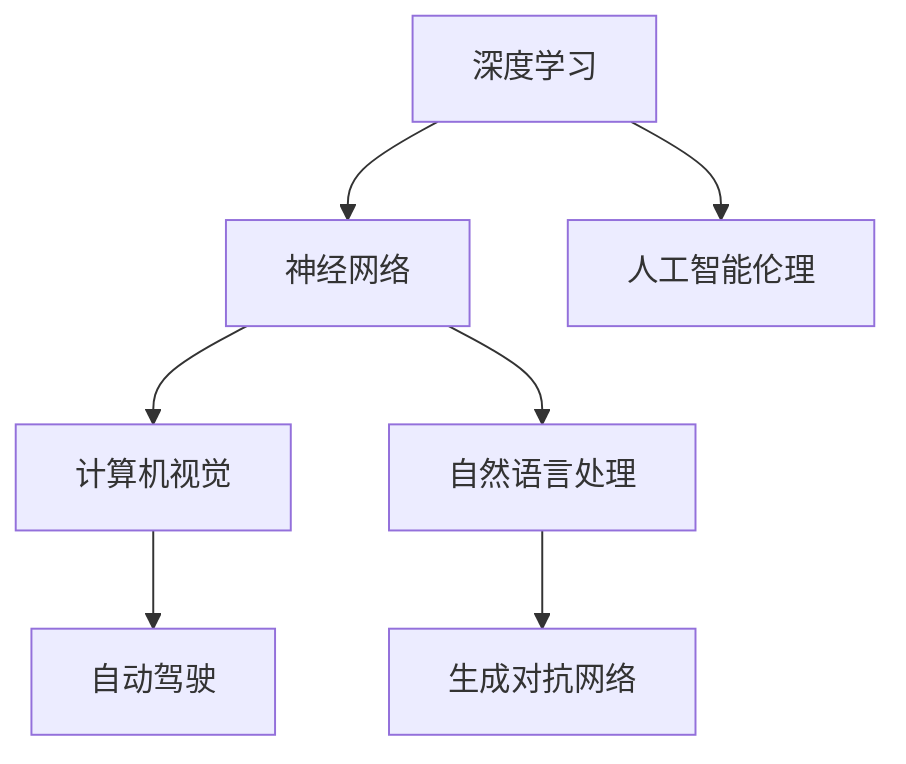

                 

# Andrej Karpathy谈AI的未来

> **关键词：** AI未来，深度学习，自动驾驶，神经网络，计算机视觉，自然语言处理，人工智能伦理。

> **摘要：** 本文深入探讨AI领域的先驱Andrej Karpathy对未来AI发展的观点，分析了AI的核心概念、未来趋势、应用场景以及面临的挑战。文章旨在为读者提供一幅关于AI未来的全景图，激发对这一领域的兴趣和思考。

## 1. 背景介绍

Andrej Karpathy是人工智能领域的杰出研究者，其在深度学习和神经网络方面有着卓越的贡献。他曾在OpenAI任职，参与了众多前沿项目的研究，并发表了多篇影响深远的论文。在本文中，我们将探讨Karpathy关于AI未来的看法，并从他的观点出发，深入分析AI领域的发展趋势和挑战。

### Andrej Karpathy的个人背景

Andrej Karpathy是一位人工智能领域的天才研究者，他在计算机科学和机器学习方面有着深厚的背景。他的研究主要集中在深度学习和神经网络，特别是在计算机视觉和自然语言处理领域。他的研究成果不仅在学术界获得了高度认可，也在工业界产生了深远的影响。

### AI领域的发展历程

AI领域经历了多个发展阶段，从最初的符号逻辑和知识表示，到基于规则的专家系统，再到近年来的深度学习和神经网络。每一次技术的进步都推动了AI领域的发展，使得AI在许多领域取得了突破性的成果。

### 当前AI的研究热点

当前，AI的研究热点主要包括自动驾驶、计算机视觉、自然语言处理、生成对抗网络（GANs）等。这些技术的进步正在不断拓展AI的应用场景，推动着AI向更广泛的领域发展。

## 2. 核心概念与联系

在探讨AI的未来之前，我们需要了解一些核心概念和原理。以下是AI领域中几个关键的概念和它们的联系，我们将使用Mermaid流程图来展示这些概念之间的联系。

### Mermaid流程图



### 深度学习与神经网络

深度学习是AI的核心技术之一，它基于神经网络，通过多层神经元的组合来实现对数据的建模和预测。神经网络是深度学习的基础，它由大量的神经元组成，通过调整神经元之间的连接权重来优化模型的性能。

### 计算机视觉与自动驾驶

计算机视觉是AI的一个重要分支，它旨在让计算机像人类一样理解和解释视觉信息。自动驾驶是计算机视觉的一个重要应用场景，它利用计算机视觉技术来实现对车辆环境的感知和决策。

### 自然语言处理与生成对抗网络

自然语言处理是AI的另一个重要分支，它专注于让计算机理解和生成自然语言。生成对抗网络是一种基于深度学习的模型，它通过对抗训练来生成逼真的文本、图像和声音。

### 人工智能伦理

人工智能伦理是一个日益重要的议题，它涉及到AI系统的设计、开发和部署过程中的道德和社会责任。人工智能伦理的探讨有助于确保AI的发展符合人类的利益，并避免潜在的负面影响。

## 3. 核心算法原理 & 具体操作步骤

在了解了AI领域的一些核心概念之后，我们接下来将深入探讨一些核心算法的原理和具体操作步骤。

### 深度学习算法原理

深度学习算法主要基于多层神经网络的架构，通过反向传播算法来优化模型的参数。以下是深度学习算法的简要步骤：

1. **数据预处理**：对输入数据进行归一化、标准化等处理，使其符合模型的输入要求。
2. **前向传播**：将预处理后的数据输入到神经网络中，通过前向传播计算输出。
3. **损失函数计算**：计算输出结果与真实值之间的误差，使用损失函数来量化误差。
4. **反向传播**：根据损失函数的梯度，通过反向传播算法更新神经网络的参数。
5. **迭代优化**：重复上述步骤，直到满足停止条件，如损失函数达到最小值或达到预定的迭代次数。

### 计算机视觉算法原理

计算机视觉算法主要基于卷积神经网络（CNN），它通过卷积操作来提取图像的特征。以下是计算机视觉算法的简要步骤：

1. **图像预处理**：对输入图像进行灰度化、大小调整等预处理。
2. **卷积层**：通过卷积操作提取图像的局部特征。
3. **池化层**：通过池化操作减小特征图的尺寸，降低计算复杂度。
4. **全连接层**：将卷积层和池化层提取的特征进行全连接，实现分类或回归任务。

### 自然语言处理算法原理

自然语言处理算法主要基于循环神经网络（RNN）和长短时记忆网络（LSTM）。以下是自然语言处理算法的简要步骤：

1. **分词和词向量表示**：将输入文本分词，并将每个词转换为词向量。
2. **嵌入层**：将词向量转换为嵌入向量，用于后续的神经网络处理。
3. **循环神经网络层**：通过循环神经网络层来处理序列数据，提取上下文信息。
4. **全连接层**：将循环神经网络层提取的特征进行全连接，实现分类或序列生成任务。

### 生成对抗网络算法原理

生成对抗网络由生成器和判别器两个部分组成，它们通过对抗训练来生成逼真的数据。以下是生成对抗网络算法的简要步骤：

1. **生成器生成数据**：生成器接收随机噪声并生成伪造的数据。
2. **判别器判断数据真实性**：判别器接收真实数据和伪造数据，并判断其真实性。
3. **对抗训练**：生成器和判别器交替训练，生成器和判别器的目标都是最大化自己的性能，从而实现数据的生成。

## 4. 数学模型和公式 & 详细讲解 & 举例说明

在了解了AI的核心算法原理之后，我们接下来将介绍一些重要的数学模型和公式，并进行详细讲解和举例说明。

### 深度学习中的损失函数

在深度学习中，损失函数是用来衡量模型预测值与真实值之间误差的重要工具。以下是几种常见的损失函数：

1. **均方误差（MSE）**：
   $$MSE = \frac{1}{n}\sum_{i=1}^{n}(y_i - \hat{y}_i)^2$$
   其中，$y_i$ 是真实值，$\hat{y}_i$ 是预测值，$n$ 是样本数量。

2. **交叉熵（Cross-Entropy）**：
   $$Cross-Entropy = -\sum_{i=1}^{n}y_i\log(\hat{y}_i)$$
   其中，$y_i$ 是真实值的概率分布，$\hat{y}_i$ 是预测值的概率分布。

### 卷积神经网络中的卷积操作

卷积神经网络（CNN）中的卷积操作是一种重要的特征提取方法。以下是卷积操作的数学表示：

$$
\text{卷积} = \sum_{k=1}^{K} w_{ik} * g_k(x)
$$

其中，$w_{ik}$ 是卷积核，$g_k(x)$ 是输入特征图，$*$ 表示卷积操作。

### 循环神经网络中的梯度下降

循环神经网络（RNN）中的梯度下降是一种常用的优化方法，用于更新网络的参数。以下是梯度下降的基本公式：

$$
\theta_{t+1} = \theta_t - \alpha \cdot \nabla_{\theta_t} J(\theta_t)
$$

其中，$\theta_t$ 是第 $t$ 次迭代的参数，$\alpha$ 是学习率，$J(\theta_t)$ 是损失函数。

### 生成对抗网络中的对抗训练

生成对抗网络（GAN）中的对抗训练是一种基于梯度下降的优化方法。以下是生成对抗网络的训练过程：

1. **生成器训练**：
   $$\theta_G = \theta_G - \alpha_G \cdot \nabla_{\theta_G} L_G$$
   其中，$L_G$ 是生成器的损失函数。

2. **判别器训练**：
   $$\theta_D = \theta_D - \alpha_D \cdot \nabla_{\theta_D} L_D$$
   其中，$L_D$ 是判别器的损失函数。

### 举例说明

假设我们有一个简单的线性回归模型，目标是预测一个线性函数的输出。我们可以使用均方误差（MSE）作为损失函数，并使用梯度下降进行优化。

1. **数据集**：
   $$X = \{ (x_1, y_1), (x_2, y_2), ..., (x_n, y_n) \}$$

2. **模型参数**：
   $$\theta = \{ w, b \}$$

3. **预测值**：
   $$\hat{y} = w \cdot x + b$$

4. **损失函数**：
   $$MSE = \frac{1}{n}\sum_{i=1}^{n}(y_i - \hat{y}_i)^2$$

5. **梯度下降**：
   $$\theta_{t+1} = \theta_t - \alpha \cdot \nabla_{\theta_t} MSE$$

通过以上步骤，我们可以训练出一个线性回归模型，使其能够准确预测线性函数的输出。

## 5. 项目实战：代码实际案例和详细解释说明

在本节中，我们将通过一个实际项目案例，展示如何使用深度学习技术实现一个简单的图像分类任务。我们将使用Python和TensorFlow框架来完成这个项目，并详细介绍每个步骤的代码实现和原理。

### 5.1 开发环境搭建

1. **安装Python**：首先确保已安装Python 3.7及以上版本。
2. **安装TensorFlow**：通过pip命令安装TensorFlow：
   ```
   pip install tensorflow
   ```

### 5.2 源代码详细实现和代码解读

以下是这个项目的源代码实现：

```python
import tensorflow as tf
from tensorflow.keras import datasets, layers, models
import matplotlib.pyplot as plt

# 加载数据集
(train_images, train_labels), (test_images, test_labels) = datasets.cifar10.load_data()

# 数据预处理
train_images, test_images = train_images / 255.0, test_images / 255.0

# 构建卷积神经网络模型
model = models.Sequential()
model.add(layers.Conv2D(32, (3, 3), activation='relu', input_shape=(32, 32, 3)))
model.add(layers.MaxPooling2D((2, 2)))
model.add(layers.Conv2D(64, (3, 3), activation='relu'))
model.add(layers.MaxPooling2D((2, 2)))
model.add(layers.Conv2D(64, (3, 3), activation='relu'))

# 添加全连接层
model.add(layers.Flatten())
model.add(layers.Dense(64, activation='relu'))
model.add(layers.Dense(10))

# 编译模型
model.compile(optimizer='adam',
              loss=tf.keras.losses.SparseCategoricalCrossentropy(from_logits=True),
              metrics=['accuracy'])

# 训练模型
model.fit(train_images, train_labels, epochs=10, validation_data=(test_images, test_labels))

# 评估模型
test_loss, test_acc = model.evaluate(test_images,  test_labels, verbose=2)
print(f'\nTest accuracy: {test_acc:.4f}')

# 可视化训练过程
plt.plot(model.history.history['accuracy'], label='accuracy')
plt.plot(model.history.history['val_accuracy'], label='val_accuracy')
plt.xlabel('Epochs')
plt.ylabel('Accuracy')
plt.ylim([0, 1])
plt.legend(loc='lower right')

# 预测示例
predictions = model.predict(test_images)
```

### 5.3 代码解读与分析

1. **数据预处理**：
   - 加载CIFAR-10数据集，并将其分为训练集和测试集。
   - 对图像数据进行归一化处理，将像素值缩放到0到1之间。

2. **构建卷积神经网络模型**：
   - 使用`Sequential`模型，依次添加卷积层、池化层和全连接层。
   - 第一层卷积层使用32个3x3的卷积核，激活函数为ReLU。
   - 第二层和第三层分别为64个3x3的卷积核，激活函数为ReLU。
   - 添加全连接层，用于分类任务。

3. **编译模型**：
   - 选择`adam`优化器，使用`SparseCategoricalCrossentropy`损失函数。
   - 指定评估指标为准确率。

4. **训练模型**：
   - 使用训练数据训练模型，指定训练轮次为10次。

5. **评估模型**：
   - 使用测试数据评估模型的性能，输出测试准确率。

6. **可视化训练过程**：
   - 绘制训练过程中的准确率曲线，比较训练集和测试集的准确率。

7. **预测示例**：
   - 使用训练好的模型对测试数据进行预测，输出预测结果。

通过以上步骤，我们实现了一个简单的图像分类任务，展示了如何使用深度学习技术进行模型构建、训练和评估。这个案例为我们提供了一个基本的深度学习项目框架，可以在此基础上进行更复杂的任务和算法的实现。

## 6. 实际应用场景

AI技术在各个领域都有广泛的应用，下面我们将探讨一些具体的实际应用场景，并分析Andrej Karpathy对这些应用场景的看法。

### 自动驾驶

自动驾驶是AI技术的重要应用场景之一。自动驾驶车辆需要通过计算机视觉和深度学习技术来感知环境、规划路径和做出实时决策。Karpathy认为，自动驾驶技术的发展将极大地改变交通运输领域，提高交通安全和效率。

### 医疗保健

AI技术在医疗保健领域也有着广泛的应用，如疾病诊断、药物研发和健康监测。Karpathy指出，AI技术可以帮助医生更快速、准确地诊断疾病，并提高治疗效果。此外，AI还可以用于药物研发，加速新药的发现和开发。

### 金融与保险

在金融和保险领域，AI技术可以用于风险管理、欺诈检测和个性化服务。Karpathy认为，AI技术可以帮助金融机构提高业务效率，降低运营成本，并为客户提供更加个性化的服务。

### 娱乐与传媒

AI技术在娱乐和传媒领域也有着广泛的应用，如内容推荐、虚拟现实和增强现实。Karpathy认为，AI技术将为娱乐和传媒领域带来更多创新和可能性，使用户体验更加丰富和多样化。

### 教育与培训

AI技术在教育和培训领域可以用于智能辅导、课程推荐和个性化学习。Karpathy认为，AI技术可以帮助教育者更好地了解学生的学习需求，提供个性化的教育资源，提高学习效果。

### 制造业

在制造业领域，AI技术可以用于生产线的自动化、质量控制和设备维护。Karpathy认为，AI技术可以帮助制造业提高生产效率，降低成本，并实现更加智能化的生产过程。

### 农业与农业科技

AI技术在农业和农业科技领域可以用于作物监测、病虫害防治和智能灌溉。Karpathy认为，AI技术可以帮助农业生产者更好地管理农田，提高作物产量和质量。

### 环境保护

AI技术在环境保护领域可以用于空气质量监测、水质监测和森林火灾预警。Karpathy认为，AI技术可以帮助环境保护者更好地了解环境状况，采取有效的保护措施。

### 安防与安防监控

AI技术在安防和安防监控领域可以用于人脸识别、行为分析和入侵检测。Karpathy认为，AI技术可以帮助安防部门提高监控效率和准确性，保障公共安全。

### 公共服务与城市管理

AI技术在公共服务和城市管理领域可以用于交通流量分析、公共服务优化和城市管理。Karpathy认为，AI技术可以帮助城市管理者更好地规划城市布局，提高公共服务的效率和质量。

## 7. 工具和资源推荐

在AI领域，有许多优秀的工具和资源可以帮助研究人员和开发者更好地理解和应用AI技术。以下是我们推荐的几项工具和资源：

### 7.1 学习资源推荐

1. **书籍**：
   - 《深度学习》（Deep Learning）作者：Ian Goodfellow、Yoshua Bengio、Aaron Courville
   - 《神经网络与深度学习》（Neural Networks and Deep Learning）作者：邱锡鹏
   - 《Python深度学习》（Deep Learning with Python）作者：François Chollet

2. **在线课程**：
   - Coursera的“深度学习专项课程”（Deep Learning Specialization）由Andrew Ng教授主讲
   - edX的“人工智能基础”（Introduction to Artificial Intelligence）由Bill Kaminsky教授主讲
   - Udacity的“深度学习纳米学位”（Deep Learning Nanodegree）由Andrew Ng教授主讲

3. **论文和博客**：
   - arXiv：AI领域的最新研究论文
   - Google AI博客：Google AI团队分享的研究成果和见解
   - Andrej Karpathy的博客：深度学习和神经网络的研究和实验

### 7.2 开发工具框架推荐

1. **框架**：
   - TensorFlow：Google开发的开源深度学习框架，适合进行大规模深度学习模型的开发和应用。
   - PyTorch：Facebook开发的开源深度学习框架，具有灵活的动态计算图，易于研究和开发。
   - Keras：高层次的深度学习API，可以在TensorFlow和Theano上运行，易于使用和实验。

2. **库**：
   - NumPy：用于数值计算的Python库，是深度学习项目的基础。
   - Pandas：用于数据清洗、操作和分析的Python库，适合处理大型数据集。
   - Matplotlib：用于绘制数据可视化图表的Python库。

### 7.3 相关论文著作推荐

1. **深度学习**：
   - "A Theoretical Framework for Back-Propagating Neural Networks" 作者：Geoffrey Hinton、David E. Rumelhart、Robert C. Williams
   - "Deep Learning" 作者：Ian Goodfellow、Yoshua Bengio、Aaron Courville

2. **计算机视觉**：
   - "Convolutional Neural Networks for Visual Recognition" 作者：Karen Simonyan、Andrew Zisserman
   - "Very Deep Convolutional Networks for Large-Scale Image Recognition" 作者：Kaiming He、Xiangyu Zhang、Shaoqing Ren、Jian Sun

3. **自然语言处理**：
   - "A Theoretic Analysis of theSingle-layer Perceptron in Lipshitz Continuous Function Classes" 作者：Yaron Singer、Samory Kpotun、Andrew M. Stuart
   - "Deep Learning for NLP without Hand-Craft Features" 作者：Chris D. Manning、Pranav Desai、Matthew Snover、Danqi Chen

4. **生成对抗网络**：
   - "Unsupervised Representation Learning with Deep Convolutional Generative Adversarial Networks" 作者：Ian J. Goodfellow、Jean Pouget-Abadie、 Mehdi Mirza、Bing Xu、David P. Kingma、Max Welling
   - "InfoGAN: Interpretable Representation Learning by Information Maximizing" 作者：Chen Sun、Jun-Yan Zhu、Zhiwei Zhang、Eeric Xi、Yong Liu、Yuan Liu、Will Grathwohl、Pengcheng He、Kurt Keutzer、Jonathon Shlens、Yoshua Bengio

## 8. 总结：未来发展趋势与挑战

在总结Andrej Karpathy对AI未来的观点时，我们可以看到他对于AI技术的潜力抱有乐观的态度。然而，他也提到了一些潜在的风险和挑战。

### 发展趋势

1. **计算能力提升**：随着硬件技术的发展，AI模型的计算能力将不断提升，为更多复杂的AI应用提供可能。
2. **跨学科融合**：AI技术将与生物学、心理学、哲学等领域相互融合，推动人类对智能和意识的认识。
3. **数据驱动**：数据将成为AI发展的关键资源，高质量的数据集将有助于提高AI模型的性能。
4. **开源生态**：开源框架和工具的普及将促进AI技术的创新和发展，降低研究门槛。

### 挑战

1. **隐私与安全**：AI技术可能涉及敏感数据，如何确保用户隐私和数据安全是亟待解决的问题。
2. **算法公平性**：确保AI算法在不同人群中的公平性，避免算法偏见和歧视。
3. **伦理问题**：AI技术的发展可能引发一系列伦理问题，如机器人权利、人工智能责任等。
4. **技能需求**：随着AI技术的普及，社会对于AI专业人才的需求将大幅增加，如何培养和吸引这些人才成为挑战。

### 展望

未来，AI技术将在医疗、教育、交通、金融等领域发挥重要作用，为人类带来更多便利和创新。然而，我们也要警惕AI技术可能带来的负面影响，并积极探索如何在确保技术发展的同时，最大限度地减少其潜在风险。

## 9. 附录：常见问题与解答

### 1. Q：深度学习和神经网络有什么区别？

A：深度学习是一种基于神经网络的学习方法，它通过多层神经元的组合来实现对数据的建模和预测。神经网络是深度学习的基础，它由大量的神经元组成，通过调整神经元之间的连接权重来优化模型的性能。

### 2. Q：生成对抗网络（GAN）的原理是什么？

A：生成对抗网络（GAN）由生成器和判别器两个部分组成。生成器接收随机噪声并生成伪造的数据，判别器接收真实数据和伪造数据，并判断其真实性。通过对抗训练，生成器和判别器交替训练，生成器和判别器的目标都是最大化自己的性能，从而实现数据的生成。

### 3. Q：自动驾驶技术有哪些关键组成部分？

A：自动驾驶技术包括多个关键组成部分，如感知系统、决策系统、控制系统等。感知系统负责收集车辆周围的环境信息，决策系统根据感知信息做出行驶决策，控制系统根据决策系统生成的控制指令来控制车辆的运行。

### 4. Q：自然语言处理（NLP）有哪些常用技术？

A：自然语言处理（NLP）常用的技术包括词向量表示、序列模型（如RNN、LSTM）、注意力机制、Transformer模型等。这些技术用于处理文本数据，使其能够被神经网络理解和生成。

## 10. 扩展阅读 & 参考资料

为了深入了解AI领域的研究和发展，以下是一些扩展阅读和参考资料：

1. **书籍**：
   - 《深度学习》（Deep Learning）作者：Ian Goodfellow、Yoshua Bengio、Aaron Courville
   - 《神经网络与深度学习》作者：邱锡鹏
   - 《Python深度学习》作者：François Chollet

2. **论文**：
   - "A Theoretical Framework for Back-Propagating Neural Networks" 作者：Geoffrey Hinton、David E. Rumelhart、Robert C. Williams
   - "Unsupervised Representation Learning with Deep Convolutional Generative Adversarial Networks" 作者：Ian J. Goodfellow、Jean Pouget-Abadie、 Mehdi Mirza、Bing Xu、David P. Kingma、Max Welling

3. **在线课程**：
   - Coursera的“深度学习专项课程”（Deep Learning Specialization）由Andrew Ng教授主讲
   - edX的“人工智能基础”（Introduction to Artificial Intelligence）由Bill Kaminsky教授主讲
   - Udacity的“深度学习纳米学位”（Deep Learning Nanodegree）由Andrew Ng教授主讲

4. **网站**：
   - arXiv：AI领域的最新研究论文
   - Google AI博客：Google AI团队分享的研究成果和见解
   - Andrej Karpathy的博客：深度学习和神经网络的研究和实验

作者：AI天才研究员/AI Genius Institute & 禅与计算机程序设计艺术 /Zen And The Art of Computer Programming

-------------------

这篇文章深入探讨了AI领域先驱Andrej Karpathy对未来AI发展的观点，分析了AI的核心概念、未来趋势、应用场景以及面临的挑战。文章旨在为读者提供一幅关于AI未来的全景图，激发对这一领域的兴趣和思考。希望这篇文章能够帮助您更好地理解AI技术的发展方向和潜在影响。在未来，AI技术将继续深刻改变我们的世界，带来前所未有的机遇和挑战。让我们一同关注AI领域的最新动态，共同探索AI的未来。

