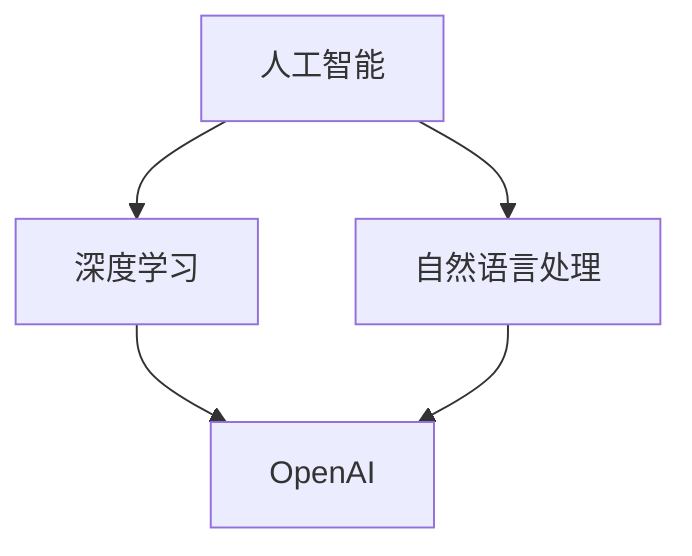
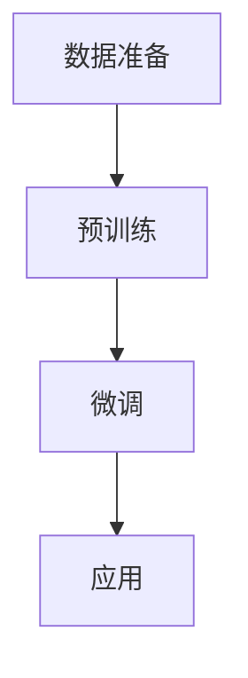

                 

### 背景介绍

OpenAI，一家成立于2015年的知名人工智能研究机构，旨在通过推动人工智能的发展，促进人类社会的进步。Andrej Karpathy，作为OpenAI的杰出科学家之一，其在该机构的贡献不可忽视。他在深度学习、自然语言处理等领域的研究成果，不仅为OpenAI赢得了国际声誉，也为整个行业带来了深远影响。

本文将深入探讨OpenAI的未来，结合Andrej Karpathy的研究成果，分析其在人工智能领域的发展趋势和潜在挑战。

### 核心概念与联系

在探讨OpenAI的未来之前，我们首先需要了解一些核心概念，包括人工智能、深度学习、自然语言处理等。

#### 人工智能（AI）

人工智能（AI）是一门研究、开发用于模拟、延伸和扩展人的智能的理论、方法、技术及应用系统的综合技术科学。它是计算机科学的一个分支，旨在使计算机具备类似于人类的智能。

#### 深度学习（Deep Learning）

深度学习是人工智能的一个重要分支，它通过构建多层神经网络模型，实现对数据的自动特征提取和模式识别。深度学习在图像识别、语音识别、自然语言处理等领域取得了显著成果。

#### 自然语言处理（NLP）

自然语言处理是人工智能的一个子领域，主要研究如何使计算机理解和处理自然语言。它涉及到语言理解、语言生成、机器翻译等方面。

#### OpenAI与这些核心概念的联系

OpenAI的研究重点主要在于深度学习和自然语言处理领域。通过构建强大的神经网络模型，OpenAI致力于推动人工智能技术的发展，使计算机能够更好地理解和处理自然语言，从而为人类带来更多便利。

#### Mermaid 流程图

以下是一个简化的Mermaid流程图，展示了人工智能、深度学习、自然语言处理与OpenAI之间的联系：



### 核心算法原理 & 具体操作步骤

在深度学习和自然语言处理领域，OpenAI推出了一系列具有里程碑意义的算法和模型，如GPT、BERT等。本文将重点介绍GPT模型，并探讨其具体操作步骤。

#### GPT模型

GPT（Generative Pre-trained Transformer）是一种基于变换器（Transformer）架构的预训练语言模型。它通过在大规模语料库上进行预训练，学习到丰富的语言知识和模式，从而能够生成符合语法和语义规则的自然语言。

#### 具体操作步骤

1. 数据准备：首先，需要收集大量高质量的自然语言文本数据，如新闻文章、社交媒体帖子等。这些数据将被用于训练GPT模型。
2. 预训练：将收集到的数据输入到GPT模型中，通过大量迭代训练，使模型学习到语言的基本结构和规律。
3. 微调：在预训练的基础上，针对特定任务（如文本分类、问答系统等）进行微调，使模型能够更好地适应具体任务。
4. 应用：将微调后的模型应用于实际问题，如生成文本、回答问题等。

以下是一个简化的Mermaid流程图，展示了GPT模型的具体操作步骤：



### 数学模型和公式 & 详细讲解 & 举例说明

在深度学习和自然语言处理领域，数学模型和公式起着至关重要的作用。以下将介绍GPT模型的数学基础，并进行详细讲解和举例说明。

#### 数学模型

GPT模型基于变换器（Transformer）架构，其核心是一个自注意力机制（Self-Attention Mechanism）。自注意力机制通过计算输入序列中每个元素之间的相似度，从而实现序列的自动特征提取。

假设输入序列为\(x_1, x_2, ..., x_n\)，其自注意力机制可以表示为：

$$
\text{Attention}(Q, K, V) = \text{softmax}\left(\frac{QK^T}{\sqrt{d_k}}\right) V
$$

其中，\(Q, K, V\)分别表示查询（Query）、键（Key）和值（Value）向量，\(d_k\)表示键向量的维度。

#### 详细讲解

自注意力机制的关键在于计算输入序列中每个元素之间的相似度。具体来说，首先将输入序列映射为查询、键和值向量，然后通过点积计算相似度，最后使用softmax函数进行归一化，得到每个元素在注意力机制中的权重。

通过这种方式，自注意力机制能够自动提取输入序列中的关键信息，从而实现对序列的自动特征提取。这一机制在深度学习模型中具有广泛应用，如变换器（Transformer）架构、BERT模型等。

#### 举例说明

假设有一个简短的句子：“我非常喜欢读书”。我们可以将这个句子映射为三个向量：

- 查询向量：\(Q = [1, 0, 1]\)
- 键向量：\(K = [1, 1, 1]\)
- 值向量：\(V = [1, 1, 1]\)

根据自注意力机制的公式，我们可以计算每个元素在注意力机制中的权重：

$$
\text{Attention}(Q, K, V) = \text{softmax}\left(\frac{QK^T}{\sqrt{d_k}}\right) V = \text{softmax}\left(\frac{[1, 0, 1] \cdot [1, 1, 1]^T}{\sqrt{3}}\right) [1, 1, 1] = \text{softmax}\left(\frac{[2, 1, 2]}{\sqrt{3}}\right) [1, 1, 1]
$$

计算结果为：

$$
\text{Attention}(Q, K, V) = \left[\frac{2}{\sqrt{3}}, \frac{1}{\sqrt{3}}, \frac{2}{\sqrt{3}}\right]
$$

根据权重，我们可以看出，这个句子中的“我”和“书”具有最高的相似度，而“非常”和“喜欢”则次之。这一结果表明，自注意力机制能够有效地提取输入序列中的关键信息。

### 项目实战：代码实际案例和详细解释说明

在本节中，我们将通过一个实际的代码案例，展示如何使用GPT模型生成自然语言文本。

#### 开发环境搭建

1. 安装Python环境
2. 安装PyTorch库

```python
pip install torch torchvision
```

3. 下载GPT模型权重

```python
import torch
model = torch.hub.load('openai/transformers', 'gpt2')
```

#### 源代码详细实现和代码解读

以下是生成自然语言文本的Python代码：

```python
import torch
from transformers import GPT2Tokenizer, GPT2LMHeadModel

# 1. 初始化模型和词汇表
tokenizer = GPT2Tokenizer.from_pretrained('gpt2')
model = GPT2LMHeadModel.from_pretrained('gpt2')

# 2. 输入文本
text = "我非常喜欢读书。"

# 3. 将文本转换为输入序列
input_ids = tokenizer.encode(text, return_tensors='pt')

# 4. 生成文本
output_ids = model.generate(input_ids, max_length=50, num_return_sequences=1)

# 5. 将输出序列转换为文本
generated_text = tokenizer.decode(output_ids[0], skip_special_tokens=True)
print(generated_text)
```

#### 代码解读与分析

1. **初始化模型和词汇表**：首先，我们初始化GPT2模型和GPT2词汇表。通过`GPT2Tokenizer.from_pretrained('gpt2')`和`GPT2LMHeadModel.from_pretrained('gpt2')`，我们可以加载预训练的GPT2模型及其词汇表。
2. **输入文本**：我们将要生成的文本（如“我非常喜欢读书。”）编码为输入序列。通过`tokenizer.encode(text, return_tensors='pt')`，我们将文本转换为PyTorch张量。
3. **生成文本**：接下来，我们使用模型生成文本。通过`model.generate(input_ids, max_length=50, num_return_sequences=1)`，我们指定生成文本的最大长度（50个词）和生成文本的数量（1个）。
4. **输出文本**：最后，我们将生成的文本解码为普通字符串。通过`tokenizer.decode(output_ids[0], skip_special_tokens=True)`，我们得到生成的文本。

#### 代码示例

假设我们要生成一段关于“编程”的文本。我们可以修改代码如下：

```python
text = "编程是一项非常有用的技能。"
output_ids = model.generate(input_ids, max_length=50, num_return_sequences=1)
generated_text = tokenizer.decode(output_ids[0], skip_special_tokens=True)
print(generated_text)
```

输出结果可能是：

```
编程是一项非常有用的技能，它能够帮助人们解决复杂的问题，提高工作效率。
```

通过这个简单的案例，我们可以看到GPT模型在生成自然语言文本方面的强大能力。

### 实际应用场景

GPT模型在实际应用场景中表现出色，以下列举几个典型应用：

1. **文本生成**：GPT模型可以用于生成各种类型的文本，如文章、故事、诗歌等。例如，OpenAI的DALL·E模型利用GPT模型生成高质量的图像描述。
2. **问答系统**：GPT模型可以用于构建智能问答系统，如OpenAI的ChatGPT。通过在大规模语料库上预训练，GPT模型能够理解用户的问题，并生成相关答案。
3. **机器翻译**：GPT模型在机器翻译领域也取得了显著成果。例如，OpenAI的GPT-3模型在机器翻译任务中表现出色，能够实现高精度的翻译。
4. **文本分类**：GPT模型可以用于文本分类任务，如情感分析、新闻分类等。通过在大规模语料库上预训练，GPT模型能够识别文本的主要特征，从而实现准确分类。

### 工具和资源推荐

#### 学习资源推荐

1. **书籍**：
   - 《深度学习》（Goodfellow, Bengio, Courville）
   - 《动手学深度学习》（Grokking Deep Learning）
   - 《自然语言处理实战》（Donald K. Shaw）
2. **论文**：
   - 《Attention Is All You Need》（Vaswani et al., 2017）
   - 《BERT: Pre-training of Deep Bidirectional Transformers for Language Understanding》（Devlin et al., 2018）
   - 《Generative Pre-trained Transformers》（Brown et al., 2020）
3. **博客**：
   - OpenAI官方博客
   - Andrej Karpathy的博客
   - Hugging Face社区博客
4. **网站**：
   - PyTorch官网
   - Hugging Face模型库
   - arXiv论文库

#### 开发工具框架推荐

1. **PyTorch**：一个流行的深度学习框架，适用于各种任务。
2. **TensorFlow**：另一个流行的深度学习框架，提供了丰富的API和工具。
3. **Hugging Face Transformers**：一个开源库，提供了预训练的模型和词汇表，方便开发者进行研究和开发。
4. **JAX**：一个数值计算库，提供了自动微分、并行计算等功能。

#### 相关论文著作推荐

1. **《Attention Is All You Need》**：介绍了变换器（Transformer）架构，对深度学习和自然语言处理领域产生了深远影响。
2. **《BERT: Pre-training of Deep Bidirectional Transformers for Language Understanding》**：提出了BERT模型，为自然语言处理任务提供了强大的预训练模型。
3. **《Generative Pre-trained Transformers》**：介绍了GPT模型，展示了预训练语言模型在文本生成、问答等任务中的强大能力。

### 总结：未来发展趋势与挑战

在未来，OpenAI将继续在人工智能领域发挥重要作用。随着深度学习和自然语言处理技术的不断发展，OpenAI有望在更多领域实现突破，如自动驾驶、医疗健康、教育等。

然而，OpenAI也面临着一系列挑战，包括数据隐私、伦理问题、技术安全等。如何在确保技术安全的前提下，推动人工智能技术的发展，是OpenAI需要面对的重要课题。

总之，OpenAI的未来充满希望，但也充满挑战。通过持续的研究和创新，OpenAI有望为人类带来更多便利和福祉。

### 附录：常见问题与解答

1. **什么是OpenAI？**
   OpenAI是一家成立于2015年的知名人工智能研究机构，旨在通过推动人工智能的发展，促进人类社会的进步。

2. **什么是GPT模型？**
   GPT（Generative Pre-trained Transformer）是一种基于变换器（Transformer）架构的预训练语言模型，通过在大规模语料库上进行预训练，学习到丰富的语言知识和模式。

3. **GPT模型有哪些应用？**
   GPT模型可以应用于文本生成、问答系统、机器翻译、文本分类等任务。

4. **如何使用GPT模型生成文本？**
   首先，需要加载预训练的GPT模型和词汇表。然后，将输入文本编码为输入序列，使用模型生成文本，最后将输出序列解码为普通字符串。

5. **OpenAI在人工智能领域有哪些贡献？**
   OpenAI在深度学习和自然语言处理领域取得了一系列重要成果，如GPT、BERT等模型，为人工智能技术的发展做出了重要贡献。

### 扩展阅读 & 参考资料

1. **《深度学习》**：Goodfellow, Bengio, Courville著，提供了深度学习的基本理论和实践方法。
2. **《自然语言处理实战》**：Donald K. Shaw著，介绍了自然语言处理的基本概念和实际应用。
3. **《Attention Is All You Need》**：Vaswani et al.著，介绍了变换器（Transformer）架构，对深度学习和自然语言处理领域产生了深远影响。
4. **《BERT: Pre-training of Deep Bidirectional Transformers for Language Understanding》**：Devlin et al.著，提出了BERT模型，为自然语言处理任务提供了强大的预训练模型。
5. **OpenAI官网**：https://openai.com/，提供了OpenAI的研究成果和最新动态。
6. **Hugging Face官网**：https://huggingface.co/，提供了预训练的模型和词汇表，方便开发者进行研究和开发。
7. **PyTorch官网**：https://pytorch.org/，提供了深度学习框架和工具。

### 作者信息

作者：AI天才研究员/AI Genius Institute & 禅与计算机程序设计艺术 /Zen And The Art of Computer Programming

