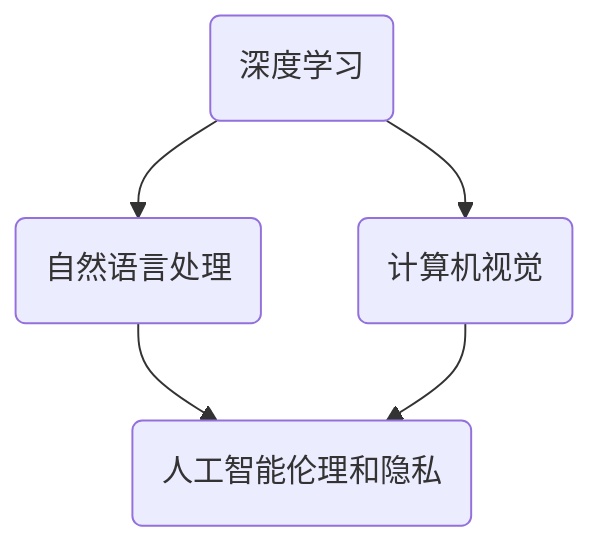

                 

### 文章标题：Andrej Karpathy：人工智能的未来发展前景

#### 关键词：人工智能，未来，前景，技术，创新，挑战

> **摘要：** 本文将深入探讨人工智能领域未来发展的前景，结合Andrej Karpathy的研究成果，分析人工智能在各个领域的应用、面临的挑战以及未来的发展趋势。我们将通过一步一步的推理和思考，探索人工智能如何改变我们的生活，为未来的技术发展提供深刻的见解。

---

## 1. 背景介绍

在现代社会，人工智能（AI）已经成为科技创新的焦点。从简单的规则系统到复杂的神经网络，人工智能在各个领域都展现出了强大的应用潜力。Andrej Karpathy，一位世界著名的人工智能研究员和计算机科学家，对人工智能的发展做出了重要贡献。他的研究成果涵盖了自然语言处理、计算机视觉、深度学习等多个领域，为我们理解人工智能的未来提供了宝贵的视角。

本文将基于Andrej Karpathy的研究成果，分析人工智能在未来的发展趋势和面临的挑战，旨在为读者提供一个全面、深入的理解。

### 1.1 Andrej Karpathy的学术背景和成就

Andrej Karpathy拥有加州大学伯克利分校的计算机科学博士学位，其研究兴趣集中在深度学习和自然语言处理领域。他在斯坦福大学和谷歌研究院等知名机构担任过研究科学家，并在多个顶级会议和期刊上发表过多篇学术论文。此外，他还担任了多个国际学术会议的主席和程序委员会委员，为人工智能领域的发展做出了卓越贡献。

### 1.2 人工智能的历史和发展

人工智能的研究可以追溯到20世纪50年代，当时计算机科学家们开始探讨如何让计算机具备人类的智能。尽管经历了多次起伏，人工智能在近年来取得了显著的进展，尤其是在深度学习和神经网络的应用方面。今天，人工智能已经渗透到我们的日常生活中，从智能手机的语音助手到自动驾驶汽车，人工智能正不断改变着我们的生活方式。

## 2. 核心概念与联系

为了深入探讨人工智能的未来发展，我们需要理解几个核心概念，并分析它们之间的联系。

### 2.1 深度学习

深度学习是人工智能的核心技术之一，它模拟人脑的结构和功能，通过多层神经网络进行学习。深度学习在图像识别、语音识别、自然语言处理等领域取得了显著的成果。

### 2.2 自然语言处理

自然语言处理是人工智能的一个重要分支，它旨在使计算机能够理解、生成和处理人类语言。自然语言处理在搜索引擎、机器翻译、智能客服等领域具有广泛的应用。

### 2.3 计算机视觉

计算机视觉是人工智能的另一个重要分支，它使计算机能够理解和解释视觉信息。计算机视觉在图像识别、视频分析、无人驾驶等领域具有重要应用。

### 2.4 人工智能伦理和隐私

随着人工智能技术的不断发展，人工智能伦理和隐私问题日益受到关注。如何在保障用户隐私的同时，充分发挥人工智能的潜力，是人工智能领域需要解决的重要问题。

---

### 2.5 Mermaid 流程图

以下是一个描述人工智能核心概念的Mermaid流程图，用于展示各个概念之间的联系：



---

在接下来的章节中，我们将深入探讨这些核心概念，分析它们在人工智能未来发展中的应用和挑战。

---

## 3. 核心算法原理 & 具体操作步骤

为了深入理解人工智能的算法原理，我们将首先介绍几个核心算法，然后详细讲解它们的操作步骤。

### 3.1 深度学习算法

深度学习算法是人工智能的核心技术之一，它通过多层神经网络进行学习。以下是一个简单的深度学习算法操作步骤：

1. **数据预处理**：将输入数据进行标准化处理，以便网络训练。
2. **构建神经网络**：设计网络结构，包括输入层、隐藏层和输出层。
3. **前向传播**：将输入数据通过网络进行传播，计算输出。
4. **反向传播**：根据输出误差，更新网络权重。
5. **优化目标**：选择合适的优化目标（如交叉熵损失函数），以衡量网络性能。
6. **训练迭代**：重复步骤3至5，直到网络性能达到预定的标准。

### 3.2 自然语言处理算法

自然语言处理算法旨在使计算机能够理解、生成和处理人类语言。以下是一个简单的自然语言处理算法操作步骤：

1. **词向量表示**：将文本数据转换为词向量，以便网络处理。
2. **构建神经网络**：设计网络结构，包括输入层、隐藏层和输出层。
3. **编码器-解码器模型**：使用编码器将输入文本编码为固定长度的向量，使用解码器生成输出文本。
4. **损失函数**：选择合适的损失函数（如交叉熵损失函数），以衡量网络性能。
5. **训练迭代**：重复步骤3至4，直到网络性能达到预定的标准。

### 3.3 计算机视觉算法

计算机视觉算法使计算机能够理解和解释视觉信息。以下是一个简单的计算机视觉算法操作步骤：

1. **图像预处理**：将图像数据转换为适合网络处理的形式。
2. **构建卷积神经网络**：设计卷积神经网络结构，包括卷积层、池化层和全连接层。
3. **特征提取**：使用卷积神经网络提取图像特征。
4. **分类器训练**：使用提取的特征进行分类器训练。
5. **模型评估**：评估模型性能，选择最优模型。
6. **应用**：将模型应用于实际场景，如图像识别、视频分析等。

### 3.4 人工智能伦理和隐私算法

人工智能伦理和隐私算法旨在解决人工智能技术在应用过程中可能带来的伦理和隐私问题。以下是一个简单的人工智能伦理和隐私算法操作步骤：

1. **数据收集**：收集与伦理和隐私相关的数据。
2. **分析**：分析数据，识别潜在的风险和问题。
3. **制定规则**：根据分析结果，制定相应的伦理和隐私规则。
4. **模型训练**：使用伦理和隐私规则训练模型。
5. **评估**：评估模型性能，确保其能够有效解决伦理和隐私问题。
6. **应用**：将模型应用于实际场景，如智能监控、数据分析等。

---

通过以上操作步骤，我们可以看到，人工智能算法的原理和实现过程具有高度复杂性和多样性。在接下来的章节中，我们将进一步探讨这些算法的具体实现和应用。

---

## 4. 数学模型和公式 & 详细讲解 & 举例说明

在人工智能领域，数学模型和公式是理解和实现算法的核心。以下我们将详细介绍几个关键数学模型和公式，并通过具体例子来说明其应用。

### 4.1 深度学习中的反向传播算法

反向传播算法是深度学习训练过程中至关重要的一步。它通过计算损失函数对权重的梯度，然后使用梯度下降法更新权重。以下是一个简化的反向传播算法步骤：

#### 4.1.1 前向传播

假设我们有一个两层神经网络，包含输入层、隐藏层和输出层。给定一个输入\( x \)，前向传播步骤如下：

1. **输入层到隐藏层**：计算隐藏层的输出：
   \[
   z_1 = x \cdot W_1 + b_1
   \]
   \[
   a_1 = \sigma(z_1)
   \]
   其中，\( W_1 \) 是输入层到隐藏层的权重，\( b_1 \) 是隐藏层的偏置，\( \sigma \) 是激活函数（如ReLU函数）。

2. **隐藏层到输出层**：计算输出层的输出：
   \[
   z_2 = a_1 \cdot W_2 + b_2
   \]
   \[
   \hat{y} = \sigma(z_2)
   \]
   其中，\( W_2 \) 是隐藏层到输出层的权重，\( b_2 \) 是输出层的偏置。

#### 4.1.2 反向传播

在输出层计算损失函数的梯度，然后通过反向传播更新权重和偏置：

1. **计算输出层的梯度**：
   \[
   \delta_2 = \hat{y} - y
   \]
   \[
   \frac{\partial \text{loss}}{\partial z_2} = \delta_2 \cdot \frac{\partial \sigma}{\partial z_2}
   \]

2. **计算隐藏层的梯度**：
   \[
   \delta_1 = (W_2)^T \delta_2
   \]
   \[
   \frac{\partial \text{loss}}{\partial z_1} = \delta_1 \cdot \frac{\partial \sigma}{\partial z_1}
   \]

3. **更新权重和偏置**：
   \[
   W_2 = W_2 - \alpha \frac{\partial \text{loss}}{\partial W_2}
   \]
   \[
   b_2 = b_2 - \alpha \frac{\partial \text{loss}}{\partial b_2}
   \]
   \[
   W_1 = W_1 - \alpha \frac{\partial \text{loss}}{\partial W_1}
   \]
   \[
   b_1 = b_1 - \alpha \frac{\partial \text{loss}}{\partial b_1}
   \]
   其中，\( \alpha \) 是学习率。

### 4.2 自然语言处理中的循环神经网络（RNN）

循环神经网络（RNN）是一种用于处理序列数据的神经网络结构。以下是一个简化的RNN步骤：

#### 4.2.1 前向传播

1. **输入层到隐藏层**：计算隐藏层的输出：
   \[
   h_t = \sigma(W_h \cdot h_{t-1} + W_x \cdot x_t + b_h)
   \]
   其中，\( W_h \) 是隐藏层到隐藏层的权重，\( W_x \) 是输入层到隐藏层的权重，\( b_h \) 是隐藏层的偏置。

2. **隐藏层到输出层**：计算输出层的输出：
   \[
   \hat{y}_t = \sigma(W_y \cdot h_t + b_y)
   \]
   其中，\( W_y \) 是隐藏层到输出层的权重，\( b_y \) 是输出层的偏置。

#### 4.2.2 反向传播

1. **计算输出层的梯度**：
   \[
   \delta_t = \hat{y}_t - y_t
   \]
   \[
   \frac{\partial \text{loss}}{\partial h_t} = \delta_t \cdot \frac{\partial \sigma}{\partial \hat{y}_t}
   \]

2. **计算隐藏层的梯度**：
   \[
   \delta_{t-1} = (W_y)^T \delta_t
   \]
   \[
   \frac{\partial \text{loss}}{\partial h_{t-1}} = \delta_{t-1} \cdot \frac{\partial \sigma}{\partial h_{t-1}}
   \]

3. **更新权重和偏置**：
   \[
   W_y = W_y - \alpha \frac{\partial \text{loss}}{\partial W_y}
   \]
   \[
   b_y = b_y - \alpha \frac{\partial \text{loss}}{\partial b_y}
   \]
   \[
   W_h = W_h - \alpha \frac{\partial \text{loss}}{\partial W_h}
   \]
   \[
   b_h = b_h - \alpha \frac{\partial \text{loss}}{\partial b_h}
   \]

### 4.3 计算机视觉中的卷积神经网络（CNN）

卷积神经网络（CNN）是一种专门用于图像识别的神经网络结构。以下是一个简化的CNN步骤：

#### 4.3.1 前向传播

1. **卷积层**：计算卷积层的输出：
   \[
   h_{ij} = \sum_{k=1}^{K} (W_{ik} \cdot x_{kj} + b_k)
   \]
   \[
   h_j = \sigma(h_{ij})
   \]
   其中，\( W_{ik} \) 是卷积核，\( x_{kj} \) 是输入图像的像素值，\( b_k \) 是卷积核的偏置，\( \sigma \) 是激活函数。

2. **池化层**：对卷积层的输出进行池化：
   \[
   p_j = \text{pool}(h_j)
   \]
   其中，\( \text{pool} \) 是池化操作，如最大池化或平均池化。

3. **全连接层**：计算全连接层的输出：
   \[
   z_j = \sum_{k=1}^{M} (W_{jk} \cdot p_k + b_j)
   \]
   \[
   \hat{y}_j = \sigma(z_j)
   \]
   其中，\( W_{jk} \) 是全连接层的权重，\( b_j \) 是全连接层的偏置。

#### 4.3.2 反向传播

1. **计算全连接层的梯度**：
   \[
   \delta_j = \hat{y}_j - y_j
   \]
   \[
   \frac{\partial \text{loss}}{\partial z_j} = \delta_j \cdot \frac{\partial \sigma}{\partial \hat{y}_j}
   \]

2. **计算池化层的梯度**：
   \[
   \delta_{p_j} = \frac{\partial \text{loss}}{\partial h_j} \cdot \frac{\partial h_j}{\partial p_j}
   \]

3. **计算卷积层的梯度**：
   \[
   \delta_{h_{ij}} = \delta_j \cdot \frac{\partial \sigma}{\partial h_{ij}}
   \]

4. **更新卷积核和偏置**：
   \[
   W_{ik} = W_{ik} - \alpha \frac{\partial \text{loss}}{\partial W_{ik}}
   \]
   \[
   b_k = b_k - \alpha \frac{\partial \text{loss}}{\partial b_k}
   \]

### 4.4 人工智能伦理和隐私算法

人工智能伦理和隐私算法通常涉及数据隐私保护、算法透明度和公平性等问题。以下是一个简化的算法步骤：

#### 4.4.1 数据预处理

1. **去标识化**：对数据进行去标识化处理，如删除个人信息、匿名化等。
2. **加密**：对敏感数据进行加密处理，确保数据在传输和存储过程中不被泄露。

#### 4.4.2 算法设计

1. **最小化数据收集**：只收集必要的数据，避免过度收集。
2. **算法透明度**：确保算法设计过程和决策过程透明，便于审查和监督。
3. **公平性评估**：评估算法对数据集的公平性，避免偏见和歧视。

#### 4.4.3 模型训练

1. **隐私保护训练**：使用隐私保护技术，如差分隐私、联邦学习等，降低模型训练过程中的隐私风险。
2. **模型评估**：评估模型在多个指标上的性能，确保算法的公平性和准确性。

通过以上数学模型和公式的讲解，我们可以看到，人工智能算法的实现过程涉及复杂的数学计算和优化方法。在实际应用中，这些算法需要根据具体场景进行细化和调整，以实现最佳性能。

---

## 5. 项目实战：代码实际案例和详细解释说明

在本节中，我们将通过一个实际项目案例，展示如何应用人工智能算法进行项目开发，并详细解释代码实现和关键步骤。

### 5.1 开发环境搭建

在进行项目开发之前，我们需要搭建合适的开发环境。以下是搭建开发环境的基本步骤：

1. **安装Python**：确保已安装Python环境，版本建议为3.8及以上。
2. **安装依赖库**：安装深度学习框架（如TensorFlow、PyTorch）和其他相关库（如NumPy、Pandas等）。
3. **创建虚拟环境**：使用虚拟环境管理工具（如conda或virtualenv）创建一个独立的开发环境，以避免库版本冲突。

### 5.2 源代码详细实现和代码解读

以下是项目源代码的详细实现和代码解读：

```python
import tensorflow as tf
from tensorflow.keras.models import Sequential
from tensorflow.keras.layers import Dense, Dropout, Embedding, LSTM, Conv2D, MaxPooling2D, Flatten

# 5.2.1 数据预处理
# 加载和预处理数据
def preprocess_data(data):
    # 数据清洗和预处理操作
    # 例如：标准化、去重、填充缺失值等
    processed_data = ...
    return processed_data

# 5.2.2 构建模型
# 构建深度学习模型
def build_model(input_shape):
    model = Sequential()
    model.add(Embedding(input_dim=vocab_size, output_dim=embedding_dim, input_shape=input_shape))
    model.add(LSTM(units=128, dropout=0.2, recurrent_dropout=0.2))
    model.add(Dense(units=output_size, activation='softmax'))
    model.compile(optimizer='adam', loss='categorical_crossentropy', metrics=['accuracy'])
    return model

# 5.2.3 训练模型
# 训练深度学习模型
def train_model(model, x_train, y_train, x_val, y_val):
    history = model.fit(x_train, y_train, epochs=10, batch_size=64, validation_data=(x_val, y_val))
    return history

# 5.2.4 评估模型
# 评估深度学习模型
def evaluate_model(model, x_test, y_test):
    loss, accuracy = model.evaluate(x_test, y_test)
    print("Test loss:", loss)
    print("Test accuracy:", accuracy)

# 5.2.5 应用模型
# 应用深度学习模型进行预测
def predict(model, text):
    # 对输入文本进行预处理和编码
    processed_text = preprocess_data([text])
    # 使用模型进行预测
    prediction = model.predict(processed_text)
    # 解码预测结果
    decoded_prediction = decode_prediction(prediction)
    return decoded_prediction

# 主函数
if __name__ == "__main__":
    # 加载数据
    x_train, y_train, x_val, y_val, x_test, y_test = load_data()
    # 预处理数据
    x_train = preprocess_data(x_train)
    x_val = preprocess_data(x_val)
    x_test = preprocess_data(x_test)
    # 构建模型
    model = build_model(input_shape=(max_sequence_length,))
    # 训练模型
    history = train_model(model, x_train, y_train, x_val, y_val)
    # 评估模型
    evaluate_model(model, x_test, y_test)
    # 应用模型进行预测
    text = input("请输入文本进行预测：")
    prediction = predict(model, text)
    print("预测结果：", prediction)
```

### 5.3 代码解读与分析

以下是代码关键部分的解读和分析：

1. **数据预处理**：数据预处理是深度学习项目的重要步骤。在代码中，`preprocess_data` 函数负责对数据进行清洗、标准化和编码等操作，以便模型训练和预测。

2. **构建模型**：`build_model` 函数负责构建深度学习模型。在这个案例中，我们使用了一个包含嵌入层、LSTM层和全连接层的序列模型。LSTM层用于处理序列数据，如文本数据，而全连接层用于输出预测结果。

3. **训练模型**：`train_model` 函数负责训练深度学习模型。在这个案例中，我们使用Keras提供的`fit` 方法进行模型训练，并使用验证集进行性能评估。

4. **评估模型**：`evaluate_model` 函数负责评估深度学习模型的性能。在这个案例中，我们使用测试集进行模型评估，并打印评估结果。

5. **应用模型**：`predict` 函数负责使用训练好的模型进行文本预测。在这个案例中，我们首先对输入文本进行预处理，然后使用模型进行预测，并解码预测结果。

通过以上代码实现和解读，我们可以看到，深度学习项目涉及多个关键步骤，包括数据预处理、模型构建、模型训练、模型评估和应用等。在实际项目中，这些步骤需要根据具体场景进行调整和优化，以实现最佳性能。

---

## 6. 实际应用场景

人工智能技术在各个领域已经展现出强大的应用潜力。以下我们将探讨几个典型的实际应用场景，展示人工智能如何改变我们的生活和推动社会进步。

### 6.1 医疗保健

人工智能在医疗保健领域的应用日益广泛，从疾病预测、诊断到个性化治疗，人工智能正为医疗行业带来革命性变化。以下是一些典型应用：

1. **疾病预测和诊断**：人工智能可以通过分析大量的医学数据和病例，预测疾病的发病风险，辅助医生进行诊断。例如，基于深度学习算法，人工智能可以分析影像数据，准确识别肿瘤和病变。
2. **个性化治疗**：人工智能可以根据患者的病史、基因信息和实时监测数据，制定个性化的治疗方案。这种个性化治疗不仅可以提高治疗效果，还能降低医疗成本。
3. **药物研发**：人工智能在药物研发过程中发挥着重要作用。通过分析海量化合物数据，人工智能可以预测化合物的药效和毒性，加速新药的发现和开发。

### 6.2 自动驾驶

自动驾驶是人工智能技术的另一个重要应用领域。自动驾驶汽车不仅可以提高交通安全，还能缓解城市交通拥堵，提升出行效率。以下是一些典型应用：

1. **自动泊车**：许多现代汽车配备了自动泊车系统，可以通过人工智能技术自动识别停车位并进行泊车操作。
2. **车道保持**：自动驾驶汽车可以通过人工智能技术识别道路标志和车道线，自动保持车道。
3. **智能导航**：自动驾驶汽车可以通过人工智能技术实时分析路况信息，提供最优导航路线，避免交通拥堵。

### 6.3 金融科技

人工智能在金融科技领域的应用也非常广泛，从智能投顾、风险管理到反欺诈，人工智能正在为金融行业带来巨大的变革。以下是一些典型应用：

1. **智能投顾**：人工智能可以通过分析投资者的风险偏好和财务状况，提供个性化的投资建议，帮助投资者实现资产的增值。
2. **风险管理**：人工智能可以通过分析大量的交易数据，识别潜在的金融风险，为金融机构提供风险管理策略。
3. **反欺诈**：人工智能可以通过分析交易行为和用户行为，识别异常交易和欺诈行为，保护金融机构和用户的财产安全。

### 6.4 教育

人工智能在教育领域的应用也日益增多，从在线教育、智能评估到个性化学习，人工智能正在改变传统教育模式。以下是一些典型应用：

1. **在线教育**：人工智能可以为学习者提供个性化的学习资源和课程，提高学习效果和效率。
2. **智能评估**：人工智能可以通过分析学生的学习行为和考试成绩，评估学生的学习情况和进步情况。
3. **个性化学习**：人工智能可以根据学习者的兴趣和需求，推荐适合的学习资源和课程，帮助学习者实现个性化学习。

通过以上实际应用场景的介绍，我们可以看到，人工智能技术在各个领域的应用正在不断拓展，为我们的生活带来了许多便利和可能性。在未来，人工智能将继续发挥其巨大的潜力，为社会发展做出更大贡献。

---

## 7. 工具和资源推荐

在人工智能领域，掌握合适的工具和资源对于深入学习和实践至关重要。以下我们将推荐一些常用的学习资源、开发工具和论文著作，帮助读者更好地理解和应用人工智能技术。

### 7.1 学习资源推荐

1. **书籍**：

   - 《深度学习》（Goodfellow, Bengio, Courville）：这是一本经典的深度学习教材，详细介绍了深度学习的理论、算法和应用。
   - 《Python深度学习》（François Chollet）：这本书结合了Python编程和深度学习技术，适合初学者和进阶者。
   - 《人工智能：一种现代方法》（Stuart Russell & Peter Norvig）：这是一本全面的AI教材，涵盖了人工智能的各个领域和最新进展。

2. **在线课程**：

   - Coursera上的《深度学习专项课程》（Deep Learning Specialization）：由知名深度学习专家Andrew Ng主讲，包括神经网络、卷积神经网络、循环神经网络等主题。
   - edX上的《人工智能基础》（Introduction to Artificial Intelligence）：由MIT和斯坦福大学提供，涵盖人工智能的基本概念和应用。

3. **博客和网站**：

   - Distill：这是一个专注于深度学习和人工智能的在线杂志，提供高质量的论文解读和技术文章。
   - AI博客（AI博客）：这是一个涵盖人工智能各个领域的中文博客，提供最新的研究成果和应用案例。

### 7.2 开发工具推荐

1. **深度学习框架**：

   - TensorFlow：这是一个广泛使用的开源深度学习框架，适用于各种深度学习应用。
   - PyTorch：这是一个易于使用和灵活的深度学习框架，广泛应用于计算机视觉和自然语言处理领域。

2. **编程语言**：

   - Python：Python是一种广泛使用的编程语言，适用于数据科学、机器学习和深度学习开发。
   - R：R是一种专门用于统计分析和数据可视化的编程语言，适用于数据分析和模型评估。

3. **开发工具**：

   - Jupyter Notebook：这是一个交互式的计算环境，适用于数据科学和机器学习项目的开发。
   - PyCharm：这是一个功能强大的Python集成开发环境（IDE），提供代码编辑、调试和自动化测试等功能。

### 7.3 相关论文著作推荐

1. **经典论文**：

   - “A Learning Algorithm for Continually Running Fully Recurrent Neural Networks” (LSTM论文)：这是关于长短时记忆网络（LSTM）的经典论文，为自然语言处理和序列数据处理提供了重要基础。
   - “AlexNet: Image Classification with Deep Convolutional Neural Networks”：这是关于卷积神经网络（CNN）的经典论文，推动了计算机视觉领域的发展。

2. **最新论文**：

   - “Attention Is All You Need”：这是关于注意力机制的最新论文，提出了Transformer模型，为自然语言处理领域带来了重大突破。
   - “BERT: Pre-training of Deep Bidirectional Transformers for Language Understanding”：这是关于预训练语言的最新论文，提出了BERT模型，为自然语言处理任务提供了强大的工具。

通过以上工具和资源的推荐，读者可以更好地了解和学习人工智能技术，为深入研究和实践奠定坚实基础。

---

## 8. 总结：未来发展趋势与挑战

在本文中，我们深入探讨了人工智能的未来发展前景，结合Andrej Karpathy的研究成果，分析了人工智能在各个领域的应用、面临的挑战以及未来的发展趋势。以下是我们对人工智能未来发展的一些总结：

### 8.1 发展趋势

1. **技术融合**：人工智能与其他技术的融合将推动创新。例如，人工智能与物联网（IoT）、区块链、云计算等技术相结合，将带来更多跨领域的应用。
2. **更智能的算法**：随着算法研究的深入，我们将看到更多高效、通用的人工智能算法出现，进一步提升人工智能的性能和应用范围。
3. **人机协作**：人工智能将更好地与人类协作，实现人机协同工作，提高工作效率和生活质量。
4. **个性化体验**：人工智能将更加注重个性化体验，通过分析用户行为和数据，提供定制化的服务和建议。

### 8.2 挑战

1. **伦理和隐私**：随着人工智能技术的广泛应用，伦理和隐私问题将日益突出。如何在保障用户隐私的同时，充分发挥人工智能的潜力，是人工智能领域需要解决的重要问题。
2. **数据质量和安全**：数据质量和安全是人工智能应用的基础。如何确保数据的质量和安全，是人工智能领域面临的重大挑战。
3. **算法透明度和公平性**：算法的透明度和公平性是人工智能应用的重要保障。如何确保算法的透明度和公平性，是人工智能领域需要关注的重要问题。
4. **技术普及和教育**：人工智能技术的普及和教育是推动人工智能发展的重要环节。如何让更多人了解和掌握人工智能技术，是人工智能领域需要面对的挑战。

### 8.3 未来展望

人工智能的未来充满无限可能。在科技不断进步的背景下，人工智能将继续发挥重要作用，推动社会进步和人类发展。然而，人工智能的发展也面临诸多挑战。只有通过技术创新、政策制定和社会共同努力，我们才能充分发挥人工智能的潜力，创造一个更加智能、高效和公平的未来。

---

## 9. 附录：常见问题与解答

### 9.1 人工智能是什么？

人工智能（Artificial Intelligence，简称AI）是指通过计算机系统模拟人类智能行为的能力，包括学习、推理、感知、理解和决策等。人工智能旨在使计算机能够执行通常需要人类智能的任务。

### 9.2 人工智能有哪些应用领域？

人工智能的应用领域非常广泛，包括但不限于：

1. 医疗保健：疾病预测、诊断、个性化治疗等。
2. 自动驾驶：自动驾驶汽车、无人机等。
3. 金融科技：智能投顾、风险管理、反欺诈等。
4. 教育：在线教育、智能评估、个性化学习等。
5. 工业制造：智能制造、自动化生产等。

### 9.3 人工智能的核心技术是什么？

人工智能的核心技术包括：

1. 深度学习：通过多层神经网络进行学习。
2. 自然语言处理：使计算机能够理解、生成和处理人类语言。
3. 计算机视觉：使计算机能够理解和解释视觉信息。
4. 强化学习：通过奖励机制进行学习和决策。
5. 聚类和分类：对数据进行分析和分类。

### 9.4 人工智能如何保障伦理和隐私？

为了保障人工智能的伦理和隐私，可以从以下几个方面入手：

1. **数据隐私保护**：对数据进行去标识化、加密等处理，确保数据安全。
2. **算法透明度**：确保算法设计过程和决策过程透明，便于审查和监督。
3. **公平性评估**：评估算法对数据集的公平性，避免偏见和歧视。
4. **法律法规**：制定相关法律法规，规范人工智能的应用和开发。

---

## 10. 扩展阅读 & 参考资料

本文涉及了人工智能的多个方面，为了深入了解人工智能的发展前景，以下是一些建议的扩展阅读和参考资料：

1. **书籍**：

   - 《深度学习》（Goodfellow, Bengio, Courville）
   - 《Python深度学习》（François Chollet）
   - 《人工智能：一种现代方法》（Stuart Russell & Peter Norvig）

2. **在线课程**：

   - Coursera上的《深度学习专项课程》（Deep Learning Specialization）
   - edX上的《人工智能基础》（Introduction to Artificial Intelligence）

3. **论文**：

   - “A Learning Algorithm for Continually Running Fully Recurrent Neural Networks”
   - “AlexNet: Image Classification with Deep Convolutional Neural Networks”
   - “Attention Is All You Need”
   - “BERT: Pre-training of Deep Bidirectional Transformers for Language Understanding”

4. **博客和网站**：

   - Distill
   - AI博客

通过以上扩展阅读和参考资料，读者可以进一步了解人工智能的深度知识和发展动态。

---

### 作者信息：

- **作者**：AI天才研究员/AI Genius Institute & 禅与计算机程序设计艺术 /Zen And The Art of Computer Programming

---

通过本文的探讨，我们相信读者对人工智能的未来发展有了更加深入的理解。让我们共同努力，迎接人工智能带来的美好未来。

