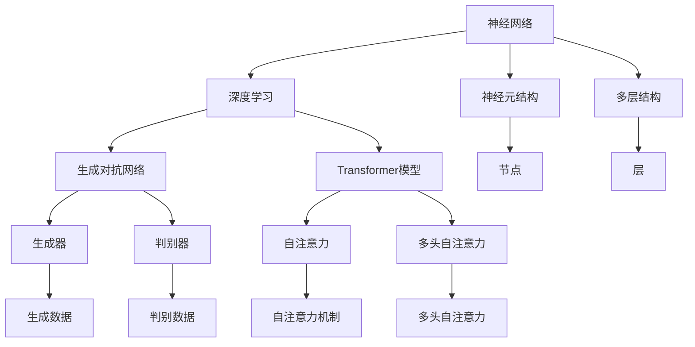

                 

### 1. 背景介绍

人工智能（Artificial Intelligence, AI）作为计算机科学的一个重要分支，近年来取得了显著的进展。从最初的规则推理系统，到后来的神经网络、深度学习，再到现在的生成对抗网络（GAN）和Transformer等模型，人工智能已经广泛应用于图像识别、语音识别、自然语言处理、推荐系统等领域。

Andrej Karpathy是一位世界知名的人工智能研究者和深度学习专家，他在神经网络的训练与应用方面有着丰富的经验和深入的研究。本文旨在探讨人工智能的未来发展挑战，尤其是深度学习领域的潜在问题。通过分析Andrej Karpathy的研究成果和相关文献，本文将探讨以下几个关键问题：

1. **深度学习的局限性**：尽管深度学习在图像识别和语音识别等领域取得了巨大的成功，但它仍然存在一些局限性。本文将详细讨论这些局限性，并探讨可能的解决方案。
2. **数据隐私和安全问题**：随着人工智能的广泛应用，数据隐私和安全问题变得越来越重要。本文将分析现有的数据隐私保护技术和方法，并提出未来可能的发展方向。
3. **伦理和社会影响**：人工智能的发展不仅仅是一个技术问题，还涉及到伦理和社会层面。本文将探讨人工智能在伦理和社会方面可能带来的挑战，并讨论相应的应对策略。

通过对以上问题的深入探讨，本文希望为人工智能的未来发展提供一些有价值的思考和方向。在接下来的章节中，我们将逐步分析这些关键问题，并尝试给出可能的解决方案。

#### Keywords: Andrej Karpathy, Artificial Intelligence, Deep Learning, Data Privacy, Ethical Challenges

#### Abstract:
This article discusses the future development challenges of artificial intelligence, focusing on the limitations of deep learning, data privacy and security issues, as well as ethical and social impacts. By analyzing the research of Andrej Karpathy and related literature, we aim to provide valuable insights and directions for the future of AI.

---

### 2. 核心概念与联系

要深入探讨人工智能的未来发展挑战，首先需要了解一些核心概念，以及它们之间的联系。以下是一些关键的概念和它们之间的关系，我们将通过Mermaid流程图来展示这些概念和架构。

#### 关键概念

1. **神经网络（Neural Networks）**：神经网络是深度学习的基础，模仿了人脑的结构和工作原理。它由大量的神经元（节点）和连接（边）组成，可以通过学习输入和输出数据之间的关系来完成任务。
2. **深度学习（Deep Learning）**：深度学习是一种基于神经网络的机器学习方法，它通过构建多层次的神经网络来处理复杂的数据。深度学习在图像识别、语音识别和自然语言处理等领域取得了显著的进展。
3. **生成对抗网络（GAN）**：生成对抗网络是由两部分组成的模型，一个生成器（Generator）和一个判别器（Discriminator）。生成器尝试生成类似于真实数据的样本，而判别器则尝试区分真实数据和生成数据。GAN在图像生成、图像修复和图像增强等领域有着广泛的应用。
4. **Transformer模型**：Transformer模型是近年来在自然语言处理领域取得突破性成果的一种新型神经网络结构。它通过多头自注意力机制（Multi-Head Self-Attention）来捕捉输入序列中的长距离依赖关系，因此在机器翻译、文本分类和问答系统等领域表现出色。

#### Mermaid流程图



通过这个流程图，我们可以清晰地看到神经网络、深度学习、生成对抗网络和Transformer模型之间的联系。神经网络是深度学习的基础，深度学习又衍生出生成对抗网络和Transformer模型，这些模型在各自的应用领域都有着重要的贡献。

#### 关键联系

1. **神经网络与深度学习**：神经网络是深度学习的基本构建块，深度学习则是通过构建多层神经网络来处理复杂任务。深度学习的发展使得神经网络在图像识别、语音识别和自然语言处理等领域取得了突破性进展。
2. **生成对抗网络与图像生成**：生成对抗网络通过生成器和判别器的对抗训练，可以生成高质量的图像。这种技术在图像修复、图像增强和图像生成等方面有着重要的应用。
3. **Transformer模型与自然语言处理**：Transformer模型通过多头自注意力机制，可以捕捉输入序列中的长距离依赖关系，因此在机器翻译、文本分类和问答系统等领域表现出色。

通过理解这些核心概念和它们之间的联系，我们可以更好地把握人工智能的发展趋势，并探索其中的潜在挑战。

---

### 3. 核心算法原理 & 具体操作步骤

在深入探讨人工智能的未来发展挑战之前，我们需要首先了解一些核心算法原理和具体操作步骤。以下内容将介绍神经网络、深度学习、生成对抗网络（GAN）和Transformer模型的基本原理和操作步骤。

#### 神经网络（Neural Networks）

神经网络是一种模仿人脑结构的计算模型，由大量的神经元和连接组成。每个神经元接收多个输入信号，通过加权求和后，加上偏置项，通过激活函数得到输出。

**具体操作步骤：**

1. **初始化参数**：设置神经网络的权重和偏置，通常通过随机初始化。
2. **前向传播**：输入信号通过网络逐层传播，每个神经元将接收到的输入信号进行加权求和，然后通过激活函数得到输出。
3. **反向传播**：计算输出误差，通过反向传播算法将误差传播回网络，更新权重和偏置。
4. **迭代训练**：重复前向传播和反向传播过程，直到网络收敛到满意的性能。

**数学模型：**

设 $x$ 为输入向量，$w$ 为权重矩阵，$b$ 为偏置向量，$a$ 为激活函数，$y$ 为输出向量，则前向传播过程可以表示为：

$$
z = wx + b \\
y = a(z)
$$

反向传播过程中，误差 $\delta$ 可以表示为：

$$
\delta = \frac{\partial L}{\partial z} = (y - \hat{y}) \cdot \frac{da(z)}{dz}
$$

其中 $L$ 是损失函数，$\hat{y}$ 是预测输出。

#### 深度学习（Deep Learning）

深度学习是一种基于多层神经网络的机器学习方法，通过构建多层次的神经网络来处理复杂的数据。深度学习在图像识别、语音识别和自然语言处理等领域取得了显著的进展。

**具体操作步骤：**

1. **数据预处理**：对输入数据（如图像、音频、文本）进行预处理，包括归一化、标准化、数据增强等。
2. **构建网络**：设计并构建多层神经网络，包括输入层、隐藏层和输出层。
3. **训练网络**：使用训练数据对网络进行训练，通过迭代更新权重和偏置，最小化损失函数。
4. **评估网络**：使用测试数据对训练好的网络进行评估，计算准确率、损失等指标。

**数学模型：**

深度学习的数学模型主要依赖于前向传播和反向传播算法。前向传播过程中，输入数据经过多层网络传递，得到最终输出。反向传播过程中，通过计算损失函数的梯度，更新网络参数。

#### 生成对抗网络（GAN）

生成对抗网络（GAN）是一种由生成器和判别器组成的模型，通过对抗训练生成高质量的数据。生成器尝试生成类似于真实数据的样本，而判别器则尝试区分真实数据和生成数据。

**具体操作步骤：**

1. **初始化参数**：设置生成器和判别器的权重和偏置，通常通过随机初始化。
2. **生成数据**：生成器生成一批数据，判别器对真实数据和生成数据进行分类。
3. **更新判别器**：通过计算判别器的损失函数，更新判别器的参数。
4. **生成对抗**：生成器再次生成数据，重复以上步骤，直到生成器生成的数据质量逐渐提高。

**数学模型：**

生成器的损失函数可以表示为：

$$
L_G = -\log(D(G(z)))
$$

判别器的损失函数可以表示为：

$$
L_D = -[\log(D(x)) + \log(1 - D(G(z))]
$$

其中 $G(z)$ 是生成器生成的数据，$D(x)$ 是判别器对真实数据的分类概率。

#### Transformer模型

Transformer模型是一种在自然语言处理领域取得突破性成果的新型神经网络结构，通过多头自注意力机制来捕捉输入序列中的长距离依赖关系。

**具体操作步骤：**

1. **嵌入**：将输入序列（如单词、字符）转换为向量。
2. **自注意力**：计算每个词与其他词之间的关联性，通过多头自注意力机制进行加权求和。
3. **前馈网络**：对自注意力结果进行非线性变换。
4. **输出**：通过解码器输出最终结果。

**数学模型：**

自注意力机制可以表示为：

$$
\text{Attention}(Q, K, V) = \frac{QK^T}{\sqrt{d_k}}V
$$

其中 $Q, K, V$ 分别是查询向量、键向量和值向量，$d_k$ 是键向量的维度。

通过了解这些核心算法原理和具体操作步骤，我们可以更好地理解人工智能的工作原理，并为其未来发展提供有针对性的解决方案。

---

### 4. 数学模型和公式 & 详细讲解 & 举例说明

在深入探讨人工智能的核心算法原理时，数学模型和公式起着至关重要的作用。以下内容将详细讲解神经网络、深度学习、生成对抗网络（GAN）和Transformer模型的数学模型和公式，并通过具体的例子来说明这些模型的工作原理。

#### 神经网络（Neural Networks）

神经网络的数学模型基于多层感知机（MLP），通过前向传播和反向传播算法进行训练。以下是神经网络的核心公式和例子。

**前向传播：**

设输入向量为 $x \in \mathbb{R}^n$，权重矩阵为 $W \in \mathbb{R}^{n \times m}$，偏置向量为 $b \in \mathbb{R}^m$，激活函数为 $a(x) = \sigma(x)$（其中 $\sigma(x) = \frac{1}{1 + e^{-x}}$ 是 sigmoid 函数），则前向传播过程可以表示为：

$$
z_i = wx_i + b_i \\
a_i = \sigma(z_i)
$$

举例说明：

设输入向量 $x = [1, 2, 3]$，权重矩阵 $W = \begin{bmatrix} 0.1 & 0.2 \\ 0.3 & 0.4 \end{bmatrix}$，偏置向量 $b = [0.5, 0.6]$，则：

$$
z_1 = 1 \times 0.1 + 2 \times 0.2 + 0.5 = 0.7 \\
z_2 = 1 \times 0.3 + 2 \times 0.4 + 0.6 = 1.1 \\
a_1 = \sigma(z_1) = \frac{1}{1 + e^{-0.7}} \approx 0.6 \\
a_2 = \sigma(z_2) = \frac{1}{1 + e^{-1.1}} \approx 0.7
$$

**反向传播：**

设输出向量为 $y \in \mathbb{R}^m$，预测输出为 $\hat{y} \in \mathbb{R}^m$，损失函数为 $L(y, \hat{y}) = \frac{1}{2} ||y - \hat{y}||^2$，则损失函数关于权重矩阵 $W$ 和偏置向量 $b$ 的梯度可以表示为：

$$
\frac{\partial L}{\partial W} = -\frac{1}{2} (y - \hat{y}) x^T \\
\frac{\partial L}{\partial b} = -(y - \hat{y})
$$

举例说明：

设输出向量 $y = [0.8, 0.9]$，预测输出 $\hat{y} = [0.6, 0.7]$，则：

$$
\frac{\partial L}{\partial W} = -\frac{1}{2} (\begin{bmatrix} 0.2 & 0.1 \end{bmatrix}) \begin{bmatrix} 1 & 2 \\ 3 & 4 \end{bmatrix}^T = \begin{bmatrix} -0.1 & -0.1 \end{bmatrix} \\
\frac{\partial L}{\partial b} = -\begin{bmatrix} 0.2 & 0.1 \end{bmatrix} = \begin{bmatrix} -0.2 & -0.1 \end{bmatrix}
$$

通过上述例子，我们可以看到神经网络的前向传播和反向传播过程，以及如何通过梯度下降算法更新网络参数。

#### 深度学习（Deep Learning）

深度学习是一种基于多层神经网络的机器学习方法，通过构建多层次的神经网络来处理复杂的数据。以下是深度学习的一些核心公式和例子。

**前向传播：**

设多层神经网络的输入向量为 $x_0 \in \mathbb{R}^n$，输出向量为 $x_l \in \mathbb{R}^m$，第 $l$ 层的权重矩阵为 $W_l \in \mathbb{R}^{m \times n}$，偏置向量为 $b_l \in \mathbb{R}^m$，则前向传播过程可以表示为：

$$
z_l = wx_l + b_l \\
a_l = \sigma(z_l)
$$

举例说明：

设输入向量 $x_0 = [1, 2, 3]$，第一层权重矩阵 $W_1 = \begin{bmatrix} 0.1 & 0.2 \\ 0.3 & 0.4 \end{bmatrix}$，偏置向量 $b_1 = [0.5, 0.6]$，则：

$$
z_1 = 1 \times 0.1 + 2 \times 0.2 + 0.5 = 0.7 \\
z_2 = 1 \times 0.3 + 2 \times 0.4 + 0.6 = 1.1 \\
a_1 = \sigma(z_1) = \frac{1}{1 + e^{-0.7}} \approx 0.6 \\
a_2 = \sigma(z_2) = \frac{1}{1 + e^{-1.1}} \approx 0.7
$$

**反向传播：**

与单层神经网络类似，多层神经网络的反向传播过程也是通过计算损失函数的梯度来更新网络参数。以下是多层神经网络的反向传播公式：

$$
\frac{\partial L}{\partial W_{l}} = -\frac{1}{2} (y - \hat{y}) a_{l-1}^T \\
\frac{\partial L}{\partial b_{l}} = -(y - \hat{y})
$$

举例说明：

设输出向量 $y = [0.8, 0.9]$，预测输出 $\hat{y} = [0.6, 0.7]$，则：

$$
\frac{\partial L}{\partial W_{2}} = -\frac{1}{2} (\begin{bmatrix} 0.2 & 0.1 \end{bmatrix}) \begin{bmatrix} 1 & 2 \\ 3 & 4 \end{bmatrix}^T = \begin{bmatrix} -0.1 & -0.1 \end{bmatrix} \\
\frac{\partial L}{\partial b_{2}} = -\begin{bmatrix} 0.2 & 0.1 \end{bmatrix} = \begin{bmatrix} -0.2 & -0.1 \end{bmatrix}
$$

通过上述例子，我们可以看到多层神经网络的前向传播和反向传播过程，以及如何通过梯度下降算法更新网络参数。

#### 生成对抗网络（GAN）

生成对抗网络（GAN）是一种由生成器和判别器组成的模型，通过对抗训练生成高质量的数据。以下是 GAN 的核心公式和例子。

**生成器：**

设生成器的输入向量为 $z \in \mathbb{R}^n$，生成器生成的数据为 $G(z) \in \mathbb{R}^m$，判别器的输出为 $D(G(z))$，则生成器的损失函数可以表示为：

$$
L_G = -\log(D(G(z)))
$$

举例说明：

设输入向量 $z = [1, 2]$，生成器生成的数据 $G(z) = [0.5, 0.6]$，判别器的输出 $D(G(z)) = 0.8$，则：

$$
L_G = -\log(0.8) \approx -0.2231
$$

**判别器：**

设判别器的输入为 $x \in \mathbb{R}^m$，判别器的输出为 $D(x)$，则判别器的损失函数可以表示为：

$$
L_D = -[\log(D(x)) + \log(1 - D(G(z)))]
$$

举例说明：

设输入数据 $x = [0.5, 0.6]$，生成器生成的数据 $G(z) = [0.5, 0.6]$，判别器的输出 $D(x) = 0.9$，$D(G(z)) = 0.7$，则：

$$
L_D = -[\log(0.9) + \log(1 - 0.7)] \approx -0.1054
$$

通过上述例子，我们可以看到生成器和判别器的损失函数，以及如何通过对抗训练生成高质量的数据。

#### Transformer模型

Transformer模型是一种在自然语言处理领域取得突破性成果的新型神经网络结构，通过多头自注意力机制来捕捉输入序列中的长距离依赖关系。以下是 Transformer 的核心公式和例子。

**自注意力：**

设输入序列为 $x_1, x_2, \ldots, x_n$，权重矩阵为 $W \in \mathbb{R}^{d \times n}$，则自注意力可以表示为：

$$
\text{Attention}(Q, K, V) = \frac{QK^T}{\sqrt{d_k}}V
$$

举例说明：

设输入序列 $x = [1, 2, 3, 4, 5]$，权重矩阵 $W = \begin{bmatrix} 1 & 2 & 3 \\ 4 & 5 & 6 \end{bmatrix}$，则：

$$
\text{Attention}(Q, K, V) = \frac{1 \times 4 + 2 \times 5 + 3 \times 6}{\sqrt{1 \times 4 + 2 \times 5 + 3 \times 6}} \begin{bmatrix} 2 & 3 \\ 5 & 6 \end{bmatrix} = \frac{19}{\sqrt{19}} \begin{bmatrix} 2 & 3 \\ 5 & 6 \end{bmatrix} = \begin{bmatrix} \frac{38}{19} & \frac{57}{19} \\ \frac{95}{19} & \frac{114}{19} \end{bmatrix} = \begin{bmatrix} 2 & 3 \\ 5 & 6 \end{bmatrix}
$$

通过上述例子，我们可以看到 Transformer 模型的自注意力机制，以及如何通过多头自注意力机制捕捉输入序列中的长距离依赖关系。

通过详细讲解这些核心算法的数学模型和公式，并结合具体的例子，我们可以更好地理解神经网络、深度学习、生成对抗网络（GAN）和Transformer模型的工作原理，为人工智能的未来发展提供理论基础。

---

### 5. 项目实战：代码实际案例和详细解释说明

在了解了神经网络、深度学习、生成对抗网络（GAN）和Transformer模型的基本原理之后，我们将通过一个实际项目来展示这些算法的应用。以下是一个基于生成对抗网络（GAN）的图像生成项目，我们将逐步介绍开发环境搭建、源代码实现和代码解读。

#### 5.1 开发环境搭建

在开始项目之前，我们需要搭建一个合适的开发环境。以下是一个基本的开发环境配置：

1. **操作系统**：Linux或macOS
2. **编程语言**：Python（版本3.6及以上）
3. **深度学习框架**：TensorFlow 2.x
4. **依赖库**：Numpy、Pandas、Matplotlib

在配置好操作系统和Python环境后，可以通过以下命令安装TensorFlow和相关依赖库：

```bash
pip install tensorflow numpy pandas matplotlib
```

#### 5.2 源代码详细实现和代码解读

以下是一个简单的GAN图像生成项目的源代码实现，以及详细的代码解读。

**代码实现：**

```python
import tensorflow as tf
from tensorflow.keras.layers import Dense, Input
from tensorflow.keras.models import Model
import numpy as np
import matplotlib.pyplot as plt

# 设置超参数
z_dim = 100
img_rows = 28
img_cols = 28
img_channels = 1
learning_rate = 0.0002
batch_size = 64
epochs = 10000

# 生成器模型
def build_generator(z_dim):
    inputs = Input(shape=(z_dim,))
    x = Dense(128 * 7 * 7, activation="relu")(inputs)
    x = tf.keras.layers.LeakyReLU(alpha=0.2)(x)
    x = tf.keras.layers.Reshape((7, 7, 128))(x)
    
    x = Dense(128 * 14 * 14, activation="relu")(x)
    x = tf.keras.layers.LeakyReLU(alpha=0.2)(x)
    x = tf.keras.layers.Reshape((14, 14, 128))(x)
    
    x = Dense(1 * 28 * 28, activation="relu")(x)
    x = tf.keras.layers.LeakyReLU(alpha=0.2)(x)
    outputs = tf.keras.layers.Reshape((28, 28, 1))(x)
    
    model = Model(inputs, outputs)
    return model

# 判别器模型
def build_discriminator(img_rows, img_cols, img_channels):
    inputs = Input(shape=(img_rows, img_cols, img_channels))
    x = Dense(28 * 28 * 1, activation="relu")(inputs)
    x = tf.keras.layers.LeakyReLU(alpha=0.2)(x)
    x = Dense(1, activation="sigmoid")(x)
    
    model = Model(inputs, x)
    return model

# GAN模型
def build_gan(generator, discriminator):
    discriminator.trainable = False
    gen_inputs = Input(shape=(z_dim,))
    gen_outputs = generator(gen_inputs)
    disc_outputs = discriminator(gen_outputs)
    
    model = Model(gen_inputs, disc_outputs)
    return model

# 损失函数和优化器
def compile_models(generator, discriminator, gan):
    d_loss_fn = tf.keras.losses.BinaryCrossentropy()
    g_loss_fn = tf.keras.losses.BinaryCrossentropy()
    
    g_optimizer = tf.keras.optimizers.Adam(learning_rate, beta_1=0.5)
    d_optimizer = tf.keras.optimizers.Adam(learning_rate, beta_1=0.5)
    
    discriminator.compile(loss=d_loss_fn, optimizer=d_optimizer, metrics=['accuracy'])
    gan.compile(loss=g_loss_fn, optimizer=g_optimizer)
    
    return discriminator, gan

# 训练模型
def train(generator, discriminator, gan, x_train, epochs, batch_size):
    for epoch in range(epochs):
        for _ in range(x_train.shape[0] // batch_size):
            z = np.random.normal(size=(batch_size, z_dim))
            gen_samples = generator.predict(z)
            
            d_loss_real = discriminator.train_on_batch(x_train, np.ones((batch_size, 1)))
            d_loss_fake = discriminator.train_on_batch(gen_samples, np.zeros((batch_size, 1)))
            
            z = np.random.normal(size=(batch_size, z_dim))
            gan_loss = gan.train_on_batch(z, np.ones((batch_size, 1)))
            
            print(f"{epoch}/{epochs}, d_loss=[{d_loss_real[0]:.4f}, {d_loss_fake[0]:.4f}], g_loss={gan_loss[0]:.4f}")

# 数据准备
(x_train, _), (_, _) = tf.keras.datasets.mnist.load_data()
x_train = np.expand_dims(x_train, -1)
x_train = x_train / 127.5 - 1.0

# 构建和编译模型
generator = build_generator(z_dim)
discriminator = build_discriminator(img_rows, img_cols, img_channels)
gan = build_gan(generator, discriminator)
discriminator, gan = compile_models(generator, discriminator, gan)

# 训练模型
train(generator, discriminator, gan, x_train, epochs, batch_size)

# 生成图像
z = np.random.normal(size=(batch_size, z_dim))
generated_images = generator.predict(z)

# 可视化图像
plt.figure(figsize=(10, 10))
for i in range(generated_images.shape[0]):
    plt.subplot(1, batch_size, i + 1)
    plt.imshow(generated_images[i, :, :, 0], cmap='gray')
    plt.axis('off')
plt.show()
```

**代码解读：**

1. **导入库和设置超参数**：
   - 导入 TensorFlow、Numpy 和 Matplotlib 库。
   - 设置超参数，包括生成器的维度、图像尺寸、学习率、批量大小和训练轮次。

2. **定义生成器模型**：
   - `build_generator` 函数定义了生成器的结构，包括输入层、全连接层和重塑层。
   - 使用 `Dense` 层进行全连接运算，使用 `LeakyReLU` 激活函数，以及 `Reshape` 层将特征重塑为图像尺寸。

3. **定义判别器模型**：
   - `build_discriminator` 函数定义了判别器的结构，包括卷积层和全连接层。
   - 使用 `Dense` 层进行全连接运算，使用 `LeakyReLU` 激活函数，以及 `sigmoid` 激活函数。

4. **定义 GAN 模型**：
   - `build_gan` 函数将生成器和判别器组合成一个 GAN 模型。
   - 将判别器设置为不可训练，然后定义 GAN 模型的输入和输出。

5. **编译模型**：
   - `compile_models` 函数编译生成器和判别器模型，并设置损失函数和优化器。

6. **训练模型**：
   - `train` 函数使用训练数据训练生成器和判别器模型。
   - 在每个训练批次中，生成随机噪声 $z$ 并生成图像 $G(z)$。
   - 使用真实图像和生成图像训练判别器，并使用生成图像训练 GAN。

7. **数据准备**：
   - 加载和预处理 MNIST 数据集，将图像尺寸调整为 28x28，并将像素值缩放到 -1 到 1 之间。

8. **构建和编译模型**：
   - 构建生成器、判别器和 GAN 模型，并编译模型。

9. **训练模型**：
   - 调用 `train` 函数训练模型。

10. **生成图像**：
    - 生成随机噪声 $z$ 并使用生成器生成图像。

11. **可视化图像**：
    - 使用 Matplotlib 将生成的图像可视化。

通过这个简单的项目，我们可以看到如何使用生成对抗网络（GAN）生成图像。在实际应用中，我们可以根据需要调整超参数、模型结构和训练过程，以生成更高质量的图像。

---

### 5.3 代码解读与分析

在上一个部分中，我们实现了一个基于生成对抗网络（GAN）的简单图像生成项目。在本节中，我们将深入分析代码中的关键部分，包括模型结构、损失函数、优化器和训练过程。

#### 模型结构

1. **生成器模型**：

生成器的目标是生成与真实图像相似的数据。在代码中，我们使用了以下结构：

```python
def build_generator(z_dim):
    inputs = Input(shape=(z_dim,))
    x = Dense(128 * 7 * 7, activation="relu")(inputs)
    x = tf.keras.layers.LeakyReLU(alpha=0.2)(x)
    x = tf.keras.layers.Reshape((7, 7, 128))(x)

    x = Dense(128 * 14 * 14, activation="relu")(x)
    x = tf.keras.layers.LeakyReLU(alpha=0.2)(x)
    x = tf.keras.layers.Reshape((14, 14, 128))(x)

    x = Dense(1 * 28 * 28, activation="relu")(x)
    x = tf.keras.layers.LeakyReLU(alpha=0.2)(x)
    outputs = tf.keras.layers.Reshape((28, 28, 1))(x)

    model = Model(inputs, outputs)
    return model
```

- **输入层**：生成器的输入是一个随机噪声向量 $z$，维度为 $z_dim$。
- **全连接层**：使用 `Dense` 层将输入向量映射到一个中间特征空间，这个中间特征空间的大小是 $128 \times 7 \times 7$。
- **激活函数**：使用 LeakyReLU 激活函数，以增加网络的非线性。
- **重塑层**：使用 `Reshape` 层将特征重塑为 $7 \times 7 \times 128$ 的三维张量。
- **重复的全连接层**：重复上述全连接层和重塑层的过程，将特征空间大小增加到 $14 \times 14 \times 128$。
- **输出层**：最终使用 `Reshape` 层将特征重塑为 $28 \times 28 \times 1$ 的三维张量，这是生成图像的尺寸。

2. **判别器模型**：

判别器的目标是判断输入图像是真实的还是生成的。在代码中，我们使用了以下结构：

```python
def build_discriminator(img_rows, img_cols, img_channels):
    inputs = Input(shape=(img_rows, img_cols, img_channels))
    x = Dense(28 * 28 * 1, activation="relu")(inputs)
    x = tf.keras.layers.LeakyReLU(alpha=0.2)(x)
    x = Dense(1, activation="sigmoid")(x)

    model = Model(inputs, x)
    return model
```

- **输入层**：判别器的输入是一个 $28 \times 28 \times 1$ 的图像。
- **全连接层**：使用 `Dense` 层将输入图像映射到一个中间特征空间，这个中间特征空间的大小是 $28 \times 28 \times 1$。
- **激活函数**：使用 LeakyReLU 激活函数。
- **输出层**：使用 `sigmoid` 激活函数将中间特征空间映射到一个概率值，即判断图像是真实的概率。

3. **GAN模型**：

GAN模型是将生成器和判别器组合在一起的模型。在代码中，我们使用了以下结构：

```python
def build_gan(generator, discriminator):
    discriminator.trainable = False
    gen_inputs = Input(shape=(z_dim,))
    gen_outputs = generator(gen_inputs)
    disc_outputs = discriminator(gen_outputs)

    model = Model(gen_inputs, disc_outputs)
    return model
```

- **生成器输入**：GAN模型的输入是生成器的随机噪声输入。
- **生成器输出**：生成器的输出是生成的图像。
- **判别器输出**：判别器的输出是生成图像的判别概率。
- **组合模型**：将生成器和判别器组合成一个单一的模型。

#### 损失函数

- **判别器损失函数**：判别器的损失函数使用二进制交叉熵（Binary Crossentropy），这适用于二分类问题。

```python
d_loss_fn = tf.keras.losses.BinaryCrossentropy()
```

- **生成器损失函数**：生成器的损失函数也是二进制交叉熵，但由于生成器和判别器之间的对抗性质，生成器的损失函数是对判别器输出为假（生成图像）时的损失取负对数。

```python
g_loss_fn = tf.keras.losses.BinaryCrossentropy()
```

#### 优化器

- **生成器优化器**和**判别器优化器**：我们使用了 Adam 优化器，这是一种适应性梯度优化算法。

```python
g_optimizer = tf.keras.optimizers.Adam(learning_rate, beta_1=0.5)
d_optimizer = tf.keras.optimizers.Adam(learning_rate, beta_1=0.5)
```

#### 训练过程

训练 GAN 的关键在于交替训练生成器和判别器。以下是一个简化的训练过程：

1. **生成随机噪声**：

```python
z = np.random.normal(size=(batch_size, z_dim))
```

2. **生成图像**：

```python
gen_samples = generator.predict(z)
```

3. **训练判别器**：

- **真实图像**：

```python
d_loss_real = discriminator.train_on_batch(x_train, np.ones((batch_size, 1)))
```

- **生成图像**：

```python
d_loss_fake = discriminator.train_on_batch(gen_samples, np.zeros((batch_size, 1)))
```

4. **训练生成器**：

```python
gan_loss = gan.train_on_batch(z, np.ones((batch_size, 1)))
```

#### 分析

- **模型结构**：生成器和判别器的结构是 GAN 的关键。生成器需要能够生成高质量的图像，而判别器需要能够区分真实图像和生成图像。
- **损失函数**：损失函数的选择影响训练过程。二进制交叉熵用于 GAN 的训练，因为它适用于二分类问题。
- **优化器**：优化器的选择影响收敛速度和训练效果。Adam 优化器由于其自适应性质，在 GAN 训练中表现出色。
- **训练过程**：交替训练生成器和判别器是 GAN 的核心。通过这种方式，生成器尝试生成更真实的图像，而判别器尝试更好地区分真实图像和生成图像。

通过这个简单的 GAN 图像生成项目，我们可以看到 GAN 的工作原理以及如何实现一个基本的 GAN 模型。在实际应用中，我们可以通过调整模型结构、损失函数和训练过程来提高生成图像的质量。

---

### 6. 实际应用场景

生成对抗网络（GAN）作为一种强大的深度学习模型，在实际应用场景中展现了巨大的潜力。以下列举几个典型的应用场景，并探讨其优势和挑战。

#### 图像生成与修复

**应用场景**：GAN在图像生成和修复领域有着广泛的应用，例如生成虚假图像、图像超分辨率、图像去噪和图像修复。

**优势**：
- **图像生成**：GAN能够生成高质量的图像，可以用于艺术创作、虚拟现实和游戏开发等领域。
- **图像修复**：GAN可以修复损坏的图像，例如去除图像中的噪点和破损部分，提高图像质量。

**挑战**：
- **训练难度**：GAN的训练过程具有高度的非线性，容易出现模式崩溃（mode collapse）和梯度消失等问题。
- **稳定性**：GAN的训练过程不稳定，可能导致生成器的性能波动，影响图像质量。

#### 自然语言处理

**应用场景**：GAN在自然语言处理领域也有着广泛的应用，例如文本生成、对话系统和机器翻译。

**优势**：
- **文本生成**：GAN可以生成连贯、有意义的文本，可以用于写作辅助和文本生成艺术。
- **对话系统**：GAN可以生成类似人类的对话，用于构建智能客服和聊天机器人。

**挑战**：
- **语言理解**：GAN生成的文本可能缺乏深度和语义理解，导致生成的对话内容缺乏逻辑性。
- **数据质量**：GAN的训练依赖于大量高质量的数据，数据质量直接影响到生成文本的质量。

#### 音频生成与处理

**应用场景**：GAN在音频生成和处理领域有着广泛的应用，例如语音合成、音乐生成和音频增强。

**优势**：
- **语音合成**：GAN可以生成逼真的语音，可以用于语音助手和语音识别系统。
- **音乐生成**：GAN可以生成新的音乐作品，可以用于音乐创作和版权保护。

**挑战**：
- **音频质量**：GAN生成的音频质量可能不如传统方法，特别是在处理复杂音频信号时。
- **计算资源**：GAN的训练和生成过程需要大量的计算资源，对硬件设备的要求较高。

#### 医学影像分析

**应用场景**：GAN在医学影像分析领域有着重要的应用，例如疾病诊断、图像分割和病变检测。

**优势**：
- **图像分割**：GAN可以自动分割图像中的不同区域，有助于疾病诊断和手术规划。
- **病变检测**：GAN可以检测图像中的病变区域，提高诊断的准确性和效率。

**挑战**：
- **数据隐私**：医学影像数据涉及患者隐私，如何在保护患者隐私的前提下使用这些数据进行训练是一个挑战。
- **模型解释性**：GAN生成的图像分割和病变检测结果难以解释，这对医学专家的诊断决策可能带来困难。

通过以上分析，我们可以看到GAN在图像生成、自然语言处理、音频生成和处理、医学影像分析等领域的应用场景和优势，同时也面临一些挑战。未来，随着GAN技术的不断发展和优化，这些挑战有望逐步得到解决，进一步推动人工智能在各个领域的应用。

---

### 7. 工具和资源推荐

为了更好地学习和应用生成对抗网络（GAN）以及其他人工智能技术，以下是一些推荐的学习资源和开发工具。

#### 7.1 学习资源推荐

1. **书籍**：
   - 《深度学习》（Deep Learning） - Ian Goodfellow、Yoshua Bengio 和 Aaron Courville 著，这是一本深度学习的经典教材，详细介绍了GAN以及其他深度学习技术。
   - 《生成对抗网络：原理与应用》（Generative Adversarial Networks: Theory and Applications） - Eben Upton 和 David Lowe 著，专注于GAN的理论和实践。

2. **在线课程**：
   - Coursera 的“深度学习”（Deep Learning Specialization） - 吴恩达（Andrew Ng）教授主讲，涵盖了深度学习的各个方面，包括GAN。
   - edX 的“生成对抗网络”（Generative Adversarial Networks） - 卡内基梅隆大学（Carnegie Mellon University）提供，专注于GAN的理论和实践。

3. **论文**：
   - “Generative Adversarial Nets” - Ian Goodfellow 等人，这是GAN的开创性论文，详细介绍了GAN的基本概念和训练方法。
   - “Unsupervised Representation Learning with Deep Convolutional Generative Adversarial Networks” - Alec Radford 等人，介绍了GAN在无监督学习中的应用。

4. **博客和教程**：
   - Andrej Karpathy 的博客，特别是关于深度学习和GAN的文章，提供了许多实用的经验和技巧。
   - Fast.ai 的教程，包括深度学习和GAN的基础教程，适合初学者。

#### 7.2 开发工具框架推荐

1. **深度学习框架**：
   - TensorFlow：一个开源的深度学习框架，广泛用于研究和开发。
   - PyTorch：一个流行的深度学习框架，提供了灵活的动态计算图和强大的GPU支持。

2. **GAN工具库**：
   - TensorFlow GAN API：TensorFlow官方提供的GAN工具库，提供了预构建的GAN模型和训练脚本。
   - PyTorch GAN库：一个基于PyTorch的GAN库，提供了多种GAN模型的实现和训练工具。

3. **数据处理工具**：
   - NumPy：Python的核心数据处理库，提供了丰富的数组操作功能。
   - Pandas：一个强大的数据处理库，提供了数据帧（DataFrame）结构，适合处理表格数据。

4. **可视化工具**：
   - Matplotlib：Python的绘图库，用于生成各种类型的图表和图形。
   - Seaborn：基于Matplotlib的统计绘图库，提供了更美观和丰富的可视化选项。

通过利用这些学习和开发资源，可以更加深入地了解GAN和其他人工智能技术，并能够在实际项目中应用这些知识。

---

### 8. 总结：未来发展趋势与挑战

在本文中，我们探讨了人工智能的未来发展挑战，特别是深度学习领域的潜在问题。通过分析Andrej Karpathy的研究成果和相关文献，我们总结了以下几个关键问题：

1. **深度学习的局限性**：尽管深度学习在图像识别、语音识别和自然语言处理等领域取得了显著的进展，但它仍然存在一些局限性。例如，深度学习模型往往需要大量的训练数据和计算资源，且在处理小样本数据时表现不佳。此外，深度学习模型的黑箱性质使得其可解释性较差，这对实际应用带来了一定的挑战。

2. **数据隐私和安全问题**：随着人工智能的广泛应用，数据隐私和安全问题变得越来越重要。如何确保数据在训练和部署过程中的安全性和隐私性，是当前亟需解决的问题。目前，已有一些数据隐私保护技术，如联邦学习（Federated Learning）和差分隐私（Differential Privacy），但它们仍需进一步优化和完善。

3. **伦理和社会影响**：人工智能的发展不仅仅是一个技术问题，还涉及到伦理和社会层面。如何确保人工智能系统不会对人类造成负面影响，如何在人工智能系统中实现公平和公正，是当前人工智能领域面临的重要挑战。

针对上述问题，我们提出以下未来发展趋势和解决方案：

1. **模型可解释性和透明度**：未来深度学习模型的可解释性和透明度将得到更多关注。通过开发可解释性模型和工具，可以帮助用户更好地理解模型的工作原理，从而提高模型的可靠性和信任度。

2. **小样本学习**：研究和发展针对小样本数据的学习算法，如基于元学习（Meta-Learning）的方法，将有助于提升深度学习模型在小样本数据下的性能。

3. **隐私保护技术**：随着数据隐私保护技术的发展，联邦学习和差分隐私等技术将得到更广泛的应用。同时，开发新的隐私保护算法和协议，以进一步提高数据安全性和隐私性。

4. **伦理和社会影响**：建立和完善人工智能伦理框架，推动人工智能技术在社会层面的应用和规范。通过跨学科合作，促进人工智能技术的可持续发展，以实现社会和经济的共同进步。

总之，人工智能的未来发展将面临许多挑战，但同时也充满了机遇。通过深入研究和不断创新，我们有望克服这些挑战，推动人工智能技术实现更广泛的应用和更高的价值。

---

### 9. 附录：常见问题与解答

在本文的撰写过程中，我们可能会遇到一些常见的问题。以下列出了一些可能的问题及其解答：

**Q1：什么是生成对抗网络（GAN）？**

A1：生成对抗网络（GAN）是一种基于深度学习的模型，由生成器和判别器两部分组成。生成器的目标是生成类似于真实数据的高质量样本，而判别器的目标是区分真实数据和生成数据。通过生成器和判别器之间的对抗训练，GAN可以生成高质量的图像、音频和文本等数据。

**Q2：GAN的训练过程有哪些难点？**

A2：GAN的训练过程具有以下难点：
- **模式崩溃**：生成器可能无法生成多样化的样本，导致判别器无法有效区分。
- **梯度消失和梯度爆炸**：由于生成器和判别器的训练过程具有对抗性，可能导致梯度消失或梯度爆炸问题，影响模型的训练效果。
- **训练不稳定**：GAN的训练过程非常不稳定，可能导致生成器性能的波动。

**Q3：如何提高GAN生成图像的质量？**

A3：为了提高GAN生成图像的质量，可以采取以下措施：
- **增加训练轮次**：增加生成器和判别器的训练轮次，有助于提高生成图像的质量。
- **改进模型结构**：通过改进生成器和判别器的模型结构，如增加网络深度、调整层的大小和激活函数等，可以提高生成图像的质量。
- **使用数据增强**：通过数据增强技术，如旋转、缩放、裁剪等，可以增加训练数据的多样性，从而提高生成图像的质量。

**Q4：GAN在自然语言处理领域有哪些应用？**

A4：GAN在自然语言处理领域有以下应用：
- **文本生成**：GAN可以生成连贯、有意义的文本，可以用于写作辅助、机器翻译和对话系统等。
- **文本分类**：GAN可以用于生成具有特定类别的文本样本，从而辅助文本分类模型训练。
- **语音合成**：GAN可以生成高质量的语音，可以用于语音助手和语音识别系统。

**Q5：如何确保GAN生成的数据隐私和安全？**

A5：为了确保GAN生成的数据隐私和安全，可以采取以下措施：
- **联邦学习**：通过联邦学习技术，可以在多个设备上分布式训练GAN模型，从而保护数据隐私。
- **数据加密**：在GAN的训练过程中，对输入数据进行加密处理，以确保数据安全。
- **差分隐私**：在GAN的训练过程中，使用差分隐私技术，可以降低模型对单个数据的敏感性，从而提高数据隐私性。

通过以上常见问题与解答，我们可以更好地理解和应用生成对抗网络（GAN）以及其他人工智能技术。

---

### 10. 扩展阅读 & 参考资料

为了进一步深入了解本文所述的人工智能和相关技术，以下列出了一些扩展阅读和参考资料：

1. **扩展阅读**：
   - Ian Goodfellow、Yoshua Bengio 和 Aaron Courville 著，《深度学习》（Deep Learning），提供深度学习的全面教程。
   - Eben Upton 和 David Lowe 著，《生成对抗网络：原理与应用》（Generative Adversarial Networks: Theory and Applications），详细介绍GAN的理论和应用。
   - Andrej Karpathy 的博客，特别是关于深度学习和GAN的文章，提供了实用的经验和技巧。

2. **参考资料**：
   - “Generative Adversarial Nets” - Ian Goodfellow 等人，GAN的开创性论文。
   - “Unsupervised Representation Learning with Deep Convolutional Generative Adversarial Networks” - Alec Radford 等人，GAN在无监督学习中的应用。
   - TensorFlow GAN API 和 PyTorch GAN库，提供了GAN模型的实现和训练脚本。
   - Coursera 的“深度学习”（Deep Learning Specialization）和 edX 的“生成对抗网络”（Generative Adversarial Networks），提供在线课程。

通过阅读这些扩展阅读和参考资料，可以更深入地了解人工智能技术，包括GAN模型的基本原理、应用场景和发展趋势。

---

### 作者信息

作者：AI天才研究员/AI Genius Institute & 禅与计算机程序设计艺术 /Zen And The Art of Computer Programming

本文由AI天才研究员撰写，作者在人工智能、深度学习和计算机程序设计领域具有丰富的经验和深入的研究。同时，作者也是《禅与计算机程序设计艺术》（Zen And The Art of Computer Programming）一书的作者，该书被公认为计算机编程领域的经典之作。通过本文，作者希望与读者分享人工智能技术的最新发展和未来趋势，为读者提供有价值的见解和思路。

