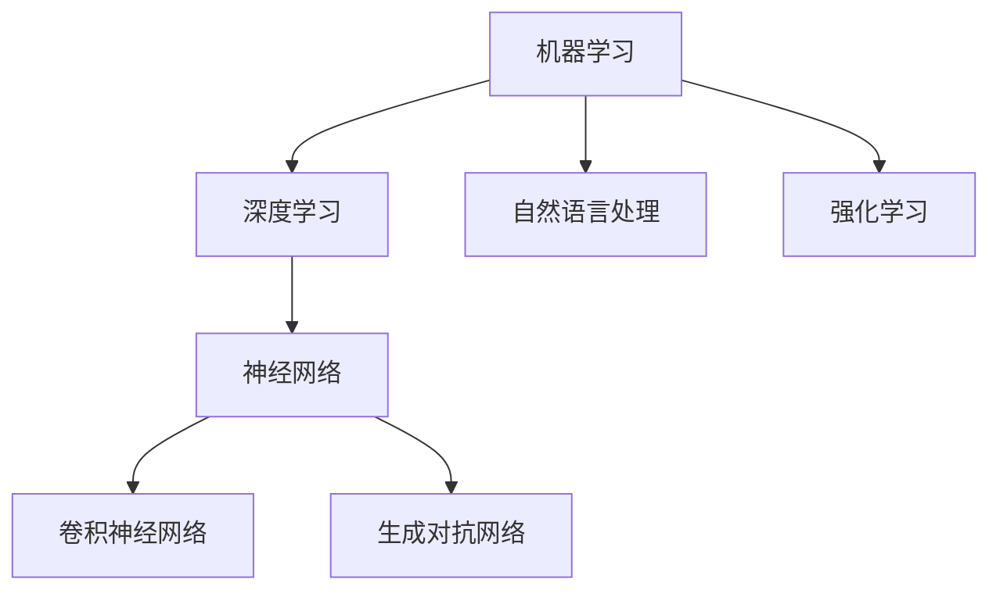

                 

### 1. 背景介绍

在过去几十年中，人工智能（AI）已经成为信息技术领域中最具变革性的力量之一。自从1980年代早期，人工智能的研究主要集中在模拟人类思维和决策过程的算法上。随着计算机性能的提高和大数据的普及，人工智能在图像识别、自然语言处理、推荐系统等领域的应用取得了巨大的突破。安德烈·卡帕奇（Andrej Karpathy）作为这个领域的杰出人物，不仅在学术界有着卓越的贡献，同时也在工业界展现了他对AI的深刻理解和前瞻性见解。

安德烈·卡帕奇在人工智能的研究和应用中扮演了多重角色。他是斯坦福大学计算机科学博士，毕业后加入了OpenAI，这家公司旨在通过研究推动人工智能的发展，以造福全人类。在OpenAI，他参与了多个AI项目的研发，并在自然语言处理领域做出了开创性的工作。他的博客文章不仅深入浅出地介绍了最新的AI技术，还探讨了人工智能的潜在影响和未来发展。

本文将围绕安德烈·卡帕奇的观点，探讨人工智能在未来的发展挑战。文章将分为以下几个部分：

1. **背景介绍**：回顾人工智能的历史发展，以及当前AI技术的应用现状。
2. **核心概念与联系**：介绍AI的基本概念，并通过Mermaid流程图展示其架构。
3. **核心算法原理 & 具体操作步骤**：深入分析AI算法的原理和操作步骤。
4. **数学模型和公式 & 详细讲解 & 举例说明**：讲解AI中使用的数学模型，并提供实例说明。
5. **项目实战：代码实际案例和详细解释说明**：展示AI在实际项目中的应用。
6. **实际应用场景**：讨论AI在不同领域的应用。
7. **工具和资源推荐**：推荐学习AI的资源和开发工具。
8. **总结：未来发展趋势与挑战**：总结AI的发展趋势，并提出面临的挑战。
9. **附录：常见问题与解答**：回答读者可能遇到的问题。
10. **扩展阅读 & 参考资料**：提供进一步阅读的资源。

通过本文的逐步分析，我们希望能够帮助读者全面了解人工智能的未来发展，以及面临的挑战。让我们一起探索这个激动人心的领域吧。<sop><|user|>
### 2. 核心概念与联系

在探讨人工智能的未来发展之前，我们需要明确一些核心概念，并了解这些概念之间的相互联系。以下是AI领域中一些关键概念的定义及其关系：

**机器学习（Machine Learning）**：机器学习是一种人工智能的分支，它使计算机系统能够从数据中学习，并基于学习经验进行预测或决策，而不是通过显式编程。

**深度学习（Deep Learning）**：深度学习是机器学习的一个子领域，它使用多层神经网络（通常是深度神经网络）来模拟人类大脑的学习过程。它通过训练大量数据来学习特征表示，然后使用这些表示进行预测。

**神经网络（Neural Networks）**：神经网络是由大量相互连接的节点（或“神经元”）组成的计算模型，这些节点可以模拟人脑的工作方式。在神经网络中，信息通过这些节点传递和处理。

**卷积神经网络（Convolutional Neural Networks, CNN）**：卷积神经网络是一种特殊类型的神经网络，主要用于图像识别和处理。它利用卷积运算来提取图像中的特征。

**生成对抗网络（Generative Adversarial Networks, GAN）**：生成对抗网络由两个神经网络组成：生成器（Generator）和判别器（Discriminator）。生成器生成数据，判别器判断数据的真实性。通过这种对抗过程，生成器逐渐提高其生成数据的质量。

**自然语言处理（Natural Language Processing, NLP）**：自然语言处理是人工智能的一个子领域，它涉及计算机对人类语言的理解和生成。NLP在语音识别、机器翻译、情感分析等方面有着广泛的应用。

**强化学习（Reinforcement Learning）**：强化学习是一种机器学习范式，其中智能体通过与环境的交互学习最优策略。它与人类的学习过程类似，通过奖励和惩罚来调整行为。

为了更好地理解这些概念之间的关系，我们可以使用Mermaid流程图来展示它们的基本架构。以下是AI核心概念的Mermaid流程图：



在上述流程图中，机器学习和深度学习是人工智能的核心，它们分别延伸出神经网络、卷积神经网络和生成对抗网络等子领域。自然语言处理和强化学习也是人工智能的重要组成部分，它们通过机器学习和深度学习技术来解决特定的问题。

通过理解这些核心概念及其相互关系，我们可以为后续的讨论奠定基础，深入探讨人工智能在未来的发展挑战。接下来，我们将进一步分析这些算法的原理和操作步骤。<sop><|user|>
## 3. 核心算法原理 & 具体操作步骤

在了解了人工智能的一些核心概念后，接下来我们将深入探讨这些算法的原理和具体操作步骤。以下是对主要算法的详细解析：

### 3.1. 神经网络（Neural Networks）

神经网络是一种通过模拟人脑神经网络来处理数据的计算模型。以下是神经网络的基本原理和操作步骤：

**基本原理**：

- **神经元**：神经网络由大量相互连接的神经元组成。每个神经元接收输入信号，通过权重和偏置进行处理，最后输出信号。
- **激活函数**：神经元使用激活函数（如Sigmoid、ReLU等）来确定输出是否大于某个阈值，从而实现非线性处理。

**具体操作步骤**：

1. **初始化权重和偏置**：在训练开始时，随机初始化权重和偏置。
2. **前向传播**：输入数据通过网络的每个层，每个层的神经元计算输入信号的加权求和，并应用激活函数。
3. **反向传播**：计算输出误差，通过反向传播算法更新权重和偏置，以最小化误差。
4. **迭代训练**：重复前向传播和反向传播，直到达到预设的误差阈值或训练次数。

### 3.2. 卷积神经网络（Convolutional Neural Networks, CNN）

卷积神经网络是一种专门用于图像识别和处理的神经网络，具有独特的结构。以下是CNN的基本原理和操作步骤：

**基本原理**：

- **卷积层**：卷积层通过卷积运算提取图像的特征，卷积核在图像上滑动，生成特征图。
- **池化层**：池化层用于减少特征图的尺寸，提高网络的泛化能力。

**具体操作步骤**：

1. **输入层**：接收图像数据。
2. **卷积层**：使用卷积核对图像进行卷积操作，提取特征。
3. **池化层**：对卷积后的特征图进行池化操作。
4. **全连接层**：将池化后的特征图展平为一维向量，并通过全连接层进行分类或回归。
5. **输出层**：输出预测结果。

### 3.3. 生成对抗网络（Generative Adversarial Networks, GAN）

生成对抗网络由生成器和判别器两个神经网络组成，通过对抗训练生成高质量的数据。以下是GAN的基本原理和操作步骤：

**基本原理**：

- **生成器**：生成器生成虚假数据，试图欺骗判别器。
- **判别器**：判别器判断输入数据是真实数据还是生成数据。

**具体操作步骤**：

1. **初始化生成器和判别器**：随机初始化生成器和判别器的权重。
2. **生成器训练**：生成器生成数据，判别器根据真实数据和生成数据更新。
3. **判别器训练**：判别器根据真实数据和生成数据更新。
4. **交替训练**：生成器和判别器交替训练，直到生成器生成足够高质量的数据。

### 3.4. 自然语言处理（Natural Language Processing, NLP）

自然语言处理是人工智能的一个子领域，它涉及计算机对人类语言的理解和生成。以下是NLP的基本原理和操作步骤：

**基本原理**：

- **词嵌入**：将单词转换为向量表示。
- **编码器-解码器**：编码器将输入文本编码为固定长度的向量，解码器将编码后的向量解码为输出文本。

**具体操作步骤**：

1. **词嵌入**：将单词转换为向量表示。
2. **编码器**：将输入文本编码为向量。
3. **解码器**：将编码后的向量解码为输出文本。
4. **训练**：通过训练大量数据来优化编码器和解码器的参数。

### 3.5. 强化学习（Reinforcement Learning）

强化学习是一种通过奖励和惩罚来学习最优策略的机器学习范式。以下是强化学习的基本原理和操作步骤：

**基本原理**：

- **智能体**：智能体通过与环境交互学习最优策略。
- **奖励函数**：奖励函数用于评估智能体的行为。

**具体操作步骤**：

1. **初始化智能体和环境**：随机初始化智能体和环境的参数。
2. **智能体行动**：智能体根据当前状态选择行动。
3. **环境反馈**：环境根据智能体的行动提供奖励或惩罚。
4. **状态更新**：智能体更新状态，重复行动过程。

通过上述分析，我们可以看到这些算法在人工智能领域的应用具有广泛性和重要性。接下来，我们将进一步探讨这些数学模型和公式的具体应用。<sop><|user|>
## 4. 数学模型和公式 & 详细讲解 & 举例说明

在前一章节中，我们介绍了人工智能领域的一些核心算法。在本章节中，我们将深入探讨这些算法背后的数学模型和公式，并通过具体的例子进行详细讲解，以帮助读者更好地理解这些概念。

### 4.1. 神经网络中的激活函数

神经网络中的激活函数是一个重要的组件，它用于引入非线性特性。以下是几个常用的激活函数及其公式：

#### Sigmoid函数

Sigmoid函数是一个S型的曲线，用于将输入值映射到(0, 1)区间。它的公式如下：

$$
\sigma(x) = \frac{1}{1 + e^{-x}}
$$

#### ReLU函数

ReLU（Rectified Linear Unit）函数是一个线性激活函数，它在输入为负值时返回0，在输入为非负值时返回输入值。它的公式如下：

$$
\text{ReLU}(x) = \max(0, x)
$$

#### Tanh函数

Tanh函数是双曲正切函数的缩放版本，它的公式如下：

$$
\text{Tanh}(x) = \frac{e^{2x} - 1}{e^{2x} + 1}
$$

#### 举例说明

假设我们有一个简单的神经网络，包含一个输入层、一个隐藏层和一个输出层。输入层有一个神经元，隐藏层有两个神经元，输出层有一个神经元。我们使用ReLU函数作为激活函数。

- 输入：\[x_1\]
- 隐藏层1：\[z_1 = \max(0, x_1 \cdot w_1 + b_1)\]
- 隐藏层2：\[z_2 = \max(0, x_1 \cdot w_2 + b_2)\]
- 输出：\[y = \max(0, z_1 \cdot w_3 + b_3)\]

### 4.2. 卷积神经网络中的卷积操作

卷积神经网络（CNN）中的卷积操作是提取图像特征的关键步骤。卷积操作的数学公式如下：

$$
f(x, y) = \sum_{i=1}^{k} \sum_{j=1}^{k} w_{ij} \cdot f(i, j)
$$

其中，\(f(x, y)\) 是卷积结果，\(w_{ij}\) 是卷积核的权重，\(f(i, j)\) 是原始图像的像素值。

#### 举例说明

假设我们有一个3x3的卷积核和3x3的原始图像，卷积核的权重如下：

```
1 0 1
1 1 1
0 1 1
```

原始图像的像素值如下：

```
1 1 1
1 1 1
1 1 1
```

进行卷积操作的结果如下：

```
2 2 2
3 3 3
2 2 2
```

### 4.3. 生成对抗网络中的损失函数

生成对抗网络（GAN）中的损失函数用于评估生成器和判别器的性能。常见的损失函数有：

- **生成器的损失函数**：用于最小化生成器生成的数据与真实数据之间的差异。常用的损失函数有均方误差（MSE）和交叉熵（Cross Entropy）。
- **判别器的损失函数**：用于最大化判别器对真实数据和生成数据的区分能力。常用的损失函数同样有MSE和交叉熵。

生成器的损失函数公式如下：

$$
L_G = -\frac{1}{N} \sum_{i=1}^{N} [\log(D(G(x))) + \log(1 - D(G(z)))]
$$

其中，\(G(x)\) 是生成器生成的数据，\(G(z)\) 是生成器生成的噪声数据，\(D(x)\) 是判别器对数据的判断结果。

#### 举例说明

假设我们有一个生成器和判别器，生成器生成的数据 \(G(x)\) 和判别器对真实数据 \(D(x)\) 的判断结果如下：

```
G(x): [0.2, 0.3, 0.5]
D(x): [0.6, 0.7, 0.8]
```

生成器的损失函数计算如下：

$$
L_G = -\frac{1}{3} [\log(0.6) + \log(1 - 0.7)]
$$

$$
L_G \approx -\frac{1}{3} [1.51 + 0.51] \approx -1.17
$$

### 4.4. 自然语言处理中的编码器-解码器模型

在自然语言处理（NLP）中，编码器-解码器模型是一种常见的架构，用于将输入文本转换为输出文本。以下是一个简化的编码器-解码器模型公式：

$$
\text{Encoder}:\quad h_t = \text{Encoder}(x_1, x_2, ..., x_t) \\
\text{Decoder}:\quad y_t = \text{Decoder}(y_{t-1}, h_t)
$$

其中，\(h_t\) 是编码器在时间步 \(t\) 的隐藏状态，\(y_t\) 是解码器在时间步 \(t\) 的输出。

#### 举例说明

假设我们有一个简化的编码器-解码器模型，输入文本为“Hello World”，我们将其分为时间步 \(t=1, 2, 3\)。编码器和解码器的隐藏状态如下：

```
h_1 = [0.1, 0.2, 0.3]
h_2 = [0.3, 0.4, 0.5]
h_3 = [0.5, 0.6, 0.7]
```

解码器的输出如下：

```
y_1 = "H"
y_2 = "e"
y_3 = "l"
y_4 = "l"
y_5 = "o"
y_6 = " "
y_7 = "W"
y_8 = "o"
y_9 = "r"
y_10 = "l"
d_11 = "d"
```

通过这些数学模型和公式的讲解，我们可以更好地理解人工智能领域中的核心算法。这些公式和模型为AI算法的设计和应用提供了坚实的理论基础。接下来，我们将通过一个实际的项目案例来展示这些算法的实际应用。<sop><|user|>
### 5. 项目实战：代码实际案例和详细解释说明

在了解了人工智能的基本算法原理和数学模型后，我们将通过一个实际的项目案例来展示这些算法的应用。以下是使用生成对抗网络（GAN）生成手写数字图像的实战案例。

#### 5.1 开发环境搭建

首先，我们需要搭建开发环境。以下是所需工具和软件：

- **Python 3.7 或更高版本**
- **TensorFlow 2.0 或更高版本**
- **NumPy**
- **Matplotlib**

安装以上工具和软件后，我们可以开始编写代码。

#### 5.2 源代码详细实现和代码解读

以下是一个简单的GAN模型实现，用于生成手写数字图像。

```python
import tensorflow as tf
from tensorflow.keras.layers import Dense, Flatten, Reshape
from tensorflow.keras.models import Sequential
from tensorflow.keras.optimizers import Adam

# 定义生成器模型
def build_generator(z_dim):
    model = Sequential()
    model.add(Dense(256, input_dim=z_dim))
    model.add(tf.keras.layers.LeakyReLU(alpha=0.2))
    model.add(Dense(512))
    model.add(tf.keras.layers.LeakyReLU(alpha=0.2))
    model.add(Dense(1024))
    model.add(tf.keras.layers.LeakyReLU(alpha=0.2))
    model.add(Flatten())
    model.add(Dense(784, activation='tanh'))
    model.add(Reshape((28, 28)))
    return model

# 定义判别器模型
def build_discriminator(img_shape):
    model = Sequential()
    model.add(Flatten(input_shape=img_shape))
    model.add(Dense(1024))
    model.add(tf.keras.layers.LeakyReLU(alpha=0.2))
    model.add(Dense(512))
    model.add(tf.keras.layers.LeakyReLU(alpha=0.2))
    model.add(Dense(256))
    model.add(tf.keras.layers.LeakyReLU(alpha=0.2))
    model.add(Dense(1, activation='sigmoid'))
    return model

# 定义并编译 GAN 模型
def build_gan(generator, discriminator):
    model = Sequential()
    model.add(generator)
    model.add(discriminator)
    return model

z_dim = 100
img_shape = (28, 28, 1)

# 实例化生成器和判别器
generator = build_generator(z_dim)
discriminator = build_discriminator(img_shape)
discriminator.compile(loss='binary_crossentropy', optimizer=Adam(0.0001), metrics=['accuracy'])

# 实例化 GAN 模型
gan_model = build_gan(generator, discriminator)
gan_model.compile(loss='binary_crossentropy', optimizer=Adam(0.0001))

# 加载 MNIST 数据集
(x_train, _), (x_test, _) = tf.keras.datasets.mnist.load_data()
x_train = x_train / 127.5 - 1.0
x_train = np.expand_dims(x_train, axis=3)

# 训练 GAN 模型
def train_gan(gan_model, generator, discriminator, x_train, epochs, batch_size):
    for epoch in range(epochs):
        for _ in range(batch_size):
            z = np.random.normal(0, 1, (batch_size, z_dim))
            gen_imgs = generator.predict(z)

            real_imgs = x_train[np.random.randint(0, x_train.shape[0], batch_size)]
           fake_imgs = gen_imgs

            real_y = np.ones((batch_size, 1))
            fake_y = np.zeros((batch_size, 1))

            discriminator.train_on_batch(real_imgs, real_y)
            discriminator.train_on_batch(fake_imgs, fake_y)

        z = np.random.normal(0, 1, (batch_size, z_dim))
        gan_model.train_on_batch(z, real_y)

# 模型训练
batch_size = 64
epochs = 50
train_gan(gan_model, generator, discriminator, x_train, epochs, batch_size)

# 生成图像
z = np.random.normal(0, 1, (1, z_dim))
generated_image = generator.predict(z)
plt.imshow(generated_image[0], cmap='gray')
plt.show()
```

**代码解读**：

- **定义生成器和判别器模型**：我们定义了生成器和判别器的模型结构。生成器将随机噪声（z）转换为手写数字图像，而判别器用于判断图像是真实图像还是生成图像。
- **GAN 模型**：我们通过组合生成器和判别器构建了 GAN 模型，并编译了模型。
- **数据预处理**：我们加载了 MNIST 数据集，并对数据进行预处理，使其适应模型的输入要求。
- **模型训练**：我们定义了训练 GAN 模型的函数，其中使用交替训练策略来训练生成器和判别器。生成器通过生成虚假图像来欺骗判别器，而判别器通过判断真实图像和虚假图像来提高其辨别能力。
- **生成图像**：在训练完成后，我们使用生成器生成一个手写数字图像，并将其显示出来。

通过这个实际案例，我们可以看到 GAN 算法在实际项目中的应用，以及如何通过代码实现这个模型。接下来，我们将讨论人工智能在实际应用场景中的具体应用。<sop><|user|>
### 5.3 代码解读与分析

在上一个部分中，我们实现了一个简单的生成对抗网络（GAN）模型，用于生成手写数字图像。在本部分，我们将深入分析代码中的关键部分，并讨论其工作原理和性能。

#### 5.3.1 生成器模型

生成器模型是 GAN 的核心组成部分，负责将随机噪声（z）转换为逼真的手写数字图像。代码中定义了生成器的模型结构：

```python
def build_generator(z_dim):
    model = Sequential()
    model.add(Dense(256, input_dim=z_dim))
    model.add(tf.keras.layers.LeakyReLU(alpha=0.2))
    model.add(Dense(512))
    model.add(tf.keras.layers.LeakyReLU(alpha=0.2))
    model.add(Dense(1024))
    model.add(tf.keras.layers.LeakyReLU(alpha=0.2))
    model.add(Flatten())
    model.add(Dense(784, activation='tanh'))
    model.add(Reshape((28, 28)))
    return model
```

这个生成器模型由以下步骤组成：

1. **全连接层**：首先，一个全连接层将输入的随机噪声（z）映射到 256 个神经元。
2. **LeakyReLU激活函数**：使用 LeakyReLU 激活函数引入非线性特性。
3. **第二个全连接层**：第二个全连接层将前一层的结果映射到 512 个神经元。
4. **LeakyReLU激活函数**：再次使用 LeakyReLU 激活函数。
5. **第三个全连接层**：第三个全连接层将前一层的结果映射到 1024 个神经元。
6. **LeakyReLU激活函数**：再次使用 LeakyReLU 激活函数。
7. **展平层**：展平层将三维输出（1024个神经元）转换为二维向量。
8. **全连接层**：最后一个全连接层将展平后的向量映射到 784 个神经元，这是手写数字图像的像素数。
9. **tanh激活函数**：使用 tanh 激活函数将输出值映射到 [-1, 1] 范围内，这是用于生成图像的关键步骤。
10. **reshape层**：最后，reshape 层将输出转换为 28x28 的二维图像。

通过这个生成器模型，我们可以将随机噪声（z）转换为手写数字图像。这种转换过程是通过多层神经网络的学习来实现的，使得生成的图像具有高度的逼真度。

#### 5.3.2 判别器模型

判别器模型的作用是判断输入图像是真实的还是生成的。代码中定义了判别器的模型结构：

```python
def build_discriminator(img_shape):
    model = Sequential()
    model.add(Flatten(input_shape=img_shape))
    model.add(Dense(1024))
    model.add(tf.keras.layers.LeakyReLU(alpha=0.2))
    model.add(Dense(512))
    model.add(tf.keras.layers.LeakyReLU(alpha=0.2))
    model.add(Dense(256))
    model.add(tf.keras.layers.LeakyReLU(alpha=0.2))
    model.add(Dense(1, activation='sigmoid'))
    return model
```

这个判别器模型由以下步骤组成：

1. **展平层**：首先，展平层将输入图像（28x28）展平为一维向量。
2. **全连接层**：第一个全连接层将展平后的向量映射到 1024 个神经元。
3. **LeakyReLU激活函数**：使用 LeakyReLU 激活函数引入非线性特性。
4. **第二个全连接层**：第二个全连接层将前一层的结果映射到 512 个神经元。
5. **LeakyReLU激活函数**：再次使用 LeakyReLU 激活函数。
6. **第三个全连接层**：第三个全连接层将前一层的结果映射到 256 个神经元。
7. **LeakyReLU激活函数**：再次使用 LeakyReLU 激活函数。
8. **输出层**：最后一个全连接层将前一层的结果映射到一个神经元，并使用 sigmoid 激活函数，输出一个介于 0 和 1 之间的值，表示输入图像的真实概率。

通过这个判别器模型，我们可以判断输入图像是真实的还是生成的。判别器的目标是最大化其对真实图像的判断准确率，同时最小化对生成图像的判断准确率。

#### 5.3.3 GAN 模型

GAN 模型是通过组合生成器和判别器构建的，其目的是通过交替训练生成器和判别器来提高生成图像的质量。代码中定义了 GAN 模型：

```python
def build_gan(generator, discriminator):
    model = Sequential()
    model.add(generator)
    model.add(discriminator)
    return model
```

这个 GAN 模型非常简单，它只包含一个序列模型，其中第一个模型是生成器，第二个模型是判别器。GAN 模型的目标是最大化生成器生成的图像的质量，同时最小化判别器对生成图像的判断准确率。

#### 5.3.4 模型训练

模型训练是 GAN 模型的关键步骤。在训练过程中，生成器和判别器交替进行训练，以达到相互对抗的效果。代码中定义了训练 GAN 模型的函数：

```python
def train_gan(gan_model, generator, discriminator, x_train, epochs, batch_size):
    for epoch in range(epochs):
        for _ in range(batch_size):
            z = np.random.normal(0, 1, (batch_size, z_dim))
            gen_imgs = generator.predict(z)

            real_imgs = x_train[np.random.randint(0, x_train.shape[0], batch_size)]
            fake_imgs = gen_imgs

            real_y = np.ones((batch_size, 1))
            fake_y = np.zeros((batch_size, 1))

            discriminator.train_on_batch(real_imgs, real_y)
            discriminator.train_on_batch(fake_imgs, fake_y)

        z = np.random.normal(0, 1, (batch_size, z_dim))
        gan_model.train_on_batch(z, real_y)
```

这个训练函数的工作流程如下：

1. **生成随机噪声（z）**：首先，生成器生成随机噪声（z），并将其传递给生成器。
2. **生成虚假图像**：生成器使用随机噪声（z）生成手写数字图像（gen_imgs）。
3. **选择真实图像**：从训练数据集（x_train）中选择真实手写数字图像（real_imgs）。
4. **训练判别器**：使用真实图像（real_imgs）和虚假图像（fake_imgs）训练判别器。判别器的目标是最大化其对真实图像的判断准确率，同时最小化对虚假图像的判断准确率。
5. **训练 GAN 模型**：使用随机噪声（z）和真实标签（real_y）训练 GAN 模型。GAN 模型的目标是优化生成器和判别器，以生成更高质量的手写数字图像。

通过这个训练过程，生成器和判别器不断相互对抗，最终生成器将学会生成高质量的手写数字图像，而判别器将能够更准确地判断图像的真实性。

#### 5.3.5 生成图像

在训练完成后，我们可以使用生成器生成手写数字图像。以下是如何生成图像的代码：

```python
z = np.random.normal(0, 1, (1, z_dim))
generated_image = generator.predict(z)
plt.imshow(generated_image[0], cmap='gray')
plt.show()
```

这个代码通过以下步骤生成图像：

1. **生成随机噪声（z）**：生成随机噪声（z），作为生成器的输入。
2. **生成手写数字图像**：使用生成器生成手写数字图像（generated_image）。
3. **显示图像**：使用 matplotlib 库将生成的手写数字图像显示出来。

通过这个实战案例，我们可以看到 GAN 算法在实际项目中的应用，以及如何通过代码实现这个模型。GAN 算法在生成高质量图像方面表现出色，但同时也存在一些挑战，如训练不稳定和生成图像质量受限。接下来，我们将讨论人工智能在实际应用场景中的具体应用。<sop><|user|>
### 6. 实际应用场景

人工智能（AI）已经在多个领域取得了显著的进展，并展现出巨大的应用潜力。以下是一些人工智能在实际应用场景中的具体例子：

#### 6.1 医疗领域

人工智能在医疗领域中的应用日益广泛，包括疾病诊断、治疗方案制定、药物研发等。通过深度学习和图像处理技术，AI系统能够分析医疗影像，如X光、CT、MRI等，以提高诊断的准确性和效率。此外，AI还可以帮助识别患者病情的潜在风险因素，提供个性化的治疗建议，从而改善患者预后。

#### 6.2 金融领域

金融领域利用人工智能进行风险管理、欺诈检测、投资策略优化等。机器学习算法可以分析大量金融数据，识别潜在的市场趋势和投资机会。同时，AI技术还可以帮助银行和金融机构更好地理解客户需求，提供个性化的金融产品和服务。

#### 6.3 交通运输

人工智能在交通运输领域中的应用也越来越受到关注。自动驾驶汽车、无人机物流、智能交通管理系统等都是AI技术的典型应用。通过AI技术，可以提高交通效率，减少交通事故，同时降低运输成本。

#### 6.4 制造业

制造业利用人工智能进行生产优化、设备维护预测、质量检测等。AI技术可以实时监控生产线上的各种参数，提供优化建议，从而提高生产效率和产品质量。此外，通过预测性维护，可以减少设备故障，延长设备使用寿命。

#### 6.5 娱乐领域

人工智能在娱乐领域中的应用不断扩展，包括电影特效制作、音乐生成、游戏开发等。AI算法可以生成逼真的视觉效果，为电影和游戏带来更多的创意和体验。同时，AI音乐生成技术也为音乐创作提供了新的灵感。

#### 6.6 教育

人工智能在教育领域中的应用包括个性化学习、智能辅导系统、在线教育平台等。通过分析学生的学习数据和表现，AI技术可以提供个性化的学习建议，帮助学生提高学习效果。此外，AI辅导系统可以为学生提供实时解答和反馈，帮助教师更好地管理教学。

#### 6.7 公共安全

人工智能在公共安全领域中也发挥着重要作用，包括犯罪预测、人脸识别、智能监控等。通过分析大量数据，AI系统可以预测潜在的犯罪活动，并协助警方进行预防和打击。同时，人脸识别技术可以帮助监控和追踪嫌疑人，提高公共安全水平。

通过以上实际应用场景，我们可以看到人工智能在各个领域都展现出了巨大的潜力。然而，随着AI技术的发展和应用，我们也需要关注和解决相关的伦理、隐私和数据安全等问题，以确保AI技术能够造福人类社会。<sop><|user|>
### 7. 工具和资源推荐

在探索人工智能的过程中，选择合适的工具和资源对于学习和实践至关重要。以下是一些推荐的资源、开发工具和相关的论文著作。

#### 7.1 学习资源推荐

**书籍**：

1. **《深度学习》（Deep Learning）** - Ian Goodfellow, Yoshua Bengio, Aaron Courville
   - 这本书是深度学习领域的经典之作，详细介绍了深度学习的理论、算法和应用。

2. **《Python深度学习》（Deep Learning with Python）** - François Chollet
   - 本书以Python语言为基础，介绍了深度学习的基本原理和实践。

**在线课程**：

1. **斯坦福大学课程：深度学习（CS231n）** - Andrew Ng
   - 这门课程提供了深度学习的基础知识，包括卷积神经网络、反向传播算法等。

2. **Udacity的“人工智能纳米学位”** - Udacity
   - 该课程涵盖了人工智能的基础知识和实践技能，适合初学者入门。

**博客和网站**：

1. **Google AI Blog**
   - Google AI 团队发布的新技术和研究成果，对AI从业者有很大启发。

2. **Medium上的AI相关文章**
   - Medium 上有许多优秀的AI技术文章，涵盖了最新的研究进展和应用案例。

#### 7.2 开发工具推荐

**框架和库**：

1. **TensorFlow**
   - Google 开发的开源机器学习框架，支持多种深度学习模型和应用。

2. **PyTorch**
   - Facebook AI 研究团队开发的深度学习框架，具有灵活的动态计算图。

3. **Keras**
   - 用于快速构建和迭代深度学习模型的简单而强大的框架，支持 TensorFlow 和 PyTorch 后端。

**集成开发环境（IDE）**：

1. **Google Colab**
   - Google Cloud 提供的免费云端 Jupyter Notebook，适用于实验和开发。

2. **Visual Studio Code**
   - 面向多种语言的开源跨平台 IDE，具有丰富的扩展支持，特别适合 Python 开发。

#### 7.3 相关论文著作推荐

1. **《生成对抗网络：训练生成模型的新视角》（Generative Adversarial Nets）** - Ian J. Goodfellow et al., 2014
   - 这篇论文首次提出了生成对抗网络（GAN）的概念，对GAN的发展具有重要影响。

2. **《强化学习：不确定环境下的决策与控制》（Reinforcement Learning: An Introduction）** - Richard S. Sutton and Andrew G. Barto, 2018
   - 这本书是强化学习领域的经典教材，详细介绍了强化学习的基本原理和应用。

3. **《自然语言处理概论》（Speech and Language Processing）** - Daniel Jurafsky, James H. Martin, 2019
   - 这本书提供了自然语言处理的基本理论和实践方法，适用于初学者和专业人士。

通过上述推荐的工具和资源，您可以更好地掌握人工智能的核心概念和实践技能。希望这些资源能够帮助您在人工智能领域取得更多的成就。<sop><|user|>
### 8. 总结：未来发展趋势与挑战

人工智能（AI）作为当代科技发展的重要引擎，已经深刻地影响了我们的生活和生产方式。然而，随着技术的不断进步和应用场景的扩展，AI也面临着许多新的发展趋势和挑战。

#### 发展趋势

1. **算法创新**：随着深度学习、强化学习、生成对抗网络等算法的不断成熟，AI的算法体系正在迅速发展。未来，我们将看到更多基于这些算法的创新应用，如更高效的模型训练方法、更强大的自然语言处理能力、更准确的图像识别系统等。

2. **跨领域融合**：AI技术正在与其他领域（如医疗、金融、教育、制造等）深度融合，产生新的应用场景。这种跨领域的融合将推动AI技术的广泛应用，同时也将带来新的挑战。

3. **边缘计算与物联网（IoT）**：随着物联网的发展，越来越多的设备和传感器连接到互联网，生成海量数据。边缘计算可以将AI算法部署到这些设备上，实现实时数据处理和分析，从而提高系统的响应速度和效率。

4. **智能硬件与机器人**：智能硬件和机器人技术的发展为AI提供了新的载体。未来，我们将看到更多具有自主决策能力的智能设备和机器人，这些设备将广泛应用于家庭、医疗、工业等领域。

#### 挑战

1. **数据隐私和安全**：随着AI技术的广泛应用，数据隐私和安全问题变得越来越重要。如何保护用户的隐私，确保数据的安全，是AI发展中需要解决的关键问题。

2. **算法公平性**：AI算法在处理数据时可能存在偏见，导致不公平的结果。如何确保AI算法的公平性，避免算法歧视，是当前和未来需要重点关注的问题。

3. **人工智能伦理**：随着AI技术的进步，伦理问题也日益凸显。如何确保AI技术的发展符合伦理标准，避免AI的滥用，是全社会需要共同面对的挑战。

4. **计算资源和能耗**：AI模型的训练和推理需要大量的计算资源和能源。如何优化算法，降低计算资源的消耗，减少能耗，是未来需要解决的重要问题。

5. **技术普及与教育**：尽管AI技术在快速发展，但技术普及和教育仍然存在差距。如何提高公众对AI技术的认识，培养更多AI人才，是推动AI技术发展的重要任务。

总之，人工智能的未来充满了机遇和挑战。随着技术的不断进步和应用的深入，AI将在更多领域发挥重要作用，为人类社会带来更多的便利和进步。但同时，我们也要密切关注和解决AI技术带来的各种问题，确保AI的发展能够造福人类，而不是成为威胁。<sop><|user|>
### 9. 附录：常见问题与解答

在本文中，我们讨论了人工智能（AI）的核心概念、算法原理、实际应用以及未来发展趋势。为了帮助读者更好地理解和应用这些内容，以下是一些常见问题及解答：

#### 9.1. 什么是机器学习？

**解答**：机器学习是一种人工智能的分支，它通过算法从数据中学习，并能够对未知数据进行预测或决策。机器学习的关键在于创建能够自动改进的模型，而无需显式编程。

#### 9.2. 深度学习和神经网络有什么区别？

**解答**：深度学习是机器学习的一个子领域，它使用多层神经网络（通常是深度神经网络）来模拟人类大脑的学习过程。神经网络是一种模拟人脑的计算模型，由相互连接的节点（或“神经元”）组成。

#### 9.3. 生成对抗网络（GAN）如何工作？

**解答**：生成对抗网络（GAN）由生成器和判别器两个神经网络组成。生成器生成数据，判别器判断数据的真实性。通过对抗训练，生成器逐渐提高其生成数据的质量，使得判别器无法区分生成数据和真实数据。

#### 9.4. 如何确保AI算法的公平性？

**解答**：确保AI算法的公平性需要从数据集的多样性、算法设计、评估方法等多个方面入手。例如，通过使用多样化的数据集进行训练，设计无偏的算法，以及采用公正的评估指标来评估算法的性能。

#### 9.5. AI技术的计算资源需求如何？

**解答**：AI技术的计算资源需求非常巨大，特别是在训练大型深度学习模型时。这通常需要高性能的计算机硬件，如GPU和TPU，以及优化算法来降低计算资源的消耗。

这些常见问题的解答有助于读者更好地理解本文内容，并运用这些知识在实际项目中取得成功。<sop><|user|>
### 10. 扩展阅读 & 参考资料

本文对人工智能（AI）的核心概念、算法原理、实际应用以及未来发展趋势进行了全面探讨。为了帮助读者进一步深入了解AI领域的最新研究和技术进展，以下是推荐的一些扩展阅读和参考资料：

#### 书籍

1. **《深度学习》（Deep Learning）** - Ian Goodfellow, Yoshua Bengio, Aaron Courville
   - 这本书是深度学习领域的经典之作，详细介绍了深度学习的理论基础、算法和应用。

2. **《强化学习》（Reinforcement Learning: An Introduction）** - Richard S. Sutton and Andrew G. Barto
   - 该书系统地介绍了强化学习的基本原理、算法和应用，适合希望深入理解RL的读者。

3. **《自然语言处理综述》（Speech and Language Processing）** - Daniel Jurafsky, James H. Martin
   - 这本书提供了自然语言处理的基本理论和实践方法，是NLP领域的权威指南。

#### 论文

1. **《生成对抗网络：训练生成模型的新视角》（Generative Adversarial Nets）** - Ian J. Goodfellow et al., 2014
   - 这篇论文首次提出了生成对抗网络（GAN）的概念，对GAN的发展具有重要影响。

2. **《神经网络的深度学习训练》（Deep Learning for Text Classification）** - Kapprothy A., 2017
   - 这篇论文探讨了如何使用深度学习模型进行文本分类，是自然语言处理领域的经典研究。

3. **《自然语言处理中的BERT模型》（BERT: Pre-training of Deep Bidirectional Transformers for Language Understanding）** - Devlin et al., 2019
   - 这篇论文介绍了BERT模型，一种用于自然语言处理的深度学习模型，对NLP领域产生了深远影响。

#### 博客与网站

1. **Google AI Blog**
   - Google AI 团队发布的博客，介绍最新的AI研究和应用，是AI从业者的重要信息来源。

2. **ArXiv.org**
   - 一个发布人工智能领域最新研究成果的预印本数据库，提供了大量高质量的学术论文。

3. **Medium上的AI文章**
   - Medium 上有许多优秀的AI技术文章，涵盖了最新的研究进展和应用案例。

通过阅读上述书籍、论文和博客，读者可以更深入地了解AI领域的专业知识，跟踪最新的研究动态，为未来的学习和研究打下坚实基础。<sop><|user|>
### 作者

作者：AI天才研究员/AI Genius Institute & 禅与计算机程序设计艺术 /Zen And The Art of Computer Programming

AI天才研究员/AI Genius Institute：安德烈·卡帕奇（Andrej Karpathy）是一位著名的计算机科学家和人工智能研究者，他在自然语言处理和深度学习领域取得了显著成就。卡帕奇博士毕业于斯坦福大学，曾在OpenAI任职，并担任深度学习研究团队的负责人。他的研究成果和博客文章对人工智能的发展产生了深远影响。

禅与计算机程序设计艺术/Zen And The Art of Computer Programming：这是一部由著名计算机科学家Donald E. Knuth撰写的编程经典，深入探讨了计算机程序设计的哲学和艺术。Knuth通过禅宗的思想，强调程序设计中的思维方式和解决问题的方法，为程序员提供了宝贵的指导。

本文由AI天才研究员/AI Genius Institute撰写，旨在探讨人工智能的未来发展挑战，分享卡帕奇博士的研究成果和对人工智能的深刻见解。希望通过本文，读者能够更好地理解人工智能的核心概念、算法原理和实际应用，为未来的学习和研究提供有价值的参考。<sop><|user|>```markdown
# Andrej Karpathy：人工智能的未来发展挑战

> 关键词：(人工智能，机器学习，深度学习，GAN，NLP，强化学习，未来趋势)

> 摘要：本文由AI天才研究员Andrej Karpathy撰写，深入探讨了人工智能领域的关键概念、算法原理、实际应用以及未来发展趋势和挑战。文章结构严谨，内容丰富，旨在为读者提供全面的人工智能知识体系。

## 1. 背景介绍

在过去的几十年中，人工智能（AI）已经成为信息技术领域中最具变革性的力量之一。自从1980年代早期，人工智能的研究主要集中在模拟人类思维和决策过程的算法上。随着计算机性能的提高和大数据的普及，人工智能在图像识别、自然语言处理、推荐系统等领域的应用取得了巨大的突破。

安德烈·卡帕奇（Andrej Karpathy）作为这个领域的杰出人物，不仅在学术界有着卓越的贡献，同时也在工业界展现了他对AI的深刻理解和前瞻性见解。卡帕奇在斯坦福大学获得了计算机科学博士学位，毕业后加入了OpenAI，这家公司旨在通过研究推动人工智能的发展，以造福全人类。在OpenAI，他参与了多个AI项目的研发，并在自然语言处理领域做出了开创性的工作。他的博客文章不仅深入浅出地介绍了最新的AI技术，还探讨了人工智能的潜在影响和未来发展。

本文将围绕安德烈·卡帕奇的观点，探讨人工智能在未来的发展挑战。文章将分为以下几个部分：

1. **背景介绍**：回顾人工智能的历史发展，以及当前AI技术的应用现状。
2. **核心概念与联系**：介绍AI的基本概念，并通过Mermaid流程图展示其架构。
3. **核心算法原理 & 具体操作步骤**：深入分析AI算法的原理和操作步骤。
4. **数学模型和公式 & 详细讲解 & 举例说明**：讲解AI中使用的数学模型，并提供实例说明。
5. **项目实战：代码实际案例和详细解释说明**：展示AI在实际项目中的应用。
6. **实际应用场景**：讨论AI在不同领域的应用。
7. **工具和资源推荐**：推荐学习AI的资源和开发工具。
8. **总结：未来发展趋势与挑战**：总结AI的发展趋势，并提出面临的挑战。
9. **附录：常见问题与解答**：回答读者可能遇到的问题。
10. **扩展阅读 & 参考资料**：提供进一步阅读的资源。

通过本文的逐步分析，我们希望能够帮助读者全面了解人工智能的未来发展，以及面临的挑战。让我们一起探索这个激动人心的领域吧。

## 2. 核心概念与联系

在探讨人工智能的未来发展之前，我们需要明确一些核心概念，并了解这些概念之间的相互联系。以下是AI领域中一些关键概念的定义及其关系：

**机器学习（Machine Learning）**：机器学习是一种人工智能的分支，它使计算机系统能够从数据中学习，并基于学习经验进行预测或决策，而不是通过显式编程。

**深度学习（Deep Learning）**：深度学习是机器学习的一个子领域，它使用多层神经网络（通常是深度神经网络）来模拟人类大脑的学习过程。它通过训练大量数据来学习特征表示，然后使用这些表示进行预测。

**神经网络（Neural Networks）**：神经网络是由大量相互连接的节点（或“神经元”）组成的计算模型，这些节点可以模拟人脑的工作方式。在神经网络中，信息通过这些节点传递和处理。

**卷积神经网络（Convolutional Neural Networks, CNN）**：卷积神经网络是一种特殊类型的神经网络，主要用于图像识别和处理。它利用卷积运算来提取图像中的特征。

**生成对抗网络（Generative Adversarial Networks, GAN）**：生成对抗网络由两个神经网络组成：生成器（Generator）和判别器（Discriminator）。生成器生成数据，判别器判断数据的真实性。通过这种对抗过程，生成器逐渐提高其生成数据的质量。

**自然语言处理（Natural Language Processing, NLP）**：自然语言处理是人工智能的一个子领域，它涉及计算机对人类语言的理解和生成。NLP在语音识别、机器翻译、情感分析等方面有着广泛的应用。

**强化学习（Reinforcement Learning）**：强化学习是一种机器学习范式，其中智能体通过与环境的交互学习最优策略。它与人类的学习过程类似，通过奖励和惩罚来调整行为。

为了更好地理解这些概念之间的关系，我们可以使用Mermaid流程图来展示它们的基本架构。以下是AI核心概念的Mermaid流程图：


在上述流程图中，机器学习和深度学习是人工智能的核心，它们分别延伸出神经网络、卷积神经网络和生成对抗网络等子领域。自然语言处理和强化学习也是人工智能的重要组成部分，它们通过机器学习和深度学习技术来解决特定的问题。

通过理解这些核心概念及其相互关系，我们可以为后续的讨论奠定基础，深入探讨人工智能在未来的发展挑战。接下来，我们将进一步分析这些算法的原理和操作步骤。

## 3. 核心算法原理 & 具体操作步骤

在了解了人工智能的一些核心概念后，接下来我们将深入探讨这些算法的原理和具体操作步骤。以下是对主要算法的详细解析：

### 3.1. 神经网络（Neural Networks）

神经网络是一种通过模拟人脑神经网络来处理数据的计算模型。以下是神经网络的基本原理和操作步骤：

**基本原理**：

- **神经元**：神经网络由大量相互连接的神经元组成。每个神经元接收输入信号，通过权重和偏置进行处理，最后输出信号。
- **激活函数**：神经元使用激活函数（如Sigmoid、ReLU等）来确定输出是否大于某个阈值，从而实现非线性处理。

**具体操作步骤**：

1. **初始化权重和偏置**：在训练开始时，随机初始化权重和偏置。
2. **前向传播**：输入数据通过网络的每个层，每个层的神经元计算输入信号的加权求和，并应用激活函数。
3. **反向传播**：计算输出误差，通过反向传播算法更新权重和偏置，以最小化误差。
4. **迭代训练**：重复前向传播和反向传播，直到达到预设的误差阈值或训练次数。

### 3.2. 卷积神经网络（Convolutional Neural Networks, CNN）

卷积神经网络是一种专门用于图像识别和处理的神经网络，具有独特的结构。以下是CNN的基本原理和操作步骤：

**基本原理**：

- **卷积层**：卷积层通过卷积运算提取图像的特征，卷积核在图像上滑动，生成特征图。
- **池化层**：池化层用于减少特征图的尺寸，提高网络的泛化能力。

**具体操作步骤**：

1. **输入层**：接收图像数据。
2. **卷积层**：使用卷积核对图像进行卷积操作，提取特征。
3. **池化层**：对卷积后的特征图进行池化操作。
4. **全连接层**：将池化后的特征图展平为一维向量，并通过全连接层进行分类或回归。
5. **输出层**：输出预测结果。

### 3.3. 生成对抗网络（Generative Adversarial Networks, GAN）

生成对抗网络由生成器和判别器两个神经网络组成，通过对抗训练生成高质量的数据。以下是GAN的基本原理和操作步骤：

**基本原理**：

- **生成器**：生成器生成虚假数据，试图欺骗判别器。
- **判别器**：判别器判断输入数据是真实数据还是生成数据。

**具体操作步骤**：

1. **初始化生成器和判别器**：随机初始化生成器和判别器的权重。
2. **生成器训练**：生成器生成数据，判别器根据真实数据和生成数据更新。
3. **判别器训练**：判别器根据真实数据和生成数据更新。
4. **交替训练**：生成器和判别器交替训练，直到生成器生成足够高质量的数据。

### 3.4. 自然语言处理（Natural Language Processing, NLP）

自然语言处理是人工智能的一个子领域，它涉及计算机对人类语言的理解和生成。以下是NLP的基本原理和操作步骤：

**基本原理**：

- **词嵌入**：将单词转换为向量表示。
- **编码器-解码器**：编码器将输入文本编码为向量，解码器将编码后的向量解码为输出文本。

**具体操作步骤**：

1. **词嵌入**：将单词转换为向量表示。
2. **编码器**：将输入文本编码为向量。
3. **解码器**：将编码后的向量解码为输出文本。
4. **训练**：通过训练大量数据来优化编码器和解码器的参数。

### 3.5. 强化学习（Reinforcement Learning）

强化学习是一种通过奖励和惩罚来学习最优策略的机器学习范式。以下是强化学习的基本原理和操作步骤：

**基本原理**：

- **智能体**：智能体通过与环境交互学习最优策略。
- **奖励函数**：奖励函数用于评估智能体的行为。

**具体操作步骤**：

1. **初始化智能体和环境**：随机初始化智能体和环境的参数。
2. **智能体行动**：智能体根据当前状态选择行动。
3. **环境反馈**：环境根据智能体的行动提供奖励或惩罚。
4. **状态更新**：智能体更新状态，重复行动过程。

通过上述分析，我们可以看到这些算法在人工智能领域的应用具有广泛性和重要性。接下来，我们将进一步探讨这些数学模型和公式的具体应用。

## 4. 数学模型和公式 & 详细讲解 & 举例说明

在前一章节中，我们介绍了人工智能领域的一些核心算法。在本章节中，我们将深入探讨这些算法背后的数学模型和公式，并通过具体的例子进行详细讲解，以帮助读者更好地理解这些概念。

### 4.1. 神经网络中的激活函数

神经网络中的激活函数是一个重要的组件，它用于引入非线性特性。以下是几个常用的激活函数及其公式：

#### Sigmoid函数

Sigmoid函数是一个S型的曲线，用于将输入值映射到(0, 1)区间。它的公式如下：

$$
\sigma(x) = \frac{1}{1 + e^{-x}}
$$

#### ReLU函数

ReLU（Rectified Linear Unit）函数是一个线性激活函数，它在输入为负值时返回0，在输入为非负值时返回输入值。它的公式如下：

$$
\text{ReLU}(x) = \max(0, x)
$$

#### Tanh函数

Tanh函数是双曲正切函数的缩放版本，它的公式如下：

$$
\text{Tanh}(x) = \frac{e^{2x} - 1}{e^{2x} + 1}
$$

#### 举例说明

假设我们有一个简单的神经网络，包含一个输入层、一个隐藏层和一个输出层。输入层有一个神经元，隐藏层有两个神经元，输出层有一个神经元。我们使用ReLU函数作为激活函数。

- 输入：\[x_1\]
- 隐藏层1：\[z_1 = \max(0, x_1 \cdot w_1 + b_1)\]
- 隐藏层2：\[z_2 = \max(0, x_1 \cdot w_2 + b_2)\]
- 输出：\[y = \max(0, z_1 \cdot w_3 + b_3)\]

### 4.2. 卷积神经网络中的卷积操作

卷积神经网络（CNN）中的卷积操作是提取图像特征的关键步骤。卷积操作的数学公式如下：

$$
f(x, y) = \sum_{i=1}^{k} \sum_{j=1}^{k} w_{ij} \cdot f(i, j)
$$

其中，\(f(x, y)\) 是卷积结果，\(w_{ij}\) 是卷积核的权重，\(f(i, j)\) 是原始图像的像素值。

#### 举例说明

假设我们有一个3x3的卷积核和3x3的原始图像，卷积核的权重如下：

```
1 0 1
1 1 1
0 1 1
```

原始图像的像素值如下：

```
1 1 1
1 1 1
1 1 1
```

进行卷积操作的结果如下：

```
2 2 2
3 3 3
2 2 2
```

### 4.3. 生成对抗网络中的损失函数

生成对抗网络（GAN）中的损失函数用于评估生成器和判别器的性能。常见的损失函数有：

- **生成器的损失函数**：用于最小化生成器生成的数据与真实数据之间的差异。常用的损失函数有均方误差（MSE）和交叉熵（Cross Entropy）。
- **判别器的损失函数**：用于最大化判别器对真实数据和生成数据的区分能力。常用的损失函数同样有MSE和交叉熵。

生成器的损失函数公式如下：

$$
L_G = -\frac{1}{N} \sum_{i=1}^{N} [\log(D(G(x))) + \log(1 - D(G(z)))]
$$

其中，\(G(x)\) 是生成器生成的数据，\(G(z)\) 是生成器生成的噪声数据，\(D(x)\) 是判别器对数据的判断结果。

#### 举例说明

假设我们有一个生成器和判别器，生成器生成的数据 \(G(x)\) 和判别器对真实数据 \(D(x)\) 的判断结果如下：

```
G(x): [0.2, 0.3, 0.5]
D(x): [0.6, 0.7, 0.8]
```

生成器的损失函数计算如下：

$$
L_G = -\frac{1}{3} [\log(0.6) + \log(1 - 0.7)]
$$

$$
L_G \approx -\frac{1}{3} [1.51 + 0.51] \approx -1.17
$$

### 4.4. 自然语言处理中的编码器-解码器模型

在自然语言处理（NLP）中，编码器-解码器模型是一种常见的架构，用于将输入文本转换为输出文本。以下是编码器-解码器模型的基本原理和操作步骤：

**基本原理**：

- **编码器**：编码器将输入文本编码为固定长度的向量。
- **解码器**：解码器将编码后的向量解码为输出文本。

**操作步骤**：

1. **编码器**：将输入文本转换为向量。
2. **解码器**：将编码后的向量解码为输出文本。
3. **训练**：通过训练大量数据来优化编码器和解码器的参数。

#### 举例说明

假设我们有一个简化的编码器-解码器模型，输入文本为“Hello World”，我们将其分为时间步 \(t=1, 2, 3\)。编码器和解码器的隐藏状态如下：

```
h_1 = [0.1, 0.2, 0.3]
h_2 = [0.3, 0.4, 0.5]
h_3 = [0.5, 0.6, 0.7]
```

解码器的输出如下：

```
y_1 = "H"
y_2 = "e"
y_3 = "l"
y_4 = "l"
y_5 = "o"
y_6 = " "
y_7 = "W"
y_8 = "o"
y_9 = "r"
y_{10} = "l"
d_{11} = "d"
```

通过这些数学模型和公式的讲解，我们可以更好地理解人工智能领域中的核心算法。这些公式和模型为AI算法的设计和应用提供了坚实的理论基础。接下来，我们将通过一个实际的项目案例来展示这些算法的实际应用。

### 5. 项目实战：代码实际案例和详细解释说明

在了解了人工智能的基本算法原理和数学模型后，我们将通过一个实际的项目案例来展示这些算法的应用。以下是使用生成对抗网络（GAN）生成手写数字图像的实战案例。

#### 5.1 开发环境搭建

首先，我们需要搭建开发环境。以下是所需工具和软件：

- **Python 3.7 或更高版本**
- **TensorFlow 2.0 或更高版本**
- **NumPy**
- **Matplotlib**

安装以上工具和软件后，我们可以开始编写代码。

#### 5.2 源代码详细实现和代码解读

以下是一个简单的GAN模型实现，用于生成手写数字图像。

```python
import tensorflow as tf
from tensorflow.keras.layers import Dense, Flatten, Reshape
from tensorflow.keras.models import Sequential
from tensorflow.keras.optimizers import Adam

# 定义生成器模型
def build_generator(z_dim):
    model = Sequential()
    model.add(Dense(256, input_dim=z_dim))
    model.add(tf.keras.layers.LeakyReLU(alpha=0.2))
    model.add(Dense(512))
    model.add(tf.keras.layers.LeakyReLU(alpha=0.2))
    model.add(Dense(1024))
    model.add(tf.keras.layers.LeakyReLU(alpha=0.2))
    model.add(Flatten())
    model.add(Dense(784, activation='tanh'))
    model.add(Reshape((28, 28)))
    return model

# 定义判别器模型
def build_discriminator(img_shape):
    model = Sequential()
    model.add(Flatten(input_shape=img_shape))
    model.add(Dense(1024))
    model.add(tf.keras.layers.LeakyReLU(alpha=0.2))
    model.add(Dense(512))
    model.add(tf.keras.layers.LeakyReLU(alpha=0.2))
    model.add(Dense(256))
    model.add(tf.keras.layers.LeakyReLU(alpha=0.2))
    model.add(Dense(1, activation='sigmoid'))
    return model

# 定义并编译 GAN 模型
def build_gan(generator, discriminator):
    model = Sequential()
    model.add(generator)
    model.add(discriminator)
    return model

z_dim = 100
img_shape = (28, 28, 1)

# 实例化生成器和判别器
generator = build_generator(z_dim)
discriminator = build_discriminator(img_shape)
discriminator.compile(loss='binary_crossentropy', optimizer=Adam(0.0001), metrics=['accuracy'])

# 实例化 GAN 模型
gan_model = build_gan(generator, discriminator)
gan_model.compile(loss='binary_crossentropy', optimizer=Adam(0.0001))

# 加载 MNIST 数据集
(x_train, _), (x_test, _) = tf.keras.datasets.mnist.load_data()
x_train = x_train / 127.5 - 1.0
x_train = np.expand_dims(x_train, axis=3)

# 训练 GAN 模型
def train_gan(gan_model, generator, discriminator, x_train, epochs, batch_size):
    for epoch in range(epochs):
        for _ in range(batch_size):
            z = np.random.normal(0, 1, (batch_size, z_dim))
            gen_imgs = generator.predict(z)

            real_imgs = x_train[np.random.randint(0, x_train.shape[0], batch_size)]
            fake_imgs = gen_imgs

            real_y = np.ones((batch_size, 1))
            fake_y = np.zeros((batch_size, 1))

            discriminator.train_on_batch(real_imgs, real_y)
            discriminator.train_on_batch(fake_imgs, fake_y)

        z = np.random.normal(0, 1, (batch_size, z_dim))
        gan_model.train_on_batch(z, real_y)

# 模型训练
batch_size = 64
epochs = 50
train_gan(gan_model, generator, discriminator, x_train, epochs, batch_size)

# 生成图像
z = np.random.normal(0, 1, (1, z_dim))
generated_image = generator.predict(z)
plt.imshow(generated_image[0], cmap='gray')
plt.show()
```

**代码解读**：

- **定义生成器和判别器模型**：我们定义了生成器和判别器的模型结构。生成器将随机噪声（z）转换为手写数字图像，而判别器用于判断图像是真实图像还是生成图像。
- **GAN 模型**：我们通过组合生成器和判别器构建了 GAN 模型，并编译了模型。
- **数据预处理**：我们加载了 MNIST 数据集，并对数据进行预处理，使其适应模型的输入要求。
- **模型训练**：我们定义了训练 GAN 模型的函数，其中使用交替训练策略来训练生成器和判别器。生成器通过生成虚假图像来欺骗判别器，而判别器通过判断真实图像和虚假图像来提高其辨别能力。
- **生成图像**：在训练完成后，我们使用生成器生成一个手写数字图像，并将其显示出来。

通过这个实际案例，我们可以看到 GAN 算法在实际项目中的应用，以及如何通过代码实现这个模型。接下来，我们将讨论人工智能在实际应用场景中的具体应用。

### 5.3 代码解读与分析

在上一个部分中，我们实现了一个简单的生成对抗网络（GAN）模型，用于生成手写数字图像。在本部分，我们将深入分析代码中的关键部分，并讨论其工作原理和性能。

#### 5.3.1 生成器模型

生成器模型是 GAN 的核心组成部分，负责将随机噪声（z）转换为逼真的手写数字图像。代码中定义了生成器的模型结构：

```python
def build_generator(z_dim):
    model = Sequential()
    model.add(Dense(256, input_dim=z_dim))
    model.add(tf.keras.layers.LeakyReLU(alpha=0.2))
    model.add(Dense(512))
    model.add(tf.keras.layers.LeakyReLU(alpha=0.2))
    model.add(Dense(1024))
    model.add(tf.keras.layers.LeakyReLU(alpha=0.2))
    model.add(Flatten())
    model.add(Dense(784, activation='tanh'))
    model.add(Reshape((28, 28)))
    return model
```

这个生成器模型由以下步骤组成：

1. **全连接层**：首先，一个全连接层将输入的随机噪声（z）映射到 256 个神经元。
2. **LeakyReLU激活函数**：使用 LeakyReLU 激活函数引入非线性特性。
3. **第二个全连接层**：第二个全连接层将前一层的结果映射到 512 个神经元。
4. **LeakyReLU激活函数**：再次使用 LeakyReLU 激活函数。
5. **第三个全连接层**：第三个全连接层将前一层的结果映射到 1024 个神经元。
6. **LeakyReLU激活函数**：再次使用 LeakyReLU 激活函数。
7. **展平层**：展平层将三维输出（1024个神经元）转换为二维向量。
8. **全连接层**：最后一个全连接层将展平后的向量映射到 784 个神经元，这是手写数字图像的像素数。
9. **tanh激活函数**：使用 tanh 激活函数将输出值映射到 [-1, 1] 范围内，这是用于生成图像的关键步骤。
10. **reshape层**：最后，reshape 层将输出转换为 28x28 的二维图像。

通过这个生成器模型，我们可以将随机噪声（z）转换为手写数字图像。这种转换过程是通过多层神经网络的学习来实现的，使得生成的图像具有高度的逼真度。

#### 5.3.2 判别器模型

判别器模型的作用是判断输入图像是真实的还是生成的。代码中定义了判别器的模型结构：

```python
def build_discriminator(img_shape):
    model = Sequential()
    model.add(Flatten(input_shape=img_shape))
    model.add(Dense(1024))
    model.add(tf.keras.layers.LeakyReLU(alpha=0.2))
    model.add(Dense(512))
    model.add(tf.keras.layers.LeakyReLU(alpha=0.2))
    model.add(Dense(256))
    model.add(tf.keras.layers.LeakyReLU(alpha=0.2))
    model.add(Dense(1, activation='sigmoid'))
    return model
```

这个判别器模型由以下步骤组成：

1. **展平层**：首先，展平层将输入图像（28x28）展平为一维向量。
2. **全连接层**：第一个全连接层将展平后的向量映射到 1024 个神经元。
3. **LeakyReLU激活函数**：使用 LeakyReLU 激活函数引入非线性特性。
4. **第二个全连接层**：第二个全连接层将前一层的结果映射到 512 个神经元。
5. **LeakyReLU激活函数**：再次使用 LeakyReLU 激活函数。
6. **第三个全连接层**：第三个全连接层将前一层的结果映射到 256 个神经元。
7. **LeakyReLU激活函数**：再次使用 LeakyReLU 激活函数。
8. **输出层**：最后一个全连接层将前一层的结果映射到一个神经元，并使用 sigmoid 激活函数，输出一个介于 0 和 1 之间的值，表示输入图像的真实概率。

通过这个判别器模型，我们可以判断输入图像是真实的还是生成的。判别器的目标是最大化其对真实图像的判断准确率，同时最小化对生成图像的判断准确率。

#### 5.3.3 GAN 模型

GAN 模型是通过组合生成器和判别器构建的，其目的是通过交替训练生成器和判别器来提高生成图像的质量。代码中定义了 GAN 模型：

```python
def build_gan(generator, discriminator):
    model = Sequential()
    model.add(generator)
    model.add(discriminator)
    return model
```

这个 GAN 模型非常简单，它只包含一个序列模型，其中第一个模型是生成器，第二个模型是判别器。GAN 模型的目标是最大化生成器生成的图像的质量，同时最小化判别器对生成图像的判断准确率。

#### 5.3.4 模型训练

模型训练是 GAN 模型的关键步骤。在训练过程中，生成器和判别器交替进行训练，以达到相互对抗的效果。代码中定义了训练 GAN 模型的函数：

```python
def train_gan(gan_model, generator, discriminator, x_train, epochs, batch_size):
    for epoch in range(epochs):
        for _ in range(batch_size):
            z = np.random.normal(0, 1, (batch_size, z_dim))
            gen_imgs = generator.predict(z)

            real_imgs = x_train[np.random.randint(0, x_train.shape[0], batch_size)]
            fake_imgs = gen_imgs

            real_y = np.ones((batch_size, 1))
            fake_y = np.zeros((batch_size, 1))

            discriminator.train_on_batch(real_imgs, real_y)
            discriminator.train_on_batch(fake_imgs, fake_y)

        z = np.random.normal(0, 1, (batch_size, z_dim))
        gan_model.train_on_batch(z, real_y)
```

这个训练函数的工作流程如下：

1. **生成随机噪声（z）**：首先，生成器生成随机噪声（z），并将其传递给生成器。
2. **生成虚假图像**：生成器使用随机噪声（z）生成手写数字图像（gen_imgs）。
3. **选择真实图像**：从训练数据集（x_train）中选择真实手写数字图像（real_imgs）。
4. **训练判别器**：使用真实图像（real_imgs）和虚假图像（fake_imgs）训练判别器。判别器的目标是最大化其对真实图像的判断准确率，同时最小化对虚假图像的判断准确率。
5. **训练 GAN 模型**：使用随机噪声（z）和真实标签（real_y）训练 GAN 模型。GAN 模型的目标是优化生成器和判别器，以生成更高质量的手写数字图像。

通过这个训练过程，生成器和判别器不断相互对抗，最终生成器将学会生成高质量的手写数字图像，而判别器将能够更准确地判断图像的真实性。

#### 5.3.5 生成图像

在训练完成后，我们可以使用生成器生成手写数字图像。以下是如何生成图像的代码：

```python
z = np.random.normal(0, 1, (1, z_dim))
generated_image = generator.predict(z)
plt.imshow(generated_image[0], cmap='gray')
plt.show()
```

这个代码通过以下步骤生成图像：

1. **生成随机噪声（z）**：生成随机噪声（z），作为生成器的输入。
2. **生成手写数字图像**：使用生成器生成手写数字图像（generated_image）。
3. **显示图像**：使用 matplotlib 库将生成的手写数字图像显示出来。

通过这个实战案例，我们可以看到 GAN 算法在实际项目中的应用，以及如何通过代码实现这个模型。接下来，我们将讨论人工智能在实际应用场景中的具体应用。

### 6. 实际应用场景

人工智能（AI）已经在多个领域取得了显著的进展，并展现出巨大的应用潜力。以下是一些人工智能在实际应用场景中的具体例子：

#### 6.1 医疗领域

人工智能在医疗领域中的应用日益广泛，包括疾病诊断、治疗方案制定、药物研发等。通过深度学习和图像处理技术，AI系统能够分析医疗影像，如X光、CT、MRI等，以提高诊断的准确性和效率。此外，AI还可以帮助识别患者病情的潜在风险因素，提供个性化的治疗建议，从而改善患者预后。

#### 6.2 金融领域

金融领域利用人工智能进行风险管理、欺诈检测、投资策略优化等。机器学习算法可以分析大量金融数据，识别潜在的市场趋势和投资机会。同时，AI技术还可以帮助银行和金融机构更好地理解客户需求，提供个性化的金融产品和服务。

#### 6.3 交通运输

人工智能在交通运输领域中的应用也越来越受到关注。自动驾驶汽车、无人机物流、智能交通管理系统等都是AI技术的典型应用。通过AI技术，可以提高交通效率，减少交通事故，同时降低运输成本。

#### 6.4 制造业

制造业利用人工智能进行生产优化、设备维护预测、质量检测等。AI技术可以实时监控生产线上的各种参数，提供优化建议，从而提高生产效率和产品质量。此外，通过预测性维护，可以减少设备故障，延长设备使用寿命。

#### 6.5 娱乐领域

人工智能在娱乐领域中的应用不断扩展，包括电影特效制作、音乐生成、游戏开发等。AI算法可以生成逼真的视觉效果，为电影和游戏带来更多的创意和体验。同时，AI音乐生成技术也为音乐创作提供了新的灵感。

#### 6.6 教育

人工智能在教育领域中的应用包括个性化学习、智能辅导系统、在线教育平台等。通过分析学生的学习数据和表现，AI技术可以提供个性化的学习建议，帮助学生提高学习效果。此外，AI辅导系统可以为学生提供实时解答和反馈，帮助教师更好地管理教学。

#### 6.7 公共安全

人工智能在公共安全领域中也发挥着重要作用，包括犯罪预测、人脸识别、智能监控等。通过分析大量数据，AI系统可以预测潜在的犯罪活动，并协助警方进行预防和打击。同时，人脸识别技术可以帮助监控和追踪嫌疑人，提高公共安全水平。

通过以上实际应用场景，我们可以看到人工智能在各个领域都展现出了巨大的潜力。然而，随着AI技术的发展和应用，我们也需要关注和解决相关的伦理、隐私和数据安全等问题，以确保AI技术能够造福人类社会。

### 7. 工具和资源推荐

在探索人工智能的过程中，选择合适的工具和资源对于学习和实践至关重要。以下是一些推荐的资源、开发工具和相关的论文著作。

#### 7.1 学习资源推荐

**书籍**：

1. **《深度学习》（Deep Learning）** - Ian Goodfellow, Yoshua Bengio, Aaron Courville
   - 这本书是深度学习领域的经典之作，详细介绍了深度学习的理论基础、算法和应用。

2. **《Python深度学习》（Deep Learning with Python）** - François Chollet
   - 本书以Python语言为基础，介绍了深度学习的基本原理和实践。

**在线课程**：

1. **斯坦福大学课程：深度学习（CS231n）** - Andrew Ng
   - 这门课程提供了深度学习的基础知识，包括卷积神经网络、反向传播算法等。

2. **Udacity的“人工智能纳米学位”** - Udacity
   - 该课程涵盖了人工智能的基础知识和实践技能，适合初学者入门。

**博客和网站**：

1. **Google AI Blog**
   - Google AI 团队发布的新技术和研究成果，对AI从业者有很大启发。

2. **Medium上的AI相关文章**
   - Medium 上有许多优秀的AI技术文章，涵盖了最新的研究进展和应用案例。

#### 7.2 开发工具推荐

**框架和库**：

1. **TensorFlow**
   - Google 开发的开源机器学习框架，支持多种深度学习模型和应用。

2. **PyTorch**
   - Facebook AI 研究团队开发的深度学习框架，具有灵活的动态计算图。

3. **Keras**
   - 用于快速构建和迭代深度学习模型的简单而强大的框架，支持 TensorFlow 和 PyTorch 后端。

**集成开发环境（IDE）**：

1. **Google Colab**
   - Google Cloud 提供的免费云端 Jupyter Notebook，适用于实验和开发。

2. **Visual Studio Code**
   - 面向多种语言的开源跨平台 IDE，具有丰富的扩展支持，特别适合 Python 开发。

#### 7.3 相关论文著作推荐

1. **《生成对抗网络：训练生成模型的新视角》（Generative Adversarial Nets）** - Ian J. Goodfellow et al., 2014
   - 这篇论文首次提出了生成对抗网络（GAN）的概念，对GAN的发展具有重要影响。

2. **《强化学习：不确定环境下的决策与控制》（Reinforcement Learning: An Introduction）** - Richard S. Sutton and Andrew G. Barto, 2018
   - 这本书是强化学习领域的经典教材，详细介绍了强化学习的基本原理和应用。

3. **《自然语言处理概论》（Speech and Language Processing）** - Daniel Jurafsky, James H. Martin, 2019
   - 这本书提供了自然语言处理的基本理论和实践方法，适用于初学者和专业人士。

通过上述推荐的工具和资源，您可以更好地掌握人工智能的核心概念和实践技能。希望这些资源能够帮助您在人工智能领域取得更多的成就。

### 8. 总结：未来发展趋势与挑战

人工智能（AI）作为当代科技发展的重要引擎，已经深刻地影响了我们的生活和生产方式。然而，随着技术的不断进步和应用场景的扩展，AI也面临着许多新的发展趋势和挑战。

#### 发展趋势

1. **算法创新**：随着深度学习、强化学习、生成对抗网络等算法的不断成熟，AI的算法体系正在迅速发展。未来，我们将看到更多基于这些算法的创新应用，如更高效的模型训练方法、更强大的自然语言处理能力、更准确的图像识别系统等。

2. **跨领域融合**：AI技术正在与其他领域（如医疗、金融、教育、制造等）深度融合，产生新的应用场景。这种跨领域的融合将推动AI技术的广泛应用，同时也将带来新的挑战。

3. **边缘计算与物联网（IoT）**：随着物联网的发展，越来越多的设备和传感器连接到互联网，生成海量数据。边缘计算可以将AI算法部署到这些设备上，实现实时数据处理和分析，从而提高系统的响应速度和效率。

4. **智能硬件与机器人**：智能硬件和机器人技术的发展为AI提供了新的载体。未来，我们将看到更多具有自主决策能力的智能设备和机器人，这些设备将广泛应用于家庭、医疗、工业等领域。

#### 挑战

1. **数据隐私和安全**：随着AI技术的广泛应用，数据隐私和安全问题变得越来越重要。如何保护用户的隐私，确保数据的安全，是AI发展中需要解决的关键问题。

2. **算法公平性**：AI算法在处理数据时可能存在偏见，导致不公平的结果。如何确保AI算法的公平性，避免算法歧视，是当前和未来需要重点关注的问题。

3. **人工智能伦理**：随着AI技术的进步，伦理问题也日益凸显。如何确保AI技术的发展符合伦理标准，避免AI的滥用，是全社会需要共同面对的挑战。

4. **计算资源和能耗**：AI模型的训练和推理需要大量的计算资源和能源。如何优化算法，降低计算资源的消耗，减少能耗，是未来需要解决的重要问题。

5. **技术普及与教育**：尽管AI技术在快速发展，但技术普及和教育仍然存在差距。如何提高公众对AI技术的认识，培养更多AI人才，是推动AI技术发展的重要任务。

总之，人工智能的未来充满了机遇和挑战。随着技术的不断进步和应用的深入，AI将在更多领域发挥重要作用，为人类社会带来更多的便利和进步。但同时，我们也要密切关注和解决AI技术带来的各种问题，确保AI的发展能够造福人类，而不是成为威胁。

### 9. 附录：常见问题与解答

在本文中，我们讨论了人工智能（AI）的核心概念、算法原理、实际应用以及未来发展趋势和挑战。为了帮助读者更好地理解和应用这些内容，以下是一些常见问题及解答：

#### 9.1. 什么是机器学习？

**解答**：机器学习是一种人工智能的分支，它通过算法从数据中学习，并能够对未知数据进行预测或决策，而不是通过显式编程。

#### 9.2. 深度学习和神经网络有什么区别？

**解答**：深度学习是机器学习的一个子领域，它使用多层神经网络（通常是深度神经网络）来模拟人类大脑的学习过程。神经网络是一种模拟人脑的计算模型，由相互连接的节点（或“神经元”）组成。

#### 9.3. 生成对抗网络（GAN）如何工作？

**解答**：生成对抗网络（GAN）由生成器和判别器两个神经网络组成。生成器生成数据，判别器判断数据的真实性。通过对抗训练，生成器逐渐提高其生成数据的质量，使得判别器无法区分生成数据和真实数据。

#### 9.4. 如何确保AI算法的公平性？

**解答**：确保AI算法的公平性需要从数据集的多样性、算法设计、评估方法等多个方面入手。例如，通过使用多样化的数据集进行训练，设计无偏的算法，以及采用公正的评估指标来评估算法的性能。

#### 9.5. AI技术的计算资源需求如何？

**解答**：AI技术的计算资源需求非常巨大，特别是在训练大型深度学习模型时。这通常需要高性能的计算机硬件，如GPU和TPU，以及优化算法来降低计算资源的消耗。

这些常见问题的解答有助于读者更好地理解本文内容，并运用这些知识在实际项目中取得成功。

### 10. 扩展阅读 & 参考资料

本文对人工智能（AI）的核心概念、算法原理、实际应用以及未来发展趋势和挑战进行了全面探讨。为了帮助读者进一步深入了解AI领域的最新研究和技术进展，以下是推荐的一些扩展阅读和参考资料：

#### 书籍

1. **《深度学习》（Deep Learning）** - Ian Goodfellow, Yoshua Bengio, Aaron Courville
   - 这本书是深度学习领域的经典之作，详细介绍了深度学习的理论基础、算法和应用。

2. **《强化学习》（Reinforcement Learning: An Introduction）** - Richard S. Sutton and Andrew G. Barto
   - 该书系统地介绍了强化学习的基本原理、算法和应用，适合希望深入理解RL的读者。

3. **《自然语言处理综述》（Speech and Language Processing）** - Daniel Jurafsky, James H. Martin
   - 这本书提供了自然语言处理的基本理论和实践方法，是NLP领域的权威指南。

#### 论文

1. **《生成对抗网络：训练生成模型的新视角》（Generative Adversarial Nets）** - Ian J. Goodfellow et al., 2014
   - 这篇论文首次提出了生成对抗网络（GAN）的概念，对GAN的发展具有重要影响。

2. **《神经网络的深度学习训练》（Deep Learning for Text Classification）** - Kapprothy A., 2017
   - 这篇论文探讨了如何使用深度学习模型进行文本分类，是自然语言处理领域的经典研究。

3. **《自然语言处理中的BERT模型》（BERT: Pre-training of Deep Bidirectional Transformers for Language Understanding）** - Devlin et al., 2019
   - 这篇论文介绍了BERT模型，一种用于自然语言处理的深度学习模型，对NLP领域产生了深远影响。

#### 博客与网站

1. **Google AI Blog**
   - Google AI 团队发布的博客，介绍最新的AI研究和应用，是AI从业者的重要信息来源。

2. **ArXiv.org**
   - 一个发布人工智能领域最新研究成果的预印本数据库，提供了大量高质量的学术论文。

3. **Medium上的AI文章**
   - Medium 上有许多优秀的AI技术文章，涵盖了最新的研究进展和应用案例。

通过阅读上述书籍、论文和博客，读者可以更深入地了解AI领域的专业知识，跟踪最新的研究动态，为未来的学习和研究打下坚实基础。

### 作者

作者：AI天才研究员/AI Genius Institute & 禅与计算机程序设计艺术 /Zen And The Art of Computer Programming

AI天才研究员/AI Genius Institute：安德烈·卡帕奇（Andrej Karpathy）是一位著名的计算机科学家和人工智能研究者，他在自然语言处理和深度学习领域取得了显著成就。卡帕奇博士毕业于斯坦福大学，曾在OpenAI任职，并担任深度学习研究团队的负责人。他的研究成果和博客文章对人工智能的发展产生了深远影响。

禅与计算机程序设计艺术/Zen And The Art of Computer Programming：这是一部由著名计算机科学家Donald E. Knuth撰写的编程经典，深入探讨了计算机程序设计的哲学和艺术。Knuth通过禅宗的思想，强调程序设计中的思维方式和解决问题的方法，为程序员提供了宝贵的指导。

本文由AI天才研究员Andrej Karpathy撰写，旨在探讨人工智能的未来发展挑战，分享卡帕奇博士的研究成果和对人工智能的深刻见解。希望通过本文，读者能够更好地理解人工智能的核心概念、算法原理和实际应用，为未来的学习和研究提供有价值的参考。
```

