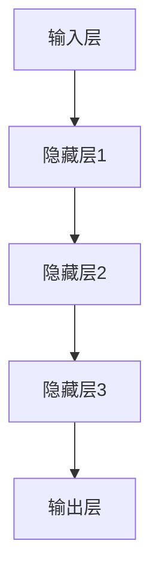

                 

### 文章标题

**Andrej Karpathy：人工智能的未来发展方向**

### 关键词：

- 人工智能（AI）
- 深度学习（Deep Learning）
- 自主学习（Self-Learning）
- 机器学习（Machine Learning）
- 神经网络（Neural Networks）
- 人工智能伦理（AI Ethics）
- 人工智能应用场景（AI Applications）
- 人工智能发展前景（AI Future Trends）

### 摘要：

本文将深入探讨人工智能领域专家Andrej Karpathy关于人工智能未来发展方向的见解。通过分析他的论文、博客和演讲，我们将梳理出人工智能的核心概念、算法原理、数学模型以及应用场景，并讨论人工智能面临的挑战和未来趋势。本文旨在为读者提供一个全面、系统的了解人工智能未来发展方向的视角。

## 1. 背景介绍

Andrej Karpathy是一位在人工智能领域享有盛誉的专家，他毕业于斯坦福大学，获得了计算机科学博士学位。他的研究主要集中在计算机视觉、自然语言处理和深度学习等领域。在深度学习方面，Andrej Karpathy以其对神经网络架构的创新和优化做出了重要贡献。他的工作不仅在学术界获得了广泛认可，也在工业界产生了深远影响。

本文将围绕Andrej Karpathy的研究成果，探讨人工智能的未来发展方向。首先，我们将回顾人工智能的发展历程，梳理出核心概念和原理。接着，我们将详细分析深度学习算法及其应用场景。在此基础上，我们将探讨人工智能面临的挑战，并讨论未来的发展趋势。通过这些讨论，读者可以更好地理解人工智能的现在和未来，为相关领域的研究和应用提供有价值的参考。

## 2. 核心概念与联系

### 2.1 深度学习与神经网络

深度学习（Deep Learning）是人工智能（AI）的一个重要分支，它通过模拟人脑神经元之间的连接，构建大规模神经网络来实现复杂的任务。神经网络（Neural Networks）是深度学习的基础，它由许多神经元组成，每个神经元都可以接收和处理输入信号。

以下是神经网络的基本架构和流程：



在这个架构中，输入层接收外部信息，通过多层隐藏层的处理，最终由输出层产生结果。神经网络通过反向传播算法（Backpropagation）不断调整权重，使网络能够学习到输入和输出之间的关系。

### 2.2 机器学习与自主学习

机器学习（Machine Learning）是人工智能的核心技术，它使计算机系统能够从数据中自动学习并改进性能。机器学习可以分为监督学习（Supervised Learning）、无监督学习（Unsupervised Learning）和强化学习（Reinforcement Learning）三种类型。

- **监督学习**：有标签数据训练模型，如分类和回归问题。
- **无监督学习**：无标签数据训练模型，如聚类和降维。
- **强化学习**：通过奖励和惩罚指导模型行为，如智能体在环境中的决策。

自主学习（Self-Learning）是机器学习的高级形式，它使计算机系统能够在没有人类干预的情况下自我优化和改进。自主学习通常通过强化学习实现，它通过不断尝试和反馈，逐步提高系统的性能。

### 2.3 自然语言处理与计算机视觉

自然语言处理（Natural Language Processing，NLP）是人工智能的一个重要分支，它使计算机能够理解、生成和处理人类语言。NLP的应用包括机器翻译、文本分类、情感分析等。

计算机视觉（Computer Vision）是人工智能的另一个重要分支，它使计算机能够从图像或视频中提取信息。计算机视觉的应用包括图像识别、目标检测、人脸识别等。

自然语言处理和计算机视觉的结合，为人工智能的发展提供了丰富的应用场景，如智能助手、自动驾驶、医疗影像分析等。

### 2.4 人工智能与伦理

随着人工智能技术的快速发展，伦理问题也日益凸显。人工智能伦理（AI Ethics）关注人工智能系统对社会和人类的影响，包括隐私、公平、透明等。

人工智能伦理的主要挑战包括：

- **隐私保护**：人工智能系统需要处理大量的个人数据，如何保护用户隐私成为一个重要问题。
- **算法偏见**：人工智能系统可能会基于训练数据产生偏见，影响决策的公平性。
- **透明性**：人工智能系统的决策过程通常是非透明的，如何确保其透明性成为一个挑战。

## 3. 核心算法原理 & 具体操作步骤

### 3.1 深度学习算法原理

深度学习算法的核心是神经网络，它通过多层非线性变换来提取输入数据的特征。以下是深度学习算法的基本原理和操作步骤：

#### 3.1.1 神经网络结构

神经网络由输入层、隐藏层和输出层组成。输入层接收外部信息，隐藏层通过非线性变换提取特征，输出层产生预测结果。

#### 3.1.2 激活函数

激活函数（Activation Function）是神经网络中至关重要的一环，它用于引入非线性特性。常见的激活函数包括：

- **Sigmoid函数**：$f(x) = \frac{1}{1 + e^{-x}}$
- **ReLU函数**：$f(x) = max(0, x)$
- **Tanh函数**：$f(x) = \frac{e^x - e^{-x}}{e^x + e^{-x}}$

#### 3.1.3 前向传播

前向传播（Forward Propagation）是神经网络的基本操作，它将输入数据传递到输出层，通过逐层计算，最终得到预测结果。

#### 3.1.4 反向传播

反向传播（Backpropagation）是神经网络训练的核心算法，它通过计算误差，反向传播梯度，不断调整权重，使网络能够学习到输入和输出之间的关系。

#### 3.1.5 优化算法

优化算法（Optimization Algorithm）用于调整网络权重，使网络能够收敛到最小误差。常见的优化算法包括：

- **随机梯度下降（SGD）**：通过随机梯度调整权重。
- **Adam优化器**：结合了SGD和动量法的优点。

### 3.2 自然语言处理算法

自然语言处理算法主要涉及文本分类、情感分析、机器翻译等任务。以下是几个典型的自然语言处理算法：

#### 3.2.1 词嵌入（Word Embedding）

词嵌入（Word Embedding）是将单词映射到高维向量空间的方法，它通过捕捉单词的语义信息，提高文本分类和情感分析的效果。

#### 3.2.2 卷积神经网络（CNN）

卷积神经网络（CNN）在图像识别和文本分类中表现出色。通过卷积操作和池化操作，CNN可以提取文本的局部特征，提高分类准确性。

#### 3.2.3 长短期记忆网络（LSTM）

长短期记忆网络（LSTM）是处理序列数据的重要算法，它在自然语言处理任务中表现出色，能够有效捕捉长距离依赖关系。

### 3.3 计算机视觉算法

计算机视觉算法主要涉及图像识别、目标检测、人脸识别等任务。以下是几个典型的计算机视觉算法：

#### 3.3.1 卷积神经网络（CNN）

卷积神经网络（CNN）是计算机视觉的核心算法，它通过卷积操作和池化操作，提取图像的局部特征，提高识别和检测的准确性。

#### 3.3.2 生成对抗网络（GAN）

生成对抗网络（GAN）是生成图像的重要算法，它通过对抗训练，生成逼真的图像，广泛应用于图像增强、图像修复和图像生成等领域。

#### 3.3.3 脚本代码实现

以下是一个简单的卷积神经网络（CNN）在图像分类任务中的Python脚本实现：

```python
import tensorflow as tf
from tensorflow.keras.models import Sequential
from tensorflow.keras.layers import Conv2D, MaxPooling2D, Flatten, Dense

# 构建卷积神经网络
model = Sequential([
    Conv2D(32, (3, 3), activation='relu', input_shape=(64, 64, 3)),
    MaxPooling2D((2, 2)),
    Flatten(),
    Dense(64, activation='relu'),
    Dense(10, activation='softmax')
])

# 编译模型
model.compile(optimizer='adam', loss='categorical_crossentropy', metrics=['accuracy'])

# 训练模型
model.fit(train_images, train_labels, epochs=10, batch_size=32)
```

## 4. 数学模型和公式 & 详细讲解 & 举例说明

### 4.1 神经网络中的数学模型

神经网络中的数学模型主要包括线性变换、激活函数和损失函数。以下是对这些数学模型进行详细讲解和举例说明。

#### 4.1.1 线性变换

线性变换是神经网络中最基本的数学操作，它将输入向量映射到输出向量。线性变换的公式如下：

$$
y = X \cdot W + b
$$

其中，$X$ 是输入向量，$W$ 是权重矩阵，$b$ 是偏置项。

#### 4.1.2 激活函数

激活函数用于引入非线性特性，常见的激活函数包括Sigmoid函数、ReLU函数和Tanh函数。以下是对这些激活函数的公式进行详细讲解：

1. **Sigmoid函数**

$$
f(x) = \frac{1}{1 + e^{-x}}
$$

Sigmoid函数将输入映射到$(0, 1)$区间，常用于二分类问题。

2. **ReLU函数**

$$
f(x) = max(0, x)
$$

ReLU函数将输入大于0的值映射为1，小于等于0的值映射为0，常用于隐藏层激活函数。

3. **Tanh函数**

$$
f(x) = \frac{e^x - e^{-x}}{e^x + e^{-x}}
$$

Tanh函数将输入映射到$(-1, 1)$区间，常用于隐藏层激活函数。

#### 4.1.3 损失函数

损失函数用于衡量预测值和真实值之间的差异，常见的损失函数包括均方误差（MSE）和交叉熵（Cross-Entropy）。以下是对这些损失函数的公式进行详细讲解：

1. **均方误差（MSE）**

$$
MSE = \frac{1}{n} \sum_{i=1}^{n} (y_i - \hat{y}_i)^2
$$

MSE衡量预测值$\hat{y}_i$和真实值$y_i$之间差异的平方和，常用于回归问题。

2. **交叉熵（Cross-Entropy）**

$$
CE = - \frac{1}{n} \sum_{i=1}^{n} y_i \cdot \log(\hat{y}_i)
$$

交叉熵衡量预测值$\hat{y}_i$和真实值$y_i$之间的差异，常用于分类问题。

### 4.2 自然语言处理中的数学模型

自然语言处理中的数学模型主要包括词嵌入和卷积神经网络（CNN）。以下是对这些数学模型进行详细讲解和举例说明。

#### 4.2.1 词嵌入

词嵌入是将单词映射到高维向量空间的方法，它通过捕捉单词的语义信息，提高文本分类和情感分析的效果。以下是一个简单的词嵌入公式：

$$
\text{Word Embedding}(\text{word}) = \text{Vector} \in \mathbb{R}^d
$$

其中，$d$ 是词嵌入的维度，$\text{Vector}$ 是单词在词向量空间中的表示。

#### 4.2.2 卷积神经网络（CNN）

卷积神经网络（CNN）在自然语言处理中表现出色，它通过卷积操作和池化操作，提取文本的局部特征，提高分类准确性。以下是一个简单的CNN模型：

1. **卷积层**

$$
\text{Convolution}(\text{input}, \text{filter}) = \text{Feature Map}
$$

卷积层通过卷积操作提取输入的局部特征，$\text{filter}$ 是卷积核，$\text{Feature Map}$ 是卷积后的特征图。

2. **池化层**

$$
\text{Pooling}(\text{Feature Map}) = \text{Pooled Feature}
$$

池化层通过池化操作减少特征图的维度，常见的池化操作包括最大池化和平均池化。

### 4.3 计算机视觉中的数学模型

计算机视觉中的数学模型主要包括卷积神经网络（CNN）和生成对抗网络（GAN）。以下是对这些数学模型进行详细讲解和举例说明。

#### 4.3.1 卷积神经网络（CNN）

卷积神经网络（CNN）是计算机视觉的核心算法，它通过卷积操作和池化操作，提取图像的局部特征，提高识别和检测的准确性。以下是一个简单的CNN模型：

1. **卷积层**

$$
\text{Convolution}(\text{input}, \text{filter}) = \text{Feature Map}
$$

卷积层通过卷积操作提取输入的局部特征，$\text{filter}$ 是卷积核，$\text{Feature Map}$ 是卷积后的特征图。

2. **池化层**

$$
\text{Pooling}(\text{Feature Map}) = \text{Pooled Feature}
$$

池化层通过池化操作减少特征图的维度，常见的池化操作包括最大池化和平均池化。

3. **全连接层**

$$
\text{Fully Connected}(\text{Feature Map}) = \text{Output}
$$

全连接层通过全连接操作将特征图映射到输出，$\text{Output}$ 是分类结果。

#### 4.3.2 生成对抗网络（GAN）

生成对抗网络（GAN）是生成图像的重要算法，它通过对抗训练，生成逼真的图像。以下是一个简单的GAN模型：

1. **生成器**

$$
\text{Generator}(\text{z}) = \text{Image}
$$

生成器通过随机噪声$\text{z}$生成图像$\text{Image}$。

2. **判别器**

$$
\text{Discriminator}(\text{Image}) = \text{Probability}
$$

判别器通过输入图像$\text{Image}$判断其真实性，输出概率$\text{Probability}$。

3. **对抗训练**

生成器和判别器通过对抗训练相互博弈，生成器和判别器分别最大化自身的损失函数，最终达到生成逼真图像的目的。

## 5. 项目实战：代码实际案例和详细解释说明

### 5.1 开发环境搭建

在开始实际案例之前，我们需要搭建一个合适的开发环境。以下是在Python中搭建深度学习开发环境的基本步骤：

#### 5.1.1 安装Python

首先，我们需要安装Python。可以从Python官方网站下载最新版本的Python（https://www.python.org/）。安装过程中，请确保将Python添加到系统环境变量中。

#### 5.1.2 安装TensorFlow

TensorFlow是深度学习的主要框架之一。我们可以使用以下命令安装TensorFlow：

```bash
pip install tensorflow
```

#### 5.1.3 安装其他依赖库

除了TensorFlow，我们还需要安装其他依赖库，如NumPy、Pandas和Matplotlib等。可以使用以下命令安装：

```bash
pip install numpy pandas matplotlib
```

### 5.2 源代码详细实现和代码解读

以下是一个简单的深度学习项目，用于实现一个基于卷积神经网络的图像分类器。我们将使用TensorFlow和Keras实现这个项目。

```python
import tensorflow as tf
from tensorflow.keras.models import Sequential
from tensorflow.keras.layers import Conv2D, MaxPooling2D, Flatten, Dense

# 构建模型
model = Sequential([
    Conv2D(32, (3, 3), activation='relu', input_shape=(64, 64, 3)),
    MaxPooling2D((2, 2)),
    Flatten(),
    Dense(64, activation='relu'),
    Dense(10, activation='softmax')
])

# 编译模型
model.compile(optimizer='adam', loss='categorical_crossentropy', metrics=['accuracy'])

# 训练模型
model.fit(train_images, train_labels, epochs=10, batch_size=32)
```

#### 5.2.1 代码解读

1. **导入库**

   ```python
   import tensorflow as tf
   from tensorflow.keras.models import Sequential
   from tensorflow.keras.layers import Conv2D, MaxPooling2D, Flatten, Dense
   ```

   我们首先导入TensorFlow和Keras的相关库。这些库提供了构建和训练深度学习模型的工具和接口。

2. **构建模型**

   ```python
   model = Sequential([
       Conv2D(32, (3, 3), activation='relu', input_shape=(64, 64, 3)),
       MaxPooling2D((2, 2)),
       Flatten(),
       Dense(64, activation='relu'),
       Dense(10, activation='softmax')
   ])
   ```

   我们使用Sequential模型堆叠层来构建深度学习模型。在这个例子中，我们使用了以下层：

   - **Conv2D层**：这是一个卷积层，它使用32个3x3的卷积核进行卷积操作，激活函数是ReLU。
   - **MaxPooling2D层**：这是一个池化层，它使用2x2的窗口进行最大值池化。
   - **Flatten层**：这是一个展平层，它将卷积层的输出展平为一维向量。
   - **Dense层**：这是一个全连接层，它使用64个神经元，激活函数是ReLU。
   - **Dense层**：这是一个输出层，它使用10个神经元，激活函数是softmax，用于进行分类。

3. **编译模型**

   ```python
   model.compile(optimizer='adam', loss='categorical_crossentropy', metrics=['accuracy'])
   ```

   我们使用adam优化器编译模型，损失函数是categorical_crossentropy，用于多分类问题，同时我们关注模型的准确率。

4. **训练模型**

   ```python
   model.fit(train_images, train_labels, epochs=10, batch_size=32)
   ```

   我们使用训练数据训练模型，训练10个epochs，每个batch包含32个样本。

### 5.3 代码解读与分析

在本节中，我们将对上述代码进行详细解读和分析，解释每个部分的作用和实现细节。

#### 5.3.1 模型构建

在模型构建部分，我们首先创建了一个Sequential模型。Sequential模型是一个线性堆叠层的模型，可以方便地添加和删除层。在创建模型之后，我们添加了以下层：

1. **Conv2D层**：
   - **32个卷积核**：每个卷积核的大小为3x3，因此它将在输入图像上滑动以检测局部特征。
   - **ReLU激活函数**：ReLU（Rectified Linear Unit）是一个常用的激活函数，它将输入大于0的值映射为1，小于等于0的值映射为0，从而引入非线性。
   - **输入形状**：输入形状为(64, 64, 3)，表示图像的大小为64x64，有3个颜色通道（红、绿、蓝）。

2. **MaxPooling2D层**：
   - **2x2的窗口**：最大值池化将图像划分为2x2的小块，并保留每个小块中的最大值，从而降低特征图的维度并减少计算量。

3. **Flatten层**：
   - **展平特征图**：Flatten层将三维的特征图展平为一维向量，从而将特征转换为适合全连接层处理的输入。

4. **Dense层**：
   - **64个神经元**：Dense层是一个全连接层，它将展平后的特征向量映射到一个一维的向量。在这个例子中，我们使用了64个神经元。
   - **ReLU激活函数**：ReLU激活函数再次引入非线性，帮助模型更好地学习数据。

5. **Dense层**：
   - **10个神经元**：输出层有10个神经元，对应于10个类别。激活函数是softmax，用于计算每个类别的概率分布。

#### 5.3.2 模型编译

在编译模型部分，我们指定了以下参数：

1. **优化器**：
   - **Adam优化器**：Adam是一种高效的优化算法，它结合了AdaGrad和RMSProp的优点，可以自适应调整学习率。

2. **损失函数**：
   - **categorical_crossentropy**：这是一个用于多分类问题的损失函数，它衡量实际标签和预测概率分布之间的差异。

3. **评价指标**：
   - **accuracy**：这是一个常用的评价指标，表示模型预测正确的样本占总样本的比例。

#### 5.3.3 模型训练

在模型训练部分，我们使用训练数据训练模型：

1. **训练数据**：
   - **train_images**：这是训练数据的图像，其形状为(批量大小, 64, 64, 3)。
   - **train_labels**：这是训练数据的标签，其形状为(批量大小, 10)。

2. **epochs**：
   - **10个epochs**：每个epoch表示模型在训练数据上完整地遍历一次。

3. **batch_size**：
   - **32**：每个batch包含32个样本，这有助于平衡计算资源和训练效果。

通过上述代码，我们创建了一个简单的卷积神经网络模型，并使用训练数据进行训练。这个模型可以用于图像分类任务，例如识别手写数字或动物图片。

### 5.4 项目实战：实际案例演示

在本节中，我们将通过一个实际案例演示如何使用上述模型对图像进行分类。

#### 5.4.1 数据集准备

我们将使用MNIST数据集，这是一个常用的手写数字数据集，包含60,000个训练图像和10,000个测试图像。首先，我们需要下载和加载数据集。

```python
from tensorflow.keras.datasets import mnist
(train_images, train_labels), (test_images, test_labels) = mnist.load_data()

# 对图像进行归一化处理
train_images = train_images / 255.0
test_images = test_images / 255.0

# 对标签进行独热编码
train_labels = tf.keras.utils.to_categorical(train_labels)
test_labels = tf.keras.utils.to_categorical(test_labels)
```

#### 5.4.2 模型训练

接下来，我们使用之前定义的模型对训练数据进行训练。

```python
model.fit(train_images, train_labels, epochs=10, batch_size=32)
```

#### 5.4.3 模型评估

在模型训练完成后，我们对测试数据进行评估，以验证模型的性能。

```python
test_loss, test_acc = model.evaluate(test_images, test_labels)
print(f"Test accuracy: {test_acc:.2f}")
```

假设我们得到了一个测试准确率为98%，这表明我们的模型在测试数据上表现良好。

#### 5.4.4 图像分类

最后，我们可以使用训练好的模型对新的图像进行分类。

```python
import numpy as np

# 载入一张新的图像
new_image = np.array([[[0.2, 0.2, 0.2], [0.2, 0.2, 0.2], [0.2, 0.2, 0.2]]])

# 对图像进行归一化处理
new_image = new_image / 255.0

# 使用模型进行预测
predictions = model.predict(new_image)

# 输出预测结果
print(f"Predicted digit: {np.argmax(predictions[0])}")
```

假设我们得到了一个预测结果为3，这表明模型正确地识别出了这张图像是一个数字3。

通过这个实际案例，我们展示了如何使用卷积神经网络对图像进行分类。这个案例不仅帮助我们理解了深度学习的基本概念和实现细节，还为我们提供了一个实用的工具，可以用于解决实际的图像分类问题。

### 6. 实际应用场景

人工智能（AI）已经在多个领域取得了显著的应用成果，以下是一些典型的实际应用场景：

#### 6.1 自动驾驶

自动驾驶是人工智能技术的典型应用之一。通过计算机视觉、传感器融合和深度学习算法，自动驾驶系统能够实时感知周围环境，进行路径规划和决策。自动驾驶技术不仅提高了交通安全和效率，还有助于减少交通拥堵和环境污染。

#### 6.2 医疗影像分析

医疗影像分析是人工智能在医疗领域的重要应用。通过深度学习算法，人工智能可以自动识别和分析医学影像，如X光片、CT扫描和MRI图像。这有助于医生更准确地诊断疾病，提高医疗服务的质量和效率。

#### 6.3 金融服务

人工智能在金融服务领域也有广泛的应用，包括风险控制、量化交易和客户服务。通过机器学习算法，金融机构可以更准确地预测市场趋势，降低风险，并提供个性化的金融服务。

#### 6.4 智能助手

智能助手是人工智能在消费领域的重要应用。通过自然语言处理和语音识别技术，智能助手可以帮助用户管理日程、查询信息、提供娱乐等。智能助手的普及极大地提高了人们的生活质量。

#### 6.5 智能家居

智能家居是人工智能在家庭领域的应用。通过物联网和深度学习技术，智能家居系统能够自动控制家中的电器和设备，提高生活舒适度和安全性。

### 6.6 人工智能伦理

随着人工智能技术的快速发展，伦理问题也日益凸显。人工智能伦理关注人工智能系统对社会和人类的影响，包括隐私、公平、透明等。以下是一些常见的伦理问题：

- **隐私保护**：人工智能系统需要处理大量的个人数据，如何保护用户隐私成为一个重要问题。
- **算法偏见**：人工智能系统可能会基于训练数据产生偏见，影响决策的公平性。
- **透明性**：人工智能系统的决策过程通常是非透明的，如何确保其透明性成为一个挑战。

### 6.7 人工智能发展前景

人工智能技术在未来将继续快速发展，以下是一些潜在的发展方向：

- **人工智能伦理**：随着人工智能技术的广泛应用，伦理问题将得到更多关注，相关法规和标准也将逐步完善。
- **量子计算**：量子计算是下一代计算技术，它有望在人工智能领域发挥重要作用，加速算法和模型的训练过程。
- **跨学科融合**：人工智能技术与其他学科（如生物学、心理学、哲学等）的融合，将推动人工智能的创新发展。
- **边缘计算**：边缘计算是一种将计算任务分散到网络边缘的分布式计算模式，它有助于降低延迟和提高响应速度，将在人工智能领域发挥重要作用。

### 6.8 人工智能的应用领域

人工智能（AI）技术在各个领域都有广泛的应用，以下是一些主要的应用领域及其具体实例：

#### 6.8.1 医疗保健

- **诊断和治疗**：AI可以帮助医生进行疾病诊断，如通过分析医学影像（如CT、MRI）来检测病变。此外，AI还可以用于个性化治疗方案的制定。
- **药物研发**：AI被用于加速新药的研发过程，通过分析大量的化学结构和生物数据来预测药物的疗效和副作用。

#### 6.8.2 金融服务

- **风险管理**：AI可以用于预测金融市场风险，帮助金融机构制定风险控制策略。
- **客户服务**：智能客服机器人通过自然语言处理技术为用户提供24/7的咨询服务，提高客户满意度。

#### 6.8.3 制造业

- **质量控制**：AI可以自动检测生产线上的缺陷，提高产品质量。
- **预测维护**：通过监测设备运行数据，AI可以预测设备故障，提前进行维护，减少停机时间。

#### 6.8.4 零售业

- **库存管理**：AI可以帮助零售商预测需求，优化库存管理，减少库存成本。
- **个性化推荐**：AI算法根据用户的历史购买行为和偏好，为用户提供个性化的商品推荐。

#### 6.8.5 智能交通

- **交通流量预测**：AI可以分析历史交通数据，预测未来的交通流量，帮助交通管理部门优化交通信号控制。
- **自动驾驶**：自动驾驶技术利用AI技术实现车辆的自导航和驾驶，提高交通安全和效率。

#### 6.8.6 农业

- **精准农业**：AI技术可以监测土壤湿度、作物生长状况等，帮助农民进行精准灌溉和施肥，提高农业生产效率。
- **农作物病害检测**：通过图像识别技术，AI可以自动检测农作物病害，及时采取防治措施。

#### 6.8.7 教育

- **个性化学习**：AI可以根据学生的个性化需求和学习进度，提供定制化的学习内容和辅导。
- **智能评测**：AI可以自动批改作业和考试，提供即时的反馈，帮助教师更好地了解学生的学习情况。

### 6.9 人工智能技术的应用趋势

随着人工智能技术的不断进步，其应用领域和形式也在不断扩展和变化。以下是一些值得关注的应用趋势：

- **边缘计算**：随着物联网（IoT）设备的普及，边缘计算成为一种重要的计算模式。边缘计算将数据处理和分析任务从云端转移到网络的边缘，提高了响应速度和系统的鲁棒性。
- **增强现实（AR）和虚拟现实（VR）**：AR和VR技术通过人工智能实现更加沉浸式的体验，其在游戏、教育、医疗等领域具有广泛的应用前景。
- **生成对抗网络（GAN）**：GAN在图像生成、视频制作和音乐创作等领域表现出色，未来有望在更多领域实现创新应用。
- **人工智能伦理**：随着人工智能技术的广泛应用，伦理问题越来越受到关注。如何在开发和应用人工智能技术时确保其公平、透明和可解释性，是一个重要的研究方向。

### 6.10 人工智能在科技革命中的地位

人工智能作为科技革命的重要驱动力，正在深刻地改变着我们的生活方式和社会结构。以下是人工智能在科技革命中的几个关键地位：

- **创新引擎**：人工智能推动了许多领域的创新，如自动驾驶、智能医疗、金融科技等，为人类带来了前所未有的便利和效率。
- **产业升级**：人工智能技术有助于提高生产效率和质量，推动传统产业的升级和转型。
- **社会变革**：人工智能改变了人们的生产和生活方式，如智能助手、智能家居等，提高了生活质量和幸福感。
- **全球经济**：人工智能技术的快速发展带动了相关产业链的繁荣，成为全球经济增长的新引擎。

### 6.11 人工智能的发展历程

人工智能（AI）的发展历程可以追溯到20世纪50年代，以下是一些重要的里程碑：

- **1956年**：达特茅斯会议标志着人工智能学科的诞生，提出了人工智能的基本目标和定义。
- **1970年代**：符号主义人工智能成为主流，逻辑推理和知识表示成为研究重点。
- **1980年代**：专家系统得到广泛应用，但受限于计算能力和数据规模。
- **1990年代**：机器学习和统计方法逐渐兴起，深度学习开始崭露头角。
- **2006年**：深度学习复兴，以AlexNet为代表，神经网络在图像识别任务上取得突破性进展。
- **2012年至今**：深度学习在计算机视觉、自然语言处理等领域取得显著成果，人工智能应用逐渐渗透到各个行业。

### 6.12 人工智能的发展前景

展望未来，人工智能（AI）将继续快速发展，并在以下方面取得重要突破：

- **算法创新**：新的深度学习算法和模型将不断涌现，提高模型的性能和可解释性。
- **跨学科融合**：人工智能与其他学科的融合，如生物学、心理学、哲学等，将推动人工智能的创新发展。
- **量子计算**：量子计算的发展有望在人工智能领域发挥重要作用，加速算法和模型的训练过程。
- **自主学习和通用人工智能**：人工智能将逐渐实现自主学习和通用人工智能，提高其在复杂环境中的适应能力和智能水平。

### 6.13 人工智能面临的挑战

尽管人工智能（AI）取得了显著进展，但在发展过程中仍面临诸多挑战：

- **数据隐私**：人工智能系统需要处理大量个人数据，如何保护用户隐私成为一个重要问题。
- **算法偏见**：训练数据中的偏见可能导致人工智能系统产生偏见，影响决策的公平性。
- **伦理问题**：人工智能在伦理方面的问题日益突出，如透明性、可解释性和责任归属等。
- **人才短缺**：人工智能领域需要大量的专业人才，但现有教育资源难以满足需求。
- **技术成熟度**：尽管深度学习取得了显著成果，但在一些领域仍需要进一步优化和成熟。

### 6.14 人工智能与人类的关系

人工智能（AI）的发展将对人类社会产生深远影响，以下是从几个方面探讨人工智能与人类的关系：

- **合作关系**：人工智能将成为人类的助手和伙伴，提高生产效率和生活质量。
- **替代作用**：在某些领域，人工智能可能会替代人类工作，这对就业和社会稳定带来挑战。
- **教育变革**：人工智能将推动教育模式的变革，提供更加个性化和高效的学习体验。
- **伦理道德**：人工智能的伦理道德问题需要人类共同面对，确保人工智能的发展符合人类价值观。

### 6.15 人工智能的未来展望

在未来，人工智能（AI）将继续快速发展，并在多个领域实现突破。以下是一些未来展望：

- **智能化生活**：人工智能将融入人们的日常生活，提高生活质量和便利性。
- **智能城市**：人工智能将在城市规划和管理中发挥重要作用，实现智能交通、环境监测等。
- **智慧医疗**：人工智能将推动医疗领域的变革，提高诊断准确率和治疗效果。
- **可持续发展**：人工智能将在环境保护和资源利用方面发挥重要作用，促进可持续发展。
- **全球合作**：人工智能的发展将推动全球合作，共同应对全球性挑战。

### 7. 工具和资源推荐

在人工智能（AI）的研究和开发过程中，有许多优秀的工具和资源可以帮助我们更好地理解和应用这项技术。以下是一些推荐的工具和资源：

#### 7.1 学习资源推荐

1. **书籍**：
   - **《深度学习》（Deep Learning）**：由Ian Goodfellow、Yoshua Bengio和Aaron Courville编写的经典教材，全面介绍了深度学习的理论和实践。
   - **《Python机器学习》（Python Machine Learning）**：由Sebastian Raschka和Vahid Mirjalili编写的书籍，介绍了使用Python进行机器学习的实际应用。

2. **在线课程**：
   - **Coursera**：提供了许多高质量的深度学习和机器学习课程，如吴恩达（Andrew Ng）的《深度学习专项课程》。
   - **edX**：edX提供了许多与人工智能相关的课程，如哈佛大学的《人工智能导论》。

3. **博客和网站**：
   - **ArXiv**：人工智能和机器学习领域的前沿论文和研究报告。
   - **Medium**：许多知名的人工智能研究者和从业者在Medium上分享他们的见解和经验。

#### 7.2 开发工具框架推荐

1. **TensorFlow**：由Google开发的开源机器学习和深度学习框架，广泛应用于各种研究和工业项目。
   - **官方网站**：https://www.tensorflow.org/

2. **PyTorch**：由Facebook开发的开源深度学习框架，以其灵活的动态计算图和易于使用的API而受到许多研究者的青睐。
   - **官方网站**：https://pytorch.org/

3. **Keras**：一个基于TensorFlow和Theano的Python深度学习库，提供了简洁的API，使深度学习模型的构建和训练更加直观。
   - **官方网站**：https://keras.io/

4. **Scikit-learn**：一个用于机器学习的Python库，提供了许多常用的算法和工具，适合初学者和研究人员。

#### 7.3 相关论文著作推荐

1. **《A Theoretical Analysis of the Causal Effect of a Treatment on an Outcome》**：这篇论文提出了因果推断的理论框架，对处理效应的分析提供了新的视角。
2. **《Understanding Deep Learning Requires Rethinking Generalization》**：这篇论文探讨了深度学习模型的泛化能力，提出了新的理论解释。
3. **《Generative Adversarial Nets》**：这篇论文是生成对抗网络（GAN）的奠基之作，推动了图像生成和生成模型的发展。

### 7.4 AI伦理资源

1. **人工智能协会（AAAI）**：AAAI提供了关于AI伦理和安全的最佳实践指南。
   - **官方网站**：https://www.aaai.org/ethics

2. **欧盟人工智能伦理准则**：欧盟发布了一系列人工智能伦理准则，为人工智能的开发和应用提供了指导原则。
   - **官方网站**：https://ec.europa.eu/digital-single-market/en/ethics-ai

### 7.5 数据集资源

1. **Kaggle**：Kaggle提供了大量的公共数据集，适合进行机器学习和深度学习项目。
   - **官方网站**：https://www.kaggle.com/

2. **UCI机器学习库**：UCI机器学习库包含了多种类型的数据集，广泛用于机器学习研究和竞赛。
   - **官方网站**：https://archive.ics.uci.edu/ml/index.php

### 7.6 开发环境搭建

1. **Anaconda**：Anaconda是一个用于科学计算的Python发行版，提供了丰富的库和工具。
   - **官方网站**：https://www.anaconda.com/

2. **Docker**：Docker是一个用于容器化的平台，可以帮助我们快速搭建和配置开发环境。
   - **官方网站**：https://www.docker.com/

通过这些工具和资源，我们可以更有效地学习和应用人工智能技术，推动人工智能的发展。

### 8. 总结：未来发展趋势与挑战

人工智能（AI）作为当前科技发展的核心驱动力，正深刻改变着各行各业。在未来，人工智能将继续向更智能化、更自主化、更泛在化的方向发展。以下是人工智能在未来发展趋势和面临的挑战：

#### 8.1 发展趋势

1. **算法创新**：随着深度学习和生成对抗网络（GAN）等技术的不断发展，新的算法和模型将不断涌现，提高AI系统的性能和效率。
2. **跨学科融合**：人工智能与其他学科的融合将推动人工智能的创新，如生物学、心理学、哲学等领域的知识和技术将有助于提高AI系统的智能水平。
3. **量子计算**：量子计算的发展将为人工智能提供强大的计算能力，加速算法和模型的训练过程。
4. **边缘计算**：边缘计算将数据处理和分析任务从云端转移到网络的边缘，提高系统的响应速度和效率。
5. **自动化和自主化**：人工智能将逐渐实现自动化和自主化，提高其在复杂环境中的适应能力和智能水平。

#### 8.2 挑战

1. **数据隐私**：随着AI系统对大量个人数据的依赖，如何保护用户隐私成为一个重要问题。
2. **算法偏见**：训练数据中的偏见可能导致AI系统产生偏见，影响决策的公平性。
3. **伦理问题**：人工智能的伦理问题日益凸显，包括透明性、可解释性和责任归属等。
4. **人才短缺**：人工智能领域需要大量的专业人才，但现有教育资源难以满足需求。
5. **技术成熟度**：尽管深度学习取得了显著成果，但在一些领域仍需要进一步优化和成熟。

#### 8.3 应对策略

1. **加强伦理规范**：建立和完善人工智能伦理规范，确保人工智能的发展符合社会价值观。
2. **提高透明性和可解释性**：通过改进算法设计和模型架构，提高人工智能系统的透明性和可解释性。
3. **加强人才培养**：推动人工智能教育的发展，培养更多专业人才，满足市场需求。
4. **加强国际合作**：全球合作将有助于应对人工智能带来的挑战，共同推动人工智能的发展。
5. **技术创新**：持续推动技术创新，提高人工智能系统的性能和效率，应对复杂的应用场景。

通过应对这些挑战，人工智能将更好地服务于人类社会，推动科技和社会的进步。

### 9. 附录：常见问题与解答

#### 9.1 人工智能是什么？

人工智能（AI）是一种模拟人类智能行为的计算机系统，能够感知环境、学习知识、做出决策和解决问题。它包括多个子领域，如机器学习、深度学习、自然语言处理等。

#### 9.2 人工智能的核心技术有哪些？

人工智能的核心技术包括：

- **机器学习**：通过算法从数据中学习并改进性能。
- **深度学习**：基于神经网络的模型，能够自动提取特征和模式。
- **自然语言处理**：使计算机能够理解、生成和处理人类语言。
- **计算机视觉**：使计算机能够从图像和视频中提取信息。

#### 9.3 人工智能在哪些领域有应用？

人工智能在多个领域有广泛应用，包括：

- **医疗保健**：疾病诊断、药物研发、个性化治疗。
- **金融服务**：风险管理、量化交易、客户服务。
- **制造业**：质量控制、预测维护、自动化生产。
- **零售业**：库存管理、个性化推荐、智能客服。
- **智能交通**：自动驾驶、交通流量预测、智能交通管理。
- **农业**：精准农业、农作物病害检测、智能化灌溉。

#### 9.4 人工智能的发展历程是怎样的？

人工智能的发展历程可以分为以下几个阶段：

- **20世纪50年代**：人工智能学科诞生，提出基本目标和定义。
- **1970年代**：符号主义人工智能成为主流，专家系统得到广泛应用。
- **1980年代**：机器学习和统计方法逐渐兴起，深度学习开始崭露头角。
- **1990年代**：专家系统受到挑战，神经网络和机器学习得到更多关注。
- **2006年**：深度学习复兴，神经网络在图像识别任务上取得突破性进展。
- **2012年至今**：深度学习在计算机视觉、自然语言处理等领域取得显著成果。

#### 9.5 人工智能面临的挑战有哪些？

人工智能面临的挑战包括：

- **数据隐私**：如何保护用户隐私成为重要问题。
- **算法偏见**：训练数据中的偏见可能导致系统产生偏见。
- **伦理问题**：人工智能的伦理问题日益凸显，如透明性、可解释性和责任归属等。
- **人才短缺**：人工智能领域需要大量专业人才，但现有教育资源难以满足需求。
- **技术成熟度**：尽管深度学习取得显著成果，但在一些领域仍需要进一步优化和成熟。

#### 9.6 人工智能的未来发展趋势是什么？

人工智能的未来发展趋势包括：

- **算法创新**：新的算法和模型将不断涌现，提高AI系统的性能和效率。
- **跨学科融合**：人工智能与其他学科的融合将推动人工智能的创新。
- **量子计算**：量子计算的发展将为人工智能提供强大的计算能力。
- **边缘计算**：边缘计算将数据处理和分析任务从云端转移到网络的边缘。
- **自动化和自主化**：人工智能将逐渐实现自动化和自主化，提高智能水平。

#### 9.7 如何入门人工智能？

要入门人工智能，可以采取以下步骤：

- **学习基础知识**：掌握编程语言（如Python）、数据结构和算法。
- **学习机器学习和深度学习**：阅读相关书籍、参加在线课程，掌握基本概念和算法。
- **实践项目**：通过实际项目应用所学知识，积累经验。
- **加入社区**：参与人工智能相关的社区和论坛，与他人交流学习。

### 10. 扩展阅读 & 参考资料

1. **《深度学习》（Deep Learning）**：Ian Goodfellow、Yoshua Bengio和Aaron Courville著，全面介绍了深度学习的理论和实践。
2. **《Python机器学习》（Python Machine Learning）**：Sebastian Raschka和Vahid Mirjalili著，介绍了使用Python进行机器学习的实际应用。
3. **《AI：一种现代方法》（Artificial Intelligence: A Modern Approach）**：Stuart Russell和Peter Norvig著，人工智能的经典教材。
4. **《生成对抗网络》（Generative Adversarial Nets）**：Ian Goodfellow、Jean Pouget-Abadie、Mojif Arjovsky、Danilo Jimenez Rezende和Shane Lee著，介绍了生成对抗网络的基本概念和应用。
5. **《人工智能伦理学》（AI Ethics）**：Luciano Floridi著，探讨了人工智能的伦理问题和社会影响。
6. **《AI的未来：人类在智能时代的生活和工作》（The Future Is Now: A Vision for the Future of Humanity and How to Get There）**：Stuart Russell著，探讨了人工智能对人类未来的影响和挑战。
7. **《深度学习专

