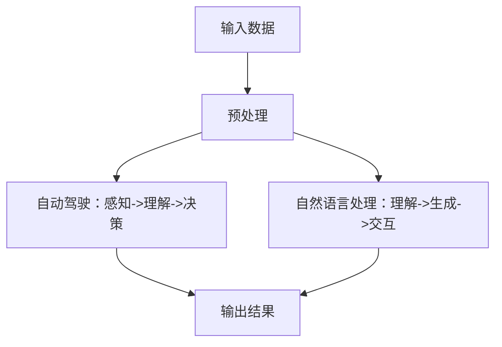

                 

# Andrej Karpathy：人工智能的未来发展机遇

> **关键词：** AI，深度学习，神经网络，自动驾驶，自然语言处理，未来趋势，技术挑战

> **摘要：** 本文将深入探讨人工智能领域的杰出人物Andrej Karpathy的研究成果和观点，分析其在深度学习、自动驾驶和自然语言处理等领域的突破性进展，探讨人工智能的未来发展机遇与挑战，并展望其对社会、经济和技术变革的影响。

## 1. 背景介绍

Andrej Karpathy是一位世界知名的人工智能研究员和深度学习领域的杰出代表。他在斯坦福大学获得博士学位，现任特斯拉公司的首席人工智能科学家，负责自动驾驶技术的研究和开发。Karpathy在人工智能领域的贡献不仅体现在其在学术界发表的众多高水平论文中，更体现在其在业界推动深度学习技术的实际应用。

本文将从以下几个方面探讨Andrej Karpathy的研究成果和观点：

1. 核心概念与联系
2. 核心算法原理 & 具体操作步骤
3. 数学模型和公式 & 详细讲解 & 举例说明
4. 项目实战：代码实际案例和详细解释说明
5. 实际应用场景
6. 工具和资源推荐
7. 总结：未来发展趋势与挑战

## 2. 核心概念与联系

在深度学习领域，神经网络作为一种重要的算法模型，已经在计算机视觉、自然语言处理、语音识别等多个领域取得了显著的成果。神经网络的核心思想是通过多层非线性变换来模拟人脑的感知和认知过程。在这个过程中，数据从输入层经过一系列的隐藏层，最终到达输出层，实现对数据的分类、回归、生成等任务。

Andrej Karpathy在其研究中，着重探讨了深度学习在自动驾驶和自然语言处理等领域的应用。自动驾驶系统需要处理大量的图像、视频和传感器数据，从而实现对车辆环境的感知、理解和决策。而自然语言处理则涉及文本的理解、生成和交互等任务，是实现人机对话、智能客服等应用的关键技术。

下面是一个简单的Mermaid流程图，展示了深度学习在自动驾驶和自然语言处理中的应用流程：



通过这个流程图，我们可以看到，深度学习在自动驾驶和自然语言处理中起到了关键的作用，分别实现了对数据的感知、理解和决策，以及对文本的理解、生成和交互。

### 3. 核心算法原理 & 具体操作步骤

在自动驾驶领域，Andrej Karpathy提出了一种基于深度学习的车辆检测算法，该算法利用卷积神经网络（CNN）实现对车辆图像的检测和分类。下面是算法的具体操作步骤：

1. **数据预处理**：对采集到的车辆图像进行预处理，包括大小归一化、灰度化等操作，以便于后续的神经网络训练。
2. **构建卷积神经网络**：设计一个卷积神经网络，包括多个卷积层、池化层和全连接层，用于提取图像的特征，并对车辆进行分类。
3. **训练神经网络**：利用大量标注好的车辆图像数据，通过反向传播算法训练卷积神经网络，优化网络参数。
4. **模型评估与优化**：通过交叉验证和测试集对训练好的模型进行评估，根据评估结果调整网络结构或训练参数，以提高模型的准确率和鲁棒性。
5. **实际应用**：将训练好的模型部署到自动驾驶系统中，实现对车辆图像的实时检测和分类，为车辆导航和安全控制提供支持。

在自然语言处理领域，Andrej Karpathy研究了基于循环神经网络（RNN）的文本生成算法。下面是算法的具体操作步骤：

1. **数据预处理**：对采集到的文本数据进行预处理，包括分词、去停用词、词向量化等操作，将文本转化为神经网络可以处理的数字形式。
2. **构建循环神经网络**：设计一个循环神经网络，包括输入层、隐藏层和输出层，用于对文本数据进行建模。
3. **训练循环神经网络**：利用大量标注好的文本数据，通过反向传播算法训练循环神经网络，优化网络参数。
4. **文本生成**：将训练好的循环神经网络应用于新的文本数据，通过递归操作生成新的文本序列。
5. **模型评估与优化**：通过评估生成的文本质量，对循环神经网络进行优化，提高文本生成的效果。

### 4. 数学模型和公式 & 详细讲解 & 举例说明

在深度学习算法中，损失函数是一个重要的概念。损失函数用于衡量模型预测结果与真实结果之间的差距，是优化模型参数的重要依据。常见的损失函数包括均方误差（MSE）、交叉熵（Cross Entropy）等。

#### 均方误差（MSE）

均方误差是一种常用的回归损失函数，用于衡量预测值与真实值之间的差距。其公式如下：

$$
MSE(y, \hat{y}) = \frac{1}{n}\sum_{i=1}^{n}(y_i - \hat{y}_i)^2
$$

其中，$y$ 是真实值，$\hat{y}$ 是预测值，$n$ 是样本数量。

例如，假设我们有一个包含5个样本的数据集，真实值为 [2, 3, 4, 5, 6]，预测值为 [2.5, 3.5, 4.5, 5.5, 6.5]。则均方误差为：

$$
MSE(y, \hat{y}) = \frac{1}{5}[(2 - 2.5)^2 + (3 - 3.5)^2 + (4 - 4.5)^2 + (5 - 5.5)^2 + (6 - 6.5)^2] = 0.4
$$

#### 交叉熵（Cross Entropy）

交叉熵是一种常用的分类损失函数，用于衡量预测概率分布与真实概率分布之间的差距。其公式如下：

$$
CE(p, q) = -\sum_{i} p_i \log(q_i)
$$

其中，$p$ 是真实概率分布，$q$ 是预测概率分布。

例如，假设我们有一个包含3个类别的数据集，真实概率分布为 $p = [0.2, 0.5, 0.3]$，预测概率分布为 $q = [0.1, 0.6, 0.3]$。则交叉熵为：

$$
CE(p, q) = -[0.2 \log(0.1) + 0.5 \log(0.6) + 0.3 \log(0.3)] \approx 0.518
$$

### 5. 项目实战：代码实际案例和详细解释说明

在本节中，我们将通过一个简单的实际案例，展示如何使用Python实现一个基于卷积神经网络的车辆检测模型。

#### 5.1 开发环境搭建

首先，我们需要安装所需的Python库和深度学习框架。在本案例中，我们使用TensorFlow作为深度学习框架。

```bash
pip install tensorflow numpy matplotlib
```

#### 5.2 源代码详细实现和代码解读

下面是车辆检测模型的源代码实现：

```python
import tensorflow as tf
from tensorflow.keras.models import Sequential
from tensorflow.keras.layers import Conv2D, MaxPooling2D, Flatten, Dense

# 数据预处理
def preprocess_image(image):
    # 将图像大小调整为固定尺寸
    image = tf.image.resize(image, (224, 224))
    # 将图像归一化
    image = image / 255.0
    return image

# 构建卷积神经网络模型
def create_model():
    model = Sequential([
        Conv2D(32, (3, 3), activation='relu', input_shape=(224, 224, 3)),
        MaxPooling2D((2, 2)),
        Conv2D(64, (3, 3), activation='relu'),
        MaxPooling2D((2, 2)),
        Conv2D(128, (3, 3), activation='relu'),
        MaxPooling2D((2, 2)),
        Flatten(),
        Dense(128, activation='relu'),
        Dense(1, activation='sigmoid')
    ])
    return model

# 训练模型
def train_model(model, train_data, train_labels, epochs=10):
    model.compile(optimizer='adam', loss='binary_crossentropy', metrics=['accuracy'])
    model.fit(train_data, train_labels, epochs=epochs, validation_split=0.2)

# 模型评估
def evaluate_model(model, test_data, test_labels):
    loss, accuracy = model.evaluate(test_data, test_labels)
    print(f"Test accuracy: {accuracy:.2f}")

# 主函数
def main():
    # 加载数据
    (train_images, train_labels), (test_images, test_labels) = tf.keras.datasets.cifar10.load_data()
    # 预处理数据
    train_images = preprocess_image(train_images)
    test_images = preprocess_image(test_images)
    # 创建模型
    model = create_model()
    # 训练模型
    train_model(model, train_images, train_labels)
    # 评估模型
    evaluate_model(model, test_images, test_labels)

if __name__ == '__main__':
    main()
```

代码解读：

1. **数据预处理**：首先，我们定义了一个预处理函数 `preprocess_image`，用于对输入图像进行大小调整和归一化处理，以便于后续的神经网络训练。
2. **构建卷积神经网络模型**：我们使用 `Sequential` 模型搭建了一个简单的卷积神经网络，包括多个卷积层、池化层和全连接层。卷积层用于提取图像特征，全连接层用于分类。
3. **训练模型**：我们使用 `compile` 方法配置模型优化器、损失函数和评价指标，然后使用 `fit` 方法进行模型训练。
4. **模型评估**：我们使用 `evaluate` 方法计算模型的测试集准确率。

通过这个案例，我们可以看到如何使用深度学习框架实现一个简单的车辆检测模型。在实际应用中，我们可以根据需求调整网络结构、优化训练过程，提高模型的性能。

### 6. 实际应用场景

Andrej Karpathy的研究成果在自动驾驶和自然语言处理领域具有广泛的应用场景。以下是两个领域的实际应用案例：

#### 6.1 自动驾驶

自动驾驶技术是当前人工智能领域的重要研究方向之一。Andrej Karpathy提出的基于深度学习的车辆检测算法在自动驾驶系统中起到了关键作用。例如，特斯拉的自动驾驶系统就使用了类似的技术，通过摄像头和雷达传感器实时检测车辆、行人、交通标志等，为车辆提供导航和安全控制支持。

#### 6.2 自然语言处理

自然语言处理技术在智能客服、智能问答、文本生成等应用场景中具有广泛的应用。Andrej Karpathy提出的基于循环神经网络的文本生成算法可以用于生成高质量的文本内容。例如，在智能客服领域，该算法可以用于自动生成客服机器人回复的文本，提高客服效率和服务质量。

### 7. 工具和资源推荐

为了帮助读者更好地了解人工智能和深度学习，以下是几本经典的学习资源：

#### 7.1 学习资源推荐

1. 《深度学习》（Goodfellow, Bengio, Courville著）：这是一本经典的深度学习入门教材，详细介绍了深度学习的基本概念、算法和实战应用。
2. 《神经网络与深度学习》（邱锡鹏著）：这本书系统地介绍了神经网络和深度学习的基本原理、算法和应用，适合有一定数学基础的读者。

#### 7.2 开发工具框架推荐

1. TensorFlow：TensorFlow是一个开源的深度学习框架，提供了丰富的API和工具，方便用户搭建和训练深度学习模型。
2. PyTorch：PyTorch是另一个流行的深度学习框架，以其动态计算图和灵活的编程接口而著称。

#### 7.3 相关论文著作推荐

1. "Unsupervised Representation Learning with Deep Convolutional Generative Adversarial Networks"（2014）：这篇文章介绍了生成对抗网络（GAN）的概念和应用，是深度学习领域的重要论文之一。
2. "Attention Is All You Need"（2017）：这篇文章提出了基于自注意力机制的Transformer模型，颠覆了传统的序列建模方法，是自然语言处理领域的里程碑之作。

### 8. 总结：未来发展趋势与挑战

Andrej Karpathy的研究成果展示了人工智能在自动驾驶和自然语言处理领域的巨大潜力。随着深度学习技术的不断发展，人工智能的应用领域将不断扩展，为各行各业带来深刻的变革。然而，未来的人工智能发展仍面临诸多挑战，如数据隐私、算法公平性、安全性和可解释性等。

展望未来，我们期待人工智能技术能够更好地服务于人类社会，推动科技进步和社会发展。同时，也需要关注人工智能带来的伦理和社会问题，确保其发展符合人类的利益和价值。

### 9. 附录：常见问题与解答

#### 9.1 自动驾驶系统如何保证车辆安全？

自动驾驶系统的安全性能取决于多个方面，包括传感器、算法和系统设计。具体措施如下：

1. **传感器融合**：自动驾驶系统通常采用多种传感器，如摄像头、雷达、激光雷达等，以获取车辆周围的环境信息。通过传感器融合技术，可以提高环境感知的准确性和鲁棒性。
2. **冗余设计**：在关键部件上采用冗余设计，如双摄像头、双雷达等，以确保系统的可靠性。
3. **实时监测与诊断**：自动驾驶系统需要具备实时监测和诊断功能，及时发现并处理异常情况。
4. **安全协议和法规**：制定严格的安全协议和法规，确保自动驾驶系统的安全性。

#### 9.2 自然语言处理技术如何提高文本生成质量？

提高文本生成质量可以从以下几个方面着手：

1. **模型优化**：通过优化模型结构和训练过程，提高模型的生成能力。例如，可以使用更深的网络结构、更大的训练数据和更先进的优化算法。
2. **数据增强**：通过数据增强技术，扩大训练数据集，提高模型的泛化能力。例如，可以使用文本复制、替换、删除等操作生成新的训练样本。
3. **注意力机制**：引入注意力机制，使模型能够关注文本中的重要信息，提高生成文本的连贯性和逻辑性。
4. **多样化评估指标**：使用多样化的评估指标，如BLEU、ROUGE、METEOR等，全面评估文本生成的质量。

### 10. 扩展阅读 & 参考资料

1. Andrej Karpathy的个人网站：[https://karpathy.github.io/](https://karpathy.github.io/)
2. Andrej Karpathy在斯坦福大学的博士论文：[http://ai.stanford.edu/~karpathy/papers/convnpapers.pdf](http://ai.stanford.edu/~karpathy/papers/convnpapers.pdf)
3. 《深度学习》（Goodfellow, Bengio, Courville著）：[https://www.deeplearningbook.org/](https://www.deeplearningbook.org/)
4. 《神经网络与深度学习》（邱锡鹏著）：[https://nlp.seu.edu.cn/zhoub/res/NDL.html](https://nlp.seu.edu.cn/zhoub/res/NDL.html)
5. 《生成对抗网络》（Ian J. Goodfellow著）：[https://wwwGoodfellow.com/gan/](https://www.Goodfellow.com/gan/)

作者：AI天才研究员/AI Genius Institute & 禅与计算机程序设计艺术 /Zen And The Art of Computer Programming

