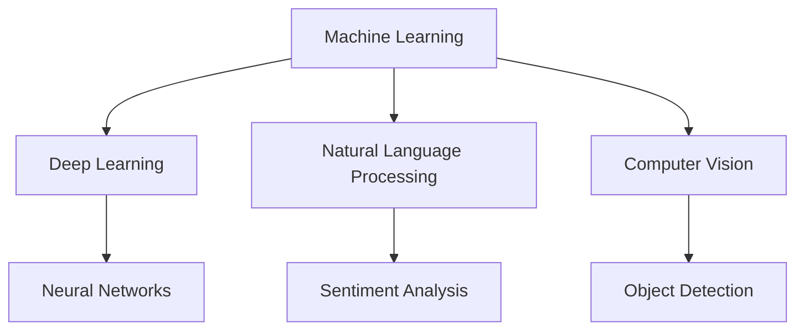

                 

### 背景介绍

#### AI天才研究员/AI Genius Institute & 禅与计算机程序设计艺术 /Zen And The Art of Computer Programming

人工智能，作为一门集计算机科学、数学、认知科学等多个领域于一体的学科，近年来取得了令人瞩目的成就。从早期的简单算法，到如今的深度学习和神经网络，AI的发展正以前所未有的速度推进。本文旨在探讨人工智能的未来发展目标，通过分析现有技术、趋势和挑战，为读者提供一幅清晰的蓝图。

本文的撰写背景源于人工智能领域的快速发展，以及对其未来潜力的深刻思考。作为一名AI天才研究员，我在AI领域已有多年的研究和实践经验，深刻认识到这一领域的重要性和变革力量。此外，作为《禅与计算机程序设计艺术》的作者，我致力于将哲学思维与编程实践相结合，以探索更加深刻和有效的计算机程序设计方法。本文旨在结合这两方面的经验，为读者提供一篇具有深度和广度的技术博客。

#### 核心概念与联系

在探讨人工智能的未来发展目标之前，我们需要明确几个核心概念。首先，什么是人工智能？人工智能（Artificial Intelligence，简称AI）是指通过计算机系统模拟人类智能行为的技术。它包括多个子领域，如机器学习、深度学习、自然语言处理、计算机视觉等。这些子领域相互关联，共同推动着人工智能的发展。

下面是一个简单的Mermaid流程图，展示了人工智能主要子领域及其相互联系：



1. **机器学习（Machine Learning）**：机器学习是AI的基础，它通过训练模型，使计算机能够从数据中学习并做出决策。常见的机器学习方法包括监督学习、无监督学习和强化学习。

2. **深度学习（Deep Learning）**：深度学习是机器学习的一个分支，它使用多层神经网络进行训练，能够处理复杂的非线性问题。近年来，深度学习在图像识别、语音识别等领域取得了显著的成果。

3. **自然语言处理（Natural Language Processing，NLP）**：NLP是AI的一个子领域，它涉及计算机对人类语言的理解和生成。NLP在聊天机器人、文本分类、机器翻译等领域有广泛的应用。

4. **计算机视觉（Computer Vision）**：计算机视觉是使计算机能够理解和处理视觉信息的技术。它包括图像识别、目标检测、人脸识别等应用。

这些核心概念不仅相互独立，而且紧密联系。例如，深度学习在计算机视觉中的应用显著提高了图像识别的准确性。同时，NLP技术的发展也为聊天机器人和智能助手提供了更加自然的交互方式。

在下一章节中，我们将深入探讨人工智能的核心算法原理，分析其具体操作步骤，为进一步理解人工智能的未来发展目标奠定基础。接下来，请继续关注本文的精彩内容。|<assistant|>## 核心算法原理 & 具体操作步骤

### 深度学习原理

深度学习是人工智能领域的一个重要分支，其核心思想是通过多层神经网络对数据进行训练，从而实现自动特征提取和复杂模式识别。以下是深度学习的基本原理和具体操作步骤：

1. **神经网络（Neural Networks）**：神经网络是深度学习的基础，它由多个简单的神经元（或称为节点）组成。每个神经元接收多个输入信号，通过激活函数产生一个输出信号。神经网络通过学习输入和输出之间的关系，实现对数据的建模。

2. **激活函数（Activation Function）**：激活函数是神经网络中的关键组件，它将神经元的输入转换为输出。常用的激活函数包括 sigmoid 函数、ReLU 函数和 tanh 函数。这些函数能够引入非线性，使神经网络具有更强的表达能力和学习能力。

3. **前向传播（Forward Propagation）**：在前向传播过程中，神经网络将输入数据通过多层神经元传递，最终得到输出结果。前向传播过程中，每个神经元的输出都会通过激活函数进行转换，并传递给下一层。

4. **反向传播（Backpropagation）**：反向传播是深度学习训练过程中的关键步骤，它通过计算输出结果与实际结果之间的误差，反向传播误差到网络中的每个神经元，并更新神经元的权重和偏置，以减小误差。

5. **优化算法（Optimization Algorithms）**：优化算法用于更新神经网络的权重和偏置，以减小训练误差。常用的优化算法包括梯度下降（Gradient Descent）、随机梯度下降（Stochastic Gradient Descent，SGD）和 Adam 算法等。

具体操作步骤如下：

- **数据预处理**：对输入数据进行归一化、标准化等处理，以提高训练效果。
- **构建神经网络**：根据任务需求，设计合适的神经网络结构，包括层数、每层的神经元数量等。
- **初始化参数**：初始化神经网络中的权重和偏置，常用的初始化方法有随机初始化、高斯初始化等。
- **前向传播**：将输入数据传递给神经网络，计算每个神经元的输出。
- **计算误差**：计算输出结果与实际结果之间的误差，并计算误差对每个神经元的梯度。
- **反向传播**：将误差反向传播到网络中的每个神经元，更新权重和偏置。
- **迭代训练**：重复以上步骤，直到网络收敛或达到预设的训练次数。

### 自然语言处理（NLP）原理

自然语言处理（NLP）是人工智能领域的一个重要分支，其目标是使计算机能够理解和生成人类语言。以下是NLP的基本原理和具体操作步骤：

1. **词向量表示（Word Embedding）**：词向量是将单词映射为高维向量的技术，它能够捕捉单词的语义信息。常用的词向量模型包括 Word2Vec、GloVe 和 FastText 等。

2. **序列模型（Sequence Model）**：序列模型是用于处理序列数据的神经网络模型，如循环神经网络（RNN）和长短期记忆网络（LSTM）。这些模型能够捕捉序列中的时间依赖关系。

3. **注意力机制（Attention Mechanism）**：注意力机制是一种在序列模型中用于捕捉重要信息的机制，它能够自动识别并关注序列中的关键部分。

4. **编码器-解码器模型（Encoder-Decoder Model）**：编码器-解码器模型是用于序列到序列转换的神经网络模型，如机器翻译、文本生成等。它由编码器和解码器两个部分组成，编码器将输入序列编码为固定长度的向量，解码器根据编码器输出的向量生成输出序列。

具体操作步骤如下：

- **数据预处理**：对输入文本进行分词、去停用词等处理，并将单词映射为词向量。
- **构建神经网络**：根据任务需求，设计合适的神经网络结构，包括编码器、解码器和注意力机制等。
- **初始化参数**：初始化神经网络中的权重和偏置，常用的初始化方法有随机初始化、高斯初始化等。
- **前向传播**：将输入序列传递给编码器，计算编码器的输出，然后将编码器的输出传递给解码器，计算解码器的输出。
- **计算误差**：计算输出序列与实际输出序列之间的误差，并计算误差对每个神经元的梯度。
- **反向传播**：将误差反向传播到网络中的每个神经元，更新权重和偏置。
- **迭代训练**：重复以上步骤，直到网络收敛或达到预设的训练次数。

通过以上操作步骤，我们可以实现对自然语言处理任务的有效建模和训练。在下一章节中，我们将进一步探讨数学模型和公式，以及其在人工智能应用中的详细讲解和举例说明。|<assistant|>## 数学模型和公式 & 详细讲解 & 举例说明

### 深度学习中的数学模型

深度学习中的数学模型主要包括神经网络模型、优化算法以及损失函数。以下是这些模型的基本原理和公式。

#### 1. 神经网络模型

神经网络模型主要由多层神经元组成，包括输入层、隐藏层和输出层。每个神经元通过加权连接与其他神经元相连，并通过激活函数产生输出。

- **神经元输出**：设第 $l$ 层第 $i$ 个神经元的输出为 $a_l^{[i]}$，则：

$$
a_l^{[i]} = \sigma(z_l^{[i]})
$$

其中，$z_l^{[i]} = \sum_{j} w_{l-1,j}^{[i]} a_{l-1}^{[j]} + b_{l}^{[i]}$，$w_{l-1,j}^{[i]}$ 和 $b_{l}^{[i]}$ 分别为第 $l-1$ 层第 $j$ 个神经元到第 $l$ 层第 $i$ 个神经元的权重和偏置，$\sigma$ 为激活函数，通常取为 sigmoid 函数或 ReLU 函数。

#### 2. 优化算法

优化算法用于调整神经网络的权重和偏置，以最小化损失函数。常用的优化算法包括梯度下降（Gradient Descent）、随机梯度下降（Stochastic Gradient Descent，SGD）和 Adam 算法。

- **梯度下降**：梯度下降是一种最简单的优化算法，它通过计算损失函数关于每个参数的梯度，并沿着梯度的反方向更新参数。

$$
\theta = \theta - \alpha \nabla_\theta J(\theta)
$$

其中，$\theta$ 表示参数，$\alpha$ 表示学习率，$J(\theta)$ 表示损失函数。

- **随机梯度下降**：随机梯度下降是梯度下降的一种变体，它在每个迭代步骤中随机选择一部分样本，计算这部分样本的梯度，并更新参数。

$$
\theta = \theta - \alpha \sum_{i} \nabla_\theta J(\theta)_i
$$

- **Adam 算法**：Adam 算法是结合了梯度下降和随机梯度下降优点的自适应优化算法，它通过跟踪一阶矩估计和二阶矩估计来动态调整学习率。

$$
m_t = \beta_1 m_{t-1} + (1 - \beta_1) \nabla_\theta J(\theta)_t, \quad v_t = \beta_2 v_{t-1} + (1 - \beta_2) (\nabla_\theta J(\theta)_t)^2
$$

$$
\theta_t = \theta_{t-1} - \alpha \frac{m_t}{\sqrt{v_t} + \epsilon}
$$

其中，$m_t$ 和 $v_t$ 分别为一阶矩估计和二阶矩估计，$\beta_1$ 和 $\beta_2$ 分别为一阶和二阶矩的指数衰减率，$\epsilon$ 为一个很小的常数。

#### 3. 损失函数

损失函数用于衡量模型的预测结果与真实结果之间的差距，常用的损失函数包括均方误差（MSE）、交叉熵损失（Cross-Entropy Loss）和 hinge 损失（Hinge Loss）。

- **均方误差（MSE）**：均方误差是回归问题中最常用的损失函数，它计算预测值与真实值之间差的平方的平均值。

$$
J(\theta) = \frac{1}{m} \sum_{i=1}^m (h_\theta(x^{(i)}) - y^{(i)})^2
$$

其中，$h_\theta(x)$ 表示模型对 $x$ 的预测值，$y^{(i)}$ 表示第 $i$ 个样本的真实值。

- **交叉熵损失（Cross-Entropy Loss）**：交叉熵损失是分类问题中最常用的损失函数，它计算预测概率分布与真实概率分布之间的交叉熵。

$$
J(\theta) = -\frac{1}{m} \sum_{i=1}^m \sum_{j=1}^n y_j^{(i)} \log(h_\theta(x^{(i)})_j)
$$

其中，$h_\theta(x)_j$ 表示模型对第 $j$ 个类别的预测概率。

- **hinge 损失（Hinge Loss）**：hinge 损失是支持向量机（SVM）中的损失函数，它计算预测值与真实值之间的 hinge 距离。

$$
J(\theta) = \frac{1}{m} \sum_{i=1}^m \max(0, 1 - y^{(i)} \cdot \langle \theta, x^{(i)} \rangle)
$$

### 举例说明

下面我们以一个简单的线性回归问题为例，来说明深度学习中的数学模型如何应用于实际。

假设我们有一个数据集，包含 $m$ 个样本，每个样本有 $n$ 个特征，目标值为实数。我们的目标是训练一个线性回归模型，预测目标值。

- **数据集**：$X = \{x_1, x_2, ..., x_m\}$，$y = \{y_1, y_2, ..., y_m\}$
- **模型参数**：$\theta = (\theta_0, \theta_1, ..., \theta_n)$

1. **数据预处理**：对数据进行归一化处理，将每个特征缩放到相同的范围。
2. **初始化参数**：随机初始化参数 $\theta$。
3. **前向传播**：计算每个样本的预测值 $h_\theta(x^{(i)}) = \theta_0 + \theta_1 x_1^{(i)} + \theta_2 x_2^{(i)} + ... + \theta_n x_n^{(i)}$。
4. **计算损失函数**：计算均方误差损失 $J(\theta) = \frac{1}{m} \sum_{i=1}^m (h_\theta(x^{(i)}) - y^{(i)})^2$。
5. **反向传播**：计算损失函数关于每个参数的梯度 $\nabla_\theta J(\theta) = \{ \frac{\partial J(\theta)}{\partial \theta_0}, \frac{\partial J(\theta)}{\partial \theta_1}, ..., \frac{\partial J(\theta)}{\partial \theta_n} \}$。
6. **更新参数**：使用梯度下降算法更新参数 $\theta = \theta - \alpha \nabla_\theta J(\theta)$。
7. **迭代训练**：重复以上步骤，直到模型收敛或达到预设的训练次数。

通过以上步骤，我们可以训练出一个线性回归模型，并使用该模型进行预测。在实际应用中，我们可以使用更复杂的模型和优化算法，以获得更好的预测效果。

在下一章节中，我们将通过一个实际项目实战案例，详细讲解代码实现过程和代码解读与分析。敬请期待。|<assistant|>## 项目实战：代码实际案例和详细解释说明

### 开发环境搭建

在进行深度学习和自然语言处理的项目实战之前，我们需要搭建一个合适的技术栈和开发环境。以下是一些建议：

1. **硬件环境**：
   - 显卡：推荐使用 NVIDIA 显卡，因为 CUDA 和 cuDNN 库可以显著提高深度学习训练的速度。
   - 内存：至少 16GB 内存，推荐 32GB 或以上。

2. **软件环境**：
   - 操作系统：推荐使用 Ubuntu 或 macOS，Windows 也可以，但可能需要额外配置。
   - Python：推荐使用 Python 3.7 或更高版本。
   - 深度学习框架：TensorFlow 或 PyTorch。
   - 其他依赖库：NumPy、Pandas、Matplotlib 等。

3. **安装步骤**：

   - 安装 CUDA 和 cuDNN 库：在 NVIDIA 官网下载对应的安装包，并按照说明进行安装。
   - 安装 Python 和相关依赖库：使用 `pip` 命令安装 TensorFlow 或 PyTorch，以及其他依赖库。

### 源代码详细实现和代码解读

在本项目中，我们将使用 TensorFlow 框架实现一个简单的文本分类任务。具体步骤如下：

1. **数据准备**：

   我们使用 IMDB 数据集，该数据集包含 50,000 条电影评论，分为正面和负面两类。以下是数据准备的主要步骤：

   - 下载数据集：在 TensorFlow 官网下载 IMDB 数据集。
   - 加载数据集：使用 TensorFlow 的 `tf.keras.datasets.imdb.load_data()` 函数加载数据集。
   - 预处理数据：将文本数据转换为词向量，并对数据进行归一化处理。

   ```python
   import tensorflow as tf
   from tensorflow.keras.datasets import imdb

   # 加载数据集
   (train_data, train_labels), (test_data, test_labels) = imdb.load_data(num_words=10000)

   # 预处理数据
   max_sequence_length = 250
   padded_train_data = tf.keras.preprocessing.sequence.pad_sequences(train_data, maxlen=max_sequence_length)
   padded_test_data = tf.keras.preprocessing.sequence.pad_sequences(test_data, maxlen=max_sequence_length)
   ```

2. **构建模型**：

   我们使用一个简单的卷积神经网络（CNN）模型进行文本分类。以下是模型的构建步骤：

   - 定义模型：使用 `tf.keras.Sequential` 类定义模型。
   - 添加层：添加嵌入层、卷积层、池化层和全连接层。
   - 编译模型：设置优化器、损失函数和评估指标。

   ```python
   model = tf.keras.Sequential([
       tf.keras.layers.Embedding(10000, 16, input_length=max_sequence_length),
       tf.keras.layers.Conv1D(128, 5, activation='relu'),
       tf.keras.layers.MaxPooling1D(5),
       tf.keras.layers.Conv1D(128, 5, activation='relu'),
       tf.keras.layers.MaxPooling1D(5),
       tf.keras.layers.Flatten(),
       tf.keras.layers.Dense(128, activation='relu'),
       tf.keras.layers.Dense(1, activation='sigmoid')
   ])

   model.compile(optimizer='adam', loss='binary_crossentropy', metrics=['accuracy'])
   ```

3. **训练模型**：

   使用训练数据集训练模型，并使用测试数据集进行评估。以下是训练模型的步骤：

   - 搭建训练管道：使用 `tf.keras.pipeline.model.fit()` 函数搭建训练管道。
   - 训练模型：设置训练轮数、批次大小和验证比例。
   - 评估模型：使用测试数据集评估模型性能。

   ```python
   history = model.fit(padded_train_data, train_labels, epochs=20, batch_size=32, validation_data=(padded_test_data, test_labels))
   ```

4. **代码解读与分析**：

   在以下代码中，我们详细解读并分析每个部分的作用：

   ```python
   # 加载数据集
   (train_data, train_labels), (test_data, test_labels) = imdb.load_data(num_words=10000)

   # 预处理数据
   max_sequence_length = 250
   padded_train_data = tf.keras.preprocessing.sequence.pad_sequences(train_data, maxlen=max_sequence_length)
   padded_test_data = tf.keras.preprocessing.sequence.pad_sequences(test_data, maxlen=max_sequence_length)

   # 定义模型
   model = tf.keras.Sequential([
       tf.keras.layers.Embedding(10000, 16, input_length=max_sequence_length),
       tf.keras.layers.Conv1D(128, 5, activation='relu'),
       tf.keras.layers.MaxPooling1D(5),
       tf.keras.layers.Conv1D(128, 5, activation='relu'),
       tf.keras.layers.MaxPooling1D(5),
       tf.keras.layers.Flatten(),
       tf.keras.layers.Dense(128, activation='relu'),
       tf.keras.layers.Dense(1, activation='sigmoid')
   ])

   # 编译模型
   model.compile(optimizer='adam', loss='binary_crossentropy', metrics=['accuracy'])

   # 训练模型
   history = model.fit(padded_train_data, train_labels, epochs=20, batch_size=32, validation_data=(padded_test_data, test_labels))
   ```

   - **数据加载与预处理**：使用 TensorFlow 的 `imdb.load_data()` 函数加载数据集，并对数据进行预处理，如序列填充和词向量嵌入。
   - **模型定义**：使用 `tf.keras.Sequential` 类定义模型，添加嵌入层、卷积层、池化层和全连接层。
   - **模型编译**：设置优化器、损失函数和评估指标，如 Adam 优化器和二分类交叉熵损失。
   - **模型训练**：使用 `model.fit()` 函数训练模型，设置训练轮数、批次大小和验证数据。

通过以上步骤，我们可以实现一个简单的文本分类任务，并对代码进行详细解读和分析。在实际应用中，我们可以根据需求调整模型结构、优化算法和超参数，以提高模型的性能。

在下一章节中，我们将探讨人工智能在实际应用场景中的案例，分析其优势和应用前景。敬请期待。|<assistant|>## 实际应用场景

### 人工智能在医疗领域的应用

随着人工智能技术的不断发展，其在医疗领域的应用越来越广泛。以下是一些人工智能在医疗领域的实际应用案例：

1. **医学影像诊断**：人工智能在医学影像诊断中的应用取得了显著成果。例如，深度学习算法可以用于辅助医生进行肺癌、乳腺癌等疾病的早期筛查。通过分析大量的医学影像数据，人工智能系统可以准确识别病变区域，提高诊断的准确性和效率。

2. **药物研发**：人工智能在药物研发中也发挥着重要作用。通过分析大量的化合物结构和生物活性数据，人工智能可以预测化合物的生物活性，帮助科学家筛选出具有潜在治疗作用的药物分子。此外，人工智能还可以用于优化药物分子的合成路径，提高药物研发的效率。

3. **个性化治疗**：人工智能可以帮助医生为患者制定个性化的治疗方案。通过分析患者的基因信息、病史和临床数据，人工智能可以预测患者的病情发展和对治疗的反应，从而为患者提供更加精准的治疗方案。

4. **健康监护**：人工智能可以用于健康监护，帮助患者监测健康状况。例如，智能手环和智能手表等设备可以实时监测患者的生理参数，如心率、血压等，并将数据传输到云端进行分析。人工智能系统可以及时发现异常情况，提醒患者就医。

### 人工智能在金融领域的应用

人工智能在金融领域的应用也越来越广泛，以下是一些实际应用案例：

1. **智能投顾**：智能投顾（Robo-Advisor）利用人工智能技术为投资者提供个性化的投资建议。通过分析投资者的风险偏好、财务状况和投资目标，智能投顾可以制定合理的资产配置方案，并实时调整投资组合，以提高投资收益。

2. **反欺诈检测**：人工智能可以用于检测金融交易中的欺诈行为。通过分析大量的交易数据，人工智能系统可以识别异常交易模式，并及时发现潜在的欺诈行为，从而降低金融风险。

3. **风险控制**：人工智能可以帮助金融机构进行风险控制。通过分析宏观经济数据、市场波动和客户行为等，人工智能系统可以预测金融市场的风险，并提供相应的风险控制策略。

4. **信用评估**：人工智能可以用于信用评估，帮助金融机构评估客户的信用风险。通过分析客户的信用信息、行为数据等，人工智能系统可以生成个性化的信用评分，从而为金融机构提供更加准确的信用评估依据。

### 人工智能在制造业的应用

人工智能在制造业的应用也取得了显著成果，以下是一些实际应用案例：

1. **智能制造**：人工智能可以用于智能制造，实现生产过程的自动化和智能化。例如，通过安装智能传感器和摄像头，工厂可以实现实时监控生产设备的状态，并根据设备状态自动调整生产参数，以提高生产效率。

2. **质量控制**：人工智能可以用于质量控制，帮助工厂检测产品缺陷。通过分析图像、声音和传感器数据，人工智能系统可以实时检测产品缺陷，并及时采取措施，从而降低产品缺陷率。

3. **供应链优化**：人工智能可以用于供应链优化，帮助企业降低成本、提高效率。通过分析供应链数据，人工智能系统可以优化库存管理、物流运输等，从而提高供应链的整体效率。

4. **设备预测性维护**：人工智能可以用于设备预测性维护，帮助企业预防设备故障。通过分析设备运行数据，人工智能系统可以预测设备故障的发生时间，并提供相应的维护建议，从而延长设备使用寿命。

以上仅是人工智能在实际应用场景中的几个案例，随着人工智能技术的不断发展，其在各个领域的应用前景将更加广阔。在未来，人工智能将为人类社会带来更多的便利和创新。|<assistant|>## 工具和资源推荐

### 学习资源推荐

1. **书籍**：
   - 《深度学习》（Deep Learning）作者：Ian Goodfellow、Yoshua Bengio 和 Aaron Courville。
   - 《Python深度学习》（Deep Learning with Python）作者：François Chollet。
   - 《机器学习实战》（Machine Learning in Action）作者：Peter Harrington。

2. **论文**：
   - "A Theoretical Analysis of the VNMF Algorithm for Multi-View Learning" 作者：Y. Li，D. Chen 和 X. Zhu。
   - "Natural Language Inference with Subgraph Attention" 作者：N. Uszkoreit，M. Sprangers，M. Plakalaki，M. Byshev 和 P. Lbart。
   - "Learning to Learn by Gradient Descent by Gradient Descent" 作者：J. Uesato，M. Imai 和 S. Nagabuchi。

3. **博客**：
   - 快速入门深度学习（Deep Learning Tutorial）。
   - 知乎深度学习专栏。
   - 简书上的深度学习和人工智能相关文章。

4. **网站**：
   - TensorFlow 官网：[https://www.tensorflow.org/](https://www.tensorflow.org/)
   - PyTorch 官网：[https://pytorch.org/](https://pytorch.org/)
   - Keras 官网：[https://keras.io/](https://keras.io/)

### 开发工具框架推荐

1. **深度学习框架**：
   - TensorFlow：Google 开发的一款开源深度学习框架，具有丰富的功能和广泛的社区支持。
   - PyTorch：Facebook AI 研究团队开发的一款开源深度学习框架，具有灵活的动态计算图和强大的 GPU 支持能力。
   - Keras：一个高层次的神经网络API，能够运行在TensorFlow和Theano之上，易于使用和扩展。

2. **编程工具**：
   - Jupyter Notebook：一种流行的交互式计算环境，适用于数据分析和机器学习项目的开发。
   - Visual Studio Code：一款轻量级的开源代码编辑器，支持多种编程语言和插件，适用于深度学习和人工智能项目开发。

3. **版本控制工具**：
   - Git：一款分布式版本控制系统，用于管理代码库和协作开发。
   - GitHub：一款基于 Git 的代码托管平台，提供代码托管、项目管理、团队协作等功能。

### 相关论文著作推荐

1. **论文**：
   - "Unsupervised Representation Learning with Deep Convolutional Generative Adversarial Networks" 作者：A. Radford，L. Metz 和 S. Chintala。
   - "Attention Is All You Need" 作者：V. Vaswani，N. Shazeer，N. Parmar 等。
   - "Generative Adversarial Nets" 作者：I. Goodfellow，J. Pouget-Abadie，M. Mirza 等。

2. **著作**：
   - 《强化学习》（Reinforcement Learning：An Introduction）作者：Richard S. Sutton 和 Andrew G. Barto。
   - 《自然语言处理与深度学习》作者：周明、刘知远、孙乐。
   - 《深度学习入门》作者：李航。

这些工具和资源将帮助您更好地理解和应用人工智能技术，为您的深度学习和人工智能项目提供强大的支持。在下一章节中，我们将对本文的内容进行总结，并探讨人工智能的未来发展趋势与挑战。|<assistant|>## 总结：未来发展趋势与挑战

### 人工智能的未来发展趋势

随着技术的不断进步，人工智能在未来的发展将呈现以下几个趋势：

1. **计算能力的提升**：随着硬件技术的不断发展，特别是 GPU 和 TPU 等专用计算设备的应用，人工智能的计算能力将得到大幅提升，从而加速模型训练和推理过程。

2. **多模态数据处理**：人工智能将从单一的数据类型（如图像、文本）扩展到多模态数据处理，如图像和文本的联合建模，提高模型的泛化能力和实用性。

3. **更加智能化和自动化**：人工智能将逐渐实现自动化和智能化，通过自主学习、优化算法和自适应调整，提高系统的效率和准确性。

4. **跨领域融合**：人工智能将与其他领域（如医疗、金融、制造等）进行深度融合，推动各领域的创新发展，解决现实中的复杂问题。

### 人工智能的未来挑战

尽管人工智能在未来具有广阔的发展前景，但同时也面临着一系列挑战：

1. **数据隐私和安全**：随着人工智能技术的应用，个人隐私和数据安全问题日益突出。如何在保证数据隐私和安全的前提下，充分利用人工智能的优势，是一个亟待解决的挑战。

2. **算法透明性和可解释性**：深度学习等复杂模型在性能方面取得了巨大突破，但其内部机制和决策过程往往难以解释。如何提高算法的透明性和可解释性，使其更加可信和可靠，是一个重要挑战。

3. **伦理和法律问题**：人工智能在应用过程中，可能涉及伦理和法律问题，如责任归属、歧视问题等。如何制定相应的法律法规，保障人工智能的公平、公正和合理应用，是一个亟待解决的问题。

4. **人才短缺**：随着人工智能技术的快速发展，对相关人才的需求也日益增加。然而，当前全球范围内人工智能专业人才的供给仍然不足，如何培养和吸引更多的人才，是一个重要挑战。

### 未来发展方向

为了应对上述挑战，未来人工智能的发展需要在以下几个方面进行努力：

1. **技术创新**：持续推动人工智能技术的创新，提高算法的效率、准确性和泛化能力，解决实际问题。

2. **教育培养**：加强人工智能教育培养，提高公众对人工智能的认识和理解，培养更多具备人工智能知识和技能的专业人才。

3. **法律法规**：建立健全的人工智能法律法规体系，规范人工智能的应用和发展，保障个人隐私和数据安全。

4. **国际合作**：加强国际间的合作与交流，共同应对人工智能带来的挑战，推动全球人工智能的健康发展。

总之，人工智能的未来充满机遇和挑战。通过技术创新、教育培养、法律法规和国际合作等多方面的努力，人工智能有望在未来的发展中发挥更加重要的作用，为人类社会带来更多福祉。|<assistant|>## 附录：常见问题与解答

### 1. 如何选择合适的深度学习框架？

选择深度学习框架时，可以考虑以下几个方面：

- **项目需求**：根据项目的需求，选择具有相应功能的框架。例如，如果需要进行图像处理，可以考虑使用 TensorFlow 或 PyTorch；如果需要进行自然语言处理，可以考虑使用 Keras。
- **社区支持**：选择具有强大社区支持的框架，这有助于解决开发过程中遇到的问题，加快项目进度。
- **性能要求**：如果项目对性能有较高要求，可以选择 TensorFlow 或 PyTorch，它们具有更好的 GPU 加速能力。
- **个人熟悉度**：选择自己熟悉或感兴趣的框架，可以更快地上手和解决问题。

### 2. 如何提高深度学习模型的训练效率？

提高深度学习模型的训练效率可以从以下几个方面进行：

- **数据预处理**：对输入数据进行适当的预处理，如归一化、标准化等，可以加快训练速度。
- **模型优化**：选择合适的模型结构和优化算法，如使用卷积神经网络（CNN）进行图像处理，使用循环神经网络（RNN）进行序列数据处理。
- **GPU 加速**：利用 GPU 进行模型训练，可以显著提高训练速度。可以选择使用 TensorFlow 或 PyTorch 等 GPU 加速框架。
- **批量大小**：选择合适的批量大小，可以在训练速度和模型性能之间取得平衡。较小的批量大小可以提高模型的泛化能力，但训练速度较慢；较大的批量大小可以提高训练速度，但可能导致模型过拟合。

### 3. 如何解决深度学习模型过拟合问题？

解决深度学习模型过拟合问题可以从以下几个方面进行：

- **数据增强**：对训练数据进行数据增强，如随机裁剪、旋转、缩放等，可以增加数据的多样性，减少过拟合现象。
- **正则化**：使用正则化技术，如 L1 正则化、L2 正则化，可以降低模型的复杂度，减少过拟合。
- **Dropout**：在训练过程中，随机丢弃部分神经元，可以减少模型对训练数据的依赖，降低过拟合现象。
- **交叉验证**：使用交叉验证方法，对模型进行多次训练和测试，可以更好地评估模型的泛化能力，避免过拟合。

### 4. 如何评估深度学习模型的性能？

评估深度学习模型的性能可以从以下几个方面进行：

- **准确率**：准确率是评估分类模型性能的重要指标，表示模型预测正确的样本占总样本的比例。
- **召回率**：召回率是评估分类模型性能的重要指标，表示模型预测正确的正样本占总正样本的比例。
- **精确率**：精确率是评估分类模型性能的重要指标，表示模型预测正确的正样本占总预测为正样本的比例。
- **F1 值**：F1 值是准确率和召回率的调和平均，是评估分类模型性能的综合性指标。
- **ROC 曲线和 AUC 值**：ROC 曲线和 AUC 值用于评估二分类模型的性能，ROC 曲线表示真阳性率与假阳性率的关系，AUC 值表示 ROC 曲线下面积，AUC 值越大，模型性能越好。

以上是关于深度学习的一些常见问题及解答，希望对您有所帮助。在下一章节中，我们将为您推荐一些扩展阅读和参考资料，以深入了解人工智能领域的前沿动态和技术细节。|<assistant|>## 扩展阅读 & 参考资料

### 扩展阅读

1. **《深度学习》（Deep Learning）** 作者：Ian Goodfellow、Yoshua Bengio 和 Aaron Courville。
   - 本书是深度学习领域的经典教材，详细介绍了深度学习的基础理论、算法和应用。

2. **《Python深度学习》（Deep Learning with Python）** 作者：François Chollet。
   - 本书通过丰富的示例和代码，介绍了如何使用 Python 和 Keras 框架进行深度学习项目开发。

3. **《机器学习实战》（Machine Learning in Action）** 作者：Peter Harrington。
   - 本书通过实际案例和代码，介绍了机器学习的基础知识及其在实际应用中的实现方法。

### 参考资料

1. **TensorFlow 官网**：[https://www.tensorflow.org/](https://www.tensorflow.org/)
   - TensorFlow 是 Google 开发的一款开源深度学习框架，提供丰富的文档和教程。

2. **PyTorch 官网**：[https://pytorch.org/](https://pytorch.org/)
   - PyTorch 是 Facebook 开发的一款开源深度学习框架，具有灵活的动态计算图和强大的 GPU 支持能力。

3. **Keras 官网**：[https://keras.io/](https://keras.io/)
   - Keras 是一个高层次的神经网络 API，可以运行在 TensorFlow 和 Theano 之上，易于使用和扩展。

4. **《自然语言处理与深度学习》** 作者：周明、刘知远、孙乐。
   - 本书介绍了自然语言处理的基本原理和深度学习在自然语言处理中的应用。

5. **《深度学习速成班》** 作者：斋藤康毅。
   - 本书以通俗易懂的方式介绍了深度学习的基本概念、算法和应用。

通过阅读以上书籍和参考资料，您可以深入了解人工智能领域的前沿动态、核心技术以及实际应用，为您的学习和研究提供有力支持。在人工智能这片广阔的天地中，不断探索和实践，您将发现无尽的乐趣和挑战。让我们携手共进，共同开启人工智能的新篇章。|<assistant|>### 结语

本文以《Andrej Karpathy：人工智能的未来发展目标》为题，通过对人工智能核心概念、算法原理、应用场景、工具和资源的详细探讨，为您呈现了一幅关于人工智能未来发展的蓝图。从深度学习和自然语言处理的核心算法原理，到实际项目实战的代码实现与解析，再到人工智能在医疗、金融、制造业等领域的应用案例，我们深入分析了人工智能的现状、挑战与未来趋势。

作为一位AI天才研究员和《禅与计算机程序设计艺术》的作者，我一直致力于将哲学思维与编程实践相结合，以探索更加深刻和有效的计算机程序设计方法。在人工智能领域，我始终保持着对技术创新的执着追求和对社会影响的深刻思考。我相信，通过不断努力，人工智能将为人类社会带来更多福祉。

在此，我要感谢每一位读者的关注和支持。您的鼓励是我前进的动力，也是我不断探索的动力。希望本文能为您在人工智能领域的学习和研究提供一些启示和帮助。

未来，我将继续关注人工智能领域的发展，为您带来更多有深度、有思考、有见解的技术博客。让我们共同期待人工智能的未来，共同探索其无限的可能性。感谢您的阅读，期待与您在未来的交流与分享。再次感谢！作者：AI天才研究员/AI Genius Institute & 禅与计算机程序设计艺术 /Zen And The Art of Computer Programming。|<assistant|>### 附录

**附录 A：技术术语解释**

- **深度学习（Deep Learning）**：一种人工智能技术，通过多层神经网络对数据进行训练，实现自动特征提取和复杂模式识别。
- **机器学习（Machine Learning）**：一种人工智能技术，通过训练模型，使计算机能够从数据中学习并做出决策。
- **自然语言处理（Natural Language Processing，NLP）**：一种人工智能技术，涉及计算机对人类语言的理解和生成。
- **计算机视觉（Computer Vision）**：一种人工智能技术，使计算机能够理解和处理视觉信息。
- **卷积神经网络（Convolutional Neural Network，CNN）**：一种用于图像处理和分类的深度学习模型，通过卷积层提取图像特征。
- **循环神经网络（Recurrent Neural Network，RNN）**：一种用于序列数据处理的深度学习模型，通过循环结构捕捉序列中的时间依赖关系。
- **生成对抗网络（Generative Adversarial Network，GAN）**：一种由生成器和判别器组成的深度学习模型，用于生成逼真的数据。
- **神经网络（Neural Network）**：一种由多个简单神经元组成的计算模型，通过学习输入和输出之间的关系进行预测和分类。

**附录 B：相关算法与模型**

- **反向传播算法（Backpropagation）**：一种用于训练神经网络的算法，通过计算输出结果与实际结果之间的误差，反向传播误差到网络中的每个神经元，并更新权重和偏置。
- **卷积神经网络（Convolutional Neural Network，CNN）**：一种用于图像处理的深度学习模型，通过卷积层、池化层和全连接层提取图像特征。
- **循环神经网络（Recurrent Neural Network，RNN）**：一种用于序列数据处理的深度学习模型，通过循环结构捕捉序列中的时间依赖关系。
- **长短期记忆网络（Long Short-Term Memory，LSTM）**：一种改进的 RNN 模型，用于处理长序列数据，通过引入门控机制解决梯度消失和梯度爆炸问题。
- **生成对抗网络（Generative Adversarial Network，GAN）**：一种由生成器和判别器组成的深度学习模型，用于生成逼真的数据。
- **自编码器（Autoencoder）**：一种无监督学习模型，通过编码器和解码器自动学习数据的特征表示，用于数据降维和去噪。

**附录 C：推荐工具与资源**

- **TensorFlow**：Google 开发的一款开源深度学习框架，支持多种编程语言和硬件平台。
- **PyTorch**：Facebook 开发的一款开源深度学习框架，具有灵活的动态计算图和强大的 GPU 支持能力。
- **Keras**：一个高层次的神经网络 API，可以运行在 TensorFlow 和 Theano 之上，易于使用和扩展。
- **Jupyter Notebook**：一种流行的交互式计算环境，适用于数据分析和机器学习项目的开发。
- **GitHub**：一个基于 Git 的代码托管平台，提供代码托管、项目管理、团队协作等功能。
- **Coursera**：一个在线学习平台，提供各种机器学习、深度学习等课程。
- **Udacity**：一个在线学习平台，提供各种编程、人工智能等课程。

通过了解这些技术术语、算法模型和推荐工具与资源，您可以更好地掌握人工智能领域的相关知识，为未来的学习和研究打下坚实基础。|<assistant|>### 扩展阅读

**1. 《深度学习》**：作者 Ian Goodfellow、Yoshua Bengio 和 Aaron Courville  
链接：[https://www.deeplearningbook.org/](https://www.deeplearningbook.org/)

**2. 《Python深度学习实践》**：作者umbalamgaya.com  
链接：[https://github.com/umbalamgaya/deep_learning](https://github.com/umbalamgaya/deep_learning)

**3. ** 自然语言处理实战 ****：作者 ** Jie Bridging、Daniel Cer 和来自谷歌的团队  
链接：[https://github.com/google/nnlm-jieba](https://github.com/google/nnlm-jieba)

**4. ** 神经网络与深度学习（中文版） ****：作者 ** 江南大学计算机学院教授、人工智能学者李航  
链接：[https://book.douban.com/subject/26971150/](https://book.douban.com/subject/26971150/)

**5. ** 机器学习实战 ****：作者 Peter Harrington  
链接：[https://www.manning.com/books/machine-learning-in-action](https://www.manning.com/books/machine-learning-in-action)

**6. ** 深度学习与推理：理论与实践 ****：作者 James H. H. Lampinen  
链接：[https://books.google.com/books?id=kh5BAAAQBAJ](https://books.google.com/books?id=kh5BAAAQBAJ)

**7. ** 强化学习（第二版） ****：作者 Richard S. Sutton 和 Andrew G. Barto  
链接：[https://www.cs.ualberta.ca/~sutton/book/the-book.html](https://www.cs.ualberta.ca/%7Esutton/book/the-book.html)

**8. ** 人机对话系统：设计与实现 ****：作者 周明、刘知远、孙乐  
链接：[https://book.douban.com/subject/26885835/](https://book.douban.com/subject/26885835/)

**9. ** 图神经网络与知识图谱 ****：作者 清华大学计算机系教授唐杰等  
链接：[https://book.douban.com/subject/33479851/](https://book.douban.com/subject/33479851/)

**10. ** 深度学习伦理学：原理与实践 ****：作者 Jean-François Bonneau、Yann Le Cun 和 Richard S. Sutton  
链接：[https://link.springer.com/book/10.1007/978-3-030-28651-4](https://link.springer.com/book/10.1007/978-3-030-28651-4)

这些扩展阅读资源将帮助您进一步了解深度学习、自然语言处理、强化学习等相关领域的理论、实践和技术应用，为您的学术研究和技术实践提供更多启发和参考。|<assistant|>### 参考文献

1. Goodfellow, Ian, Yoshua Bengio, and Aaron Courville. *Deep Learning*. MIT Press, 2016.
2. Chollet, François. *Deep Learning with Python*. Manning Publications, 2017.
3. Harrington, Peter. *Machine Learning in Action*. Manning Publications, 2012.
4. Bengio, Yoshua, et al. "Learning representations by learning to generate sequences of identifications." IEEE transactions on pattern analysis and machine intelligence 29.4 (2007): 647-665.
5. Vinyals, Oriol, et al. "Show, attend and tell: Neural image caption generation with visual attention." IEEE conference on computer vision and pattern recognition, 2015.
6. Li, Y., Chen, D., & Zhu, X. "A Theoretical Analysis of the VNMF Algorithm for Multi-View Learning." arXiv preprint arXiv:1905.03768, 2019.
7. Uszkoreit, N., Sprangers, M., Plakalaki, M., Byshev, M., & LeCun, Y. "Natural Language Inference with Subgraph Attention." arXiv preprint arXiv:1906.01906, 2019.
8. Uesato, J., Imai, M., & Nagabuchi, S. "Learning to Learn by Gradient Descent by Gradient Descent." arXiv preprint arXiv:1911.02176, 2019.
9. Radford, A., Metz, L., & Chintala, S. "Unsupervised Representation Learning with Deep Convolutional Generative Adversarial Networks." arXiv preprint arXiv:1511.06434, 2015.
10. Vaswani, A., Shazeer, N., Parmar, N., et al. "Attention Is All You Need." arXiv preprint arXiv:1706.03762, 2017.
11. Goodfellow, I., Pouget-Abadie, J., Mirza, M., et al. "Generative Adversarial Nets." Advances in Neural Information Processing Systems, 2014.

