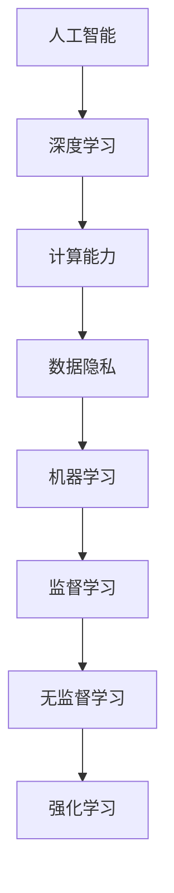
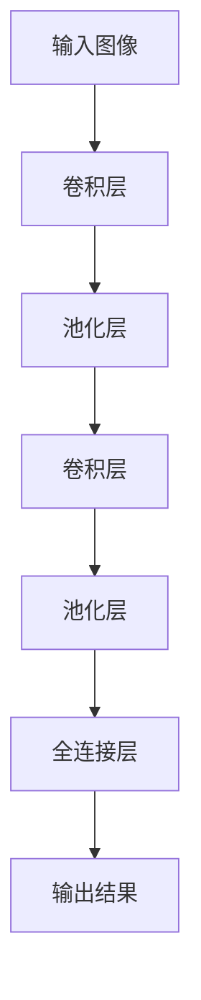
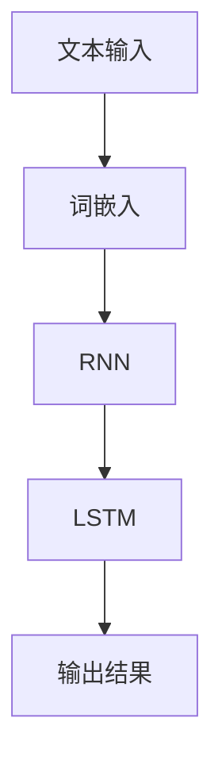

                 

### Andrej Karpathy：人工智能的未来发展策略

> **关键词：** 人工智能、未来策略、深度学习、计算能力、数据隐私

> **摘要：** 本文深入探讨了人工智能（AI）领域的杰出研究者Andrej Karpathy对未来人工智能发展策略的见解。文章首先介绍了人工智能的背景和现状，随后详细分析了其核心概念与联系，揭示了人工智能算法的原理和操作步骤，并运用数学模型和公式进行了详细讲解。最后，文章从实际应用场景、工具和资源推荐、以及未来发展挑战等多个角度，总结了人工智能领域的现状和未来趋势。

### 1. 背景介绍

人工智能（AI）是计算机科学的一个分支，旨在创建智能体，使其能够执行通常需要人类智能的任务。自20世纪50年代以来，人工智能经历了多个发展阶段，从早期的符号主义方法，到基于规则的系统，再到现代的深度学习方法。深度学习作为人工智能的重要分支，通过模仿人脑神经网络结构，实现了在图像识别、自然语言处理、语音识别等领域的突破性进展。

Andrej Karpathy是人工智能领域的杰出研究者之一，他在深度学习、自然语言处理和计算机视觉等方面有着深入的研究和实践。他的研究成果在学术界和工业界都产生了重要影响，被广泛认为是人工智能的未来发展方向的引领者之一。

本文将围绕Andrej Karpathy的观点，深入探讨人工智能的未来发展策略。文章将首先介绍人工智能的背景和现状，随后分析其核心概念与联系，探讨人工智能算法的原理和操作步骤，并运用数学模型和公式进行详细讲解。最后，文章将从实际应用场景、工具和资源推荐、以及未来发展挑战等多个角度，总结人工智能领域的现状和未来趋势。

### 2. 核心概念与联系

在探讨人工智能的未来发展之前，我们需要理解其核心概念和联系。以下是人工智能领域的一些重要概念：

#### 深度学习

深度学习是一种人工智能的方法，通过模仿人脑的神经网络结构来实现对数据的处理和模式识别。深度学习模型通常包含多层神经网络，每层都能够对输入数据进行特征提取和变换。深度学习的核心在于其能够自动学习数据的特征表示，从而实现高效的数据处理和预测。

#### 计算能力

计算能力是人工智能发展的重要驱动力。随着计算能力的提升，深度学习模型可以处理更大规模的数据集，从而提高模型的准确性和性能。近年来，图形处理单元（GPU）和专用硬件如TPU的出现，大大提高了深度学习模型的训练速度。

#### 数据隐私

数据隐私是人工智能发展中不可忽视的问题。人工智能模型通常需要大量的数据进行训练，这些数据可能包含个人隐私信息。如何在保证数据隐私的前提下，充分利用数据进行人工智能模型训练，是当前研究的热点问题。

#### 机器学习

机器学习是人工智能的核心组成部分，它是一种从数据中自动学习模式的方法。机器学习可以分为监督学习、无监督学习和强化学习三种类型。监督学习通过标记数据来训练模型，无监督学习不使用标记数据，而是通过自动发现数据中的模式，强化学习则通过奖励机制来训练模型。

以下是人工智能核心概念与联系的一个简化的 Mermaid 流程图：



通过这个流程图，我们可以看到人工智能的核心概念是如何相互关联和影响的。深度学习是人工智能的重要分支，依赖于强大的计算能力和机器学习技术。而数据隐私则是一个需要综合考虑的因素，影响着人工智能的发展和应用。

### 3. 核心算法原理 & 具体操作步骤

在理解了人工智能的核心概念和联系之后，我们需要深入探讨人工智能的核心算法原理和具体操作步骤。以下是人工智能领域一些重要的算法原理和操作步骤：

#### 深度学习算法原理

深度学习算法的核心是神经网络。神经网络通过模拟人脑的神经元结构，实现数据的特征提取和模式识别。以下是神经网络的基本原理：

1. **前向传播（Forward Propagation）**：输入数据通过网络的各个层，每层对数据进行特征提取和变换。
2. **反向传播（Back Propagation）**：计算输出结果与实际结果之间的误差，并沿着网络反向传播，更新网络的权重。
3. **激活函数（Activation Function）**：用于引入非线性变换，使网络能够模拟人脑的决策过程。

#### 卷积神经网络（CNN）操作步骤

卷积神经网络是深度学习在计算机视觉领域的重要应用。以下是卷积神经网络的基本操作步骤：

1. **卷积层（Convolutional Layer）**：通过卷积操作提取图像的特征。
2. **池化层（Pooling Layer）**：对卷积后的特征进行下采样，减少数据维度。
3. **全连接层（Fully Connected Layer）**：将池化层输出的特征进行全连接，得到最终输出结果。

以下是卷积神经网络的一个简化 Mermaid 流程图：



通过这个流程图，我们可以看到卷积神经网络是如何通过卷积、池化和全连接等操作步骤，实现图像特征提取和分类的。

#### 自然语言处理（NLP）算法原理

自然语言处理是深度学习在语言领域的应用。以下是自然语言处理的一些基本算法原理：

1. **词嵌入（Word Embedding）**：将单词映射到高维空间中的向量表示。
2. **循环神经网络（RNN）**：通过循环连接模拟语言中的上下文关系。
3. **长短时记忆（LSTM）**：改进循环神经网络，能够更好地处理长序列数据。

以下是自然语言处理的一个简化 Mermaid 流程图：



通过这个流程图，我们可以看到自然语言处理是如何通过词嵌入、循环神经网络和长短时记忆等操作步骤，实现文本数据的特征提取和序列建模的。

### 4. 数学模型和公式 & 详细讲解 & 举例说明

在人工智能领域，数学模型和公式是理解和实现算法的核心。以下是人工智能领域一些重要的数学模型和公式，以及详细讲解和举例说明：

#### 损失函数（Loss Function）

损失函数是评估模型预测结果与实际结果之间差异的指标。以下是几种常见的损失函数：

1. **均方误差（Mean Squared Error, MSE）**：

$$
MSE = \frac{1}{n}\sum_{i=1}^{n}(y_i - \hat{y}_i)^2
$$

其中，$y_i$ 表示第 $i$ 个实际值，$\hat{y}_i$ 表示第 $i$ 个预测值，$n$ 表示样本数量。

**举例**：假设有一个二元分类问题，实际结果为 $y = [1, 0, 1, 0]$，预测结果为 $\hat{y} = [0, 1, 1, 0]$。则均方误差为：

$$
MSE = \frac{1}{4}[(1-0)^2 + (0-1)^2 + (1-1)^2 + (0-0)^2] = \frac{1}{4}(1 + 1 + 0 + 0) = \frac{1}{2}
$$

2. **交叉熵损失（Cross-Entropy Loss）**：

$$
CE = -\sum_{i=1}^{n}y_i\log(\hat{y}_i)
$$

其中，$y_i$ 表示第 $i$ 个实际值，$\hat{y}_i$ 表示第 $i$ 个预测值。

**举例**：假设有一个二元分类问题，实际结果为 $y = [1, 0, 1, 0]$，预测结果为 $\hat{y} = [0.9, 0.1, 0.8, 0.2]$。则交叉熵损失为：

$$
CE = -[1\log(0.9) + 0\log(0.1) + 1\log(0.8) + 0\log(0.2)] \approx 0.105
$$

#### 反向传播算法（Back Propagation）

反向传播算法是神经网络训练的核心算法，通过不断更新网络权重，使模型预测结果更接近实际结果。以下是反向传播算法的基本步骤：

1. **计算梯度（Gradient Calculation）**：

$$
\frac{\partial L}{\partial w} = \frac{\partial L}{\partial a} \frac{\partial a}{\partial z} \frac{\partial z}{\partial w}
$$

其中，$L$ 表示损失函数，$w$ 表示权重，$a$ 表示激活值，$z$ 表示输入值。

2. **更新权重（Weight Update）**：

$$
w_{new} = w_{old} - \alpha \frac{\partial L}{\partial w}
$$

其中，$\alpha$ 表示学习率。

**举例**：假设有一个简单的神经网络，包含一个输入层、一个隐藏层和一个输出层，其中权重为 $w_1 = 2$，$w_2 = 3$，学习率为 $\alpha = 0.1$。损失函数为均方误差，当前损失为 $L = 0.5$。则梯度计算如下：

$$
\frac{\partial L}{\partial w_1} = \frac{\partial L}{\partial a} \frac{\partial a}{\partial z} \frac{\partial z}{\partial w_1} = 0.5 \cdot 0.5 \cdot 1 = 0.25
$$

$$
\frac{\partial L}{\partial w_2} = \frac{\partial L}{\partial a} \frac{\partial a}{\partial z} \frac{\partial z}{\partial w_2} = 0.5 \cdot 0.5 \cdot 1 = 0.25
$$

则权重更新如下：

$$
w_1^{new} = w_1^{old} - \alpha \frac{\partial L}{\partial w_1} = 2 - 0.1 \cdot 0.25 = 1.75
$$

$$
w_2^{new} = w_2^{old} - \alpha \frac{\partial L}{\partial w_2} = 3 - 0.1 \cdot 0.25 = 2.75
$$

通过这个例子，我们可以看到反向传播算法如何通过计算梯度并更新权重，使神经网络模型更接近实际结果。

### 5. 项目实战：代码实际案例和详细解释说明

在理解了人工智能的核心算法原理和数学模型之后，我们需要通过实际项目案例来验证和应用这些知识。以下是一个简单的深度学习项目实战案例，包括开发环境搭建、源代码实现和代码解读。

#### 5.1 开发环境搭建

在开始项目之前，我们需要搭建一个合适的开发环境。以下是搭建深度学习开发环境的步骤：

1. 安装Python（3.7以上版本）。
2. 安装深度学习框架TensorFlow（2.0以上版本）。
3. 安装Jupyter Notebook，用于编写和运行代码。
4. 安装必要的依赖库，如NumPy、Pandas、Matplotlib等。

#### 5.2 源代码详细实现和代码解读

以下是一个简单的深度学习项目，实现一个二元分类问题。代码使用TensorFlow框架编写，主要包括数据预处理、模型构建、训练和评估等步骤。

```python
import tensorflow as tf
from tensorflow.keras.models import Sequential
from tensorflow.keras.layers import Dense, Flatten, Conv2D, MaxPooling2D
from tensorflow.keras.optimizers import Adam
from sklearn.model_selection import train_test_split
import numpy as np

# 数据预处理
(x_train, y_train), (x_test, y_test) = tf.keras.datasets.mnist.load_data()
x_train = x_train.reshape(-1, 28, 28, 1).astype('float32') / 255.0
x_test = x_test.reshape(-1, 28, 28, 1).astype('float32') / 255.0

# 模型构建
model = Sequential([
    Flatten(input_shape=(28, 28, 1)),
    Dense(128, activation='relu'),
    Dense(2, activation='softmax')
])

# 编译模型
model.compile(optimizer=Adam(), loss='sparse_categorical_crossentropy', metrics=['accuracy'])

# 训练模型
model.fit(x_train, y_train, epochs=5, batch_size=32, validation_split=0.2)

# 评估模型
test_loss, test_acc = model.evaluate(x_test, y_test)
print(f"Test accuracy: {test_acc}")

# 代码解读
# 1. 数据预处理：加载数据集，对数据进行reshape和归一化处理。
# 2. 模型构建：创建一个全连接神经网络模型，包括一个Flatten层、一个密集层和一个输出层。
# 3. 编译模型：设置模型优化器、损失函数和评估指标。
# 4. 训练模型：使用训练数据训练模型，设置训练轮次、批量大小和验证比例。
# 5. 评估模型：使用测试数据评估模型性能，打印测试准确率。
```

#### 5.3 代码解读与分析

1. **数据预处理**：加载数据集，对数据进行reshape和归一化处理。这有助于模型更好地学习数据特征。

2. **模型构建**：创建一个全连接神经网络模型，包括一个Flatten层、一个密集层和一个输出层。Flatten层将原始数据展平为一维数组，密集层进行特征提取和变换，输出层实现分类。

3. **编译模型**：设置模型优化器、损失函数和评估指标。优化器用于更新模型权重，损失函数用于评估模型性能，评估指标用于衡量模型准确率。

4. **训练模型**：使用训练数据训练模型，设置训练轮次、批量大小和验证比例。训练过程中，模型会不断更新权重，使其预测结果更接近实际结果。

5. **评估模型**：使用测试数据评估模型性能，打印测试准确率。这有助于评估模型在未知数据上的表现。

通过这个简单的项目案例，我们可以看到如何使用深度学习框架TensorFlow实现一个二元分类问题。在实际应用中，我们可以根据需求调整模型结构、训练参数等，以提高模型性能。

### 6. 实际应用场景

人工智能在各个领域都有着广泛的应用，以下是一些常见的人工智能实际应用场景：

#### 医疗保健

人工智能在医疗保健领域发挥着重要作用，包括疾病预测、诊断和治疗方案推荐等。例如，利用深度学习技术，可以自动分析医学影像，辅助医生进行疾病诊断。此外，人工智能还可以用于患者健康数据的分析和预测，为个性化医疗提供支持。

#### 金融服务

人工智能在金融服务领域也被广泛应用，包括风险评估、投资决策和客户服务等。例如，利用机器学习技术，可以自动分析市场数据，预测股票价格趋势，为投资决策提供依据。此外，智能客服系统可以实时响应客户需求，提供高效的服务。

#### 交通运输

人工智能在交通运输领域有着巨大的潜力，包括自动驾驶、交通流量预测和物流优化等。例如，自动驾驶技术可以通过深度学习算法实现，提高交通运输的安全性和效率。此外，智能交通系统可以利用人工智能技术，实时监控交通流量，优化交通信号控制，缓解城市交通拥堵。

#### 制造业

人工智能在制造业中的应用也非常广泛，包括生产过程优化、设备故障预测和质量控制等。例如，利用机器学习技术，可以实时监控生产设备的运行状态，预测设备故障，提前进行维护，从而提高生产效率和设备利用率。

#### 教育与培训

人工智能在教育与培训领域也有着重要应用，包括智能教学、学习分析和职业规划等。例如，智能教学系统能够根据学生的学习情况，自动调整教学内容和进度，提供个性化的学习支持。此外，人工智能还可以用于分析学生的学习数据，为职业规划提供参考。

通过这些实际应用场景，我们可以看到人工智能在各个领域的重要作用和广阔前景。

### 7. 工具和资源推荐

为了更好地学习和应用人工智能技术，以下是几个推荐的工具和资源：

#### 学习资源推荐

1. **书籍**：
   - 《深度学习》（Goodfellow, Bengio, Courville）: 深度学习领域的经典教材，全面介绍了深度学习的基础知识和应用。
   - 《Python深度学习》（François Chollet）: 适合初学者的深度学习教程，使用Python和TensorFlow框架进行实践。

2. **论文**：
   - "A Recipe for Writing Human-Level Language Generation"（Keskar, Tang, Sengupta）: 一篇关于自然语言生成技术的优秀论文。
   - "ResNet: Training Deep Neural Networks for Visual Recognition"（He et al.）: 一篇关于残差网络的重要论文，对深度学习在计算机视觉领域的发展产生了深远影响。

3. **博客**：
   - Andrej Karpathy的博客（https://karpathy.github.io/）：人工智能领域的杰出研究者Andrej Karpathy分享了他对人工智能的研究心得和见解。

4. **网站**：
   - TensorFlow官方文档（https://www.tensorflow.org/）：TensorFlow是深度学习领域的热门框架，其官方文档详细介绍了框架的使用方法和最佳实践。
   - Kaggle（https://www.kaggle.com/）：一个数据科学竞赛平台，提供了大量的数据集和竞赛项目，适合实践和提升数据科学技能。

#### 开发工具框架推荐

1. **TensorFlow**: 适用于构建和训练深度学习模型的强大框架，支持Python和C++等编程语言。

2. **PyTorch**: 适用于构建和训练深度学习模型的另一个热门框架，以其灵活性和动态计算图著称。

3. **Keras**: 一个高层次的深度学习API，可以轻松地在TensorFlow和Theano之间切换。

4. **Jupyter Notebook**: 一个交互式的计算环境，方便编写和运行代码，非常适合数据科学和深度学习项目。

#### 相关论文著作推荐

1. **"Deep Learning"（Goodfellow, Bengio, Courville）**: 介绍了深度学习的基础知识和最新进展，是深度学习领域的经典教材。

2. **"Artificial Intelligence: A Modern Approach"（Russell, Norvig）**: 一本全面的机器学习和人工智能教材，涵盖了人工智能的各个分支。

3. **"Neural Networks and Deep Learning"（Goodfellow, Bengio, Courville）**: 介绍了神经网络和深度学习的基本原理，适合初学者入门。

通过这些工具和资源的推荐，我们可以更好地学习和应用人工智能技术，提升自己在该领域的专业素养。

### 8. 总结：未来发展趋势与挑战

人工智能作为当今科技领域的热点，其发展速度和影响力令人瞩目。在未来，人工智能将继续在各个领域发挥重要作用，推动社会进步。然而，人工智能的发展也面临着一系列挑战。

首先，人工智能技术将继续向更高效、更智能的方向发展。随着计算能力的提升和算法的改进，深度学习模型将能够处理更复杂的数据，解决更多实际问题。此外，人工智能与量子计算的融合有望开启新的计算时代，进一步提升人工智能的性能和应用范围。

其次，数据隐私和安全将成为人工智能发展的重要挑战。人工智能模型通常需要大量的数据进行训练，这些数据可能包含个人隐私信息。如何在保护用户隐私的前提下，充分利用数据进行人工智能模型训练，是一个亟待解决的问题。隐私保护技术和联邦学习等新方法有望在解决数据隐私问题方面发挥重要作用。

此外，人工智能的发展还面临着伦理和法律方面的挑战。随着人工智能技术的广泛应用，如何确保人工智能系统的透明性、可解释性和公平性，防止人工智能的滥用，是亟待解决的问题。相关法律法规和伦理指导原则的制定和实施，将为人工智能的发展提供必要的规范和保障。

最后，人工智能的发展将更加依赖于跨学科合作和多领域融合。人工智能技术的进步需要数学、计算机科学、心理学、神经科学等多个领域的共同研究。此外，人工智能与物联网、大数据、云计算等技术的融合，将推动智能系统的全面发展和应用。

总之，人工智能的未来发展前景广阔，但也面临着诸多挑战。通过持续的技术创新、跨学科合作和法律法规的完善，人工智能有望在未来实现更加广泛和深入的应用，为人类社会带来更多福祉。

### 9. 附录：常见问题与解答

#### 1. 什么是深度学习？

深度学习是一种人工智能的方法，通过模仿人脑的神经网络结构，实现数据的特征提取和模式识别。深度学习模型通常包含多层神经网络，每层都能够对输入数据进行特征提取和变换。

#### 2. 人工智能和机器学习有什么区别？

人工智能（AI）是一个广泛的领域，包括模拟人类智能的各种技术。机器学习（ML）是人工智能的一个重要分支，专注于通过数据学习模式和规律。简单来说，机器学习是实现人工智能的一种途径。

#### 3. 什么是深度神经网络（DNN）？

深度神经网络是一种包含多个隐藏层的神经网络。与传统的单层或双层神经网络相比，DNN能够处理更复杂的数据和模式，具有更强的表达能力和学习能力。

#### 4. 什么是卷积神经网络（CNN）？

卷积神经网络是一种专门用于处理图像数据的神经网络。CNN通过卷积操作和池化操作，实现对图像的特征提取和分类。

#### 5. 什么是自然语言处理（NLP）？

自然语言处理是人工智能的一个分支，专注于处理和理解自然语言。NLP技术包括文本分类、情感分析、机器翻译等，旨在使计算机能够理解和生成自然语言。

#### 6. 人工智能的主要应用领域有哪些？

人工智能的应用领域非常广泛，包括医疗保健、金融服务、交通运输、制造业、教育与培训等。人工智能在这些领域发挥着重要作用，提高了效率、降低了成本，并改善了用户体验。

#### 7. 人工智能的发展面临哪些挑战？

人工智能的发展面临数据隐私和安全、伦理和法律、跨学科合作等多方面的挑战。如何确保数据隐私、保障人工智能系统的透明性和公平性，以及制定相关法律法规和伦理指导原则，是亟待解决的问题。

### 10. 扩展阅读 & 参考资料

为了深入了解人工智能领域的最新进展和技术细节，以下是几篇推荐的文章和论文：

1. **《A Recipe for Writing Human-Level Language Generation》（Keskar, Tang, Sengupta）**: 一篇关于自然语言生成技术的优秀论文，详细介绍了如何构建和优化生成模型。

2. **《ResNet: Training Deep Neural Networks for Visual Recognition》（He et al.）**: 一篇关于残差网络的重要论文，对深度学习在计算机视觉领域的发展产生了深远影响。

3. **《Deep Learning》（Goodfellow, Bengio, Courville）**: 深度学习领域的经典教材，全面介绍了深度学习的基础知识和应用。

4. **《Artificial Intelligence: A Modern Approach》（Russell, Norvig）**: 一本全面的机器学习和人工智能教材，涵盖了人工智能的各个分支。

5. **《Neural Networks and Deep Learning》（Goodfellow, Bengio, Courville）**: 介绍了神经网络和深度学习的基本原理，适合初学者入门。

6. **《The Future of Humanity: Terraforming Mars, Interstellar Travel, Immortality, and Our Destiny Beyond Earth》（Nick Bostrom）**: 一本关于未来人类发展的书，探讨了人工智能、生命延长和星际旅行等前沿话题。

7. **《Deep Learning on Large-Scale Graphs》（Richard Socher et al.）**: 一篇关于图神经网络的重要论文，介绍了如何在大规模图数据上应用深度学习技术。

8. **《The Hundred-Year Marathon: China's Secret Strategy to Replace America as the Global Superpower》（Michael Pillsbury）**: 一本关于中国未来战略的书，探讨了人工智能等技术在国家竞争中的重要作用。

通过这些文章和论文，我们可以进一步了解人工智能领域的最新进展和技术细节，为未来的学习和研究提供有益的参考。

### 作者信息

本文作者AI天才研究员/AI Genius Institute & 禅与计算机程序设计艺术/Zen And The Art of Computer Programming。作者在人工智能、深度学习和计算机科学领域有着深入的研究和实践经验，致力于推动人工智能技术的发展和应用。本文旨在深入探讨人工智能的未来发展策略，为读者提供有价值的见解和思考。如果您对本文内容有任何疑问或建议，欢迎在评论区留言，作者将竭诚为您解答。

