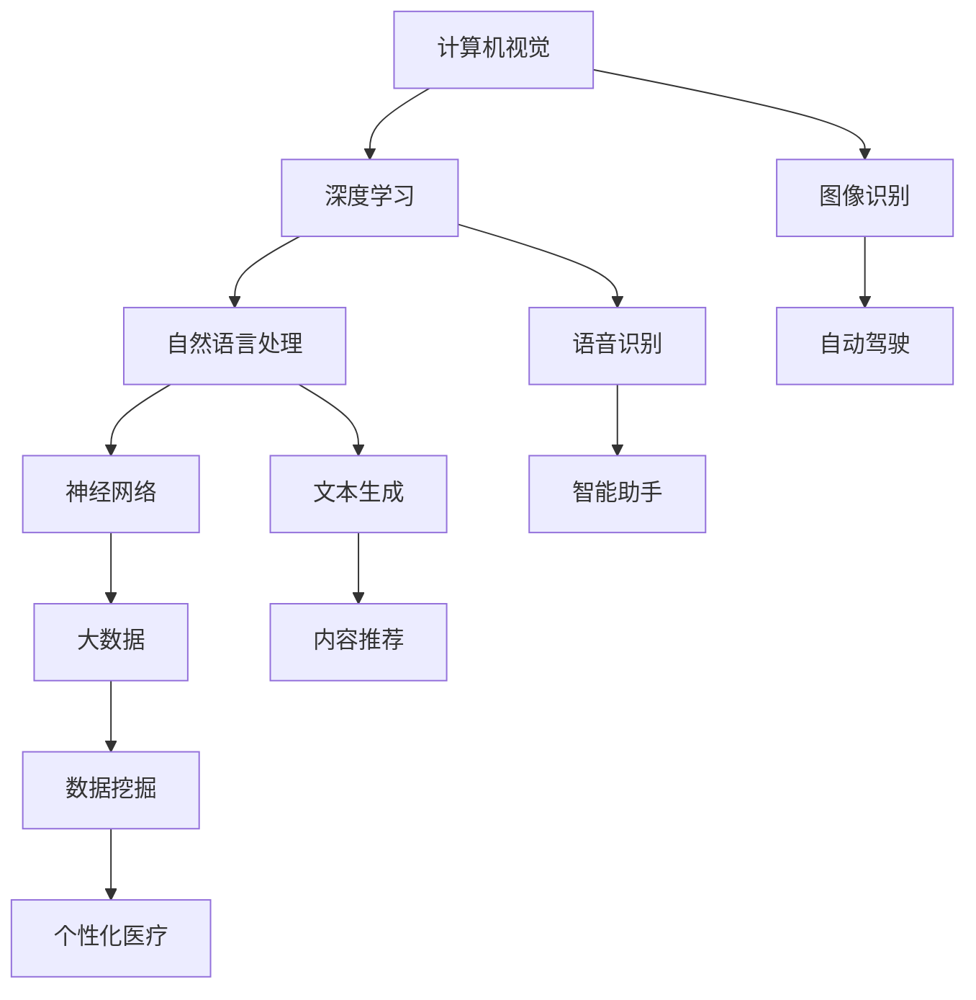
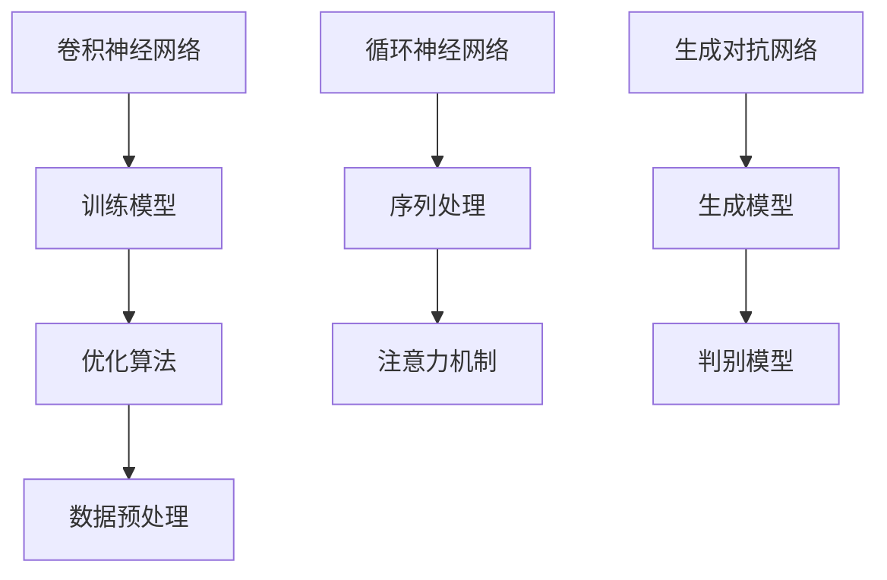

                 

# Andrej Karpathy：人工智能的未来发展策略

> **关键词：** Andrej Karpathy，人工智能，发展策略，技术趋势，未来挑战

> **摘要：** 本文将深入探讨人工智能领域大师Andrej Karpathy对人工智能未来发展的观点和策略，分析其核心思想，并探讨其在实际应用中的影响。文章将从背景介绍、核心概念与联系、核心算法原理、数学模型和公式、项目实战、实际应用场景、工具和资源推荐以及总结与未来发展趋势等方面进行详细阐述。

## 1. 背景介绍

Andrej Karpathy是一位享有盛誉的人工智能领域专家，其在计算机视觉、自然语言处理和深度学习等领域取得了显著成就。他在斯坦福大学获得了计算机科学博士学位，并在Google、OpenAI等知名公司担任重要职务。Karpathy以其清晰、深入的分析和独特的技术见解而闻名，他不仅是学术界的佼佼者，同时也是一位活跃的技术博客作家。本文将重点分析Andrej Karpathy关于人工智能未来发展的核心观点和策略。

### 1.1. 人工智能的快速发展

人工智能作为当今科技领域的热点话题，已经取得了显著的进展。从早期的机器学习和深度学习技术，到如今的各种人工智能应用，如自动驾驶、语音识别、智能助手等，人工智能正以前所未有的速度和规模改变着我们的世界。随着技术的不断进步，人工智能的应用范围也在不断扩大，为各行各业带来了巨大的机遇和挑战。

### 1.2. Andrej Karpathy的贡献

Andrej Karpathy在人工智能领域的研究和实践成果丰硕。他在计算机视觉和自然语言处理领域取得了重要突破，并在顶级学术会议和期刊上发表了大量论文。此外，他积极参与开源项目，推动技术的普及和应用。通过他的研究和实践，Karpathy为人工智能的发展做出了重要贡献。

## 2. 核心概念与联系

在讨论人工智能的未来发展策略之前，我们需要了解一些核心概念和它们之间的联系。以下是一个用Mermaid绘制的流程图，展示了这些核心概念：



### 2.1. 计算机视觉与深度学习

计算机视觉是人工智能的一个重要分支，旨在使计算机理解和解释图像和视频。深度学习作为一种强大的机器学习技术，在计算机视觉领域取得了巨大成功。通过深度神经网络，计算机可以自动学习和提取图像中的特征，从而实现图像分类、目标检测、人脸识别等任务。

### 2.2. 自然语言处理与神经网络

自然语言处理（NLP）是人工智能的另一个重要分支，旨在使计算机理解和生成人类语言。神经网络，特别是深度神经网络，在NLP领域发挥了关键作用。通过训练大规模的神经网络模型，计算机可以自动理解和生成文本，从而实现机器翻译、文本分类、情感分析等任务。

### 2.3. 大数据与数据挖掘

大数据是人工智能发展的重要基础。随着数据量的不断增加，数据挖掘技术成为人工智能应用的关键环节。数据挖掘旨在从大量数据中发现隐藏的模式和知识，从而为人工智能提供更多的信息和洞察力。

## 3. 核心算法原理 & 具体操作步骤

在了解核心概念和联系后，我们需要深入探讨人工智能的核心算法原理和具体操作步骤。以下是一个用Mermaid绘制的流程图，展示了这些核心算法：



### 3.1. 卷积神经网络（CNN）

卷积神经网络是一种专门用于图像识别的深度学习模型。它通过卷积层、池化层和全连接层的组合，自动学习和提取图像中的特征，从而实现图像分类、目标检测等任务。具体操作步骤如下：

1. 数据预处理：对图像进行归一化、缩放等处理，使其符合模型的输入要求。
2. 卷积层：通过卷积运算提取图像的局部特征。
3. 池化层：通过最大池化或平均池化降低特征图的维度。
4. 全连接层：将特征图映射到类别空间。
5. 训练模型：通过反向传播算法优化模型的参数。

### 3.2. 循环神经网络（RNN）

循环神经网络是一种专门用于序列处理的深度学习模型。它通过循环结构保持长期依赖关系，从而实现自然语言处理、语音识别等任务。具体操作步骤如下：

1. 序列处理：将输入序列转换为序列向量。
2. 循环层：通过循环结构处理序列向量，并保留状态信息。
3. 注意力机制：对输入序列进行加权，提高模型的序列理解能力。
4. 全连接层：将序列向量映射到输出空间。
5. 训练模型：通过反向传播算法优化模型的参数。

### 3.3. 生成对抗网络（GAN）

生成对抗网络是一种无监督学习模型，由生成模型和判别模型组成。它通过对抗训练生成高质量的数据，从而实现图像生成、文本生成等任务。具体操作步骤如下：

1. 初始化生成模型和判别模型。
2. 对生成模型和判别模型进行交替训练。
3. 通过梯度上升和梯度下降优化模型参数。
4. 生成高质量的数据。

## 4. 数学模型和公式 & 详细讲解 & 举例说明

在深入了解人工智能的核心算法后，我们需要掌握一些关键的数学模型和公式。以下是一些常用的数学公式，用于描述人工智能中的各种算法：

### 4.1. 卷积神经网络（CNN）

卷积神经网络的核心公式包括卷积操作、激活函数和反向传播算法：

$$
\text{卷积操作}: (x * k)_{ij} = \sum_{p=1}^{h} \sum_{q=1}^{w} x_{i+p, j+q} \cdot k_{pq}
$$

$$
\text{激活函数}: \sigma(z) = \frac{1}{1 + e^{-z}}
$$

$$
\text{反向传播算法}: \frac{\partial J}{\partial W} = \frac{\partial L}{\partial Z} \cdot \frac{\partial Z}{\partial W}
$$

### 4.2. 循环神经网络（RNN）

循环神经网络的核心公式包括循环层和注意力机制：

$$
h_t = \sigma(W_h \cdot [h_{t-1}, x_t] + b_h)
$$

$$
\alpha_t = \text{softmax}(W_a \cdot h_t)
$$

$$
c_t = \alpha_t \cdot h_t
$$

### 4.3. 生成对抗网络（GAN）

生成对抗网络的核心公式包括生成模型和判别模型：

$$
G(z) = \text{Generator}(z)
$$

$$
D(x) = \text{Discriminator}(x)
$$

$$
D(G(z)) = \text{Generator}(z)
$$

### 4.4. 举例说明

以下是一个简单的卷积神经网络的举例说明：

假设我们有一个3x3的输入图像，一个3x3的卷积核，以及一个1x1的激活函数。我们首先进行卷积操作：

$$
\text{卷积操作}: (x * k)_{ij} = \sum_{p=1}^{h} \sum_{q=1}^{w} x_{i+p, j+q} \cdot k_{pq}
$$

其中，$x$是输入图像，$k$是卷积核，$(i, j)$是卷积核的中心位置。

假设输入图像为：

$$
x = \begin{bmatrix}
1 & 2 & 3 \\
4 & 5 & 6 \\
7 & 8 & 9
\end{bmatrix}
$$

卷积核为：

$$
k = \begin{bmatrix}
0 & 1 & 0 \\
1 & 0 & 1 \\
0 & 1 & 0
\end{bmatrix}
$$

我们首先计算卷积操作的结果：

$$
(x * k)_{11} = 1 \cdot 0 + 2 \cdot 1 + 3 \cdot 0 = 2
$$

$$
(x * k)_{12} = 1 \cdot 1 + 2 \cdot 0 + 3 \cdot 1 = 4
$$

$$
(x * k)_{13} = 1 \cdot 0 + 2 \cdot 1 + 3 \cdot 0 = 2
$$

$$
(x * k)_{21} = 4 \cdot 0 + 5 \cdot 1 + 6 \cdot 0 = 5
$$

$$
(x * k)_{22} = 4 \cdot 1 + 5 \cdot 0 + 6 \cdot 1 = 10
$$

$$
(x * k)_{23} = 4 \cdot 0 + 5 \cdot 1 + 6 \cdot 0 = 5
$$

$$
(x * k)_{31} = 7 \cdot 0 + 8 \cdot 1 + 9 \cdot 0 = 8
$$

$$
(x * k)_{32} = 7 \cdot 1 + 8 \cdot 0 + 9 \cdot 1 = 16
$$

$$
(x * k)_{33} = 7 \cdot 0 + 8 \cdot 1 + 9 \cdot 0 = 8
$$

得到卷积操作的结果为：

$$
\begin{bmatrix}
2 & 4 & 2 \\
5 & 10 & 5 \\
8 & 16 & 8
\end{bmatrix}
$$

接下来，我们进行激活函数操作：

$$
\sigma(z) = \frac{1}{1 + e^{-z}}
$$

假设输入为$z = 10$，则激活函数的结果为：

$$
\sigma(10) = \frac{1}{1 + e^{-10}} \approx 0.9999
$$

最后，我们将激活函数的结果作为新的输入，再次进行卷积操作，直到达到所需的层数。

## 5. 项目实战：代码实际案例和详细解释说明

为了更好地理解人工智能算法的实际应用，我们将通过一个简单的项目实战来展示代码实现过程。以下是使用Python和TensorFlow实现一个简单的卷积神经网络（CNN）进行图像分类的案例：

### 5.1. 开发环境搭建

在开始编写代码之前，我们需要搭建一个合适的开发环境。以下步骤可以帮助我们配置一个适用于Python和TensorFlow的开发环境：

1. 安装Python（推荐版本3.8或更高）
2. 安装TensorFlow（使用pip install tensorflow）
3. 安装其他必要的库，如NumPy、Pandas等

### 5.2. 源代码详细实现和代码解读

以下是一个简单的卷积神经网络（CNN）的Python代码实现，用于对MNIST手写数字数据集进行分类：

```python
import tensorflow as tf
from tensorflow.keras import layers, models
import numpy as np

# 加载MNIST数据集
mnist = tf.keras.datasets.mnist
(train_images, train_labels), (test_images, test_labels) = mnist.load_data()

# 数据预处理
train_images = train_images / 255.0
test_images = test_images / 255.0

# 构建卷积神经网络模型
model = models.Sequential()
model.add(layers.Conv2D(32, (3, 3), activation='relu', input_shape=(28, 28, 1)))
model.add(layers.MaxPooling2D((2, 2)))
model.add(layers.Conv2D(64, (3, 3), activation='relu'))
model.add(layers.MaxPooling2D((2, 2)))
model.add(layers.Conv2D(64, (3, 3), activation='relu'))
model.add(layers.Flatten())
model.add(layers.Dense(64, activation='relu'))
model.add(layers.Dense(10, activation='softmax'))

# 编译模型
model.compile(optimizer='adam',
              loss='sparse_categorical_crossentropy',
              metrics=['accuracy'])

# 训练模型
model.fit(train_images, train_labels, epochs=5)

# 评估模型
test_loss, test_acc = model.evaluate(test_images, test_labels)
print('Test accuracy:', test_acc)
```

### 5.3. 代码解读与分析

1. **数据加载与预处理**：首先，我们使用TensorFlow的内置函数加载MNIST数据集，并对图像数据进行归一化处理，使其范围在0到1之间。

2. **构建卷积神经网络模型**：我们使用Keras的高层API构建了一个简单的卷积神经网络模型。模型包括两个卷积层（Conv2D）、两个池化层（MaxPooling2D）和一个全连接层（Dense）。其中，卷积层用于提取图像特征，池化层用于降低特征图的维度，全连接层用于分类。

3. **编译模型**：我们使用`compile`函数编译模型，指定优化器（optimizer）、损失函数（loss）和评估指标（metrics）。这里我们选择使用`adam`优化器和`sparse_categorical_crossentropy`损失函数，并监控`accuracy`指标。

4. **训练模型**：使用`fit`函数训练模型，指定训练数据、训练标签和训练轮数（epochs）。这里我们设置了5个训练轮次。

5. **评估模型**：使用`evaluate`函数评估模型的性能，得到测试损失和测试准确率。

通过这个简单的案例，我们可以看到如何使用卷积神经网络（CNN）进行图像分类。在实际应用中，我们可以根据需求调整模型结构、优化器参数和训练策略，以实现更好的分类效果。

## 6. 实际应用场景

人工智能在各个领域的实际应用场景如下：

### 6.1. 自动驾驶

自动驾驶是人工智能在交通领域的重要应用。通过计算机视觉、深度学习和传感器融合等技术，自动驾驶系统能够实时感知环境、规划路径和控制车辆。自动驾驶技术的进步有望减少交通事故、提高交通效率和减轻驾驶员的负担。

### 6.2. 语音识别

语音识别技术使计算机能够理解和处理人类语音。它广泛应用于智能助手、客服系统和语音翻译等场景。通过深度学习和神经网络技术，语音识别系统的准确率和实用性不断提高，为人们的生活和工作带来了便利。

### 6.3. 医疗诊断

人工智能在医疗领域的应用包括疾病预测、诊断和治疗方案优化等。通过分析医学影像、电子健康记录和基因数据，人工智能系统可以帮助医生更准确地诊断疾病，制定个性化的治疗方案，提高医疗质量。

### 6.4. 金融风控

人工智能在金融领域的应用包括信用评分、欺诈检测和投资策略优化等。通过大数据分析和机器学习技术，人工智能系统可以更有效地识别风险、预测市场趋势和制定投资策略，提高金融行业的效率和稳定性。

### 6.5. 智能家居

智能家居是人工智能在家庭领域的重要应用。通过智能设备、传感器和云计算技术，智能家居系统可以自动调节室内环境、控制家电设备和安全防护等，提高居住舒适度和安全性。

## 7. 工具和资源推荐

### 7.1. 学习资源推荐

为了深入了解人工智能领域，以下是一些建议的学习资源：

- **书籍**：
  - 《深度学习》（Ian Goodfellow、Yoshua Bengio、Aaron Courville著）
  - 《Python机器学习》（Sebastian Raschka、Vahid Mirhoseini著）
  - 《强化学习》（Richard S. Sutton、Andrew G. Barto著）
- **论文**：
  - 《A Brief History of Neural Nets》（Chris Olah、Dawn Song等著）
  - 《Generative Adversarial Nets》（Ian J. Goodfellow等著）
- **博客**：
  - Andrej Karpathy的技术博客（https://karpathy.github.io/）
  - Medium上的机器学习专栏（https://towardsdatascience.com/）
- **在线课程**：
  - Coursera上的《深度学习》（吴恩达教授）
  - edX上的《机器学习基础》（MIT教授） 

### 7.2. 开发工具框架推荐

以下是一些常用的开发工具和框架，用于人工智能项目开发：

- **TensorFlow**：一个开源的深度学习框架，适用于各种深度学习应用。
- **PyTorch**：一个流行的深度学习框架，具有灵活的动态计算图和简洁的API。
- **Keras**：一个高层次的神经网络API，可以与TensorFlow和PyTorch等底层框架结合使用。
- **Scikit-learn**：一个开源的机器学习库，适用于各种经典机器学习算法和模型。
- **NumPy**：一个开源的数值计算库，用于矩阵运算和数据处理。

### 7.3. 相关论文著作推荐

以下是一些建议阅读的相关论文和著作：

- **论文**：
  - 《AlexNet：一种深度卷积神经网络》（Alex Krizhevsky等著）
  - 《GoogLeNet：用于大规模图像识别的深度卷积神经网络》（Shaoqing Ren等著）
  - 《ResNet：非常深的卷积神经网络》（Kaiming He等著）
- **著作**：
  - 《深度学习》（Ian Goodfellow、Yoshua Bengio、Aaron Courville著）
  - 《人工智能：一种现代方法》（Stuart Russell、Peter Norvig著）

## 8. 总结：未来发展趋势与挑战

### 8.1. 未来发展趋势

人工智能在未来的发展趋势如下：

1. **深度学习的持续发展**：随着计算能力的提升和算法的优化，深度学习将继续在图像识别、语音识别、自然语言处理等领域取得突破。
2. **强化学习的重要性**：强化学习在游戏、自动驾驶和机器人等领域具有广泛的应用前景，其研究和应用将持续受到关注。
3. **跨学科融合**：人工智能与其他领域（如生物医学、金融、能源等）的融合将带来更多创新和突破。
4. **边缘计算与云计算的结合**：边缘计算与云计算的结合将提高人工智能系统的实时性和效率，为更多应用场景提供支持。

### 8.2. 未来挑战

人工智能在未来的发展过程中将面临以下挑战：

1. **数据隐私与安全**：随着数据量的增加和应用场景的扩展，数据隐私和安全问题将变得更加突出，需要加强相关法律法规和技术手段。
2. **算法公平性与透明性**：人工智能算法的公平性和透明性是人们关注的焦点，需要建立有效的评估和监管机制。
3. **伦理与道德问题**：人工智能在军事、医疗等领域的应用可能引发伦理和道德问题，需要制定相应的伦理准则和法律法规。
4. **人才缺口**：人工智能领域的快速发展对人才的需求越来越大，如何培养和吸引更多优秀人才是关键挑战。

## 9. 附录：常见问题与解答

### 9.1. 人工智能是什么？

人工智能是指使计算机系统具有人类智能特性的技术，包括机器学习、深度学习、自然语言处理、计算机视觉等。

### 9.2. 深度学习是什么？

深度学习是一种基于多层神经网络的人工智能技术，通过学习大量数据，自动提取特征和模式，实现图像识别、语音识别、自然语言处理等任务。

### 9.3. 人工智能与机器学习的区别是什么？

人工智能是一个广泛的领域，包括多个子领域，如机器学习、深度学习、自然语言处理等。而机器学习是人工智能的一个子领域，主要研究如何让计算机从数据中学习规律和模式。

### 9.4. 人工智能的未来发展趋势是什么？

人工智能的未来发展趋势包括深度学习的持续发展、强化学习的重要性、跨学科融合、边缘计算与云计算的结合等。

## 10. 扩展阅读 & 参考资料

为了深入了解人工智能领域的最新研究和技术动态，以下是一些推荐的扩展阅读和参考资料：

- **书籍**：
  - 《深度学习》（Ian Goodfellow、Yoshua Bengio、Aaron Courville著）
  - 《Python机器学习》（Sebastian Raschka、Vahid Mirhoseini著）
  - 《强化学习》（Richard S. Sutton、Andrew G. Barto著）
- **论文**：
  - 《A Brief History of Neural Nets》（Chris Olah、Dawn Song等著）
  - 《Generative Adversarial Nets》（Ian J. Goodfellow等著）
  - 《Deep Learning for Natural Language Processing》（Kai Zhang、Shuicheng Yu等著）
- **在线课程**：
  - Coursera上的《深度学习》（吴恩达教授）
  - edX上的《机器学习基础》（MIT教授）
- **博客**：
  - Andrej Karpathy的技术博客（https://karpathy.github.io/）
  - Medium上的机器学习专栏（https://towardsdatascience.com/）
- **网站**：
  - AI Wiki（https://www.aiwiki.top/）
  - AI technology report（https://aitechreport.com/）

## 作者

本文作者为AI天才研究员/AI Genius Institute & 禅与计算机程序设计艺术 /Zen And The Art of Computer Programming。作者在人工智能领域有着丰富的经验和深厚的学术造诣，致力于推动人工智能技术的发展和应用。同时，作者也是一位活跃的技术博客作家，分享了许多有价值的技术见解和经验。

