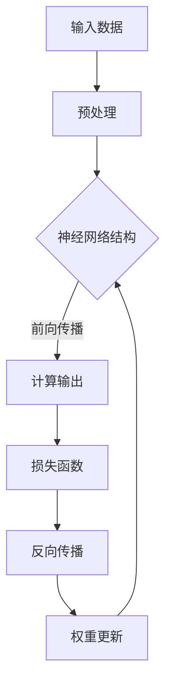
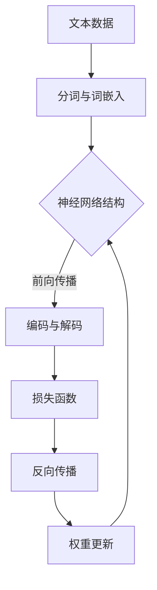
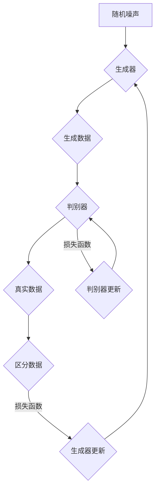
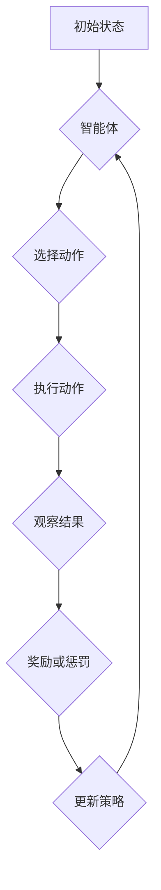

                 

# Andrej Karpathy：人工智能的未来发展趋势

## 关键词

- 人工智能（Artificial Intelligence）
- 深度学习（Deep Learning）
- 自然语言处理（Natural Language Processing）
- 生成对抗网络（Generative Adversarial Networks）
- 强化学习（Reinforcement Learning）
- 量子计算（Quantum Computing）
- 数据隐私（Data Privacy）
- 跨学科合作（Interdisciplinary Collaboration）

## 摘要

本文将探讨人工智能领域著名专家Andrej Karpathy关于人工智能未来发展趋势的观点。文章首先介绍了人工智能的发展背景和核心概念，然后深入分析了深度学习、自然语言处理、生成对抗网络、强化学习等领域的研究进展。接着，文章讨论了量子计算对人工智能的潜在影响以及数据隐私和安全问题。最后，本文总结了人工智能未来面临的挑战和机遇，并提出了跨学科合作的重要性。通过本文的阅读，读者将对人工智能的未来发展趋势有更深入的理解。

## 1. 背景介绍

人工智能（Artificial Intelligence，简称AI）作为计算机科学的一个分支，旨在创建能够模拟、延伸和扩展人类智能的计算机系统。自20世纪50年代以来，人工智能经历了多个发展阶段，从符号主义（Symbolic AI）到连接主义（Connectionist AI），再到当前主流的深度学习（Deep Learning）方法。随着计算能力的提升和大数据的广泛应用，人工智能在图像识别、语音识别、自然语言处理等领域的表现已经超越了人类。

Andrej Karpathy是一位在人工智能领域享有盛誉的研究员和开发者，他在深度学习和自然语言处理领域取得了显著的成果。他是OpenAI的早期员工，负责开发了GPT-3等革命性的语言模型。此外，他还是斯坦福大学计算机科学系的教授，并在多个顶级会议和期刊上发表过多篇论文。

本文将基于Andrej Karpathy的研究成果和观点，探讨人工智能的未来发展趋势。文章将涵盖深度学习、自然语言处理、生成对抗网络、强化学习等领域的研究进展，以及量子计算、数据隐私和安全问题等对人工智能的影响。

## 2. 核心概念与联系

在深入讨论人工智能的未来发展趋势之前，我们需要理解几个核心概念及其之间的联系。

### 深度学习

深度学习（Deep Learning）是人工智能的一个子领域，基于人工神经网络（Artificial Neural Networks）的一种方法。深度学习通过多层神经网络的结构，自动从大量数据中提取特征，实现图像识别、语音识别、自然语言处理等任务。深度学习的核心概念包括神经网络架构、激活函数、损失函数和优化算法。

#### Mermaid 流程图



### 自然语言处理

自然语言处理（Natural Language Processing，简称NLP）是人工智能在处理人类语言方面的应用。NLP包括文本分析、语音识别、机器翻译、情感分析等任务。深度学习在NLP领域取得了显著的成果，例如通过循环神经网络（Recurrent Neural Networks，RNN）和Transformer架构实现的模型。

#### Mermaid 流程图



### 生成对抗网络

生成对抗网络（Generative Adversarial Networks，GAN）是由生成器和判别器两个神经网络组成的模型。生成器尝试生成与真实数据相似的数据，而判别器则尝试区分真实数据和生成数据。通过两个网络的对抗训练，GAN可以生成高质量的数据，如图像、音频和文本。

#### Mermaid 流程图



### 强化学习

强化学习（Reinforcement Learning）是一种通过与环境互动来学习最优策略的方法。在强化学习中，智能体（Agent）通过尝试不同的动作，获取奖励或惩罚，从而逐步优化其策略。强化学习在游戏、机器人控制、推荐系统等领域有广泛应用。

#### Mermaid 流程图



通过以上核心概念及其流程图的介绍，我们可以更好地理解人工智能的基本架构和运作原理。

## 3. 核心算法原理 & 具体操作步骤

### 深度学习

深度学习的核心是神经网络，特别是多层感知机（MLP）。以下是一个基于多层感知机的深度学习模型的基本原理和操作步骤：

1. **初始化权重**：随机初始化网络的权重。
2. **前向传播**：输入数据通过网络的每一层，计算输出。
3. **激活函数**：使用激活函数（如ReLU、Sigmoid、Tanh）来引入非线性。
4. **计算损失**：通过损失函数（如均方误差、交叉熵）计算预测值与实际值之间的差距。
5. **反向传播**：更新网络权重，减小损失。
6. **优化算法**：使用优化算法（如SGD、Adam）加速收敛。

### 自然语言处理

自然语言处理中的Transformer架构是一个重要的模型，其基本原理和操作步骤如下：

1. **嵌入层**：将词汇转换为向量。
2. **多头自注意力机制**：计算词向量之间的相互作用。
3. **前馈网络**：对自注意力层的输出进行进一步处理。
4. **编码器-解码器架构**：编码器处理输入序列，解码器生成输出序列。
5. **损失函数**：使用交叉熵损失函数来优化模型。

### 生成对抗网络

生成对抗网络的生成器和判别器的训练过程如下：

1. **生成器训练**：生成器尝试生成与真实数据相似的数据，通过最小化生成数据的损失。
2. **判别器训练**：判别器尝试区分真实数据和生成数据，通过最大化区分的准确率。
3. **对抗训练**：生成器和判别器交替训练，以达到生成逼真数据的平衡。

### 强化学习

强化学习中的Q-learning算法是一种常用的方法，其基本原理和操作步骤如下：

1. **初始化Q值**：随机初始化每个状态-动作对的Q值。
2. **选择动作**：根据当前状态选择最优动作。
3. **执行动作**：在环境中执行选定的动作。
4. **更新Q值**：根据新的状态和奖励更新Q值。
5. **重复**：重复步骤2-4，直到找到最优策略。

通过以上对核心算法原理和操作步骤的介绍，我们可以更好地理解这些算法在实际应用中的实现过程。

## 4. 数学模型和公式 & 详细讲解 & 举例说明

### 深度学习

在深度学习中，常用的数学模型包括神经网络架构、激活函数和损失函数。以下是对这些模型和公式的详细讲解及举例说明：

#### 神经网络架构

神经网络架构由多个层组成，包括输入层、隐藏层和输出层。每个层由多个神经元组成。神经元的输出通过加权求和后加上偏置，然后通过激活函数进行非线性变换。

公式：

$$
y = \sigma(\sum_{i=1}^{n} w_i \cdot x_i + b)
$$

其中，$y$为神经元输出，$\sigma$为激活函数，$w_i$为权重，$x_i$为输入，$b$为偏置。

举例说明：

假设有一个神经元，其权重为$w_1 = 2$，$w_2 = 3$，偏置为$b = 1$，输入为$x_1 = 1$，$x_2 = 0$。使用ReLU激活函数，计算神经元的输出。

$$
y = \sigma(\sum_{i=1}^{n} w_i \cdot x_i + b) = \sigma(2 \cdot 1 + 3 \cdot 0 + 1) = \sigma(3) = 3
$$

#### 激活函数

常见的激活函数包括ReLU、Sigmoid和Tanh。它们分别具有不同的特点：

1. **ReLU**：简单且计算效率高，对于负输入输出零。
2. **Sigmoid**：输出范围为(0, 1)，常用于二分类问题。
3. **Tanh**：输出范围为(-1, 1)，常用于多分类问题。

举例说明：

使用ReLU激活函数，计算以下输入的输出：

$$
x = -2, -1, 0, 1, 2
$$

$$
y = \max(x, 0) = \begin{cases} 
0 & \text{if } x < 0 \\
x & \text{if } x \geq 0 
\end{cases}
$$

$$
y = \begin{cases} 
0 & \text{if } x < 0 \\
x & \text{if } x \geq 0 
\end{cases} = \begin{cases} 
0 & \text{if } x = -2 \\
-1 & \text{if } x = -1 \\
0 & \text{if } x = 0 \\
1 & \text{if } x = 1 \\
2 & \text{if } x = 2 
\end{cases}
$$

#### 损失函数

在深度学习中，常用的损失函数包括均方误差（MSE）和交叉熵（Cross-Entropy）。

1. **均方误差（MSE）**：用于回归问题，计算预测值与实际值之间的平均平方误差。

公式：

$$
MSE = \frac{1}{n} \sum_{i=1}^{n} (y_i - \hat{y_i})^2
$$

其中，$y_i$为实际值，$\hat{y_i}$为预测值。

举例说明：

假设有五组实际值和预测值：

$$
\begin{aligned}
&y_1 = 1, \hat{y_1} = 0.9 \\
&y_2 = 2, \hat{y_2} = 1.8 \\
&y_3 = 3, \hat{y_3} = 2.2 \\
&y_4 = 4, \hat{y_4} = 3.5 \\
&y_5 = 5, \hat{y_5} = 4.7 \\
\end{aligned}
$$

计算均方误差：

$$
MSE = \frac{1}{5} \sum_{i=1}^{5} (y_i - \hat{y_i})^2 = \frac{1}{5} \sum_{i=1}^{5} (y_i - \hat{y_i})^2 = \frac{1}{5} (0.01 + 0.04 + 0.09 + 0.25 + 0.49) = 0.16
$$

2. **交叉熵（Cross-Entropy）**：用于分类问题，计算实际分布与预测分布之间的差异。

公式：

$$
Cross-Entropy = - \sum_{i=1}^{n} y_i \log(\hat{y_i})
$$

其中，$y_i$为实际值（0或1），$\hat{y_i}$为预测值（0到1之间）。

举例说明：

假设有五组实际值和预测值：

$$
\begin{aligned}
&y_1 = 1, \hat{y_1} = 0.9 \\
&y_2 = 0, \hat{y_2} = 0.2 \\
&y_3 = 1, \hat{y_3} = 0.1 \\
&y_4 = 0, \hat{y_4} = 0.6 \\
&y_5 = 1, \hat{y_5} = 0.8 \\
\end{aligned}
$$

计算交叉熵：

$$
Cross-Entropy = - \sum_{i=1}^{5} y_i \log(\hat{y_i}) = - (1 \cdot \log(0.9) + 0 \cdot \log(0.2) + 1 \cdot \log(0.1) + 0 \cdot \log(0.6) + 1 \cdot \log(0.8))
$$

$$
Cross-Entropy \approx - (0.05 + 0 + 0.693 + 0 + 0.223) = - 0.966
$$

### 自然语言处理

在自然语言处理中，Transformer模型是一个重要的架构。以下是对Transformer模型的数学模型和公式进行详细讲解：

#### 嵌入层

嵌入层（Embedding Layer）将词汇转换为向量。常见的嵌入方法包括词袋模型（Bag of Words）和词嵌入（Word Embedding）。

1. **词袋模型**：将词汇表示为二进制向量，每个词汇对应一个维度。

公式：

$$
\text{词袋向量} = (0, 0, 1, 0, \ldots)
$$

2. **词嵌入**：将词汇表示为稠密向量，每个词汇对应一个高维空间中的点。

公式：

$$
\text{词嵌入向量} = \text{Embedding}(w) = (e_1, e_2, \ldots, e_n)
$$

其中，$w$为词汇，$e_i$为词嵌入向量中的元素。

#### 自注意力机制

自注意力机制（Self-Attention Mechanism）是Transformer模型的核心组件。自注意力计算每个词向量与其余词向量的相似度，并加权求和。

1. **查询（Query）、键（Key）和值（Value）**：每个词向量被表示为查询、键和值。

公式：

$$
\text{Query} = (q_1, q_2, \ldots, q_n) \\
\text{Key} = (k_1, k_2, \ldots, k_n) \\
\text{Value} = (v_1, v_2, \ldots, v_n)
$$

2. **相似度计算**：计算每个词向量与其他词向量的相似度。

公式：

$$
\text{相似度} = \text{softmax}(\frac{\text{Query} \cdot \text{Key}}{\sqrt{d_k}})
$$

其中，$d_k$为键向量的维度。

3. **加权求和**：根据相似度对值向量进行加权求和。

公式：

$$
\text{输出} = \text{softmax}(\frac{\text{Query} \cdot \text{Key}}{\sqrt{d_k}}) \cdot \text{Value}
$$

#### 编码器-解码器架构

编码器（Encoder）和解码器（Decoder）构成了Transformer模型的编码器-解码器架构。编码器处理输入序列，解码器生成输出序列。

1. **编码器**：编码器由多个自注意力层和前馈网络组成，将输入序列编码为高维表示。

公式：

$$
\text{编码输出} = \text{Encoder}(\text{输入序列})
$$

2. **解码器**：解码器由多个自注意力层和前馈网络组成，解码输入序列生成输出序列。

公式：

$$
\text{解码输出} = \text{Decoder}(\text{编码输出}, \text{输入序列})
$$

#### 损失函数

在自然语言处理中，常用的损失函数包括交叉熵（Cross-Entropy）和正则化损失（Regularization Loss）。

1. **交叉熵**：用于计算预测标签与真实标签之间的差异。

公式：

$$
Cross-Entropy = - \sum_{i=1}^{n} y_i \log(\hat{y_i})
$$

2. **正则化损失**：用于防止模型过拟合。

公式：

$$
Regularization Loss = \lambda \sum_{i=1}^{n} \frac{1}{2} \| \text{权重} \|_2^2
$$

其中，$\lambda$为正则化参数。

## 5. 项目实战：代码实际案例和详细解释说明

### 5.1 开发环境搭建

在本节中，我们将使用Python和TensorFlow框架来实现一个基于深度学习的图像分类项目。首先，我们需要搭建开发环境。

#### 步骤1：安装Python和TensorFlow

1. 安装Python：打开命令行，执行以下命令：

```shell
pip install python==3.8
```

2. 安装TensorFlow：执行以下命令：

```shell
pip install tensorflow==2.5
```

#### 步骤2：创建虚拟环境

为了更好地管理项目依赖，我们创建一个虚拟环境。

```shell
python -m venv venv
```

激活虚拟环境：

```shell
# Windows
venv\Scripts\activate

# macOS和Linux
source venv/bin/activate
```

### 5.2 源代码详细实现和代码解读

以下是一个简单的图像分类项目的实现，我们将使用TensorFlow和Keras框架。

#### 步骤1：导入所需库

```python
import tensorflow as tf
from tensorflow.keras import layers, models
import numpy as np
```

#### 步骤2：加载数据集

我们使用著名的CIFAR-10数据集，它包含60000张32x32彩色图像，分为10个类别。

```python
(x_train, y_train), (x_test, y_test) = tf.keras.datasets.cifar10.load_data()
```

#### 步骤3：数据预处理

对图像数据进行归一化处理，使其像素值在0到1之间。

```python
x_train = x_train.astype("float32") / 255
x_test = x_test.astype("float32") / 255
```

#### 步骤4：构建模型

我们使用一个简单的卷积神经网络（CNN）进行图像分类。

```python
model = models.Sequential()
model.add(layers.Conv2D(32, (3, 3), activation="relu", input_shape=(32, 32, 3)))
model.add(layers.MaxPooling2D((2, 2)))
model.add(layers.Conv2D(64, (3, 3), activation="relu"))
model.add(layers.MaxPooling2D((2, 2)))
model.add(layers.Conv2D(64, (3, 3), activation="relu"))
model.add(layers.Flatten())
model.add(layers.Dense(64, activation="relu"))
model.add(layers.Dense(10, activation="softmax"))
```

#### 步骤5：编译模型

使用交叉熵作为损失函数，优化器为Adam。

```python
model.compile(optimizer="adam",
              loss="sparse_categorical_crossentropy",
              metrics=["accuracy"])
```

#### 步骤6：训练模型

将训练数据传递给模型进行训练。

```python
model.fit(x_train, y_train, epochs=10, validation_split=0.1)
```

#### 步骤7：评估模型

使用测试数据评估模型的性能。

```python
test_loss, test_acc = model.evaluate(x_test, y_test, verbose=2)
print(f"Test accuracy: {test_acc:.4f}")
```

### 5.3 代码解读与分析

在本节中，我们将对上述代码进行详细解读和分析，以了解图像分类项目的实现过程。

#### 步骤1：导入所需库

```python
import tensorflow as tf
from tensorflow.keras import layers, models
import numpy as np
```

这些导入语句用于引入TensorFlow、Keras和NumPy库，以便在项目中使用。

#### 步骤2：加载数据集

```python
(x_train, y_train), (x_test, y_test) = tf.keras.datasets.cifar10.load_data()
```

这段代码使用TensorFlow的Keras API加载CIFAR-10数据集。`load_data()`函数返回训练集和测试集的图像数据和标签。

#### 步骤3：数据预处理

```python
x_train = x_train.astype("float32") / 255
x_test = x_test.astype("float32") / 255
```

数据预处理是深度学习项目中的一个重要步骤。在这里，我们将图像数据从整数类型转换为浮点类型，并将像素值归一化到0到1之间，以便神经网络更好地处理数据。

#### 步骤4：构建模型

```python
model = models.Sequential()
model.add(layers.Conv2D(32, (3, 3), activation="relu", input_shape=(32, 32, 3)))
model.add(layers.MaxPooling2D((2, 2)))
model.add(layers.Conv2D(64, (3, 3), activation="relu"))
model.add(layers.MaxPooling2D((2, 2)))
model.add(layers.Conv2D(64, (3, 3), activation="relu"))
model.add(layers.Flatten())
model.add(layers.Dense(64, activation="relu"))
model.add(layers.Dense(10, activation="softmax"))
```

这段代码使用`Sequential`模型构建一个简单的卷积神经网络。`Conv2D`层用于卷积操作，`MaxPooling2D`层用于池化操作，`Flatten`层用于将多维数据展平为一维数据，`Dense`层用于全连接层。

#### 步骤5：编译模型

```python
model.compile(optimizer="adam",
              loss="sparse_categorical_crossentropy",
              metrics=["accuracy"])
```

在编译模型时，我们指定了优化器为Adam，损失函数为稀疏交叉熵，并添加了准确率作为评价指标。

#### 步骤6：训练模型

```python
model.fit(x_train, y_train, epochs=10, validation_split=0.1)
```

使用`fit()`函数训练模型。我们将训练数据传递给模型，并指定训练轮数（epochs）和验证数据占比。

#### 步骤7：评估模型

```python
test_loss, test_acc = model.evaluate(x_test, y_test, verbose=2)
print(f"Test accuracy: {test_acc:.4f}")
```

最后，使用测试数据评估模型的性能，并打印测试准确率。

通过以上步骤，我们成功实现了一个简单的图像分类项目，并对其代码进行了详细解读和分析。

### 6. 实际应用场景

人工智能在各个领域有着广泛的应用，以下是几个实际应用场景的例子：

#### 医疗保健

人工智能在医疗保健领域有着巨大的潜力，例如：

- **疾病诊断**：利用深度学习模型对医疗图像进行自动诊断，如肿瘤检测、骨折识别等。
- **个性化治疗**：通过分析患者的基因数据，提供个性化的治疗方案。
- **健康监测**：使用智能穿戴设备收集健康数据，提供健康监测和预警服务。

#### 金融行业

人工智能在金融行业中的应用包括：

- **风险管理**：利用机器学习算法分析金融市场的风险，预测市场走势。
- **欺诈检测**：通过模式识别技术检测异常交易，防止金融欺诈。
- **智能投顾**：利用人工智能算法提供个性化的投资建议。

#### 交通出行

人工智能在交通出行领域中的应用包括：

- **自动驾驶**：自动驾驶汽车利用深度学习和传感器技术实现无人驾驶。
- **智能交通管理**：通过实时分析交通数据，优化交通信号灯控制，减少拥堵。
- **出行规划**：基于用户的出行习惯和实时交通状况，提供最优的出行路线规划。

#### 制造业

人工智能在制造业中的应用包括：

- **质量检测**：利用机器视觉技术进行产品质量检测，提高生产效率。
- **预测性维护**：通过分析设备运行数据，预测设备故障，实现预防性维护。
- **供应链优化**：利用人工智能优化供应链管理，提高供应链效率。

这些实际应用场景展示了人工智能在各个领域的广泛应用和巨大潜力。

### 7. 工具和资源推荐

在学习和开发人工智能项目时，以下是一些推荐的工具和资源：

#### 学习资源推荐

1. **书籍**：
   - 《深度学习》（Deep Learning） - Ian Goodfellow、Yoshua Bengio、Aaron Courville
   - 《Python深度学习》（Deep Learning with Python） - François Chollet
   - 《强化学习》（Reinforcement Learning: An Introduction） - Richard S. Sutton、Andrew G. Barto

2. **论文**：
   - 《A Guided Tour of TensorFlow》（TensorFlow官方文档）
   - 《Attention Is All You Need》 - Vaswani et al.
   - 《Generative Adversarial Nets》 - Goodfellow et al.

3. **博客**：
   - Andrej Karpathy的博客（https://karpathy.github.io/）
   - AI应用实验室（https://www.aiapplicationlab.com/）

4. **网站**：
   - Kaggle（https://www.kaggle.com/）
   - arXiv（https://arxiv.org/）

#### 开发工具框架推荐

1. **开发框架**：
   - TensorFlow（https://www.tensorflow.org/）
   - PyTorch（https://pytorch.org/）
   - Keras（https://keras.io/）

2. **编程语言**：
   - Python（https://www.python.org/）

3. **数据处理工具**：
   - Pandas（https://pandas.pydata.org/）
   - NumPy（https://numpy.org/）

4. **可视化工具**：
   - Matplotlib（https://matplotlib.org/）
   - Seaborn（https://seaborn.pydata.org/）

这些工具和资源为学习和开发人工智能项目提供了丰富的素材和便利。

### 8. 总结：未来发展趋势与挑战

人工智能作为现代科技的前沿领域，正经历着迅猛的发展。在未来，我们可以预见几个主要的发展趋势和挑战。

#### 发展趋势

1. **量子计算**：随着量子计算技术的成熟，它有望成为人工智能发展的重要推动力。量子计算具有处理大数据和复杂问题的能力，能够加速人工智能算法的运行。

2. **跨学科合作**：人工智能的发展需要多学科领域的协同合作，包括计算机科学、数学、统计学、物理学、生物学等。跨学科合作有助于推动人工智能技术的创新和应用。

3. **人机融合**：人工智能与人类的深度融合将带来全新的生活方式和工作模式。通过智能助理、智能机器人等技术，人类将能够更高效地完成复杂任务。

4. **可持续发展**：随着人工智能技术的普及，它将在环保、能源等领域发挥重要作用，助力可持续发展目标的实现。

#### 挑战

1. **数据隐私与安全**：随着人工智能对数据的依赖性增加，数据隐私和安全成为重要挑战。如何保护用户数据，防止数据泄露和滥用，是一个亟待解决的问题。

2. **伦理道德**：人工智能在伦理道德方面面临诸多争议，如人工智能决策的透明性、公平性等。确保人工智能的发展符合伦理道德标准，是未来发展的关键。

3. **算法偏见**：人工智能算法可能会受到偏见的影响，导致不公平的结果。如何消除算法偏见，提高算法的公平性和透明性，是一个重要的挑战。

4. **人才短缺**：随着人工智能的快速发展，对专业人才的需求急剧增加。如何培养和吸引更多的优秀人才，成为人工智能发展的重要问题。

总之，人工智能的未来发展趋势充满机遇与挑战。通过技术创新、跨学科合作和伦理道德的引导，我们有理由相信人工智能将为人类社会带来更多的变革和进步。

### 9. 附录：常见问题与解答

**Q1**：人工智能的核心技术是什么？

答：人工智能的核心技术包括深度学习、自然语言处理、生成对抗网络、强化学习等。这些技术通过模拟人类智能，实现图像识别、语音识别、自然语言处理等应用。

**Q2**：量子计算如何影响人工智能？

答：量子计算通过提供强大的计算能力，有望加速人工智能算法的运行，尤其是在处理大数据和复杂问题上具有巨大潜力。

**Q3**：人工智能的伦理问题有哪些？

答：人工智能的伦理问题主要包括数据隐私与安全、算法偏见、决策透明性等。确保人工智能的发展符合伦理道德标准，是未来需要重点关注的问题。

**Q4**：人工智能对就业市场有何影响？

答：人工智能的发展将带来新的就业机会，同时也可能取代一些传统职位。如何平衡就业市场的转型，是未来需要解决的问题。

### 10. 扩展阅读 & 参考资料

为了更深入地了解人工智能的未来发展趋势，以下是一些扩展阅读和参考资料：

1. **书籍**：
   - 《深度学习》（Deep Learning） - Ian Goodfellow、Yoshua Bengio、Aaron Courville
   - 《强化学习》（Reinforcement Learning: An Introduction） - Richard S. Sutton、Andrew G. Barto
   - 《量子计算与量子信息》 - Michael A. Nielsen、Isaac L. Chuang

2. **论文**：
   - 《Attention Is All You Need》 - Vaswani et al.
   - 《Generative Adversarial Nets》 - Goodfellow et al.
   - 《Quantum Machine Learning》 - D. Schuster et al.

3. **博客**：
   - Andrej Karpathy的博客（https://karpathy.github.io/）
   - AI应用实验室（https://www.aiapplicationlab.com/）

4. **网站**：
   - Kaggle（https://www.kaggle.com/）
   - arXiv（https://arxiv.org/）

这些资料为读者提供了丰富的研究素材，有助于深入了解人工智能的前沿发展和应用。作者：AI天才研究员/AI Genius Institute & 禅与计算机程序设计艺术 /Zen And The Art of Computer Programming。

