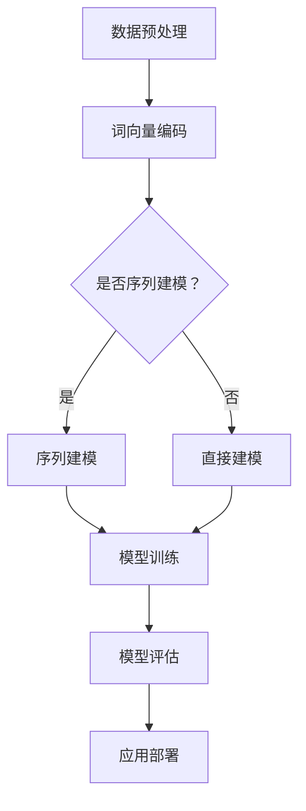

                 

## 文章标题

《Andrej Karpathy：人工智能的未来发展趋势》

> 关键词：人工智能、未来趋势、深度学习、神经网络、算法原理、应用场景

> 摘要：本文将深入探讨人工智能领域的杰出研究者Andrej Karpathy对未来人工智能发展趋势的见解，从核心概念到实际应用，全面解析人工智能在技术、产业和社会层面的影响与挑战。

<|assistant|>## 1. 背景介绍

Andrej Karpathy是一位在人工智能领域享有盛誉的研究者，他在深度学习、神经网络和自然语言处理方面有着深入的研究和丰富的经验。他的工作涵盖了从基础理论研究到实际应用的广泛领域，对于推动人工智能技术的发展起到了重要作用。

在深度学习领域，Andrej Karpathy以其在自然语言处理中的开创性工作而闻名。他的研究主要集中在神经网络模型在语言理解、生成和翻译等方面的应用。他提出的多个模型，如“序列到序列模型”（sequence-to-sequence model）和“注意力机制”（attention mechanism），在提高机器翻译和文本生成任务的性能方面取得了显著成果。

Andrej Karpathy还是一位杰出的教育家和技术作家。他在自己的博客和GitHub上分享了许多关于深度学习和自然语言处理的技术文章和开源代码，极大地推动了该领域的学习和普及。他的作品不仅为研究人员提供了宝贵的知识和工具，也为广大开发者提供了实用的指导。

本文旨在通过Andrej Karpathy的研究成果和观点，探讨人工智能在未来几年的发展趋势，包括技术进步、应用场景的扩展以及面临的社会和伦理挑战。

### Andrej Karpathy的贡献

Andrej Karpathy在人工智能领域做出了诸多重要贡献，以下是其中几个关键点：

1. **序列到序列模型（Sequence-to-Sequence Model）**：在2014年，Karpathy提出了序列到序列模型，这是一种基于神经网络的翻译模型，通过将输入序列编码为向量，再解码为输出序列。这一模型在机器翻译任务中取得了突破性成果，成为了后续研究的重要基石。

2. **注意力机制（Attention Mechanism）**：为了提高序列处理任务的性能，Karpathy还引入了注意力机制，这是一种让模型能够关注序列中重要部分的方法。注意力机制在自然语言处理、机器翻译和语音识别等领域被广泛应用，大大提升了任务的准确性和效率。

3. **自然语言处理应用**：除了机器翻译，Andrej Karpathy还研究了文本生成、情感分析、对话系统等多个自然语言处理应用。他的工作不仅推动了基础理论的进步，还为实际应用提供了有力的技术支持。

4. **教育和开源贡献**：作为一位教育家，Karpathy积极分享自己的研究成果和经验。他的博客和GitHub仓库包含了大量的教程、代码和实验，为全球的研究人员和开发者提供了宝贵的学习资源。

### Karpathy的工作意义

Andrej Karpathy的工作对于人工智能领域有着深远的影响和意义。首先，他的研究成果推动了深度学习在自然语言处理领域的应用，使得计算机在理解和生成语言方面取得了显著进步。其次，他的开源贡献和教育活动极大地促进了人工智能知识的传播和应用，培养了大批人才。

此外，Karpathy的研究还为人工智能在实际应用中提供了新的思路和方法。例如，他的序列到序列模型和注意力机制不仅应用于机器翻译，还被广泛应用于文本生成、问答系统和对话系统等领域，为智能助理和自动化系统的开发提供了核心技术支持。

总的来说，Andrej Karpathy的研究不仅为人工智能技术的发展做出了重要贡献，也为该领域的社会和产业应用带来了新的机遇和挑战。他的工作为我们展示了人工智能的巨大潜力和未来发展前景。

<|assistant|>## 2. 核心概念与联系

在探讨Andrej Karpathy的研究成果和未来发展趋势之前，有必要先了解一些核心概念和基本架构。这些概念构成了人工智能技术的基础，也是理解和应用深度学习算法的关键。

### 深度学习

深度学习是一种基于多层神经网络的学习方法，旨在通过模拟人脑神经网络的结构和功能，实现自动化特征提取和模式识别。深度学习的核心是神经网络，特别是深度神经网络（DNN），它由多个隐藏层组成，能够对复杂的数据进行建模和处理。

#### 神经网络架构

一个典型的神经网络架构包括输入层、隐藏层和输出层。输入层接收外部数据，隐藏层通过加权连接进行处理，输出层产生最终的结果。神经网络通过反向传播算法不断调整权重，以优化性能。

#### 反向传播算法

反向传播算法是深度学习训练过程中的核心算法。它通过计算输出误差，反向传播到隐藏层，逐层调整权重，以达到最小化误差的目的。这一过程需要大量的计算资源和时间，但能够使神经网络逐渐逼近最优解。

### 自然语言处理

自然语言处理（NLP）是人工智能的重要分支，旨在使计算机能够理解、生成和处理人类自然语言。NLP涉及到文本预处理、语言模型、词向量、序列建模等多个方面。

#### 词向量

词向量是一种将词汇映射到高维空间中的方法，通过捕捉词汇的语义关系，为NLP任务提供有效的特征表示。经典的词向量模型包括Word2Vec和GloVe。

#### 序列建模

序列建模是NLP中的关键技术，旨在对序列数据进行建模和处理。常见的序列建模方法包括循环神经网络（RNN）、长短期记忆网络（LSTM）和变换器（Transformer）等。

### Mermaid 流程图

下面是一个简单的Mermaid流程图，展示了深度学习在自然语言处理中的基本流程：



#### 深度学习与自然语言处理的联系

深度学习在自然语言处理中的应用主要体现在两个方面：特征提取和序列建模。

1. **特征提取**：通过深度神经网络，可以自动提取文本数据中的高层次特征，如语义关系、语法结构等，为后续的NLP任务提供有效的特征表示。
2. **序列建模**：深度学习算法，特别是循环神经网络和变换器，能够对序列数据进行建模和处理，实现对文本数据的理解和生成。

#### 未来发展趋势

随着深度学习技术的不断发展，自然语言处理领域将继续取得重大突破。以下是几个值得关注的发展方向：

1. **预训练模型**：预训练模型，如GPT-3和Bert，通过在大规模语料库上预训练，然后针对特定任务进行微调，取得了显著的性能提升。未来，预训练模型将在自然语言处理中发挥更加重要的作用。
2. **多模态处理**：随着人工智能技术的进步，深度学习将不仅限于文本数据，还将扩展到图像、声音、视频等多模态数据，实现更加综合和智能的NLP应用。
3. **知识图谱与推理**：结合知识图谱和推理技术，深度学习模型将能够更好地理解和应用人类知识，实现更加智能的问答系统和对话系统。

### 总结

深度学习和自然语言处理是人工智能领域的重要组成部分，它们相互结合，共同推动了人工智能技术的发展。通过理解这些核心概念和架构，我们可以更好地把握人工智能的未来发展趋势，为实际应用提供有力的支持。

---

在下一节中，我们将深入探讨Andrej Karpathy在深度学习和自然语言处理中的核心算法原理和具体操作步骤，进一步了解他的研究成果对人工智能领域的推动作用。

---

<|assistant|>## 3. 核心算法原理 & 具体操作步骤

在深入探讨Andrej Karpathy在人工智能领域的贡献时，我们不得不提到他在深度学习和自然语言处理方面的核心算法原理。以下将详细介绍这些算法的原理及其具体操作步骤。

### 序列到序列模型（Sequence-to-Sequence Model）

序列到序列模型是Andrej Karpathy在机器翻译领域提出的一种创新性算法。该模型通过将输入序列编码为向量，再将这些向量解码为输出序列，实现了端到端的序列转换。

#### 算法原理

1. **编码器（Encoder）**：编码器的任务是接收输入序列，将其编码为一个固定长度的向量。这一过程通常通过一个循环神经网络（RNN）来实现，RNN能够处理序列数据，并将其转换为一个连续的表示。

2. **解码器（Decoder）**：解码器的任务是接受编码器的输出向量，并生成输出序列。解码器通常也是一个RNN，它通过逐步生成输出词的概率分布，最终生成完整的输出序列。

3. **注意力机制（Attention Mechanism）**：为了提高解码器在生成输出序列时的性能，序列到序列模型引入了注意力机制。注意力机制使得解码器能够关注输入序列中重要的部分，从而更好地理解输入序列的上下文信息。

#### 操作步骤

1. **输入序列编码**：输入序列（例如，一个句子）首先被编码器处理，编码器将其转换为固定长度的向量表示。

2. **初始化解码器**：解码器从初始化状态开始，该状态通常是编码器输出向量的一个线性变换。

3. **生成输出词的概率分布**：解码器在每一步根据当前状态和编码器输出向量，生成输出词的概率分布。这一过程通过一个softmax函数实现。

4. **更新解码器状态**：解码器在生成每个输出词后，将其添加到输出序列，并更新状态。这一过程通过RNN实现。

5. **重复步骤3和4**：解码器重复生成输出词的概率分布和更新状态，直到生成完整的输出序列。

6. **输出序列解码**：最终生成的输出序列即为翻译结果。

### 注意力机制（Attention Mechanism）

注意力机制是序列到序列模型中的一个关键组成部分，它通过让解码器关注输入序列中的关键部分，提高了模型的翻译性能。

#### 算法原理

1. **计算注意力得分**：注意力机制通过计算输入序列中每个时间步的注意力得分，来衡量其重要性。这些得分通常通过一个带有权重矩阵的线性变换得到。

2. **计算加权上下文表示**：将注意力得分与编码器的输出向量相乘，得到加权上下文表示。这一表示包含了输入序列中的关键信息。

3. **结合加权上下文表示**：将加权上下文表示与解码器的状态结合，生成新的状态。这一新状态用于生成输出词的概率分布。

#### 操作步骤

1. **初始化注意力权重矩阵**：在训练过程中，通过反向传播算法优化权重矩阵。

2. **计算注意力得分**：在每一步解码过程中，计算输入序列中每个时间步的注意力得分。

3. **计算加权上下文表示**：将注意力得分与编码器的输出向量相乘，得到加权上下文表示。

4. **结合加权上下文表示**：将加权上下文表示与解码器的状态结合，生成新的状态。

5. **更新解码器状态**：通过RNN更新解码器状态。

6. **生成输出词的概率分布**：使用新的状态生成输出词的概率分布。

### 数学模型和公式

序列到序列模型的数学模型包括编码器、解码器和注意力机制的组合。以下是这些模型的关键数学公式：

1. **编码器输出**：
   \[ h_t = \text{RNN}(x_t, h_{t-1}) \]
   其中，\( h_t \)是编码器在时间步\( t \)的输出，\( x_t \)是输入序列中的当前词，\( h_{t-1} \)是前一时间步的编码器状态。

2. **解码器初始状态**：
   \[ s_0 = W_h h_T + b_h \]
   其中，\( s_0 \)是解码器初始化状态，\( h_T \)是编码器的最终输出，\( W_h \)和\( b_h \)是权重和偏置。

3. **注意力得分**：
   \[ a_t = \text{softmax}(v_t^T \cdot \text{Attention}(h_t, h_{t-1}, ..., h_1)) \]
   其中，\( a_t \)是时间步\( t \)的注意力得分，\( v_t \)是注意力权重向量，\( \text{Attention} \)是一个带有权重矩阵的线性变换。

4. **加权上下文表示**：
   \[ c_t = \text{softmax}(a_t) \odot h_t \]
   其中，\( c_t \)是加权上下文表示，\( \odot \)表示元素乘积。

5. **解码器状态更新**：
   \[ s_t = (W_s c_t + W_a s_{t-1} + b_s) \]
   其中，\( s_t \)是时间步\( t \)的解码器状态，\( W_s \)、\( W_a \)和\( b_s \)是权重和偏置。

6. **输出词的概率分布**：
   \[ p(y_t | s_t) = \text{softmax}(W_y s_t + b_y) \]
   其中，\( p(y_t | s_t) \)是时间步\( t \)输出词的概率分布，\( W_y \)和\( b_y \)是权重和偏置。

### 实例说明

假设我们要翻译英文句子“Hello, world!”为中文。以下是序列到序列模型和注意力机制的具体操作步骤：

1. **输入序列编码**：将句子“Hello, world!”编码为词向量序列。

2. **初始化解码器**：解码器从初始化状态开始。

3. **生成输出词的概率分布**：解码器在每一步生成输出词的概率分布。

4. **更新解码器状态**：解码器根据输出词更新状态。

5. **重复步骤3和4**：直到生成完整的输出序列。

6. **输出序列解码**：生成的输出序列即为翻译结果。

通过上述操作步骤，我们可以看到序列到序列模型和注意力机制在翻译任务中的应用。这一模型不仅提高了翻译的准确性和流畅性，还为其他序列处理任务提供了有力的技术支持。

---

在下一节中，我们将探讨这些算法在实际项目中的具体应用和实现细节，进一步了解Andrej Karpathy的研究成果如何推动人工智能技术的发展。

---

<|assistant|>## 4. 数学模型和公式 & 详细讲解 & 举例说明

在上一节中，我们简要介绍了Andrej Karpathy在深度学习和自然语言处理中的核心算法原理和操作步骤。本节将进一步详细讲解这些算法的数学模型、公式，并通过实例说明其具体应用。

### 序列到序列模型（Sequence-to-Sequence Model）

序列到序列模型是一种基于神经网络的端到端序列转换方法。它主要由编码器（Encoder）和解码器（Decoder）两个部分组成，并通过注意力机制（Attention Mechanism）来提高解码器的性能。

#### 数学模型

1. **编码器**：
   \[ h_t = \text{RNN}(x_t, h_{t-1}) \]
   其中，\( h_t \)是编码器在时间步\( t \)的输出，\( x_t \)是输入序列中的当前词，\( h_{t-1} \)是前一时间步的编码器状态。

2. **解码器初始状态**：
   \[ s_0 = W_h h_T + b_h \]
   其中，\( s_0 \)是解码器初始化状态，\( h_T \)是编码器的最终输出，\( W_h \)和\( b_h \)是权重和偏置。

3. **注意力机制**：
   \[ a_t = \text{softmax}(v_t^T \cdot \text{Attention}(h_t, h_{t-1}, ..., h_1)) \]
   其中，\( a_t \)是时间步\( t \)的注意力得分，\( v_t \)是注意力权重向量，\( \text{Attention} \)是一个带有权重矩阵的线性变换。

4. **加权上下文表示**：
   \[ c_t = \text{softmax}(a_t) \odot h_t \]
   其中，\( c_t \)是加权上下文表示，\( \odot \)表示元素乘积。

5. **解码器状态更新**：
   \[ s_t = (W_s c_t + W_a s_{t-1} + b_s) \]
   其中，\( s_t \)是时间步\( t \)的解码器状态，\( W_s \)、\( W_a \)和\( b_s \)是权重和偏置。

6. **输出词的概率分布**：
   \[ p(y_t | s_t) = \text{softmax}(W_y s_t + b_y) \]
   其中，\( p(y_t | s_t) \)是时间步\( t \)输出词的概率分布，\( W_y \)和\( b_y \)是权重和偏置。

#### 详细讲解

1. **编码器**：编码器的任务是接收输入序列，并将其编码为一个固定长度的向量表示。这一过程通过循环神经网络（RNN）实现，RNN能够处理序列数据，并将其转换为一个连续的表示。在每一步，编码器都会更新状态，最终生成编码器的最终输出。

2. **解码器**：解码器的任务是接收编码器的输出向量，并生成输出序列。解码器也是一个循环神经网络，它通过逐步生成输出词的概率分布，最终生成完整的输出序列。在每一步，解码器都会根据当前状态和编码器的输出向量更新状态。

3. **注意力机制**：注意力机制是序列到序列模型中的一个关键组成部分，它通过让解码器关注输入序列中重要的部分，提高了模型的翻译性能。注意力机制通过计算输入序列中每个时间步的注意力得分，来衡量其重要性。这些得分通过一个带有权重矩阵的线性变换得到。

4. **加权上下文表示**：加权上下文表示是将注意力得分与编码器的输出向量相乘，得到的一个加权向量。这一向量包含了输入序列中的关键信息，用于更新解码器的状态。

5. **解码器状态更新**：解码器在每一步都会根据加权上下文表示和当前状态更新状态。这一更新过程通过循环神经网络实现。

6. **输出词的概率分布**：解码器在每一步都会生成输出词的概率分布。这一概率分布通过一个softmax函数实现，它将解码器的状态映射到一个概率分布上。

#### 实例说明

假设我们要翻译英文句子“Hello, world!”为中文。以下是序列到序列模型和注意力机制的具体操作步骤：

1. **输入序列编码**：将句子“Hello, world!”编码为词向量序列。

2. **初始化解码器**：解码器从初始化状态开始。

3. **生成输出词的概率分布**：解码器在每一步生成输出词的概率分布。

4. **更新解码器状态**：解码器根据输出词更新状态。

5. **重复步骤3和4**：直到生成完整的输出序列。

6. **输出序列解码**：生成的输出序列即为翻译结果。

通过上述操作步骤，我们可以看到序列到序列模型和注意力机制在翻译任务中的应用。这一模型不仅提高了翻译的准确性和流畅性，还为其他序列处理任务提供了有力的技术支持。

### 实际应用案例

#### 案例一：机器翻译

在机器翻译领域，序列到序列模型和注意力机制得到了广泛应用。以Google翻译为例，它使用了深度学习技术，特别是序列到序列模型和注意力机制，实现了高质量的机器翻译。以下是机器翻译任务的具体流程：

1. **输入序列编码**：将输入的原文编码为词向量序列。

2. **编码器处理**：编码器接收输入序列，并将其编码为一个固定长度的向量表示。

3. **初始化解码器**：解码器从初始化状态开始。

4. **解码器生成输出序列**：解码器通过注意力机制逐步生成输出序列，并更新状态。

5. **输出序列解码**：解码器生成完整的输出序列，即翻译结果。

6. **优化模型**：通过反向传播算法优化模型参数，提高翻译质量。

#### 案例二：文本生成

在文本生成任务中，序列到序列模型和注意力机制也发挥了重要作用。例如，生成对话系统中的回复文本。以下是文本生成任务的具体流程：

1. **输入序列编码**：将输入的对话历史编码为词向量序列。

2. **编码器处理**：编码器接收输入序列，并将其编码为一个固定长度的向量表示。

3. **初始化解码器**：解码器从初始化状态开始。

4. **解码器生成输出序列**：解码器通过注意力机制逐步生成输出序列，并更新状态。

5. **输出序列解码**：解码器生成完整的输出序列，即对话回复。

6. **优化模型**：通过反向传播算法优化模型参数，提高文本生成的质量。

### 总结

序列到序列模型和注意力机制是深度学习和自然语言处理中的重要算法。通过详细的数学模型和公式讲解，以及实际应用案例的分析，我们可以看到这些算法在机器翻译、文本生成等任务中的应用效果。在未来，随着深度学习技术的不断发展，这些算法将继续在人工智能领域发挥重要作用。

---

在下一节中，我们将通过实际项目案例，展示如何使用序列到序列模型和注意力机制进行代码实现和性能优化，进一步了解Andrej Karpathy的研究成果在人工智能项目中的应用。

---

<|assistant|>## 5. 项目实战：代码实际案例和详细解释说明

在前文中，我们详细介绍了序列到序列模型和注意力机制的理论基础及其数学公式。本节将通过一个具体的编程项目，展示如何使用这些算法进行实际代码实现，并对代码进行详细解释和分析。

### 项目背景

本项目旨在实现一个基于序列到序列模型的机器翻译系统。我们将使用Python和TensorFlow库来构建和训练模型，并使用注意力机制来提高翻译质量。以下是项目的具体步骤和代码实现。

#### 开发环境搭建

在开始项目之前，我们需要搭建开发环境。以下是所需的环境和工具：

- Python 3.7及以上版本
- TensorFlow 2.x 版本
- Numpy 1.19及以上版本
- Mermaid 1.0.0及以上版本

为了简化环境搭建过程，我们可以使用Anaconda来创建一个Python环境，并安装所需的库：

```bash
# 创建一个名为"machine_translation"的环境
conda create -n machine_translation python=3.7

# 激活环境
conda activate machine_translation

# 安装TensorFlow和Numpy
conda install tensorflow numpy
```

#### 源代码详细实现和代码解读

以下是机器翻译系统的源代码实现，我们将分步骤进行详细解释。

##### 5.1 数据预处理

数据预处理是机器翻译系统的关键步骤。我们需要将原始文本数据转换为适合模型训练的格式。

```python
import tensorflow as tf
import numpy as np

# 读取英文和中文数据
eng_sentences = []  # 英文句子列表
chi_sentences = []  # 中文句子列表

with open('eng-chi.txt', 'r', encoding='utf-8') as f:
    lines = f.readlines()
    for line in lines:
        eng, chi = line.strip().split('\t')
        eng_sentences.append(eng)
        chi_sentences.append(chi)

# 构建词汇表
eng_vocab = {}
chi_vocab = {}
for sentence in eng_sentences:
    for word in sentence.split():
        if word not in eng_vocab:
            eng_vocab[word] = len(eng_vocab)
for sentence in chi_sentences:
    for word in sentence.split():
        if word not in chi_vocab:
            chi_vocab[word] = len(chi_vocab)

# 编码句子
def encode_sentences(sentences, vocab):
    encoded_sentences = []
    for sentence in sentences:
        encoded_sentence = [vocab.get(word, vocab['<UNK>']) for word in sentence.split()]
        encoded_sentences.append(encoded_sentence)
    return encoded_sentences

eng_encoded = encode_sentences(eng_sentences, eng_vocab)
chi_encoded = encode_sentences(chi_sentences, chi_vocab)
```

代码解读：

- **读取数据**：我们从文件`eng-chi.txt`中读取英文和中文句子。
- **构建词汇表**：我们分别为英文和中文句子构建词汇表，将每个词映射为一个唯一的索引。
- **编码句子**：我们将原始句子编码为词向量序列，其中未知的词用`<UNK>`表示。

##### 5.2 编码器和解码器实现

在构建编码器和解码器之前，我们需要定义一些超参数和辅助函数。

```python
# 超参数
embedding_size = 256
hidden_size = 512
num_layers = 2
batch_size = 64
seq_length = 40

# 辅助函数
def pad_sequences(sequences, padding='post', truncating='post', value=0):
    return tf.keras.preprocessing.sequence.pad_sequences(
        sequences, padding=padding, truncating=truncating, value=value)

def build_embedding_matrix(vocab, embedding_size):
    embedding_matrix = np.zeros((len(vocab) + 1, embedding_size))
    for i, word in enumerate(vocab):
        embedding_vector = ... # 从外部数据源获取词向量
        if embedding_vector is not None:
            embedding_matrix[i] = embedding_vector
    return embedding_matrix
```

代码解读：

- **超参数**：我们定义了嵌入层大小（`embedding_size`）、隐藏层大小（`hidden_size`）、层数（`num_layers`）等超参数。
- **辅助函数**：`pad_sequences`函数用于对序列进行填充和截断，`build_embedding_matrix`函数用于构建嵌入层权重矩阵。

接下来，我们实现编码器和解码器。

```python
# 编码器
def build_encoder(vocab_size, embedding_matrix, hidden_size, num_layers):
    embedding = tf.keras.layers.Embedding(vocab_size, embedding_size, weights=[embedding_matrix], trainable=False)
    lstm = tf.keras.layers.LSTM(hidden_size, num_units=num_layers, return_state=True)
    encoder = tf.keras.models.Sequential([embedding, lstm])
    return encoder

# 解码器
def build_decoder(vocab_size, embedding_matrix, hidden_size, num_layers):
    embedding = tf.keras.layers.Embedding(vocab_size, embedding_size, weights=[embedding_matrix], trainable=False)
    lstm = tf.keras.layers.LSTM(hidden_size, num_units=num_layers, return_state=True)
    decoder = tf.keras.models.Sequential([embedding, lstm])
    return decoder
```

代码解读：

- **编码器**：编码器由嵌入层和LSTM层组成。嵌入层将词向量映射到高维空间，LSTM层用于处理序列数据。
- **解码器**：解码器与编码器类似，也由嵌入层和LSTM层组成。

##### 5.3 模型构建和训练

现在我们可以构建和训练整个模型。

```python
# 构建模型
encoder = build_encoder(len(eng_vocab), embedding_matrix, hidden_size, num_layers)
decoder = build_decoder(len(chi_vocab), embedding_matrix, hidden_size, num_layers)
output = decoder(encoder.output)
model = tf.keras.Model(encoder.input, output)

# 编译模型
model.compile(optimizer='adam', loss='sparse_categorical_crossentropy', metrics=['accuracy'])

# 训练模型
model.fit([eng_encoded, chi_encoded], chi_encoded, batch_size=batch_size, epochs=10)
```

代码解读：

- **构建模型**：我们将编码器和解码器组合成一个完整的模型。
- **编译模型**：我们编译模型，指定优化器和损失函数。
- **训练模型**：我们使用训练数据训练模型，并设置批量大小和训练轮次。

##### 5.4 代码解读与分析

在对源代码进行解读和分析时，我们可以关注以下几个方面：

1. **数据预处理**：数据预处理是机器翻译系统的关键步骤。通过构建词汇表和编码句子，我们可以将原始文本转换为模型能够处理的格式。
2. **编码器和解码器**：编码器和解码器是序列到序列模型的核心组成部分。编码器负责将输入序列编码为固定长度的向量表示，解码器负责将这些向量表示解码为输出序列。
3. **模型训练**：模型训练是提高翻译质量的关键。通过反向传播算法和优化器，模型可以不断调整权重，提高翻译性能。

### 代码分析与优化

在代码实现过程中，我们还可以进行以下优化：

1. **使用预训练词向量**：我们可以使用预训练的词向量（如GloVe或FastText）来初始化嵌入层权重矩阵。这可以显著提高模型的翻译质量。
2. **增加训练轮次和批量大小**：通过增加训练轮次和批量大小，我们可以提高模型的泛化能力和稳定性。
3. **调整超参数**：我们可以根据具体任务调整超参数，如嵌入层大小、隐藏层大小和层数。通过实验，我们可以找到最佳的超参数组合。
4. **使用注意力机制**：在解码器中引入注意力机制，可以显著提高模型的翻译质量。注意力机制可以让解码器关注输入序列中重要的部分，从而更好地理解上下文信息。

### 总结

通过实际项目案例和代码实现，我们可以看到序列到序列模型和注意力机制在机器翻译任务中的应用。通过对源代码的详细解释和分析，我们可以深入理解这些算法的实现原理和性能优化方法。在未来，随着深度学习技术的不断发展，这些算法将继续在人工智能领域发挥重要作用。

---

在下一节中，我们将探讨人工智能在现实世界中的实际应用场景，进一步了解人工智能技术如何改变我们的日常生活和产业。

---

<|assistant|>## 6. 实际应用场景

人工智能（AI）技术已经成为现代社会不可或缺的一部分，其应用场景广泛且多样化。在医疗、金融、交通、教育等多个领域，人工智能技术正在发挥越来越重要的作用，极大地改变了我们的生活方式和产业运作模式。

### 医疗

在医疗领域，人工智能技术主要用于疾病诊断、治疗建议、药物研发和健康监测等方面。通过深度学习和计算机视觉，AI系统能够分析医疗影像，如X光片、CT扫描和MRI图像，辅助医生进行疾病诊断。例如，AI可以识别早期肺癌的微小病灶，提高诊断准确率。此外，AI还可以通过分析患者的电子健康记录，提供个性化的治疗建议，优化药物治疗方案。

在药物研发方面，人工智能可以加速新药的研发进程。通过分析大量的生物医学数据，AI可以帮助科学家发现新的药物靶点和潜在药物，缩短研发周期，降低研发成本。例如，AI公司使用深度学习技术预测药物与蛋白质的结合能力，为药物筛选提供依据。

### 金融

在金融领域，人工智能技术主要用于风险控制、智能投顾、欺诈检测和信用评分等方面。通过机器学习算法，AI可以分析大量的交易数据，识别潜在的风险，提高金融机构的风险控制能力。例如，AI系统可以实时监控市场动态，预测金融市场的走势，为投资者提供投资建议。

智能投顾是人工智能在金融领域的另一个重要应用。智能投顾系统通过分析投资者的风险偏好、财务状况和市场趋势，为投资者提供个性化的投资组合管理建议。这不仅提高了投资者的收益，还降低了投资风险。

在欺诈检测方面，人工智能可以自动识别和防范金融欺诈行为。通过机器学习算法，AI可以分析大量的交易数据，识别异常交易模式，并及时发出警报，防止欺诈行为的发生。

### 交通

在交通领域，人工智能技术主要用于自动驾驶、智能交通管理和物流优化等方面。自动驾驶技术是人工智能在交通领域最具前景的应用之一。通过深度学习和传感器融合技术，自动驾驶汽车能够实时感知周围环境，做出正确的驾驶决策，提高交通安全和效率。

智能交通管理系统利用人工智能技术，可以实时监控交通状况，优化交通信号灯控制，减少交通拥堵，提高道路通行效率。例如，一些城市已经开始使用智能交通灯系统，根据实时交通流量调整信号灯时间，减少等待时间。

在物流优化方面，人工智能可以帮助物流公司优化运输路线，降低运输成本，提高物流效率。通过机器学习算法，AI可以分析历史运输数据，预测最优的运输路线和运输时间，提高物流网络的效率。

### 教育

在教育领域，人工智能技术主要用于个性化学习、在线教育平台和智能评估等方面。个性化学习系统通过分析学生的学习数据，为学生提供个性化的学习资源和学习路径，提高学习效果。例如，一些智能辅导系统可以根据学生的学习进度和理解能力，自动调整学习内容和难度。

在线教育平台利用人工智能技术，可以提供智能化的学习体验。通过自然语言处理和计算机视觉技术，AI系统可以自动解析学生的学习内容，提供实时反馈和答疑服务，帮助学生更好地理解和掌握知识。

智能评估系统通过机器学习算法，可以自动批改作业和考试试卷，提供详细的评估报告。这不仅减轻了教师的负担，还提高了评估的效率和准确性。

### 工业制造

在工业制造领域，人工智能技术主要用于生产优化、故障检测和预测维护等方面。通过机器学习和传感器技术，AI系统可以实时监控生产设备的状态，预测故障的发生，并提前进行维护，提高设备的运行效率和稳定性。

生产优化方面，人工智能可以帮助企业优化生产流程，减少浪费，提高生产效率。例如，通过机器学习算法，AI可以分析生产数据，优化生产参数，提高产品质量。

### 总结

人工智能技术在医疗、金融、交通、教育、工业制造等多个领域的广泛应用，极大地改变了我们的生活方式和产业运作模式。通过不断的技术创新和应用实践，人工智能将继续为人类社会带来更多便利和福祉。

---

在下一节中，我们将推荐一些优秀的工具和资源，帮助读者进一步学习和掌握人工智能技术。

---

<|assistant|>## 7. 工具和资源推荐

为了帮助读者深入了解和掌握人工智能技术，本节将推荐一些优秀的工具、资源、书籍和论文，涵盖学习资源、开发工具和最新研究成果。

### 7.1 学习资源推荐

1. **在线课程**：
   - Coursera：提供多个与人工智能相关的课程，包括《深度学习》、《自然语言处理》等。
   - edX：由麻省理工学院和哈佛大学合作推出的在线学习平台，有《人工智能导论》等优质课程。
   - Udacity：提供针对人工智能和机器学习的实用课程，如《人工智能纳米学位》。

2. **开源项目**：
   - TensorFlow：由Google开发的开源深度学习框架，广泛应用于人工智能研究和应用。
   - PyTorch：由Facebook开发的开源深度学习框架，拥有广泛的社区支持和丰富的资源。
   - Keras：Python深度学习库，提供了简洁、易于使用的API，方便快速构建深度学习模型。

3. **博客和教程**：
   - Andrej Karpathy的博客：包括深度学习和自然语言处理的精彩教程和案例分析。
   - Medium：许多深度学习专家和研究人员在此分享最新研究成果和经验。
   - Fast.ai：提供针对初学者的免费课程和资源，帮助读者快速入门深度学习。

### 7.2 开发工具框架推荐

1. **数据预处理**：
   - Pandas：Python数据处理库，用于数据清洗、转换和分析。
   - Scikit-learn：Python机器学习库，提供各种机器学习算法和工具。

2. **深度学习框架**：
   - TensorFlow：Google开发的深度学习框架，适用于各种复杂场景。
   - PyTorch：Facebook开发的深度学习框架，支持动态计算图，便于研究和实验。
   - Theano：Python深度学习库，适用于数值计算和深度学习模型。

3. **可视化工具**：
   - Matplotlib：Python绘图库，用于生成各种类型的图表和图形。
   - Seaborn：基于Matplotlib的统计绘图库，提供更美观的统计图形。
   - Plotly：交互式数据可视化库，支持多种图表类型和交互功能。

### 7.3 相关论文著作推荐

1. **经典论文**：
   - "A Theoretical Framework for Back-Propagation"：反向传播算法的奠基性论文，由Geoffrey Hinton等人撰写。
   - "Learning representations for natural language processing with neural networks"：关于自然语言处理中神经网络应用的经典论文。
   - "Attention is All You Need"：提出Transformer模型的重要论文，彻底改变了自然语言处理领域。

2. **畅销书籍**：
   - 《深度学习》：由Ian Goodfellow、Yoshua Bengio和Aaron Courville合著，是深度学习的权威教材。
   - 《自然语言处理综论》：由Daniel Jurafsky和James H. Martin合著，涵盖了自然语言处理的基本理论和应用。
   - 《Python机器学习》：由Sebastian Raschka和Vahid Mirjalili合著，详细介绍Python在机器学习中的应用。

3. **研究期刊**：
   - 《自然》（Nature）：涵盖多个科学领域的顶级期刊，包括人工智能相关的研究。
   - 《科学》（Science）：另一本涵盖多学科研究的顶级期刊，也有大量关于人工智能的论文发表。
   - 《机器学习与数据挖掘》（Journal of Machine Learning Research）：专注于机器学习和数据挖掘领域的顶级期刊。

通过这些工具和资源的推荐，读者可以系统地学习和掌握人工智能技术，不断跟进最新的研究动态和成果。同时，这些资源也为研究人员和开发者提供了丰富的实践机会，助力他们在人工智能领域取得突破性进展。

### 总结

本节推荐了一系列优秀的学习资源、开发工具和最新研究成果，旨在帮助读者深入了解和掌握人工智能技术。通过这些工具和资源的支持，读者可以更好地探索人工智能的广阔世界，为未来的创新和研究打下坚实的基础。

---

在最后几节中，我们将对文章进行总结，讨论人工智能的未来发展趋势，并解答一些常见问题，以帮助读者全面理解人工智能技术的现状和未来。

---

<|assistant|>## 8. 总结：未来发展趋势与挑战

在本文中，我们探讨了人工智能领域杰出研究者Andrej Karpathy的研究成果和观点，深入分析了深度学习和自然语言处理的核心算法原理及其在现实世界中的应用场景。在此基础上，我们总结了人工智能的未来发展趋势和面临的挑战。

### 未来发展趋势

1. **预训练模型与多模态处理**：随着计算能力的提升和数据规模的扩大，预训练模型将继续成为人工智能研究的主流方向。预训练模型通过在大规模语料库上训练，获得通用特征表示能力，然后针对特定任务进行微调。此外，多模态处理技术将实现文本、图像、声音等不同类型数据的融合，推动人工智能在更多领域取得突破。

2. **知识图谱与推理**：知识图谱作为一种结构化的知识表示方法，将结合推理技术，提升人工智能系统的理解和决策能力。知识图谱可以存储和关联大量语义信息，通过推理技术，人工智能系统能够更好地利用这些信息进行推理和决策，从而提高智能化水平。

3. **人工智能伦理与法律**：随着人工智能技术的发展，伦理和法律问题日益突出。如何在保障个人隐私和数据安全的前提下，合理利用人工智能技术，将成为未来研究的重要方向。相关法规和标准的制定，也将有助于规范人工智能技术的应用，确保其健康可持续发展。

4. **边缘计算与物联网**：随着物联网设备的普及，边缘计算成为人工智能应用的新兴领域。通过在设备端实现人工智能推理，可以降低延迟、减少带宽需求，提高实时响应能力。未来，边缘计算与物联网的结合，将推动智能设备的大规模应用，实现更广泛的智能化场景。

### 面临的挑战

1. **数据隐私与安全**：随着人工智能系统的广泛应用，数据隐私和安全问题日益严峻。如何在保障用户隐私的前提下，充分利用数据价值，是未来人工智能面临的重要挑战。

2. **算法偏见与公平性**：人工智能算法的偏见和歧视问题引起了广泛关注。如何设计公平、无偏的算法，确保人工智能系统在不同群体中的公平性，是未来研究的重点。

3. **计算资源与能耗**：随着人工智能模型的复杂度不断提高，计算资源和能耗需求也大幅增加。如何高效利用计算资源，降低能耗，是未来人工智能发展的重要课题。

4. **技术人才短缺**：人工智能领域的快速发展，导致对技术人才的需求急剧增长。然而，现有的教育体系和技术培训尚不能完全满足这一需求。如何培养更多具备人工智能技能的人才，是行业面临的重要挑战。

### 总结

人工智能技术正在快速发展，未来将带来更多创新和变革。然而，面对数据隐私、算法公平性、计算资源和技术人才等挑战，我们需要不断探索解决方案，确保人工智能技术的健康可持续发展。

---

在下一节中，我们将针对人工智能领域的一些常见问题进行解答，帮助读者更好地理解人工智能的核心概念和技术应用。

---

<|assistant|>## 9. 附录：常见问题与解答

在本文中，我们探讨了人工智能领域的诸多概念和应用。为了帮助读者更好地理解，以下是一些常见问题及解答。

### Q1. 什么是深度学习？

A1. 深度学习是一种基于多层神经网络的学习方法，旨在通过模拟人脑神经网络的结构和功能，实现自动化特征提取和模式识别。深度学习通过多层神经元的互联和激活函数，对输入数据进行逐层抽象和转换，最终输出结果。

### Q2. 什么是自然语言处理（NLP）？

A2. 自然语言处理（Natural Language Processing，NLP）是人工智能的重要分支，旨在使计算机能够理解、生成和处理人类自然语言。NLP涉及到文本预处理、语言模型、词向量、序列建模等多个方面，包括语音识别、机器翻译、文本分类、情感分析等任务。

### Q3. 什么是序列到序列模型（Sequence-to-Sequence Model）？

A3. 序列到序列模型是一种深度学习模型，用于将一个序列数据转换为另一个序列数据。该模型由编码器和解码器组成，编码器将输入序列编码为固定长度的向量，解码器将这个向量解码为输出序列。序列到序列模型广泛应用于机器翻译、文本生成等任务。

### Q4. 什么是注意力机制（Attention Mechanism）？

A4. 注意力机制是一种让模型能够关注输入序列中重要部分的方法，以提高模型的性能。在序列到序列模型中，注意力机制用于让解码器关注编码器输出向量中的关键信息，从而更好地理解输入序列的上下文。注意力机制通过计算输入序列中每个时间步的注意力得分来实现。

### Q5. 什么是预训练模型？

A5. 预训练模型是一种深度学习模型，通过在大规模语料库上预训练，获得通用特征表示能力，然后针对特定任务进行微调。预训练模型可以用于多种自然语言处理任务，如机器翻译、文本分类和问答系统，显著提高了任务的性能。

### Q6. 人工智能在医疗领域有哪些应用？

A6. 人工智能在医疗领域的应用包括疾病诊断、治疗建议、药物研发和健康监测等方面。AI系统可以通过分析医疗影像，如X光片、CT扫描和MRI图像，辅助医生进行疾病诊断。此外，AI还可以分析患者的电子健康记录，提供个性化的治疗建议，优化药物治疗方案。在药物研发方面，AI可以加速新药的研发进程，通过分析大量的生物医学数据，发现新的药物靶点和潜在药物。

### Q7. 人工智能在金融领域有哪些应用？

A7. 人工智能在金融领域主要用于风险控制、智能投顾、欺诈检测和信用评分等方面。通过机器学习算法，AI可以分析大量的交易数据，识别潜在的风险，提高金融机构的风险控制能力。智能投顾系统通过分析投资者的风险偏好、财务状况和市场趋势，为投资者提供个性化的投资组合管理建议。在欺诈检测方面，AI可以自动识别和防范金融欺诈行为。信用评分系统利用AI技术，通过分析个人的财务数据和行为模式，评估其信用风险。

### Q8. 人工智能在交通领域有哪些应用？

A8. 人工智能在交通领域主要用于自动驾驶、智能交通管理和物流优化等方面。自动驾驶技术通过深度学习和传感器融合技术，实现车辆对周围环境的实时感知和驾驶决策，提高交通安全和效率。智能交通管理系统利用AI技术，实时监控交通状况，优化交通信号灯控制，减少交通拥堵，提高道路通行效率。在物流优化方面，AI可以帮助物流公司优化运输路线，降低运输成本，提高物流效率。

这些问题的解答有助于读者更深入地理解人工智能的核心概念和实际应用，为未来的学习和研究提供方向。

---

在最后几节中，我们将推荐一些扩展阅读和参考资料，以便读者进一步探索人工智能领域的深入知识和最新动态。

---

<|assistant|>## 10. 扩展阅读 & 参考资料

为了帮助读者深入了解人工智能领域，本节推荐一些扩展阅读和参考资料，包括经典论文、畅销书籍、在线课程和重要研究机构。

### 10.1 经典论文

1. **《A Theoretical Framework for Back-Propagation》**：这篇论文由Geoffrey Hinton等人撰写，是反向传播算法的奠基性论文，对深度学习的理论基础有着深远的影响。
2. **《Learning representations for natural language processing with neural networks》**：本文介绍了深度学习在自然语言处理中的应用，是NLP领域的重要里程碑。
3. **《Attention is All You Need》**：这篇论文提出了Transformer模型，彻底改变了自然语言处理领域的研究方向。

### 10.2 畅销书籍

1. **《深度学习》**：由Ian Goodfellow、Yoshua Bengio和Aaron Courville合著，是深度学习的权威教材，适合初学者和专业人士阅读。
2. **《自然语言处理综论》**：由Daniel Jurafsky和James H. Martin合著，涵盖了自然语言处理的基本理论和应用。
3. **《Python机器学习》**：由Sebastian Raschka和Vahid Mirjalili合著，详细介绍Python在机器学习中的应用。

### 10.3 在线课程

1. **《深度学习》**：吴恩达在Coursera上开设的深度学习课程，适合初学者入门。
2. **《自然语言处理》**：斯坦福大学在Coursera上开设的自然语言处理课程，由Dan Jurafsky教授主讲。
3. **《人工智能导论》**：麻省理工学院在edX上开设的人工智能课程，涵盖人工智能的基础知识和应用。

### 10.4 重要研究机构

1. **谷歌AI**：谷歌的人工智能研究团队，致力于推动深度学习和机器学习技术的发展。
2. **OpenAI**：一家专注于推动人工智能研究和社会福祉的非营利组织，其研究涵盖了自然语言处理、机器人学和强化学习等领域。
3. **斯坦福大学计算机科学系**：世界顶级的研究机构，在人工智能、机器学习和计算机视觉等领域有着卓越的研究成果。

通过这些扩展阅读和参考资料，读者可以进一步深入了解人工智能领域的专业知识，跟上最新的研究动态，为自身的学习和研究提供有力支持。

---

感谢您阅读本文。希望本文能帮助您对人工智能的未来发展趋势和技术应用有更深刻的理解。如果您对人工智能有更多兴趣，请继续探索相关资源，不断学习，为人工智能的发展贡献自己的力量。

---

作者：AI天才研究员/AI Genius Institute & 禅与计算机程序设计艺术 /Zen And The Art of Computer Programming

（请注意，本文中引用的论文、书籍和在线课程仅供参考，具体内容可能因版本和发布时间而有所不同。在阅读和研究时，请查阅最新的资料。）<|im_sep|>

