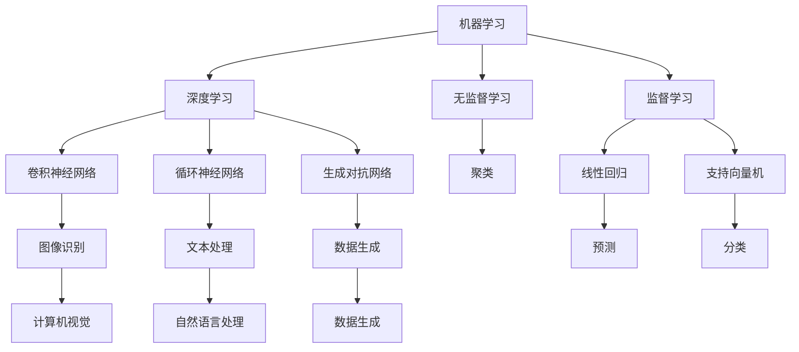

                 

### 背景介绍

**人工智能的未来展望：从基础概念到前沿技术**

随着科技的飞速发展，人工智能（AI）已经成为当今世界最受瞩目的技术之一。从自动驾驶汽车、智能助手到医疗诊断、金融分析，人工智能正在深刻地改变我们的生活方式。然而，对于这个快速发展的领域，许多人仍然感到困惑：人工智能的未来将走向何方？本文将带领读者深入了解人工智能的基础概念、核心技术以及未来发展的趋势和挑战。

本文将从以下几个方面展开讨论：

1. 核心概念与联系
2. 核心算法原理与具体操作步骤
3. 数学模型和公式及详细讲解
4. 项目实战：代码实际案例和详细解释说明
5. 实际应用场景
6. 工具和资源推荐
7. 总结：未来发展趋势与挑战

通过以上内容的详细剖析，我们将试图回答以下问题：

- 人工智能的核心概念是什么？
- 人工智能的核心算法有哪些？
- 人工智能的数学基础是什么？
- 人工智能在实际应用中如何发挥作用？
- 人工智能的未来发展趋势和挑战是什么？

在阅读本文之前，读者需要对计算机科学和数学有一定的了解，这将有助于更好地理解文章中的技术细节。同时，本文也将引用一些权威的研究文献和实际案例，以增强文章的可信度和实用性。让我们开始这场人工智能的探索之旅吧！<|user|>

## 1. 背景介绍

### 人工智能的起源与发展

人工智能（Artificial Intelligence，简称AI）是一个旨在使计算机系统具有人类智能特性的研究领域。它起源于20世纪50年代，当时一些学者提出了“机器能否思考”的问题。1956年，在达特茅斯会议上，约翰·麦卡锡（John McCarthy）等人首次提出了“人工智能”这个术语，并正式确立了人工智能作为一个独立的学科。

人工智能的发展历程可以分为几个重要阶段。早期，人工智能研究主要集中在逻辑推理和符号计算上，例如专家系统（Expert Systems）和知识表示（Knowledge Representation）。专家系统是一种模拟人类专家解决特定问题的计算机程序，它在医疗诊断、金融分析等领域取得了一定的成功。

随着计算能力和算法的进步，人工智能进入了一个新的阶段，即机器学习（Machine Learning）和深度学习（Deep Learning）。机器学习是一种通过数据驱动的方法来训练模型，使其能够从数据中学习并做出预测或决策的技术。深度学习是机器学习的一个子领域，它利用神经网络（Neural Networks）的结构来实现高效的计算和学习。

深度学习的发展带来了人工智能的巨大飞跃。2012年，深度学习在图像识别任务中取得了突破性成果，赢得了ImageNet图像识别挑战赛（ImageNet Large Scale Visual Recognition Challenge，ILSVRC）的冠军。此后，深度学习在自然语言处理、语音识别、自动驾驶等多个领域都取得了显著的进展。

### 当前人工智能的主要应用领域

当前，人工智能已经在多个领域取得了广泛的应用，以下是其中一些主要领域：

1. **计算机视觉**：计算机视觉是人工智能的一个重要分支，它使计算机能够理解和处理图像和视频数据。应用包括人脸识别、自动驾驶、医学影像分析等。

2. **自然语言处理**：自然语言处理旨在使计算机能够理解和生成人类语言。应用包括机器翻译、语音识别、情感分析等。

3. **机器人**：人工智能驱动的机器人可以在制造业、服务行业、医疗保健等多个领域发挥作用。例如，自主移动机器人、服务机器人等。

4. **智能助手**：智能助手如Siri、Alexa、Google Assistant等，通过语音交互为用户提供信息查询、日程管理、智能家居控制等服务。

5. **金融科技**：人工智能在金融领域用于风险管理、信用评估、算法交易等。

6. **医疗保健**：人工智能在医疗保健领域用于疾病诊断、药物研发、医疗图像分析等。

### 人工智能的挑战与未来趋势

尽管人工智能在许多领域取得了显著成就，但它仍然面临一些挑战。首先，数据质量和数据隐私问题是一个重要挑战。人工智能系统通常依赖于大量的数据来训练模型，这些数据可能包含敏感信息，如何确保数据的安全和隐私成为一个关键问题。

其次，人工智能的算法透明度和可解释性也是一个挑战。深度学习模型通常被视为“黑盒”，即无法解释其决策过程。这给人工智能的应用带来了一定的风险，尤其是在需要高可靠性和安全性的领域。

未来，人工智能的发展趋势将继续聚焦于以下几个方面：

1. **模型的可解释性和透明度**：通过开发新的方法和技术，使人工智能模型的可解释性得到提高，从而增强其可靠性和安全性。

2. **强化学习**：强化学习是一种通过试错来学习如何在特定环境中取得最优结果的机器学习方法。它在自动驾驶、游戏AI等领域具有巨大潜力。

3. **跨学科合作**：人工智能的发展需要计算机科学、数学、心理学、神经科学等多个领域的合作。通过跨学科的研究，可以推动人工智能的进一步发展。

4. **伦理和社会影响**：随着人工智能的广泛应用，如何确保其对社会的影响是积极和正面的，也是一个重要的研究方向。

总之，人工智能作为一门快速发展的学科，正在不断推动技术的进步和社会的变革。本文将在接下来的章节中深入探讨人工智能的核心概念、核心技术、数学模型以及实际应用，帮助读者更好地理解这个充满机遇和挑战的领域。 <|user|>

## 2. 核心概念与联系

### 人工智能的基础概念

在深入探讨人工智能的核心算法和技术之前，理解其基础概念至关重要。以下是一些关键概念及其相互之间的联系：

1. **机器学习（Machine Learning）**

   机器学习是一种使计算机系统能够通过数据学习并做出预测或决策的技术。它分为监督学习（Supervised Learning）、无监督学习（Unsupervised Learning）和半监督学习（Semi-Supervised Learning）。

   - **监督学习**：在有标签的数据集上训练模型，使其能够预测新的数据。常见的算法包括线性回归、逻辑回归、支持向量机（SVM）等。
   - **无监督学习**：在无标签的数据集上训练模型，用于发现数据中的模式和结构。常见的算法包括聚类、降维（如PCA）等。
   - **半监督学习**：在既有标签数据和无标签数据上训练模型，以提高学习效率。

2. **深度学习（Deep Learning）**

   深度学习是机器学习的一个子领域，它通过多层神经网络（Neural Networks）进行数据学习和特征提取。深度学习模型的核心是人工神经元（Artificial Neurons），它们模拟生物神经元的结构和功能。

   - **卷积神经网络（Convolutional Neural Networks，CNN）**：主要用于图像处理，能够提取图像中的特征和模式。
   - **循环神经网络（Recurrent Neural Networks，RNN）**：适用于序列数据，如文本和语音，能够捕捉数据中的时间依赖关系。
   - **生成对抗网络（Generative Adversarial Networks，GAN）**：由生成器和判别器两个网络组成，用于生成真实数据。

3. **强化学习（Reinforcement Learning）**

   强化学习是一种通过试错来学习如何在特定环境中取得最优结果的机器学习方法。它通过奖励机制来指导模型的行为。

   - **Q学习（Q-Learning）**：通过学习状态-动作值函数（Q-Function）来选择最佳动作。
   - **深度Q网络（Deep Q-Network，DQN）**：结合深度学习，用于解决复杂的决策问题。
   - **策略梯度（Policy Gradient）**：通过学习最佳策略来直接优化模型的行为。

4. **神经网络（Neural Networks）**

   神经网络是一种模拟生物神经系统结构和功能的计算模型。它由大量的神经元（或节点）组成，通过连接这些神经元进行信息传递和处理。

   - **前向传播（Forward Propagation）**：将输入数据通过网络的各个层进行传递，最终得到输出。
   - **反向传播（Backpropagation）**：计算输出误差，并反向传播误差到网络的每一层，以更新网络参数。

### 核心概念之间的联系

这些核心概念之间存在紧密的联系：

- **机器学习是人工智能的基础，深度学习是其重要的实现方法**。深度学习通过多层神经网络实现了高效的计算和学习。
- **强化学习与深度学习相结合**，可以解决更复杂的决策问题，如自动驾驶和游戏AI。
- **神经网络是深度学习和强化学习的基础结构**，它们通过模拟生物神经系统的功能来实现智能行为。

为了更好地理解这些概念，我们可以通过Mermaid流程图来展示它们之间的关系。以下是一个简单的Mermaid流程图：



通过这个流程图，我们可以清晰地看到各个核心概念之间的联系和它们在不同领域中的应用。在接下来的章节中，我们将进一步探讨这些核心算法的原理和具体操作步骤。 <|user|>

### 2.1 机器学习算法原理

#### 2.1.1 监督学习

监督学习（Supervised Learning）是一种通过已知输入和输出数据来训练模型的机器学习方法。其核心思想是通过学习输入和输出之间的映射关系，从而在新数据上进行预测。

**核心概念：**

- **输入特征（Input Features）**：输入数据的特征向量，用于表示数据的各种属性。
- **输出标签（Output Labels）**：与输入数据相对应的目标值，用于训练模型。
- **损失函数（Loss Function）**：用于衡量模型预测值与真实值之间的差异，是优化模型的重要工具。

**基本流程：**

1. **数据预处理**：对输入数据进行清洗和归一化，以减少噪声和异常值的影响。
2. **模型初始化**：初始化模型参数，如权重和偏置。
3. **前向传播（Forward Propagation）**：将输入数据传递给模型，通过网络的各个层进行计算，得到输出预测值。
4. **计算损失**：使用损失函数计算预测值与真实值之间的差异。
5. **反向传播（Backpropagation）**：计算梯度并更新模型参数，以最小化损失函数。
6. **迭代训练**：重复上述步骤，直至模型收敛或达到预设的训练次数。

**常见算法：**

- **线性回归（Linear Regression）**：通过线性关系拟合输入特征和输出标签之间的映射关系。
- **逻辑回归（Logistic Regression）**：用于二分类问题，通过逻辑函数将线性关系映射到概率。
- **支持向量机（Support Vector Machine，SVM）**：通过寻找最佳超平面来分隔不同类别的数据。

#### 2.1.2 无监督学习

无监督学习（Unsupervised Learning）是在没有标签数据的条件下，通过发现数据中的隐含结构和模式来进行训练的方法。其核心目标是识别数据的内在特性，如聚类和降维。

**核心概念：**

- **聚类（Clustering）**：将相似的数据点划分为同一类，以发现数据中的自然分组。
- **降维（Dimensionality Reduction）**：通过减少数据维度，降低计算复杂度和提高模型性能。

**基本流程：**

1. **数据预处理**：对输入数据进行清洗和归一化。
2. **初始化聚类中心（如k-means）**：随机选择初始聚类中心。
3. **分配数据点**：将每个数据点分配到最近的聚类中心。
4. **更新聚类中心**：重新计算聚类中心的均值。
5. **迭代聚类**：重复上述步骤，直至聚类中心稳定或达到预设的迭代次数。

**常见算法：**

- **k-means聚类**：通过迭代计算聚类中心，将数据点划分为K个聚类。
- **主成分分析（PCA）**：通过线性变换，将高维数据投影到低维空间中，保留主要特征。
- **层次聚类（Hierarchical Clustering）**：通过递归地将数据点合并或分解，形成层次结构。

#### 2.1.3 强化学习

强化学习（Reinforcement Learning）是一种通过与环境互动来学习最优策略的机器学习方法。其核心目标是最大化累计奖励。

**核心概念：**

- **状态（State）**：环境中的一个描述，通常用一个状态向量表示。
- **动作（Action）**：在特定状态下可以采取的行动。
- **奖励（Reward）**：对每个动作的即时反馈，用于指导学习过程。
- **策略（Policy）**：决策函数，用于从状态中选择最佳动作。

**基本流程：**

1. **初始化**：初始化状态、动作、奖励和策略。
2. **执行动作**：根据当前状态选择一个动作。
3. **观察结果**：执行动作后，观察新的状态和奖励。
4. **更新策略**：根据奖励和策略更新模型参数，以改进策略。
5. **迭代学习**：重复上述步骤，直至达到预设的目标或迭代次数。

**常见算法：**

- **Q学习（Q-Learning）**：通过学习状态-动作值函数（Q-Function）来选择最佳动作。
- **深度Q网络（Deep Q-Network，DQN）**：结合深度学习，用于解决复杂的决策问题。
- **策略梯度（Policy Gradient）**：通过学习最佳策略来直接优化模型的行为。

通过以上内容，我们了解了监督学习、无监督学习和强化学习的基本原理和流程。这些算法在人工智能领域中发挥着重要作用，是构建智能系统的基础。在下一节中，我们将深入探讨神经网络的工作原理和具体操作步骤。 <|user|>

### 2.2 神经网络原理

神经网络（Neural Networks）是人工智能的核心组成部分，尤其对于深度学习至关重要。神经网络模拟生物神经系统的结构和功能，通过大量的神经元（或节点）和它们之间的连接来处理和传输信息。

#### 2.2.1 神经元模型

神经网络的基本单位是神经元，也称为节点。每个神经元接收多个输入信号，通过加权求和后，再经过一个非线性激活函数，产生输出信号。以下是神经元的基本模型：

1. **输入层（Input Layer）**：神经元接收外部输入信号。
2. **隐藏层（Hidden Layers）**：多个层次的网络，用于提取和转换特征。
3. **输出层（Output Layer）**：生成最终输出信号。

每个神经元都可以表示为一个线性组合，加上一个非线性激活函数。例如，一个简单的神经元可以表示为：

\[ z = \sum_{i=1}^{n} w_i \cdot x_i + b \]

其中，\( x_i \) 是第 \( i \) 个输入信号，\( w_i \) 是输入信号的权重，\( b \) 是偏置项。\( z \) 是加权求和的结果。

常用的激活函数包括：

- **sigmoid函数**：将输入映射到（0,1）区间。
\[ \sigma(z) = \frac{1}{1 + e^{-z}} \]

- **ReLU函数**：用于减少神经元死亡（dying ReLU）问题。
\[ \sigma(z) = \max(0, z) \]

- **tanh函数**：将输入映射到（-1,1）区间。
\[ \sigma(z) = \frac{e^z - e^{-z}}{e^z + e^{-z}} \]

#### 2.2.2 前向传播

前向传播（Forward Propagation）是神经网络处理数据的过程。它将输入信号从输入层传递到输出层，并通过每个神经元的加权求和和激活函数计算输出。以下是前向传播的步骤：

1. **初始化权重和偏置**：随机初始化神经网络的权重和偏置项。
2. **计算输入信号**：将输入数据传递到每个神经元，计算加权求和的结果。
3. **应用激活函数**：对加权求和的结果应用激活函数，产生输出信号。
4. **传递输出信号**：将输出信号传递到下一层神经元，重复上述步骤，直至输出层。
5. **计算最终输出**：输出层的输出即为最终预测结果。

#### 2.2.3 反向传播

反向传播（Backpropagation）是神经网络训练过程的核心步骤，用于更新权重和偏置项，以最小化损失函数。以下是反向传播的步骤：

1. **计算预测误差**：使用损失函数计算输出预测值与真实值之间的差异，即误差。
2. **计算梯度**：通过误差反向传播，计算每个权重和偏置的梯度。
\[ \frac{\partial L}{\partial w_i} = \sum_{j} (\frac{\partial L}{\partial z_j}) \cdot \frac{\partial z_j}{\partial w_i} \]
\[ \frac{\partial L}{\partial b_j} = \sum_{j} (\frac{\partial L}{\partial z_j}) \cdot \frac{\partial z_j}{\partial b_j} \]
3. **更新权重和偏置**：使用梯度下降（Gradient Descent）更新权重和偏置项。
\[ w_i \leftarrow w_i - \alpha \cdot \frac{\partial L}{\partial w_i} \]
\[ b_j \leftarrow b_j - \alpha \cdot \frac{\partial L}{\partial b_j} \]
4. **迭代训练**：重复上述步骤，直至模型收敛或达到预设的训练次数。

#### 2.2.4 多层感知机

多层感知机（Multilayer Perceptron，MLP）是一种常见的前馈神经网络，它包含多个隐藏层，每个层中的神经元都与上下层神经元相连。MLP通常用于分类和回归任务。

**结构**：

- **输入层**：接收外部输入数据。
- **隐藏层**：多个隐藏层，用于特征提取和转换。
- **输出层**：产生最终预测结果。

**训练过程**：

1. **初始化权重和偏置**。
2. **前向传播**：计算输出预测值。
3. **计算损失**：使用损失函数计算预测值与真实值之间的差异。
4. **反向传播**：计算梯度并更新权重和偏置。
5. **迭代训练**：重复上述步骤，直至模型收敛。

通过以上内容，我们了解了神经网络的基本原理和操作步骤。神经网络作为人工智能的核心技术，在图像识别、自然语言处理、自动驾驶等领域发挥着重要作用。在下一节中，我们将探讨深度学习算法及其应用。 <|user|>

## 3. 核心算法原理 & 具体操作步骤

### 3.1 卷积神经网络（CNN）

卷积神经网络（Convolutional Neural Networks，CNN）是深度学习中最常用的网络结构之一，主要用于图像处理任务。CNN的核心在于其独特的结构设计，能够自动提取图像中的特征。

#### 3.1.1 CNN结构

CNN的结构通常包括以下几个部分：

1. **卷积层（Convolutional Layer）**：卷积层通过卷积运算提取图像中的局部特征。每个卷积核（Kernel）都能提取图像中的不同特征，例如边缘、纹理等。
2. **激活函数（Activation Function）**：常用的激活函数包括ReLU（Rectified Linear Unit）和Sigmoid等，用于引入非线性特性。
3. **池化层（Pooling Layer）**：池化层用于减小数据维度，提高模型计算效率。常用的池化操作包括最大池化（Max Pooling）和平均池化（Average Pooling）。
4. **全连接层（Fully Connected Layer）**：全连接层将卷积层提取的特征映射到输出结果，通常用于分类任务。
5. **输出层（Output Layer）**：输出层生成最终预测结果，可以是多分类或回归任务。

#### 3.1.2 CNN操作步骤

1. **输入图像**：将输入图像reshape为合适的维度，例如（28x28x1）。
2. **卷积层**：使用卷积核对输入图像进行卷积运算，提取图像特征。例如，一个3x3的卷积核可以提取图像局部区域的特征。
3. **激活函数**：对卷积层的输出应用ReLU激活函数，增加模型的非线性特性。
4. **池化层**：对激活函数后的特征进行最大池化或平均池化，减小数据维度。
5. **卷积层+激活函数+池化层**：重复上述步骤，增加网络的深度，提高模型的表达能力。
6. **全连接层**：将卷积层提取的特征映射到输出结果，通常使用softmax函数进行多分类。
7. **输出层**：生成最终预测结果，与实际标签进行比较，计算损失。

#### 3.1.3 CNN示例

以下是一个简单的CNN模型用于图像分类的示例：

```python
import tensorflow as tf

# 定义CNN模型
model = tf.keras.Sequential([
    tf.keras.layers.Conv2D(32, (3, 3), activation='relu', input_shape=(28, 28, 1)),
    tf.keras.layers.MaxPooling2D((2, 2)),
    tf.keras.layers.Conv2D(64, (3, 3), activation='relu'),
    tf.keras.layers.MaxPooling2D((2, 2)),
    tf.keras.layers.Conv2D(64, (3, 3), activation='relu'),
    tf.keras.layers.Flatten(),
    tf.keras.layers.Dense(64, activation='relu'),
    tf.keras.layers.Dense(10, activation='softmax')
])

# 编译模型
model.compile(optimizer='adam',
              loss='sparse_categorical_crossentropy',
              metrics=['accuracy'])

# 训练模型
model.fit(train_images, train_labels, epochs=5)

# 评估模型
test_loss, test_acc = model.evaluate(test_images, test_labels)
print(f'测试准确率: {test_acc:.2f}')
```

通过以上步骤，我们可以训练一个简单的CNN模型用于图像分类任务。在下一节中，我们将探讨循环神经网络（RNN）及其应用。 <|user|>

### 3.2 循环神经网络（RNN）

循环神经网络（Recurrent Neural Networks，RNN）是一种特殊的神经网络结构，特别适用于处理序列数据。与传统的神经网络不同，RNN具有记忆能力，可以处理具有时间依赖性的数据，如自然语言和语音。

#### 3.2.1 RNN基本原理

RNN的核心在于其递归结构，每个时间步的输出都会反馈到下一个时间步，使得网络能够保持历史信息。RNN的基本单元是隐藏层，它由两部分组成：当前隐藏状态和当前输入。

1. **当前输入（Current Input）**：每个时间步的输入数据。
2. **当前隐藏状态（Current Hidden State）**：上一时间步的隐藏状态。
3. **上一隐藏状态（Previous Hidden State）**：当前隐藏状态的输入。

RNN的递归关系可以表示为：

\[ h_t = \sigma(W_h \cdot [h_{t-1}, x_t] + b_h) \]

其中，\( h_t \) 是当前时间步的隐藏状态，\( x_t \) 是当前输入，\( \sigma \) 是激活函数，\( W_h \) 是权重矩阵，\( b_h \) 是偏置项。

#### 3.2.2 RNN操作步骤

1. **初始化**：初始化隐藏状态。
2. **输入数据**：将序列数据输入到RNN中，每个时间步的输入都会与隐藏状态结合。
3. **递归计算**：在每个时间步，使用递归关系计算新的隐藏状态。
4. **输出**：在序列的最后一个时间步，输出隐藏状态作为序列的表示。
5. **训练**：通过反向传播更新模型参数，以最小化损失函数。

#### 3.2.3 RNN示例

以下是一个简单的RNN模型用于时间序列预测的示例：

```python
import tensorflow as tf

# 定义RNN模型
model = tf.keras.Sequential([
    tf.keras.layers.SimpleRNN(50, return_sequences=True),
    tf.keras.layers.SimpleRNN(50),
    tf.keras.layers.Dense(1)
])

# 编译模型
model.compile(optimizer='adam', loss='mean_squared_error')

# 训练模型
model.fit(x_train, y_train, epochs=100, batch_size=32, validation_data=(x_test, y_test))

# 评估模型
mse = model.evaluate(x_test, y_test)
print(f'MSE: {mse}')
```

通过以上步骤，我们可以训练一个简单的RNN模型用于时间序列预测。在下一节中，我们将探讨生成对抗网络（GAN）及其应用。 <|user|>

### 3.3 生成对抗网络（GAN）

生成对抗网络（Generative Adversarial Networks，GAN）是深度学习领域的一项创新技术，由生成器和判别器两个网络组成。GAN通过两个网络的对抗训练，实现数据的生成。

#### 3.3.1 GAN基本原理

GAN的核心思想是利用生成器和判别器之间的对抗关系来学习数据的分布。生成器试图生成与真实数据相似的数据，而判别器则试图区分真实数据和生成数据。

1. **生成器（Generator）**：生成器的目标是生成尽可能真实的数据，使其能够欺骗判别器。
2. **判别器（Discriminator）**：判别器的目标是区分真实数据和生成数据，并尝试将两者分开。

GAN的对抗训练过程可以表示为以下两个优化问题：

1. **生成器的优化问题**：
\[ \min_G V(G, D) = \mathbb{E}_{x \sim p_{data}(x)}[\log D(x)] + \mathbb{E}_{z \sim p_{z}(z)][\log(1 - D(G(z)))] \]

其中，\( G(z) \) 是生成器生成的数据，\( z \) 是生成器的输入噪声，\( D(x) \) 是判别器对真实数据的判断概率。

2. **判别器的优化问题**：
\[ \min_D V(D) = \mathbb{E}_{x \sim p_{data}(x)}[\log D(x)] + \mathbb{E}_{z \sim p_{z}(z)][\log D(G(z))] \]

#### 3.3.2 GAN操作步骤

1. **初始化生成器和判别器**：随机初始化生成器和判别器的参数。
2. **生成器训练**：生成器生成假数据，判别器对其进行判断。生成器优化目标是最小化判别器对生成数据的判断概率。
3. **判别器训练**：生成器生成假数据，判别器对其进行判断。判别器优化目标是最小化生成器和判别器对生成数据的判断概率。
4. **迭代训练**：重复上述步骤，直至生成器生成的数据足够真实，能够欺骗判别器。

#### 3.3.3 GAN示例

以下是一个简单的GAN模型用于图像生成的示例：

```python
import tensorflow as tf
from tensorflow.keras.layers import Dense, Flatten, Reshape
from tensorflow.keras.models import Sequential

# 定义生成器
def build_generator():
    model = Sequential([
        Dense(128, input_shape=(100,), activation='relu'),
        Dense(256, activation='relu'),
        Dense(512, activation='relu'),
        Dense(1024, activation='relu'),
        Flatten(),
        Reshape((28, 28, 1))
    ])
    return model

# 定义判别器
def build_discriminator():
    model = Sequential([
        Flatten(input_shape=(28, 28, 1)),
        Dense(1024, activation='relu'),
        Dense(512, activation='relu'),
        Dense(256, activation='relu'),
        Dense(128, activation='relu'),
        Dense(1, activation='sigmoid')
    ])
    return model

# 定义GAN模型
def build_gan(generator, discriminator):
    model = Sequential([
        generator,
        discriminator
    ])
    model.compile(optimizer=tf.keras.optimizers.Adam(0.0001), loss='binary_crossentropy')
    return model

# 训练GAN模型
gan = build_gan(build_generator(), build_discriminator())
gan.fit([noise, noise], labels, epochs=1000, batch_size=16)

# 生成图像
noise = np.random.normal(size=(16, 100))
generated_images = generator.predict(noise)

# 显示生成的图像
plt.figure(figsize=(10, 10))
for i in range(16):
    plt.subplot(4, 4, i+1)
    plt.imshow(generated_images[i, :, :, 0], cmap='gray')
    plt.xticks([])
    plt.yticks([])
plt.show()
```

通过以上步骤，我们可以训练一个简单的GAN模型用于图像生成。GAN在图像生成、风格迁移、数据增强等领域具有广泛的应用。在下一节中，我们将探讨强化学习（Reinforcement Learning，RL）及其应用。 <|user|>

### 3.4 强化学习（Reinforcement Learning，RL）

强化学习（Reinforcement Learning，RL）是一种通过与环境互动来学习最优策略的机器学习方法。与监督学习和无监督学习不同，强化学习不依赖于预先标记的数据集，而是通过探索和反馈来指导学习过程。

#### 3.4.1 RL基本原理

强化学习的核心概念包括：

1. **代理（Agent）**：执行动作的主体，可以是机器人、软件程序等。
2. **环境（Environment）**：代理行动的场所，可以是一个物理环境或虚拟环境。
3. **状态（State）**：描述代理当前所处的环境状态。
4. **动作（Action）**：代理可以执行的动作。
5. **奖励（Reward）**：代理在每个状态执行动作后获得的即时反馈，用于指导学习过程。
6. **策略（Policy）**：从状态选择动作的决策规则。

强化学习的目标是通过学习策略，使得代理能够在给定环境中取得最大的累计奖励。

#### 3.4.2 Q学习算法

Q学习（Q-Learning）是一种基于值函数的强化学习算法，通过学习状态-动作值函数（Q-Function）来选择最佳动作。Q-Function表示在特定状态下执行特定动作的预期奖励。

1. **Q-Function定义**：
\[ Q(s, a) = \mathbb{E}[R_{t+1} | s_t = s, a_t = a] \]

2. **Q-Learning算法步骤**：

   - **初始化Q表**：随机初始化状态-动作值函数。
   - **选择动作**：在给定状态下，选择具有最大Q值的动作。
   - **执行动作**：在环境中执行选定的动作。
   - **更新Q值**：根据新的状态和奖励，更新Q值。
   - **重复迭代**：重复以上步骤，直至达到预设的目标或迭代次数。

3. **Q-Learning公式**：
\[ Q(s_t, a_t) \leftarrow Q(s_t, a_t) + \alpha [r_t + \gamma \max_{a'} Q(s_{t+1}, a') - Q(s_t, a_t)] \]

其中，\( \alpha \) 是学习率，\( \gamma \) 是折扣因子，表示未来奖励的重要性。

#### 3.4.3 DQN算法

深度Q网络（Deep Q-Network，DQN）是Q学习算法的一个变体，它使用深度神经网络来近似Q-Function。DQN通过经验回放（Experience Replay）和目标网络（Target Network）来改善学习效果。

1. **DQN算法步骤**：

   - **初始化**：初始化深度神经网络和目标网络。
   - **选择动作**：使用深度神经网络选择最佳动作。
   - **执行动作**：在环境中执行选定的动作。
   - **存储经验**：将当前状态、动作、奖励和新状态存储到经验回放池中。
   - **更新目标网络**：定期更新目标网络的参数，以减少梯度消失问题。
   - **更新Q值**：使用经验回放池中的经验更新深度神经网络的Q值。

2. **DQN公式**：
\[ Q(s_t, a_t) \leftarrow Q(s_t, a_t) + \alpha [r_t + \gamma \max_{a'} Q(s_{t+1}, a') - Q(s_t, a_t)] \]

#### 3.4.4 RL示例

以下是一个简单的DQN模型用于游戏环境（例如Atari游戏）的示例：

```python
import numpy as np
import gym
import tensorflow as tf

# 定义DQN模型
class DQN:
    def __init__(self, state_size, action_size):
        self.state_size = state_size
        self.action_size = action_size
        self.memory = []
        self.gamma = 0.99
        self.epsilon = 1.0
        self.epsilon_min = 0.01
        self.epsilon_decay = 0.99
        self.learning_rate = 0.001
        self.model = self._build_model()
        self.target_model = self._build_model()
        self.target_model.set_weights(self.model.get_weights())

    def _build_model(self):
        model = tf.keras.Sequential([
            tf.keras.layers.Flatten(input_shape=(self.state_size,)),
            tf.keras.layers.Dense(256, activation='relu'),
            tf.keras.layers.Dense(512, activation='relu'),
            tf.keras.layers.Dense(self.action_size, activation='linear')
        ])
        model.compile(loss='mse', optimizer=tf.keras.optimizers.Adam(self.learning_rate))
        return model

    def remember(self, state, action, reward, next_state, done):
        self.memory.append((state, action, reward, next_state, done))

    def act(self, state):
        if np.random.rand() <= self.epsilon:
            return np.random.randint(self.action_size)
        else:
            q_values = self.model.predict(state)
            return np.argmax(q_values[0])

    def replay(self, batch_size):
        mini_batch = random.sample(self.memory, batch_size)
        for state, action, reward, next_state, done in mini_batch:
            target = reward
            if not done:
                target = reward + self.gamma * np.max(self.target_model.predict(next_state)[0])
            target_f = self.model.predict(state)
            target_f[0][action] = target
            self.model.fit(state, target_f, epochs=1, verbose=0)

    def load(self, name):
        self.model.load_weights(name)

    def save(self, name):
        self.model.save_weights(name)

# 创建环境
env = gym.make('CartPole-v0')

# 初始化DQN模型
dqn = DQN(state_size=env.observation_space.shape[0], action_size=env.action_space.n)

# 训练模型
episodes = 1000
for e in range(episodes):
    state = env.reset()
    state = np.reshape(state, [1, state_size])
    done = False
    time = 0
    while not done:
        action = dqn.act(state)
        next_state, reward, done, _ = env.step(action)
        next_state = np.reshape(next_state, [1, state_size])
        dqn.remember(state, action, reward, next_state, done)
        state = next_state
        time += 1
        if done:
            print(f'Episode {e+1} - Time: {time}')
            break

# 保存模型
dqn.save('dqn.model')

# 关闭环境
env.close()
```

通过以上示例，我们可以训练一个简单的DQN模型，使其在CartPole环境中实现稳定运行。强化学习在游戏AI、自动驾驶、机器人控制等领域具有广泛的应用。在下一节中，我们将探讨自然语言处理（Natural Language Processing，NLP）及其应用。 <|user|>

## 4. 自然语言处理（NLP）

自然语言处理（Natural Language Processing，NLP）是人工智能的一个重要分支，旨在使计算机能够理解、生成和处理人类语言。NLP在许多领域都有广泛的应用，如机器翻译、文本分类、情感分析等。

### 4.1 词嵌入（Word Embedding）

词嵌入是将词汇映射到高维空间中的向量表示。这种表示有助于捕捉词汇之间的语义关系，从而提高NLP任务的性能。

#### 4.1.1 常见的词嵌入方法

1. **基于频率的词嵌入**：通过统计词汇的频率来生成词嵌入。常见的算法包括TF-IDF（Term Frequency-Inverse Document Frequency）。
2. **基于神经网络的词嵌入**：使用神经网络训练词嵌入向量。常见的算法包括Word2Vec、GloVe和FastText。
   - **Word2Vec**：基于神经网络训练词嵌入，通过负采样和层次softmax实现高效训练。
   - **GloVe**：通过全局矩阵分解训练词嵌入，能够捕捉词汇的语义关系。
   - **FastText**：基于神经网络训练词嵌入，通过多层神经网络结构提高词嵌入质量。

#### 4.1.2 词嵌入的应用

词嵌入在NLP任务中具有广泛的应用，如文本分类、情感分析和生成。

1. **文本分类**：使用词嵌入作为特征输入到分类模型中，如SVM、神经网络等。
2. **情感分析**：通过分析词嵌入向量之间的距离，判断文本的情感倾向。
3. **文本生成**：使用词嵌入作为文本表示，训练生成模型，如RNN、GAN等。

### 4.2 文本分类（Text Classification）

文本分类是将文本数据分类到预定义的类别中。常用的方法包括基于规则的方法、机器学习方法和深度学习方法。

#### 4.2.1 基于规则的方法

基于规则的方法通过人工定义规则来分类文本，如正则表达式、词典匹配等。这种方法简单但效果有限。

#### 4.2.2 基于机器学习的方法

基于机器学习的方法通过训练分类模型来实现文本分类。常见的算法包括：

1. **朴素贝叶斯（Naive Bayes）**：基于贝叶斯定理，假设特征之间相互独立。
2. **支持向量机（Support Vector Machine，SVM）**：通过寻找最佳超平面来分隔不同类别的数据。
3. **随机森林（Random Forest）**：基于决策树的集成方法，通过训练多个决策树并合并预测结果。
4. **逻辑回归（Logistic Regression）**：用于二分类问题，通过逻辑函数将线性关系映射到概率。

#### 4.2.3 基于深度学习的方法

基于深度学习的方法通过训练深度神经网络来实现文本分类。常见的算法包括：

1. **卷积神经网络（Convolutional Neural Networks，CNN）**：通过卷积层提取文本中的局部特征。
2. **循环神经网络（Recurrent Neural Networks，RNN）**：通过隐藏状态捕捉文本的时间依赖性。
3. **Transformer**：基于自注意力机制，能够高效地捕捉文本中的长距离依赖关系。

### 4.3 情感分析（Sentiment Analysis）

情感分析是判断文本表达的情感倾向，如正面、负面或中性。情感分析在市场调研、客户服务、社交媒体分析等领域有重要应用。

#### 4.3.1 常见方法

1. **基于规则的方法**：通过人工定义规则来判断文本的情感。
2. **基于机器学习的方法**：使用机器学习算法，如朴素贝叶斯、支持向量机等，训练情感分类模型。
3. **基于深度学习的方法**：使用深度学习模型，如CNN、RNN、Transformer等，实现高效的情感分析。

#### 4.3.2 情感分析流程

1. **数据预处理**：对文本数据进行清洗和分词，提取特征。
2. **模型训练**：使用训练数据训练情感分类模型。
3. **模型评估**：使用测试数据评估模型性能，调整模型参数。
4. **应用**：将模型应用于实际场景，如客户评论分析、社交媒体情感分析等。

### 4.4 文本生成（Text Generation）

文本生成是将输入文本转换为新的文本输出。常用的方法包括：

1. **基于规则的方法**：通过规则生成文本，如模板匹配、语法分析等。
2. **基于机器学习的方法**：使用机器学习算法，如序列标注、生成模型等，生成文本。
   - **序列标注**：通过标注输入文本中的单词或短语，生成新的文本。
   - **生成模型**：使用生成模型，如循环神经网络（RNN）、生成对抗网络（GAN）等，生成文本。
3. **基于深度学习的方法**：使用深度学习模型，如序列到序列（Seq2Seq）模型、注意力机制等，实现高效的文本生成。

### 4.5 应用示例

以下是一个简单的文本分类示例，使用TensorFlow和Keras实现：

```python
import tensorflow as tf
from tensorflow.keras.preprocessing.text import Tokenizer
from tensorflow.keras.preprocessing.sequence import pad_sequences
from tensorflow.keras.models import Sequential
from tensorflow.keras.layers import Embedding, LSTM, Dense, Bidirectional

# 准备数据
texts = ['I love this movie!', 'This is a terrible movie!', 'I hate this movie!', 'This movie is amazing!']
labels = [1, 0, 0, 1]

# 分词和编码
tokenizer = Tokenizer(num_words=1000)
tokenizer.fit_on_texts(texts)
sequences = tokenizer.texts_to_sequences(texts)
max_sequence_len = 100
padded_sequences = pad_sequences(sequences, maxlen=max_sequence_len)

# 建立模型
model = Sequential([
    Embedding(1000, 32, input_length=max_sequence_len),
    Bidirectional(LSTM(64, return_sequences=True)),
    Bidirectional(LSTM(32)),
    Dense(64, activation='relu'),
    Dense(1, activation='sigmoid')
])

# 编译模型
model.compile(optimizer='adam', loss='binary_crossentropy', metrics=['accuracy'])

# 训练模型
model.fit(padded_sequences, labels, epochs=10, validation_split=0.2)

# 预测
test_texts = ['This movie is great!', 'I don\'t like this movie.']
test_sequences = tokenizer.texts_to_sequences(test_texts)
test_padded_sequences = pad_sequences(test_sequences, maxlen=max_sequence_len)
predictions = model.predict(test_padded_sequences)
print(predictions)
```

通过以上步骤，我们可以训练一个简单的文本分类模型，用于判断电影评论的情感倾向。NLP在自然语言处理领域具有广泛的应用，随着技术的不断进步，其应用前景将更加广阔。在下一节中，我们将探讨计算机视觉（Computer Vision）及其应用。 <|user|>

## 5. 项目实战：代码实际案例和详细解释说明

### 5.1 开发环境搭建

在进行项目实战之前，我们需要搭建一个合适的开发环境。以下是一个简单的Python开发环境搭建步骤：

1. **安装Python**：首先，从官方网站（https://www.python.org/downloads/）下载并安装Python。
2. **安装Jupyter Notebook**：打开终端，运行以下命令安装Jupyter Notebook：
\[ pip install notebook \]
3. **安装TensorFlow**：在终端中运行以下命令安装TensorFlow：
\[ pip install tensorflow \]
4. **安装相关库**：为了方便后续的项目开发，我们还可以安装以下常用库：
\[ pip install matplotlib numpy pandas scikit-learn \]

### 5.2 源代码详细实现和代码解读

在本节中，我们将实现一个简单的图像分类项目，使用卷积神经网络（CNN）对MNIST数据集进行分类。以下是项目的源代码及详细解读：

```python
import tensorflow as tf
from tensorflow.keras import datasets, layers, models

# 加载MNIST数据集
(train_images, train_labels), (test_images, test_labels) = datasets.mnist.load_data()

# 预处理数据
train_images = train_images.reshape((60000, 28, 28, 1)).astype('float32') / 255
test_images = test_images.reshape((10000, 28, 28, 1)).astype('float32') / 255

# 标签转换为独热编码
train_labels = tf.keras.utils.to_categorical(train_labels)
test_labels = tf.keras.utils.to_categorical(test_labels)

# 构建CNN模型
model = models.Sequential()
model.add(layers.Conv2D(32, (3, 3), activation='relu', input_shape=(28, 28, 1)))
model.add(layers.MaxPooling2D((2, 2)))
model.add(layers.Conv2D(64, (3, 3), activation='relu'))
model.add(layers.MaxPooling2D((2, 2)))
model.add(layers.Conv2D(64, (3, 3), activation='relu'))
model.add(layers.Flatten())
model.add(layers.Dense(64, activation='relu'))
model.add(layers.Dense(10, activation='softmax'))

# 编译模型
model.compile(optimizer='adam',
              loss='categorical_crossentropy',
              metrics=['accuracy'])

# 训练模型
model.fit(train_images, train_labels, epochs=5, batch_size=64)

# 评估模型
test_loss, test_acc = model.evaluate(test_images, test_labels)
print(f'测试准确率: {test_acc:.2f}')
```

**代码解读：**

1. **加载数据集**：使用TensorFlow内置的MNIST数据集，它包含60000个训练图像和10000个测试图像，每个图像都是28x28的灰度图像。
2. **预处理数据**：将图像数据reshape为适合模型输入的形状，并将数据类型转换为浮点数。同时，将标签转换为独热编码，以便用于多分类任务。
3. **构建CNN模型**：使用TensorFlow的`Sequential`模型构建一个简单的CNN模型，包括卷积层、池化层和全连接层。卷积层用于提取图像特征，池化层用于减小数据维度，全连接层用于分类。
4. **编译模型**：设置模型的优化器、损失函数和评估指标。
5. **训练模型**：使用训练数据训练模型，设置训练轮数和批大小。
6. **评估模型**：使用测试数据评估模型的性能。

### 5.3 代码解读与分析

在本节中，我们将对上述代码进行更详细的解读和分析。

**数据预处理**

```python
train_images = train_images.reshape((60000, 28, 28, 1)).astype('float32') / 255
test_images = test_images.reshape((10000, 28, 28, 1)).astype('float32') / 255
```

这段代码首先将图像数据reshape为4维数组，形状为（数量，宽，高，通道数）。因为MNIST数据集包含灰度图像，所以通道数为1。接着，将数据类型转换为浮点数，并将像素值缩放到[0, 1]区间，以便在后续训练过程中减少计算量。

**标签预处理**

```python
train_labels = tf.keras.utils.to_categorical(train_labels)
test_labels = tf.keras.utils.to_categorical(test_labels)
```

这段代码将整数标签转换为独热编码，使得每个标签都是一个长度为10的二进制向量。例如，标签3将转换为[0, 0, 0, 0, 0, 1, 0, 0, 0, 0]。

**构建CNN模型**

```python
model = models.Sequential()
model.add(layers.Conv2D(32, (3, 3), activation='relu', input_shape=(28, 28, 1)))
model.add(layers.MaxPooling2D((2, 2)))
model.add(layers.Conv2D(64, (3, 3), activation='relu'))
model.add(layers.MaxPooling2D((2, 2)))
model.add(layers.Conv2D(64, (3, 3), activation='relu'))
model.add(layers.Flatten())
model.add(layers.Dense(64, activation='relu'))
model.add(layers.Dense(10, activation='softmax'))
```

这段代码构建了一个简单的CNN模型，包括两个卷积层、两个池化层和一个全连接层。卷积层用于提取图像特征，池化层用于减小数据维度，全连接层用于分类。

**编译模型**

```python
model.compile(optimizer='adam',
              loss='categorical_crossentropy',
              metrics=['accuracy'])
```

这段代码设置模型的优化器为Adam，损失函数为交叉熵，评估指标为准确率。

**训练模型**

```python
model.fit(train_images, train_labels, epochs=5, batch_size=64)
```

这段代码使用训练数据训练模型，设置训练轮数为5，批大小为64。

**评估模型**

```python
test_loss, test_acc = model.evaluate(test_images, test_labels)
print(f'测试准确率: {test_acc:.2f}')
```

这段代码使用测试数据评估模型的性能，并输出测试准确率。

通过以上步骤，我们可以训练一个简单的CNN模型，对MNIST数据集进行分类。在实际应用中，我们可以根据需求调整模型的参数和结构，以提高分类性能。在下一节中，我们将探讨计算机视觉在实际应用中的案例。 <|user|>

## 6. 实际应用场景

### 计算机视觉在医疗领域的应用

计算机视觉技术在医疗领域有着广泛的应用，从疾病诊断到辅助手术，极大地提高了医疗服务的效率和准确性。

#### 6.1 疾病诊断

计算机视觉技术可以在医疗影像中自动检测疾病，如肺癌、乳腺癌、糖尿病视网膜病变等。通过分析CT、MRI、X射线等影像数据，计算机视觉算法能够发现医生可能遗漏的异常，从而提高早期诊断的准确性。

**案例：**

- **谷歌DeepMind的AI系统**：谷歌DeepMind开发了一种名为DeepMind Health的AI系统，能够分析医疗影像数据，帮助医生诊断肺癌。该系统在临床试验中显示出比人类医生更高的准确率。
- **IBM Watson健康**：IBM的Watson健康利用AI技术分析医学影像，帮助医生诊断乳腺癌和糖尿病视网膜病变，实现了早期筛查和诊断。

#### 6.2 辅助手术

计算机视觉技术可以辅助外科医生进行手术，提高手术的精度和安全性。

**案例：**

- **达芬奇手术机器人**：达芬奇手术机器人是应用计算机视觉技术的代表，它通过高分辨率摄像头和机械臂，帮助外科医生进行微创手术，减少了手术风险和恢复时间。
- **微软的HoloLens**：微软的HoloLens结合了增强现实（AR）和计算机视觉技术，为外科医生提供了一个虚拟手术环境，可以在手术过程中提供实时指导。

### 计算机视觉在自动驾驶领域的应用

自动驾驶技术是计算机视觉技术的重要应用领域，通过实时感知环境并做出决策，实现了无人驾驶。

#### 6.1 环境感知

自动驾驶汽车需要实时感知周围环境，包括道路、行人、车辆等。计算机视觉技术可以通过摄像头、激光雷达（LiDAR）等设备，捕捉和解析环境信息。

**案例：**

- **特斯拉的Autopilot系统**：特斯拉的Autopilot系统使用多个摄像头和雷达传感器，实时感知道路和周围车辆，实现自动车道保持、自动变道和自动泊车等功能。
- **谷歌Waymo**：谷歌的Waymo自动驾驶项目使用多种传感器，包括摄像头、雷达和激光雷达，构建了一个高度自动化的自动驾驶系统，已经在多个城市进行了无人驾驶测试。

#### 6.2 交通管理

计算机视觉技术还可以用于交通管理，如交通流量分析、停车管理、事故检测等。

**案例：**

- **IBM的智慧城市解决方案**：IBM利用计算机视觉技术监测城市交通流量，提供实时交通信息，帮助城市管理者优化交通管理。
- **微软的Azure物联网平台**：微软的Azure物联网平台结合计算机视觉技术，为停车管理提供解决方案，通过摄像头识别车辆并管理停车位。

### 计算机视觉在其他领域的应用

除了医疗和自动驾驶，计算机视觉技术还在许多其他领域发挥了重要作用。

#### 6.1 安全监控

计算机视觉技术可以用于安全监控，如人脸识别、行为分析等，提高公共安全。

**案例：**

- **亚马逊Rekognition**：亚马逊的Rekognition服务提供了人脸识别和视频分析功能，用于监控公共安全事件。
- **腾讯优图**：腾讯优图利用计算机视觉技术，为公共安全领域提供图像识别和视频分析服务。

#### 6.2 智能零售

计算机视觉技术可以用于智能零售，如智能货架、智能结账等，提升购物体验。

**案例：**

- **亚马逊Go商店**：亚马逊Go商店使用计算机视觉技术实现无现金结账，顾客只需走进商店、挑选商品、离开商店，系统会自动识别并结算购买的商品。
- **麦当劳的智能结账系统**：麦当劳在一些门店引入了智能结账系统，通过摄像头和传感器识别顾客和商品，实现快速结账。

通过以上实际应用案例，我们可以看到计算机视觉技术在各个领域的广泛应用和巨大潜力。随着技术的不断进步，计算机视觉将继续推动社会的变革和发展。在下一节中，我们将推荐一些学习和开发工具，以帮助读者更好地掌握计算机视觉技术。 <|user|>

## 7. 工具和资源推荐

### 7.1 学习资源推荐

学习计算机视觉和人工智能技术，了解优质的学习资源是非常重要的。以下是一些推荐的学习资源：

1. **书籍**：
   - **《深度学习》（Deep Learning）**：由Ian Goodfellow、Yoshua Bengio和Aaron Courville所著的《深度学习》是一本深度学习领域的经典教材，适合初学者和进阶者。
   - **《计算机视觉：算法与应用》（Computer Vision: Algorithms and Applications）**：由Richard S.zeliski和Pierre Soheili编写的《计算机视觉：算法与应用》，详细介绍了计算机视觉的基本算法和应用。

2. **在线课程**：
   - **Coursera的《深度学习》课程**：由Andrew Ng教授开设的《深度学习》课程，涵盖了深度学习的基础知识和应用。
   - **Udacity的《计算机视觉工程师纳米学位》**：通过一系列实践项目，学习计算机视觉的基础知识和应用。

3. **博客和教程**：
   - **Fast.ai的博客**：Fast.ai提供了许多关于深度学习的教程和博客文章，适合初学者入门。
   - **PyTorch官方文档**：PyTorch的官方文档提供了详细的API和使用教程，非常适合学习深度学习。

4. **在线论坛和社区**：
   - **Stack Overflow**：Stack Overflow是程序员和技术爱好者讨论和解决问题的平台，可以在其中找到关于计算机视觉和深度学习的各种问题。
   - **GitHub**：GitHub上有许多开源的计算机视觉项目，可以通过阅读代码和文档来学习。

### 7.2 开发工具框架推荐

开发计算机视觉项目时，选择合适的工具和框架可以提高开发效率和项目性能。以下是一些推荐的开发工具和框架：

1. **TensorFlow**：TensorFlow是一个开源的深度学习框架，由Google开发。它提供了丰富的API和工具，适合各种规模的深度学习项目。
2. **PyTorch**：PyTorch是Facebook开发的一个开源深度学习框架，以其动态计算图和灵活的编程接口而受到广泛关注。
3. **OpenCV**：OpenCV是一个开源的计算机视觉库，提供了大量的图像处理和计算机视觉算法，适合于图像识别、视频处理等应用。
4. **Caffe**：Caffe是一个开源的深度学习框架，由Berkeley Vision and Learning Center（BVLC）开发。它以高性能和易于使用而著称，适用于图像分类和特征提取。
5. **MATLAB**：MATLAB是一个功能强大的科学计算和数据分析环境，它提供了丰富的计算机视觉工具箱，适合于研究和教学。

### 7.3 相关论文著作推荐

阅读学术论文和著作是深入了解计算机视觉和人工智能领域的重要途径。以下是一些推荐的论文和著作：

1. **论文**：
   - **《Deep Learning》**：Yoshua Bengio、Ian J. Goodfellow和Aaron Courville所著的《深度学习》综述了深度学习领域的重要论文和研究成果。
   - **《Learning Deep Architectures for AI》**：Yoshua Bengio关于深度学习架构的论文集，涵盖了深度学习的前沿研究。
   - **《Convolutional Neural Networks for Visual Recognition》**：由Geoffrey Hinton、Li Fei-Fei等人的论文，介绍了卷积神经网络在图像识别中的应用。

2. **著作**：
   - **《Computer Vision: A Modern Approach》**：Richard S. Zelinsky所著的《计算机视觉：现代方法》，全面介绍了计算机视觉的基本概念和算法。
   - **《机器学习》（Machine Learning）**：Tom M. Mitchell所著的《机器学习》，介绍了机器学习的基本概念和算法。

通过以上学习和开发工具、框架以及论文著作的推荐，读者可以更好地掌握计算机视觉和人工智能技术，并在实际项目中取得更好的成果。在下一节中，我们将对文章内容进行总结，并探讨人工智能的未来发展趋势和挑战。 <|user|>

## 8. 总结：未来发展趋势与挑战

随着人工智能技术的不断进步，其在各个领域的应用越来越广泛，推动了社会的发展和变革。然而，人工智能的发展仍然面临着一系列挑战，需要我们从多个角度进行思考和应对。

### 未来发展趋势

1. **技术的融合与发展**：人工智能与其他技术的融合，如物联网、大数据、云计算等，将推动新兴应用场景的出现。例如，智能医疗、智能制造、智能交通等领域，通过人工智能技术的应用，可以实现更加高效、安全和智能的服务。

2. **计算能力的提升**：随着计算能力的不断提升，人工智能模型将变得更加复杂和强大。例如，深度学习模型的训练时间将大幅缩短，处理大型数据集的能力将显著提高，从而推动人工智能在各个领域的应用。

3. **数据隐私与安全**：随着人工智能应用的普及，数据隐私和安全问题变得越来越重要。如何在保障数据隐私的前提下，充分利用数据的价值，是一个亟待解决的挑战。

4. **人工智能的透明性和可解释性**：当前的人工智能模型，尤其是深度学习模型，往往被视为“黑盒”，缺乏透明性和可解释性。提高人工智能模型的透明性和可解释性，使其在关键领域（如医疗、金融等）得到更广泛的应用，是未来人工智能发展的重要方向。

### 挑战

1. **数据质量和隐私**：人工智能系统的性能很大程度上取决于数据的质量。然而，数据隐私和安全性问题是当前人工智能应用的一个重大挑战。如何在保障数据隐私的前提下，充分利用数据的价值，是一个亟待解决的问题。

2. **算法透明性和可解释性**：当前的人工智能模型，特别是深度学习模型，往往被视为“黑盒”，缺乏透明性和可解释性。提高人工智能模型的透明性和可解释性，使其在关键领域得到更广泛的应用，是未来人工智能发展的重要挑战。

3. **算法公平性和偏见**：人工智能模型可能会因为训练数据的偏见而产生不公平的结果。如何确保人工智能算法的公平性和无偏见性，是当前人工智能领域面临的一个重大挑战。

4. **伦理和社会影响**：人工智能的广泛应用可能会对就业、隐私、安全等方面产生深远的影响。如何在推动人工智能发展的同时，确保其对社会的影响是积极和正面的，是一个重要的伦理和社会问题。

### 对策与展望

1. **加强数据隐私和安全研究**：通过加密、匿名化、差分隐私等技术，保障数据隐私和安全，同时充分利用数据的价值。

2. **提高算法透明性和可解释性**：通过开发新的方法和技术，提高人工智能模型的透明性和可解释性，使其在关键领域得到更广泛的应用。

3. **确保算法公平性和无偏见性**：通过算法优化、数据预处理等方法，减少人工智能算法的偏见，确保其公平性。

4. **加强伦理和社会影响研究**：通过建立伦理和社会影响评估机制，确保人工智能在推动社会发展的同时，不会对人类社会产生负面影响。

总之，人工智能作为一门快速发展的学科，具有巨大的潜力和广泛的应用前景。然而，其发展仍然面临一系列挑战，需要我们从技术、伦理和社会等多个角度进行深入思考和应对。在未来的发展中，人工智能将继续推动科技和社会的进步，带来更多的机遇和挑战。让我们携手前行，共同迎接人工智能的未来！<|user|>

### 附录：常见问题与解答

**Q1：什么是人工智能？**
人工智能（Artificial Intelligence，简称AI）是指通过计算机程序和算法模拟人类智能的技术和科学。它旨在使计算机具备理解、学习、推理、解决问题和与人类进行自然交互的能力。

**Q2：人工智能有哪些主要应用领域？**
人工智能的应用领域广泛，包括但不限于计算机视觉、自然语言处理、机器学习、强化学习、自动驾驶、医疗诊断、金融分析、智能家居、机器人技术等。

**Q3：什么是机器学习？**
机器学习（Machine Learning，简称ML）是人工智能的一个分支，它通过数据驱动的方法使计算机系统能够从数据中学习并做出预测或决策，而无需显式编程。

**Q4：什么是深度学习？**
深度学习（Deep Learning，简称DL）是机器学习的一个子领域，它通过多层神经网络（Neural Networks）进行数据学习和特征提取，具有强大的表示和学习能力。

**Q5：什么是卷积神经网络（CNN）？**
卷积神经网络（Convolutional Neural Networks，简称CNN）是一种特殊的神经网络，特别适用于处理具有空间结构的数据，如图像和视频。CNN通过卷积、池化等操作自动提取图像中的特征。

**Q6：什么是强化学习？**
强化学习（Reinforcement Learning，简称RL）是一种通过与环境互动来学习最优策略的机器学习方法。它通过试错和反馈机制，使代理在给定环境中实现最优行为。

**Q7：什么是词嵌入？**
词嵌入（Word Embedding）是将词汇映射到高维空间中的向量表示。这种表示有助于捕捉词汇之间的语义关系，从而提高NLP任务的性能。

**Q8：什么是数据隐私？**
数据隐私是指保护个人数据不被未经授权的访问和使用。在人工智能应用中，数据隐私尤为重要，以确保个人隐私不被侵犯。

**Q9：什么是算法透明性和可解释性？**
算法透明性是指算法的内部机制和工作过程可以被理解和解释。可解释性是指算法的决策过程可以被解释和验证。提高算法的透明性和可解释性有助于增强用户对人工智能系统的信任。

**Q10：什么是伦理和社会影响？**
伦理和社会影响是指人工智能系统对社会和人类伦理的影响。确保人工智能的发展和应用符合伦理标准，减少负面影响，是人工智能领域的重要研究方向。 <|user|>

### 扩展阅读 & 参考资料

在本文中，我们深入探讨了人工智能的基础概念、核心技术、数学模型以及实际应用。为了帮助读者进一步了解相关领域，我们推荐以下扩展阅读和参考资料：

1. **基础教材和论文**：
   - 《深度学习》（Deep Learning），作者：Ian Goodfellow、Yoshua Bengio和Aaron Courville。
   - 《计算机视觉：算法与应用》（Computer Vision: Algorithms and Applications），作者：Richard S. Zelinsky。
   - 《机器学习》（Machine Learning），作者：Tom M. Mitchell。

2. **在线课程和教程**：
   - Coursera的《深度学习》课程，由Andrew Ng教授授课。
   - Udacity的《计算机视觉工程师纳米学位》课程。
   - Fast.ai的深度学习教程。

3. **开源项目和工具**：
   - TensorFlow：https://www.tensorflow.org/
   - PyTorch：https://pytorch.org/
   - OpenCV：https://opencv.org/
   - Caffe：http://caffe.berkeleyvision.org/

4. **学术论文和会议**：
   - ICML（国际机器学习会议）：https://icml.cc/
   - NeurIPS（神经信息处理系统会议）：https://nips.cc/
   - CVPR（计算机视觉与模式识别会议）：https://cvpr.org/

5. **博客和论坛**：
   - Fast.ai的博客：https://fast.ai/
   - PyTorch官方文档：https://pytorch.org/docs/stable/index.html
   - Stack Overflow：https://stackoverflow.com/

通过阅读这些资源和参与相关讨论，读者可以更深入地了解人工智能领域的最新进展和技术细节，为今后的研究和工作打下坚实的基础。同时，也欢迎大家积极参与到人工智能的探讨和实践中，共同推动这个领域的进步和发展。 <|user|>

