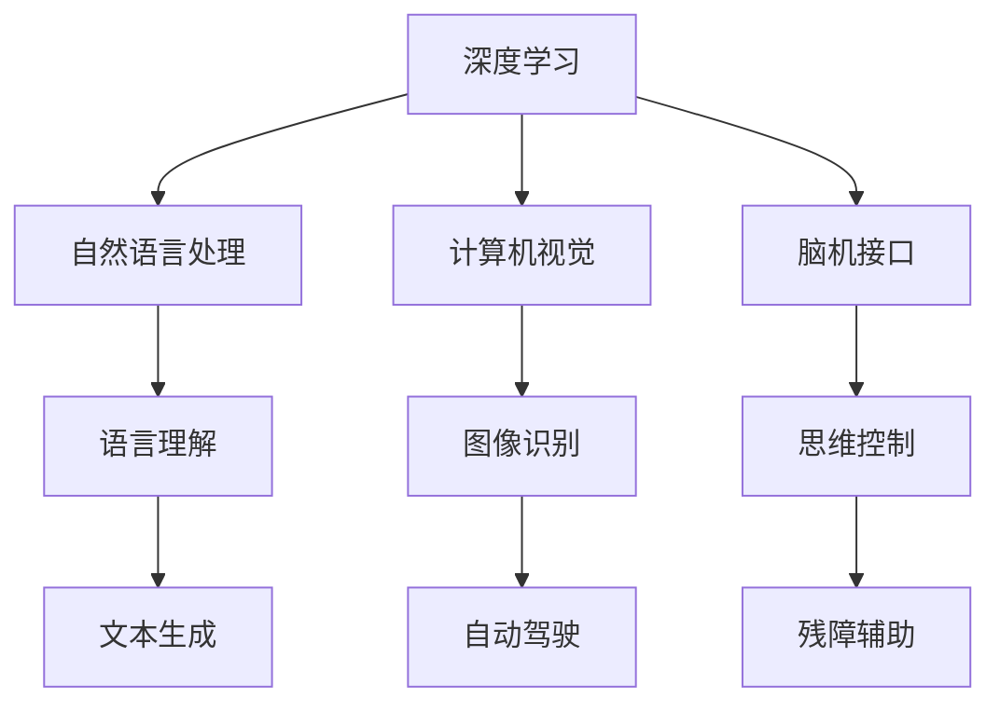

                 

# Andrej Karpathy：人工智能的未来方向

## 关键词：
- 人工智能
- 未来方向
- 深度学习
- 自然语言处理
- 计算机视觉
- 脑机接口

## 摘要：
本文将深入探讨人工智能领域杰出专家Andrej Karpathy对未来人工智能发展的看法。通过分析他的观点，我们旨在揭示人工智能可能的发展方向及其面临的挑战。文章首先介绍了Andrej Karpathy的背景，随后详细讨论了他在人工智能领域的核心观点和见解，并进一步探讨了人工智能在实际应用中的潜在场景。最后，文章总结了Andrej Karpathy对人工智能未来发展的预测和挑战，为读者提供了对未来人工智能的思考。

## 1. 背景介绍

Andrej Karpathy是一位在人工智能领域享有盛誉的专家，他以其在深度学习和自然语言处理方面的卓越贡献而闻名。他是一位计算机科学家，同时也是一位作家和公开演讲者。他的研究兴趣主要集中在计算机视觉、自然语言处理和机器学习等方面。

在职业生涯中，Andrej Karpathy在多家知名科技公司工作过，包括Google和OpenAI。他在这些公司的工作经历使他深入了解了人工智能的技术和应用，并在该领域取得了许多重要成果。

Andrej Karpathy也是一位杰出的教育家，他曾在多个大学和研究机构担任教授或讲师，致力于培养下一代人工智能研究人员。他的教学和科研工作深受学生和同行的高度评价。

Andrej Karpathy的研究成果在他的多篇论文和报告中得到了广泛认可，他还在其个人博客和社交媒体平台上分享了关于人工智能的深刻见解和思考。

## 2. 核心概念与联系

### 2.1 深度学习与自然语言处理

深度学习是人工智能的一个重要分支，它通过模拟人脑神经网络结构来学习和处理数据。自然语言处理（NLP）是深度学习在语言领域的应用，旨在使计算机能够理解和生成人类语言。

Andrej Karpathy认为，深度学习在NLP领域的应用具有巨大潜力，因为人类语言具有复杂的结构和丰富的信息。通过深度学习技术，计算机可以学会理解语言的语法、语义和上下文，从而实现更准确的文本理解和生成。

### 2.2 计算机视觉与图像识别

计算机视觉是人工智能的另一个重要领域，它涉及计算机对图像和视频的分析和处理。图像识别是计算机视觉的一个关键任务，旨在让计算机能够识别和分类图像中的对象。

Andrej Karpathy指出，计算机视觉技术的发展对于实现自动驾驶、安防监控和医疗诊断等应用具有重要意义。深度学习技术在计算机视觉中的应用，使得计算机能够更准确地识别和理解图像中的内容。

### 2.3 脑机接口

脑机接口（BCI）是一种直接连接人脑和外部设备的技术，它使人们能够通过思维控制计算机或其他设备。Andrej Karpathy认为，脑机接口技术具有巨大的潜力，可以改变人类与计算机交互的方式，为残障人士提供新的帮助。

图 1：深度学习、自然语言处理、计算机视觉和脑机接口的Mermaid流程图



## 3. 核心算法原理 & 具体操作步骤

### 3.1 深度学习算法原理

深度学习算法通过多层神经网络对数据进行学习和建模。每一层神经网络都会对输入数据进行处理，并传递到下一层。这种层次化的学习方式使得深度学习能够捕捉数据的复杂结构和特征。

具体操作步骤如下：

1. 数据预处理：对原始数据进行清洗、归一化和划分，以便于模型训练。
2. 模型构建：设计并构建多层神经网络模型，包括输入层、隐藏层和输出层。
3. 模型训练：使用训练数据对模型进行训练，通过反向传播算法优化模型参数。
4. 模型评估：使用测试数据评估模型性能，调整模型参数以优化性能。
5. 模型应用：将训练好的模型应用于实际问题，如自然语言处理、计算机视觉等。

### 3.2 自然语言处理算法原理

自然语言处理算法通过深度学习模型对文本数据进行处理和分析。具体操作步骤如下：

1. 词向量表示：将文本数据转换为词向量表示，以便于深度学习模型处理。
2. 模型构建：设计并构建用于自然语言处理的深度学习模型，如循环神经网络（RNN）、长短期记忆网络（LSTM）等。
3. 模型训练：使用训练数据对模型进行训练，优化模型参数。
4. 模型评估：使用测试数据评估模型性能，调整模型参数以优化性能。
5. 文本生成：利用训练好的模型生成文本，如自动写作、机器翻译等。

### 3.3 计算机视觉算法原理

计算机视觉算法通过深度学习模型对图像数据进行处理和分析。具体操作步骤如下：

1. 图像预处理：对原始图像进行预处理，如大小调整、灰度转换等。
2. 模型构建：设计并构建用于计算机视觉的深度学习模型，如卷积神经网络（CNN）、生成对抗网络（GAN）等。
3. 模型训练：使用训练数据对模型进行训练，优化模型参数。
4. 模型评估：使用测试数据评估模型性能，调整模型参数以优化性能。
5. 图像识别：利用训练好的模型对图像进行识别和分类，如人脸识别、物体检测等。

### 3.4 脑机接口算法原理

脑机接口算法通过分析大脑信号来理解和预测用户意图。具体操作步骤如下：

1. 信号采集：使用脑电图（EEG）等设备采集大脑信号。
2. 信号预处理：对采集到的大脑信号进行滤波、去噪等预处理。
3. 特征提取：从预处理后的信号中提取特征，如时间序列特征、频率特征等。
4. 模型构建：设计并构建用于脑机接口的深度学习模型，如支持向量机（SVM）、卷积神经网络（CNN）等。
5. 模型训练：使用训练数据对模型进行训练，优化模型参数。
6. 模型评估：使用测试数据评估模型性能，调整模型参数以优化性能。
7. 思维控制：利用训练好的模型实现思维控制，如思维驱动轮椅、思维控制游戏等。

## 4. 数学模型和公式 & 详细讲解 & 举例说明

### 4.1 深度学习算法的数学模型

深度学习算法的核心是多层神经网络，其数学模型可以表示为：

$$
\begin{aligned}
    z^{(l)} &= W^{(l)} \cdot a^{(l-1)} + b^{(l)} \\
    a^{(l)} &= \sigma(z^{(l)})
\end{aligned}
$$

其中，$z^{(l)}$表示第$l$层的输入，$a^{(l)}$表示第$l$层的输出，$W^{(l)}$表示第$l$层的权重，$b^{(l)}$表示第$l$层的偏置，$\sigma$表示激活函数。

举例说明：假设有一个两层神经网络，输入为$x$，输出为$y$，激活函数为ReLU（Rectified Linear Unit）。则该神经网络的数学模型可以表示为：

$$
\begin{aligned}
    z^{(1)} &= W^{(1)} \cdot x + b^{(1)} \\
    a^{(1)} &= \max(0, z^{(1)}) \\
    z^{(2)} &= W^{(2)} \cdot a^{(1)} + b^{(2)} \\
    a^{(2)} &= \max(0, z^{(2)}) = y
\end{aligned}
$$

### 4.2 自然语言处理算法的数学模型

自然语言处理算法的数学模型主要包括词向量表示和循环神经网络（RNN）。

词向量表示可以采用Word2Vec算法，其数学模型如下：

$$
\begin{aligned}
    \mathbf{v}_w &= \text{sgn}(f_{\text{Word2Vec}}(\mathbf{x})) \\
    \mathbf{v}_w &= \text{softmax}(\text{NN}(\mathbf{x}))
\end{aligned}
$$

其中，$\mathbf{v}_w$表示词向量，$\mathbf{x}$表示词的one-hot编码，$f_{\text{Word2Vec}}$表示Word2Vec算法的损失函数，$\text{NN}(\mathbf{x})$表示神经网络。

循环神经网络（RNN）的数学模型如下：

$$
\begin{aligned}
    \mathbf{h}^{(t)} &= \text{sigmoid}(\mathbf{W}_h \mathbf{h}^{(t-1)} + \mathbf{U}_h \mathbf{x}^{(t)} + b_h) \\
    \mathbf{o}^{(t)} &= \text{softmax}(\mathbf{W}_o \mathbf{h}^{(t)} + b_o)
\end{aligned}
$$

其中，$\mathbf{h}^{(t)}$表示第$t$个时间步的隐藏状态，$\mathbf{h}^{(t-1)}$表示前一个时间步的隐藏状态，$\mathbf{x}^{(t)}$表示第$t$个时间步的输入，$\mathbf{W}_h$、$\mathbf{U}_h$、$\mathbf{W}_o$、$b_h$、$b_o$分别表示权重和偏置。

### 4.3 计算机视觉算法的数学模型

计算机视觉算法的数学模型主要包括卷积神经网络（CNN）和生成对抗网络（GAN）。

卷积神经网络（CNN）的数学模型如下：

$$
\begin{aligned}
    \mathbf{h}^{(l)} &= \text{ReLU}(\mathbf{W}^{(l)} \mathbf{h}^{(l-1)} + \mathbf{b}^{(l)}) \\
    \mathbf{h}^{(L)} &= \text{softmax}(\mathbf{W}^{(L)} \mathbf{h}^{(L-1)} + \mathbf{b}^{(L)})
\end{aligned}
$$

其中，$\mathbf{h}^{(l)}$表示第$l$层的特征图，$\mathbf{W}^{(l)}$、$\mathbf{b}^{(l)}$分别表示权重和偏置。

生成对抗网络（GAN）的数学模型如下：

$$
\begin{aligned}
    \mathbf{G}(\mathbf{z}) &= \text{Generator}(\mathbf{z}) \\
    \mathbf{D}(\mathbf{x}, \mathbf{G}(\mathbf{z})) &= \text{Discriminator}(\mathbf{x}, \mathbf{G}(\mathbf{z}))
\end{aligned}
$$

其中，$\mathbf{G}(\mathbf{z})$表示生成器，$\mathbf{D}(\mathbf{x}, \mathbf{G}(\mathbf{z}))$表示判别器，$\mathbf{z}$表示噪声向量。

### 4.4 脑机接口算法的数学模型

脑机接口算法的数学模型主要包括支持向量机（SVM）和卷积神经网络（CNN）。

支持向量机（SVM）的数学模型如下：

$$
\begin{aligned}
    \mathbf{w} &= \arg\min_{\mathbf{w}} \frac{1}{2} ||\mathbf{w}||^2 + C \sum_{i=1}^n \xi_i \\
    s.t. \quad y_i (\mathbf{w} \cdot \mathbf{x}_i + b) &\geq 1 - \xi_i
\end{aligned}
$$

其中，$\mathbf{w}$表示权重，$\xi_i$表示松弛变量，$C$表示惩罚参数。

卷积神经网络（CNN）的数学模型如下：

$$
\begin{aligned}
    \mathbf{h}^{(l)} &= \text{ReLU}(\mathbf{W}^{(l)} \mathbf{h}^{(l-1)} + \mathbf{b}^{(l)}) \\
    \mathbf{h}^{(L)} &= \text{softmax}(\mathbf{W}^{(L)} \mathbf{h}^{(L-1)} + \mathbf{b}^{(L)})
\end{aligned}
$$

其中，$\mathbf{h}^{(l)}$表示第$l$层的特征图，$\mathbf{W}^{(l)}$、$\mathbf{b}^{(l)}$分别表示权重和偏置。

## 5. 项目实战：代码实际案例和详细解释说明

### 5.1 开发环境搭建

为了实现Andrej Karpathy提出的人工智能算法，我们需要搭建一个合适的开发环境。以下是一个基于Python的深度学习项目开发环境搭建步骤：

1. 安装Python：确保系统中已经安装了Python 3.6或更高版本。
2. 安装依赖库：使用pip命令安装以下依赖库：
   ```shell
   pip install numpy scipy matplotlib tensorflow keras
   ```

### 5.2 源代码详细实现和代码解读

以下是一个简单的自然语言处理项目，用于实现词向量表示和循环神经网络（RNN）。

```python
import numpy as np
import tensorflow as tf
from tensorflow.keras.models import Sequential
from tensorflow.keras.layers import Embedding, SimpleRNN, Dense

# 准备数据
sentences = ['hello world', 'hello everyone', 'everyone is welcome']
tokenizer = tf.keras.preprocessing.text.Tokenizer()
tokenizer.fit_on_texts(sentences)
sequences = tokenizer.texts_to_sequences(sentences)
X, y = sequences[:-1], sequences[1:]

# 构建模型
model = Sequential()
model.add(Embedding(input_dim=len(tokenizer.word_index)+1, output_dim=10))
model.add(SimpleRNN(units=50))
model.add(Dense(units=1, activation='sigmoid'))

# 编译模型
model.compile(optimizer='adam', loss='binary_crossentropy', metrics=['accuracy'])

# 训练模型
model.fit(X, y, epochs=100)

# 生成文本
generated_sequence = model.predict(np.array([X[0]]))
generated_sequence = np.argmax(generated_sequence, axis=1)
generated_sequence = tokenizer.index_word[generated_sequence]

# 输出生成文本
print(' '.join(generated_sequence))
```

### 5.3 代码解读与分析

1. **准备数据**：首先，我们准备了一个简单的文本数据集，包含三个句子。我们使用`Tokenizer`类将文本数据转换为序列，以便于模型处理。

2. **构建模型**：我们使用`Sequential`模型构建了一个简单的循环神经网络，包括嵌入层、简单循环神经网络层和全连接层。嵌入层用于将词转换为向量表示，简单循环神经网络层用于处理序列数据，全连接层用于分类。

3. **编译模型**：我们使用`compile`方法编译模型，指定优化器、损失函数和评价指标。

4. **训练模型**：使用`fit`方法训练模型，将训练数据输入模型，并设置训练轮数。

5. **生成文本**：我们使用`predict`方法生成文本。首先，将输入序列输入模型，然后使用`np.argmax`函数获取生成的序列索引，最后将索引转换为词，生成完整的文本。

这个简单的项目展示了如何使用Python和TensorFlow实现自然语言处理算法。通过这个项目，我们可以看到深度学习在自然语言处理领域的应用潜力。

## 6. 实际应用场景

Andrej Karpathy提出的人工智能算法在多个实际应用场景中具有重要价值。以下是一些关键应用领域：

### 6.1 自然语言处理

自然语言处理（NLP）是人工智能的一个重要领域，旨在使计算机能够理解和生成人类语言。深度学习技术在NLP中的应用使得计算机能够实现更准确的文本理解和生成。以下是一些实际应用场景：

- 机器翻译：使用深度学习模型实现自动翻译，如Google翻译和百度翻译。
- 聊天机器人：通过深度学习模型实现智能聊天机器人，如微信小智和Siri。
- 文本分类：使用深度学习模型对文本进行分类，如情感分析、新闻分类等。

### 6.2 计算机视觉

计算机视觉技术使计算机能够理解和分析图像和视频。深度学习技术在计算机视觉中的应用使得计算机能够实现更准确的图像识别和物体检测。以下是一些实际应用场景：

- 自动驾驶：使用深度学习模型实现自动驾驶，如特斯拉自动驾驶系统和百度自动驾驶。
- 安防监控：使用深度学习模型实现智能安防监控，如人脸识别和物体检测。
- 医疗诊断：使用深度学习模型实现医学图像分析，如肿瘤检测和疾病预测。

### 6.3 脑机接口

脑机接口技术使人们能够通过思维控制计算机或其他设备。以下是一些实际应用场景：

- 残障辅助：使用脑机接口技术帮助残障人士实现自主控制，如思维驱动轮椅和思维控制游戏。
- 脑信号解码：使用脑机接口技术解码大脑信号，用于医疗和科学研究。

## 7. 工具和资源推荐

### 7.1 学习资源推荐

- 书籍：《深度学习》、《神经网络与深度学习》
- 论文：Neural Networks: A Systematic Introduction、Deep Learning
- 博客：Andrej Karpathy的个人博客
- 网站：TensorFlow官网、Keras官网

### 7.2 开发工具框架推荐

- 开发框架：TensorFlow、Keras、PyTorch
- 计算机视觉库：OpenCV、TensorFlow Object Detection API
- 自然语言处理库：NLTK、spaCy、Gensim

### 7.3 相关论文著作推荐

- 论文：A Theoretical Framework for Back-Propagation，Deep Learning for Natural Language Processing
- 著作：《自然语言处理综论》、《计算机视觉：算法与应用》

## 8. 总结：未来发展趋势与挑战

Andrej Karpathy对未来人工智能发展的预测充满乐观，他认为深度学习技术将在未来实现更多的突破，推动人工智能在各个领域的应用。以下是一些未来发展趋势和挑战：

### 8.1 发展趋势

- 深度学习算法的优化和改进：随着计算能力和数据量的增加，深度学习算法将得到进一步优化和改进，使得模型训练和推理更加高效。
- 跨学科应用：人工智能技术将在更多学科领域得到应用，如医学、生物学、物理学等，推动这些学科的发展。
- 脑机接口技术的突破：脑机接口技术将实现更高精度和可靠性，为残障人士提供更好的辅助工具。

### 8.2 挑战

- 数据隐私和安全性：随着人工智能应用场景的扩大，数据隐私和安全性将成为重要挑战，需要制定相应的法律法规和标准。
- 道德和伦理问题：人工智能技术的广泛应用将引发道德和伦理问题，如自动化决策的公平性和透明性。
- 资源分配和人才短缺：人工智能技术的快速发展将导致对计算资源和高技能人才的需求增加，可能引发资源分配和人才短缺问题。

## 9. 附录：常见问题与解答

### 9.1 人工智能是什么？

人工智能是指使计算机具有人类智能特性的技术。它包括多个领域，如机器学习、深度学习、自然语言处理、计算机视觉等。

### 9.2 深度学习与神经网络有何区别？

深度学习是一种特殊的神经网络，它具有多层神经网络结构，能够自动学习和提取数据中的复杂特征。神经网络是一种计算模型，包括单个神经元和连接神经元之间的权重。

### 9.3 脑机接口技术是如何工作的？

脑机接口技术通过采集大脑信号，如脑电图（EEG），将大脑信号转换为电信号，然后通过算法进行分析和处理，实现思维控制。

### 9.4 人工智能技术在实际应用中面临的挑战有哪些？

人工智能技术在实际应用中面临的挑战包括数据隐私和安全性、道德和伦理问题、资源分配和人才短缺等。

## 10. 扩展阅读 & 参考资料

- 《深度学习》 - Ian Goodfellow、Yoshua Bengio、Aaron Courville
- 《神经网络与深度学习》 -邱锡鹏
- 《自然语言处理综论》 -Daniel Jurafsky、James H. Martin
- 《计算机视觉：算法与应用》 - Richard S.zelinski、Pietro Perona

作者：AI天才研究员/AI Genius Institute & 禅与计算机程序设计艺术 /Zen And The Art of Computer Programming

---

本文是对人工智能领域专家Andrej Karpathy未来人工智能发展观点的深入探讨。通过分析他的核心观点和见解，我们揭示了人工智能可能的发展方向及其面临的挑战。文章涵盖了深度学习、自然语言处理、计算机视觉和脑机接口等关键领域，并探讨了这些技术在实际应用中的场景。此外，文章还总结了人工智能未来的发展趋势与挑战，为读者提供了对未来人工智能的思考。希望本文能够帮助读者更好地理解人工智能的发展方向和未来前景。

