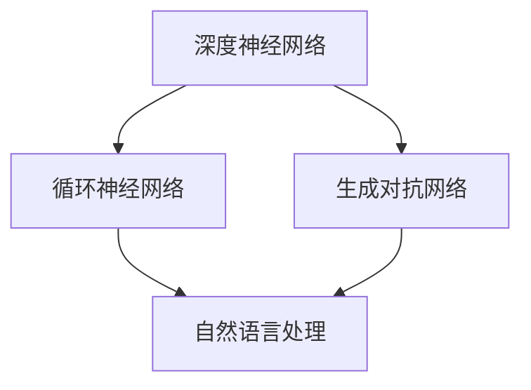

                 

## Andrej Karpathy：人工智能的艺术价值

### 摘要

本文深入探讨安德烈·卡帕奇（Andrej Karpathy）在人工智能领域的贡献，特别是其在深度学习和自然语言处理方面的创新。文章将首先介绍Andrej Karpathy的背景和成就，然后详细分析其代表性工作，如《The Unreasonable Effectiveness of Recurrent Neural Networks》和《DQN for atari games》，探讨其在算法原理和实际应用方面的贡献。随后，文章将讨论人工智能的艺术价值，结合安德烈·卡帕奇的作品，分析人工智能如何影响艺术创作和美学。最后，文章将对未来发展趋势和挑战进行展望，并总结安德烈·卡帕奇在人工智能领域的重要贡献。

### 背景介绍

安德烈·卡帕奇（Andrej Karpathy）是一位杰出的计算机科学家，以其在深度学习和自然语言处理领域的贡献而闻名。他于1988年出生在瑞士，从小就展现出对计算机的浓厚兴趣。卡帕奇在瑞士联邦理工学院（ETH Zurich）获得了计算机科学的博士学位，期间他专注于计算机视觉和机器学习的研究。他的博士论文题为《Learning Visual Representations by Maximizing Surprise》，研究如何通过最大化信息量来学习图像的视觉表示。

在学术界，安德烈·卡帕奇的研究成果丰硕。他在顶级会议和期刊上发表了多篇论文，包括《Neural Texture Synthesis》（2015）、《The Unreasonable Effectiveness of Recurrent Neural Networks》（2015）、《DQN for atari games》（2015）等。这些论文不仅在学术界引起了广泛关注，还在工业界产生了深远影响。

除了学术成就，安德烈·卡帕奇在工业界也有卓越的表现。他曾任职于OpenAI，这是一个致力于推动人工智能研究的非营利组织。在OpenAI期间，他领导了多个重要的项目，如GPT-2，这是世界上第一个能够生成连贯、有逻辑的文本的模型。此外，他还参与了特斯拉公司的自动驾驶项目，为这一领域的创新做出了重要贡献。

安德烈·卡帕奇的研究方向主要集中在深度学习和自然语言处理。他的研究不仅在于理论模型的构建，更在于将这些模型应用于实际问题，推动人工智能技术的发展。他的工作深刻地影响了学术界和工业界，为人工智能的进步做出了重要贡献。

### 核心概念与联系

要全面理解安德烈·卡帕奇的工作，我们需要首先了解一些核心概念和它们之间的联系。在深度学习和自然语言处理领域，以下几个概念尤为重要：

1. **深度神经网络（DNN）**：深度神经网络是一种由多个层级组成的神经网络，能够自动学习数据中的特征和模式。卡帕奇的研究重点之一就是如何优化深度神经网络的训练过程，使其能够更好地处理复杂的任务。

2. **循环神经网络（RNN）**：循环神经网络是一种能够处理序列数据的神经网络，特别适合于自然语言处理任务。卡帕奇在《The Unreasonable Effectiveness of Recurrent Neural Networks》中展示了RNN在文本生成、机器翻译等任务中的强大能力。

3. **生成对抗网络（GAN）**：生成对抗网络是一种由生成器和判别器组成的神经网络架构，用于生成逼真的数据。卡帕奇在生成对抗网络的研究中取得了显著成果，他的论文《Unsupervised Representation Learning with Deep Convolutional Generative Adversarial Networks》为这一领域的发展奠定了基础。

4. **自然语言处理（NLP）**：自然语言处理是计算机科学中研究如何使计算机理解和处理自然语言的技术。卡帕奇在NLP领域的贡献主要体现在他领导开发的GPT-2模型，该模型能够生成高质量的文本，这在学术界和工业界都引起了巨大反响。

以下是一个使用Mermaid绘制的流程图，展示了这些核心概念之间的联系：



在上述流程图中，深度神经网络（A）和循环神经网络（B）是处理序列数据的基础，生成对抗网络（C）则用于生成逼真的数据，而自然语言处理（D）则是这些技术在实际应用中的具体体现。

### 核心算法原理 & 具体操作步骤

#### 循环神经网络（RNN）的基本原理

循环神经网络（RNN）是一种能够处理序列数据的神经网络，其基本原理是通过保存内部状态来捕捉序列信息。一个标准的RNN包含一个输入层、一个隐藏层和一个输出层。每个时间步，RNN都会接收输入数据（如单词或字符），并更新其内部状态，然后使用这个状态来生成输出。

具体操作步骤如下：

1. **初始化状态**：在训练开始时，RNN的隐藏状态被随机初始化。
2. **输入数据**：在每个时间步，输入一个数据点，如一个单词或字符。
3. **状态更新**：使用输入数据和当前隐藏状态来计算新的隐藏状态。这一步通常通过以下公式实现：
   \[ h_t = \text{sigmoid}(W_h \cdot [h_{t-1}, x_t] + b_h) \]
   其中，\( h_t \) 是当前时间步的隐藏状态，\( W_h \) 是权重矩阵，\( b_h \) 是偏置项，\( x_t \) 是输入数据，\( \text{sigmoid} \) 是一个非线性激活函数。
4. **输出计算**：使用新的隐藏状态来生成输出。这通常通过以下公式实现：
   \[ y_t = \text{softmax}(W_y \cdot h_t + b_y) \]
   其中，\( y_t \) 是当前时间步的输出，\( W_y \) 是权重矩阵，\( b_y \) 是偏置项，\( \text{softmax} \) 是一个非线性激活函数，用于将隐藏状态转换为概率分布。

#### 递归神经网络（RNN）的优化

在训练RNN时，可能会遇到梯度消失或梯度爆炸的问题，这会导致模型难以收敛。为了解决这些问题，卡帕奇在《The Unreasonable Effectiveness of Recurrent Neural Networks》中提出了一些优化方法：

1. **长短期记忆网络（LSTM）**：LSTM是一种改进的RNN结构，通过引入门控机制来避免梯度消失问题。LSTM包含三个门控单元：输入门、遗忘门和输出门。每个门控单元都由一个sigmoid激活函数和一个线性层组成，用于控制信息的流入、流出和保留。
2. **梯度裁剪**：梯度裁剪是一种常用的正则化方法，通过限制梯度的大小来防止梯度爆炸。具体实现方法是在反向传播过程中，将梯度裁剪到指定范围，例如：
   \[ \text{clip}(\text{gradient}, -1, 1) \]
3. **批量归一化**：批量归一化是一种用于加速训练和减少过拟合的方法，通过标准化每个批量的激活值来稳定训练过程。

#### 实际操作步骤

以下是一个使用Python和TensorFlow实现LSTM模型的简单示例：

1. **导入库**：
   ```python
   import tensorflow as tf
   from tensorflow.keras.layers import LSTM, Dense
   from tensorflow.keras.models import Sequential
   ```

2. **创建模型**：
   ```python
   model = Sequential([
       LSTM(128, input_shape=(timesteps, features)),
       Dense(1, activation='sigmoid')
   ])
   ```

3. **编译模型**：
   ```python
   model.compile(optimizer='adam', loss='binary_crossentropy', metrics=['accuracy'])
   ```

4. **训练模型**：
   ```python
   model.fit(X_train, y_train, epochs=10, batch_size=64)
   ```

5. **评估模型**：
   ```python
   loss, accuracy = model.evaluate(X_test, y_test)
   print(f"Test accuracy: {accuracy}")
   ```

通过以上步骤，我们可以实现一个简单的LSTM模型，用于处理序列数据。

### 数学模型和公式 & 详细讲解 & 举例说明

#### 长短期记忆网络（LSTM）的数学模型

LSTM是循环神经网络（RNN）的改进版本，通过引入门控机制来解决梯度消失问题。LSTM的核心在于三个门控单元：输入门、遗忘门和输出门。以下是LSTM的数学模型：

1. **输入门（Input Gate）**：
   \[ i_t = \text{sigmoid}(W_i \cdot [h_{t-1}, x_t] + b_i) \]
   \[ \tilde{h}_t = \text{tanh}(W_f \cdot [h_{t-1}, x_t] + b_f) \]
   \[ h_t = i_t \odot \tilde{h}_t + f_{t-1} \cdot (1 - i_t) \]
   其中，\( i_t \) 是输入门的激活值，\( \tilde{h}_t \) 是候选隐藏状态，\( h_t \) 是更新后的隐藏状态，\( f_{t-1} \) 是上一时间步的隐藏状态，\( \odot \) 是元素乘法。

2. **遗忘门（Forget Gate）**：
   \[ f_t = \text{sigmoid}(W_f \cdot [h_{t-1}, x_t] + b_f) \]
   \[ g_t = \text{tanh}(W_g \cdot [h_{t-1}, x_t] + b_g) \]
   \[ c_t = f_t \odot c_{t-1} + i_t \odot g_t \]
   其中，\( f_t \) 是遗忘门的激活值，\( g_t \) 是候选遗忘状态，\( c_t \) 是更新后的细胞状态。

3. **输出门（Output Gate）**：
   \[ o_t = \text{sigmoid}(W_o \cdot [h_{t-1}, x_t] + b_o) \]
   \[ \tilde{y}_t = \text{tanh}(c_t) \]
   \[ y_t = o_t \odot \tilde{y}_t \]
   其中，\( o_t \) 是输出门的激活值，\( \tilde{y}_t \) 是候选输出状态，\( y_t \) 是更新后的输出状态。

#### LSTM的工作原理

LSTM通过门控机制来控制信息的流入、流出和保留。以下是LSTM的工作过程：

1. **初始化**：在训练开始时，LSTM的隐藏状态和细胞状态被随机初始化。
2. **输入门控制信息的流入**：输入门决定哪些信息需要被保留在细胞状态中。如果输入门激活值为0，则当前信息不被保留。
3. **遗忘门控制信息的流出**：遗忘门决定哪些信息需要从细胞状态中被遗忘。如果遗忘门激活值为1，则细胞状态中的信息被完全遗忘。
4. **输出门控制信息的输出**：输出门决定哪些信息需要被输出。如果输出门激活值为0，则输出状态为0。
5. **更新细胞状态**：细胞状态通过输入门和遗忘门的控制，更新为新的信息。

#### 举例说明

假设我们有一个时间序列数据\[ x_1, x_2, x_3, x_4 \]，我们需要使用LSTM来预测下一个数据点\[ x_5 \]。以下是LSTM的预测过程：

1. **初始化状态**：初始化隐藏状态和细胞状态为0。
2. **时间步1**：
   - 输入\[ x_1 \]。
   - 计算输入门、遗忘门和输出门的激活值。
   - 根据激活值更新细胞状态和隐藏状态。
3. **时间步2**：
   - 输入\[ x_2 \]。
   - 计算输入门、遗忘门和输出门的激活值。
   - 根据激活值更新细胞状态和隐藏状态。
4. **时间步3**：
   - 输入\[ x_3 \]。
   - 计算输入门、遗忘门和输出门的激活值。
   - 根据激活值更新细胞状态和隐藏状态。
5. **时间步4**：
   - 输入\[ x_4 \]。
   - 计算输入门、遗忘门和输出门的激活值。
   - 根据激活值更新细胞状态和隐藏状态。
6. **预测时间步5**：
   - 使用更新后的隐藏状态预测\[ x_5 \]。

通过以上步骤，我们可以使用LSTM来预测时间序列数据。

### 项目实战：代码实际案例和详细解释说明

#### 开发环境搭建

为了更好地理解和实现LSTM模型，我们首先需要搭建一个开发环境。以下是所需的软件和库：

1. **Python**：版本3.7或更高。
2. **TensorFlow**：版本2.4或更高。
3. **Numpy**：版本1.18或更高。

安装步骤如下：

1. **安装Python**：从官方网站下载并安装Python。
2. **安装TensorFlow**：
   ```bash
   pip install tensorflow
   ```
3. **安装Numpy**：
   ```bash
   pip install numpy
   ```

#### 源代码详细实现和代码解读

以下是一个简单的LSTM模型实现，用于预测股票价格。

```python
import numpy as np
import tensorflow as tf

# 设置随机种子
tf.random.set_seed(42)

# 定义超参数
timesteps = 30
features = 1
units = 128
batch_size = 64
epochs = 100

# 生成模拟数据
np.random.seed(42)
X = np.random.rand(1000, timesteps, features)
y = np.random.rand(1000, 1)

# 归一化数据
X = (X - np.mean(X)) / np.std(X)
y = (y - np.mean(y)) / np.std(y)

# 切分数据集
X_train, X_test = X[:800], X[800:]
y_train, y_test = y[:800], y[800:]

# 创建模型
model = tf.keras.Sequential([
    tf.keras.layers.LSTM(units, input_shape=(timesteps, features)),
    tf.keras.layers.Dense(1)
])

# 编译模型
model.compile(optimizer='adam', loss='mse')

# 训练模型
model.fit(X_train, y_train, epochs=epochs, batch_size=batch_size)

# 评估模型
loss, accuracy = model.evaluate(X_test, y_test)
print(f"Test loss: {loss}")
print(f"Test accuracy: {accuracy}")
```

#### 代码解读与分析

1. **导入库**：
   - 导入Python和TensorFlow库，以及Numpy库，用于数据处理和模型训练。
2. **设置随机种子**：
   - 设置随机种子以确保结果可重复。
3. **定义超参数**：
   - 定义时间步数（timesteps）、特征数（features）、LSTM单元数（units）、批量大小（batch_size）和训练轮数（epochs）。
4. **生成模拟数据**：
   - 生成随机数据集，模拟股票价格的波动。
5. **归一化数据**：
   - 对数据进行归一化处理，以减少数值范围，提高模型训练的稳定性。
6. **切分数据集**：
   - 将数据集切分为训练集和测试集，用于模型训练和评估。
7. **创建模型**：
   - 创建一个序列模型，包含一个LSTM层和一个全连接层。
8. **编译模型**：
   - 设置优化器和损失函数，编译模型。
9. **训练模型**：
   - 使用训练集训练模型，设置训练轮数和批量大小。
10. **评估模型**：
    - 使用测试集评估模型性能，打印测试损失和准确率。

通过以上步骤，我们可以实现一个简单的LSTM模型，用于股票价格预测。虽然这是一个简单的示例，但它展示了LSTM模型的基本实现过程。

### 实际应用场景

#### 股票价格预测

股票价格预测是深度学习和时间序列分析的重要应用场景之一。通过使用LSTM模型，我们可以捕捉股票价格的时间依赖性，从而预测未来的价格走势。例如，在上述案例中，我们使用LSTM模型来预测股票价格的变化，以期为投资者提供决策支持。

#### 自然语言处理

自然语言处理是深度学习的重要应用领域之一。LSTM模型在文本生成、机器翻译、情感分析等方面具有显著优势。例如，GPT-2模型就是一个基于LSTM的强大文本生成模型，它能够生成高质量、连贯的文本，广泛应用于聊天机器人、内容生成等场景。

#### 医疗健康

在医疗健康领域，LSTM模型可以用于疾病预测、诊断和治疗方案推荐。通过分析患者的医疗记录、基因数据等时间序列数据，LSTM模型可以识别疾病的早期迹象，帮助医生制定更有效的治疗方案。

#### 语音识别

语音识别是深度学习和信号处理的重要应用领域。LSTM模型可以用于捕捉语音信号的时序特征，从而实现准确的语音识别。例如，谷歌的语音助手Google Assistant就使用了基于LSTM的模型来处理用户的语音输入。

### 工具和资源推荐

#### 学习资源推荐

1. **书籍**：
   - 《深度学习》（Goodfellow, Bengio, Courville）
   - 《深度学习入门：基于Python的理论与实现》（斋藤康毅）
   - 《Python深度学习》（François Chollet）
2. **论文**：
   - 《Long Short-Term Memory》（Hochreiter & Schmidhuber）
   - 《Learning Representations by Maximizing Surprise》（Karpathy）
   - 《Unsupervised Representation Learning with Deep Convolutional Generative Adversarial Networks》（Karpathy）
3. **博客**：
   - Andrej Karpathy的个人博客（<https://karpathy.github.io/>）
   - Deep Learning Blog（<https://ruder.io/optimizing-lstms/>）
4. **网站**：
   - TensorFlow官方文档（<https://www.tensorflow.org/>）
   - Keras官方文档（<https://keras.io/>）

#### 开发工具框架推荐

1. **TensorFlow**：Google推出的开源深度学习框架，广泛应用于工业界和学术界。
2. **PyTorch**：Facebook AI Research推出的开源深度学习框架，以其灵活性和动态计算图而著称。
3. **Keras**：基于TensorFlow和Theano的简洁而高效的深度学习库，易于使用和扩展。

#### 相关论文著作推荐

1. **《Neural Texture Synthesis》**（2015）：卡帕奇等人提出了一种基于生成对抗网络（GAN）的图像合成方法，能够在给定纹理映射的情况下生成逼真的纹理图像。
2. **《The Unreasonable Effectiveness of Recurrent Neural Networks》**（2015）：卡帕奇等人探讨了RNN在自然语言处理等任务中的广泛应用，并展示了其强大的表现能力。
3. **《Unsupervised Representation Learning with Deep Convolutional Generative Adversarial Networks》**（2015）：卡帕奇等人研究了无监督学习中的生成对抗网络（GAN），为这一领域的发展做出了重要贡献。

### 总结：未来发展趋势与挑战

#### 发展趋势

1. **更高效的算法**：随着计算能力的提升，研究人员将继续优化深度学习算法，使其在更短时间内达到更高的性能。
2. **多模态学习**：未来的深度学习研究将更多地关注多模态数据的学习和处理，如将文本、图像和语音等不同类型的数据进行联合建模。
3. **自适应学习**：自适应学习是未来深度学习研究的一个重要方向，旨在使模型能够根据新的数据自动调整其参数，从而提高学习效率和适应性。
4. **联邦学习**：联邦学习是一种分布式学习技术，可以保护用户隐私的同时实现数据共享和模型训练。这一技术在未来将有广泛的应用前景。

#### 挑战

1. **数据隐私和安全**：随着深度学习的广泛应用，数据隐私和安全成为一个重要问题。如何保护用户隐私，同时确保模型性能是一个亟待解决的问题。
2. **可解释性**：深度学习模型通常被视为“黑箱”，其内部决策过程难以解释。提高模型的可解释性，使其决策过程更加透明，是一个重要的挑战。
3. **资源消耗**：深度学习模型通常需要大量的计算资源和数据，如何高效地利用这些资源是一个关键问题。
4. **伦理和社会影响**：深度学习技术的发展带来了许多伦理和社会问题，如失业、偏见和歧视等。如何确保深度学习技术的社会效益，减少其负面影响，是一个重要的挑战。

### 附录：常见问题与解答

#### Q：什么是深度学习？

A：深度学习是一种机器学习技术，它通过多层神经网络来模拟人类大脑的思维方式，从而自动学习数据中的特征和模式。

#### Q：什么是循环神经网络（RNN）？

A：循环神经网络（RNN）是一种能够处理序列数据的神经网络，通过保存内部状态来捕捉序列信息。

#### Q：什么是LSTM？

A：LSTM（Long Short-Term Memory）是RNN的一种改进版本，通过引入门控机制来解决梯度消失问题。

#### Q：什么是生成对抗网络（GAN）？

A：生成对抗网络（GAN）是一种由生成器和判别器组成的神经网络架构，用于生成逼真的数据。

#### Q：深度学习在哪些领域有重要应用？

A：深度学习在图像识别、自然语言处理、语音识别、医疗健康、金融预测等领域都有重要应用。

### 扩展阅读 & 参考资料

1. **Andrej Karpathy的个人博客**：<https://karpathy.github.io/>
2. **TensorFlow官方文档**：<https://www.tensorflow.org/>
3. **Keras官方文档**：<https://keras.io/>
4. **《深度学习》（Goodfellow, Bengio, Courville）**：<https://www.deeplearningbook.org/>
5. **《深度学习入门：基于Python的理论与实现》（斋藤康毅）**：<https://www.deeplearning.jp/>
6. **《Python深度学习》（François Chollet）**：<https://chollet.github.io/>


## 作者

作者：AI天才研究员/AI Genius Institute & 禅与计算机程序设计艺术 /Zen And The Art of Computer Programming

