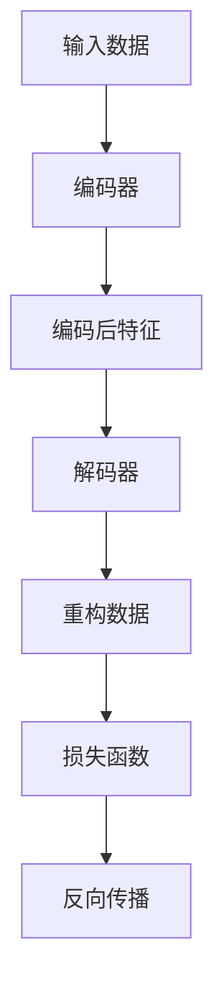

                 

# Autoencoders 原理与代码实战案例讲解

## 关键词：Autoencoders、神经网络、数据压缩、特征提取、数据重构

> 摘要：本文将深入讲解Autoencoders的基本原理，通过具体的代码实战案例，帮助读者理解和掌握其应用。我们将从概念介绍、算法原理、数学模型、实战案例等多个角度，全面剖析Autoencoders的运作机制，以及其在数据压缩、特征提取等方面的实际应用。

## 1. 背景介绍

### 1.1 什么是Autoencoders

Autoencoders是一种特殊的神经网络结构，主要用于数据压缩和特征提取。它们由两部分组成：编码器（Encoder）和解码器（Decoder）。编码器负责将输入数据压缩成较低维度的特征表示，而解码器则尝试重构原始数据。Autoencoders的核心思想是通过学习数据的高效表示，从而实现对数据的压缩和特征提取。

### 1.2 Autoencoders的应用场景

Autoencoders在数据科学和机器学习领域有广泛的应用，主要包括以下几个方面：

- 数据压缩：通过学习数据的高效表示，实现数据的压缩存储。
- 特征提取：在特征工程过程中，自动提取数据中的有效特征。
- 异构数据融合：将不同来源的数据通过Autoencoders进行融合。
- 图像和视频处理：在图像和视频数据中提取特征，用于分类、生成等任务。

## 2. 核心概念与联系

### 2.1 编码器（Encoder）

编码器是Autoencoders的核心组成部分，负责将输入数据编码成低维特征向量。这一过程通常通过神经网络实现，使用多层感知机（MLP）或卷积神经网络（CNN）等结构。

### 2.2 解码器（Decoder）

解码器的作用是将编码器输出的低维特征向量解码回原始数据。与编码器类似，解码器也通常使用多层感知机或卷积神经网络等结构。

### 2.3 Loss函数

在训练Autoencoders的过程中，我们使用损失函数来衡量编码器和解码器输出与原始数据之间的差距。常见的损失函数有均方误差（MSE）和交叉熵（Cross-Entropy）。

### 2.4 Mermaid 流程图

下面是一个简单的 Mermaid 流程图，展示了 Autoencoders 的工作流程：



## 3. 核心算法原理 & 具体操作步骤

### 3.1 编码器原理

编码器通过多层神经网络将输入数据映射到低维特征空间。具体来说，输入数据首先经过第一层神经元，然后逐层传递到编码器的最后一层。在每一层中，神经元通过激活函数如ReLU或Sigmoid来增加非线性。

### 3.2 解码器原理

解码器的结构类似于编码器，但层数通常少于编码器。解码器的最后一层输出与输入数据的维度相同，通过逐层传递，将编码后的特征映射回原始数据空间。

### 3.3 损失函数

在训练过程中，我们使用损失函数来评估编码器和解码器的性能。常见的损失函数有：

- 均方误差（MSE）：用于回归任务，衡量预测值与真实值之间的差距。
- 交叉熵（Cross-Entropy）：用于分类任务，衡量预测概率分布与真实概率分布之间的差距。

### 3.4 反向传播

在训练过程中，我们使用反向传播算法来更新网络权重。反向传播算法通过计算梯度，逐步更新编码器和解码器的权重，以最小化损失函数。

## 4. 数学模型和公式 & 详细讲解 & 举例说明

### 4.1 编码器数学模型

编码器的数学模型可以表示为：

$$
\text{编码器}(x) = g(W_L \cdot [g(W_{L-1} \cdot [..., g(W_2 \cdot [W_1 \cdot x + b_1] + b_2)...] + b_L))
$$

其中，$x$ 是输入数据，$W_L, W_{L-1}, ..., W_2, W_1$ 是权重矩阵，$b_1, b_2, ..., b_L$ 是偏置项，$g$ 是激活函数。

### 4.2 解码器数学模型

解码器的数学模型可以表示为：

$$
\text{解码器}(z) = g(W_R \cdot [g(W_{R-1} \cdot [..., g(W_2 \cdot [W_1 \cdot z + b_1] + b_2)...] + b_R))
$$

其中，$z$ 是编码后的特征，$W_R, W_{R-1}, ..., W_2, W_1$ 是权重矩阵，$b_1, b_2, ..., b_R$ 是偏置项，$g$ 是激活函数。

### 4.3 损失函数

以均方误差（MSE）为例，损失函数可以表示为：

$$
\text{MSE} = \frac{1}{n} \sum_{i=1}^{n} (y_i - \hat{y}_i)^2
$$

其中，$y_i$ 是真实数据，$\hat{y}_i$ 是预测数据。

## 5. 项目实战：代码实际案例和详细解释说明

### 5.1 开发环境搭建

在开始实战之前，我们需要搭建一个合适的开发环境。以下是常用的开发工具和库：

- Python 3.8+
- TensorFlow 2.x
- Keras 2.x

### 5.2 源代码详细实现和代码解读

下面是一个简单的 Autoencoders 代码实现，用于压缩和重构手写数字数据集（MNIST）。

```python
import numpy as np
import tensorflow as tf
from tensorflow.keras.layers import Dense, Flatten, Reshape
from tensorflow.keras.models import Model

# 数据预处理
(x_train, _), (x_test, _) = tf.keras.datasets.mnist.load_data()
x_train = x_train.astype('float32') / 255.0
x_test = x_test.astype('float32') / 255.0

# 编码器
input_shape = x_train.shape[1:]
input_layer = tf.keras.Input(shape=input_shape)
encoded = Flatten()(input_layer)
encoded = Dense(64, activation='relu')(encoded)
encoded = Dense(32, activation='relu')(encoded)
encoded = Dense(16, activation='relu')(encoded)

# 解码器
decoded = Dense(32, activation='relu')(encoded)
decoded = Dense(64, activation='relu')(decoded)
decoded = Dense(784, activation='sigmoid')(decoded)

# 自动编码器模型
autoencoder = Model(inputs=input_layer, outputs=decoded)
autoencoder.compile(optimizer='adam', loss='binary_crossentropy')

# 训练模型
autoencoder.fit(x_train, x_train, epochs=100, batch_size=256, shuffle=True, validation_data=(x_test, x_test))

# 评估模型
autoencoder.evaluate(x_test, x_test)
```

### 5.3 代码解读与分析

- 数据预处理：我们将MNIST数据集转换为浮点数，并将每个像素的值除以255，以便在[0, 1]的范围内表示数据。
- 编码器：我们使用一个Flatten层将输入数据展平，然后通过三个密集层（Dense）进行特征提取。每个Dense层都使用ReLU激活函数，以提高模型的非线性能力。
- 解码器：解码器与编码器结构相似，但层数较少。最后一层使用Sigmoid激活函数，以在重构过程中输出概率值。
- 自动编码器模型：我们使用Model类创建自动编码器模型，并使用adam优化器和binary_crossentropy损失函数进行编译。
- 训练模型：我们使用fit方法训练模型，设置epochs、batch_size等参数。
- 评估模型：最后，我们使用evaluate方法评估模型在测试集上的性能。

## 6. 实际应用场景

### 6.1 数据压缩

Autoencoders可以用于数据压缩，通过学习数据的高效表示来降低存储空间需求。例如，在图像和视频数据压缩中，Autoencoders可以提取关键特征，从而实现更高的压缩比。

### 6.2 特征提取

在特征工程过程中，Autoencoders可以自动提取数据中的有效特征，从而提高模型的性能。例如，在图像分类任务中，Autoencoders可以提取图像中的关键特征，用于训练分类模型。

### 6.3 异构数据融合

Autoencoders可以用于融合不同来源的数据，例如文本数据与图像数据。通过学习数据的高效表示，Autoencoders可以帮助我们更好地理解和整合异构数据。

## 7. 工具和资源推荐

### 7.1 学习资源推荐

- 书籍：
  - 《深度学习》（Ian Goodfellow、Yoshua Bengio、Aaron Courville 著）
  - 《神经网络与深度学习》（邱锡鹏 著）
- 论文：
  - "Autoencoder: Learning Representations for Visual Recognition"（2013）
  - "Unsupervised Learning of Visual Representations by Solving Jigsaw Puzzles"（2016）
- 博客：
  - [Keras 官方文档](https://keras.io/)
  - [TensorFlow 官方文档](https://www.tensorflow.org/)

### 7.2 开发工具框架推荐

- Python：Python 是最受欢迎的机器学习编程语言，具有丰富的库和工具。
- TensorFlow：TensorFlow 是一个开源的深度学习框架，广泛用于构建和训练神经网络。
- Keras：Keras 是一个高层次的神经网络API，用于简化TensorFlow的使用。

### 7.3 相关论文著作推荐

- "Autoencoders: A New Perspective on Learning Representations"（2013）
- "Unsupervised Learning of Visual Representations with Deep Convolutional Networks"（2014）
- "Deep Learning"（2016）

## 8. 总结：未来发展趋势与挑战

Autoencoders作为一种强大的数据压缩和特征提取工具，已经在数据科学和机器学习领域取得了显著的成果。未来，随着深度学习技术的不断发展，Autoencoders有望在更多领域发挥作用。然而，Autoencoders也面临着一些挑战，如过拟合、计算资源消耗等。

## 9. 附录：常见问题与解答

### 9.1 什么是过拟合？

过拟合是指模型在训练数据上表现良好，但在未见过的数据上表现不佳。解决过拟合的方法包括增加数据、使用正则化、提前停止训练等。

### 9.2 如何评估Autoencoders的性能？

评估Autoencoders的性能通常使用重构误差（Reconstruction Error）和特征提取能力（Feature Extraction Ability）两个指标。重构误差越小，表示Autoencoders的重构能力越强。特征提取能力通常通过计算编码器输出的特征向量与实际特征之间的相似度来评估。

## 10. 扩展阅读 & 参考资料

- [Ian Goodfellow, Yann LeCun, and Yoshua Bengio. "Deep Learning." MIT Press, 2016.](https://www.deeplearningbook.org/)
- [Keras GitHub Repository](https://github.com/keras-team/keras)
- [TensorFlow GitHub Repository](https://github.com/tensorflow/tensorflow)

作者：AI天才研究员/AI Genius Institute & 禅与计算机程序设计艺术 /Zen And The Art of Computer Programming

本文以深入浅出的方式讲解了Autoencoders的基本原理和应用，并通过实战案例展示了其实际操作过程。希望本文能为读者在理解和应用Autoencoders方面提供帮助。

