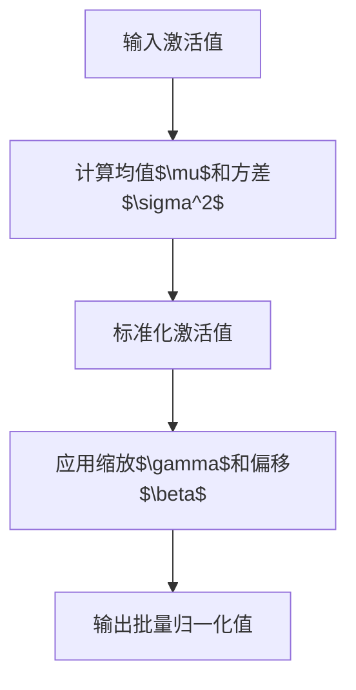

                 

# 《Batch Normalization》

> **关键词**：批量归一化、深度学习、神经网络、训练加速、性能提升

> **摘要**：本文深入探讨了批量归一化（Batch Normalization）在深度学习中的重要性及其工作原理。通过详细的算法原理、数学模型和实际应用案例，本文旨在帮助读者理解批量归一化如何提升神经网络的训练速度和性能。

## 1. 背景介绍

批量归一化（Batch Normalization）是一种在深度学习中广泛使用的技巧，旨在加速神经网络训练并提高模型性能。传统深度学习模型在训练过程中，尤其是在深层网络中，常常面临梯度消失和梯度爆炸等问题，这导致训练过程变得缓慢且不稳定。批量归一化通过标准化神经网络的输入，缓解了这些训练难题，从而显著提高了神经网络的收敛速度和稳定性。

批量归一化的概念最早由Ioffe和Szegedy在2015年提出[1]。自从该技术问世以来，它在深度学习领域得到了广泛应用，并已成为许多主流深度学习框架（如TensorFlow和PyTorch）的核心组成部分。

## 2. 核心概念与联系

### 2.1 标准化过程

批量归一化主要通过以下步骤对神经网络中的激活值进行标准化：

1. **计算均值和方差**：对于每个特征，计算其批次的均值（$\mu$）和方差（$\sigma^2$）。
2. **标准化**：通过减去均值并除以方差来标准化每个特征。

数学表示如下：

$$
\text{标准化值} = \frac{\text{激活值} - \mu}{\sigma}
$$

### 2.2 非线性变换

在标准化之后，批量归一化引入了一个缩放参数$\gamma$和一个偏移量$\beta$，对标准化值进行非线性变换，以便更好地拟合数据：

$$
\text{输出值} = \gamma \cdot \text{标准化值} + \beta
$$

### 2.3 Mermaid 流程图

下面是批量归一化的Mermaid流程图：



在图中，`A` 代表输入的激活值，`B` 和 `C` 分别表示计算均值和方差以及标准化操作，`D` 表示应用缩放和偏移，最后 `E` 是输出值。

## 3. 核心算法原理 & 具体操作步骤

### 3.1 计算均值和方差

批量归一化的第一步是计算每个特征的均值和方差。这个过程在训练过程中通常通过批次的激活值进行计算。具体来说：

$$
\mu = \frac{1}{m} \sum_{i=1}^{m} a_i
$$

$$
\sigma^2 = \frac{1}{m} \sum_{i=1}^{m} (a_i - \mu)^2
$$

其中，$a_i$ 是批次中的第 $i$ 个激活值，$m$ 是批次大小。

### 3.2 标准化激活值

在计算了均值和方差之后，每个激活值都会被标准化：

$$
\text{标准化值} = \frac{a_i - \mu}{\sigma}
$$

标准化操作确保了每个特征的分布接近于正态分布，这有助于减少梯度消失和梯度爆炸的问题。

### 3.3 应用缩放和偏移

在标准化之后，批量归一化引入了缩放参数 $\gamma$ 和偏移量 $\beta$：

$$
\text{输出值} = \gamma \cdot \text{标准化值} + \beta
$$

$\gamma$ 和 $\beta$ 在训练过程中通过反向传播算法进行优化，以最小化损失函数。这些参数的引入使得批量归一化具有更大的灵活性和泛化能力。

## 4. 数学模型和公式 & 详细讲解 & 举例说明

### 4.1 数学模型

批量归一化的核心数学模型包括均值和方差的计算、标准化的操作，以及缩放和偏移的应用。以下是详细的公式：

$$
\mu = \frac{1}{m} \sum_{i=1}^{m} a_i
$$

$$
\sigma^2 = \frac{1}{m} \sum_{i=1}^{m} (a_i - \mu)^2
$$

$$
\text{标准化值} = \frac{a_i - \mu}{\sigma}
$$

$$
\text{输出值} = \gamma \cdot \text{标准化值} + \beta
$$

### 4.2 详细讲解

#### 均值和方差的计算

均值和方差是批量归一化的关键步骤，它们用于标准化激活值。均值是批次中所有激活值的平均值，方差衡量了激活值的离散程度。通过计算均值和方差，批量归一化确保了每个特征都处于一个统一的分布范围内，这有助于提高训练的稳定性。

#### 标准化操作

标准化操作通过减去均值并除以方差来缩放每个激活值。这个步骤的目的是将激活值调整为标准正态分布，即均值为0，方差为1。标准化后的值更接近于正态分布，有助于减少梯度消失和梯度爆炸问题。

#### 缩放和偏移

在标准化之后，批量归一化引入了缩放参数 $\gamma$ 和偏移量 $\beta$。这些参数在训练过程中通过反向传播算法进行优化。缩放参数 $\gamma$ 用于调整标准化值的幅度，偏移量 $\beta$ 用于调整标准化值的中心。通过优化这些参数，批量归一化可以更好地拟合数据，提高模型的泛化能力。

### 4.3 举例说明

假设我们有一个包含3个激活值的批次：

$$
a_1 = 2, \quad a_2 = 5, \quad a_3 = 8
$$

批次大小 $m = 3$。

首先，计算均值和方差：

$$
\mu = \frac{1}{3} (2 + 5 + 8) = 5
$$

$$
\sigma^2 = \frac{1}{3} ((2 - 5)^2 + (5 - 5)^2 + (8 - 5)^2) = \frac{1}{3} (9 + 0 + 9) = 6
$$

然后，进行标准化：

$$
\text{标准化值} = \frac{a_i - \mu}{\sigma} = \frac{a_i - 5}{\sqrt{6}}
$$

对于每个激活值，我们得到：

$$
\text{标准化值}_1 = \frac{2 - 5}{\sqrt{6}} \approx -0.82
$$

$$
\text{标准化值}_2 = \frac{5 - 5}{\sqrt{6}} = 0
$$

$$
\text{标准化值}_3 = \frac{8 - 5}{\sqrt{6}} \approx 0.82
$$

最后，应用缩放和偏移：

$$
\text{输出值} = \gamma \cdot \text{标准化值} + \beta
$$

假设 $\gamma = 2$，$\beta = 3$，则输出值为：

$$
\text{输出值}_1 = 2 \cdot (-0.82) + 3 \approx 1.36
$$

$$
\text{输出值}_2 = 2 \cdot 0 + 3 = 3
$$

$$
\text{输出值}_3 = 2 \cdot 0.82 + 3 \approx 4.64
$$

通过这个例子，我们可以看到批量归一化如何将原始的激活值标准化，并通过缩放和偏移操作得到新的输出值。

## 5. 项目实战：代码实际案例和详细解释说明

### 5.1 开发环境搭建

在进行批量归一化的项目实战之前，我们需要搭建一个适合的开发环境。以下是使用Python和TensorFlow框架搭建开发环境的基本步骤：

1. 安装Python和pip：
   ```bash
   # 安装Python
   curl -O https://www.python.org/ftp/python/3.8.5/Python-3.8.5.tgz
   tar xvf Python-3.8.5.tgz
   cd Python-3.8.5
   ./configure
   make
   sudo make altinstall

   # 安装pip
   curl -O https://bootstrap.pypa.io/get-pip.py
   python3 get-pip.py
   ```

2. 安装TensorFlow：
   ```bash
   pip3 install tensorflow
   ```

### 5.2 源代码详细实现和代码解读

下面是一个简单的批量归一化实现，使用TensorFlow框架：

```python
import tensorflow as tf

# 定义一个简单的神经网络
model = tf.keras.Sequential([
    tf.keras.layers.Dense(128, activation='relu', input_shape=(784,)),
    tf.keras.layers.BatchNormalization(),
    tf.keras.layers.Dense(10)
])

# 编译模型
model.compile(optimizer='adam',
              loss=tf.losses.SparseCategoricalCrossentropy(from_logits=True),
              metrics=['accuracy'])

# 准备数据
mnist = tf.keras.datasets.mnist
(x_train, y_train), (x_test, y_test) = mnist.load_data()
x_train, x_test = x_train / 255.0, x_test / 255.0
x_train = x_train.reshape((-1, 784))
x_test = x_test.reshape((-1, 784))

# 训练模型
model.fit(x_train, y_train, epochs=5)
```

在这个例子中，我们定义了一个简单的神经网络，包含一个全连接层（Dense）和一个批量归一化层（BatchNormalization）。然后，我们编译模型并使用MNIST数据集进行训练。

### 5.3 代码解读与分析

下面是对代码的详细解读：

1. **定义模型**：
   ```python
   model = tf.keras.Sequential([
       tf.keras.layers.Dense(128, activation='relu', input_shape=(784,)),
       tf.keras.layers.BatchNormalization(),
       tf.keras.layers.Dense(10)
   ])
   ```
   这里我们使用 `tf.keras.Sequential` 模型堆叠层。首先是一个全连接层，其输出大小为128，激活函数为ReLU。接着是一个批量归一化层，用于标准化前一个层的输出。最后一个层是一个全连接层，其输出大小为10。

2. **编译模型**：
   ```python
   model.compile(optimizer='adam',
                 loss=tf.losses.SparseCategoricalCrossentropy(from_logits=True),
                 metrics=['accuracy'])
   ```
   我们使用 `compile` 方法配置模型。这里我们选择 `adam` 优化器和 `SparseCategoricalCrossentropy` 损失函数，并监控模型的准确度。

3. **准备数据**：
   ```python
   mnist = tf.keras.datasets.mnist
   (x_train, y_train), (x_test, y_test) = mnist.load_data()
   x_train, x_test = x_train / 255.0, x_test / 255.0
   x_train = x_train.reshape((-1, 784))
   x_test = x_test.reshape((-1, 784))
   ```
   我们使用MNIST数据集，并将图像数据归一化到[0, 1]范围内。此外，我们调整了输入数据的形状，使其符合模型的输入要求。

4. **训练模型**：
   ```python
   model.fit(x_train, y_train, epochs=5)
   ```
   最后，我们使用 `fit` 方法训练模型。这里我们设置训练轮数为5。

通过这个简单的例子，我们可以看到批量归一化如何在实际项目中使用。批量归一化可以显著提高神经网络的训练速度和性能，特别是在大型数据集和深层网络中。

## 6. 实际应用场景

批量归一化在深度学习中有广泛的应用场景。以下是一些常见的应用场景：

1. **图像分类**：批量归一化广泛应用于图像分类任务，如MNIST、CIFAR-10和ImageNet。它有助于提高模型的收敛速度和准确性。
2. **语音识别**：在语音识别任务中，批量归一化可以缓解声学模型中梯度消失和梯度爆炸的问题，从而提高模型的稳定性。
3. **自然语言处理**：在自然语言处理任务中，批量归一化可以应用于文本数据预处理，如词嵌入和文本分类。
4. **强化学习**：批量归一化在强化学习中也具有重要作用，它可以提高策略网络的稳定性，加快学习过程。

## 7. 工具和资源推荐

### 7.1 学习资源推荐

- **书籍**：
  - 《深度学习》（Goodfellow, Bengio, Courville）：详细介绍了批量归一化等深度学习核心概念。
  - 《批量归一化：深度学习中的实用技巧》（Ioffe, Szegedy）：深入探讨了批量归一化的原理和应用。
- **论文**：
  - [Batch Normalization: Accelerating Deep Network Training by Reducing Internal Covariate Shift](https://arxiv.org/abs/1502.03167)：Ioffe和Szegedy提出批量归一化的经典论文。
- **博客**：
  - [Understanding Batch Normalization](https://arxiv.org/abs/1603.08007)：对批量归一化的直观解释。
- **网站**：
  - [TensorFlow官网](https://www.tensorflow.org/tutorials/structured_data/batch_norm)：TensorFlow中的批量归一化教程。

### 7.2 开发工具框架推荐

- **框架**：
  - TensorFlow：广泛使用的开源深度学习框架，支持批量归一化。
  - PyTorch：流行的深度学习框架，也集成了批量归一化。
  - Keras：高级神经网络API，与TensorFlow和Theano兼容，支持批量归一化。
- **工具**：
  - JAX：用于数值计算的自动微分库，支持批量归一化。
  - PyTorch Lightning：用于PyTorch的高级扩展，提供便捷的批量归一化实现。

### 7.3 相关论文著作推荐

- **论文**：
  - [Batch Normalization: Accelerating Deep Network Training by Reducing Internal Covariate Shift](https://arxiv.org/abs/1502.03167)：Ioffe和Szegedy提出批量归一化的经典论文。
  - [Batch Normalization for Deep Neural Networks: A Comprehensive Review](https://arxiv.org/abs/1805.04832)：对批量归一化的全面综述。
- **著作**：
  - 《深度学习》（Goodfellow, Bengio, Courville）：介绍了批量归一化等深度学习核心概念。
  - 《批量归一化：深度学习中的实用技巧》（Ioffe, Szegedy）：深入探讨了批量归一化的原理和应用。

## 8. 总结：未来发展趋势与挑战

批量归一化作为深度学习中的重要技术，已经在多个领域取得了显著成果。然而，随着神经网络变得越来越复杂，批量归一化也面临一些挑战和局限性。以下是一些未来发展趋势和挑战：

1. **可解释性和透明性**：批量归一化在提高模型性能的同时，也增加了模型的复杂性。未来研究需要关注如何提高批量归一化的可解释性和透明性。
2. **优化和效率**：批量归一化在训练过程中引入了一些额外的计算和存储开销。未来研究需要优化批量归一化的计算和存储效率。
3. **跨层批量归一化**：现有批量归一化方法主要针对单层网络，未来研究可以探索跨层批量归一化方法，以进一步提高模型性能。
4. **自适应批量归一化**：自适应批量归一化方法可以根据不同层和不同数据自适应调整归一化参数，未来研究可以进一步优化这类方法。

## 9. 附录：常见问题与解答

### 问题 1：批量归一化是如何工作的？

批量归一化通过对神经网络中的激活值进行标准化，将每个特征的分布调整为接近标准正态分布。这有助于减少梯度消失和梯度爆炸问题，提高训练的稳定性。

### 问题 2：批量归一化有哪些优缺点？

优点：
- 提高训练速度和稳定性
- 减少梯度消失和梯度爆炸问题
- 提高模型的泛化能力

缺点：
- 引入了一些额外的计算和存储开销
- 可解释性较差

### 问题 3：批量归一化是否适用于所有类型的神经网络？

批量归一化适用于大多数类型的神经网络，但在一些特殊情况（如序列模型）中可能需要调整或替换。

## 10. 扩展阅读 & 参考资料

- [Batch Normalization: Accelerating Deep Network Training by Reducing Internal Covariate Shift](https://arxiv.org/abs/1502.03167)
- [Understanding Batch Normalization](https://arxiv.org/abs/1603.08007)
- [Batch Normalization for Deep Neural Networks: A Comprehensive Review](https://arxiv.org/abs/1805.04832)
- [深度学习](Goodfellow, Bengio, Courville)
- [批量归一化：深度学习中的实用技巧](Ioffe, Szegedy)
- [TensorFlow官网](https://www.tensorflow.org/tutorials/structured_data/batch_norm)
- [PyTorch官网](https://pytorch.org/tutorials/beginner/batch_norm_tutorial.html)
- [Keras官网](https://keras.io/guides/normalization/)
- [JAX官网](https://jax.readthedocs.io/en/latest/notebooks/09_batch_norm.html)
- [PyTorch Lightning官网](https://pytorch-lightning.readthedocs.io/en/latest/batching.html)

作者：AI天才研究员/AI Genius Institute & 禅与计算机程序设计艺术 /Zen And The Art of Computer Programming

