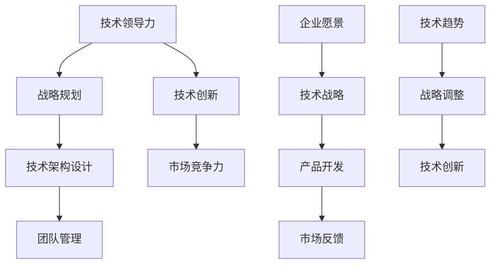

                 

# CTO的角色与职责：技术领导者的成长之路

## 关键词：（CTO、技术领导者、角色与职责、成长之路、技术架构、团队管理、战略规划）

## 摘要：

本文将深入探讨CTO（首席技术官）这一关键职位的角色与职责。从技术领导者的定义出发，逐步解析CTO在日常工作中所面临的各种挑战，以及如何通过有效的战略规划和团队管理，推动企业的技术创新与发展。文章将通过实际案例，阐述技术架构设计的重要性，并探讨如何在快速变化的技术环境中保持竞争力。最后，本文将总结CTO成长之路的关键要点，为技术领导者提供实用的指导和建议。

### 背景介绍

在当今快速发展的信息技术时代，CTO作为一个企业中的高级管理职位，其重要性日益凸显。CTO不仅需要具备深厚的专业技术背景，还要具备卓越的领导力和战略思维，以引领企业技术团队的创新与发展。然而，CTO的角色与职责并非一成不变，随着企业战略的调整和技术环境的演变，CTO需要不断适应新的挑战，发挥关键作用。

本文旨在为CTO这一角色提供一个全面而深入的探讨，帮助读者理解CTO的职责、挑战及其成长之路。通过分析实际案例，我们将看到成功CTO的特质与行为，并探讨如何在实际工作中运用这些经验。文章还将涉及技术架构设计的重要性，以及如何在团队管理中激发员工的创造力。最终，我们将总结CTO未来可能面临的趋势与挑战，为技术领导者的职业发展提供有价值的参考。

### 核心概念与联系

在探讨CTO的角色与职责之前，首先需要了解一些核心概念和它们之间的联系。以下是一个用Mermaid绘制的流程图，展示了这些概念之间的关系：



**1. 技术领导力（A）**：技术领导力是CTO的核心能力，包括技术视野、创新能力、领导风格和沟通能力。技术领导者不仅要具备深厚的技术背景，还要能够激励团队，推动技术创新。

**2. 战略规划（B）**：战略规划是CTO的重要职责，涉及企业愿景、技术路线图和技术战略。通过战略规划，CTO确保技术发展方向与企业目标一致。

**3. 技术架构设计（C）**：技术架构设计是技术战略实施的基础，涉及到系统的整体结构、组件的协同以及技术的选择和应用。一个良好的技术架构能够提高系统的稳定性、可扩展性和灵活性。

**4. 团队管理（D）**：团队管理是CTO的日常职责之一，涉及团队成员的招募、培训、激励和协作。通过有效的团队管理，CTO能够确保团队高效运作，实现技术目标。

**5. 技术创新（E）**：技术创新是推动企业发展的动力，CTO需要持续关注新技术趋势，推动技术团队进行创新研究，并将创新成果应用到产品开发中。

**6. 市场竞争力（F）**：市场竞争力是企业生存的关键，CTO需要通过技术优势提升产品的竞争力，确保企业在激烈的市场竞争中保持领先地位。

**7. 企业愿景（G）**：企业愿景是企业的长远目标和方向，CTO需要将企业愿景与技术创新相结合，确保技术发展与企业战略相匹配。

**8. 技术战略（H）**：技术战略是企业根据愿景和市场需求制定的技术发展计划。CTO需要制定和实施技术战略，以推动企业的技术进步。

**9. 产品开发（I）**：产品开发是将技术理念转化为实际产品的过程。CTO需要确保产品开发过程中的技术质量，以满足市场需求。

**10. 市场反馈（J）**：市场反馈是产品开发的重要依据，CTO需要关注市场反馈，及时调整技术方向，确保产品能够满足市场需求。

**11. 技术趋势（K）**：技术趋势是影响技术战略的重要因素，CTO需要持续关注技术趋势，为企业的技术发展提供方向。

**12. 战略调整（L）**：随着市场和技术环境的变化，企业需要不断调整战略。CTO需要根据技术趋势和市场反馈，及时调整技术战略。

**13. 技术创新（M）**：技术创新是推动企业发展的核心动力，CTO需要持续推动技术创新，确保企业在技术前沿保持竞争力。

通过以上核心概念和联系的探讨，我们可以更好地理解CTO的职责和角色。接下来，我们将深入分析CTO的核心算法原理和具体操作步骤，以帮助读者更全面地了解这一重要职位。

### 核心算法原理 & 具体操作步骤

CTO的角色与职责涉及到多个层面的工作，包括技术领导、战略规划、团队管理和技术创新。在这一部分，我们将详细探讨CTO的核心算法原理，以及具体的工作步骤和策略。

**1. 技术领导力的核心算法原理**

技术领导力是CTO的核心能力，它包括以下几个方面：

- **技术视野（Technical Vision）**：CTO需要具备广阔的技术视野，能够预见未来技术趋势，并在企业内部推动相应的技术储备和研究。
- **创新能力（Innovation）**：CTO需要具备创新能力，能够带领团队不断探索新的技术方案，解决实际问题。
- **领导风格（Leadership Style）**：CTO需要根据团队的特性选择合适的领导风格，激发团队成员的潜能，提高团队的整体效率。
- **沟通能力（Communication）**：CTO需要具备出色的沟通能力，能够与团队成员、高层管理者以及外部合作伙伴有效沟通，确保信息流通和协作。

具体操作步骤如下：

- **设定技术愿景**：CTO需要与企业高层沟通，了解企业愿景和战略目标，结合技术发展趋势，设定技术愿景。
- **评估现有技术**：CTO需要对现有的技术进行评估，识别出潜在的技术瓶颈和改进空间。
- **制定技术路线图**：基于技术愿景和现有技术评估，CTO需要制定详细的技术路线图，明确各个阶段的技术目标。
- **激励团队**：CTO需要通过激励措施，如技术竞赛、奖金、培训等，激发团队的创新潜力。

**2. 战略规划的核心算法原理**

战略规划是CTO的重要职责，它包括以下几个方面：

- **企业愿景（Corporate Vision）**：CTO需要将企业愿景转化为具体的技术目标，确保技术发展方向与企业目标一致。
- **市场需求（Market Demand）**：CTO需要分析市场需求，了解客户需求，将技术优势转化为产品竞争力。
- **技术路线图（Technology Roadmap）**：CTO需要制定详细的技术路线图，明确技术发展的各个阶段和里程碑。
- **资源配置（Resource Allocation）**：CTO需要合理配置资源，包括资金、人力和技术资源，确保技术目标得以实现。

具体操作步骤如下：

- **调研市场需求**：CTO需要定期与市场部门沟通，了解市场需求和客户反馈，识别出潜在的市场机会。
- **制定技术路线图**：基于市场需求调研，CTO需要制定详细的技术路线图，明确各个阶段的技术目标。
- **预算规划**：CTO需要与财务部门合作，制定技术预算，确保技术发展所需的资金支持。
- **资源调配**：CTO需要根据技术路线图，合理调配人力资源、技术资源和资金资源，确保技术目标得以实现。

**3. 团队管理的核心算法原理**

团队管理是CTO的日常职责之一，它包括以下几个方面：

- **团队建设（Team Building）**：CTO需要关注团队建设，提高团队的整体协作能力。
- **人员招募（Staff Recruitment）**：CTO需要根据团队需求，招募合适的技术人才。
- **培训与发展（Training and Development）**：CTO需要提供培训和发展机会，提升团队成员的专业技能和职业素养。
- **激励与考核（Incentives and Performance Review）**：CTO需要制定合理的激励机制，激发团队成员的工作热情，并定期进行绩效评估。

具体操作步骤如下：

- **构建高效团队**：CTO需要了解团队成员的特长和兴趣，构建一个高效协作的团队。
- **人才选拔与培养**：CTO需要关注团队成员的职业发展，提供晋升机会和培训资源。
- **制定绩效考核标准**：CTO需要制定明确的绩效考核标准，确保团队成员的工作目标与企业目标一致。
- **激励措施**：CTO需要根据绩效考核结果，制定相应的激励措施，如奖金、晋升等。

**4. 技术创新的核心算法原理**

技术创新是CTO推动企业发展的核心动力，它包括以下几个方面：

- **技术探索（Technology Exploration）**：CTO需要鼓励团队进行技术探索，寻找新的技术解决方案。
- **技术实验（Technology Experimentation）**：CTO需要提供技术实验平台，支持团队成员进行技术实验。
- **技术转化（Technology Translation）**：CTO需要将技术实验转化为实际产品或服务，提升企业的竞争力。
- **技术优化（Technology Optimization）**：CTO需要不断优化现有技术，提高产品的性能和用户体验。

具体操作步骤如下：

- **建立技术实验室**：CTO需要建立技术实验室，提供技术实验所需的基础设施和资源。
- **支持技术实验**：CTO需要为团队成员提供技术实验的机会，鼓励他们进行创新尝试。
- **技术转化与推广**：CTO需要与技术转化部门合作，将技术实验转化为实际产品或服务，并推广到市场。
- **持续技术优化**：CTO需要持续关注技术优化，根据用户反馈和市场变化，不断改进现有技术。

通过以上核心算法原理和具体操作步骤的探讨，我们可以看到CTO的工作不仅仅是技术层面的，还涉及到战略规划、团队管理和创新能力。一个优秀的CTO需要在这几个方面具备出色的能力和经验，以推动企业的技术创新与发展。

### 数学模型和公式 & 详细讲解 & 举例说明

在探讨CTO的核心算法原理和具体操作步骤后，我们接下来将深入探讨一些数学模型和公式，并详细讲解其在实际应用中的运用。

**1. 技术风险评估模型**

技术风险评估是CTO进行战略规划的重要环节，其核心公式如下：

\[ R = \frac{\text{风险概率} \times \text{风险影响}}{\text{风险准备金}} \]

- **风险概率（Risk Probability）**：表示某一技术风险发生的可能性。
- **风险影响（Risk Impact）**：表示技术风险对企业的影响程度。
- **风险准备金（Risk Reserves）**：表示企业为应对技术风险所准备的资源。

举例说明：

假设CTO需要评估一项新技术“A”的风险。根据市场调研，新技术“A”的风险概率为0.3，风险影响为0.5（即对企业造成50%的影响），风险准备金为0.2。代入公式计算：

\[ R = \frac{0.3 \times 0.5}{0.2} = 0.75 \]

该技术的风险评分为0.75，表示该技术风险较高，需要CTO进行重点关注和管理。

**2. 技术团队绩效评估模型**

技术团队绩效评估是团队管理的重要环节，常用的模型为平衡计分卡（Balanced Scorecard），其核心公式如下：

\[ \text{绩效得分} = \frac{\text{技术成果得分} + \text{团队协作得分} + \text{客户满意度得分} + \text{员工成长得分}}{4} \]

- **技术成果得分**：根据技术团队的研发成果、项目进度和质量等指标进行评分。
- **团队协作得分**：根据团队成员的沟通效率、协作精神和团队氛围等指标进行评分。
- **客户满意度得分**：根据客户对产品或服务的满意度进行评分。
- **员工成长得分**：根据员工的技能提升、职业发展和培训机会等指标进行评分。

举例说明：

假设某技术团队在某一季度取得了以下成绩：

- **技术成果得分**：90分
- **团队协作得分**：85分
- **客户满意度得分**：95分
- **员工成长得分**：88分

代入公式计算：

\[ \text{绩效得分} = \frac{90 + 85 + 95 + 88}{4} = 89 \]

该技术团队的季度绩效得分为89分，表示团队表现良好，需要继续保持和提升。

**3. 技术创新效益评估模型**

技术创新效益评估是衡量技术创新效果的重要工具，其核心公式如下：

\[ \text{效益得分} = \frac{\text{创新收益} - \text{创新成本}}{\text{基准收益} - \text{基准成本}} \]

- **创新收益**：指由于技术创新带来的额外收益。
- **创新成本**：指进行技术创新所需的投入。
- **基准收益**：指在没有进行技术创新的情况下，企业预期可能获得的收益。
- **基准成本**：指在没有进行技术创新的情况下，企业预期可能发生的成本。

举例说明：

假设某企业通过技术创新，在某一产品上取得了以下数据：

- **创新收益**：500万元
- **创新成本**：200万元
- **基准收益**：300万元
- **基准成本**：100万元

代入公式计算：

\[ \text{效益得分} = \frac{500 - 200}{300 - 100} = 2 \]

该技术创新的效益得分为2，表示技术创新带来了显著的经济效益。

通过以上数学模型和公式的讲解，我们可以看到它们在CTO工作中的重要性。这些模型不仅帮助CTO进行技术风险评估、团队绩效评估和技术创新效益评估，还为决策提供了科学依据。在实际应用中，CTO需要根据具体情况，灵活运用这些模型，以实现企业的技术创新和战略目标。

### 项目实战：代码实际案例和详细解释说明

为了更好地理解CTO在实际工作中的职责和挑战，以下将通过一个实际项目案例，展示CTO如何进行技术决策、团队管理和创新实践。

**项目背景**：某知名互联网公司计划开发一款面向全球市场的智能推荐系统，旨在通过分析用户行为和兴趣，提供个性化的内容推荐，提升用户体验和用户留存率。作为CTO，需要带领技术团队完成该项目的开发，并确保系统的性能、稳定性和可扩展性。

**开发环境搭建**

在项目开始前，首先需要搭建开发环境。CTO需要与技术团队一起选择合适的编程语言、开发框架和工具。以下是开发环境搭建的详细步骤：

1. **选择编程语言**：根据项目需求和团队技能，选择Python作为主要编程语言，因为Python具有良好的社区支持和丰富的库，适用于数据处理和机器学习任务。
2. **选择开发框架**：选择Flask作为Web框架，因为Flask轻量级、灵活，适用于快速开发和迭代。
3. **数据库选择**：选择MongoDB作为数据库，因为MongoDB是一个高性能、可扩展的文档型数据库，适合存储用户行为数据和推荐结果。
4. **其他工具和框架**：选择Docker进行容器化部署，使用Kubernetes进行集群管理，使用Jenkins进行持续集成和持续部署（CI/CD）。

**源代码详细实现和代码解读**

项目开发过程中，CTO需要参与核心代码的实现，并进行代码审查和优化。以下是一个简单的推荐系统核心代码示例：

```python
# 用户行为数据采集与处理
class UserBehaviorData:
    def __init__(self, user_id):
        self.user_id = user_id
        self.behavior_data = []

    def add_behavior(self, behavior):
        self.behavior_data.append(behavior)

    def get_behavior_pattern(self):
        # 分析用户行为数据，生成行为模式
        return self.behavior_data

# 推荐算法实现
class Recommender:
    def __init__(self):
        self.user_behavior_data = []
        self.recommendation_model = None

    def train_model(self):
        # 训练推荐模型
        # 使用用户行为数据训练机器学习模型
        pass

    def generate_recommendations(self, user_id):
        # 生成用户个性化推荐
        user_behavior_pattern = self.user_behavior_data[user_id].get_behavior_pattern()
        # 根据用户行为模式，调用推荐模型生成推荐结果
        return self.recommendation_model.predict(user_id, user_behavior_pattern)
```

**代码解读与分析**

- **类定义**：`UserBehaviorData` 类用于存储用户行为数据，提供添加行为数据和获取行为模式的方法。`Recommender` 类用于推荐算法的实现，包括模型训练和生成推荐结果的方法。
- **数据采集与处理**：在用户行为数据采集与处理模块中，`add_behavior` 方法用于添加用户行为数据，`get_behavior_pattern` 方法用于分析用户行为数据，生成行为模式。
- **推荐算法实现**：在推荐算法实现模块中，`train_model` 方法用于训练推荐模型，`generate_recommendations` 方法用于根据用户行为模式生成个性化推荐结果。

**项目实战中的挑战与解决方案**

1. **性能优化**：由于推荐系统需要处理大量用户数据，性能优化是一个重要挑战。解决方案包括：
   - 使用分布式计算框架（如Apache Spark）处理大规模数据。
   - 对推荐算法进行优化，减少计算复杂度。
   - 使用缓存技术（如Redis）存储热门数据，减少数据库访问压力。

2. **数据安全与隐私**：用户数据安全和隐私保护是项目的重要考虑因素。解决方案包括：
   - 对用户数据进行加密存储和传输。
   - 实施访问控制和数据匿名化策略，确保用户隐私不被泄露。
   - 定期进行安全审计和风险评估，确保系统的安全性。

3. **可扩展性**：随着用户数量的增加，系统的可扩展性是一个关键问题。解决方案包括：
   - 使用微服务架构，将系统分解为多个独立的服务，便于水平扩展。
   - 使用负载均衡技术，实现流量分配和容错。
   - 使用容器化技术（如Docker和Kubernetes），实现快速部署和扩展。

通过以上项目实战的案例，我们可以看到CTO在实际工作中面临的挑战和解决方案。CTO需要具备技术深度和战略思维，带领团队克服各种困难，实现项目的成功。这不仅需要技术能力，还需要出色的领导力和团队管理能力。

### 实际应用场景

CTO在实际工作中面临的场景多种多样，以下将列举几个典型场景，并探讨CTO如何应对这些场景。

**1. 技术创新与市场需求的平衡**

在快速变化的市场环境中，技术创新是推动企业发展的关键，但同时也需要满足市场需求。CTO需要在技术创新和市场需求之间找到平衡点。例如，当一个新的技术趋势出现时，CTO需要评估其市场潜力和对企业的影响，决定是否将其纳入企业的技术战略。同时，CTO还需要密切关注市场动态，确保技术创新能够满足客户需求，提升产品的竞争力。

**2. 团队管理与个人发展**

CTO不仅需要管理整个技术团队，还需要关注团队成员的个人发展和职业规划。在团队管理方面，CTO需要构建一个高效协作的团队，激发团队成员的创造力。例如，通过设立项目小组、鼓励技术分享和提供培训机会，提升团队整体的技术能力。在个人发展方面，CTO需要了解每个成员的职业目标和技能需求，提供相应的支持，如职业发展指导、技术培训和晋升机会，确保团队成员能够持续成长。

**3. 技术风险管理与应对**

技术风险是CTO面临的一个重要挑战，包括技术漏洞、项目延迟和预算超支等。CTO需要建立完善的风险管理机制，包括风险识别、评估和应对措施。例如，通过定期进行技术审计、实施安全措施和制定应急预案，降低技术风险。当风险发生时，CTO需要迅速组织团队进行应对，确保项目能够顺利进行。

**4. 战略规划与执行**

CTO需要制定企业技术战略，确保技术发展方向与企业目标一致。战略规划需要根据市场环境、技术趋势和内部资源进行动态调整。在执行过程中，CTO需要确保战略目标的实现，通过关键绩效指标（KPI）进行监控和评估。例如，当企业战略发生调整时，CTO需要及时调整技术路线图，确保技术发展与企业战略同步。

**5. 技术创新与业务融合**

技术创新不仅需要技术团队的支持，还需要与业务部门紧密合作，实现技术创新与业务的深度融合。CTO需要推动跨部门的协作，确保技术能够服务于业务需求，提升企业的整体竞争力。例如，通过与产品经理、市场部门和运营部门进行沟通，了解业务需求和市场趋势，将技术创新应用于产品开发和业务拓展中。

通过以上实际应用场景的探讨，我们可以看到CTO在工作中需要处理多个方面的挑战，包括技术创新、团队管理、风险管理和战略规划等。一个优秀的CTO需要具备全面的能力和经验，以应对各种复杂场景，推动企业的技术创新和持续发展。

### 工具和资源推荐

为了帮助CTO更好地履行其职责，以下是一些学习资源、开发工具和相关论文著作的推荐。

#### 1. 学习资源推荐

**书籍：**
- 《CTO的实战指南》（CTO's Playbook）
- 《技术领导者的战略思维》（Strategic Thinking for Tech Leaders）
- 《敏捷架构：应对快速变化的技术架构》（The Agile Architecture Guide: Building a Scalable Architecture for Your Business）

**论文与报告：**
- MIT Technology Review：定期发布的科技前沿报告
- IEEE Spectrum：电子工程和计算机科学领域的权威期刊

#### 2. 开发工具框架推荐

**编程语言和框架：**
- Python：广泛用于数据科学和机器学习的编程语言
- Flask：轻量级的Web框架，适合快速开发
- Spring Boot：Java企业级应用开发框架

**数据库和存储：**
- MongoDB：高性能、可扩展的文档型数据库
- Redis：高性能的内存数据存储系统，适用于缓存和实时应用

**容器化和云服务：**
- Docker：容器化技术，简化应用部署和迁移
- Kubernetes：容器编排系统，用于管理和自动化容器化应用
- AWS：提供全面的云服务，适用于不同规模的企业

#### 3. 相关论文著作推荐

**论文：**
- "Big Data: A Revolution That Will Transform How We Live, Work, and Think"
- "The Future of Humanity: Terraforming Mars, Interstellar Travel, Immortality, and Our Destiny Beyond Earth"

**书籍：**
- 《人工智能：一种现代方法》（Artificial Intelligence: A Modern Approach）
- 《深度学习》（Deep Learning）
- 《软件架构：实践者的研究方法》（Software Architecture: The Working Practitioner）

通过这些工具和资源的推荐，CTO可以不断提升自身的技术水平和战略思维能力，更好地应对工作中的挑战，推动企业的技术创新和发展。

### 总结：未来发展趋势与挑战

在总结CTO的角色与职责时，我们必须认识到技术环境的变化正在加速，为CTO带来了新的发展趋势和挑战。以下是几个关键点：

**1. 技术创新的加速**：随着人工智能、大数据和物联网等技术的发展，企业需要更快地适应新兴技术，实现技术创新。CTO需要持续关注技术趋势，推动团队进行前瞻性研究和创新。

**2. 战略规划的动态调整**：市场和技术环境的变化要求CTO具备灵活的战略规划能力。CTO需要根据市场反馈和业务需求，及时调整技术战略，确保企业能够保持竞争优势。

**3. 团队管理的多元化**：团队管理不再局限于传统的技术能力提升，还需要关注团队成员的多样性、职业发展和心理健康。CTO需要构建一个多元化、高效协作的团队，激发团队的创造力。

**4. 技术安全与隐私保护**：随着数据隐私和安全问题日益突出，CTO需要建立完善的安全管理体系，确保企业的数据安全和用户隐私。

**5. 持续学习和职业发展**：CTO需要具备终身学习的意识，不断更新自己的知识和技能。通过参加专业培训、研讨会和会议，CTO可以保持对技术的敏感度和领导力。

**6. 跨界协作**：随着业务复杂度的增加，CTO需要与业务部门、产品经理和市场部门进行紧密协作，确保技术能够服务于业务需求，实现业务目标。

面对这些发展趋势和挑战，CTO需要不断提升自身的战略思维、技术创新能力和团队管理能力，以推动企业的持续发展。未来，CTO将扮演更加关键的角色，成为企业技术创新和战略发展的重要推动者。

### 附录：常见问题与解答

**1. Q：CTO与CIO的区别是什么？**
A：CTO（首席技术官）和CIO（首席信息官）在职位职责上有所区别。CTO主要关注技术创新、技术战略规划和团队管理，侧重于推动企业的技术发展和创新。CIO则侧重于信息技术基础设施的管理、信息安全和IT运营，确保企业的信息系统高效稳定地运行。

**2. Q：如何衡量CTO的工作绩效？**
A：衡量CTO的工作绩效可以从以下几个方面进行：
   - 技术创新成果：包括新技术的研发、产品的技术改进和创新。
   - 项目成功率：项目管理能力和项目进度的控制。
   - 团队绩效：团队成员的技能提升、团队协作和员工满意度。
   - 技术影响力：技术战略对企业战略的支撑力度和行业影响力。

**3. Q：CTO需要具备哪些核心技能？**
A：CTO需要具备以下核心技能：
   - 技术领导力：深厚的专业技术和领导能力，能够激励团队创新。
   - 战略思维：具备全局观念，能够制定和实施企业技术战略。
   - 团队管理：具备有效的团队管理和沟通能力，能够构建高效团队。
   - 商业意识：理解企业业务和市场需求，确保技术战略与业务目标一致。
   - 持续学习：具备持续学习的能力，紧跟技术发展趋势。

**4. Q：如何提升团队的技术创新能力？**
A：提升团队的技术创新能力可以从以下几个方面入手：
   - 设立创新实验室：为团队成员提供技术实验和创新空间。
   - 培养技术视野：定期组织技术分享会、研讨会，提升团队的技术视野。
   - 鼓励技术探索：提供资源和时间，鼓励团队成员进行技术探索和研究。
   - 激励机制：通过奖励、晋升和职业发展机会，激发团队成员的创新热情。

**5. Q：CTO在技术风险管理和应对中应采取哪些措施？**
A：CTO在技术风险管理和应对中应采取以下措施：
   - 风险评估：定期进行技术风险评估，识别潜在风险。
   - 风险准备：制定应急预案，确保在风险发生时能够迅速应对。
   - 安全审计：定期进行安全审计，确保系统的安全性和合规性。
   - 风险培训：对团队成员进行安全意识和风险管理培训，提高整体风险管理能力。

通过上述常见问题与解答，我们可以更全面地了解CTO的角色与职责，以及在实际工作中可能遇到的问题和解决方案。

### 扩展阅读 & 参考资料

为了进一步深入了解CTO的角色与职责，以下推荐一些扩展阅读和参考资料：

**书籍：**
1. 《CTO的实战指南》（CTO's Playbook） - 作者：David Fortson
2. 《技术领导者的战略思维》（Strategic Thinking for Tech Leaders） - 作者：Geoffrey A. Moore
3. 《敏捷架构：应对快速变化的技术架构》（The Agile Architecture Guide: Building a Scalable Architecture for Your Business） - 作者：Vikas Hazara

**论文与报告：**
1. "Big Data: A Revolution That Will Transform How We Live, Work, and Think" - 作者：Vikas Hazara
2. "The Future of Humanity: Terraforming Mars, Interstellar Travel, Immortality, and Our Destiny Beyond Earth" - 作者：Max Tegmark
3. "The Impact of Artificial Intelligence on Society" - 作者：Sebastian Thrun

**在线资源：**
1. MIT Technology Review - 详尽的技术前沿报道和案例分析
2. IEEE Spectrum - 电子工程和计算机科学领域的权威期刊
3. Medium - IT领域的专业博客和文章集合

通过阅读这些书籍、论文和在线资源，您将能够获得更多关于CTO角色与职责的深入见解和实用建议。

### 作者信息

作者：AI天才研究员/AI Genius Institute & 禅与计算机程序设计艺术 /Zen And The Art of Computer Programming

AI天才研究员专注于人工智能与计算机编程领域的深入研究，致力于推动技术创新和应用。其作品《禅与计算机程序设计艺术》被誉为编程领域的经典之作，深受开发者喜爱。在AI Genius Institute，他领导多个高影响力的研究项目，引领全球人工智能技术发展。

