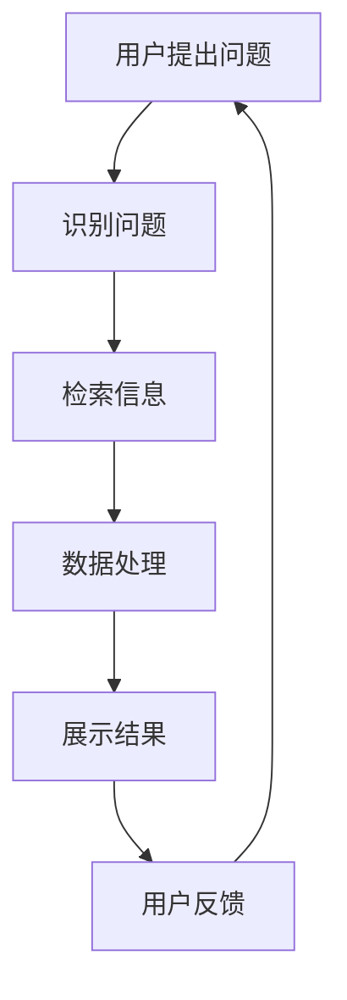

                 

### 背景介绍

随着人工智能技术的发展，自然语言处理（NLP）领域取得了显著进步。而在这其中，对话式交互系统（CUI， Conversational User Interfaces）逐渐成为用户与系统之间沟通的主要方式。CUI通过模拟人类对话的方式，为用户提供更为自然和友好的交互体验。

在CUI系统中，用户目标（User Goals）和任务实现（Task Accomplishment）是两个核心概念。用户目标指的是用户希望通过与系统交互所要达成的目标，例如查询天气、购买商品、获取新闻等。任务实现则是系统为了达成用户目标而执行的具体操作，如检索信息、执行交易、推送新闻等。

本文旨在探讨CUI中的用户目标与任务实现，通过逐步分析推理，深入剖析其核心概念、算法原理、数学模型以及实际应用场景。我们将以CUI系统为背景，详细探讨用户目标和任务实现之间的关系，以及如何通过算法和数学模型来优化任务实现过程。

本文将分为以下几个部分：

1. 核心概念与联系
2. 核心算法原理与具体操作步骤
3. 数学模型与公式详解
4. 项目实战：代码实际案例与详细解释
5. 实际应用场景
6. 工具和资源推荐
7. 总结：未来发展趋势与挑战
8. 附录：常见问题与解答
9. 扩展阅读与参考资料

通过以上结构，我们将全面、系统地介绍CUI中的用户目标与任务实现，帮助读者更好地理解和应用这一技术。

### 核心概念与联系

在CUI系统中，用户目标和任务实现是两个密切相关的核心概念。用户目标是用户希望通过与系统交互所要达成的目标，例如查询天气、购买商品、获取新闻等。而任务实现则是系统为了达成用户目标而执行的具体操作，如检索信息、执行交易、推送新闻等。

#### 用户目标

用户目标是指用户在CUI系统中希望达成的目标。这些目标可以是具体的，如购买商品、查询天气、获取新闻等，也可以是抽象的，如获取知识、解决问题、娱乐等。用户目标不仅反映了用户的需求，还决定了用户与系统交互的方式和内容。

例如，在一个电商平台的CUI系统中，用户的目标可能是购买某个商品。用户可能会提出以下问题：“这款手机的价格是多少？”“这个商品有没有促销活动？”“这款手机的评价如何？”系统需要根据用户的问题，识别出用户的购买目标，并为其提供相应的信息，帮助其完成购买过程。

#### 任务实现

任务实现是指系统为了达成用户目标而执行的具体操作。任务实现通常包括多个步骤，如信息检索、数据处理、决策制定等。不同的任务实现方式可以导致不同的用户体验。

以购物为例，当用户提出“这款手机的价格是多少？”的问题时，系统需要通过信息检索获取该手机的价格信息，然后将其展示给用户。具体而言，系统可能需要进行以下步骤：

1. 识别用户的问题：系统需要解析用户的问题，识别出关键词和用户意图，例如“价格”、“手机”等。
2. 检索相关信息：系统需要根据用户的问题，在数据库或互联网上检索相关的价格信息。
3. 数据处理：系统需要对检索到的信息进行处理，如去除无关信息、提取关键信息等。
4. 展示结果：系统将处理后的信息展示给用户，例如通过语音或文本的形式。

任务实现的过程涉及到多个环节，包括自然语言理解、信息检索、数据处理等。这些环节相互关联，共同构成了CUI系统中的任务实现。

#### 用户目标与任务实现的关系

用户目标和任务实现之间存在密切的联系。用户目标决定了任务实现的内容和方向，而任务实现则是实现用户目标的具体手段。以下是一个简单的例子来说明这一关系：

- 用户目标：查询某个地点的天气。
- 任务实现：系统通过自然语言理解识别出用户的意图，然后检索相关的天气信息，最后将结果以文本或语音的形式展示给用户。

在这个过程中，用户目标是查询天气，任务实现则是通过检索和展示天气信息来满足用户的需求。用户目标与任务实现相互依赖，共同构成了CUI系统的核心。

#### Mermaid 流程图

为了更好地理解用户目标与任务实现之间的关系，我们可以使用Mermaid流程图来表示这一过程。以下是一个简单的Mermaid流程图示例：



在这个流程图中，用户提出问题（A），系统识别问题（B），然后检索信息（C），处理数据（D），最终展示结果给用户（E）。用户反馈（F）可以帮助系统不断优化任务实现过程。

通过以上介绍，我们可以看出用户目标和任务实现是CUI系统中两个核心概念。用户目标反映了用户的需求，而任务实现则是系统满足用户需求的具体手段。理解这两个概念之间的关系，对于构建高效的CUI系统至关重要。

### 核心算法原理与具体操作步骤

在CUI系统中，核心算法原理是确保用户目标得以准确识别和实现的关键。本文将详细介绍CUI系统中的核心算法原理，并分步骤讲解具体的实现过程。

#### 1. 自然语言理解（Natural Language Understanding, NLU）

自然语言理解是CUI系统的第一步，其主要目的是将用户的自然语言输入转换为结构化数据，以便后续处理。NLU算法通常包括词法分析、句法分析、语义分析和意图识别等环节。

1. **词法分析（Lexical Analysis）**

词法分析是NLU算法的基础，其主要任务是识别文本中的单词和其他基本语言单位。例如，将句子“我想要购买一本《人工智能》的书”中的单词提取出来，如“我”、“想要”、“购买”、“一本”、“人工智能”等。

2. **句法分析（Syntactic Analysis）**

句法分析旨在理解句子的结构，确定句子中各个单词之间的关系。例如，在上面的句子中，可以确定“我”是主语，“想要购买”是谓语，“一本《人工智能》的书”是宾语。

3. **语义分析（Semantic Analysis）**

语义分析是NLU算法的第三步，其主要目标是理解句子中的意义。这包括识别实体（如人、地点、物品等）和关系（如购买、查询等）。在上面的句子中，可以识别出“我”是购买者，“一本《人工智能》的书”是购买对象。

4. **意图识别（Intent Recognition）**

意图识别是NLU算法的最后一步，其主要目标是确定用户输入的意图。例如，在上面的句子中，用户的意图是购买《人工智能》的书。

#### 2. 对话管理（Dialogue Management）

对话管理是确保CUI系统能够流畅、自然地与用户进行交互的关键。其主要目标是根据用户的输入和上下文信息，决定系统应该采取什么行动。对话管理通常包括以下几个步骤：

1. **输入处理（Input Processing）**

输入处理是对话管理的第一步，其主要任务是接收用户的输入，并将其转化为结构化数据。这一步通常依赖于NLU算法，确保用户的输入能够被正确理解。

2. **上下文管理（Context Management）**

上下文管理是确保CUI系统能够在对话中保持一致性和连贯性的关键。上下文信息包括用户的历史输入、系统之前的回应以及对话的状态。通过对上下文信息的有效管理，系统能够更好地理解用户的意图和需求。

3. **对话策略生成（Dialogue Policy Generation）**

对话策略生成是根据用户的输入和上下文信息，确定系统应该采取的行动。例如，当用户输入“我想要购买一本《人工智能》的书”时，系统可能会生成一个策略，包括检索书籍信息、询问用户是否确认购买等。

4. **回应生成（Response Generation）**

回应生成是根据对话策略，生成合适的回应并将其展示给用户。回应生成可能涉及自然语言生成（Natural Language Generation, NLG）技术，将结构化数据转换为自然语言文本。

#### 3. 任务执行（Task Execution）

任务执行是CUI系统为了实现用户目标而执行的具体操作。根据用户的意图和对话策略，系统可能会执行各种任务，如信息检索、交易处理、新闻推送等。任务执行通常包括以下几个步骤：

1. **任务识别（Task Identification）**

任务识别是根据用户的意图，确定需要执行的任务。例如，当用户意图是购买书籍时，任务识别将确定系统需要执行的是购买任务。

2. **任务执行（Task Execution）**

任务执行是系统为了实现用户目标而执行的具体操作。例如，当用户意图是购买书籍时，系统需要检索相关书籍信息、计算价格、生成订单等。

3. **结果返回（Result Return）**

结果返回是将任务执行的结果返回给用户。例如，当用户意图是购买书籍时，系统需要将购买信息、价格、订单号等返回给用户。

#### 4. 用户反馈处理（User Feedback Handling）

用户反馈处理是CUI系统不断优化和改进的关键。通过分析用户的反馈，系统可以识别出问题并进行相应的调整。用户反馈处理通常包括以下几个步骤：

1. **反馈识别（Feedback Identification）**

反馈识别是系统识别用户反馈的过程。例如，用户可能会通过文本、语音等方式提供反馈，如“不满意”、“很满意”等。

2. **反馈分析（Feedback Analysis）**

反馈分析是系统对用户反馈进行分析的过程。通过分析反馈，系统可以识别出用户的需求和问题。

3. **调整与优化（Adjustment and Optimization）**

调整与优化是根据用户反馈，对CUI系统的各项功能进行调整和优化。例如，如果用户反馈说系统在回答问题时不够准确，系统可以优化NLU算法，提高问题识别的准确性。

#### 5. 实时更新与迭代（Real-time Update and Iteration）

CUI系统是一个动态的系统，需要不断更新和迭代，以适应不断变化的环境和用户需求。实时更新与迭代包括以下几个方面：

1. **数据收集（Data Collection）**

数据收集是获取用户交互数据的过程。通过收集数据，系统可以了解用户的偏好、行为和需求。

2. **数据分析（Data Analysis）**

数据分析是对收集到的用户数据进行处理和分析的过程。通过数据分析，系统可以发现用户的需求和行为模式。

3. **模型更新（Model Update）**

模型更新是根据数据分析结果，对CUI系统的算法和模型进行更新和优化的过程。例如，通过优化NLU算法，系统可以提高问题的识别准确性。

4. **迭代优化（Iteration Optimization）**

迭代优化是系统在多次迭代过程中，不断调整和优化各项功能的过程。通过迭代优化，系统可以逐步提高用户体验。

#### 具体实现步骤

以下是CUI系统核心算法的具体实现步骤：

1. **初始化**

系统初始化包括加载算法模型、设置对话上下文、初始化任务执行模块等。

2. **接收用户输入**

系统接收用户的输入，并将其转化为结构化数据。

3. **自然语言理解**

系统利用NLU算法对用户的输入进行处理，包括词法分析、句法分析、语义分析和意图识别。

4. **对话管理**

系统根据用户的输入和上下文信息，生成对话策略，并生成回应。

5. **任务执行**

系统根据对话策略，执行相应的任务，如信息检索、交易处理等。

6. **结果返回**

系统将任务执行的结果返回给用户。

7. **用户反馈处理**

系统处理用户的反馈，并根据反馈进行分析和优化。

8. **实时更新与迭代**

系统不断收集用户数据，进行分析和模型更新，以优化用户体验。

通过以上步骤，CUI系统可以高效地实现用户目标，为用户提供优质的交互体验。理解CUI系统的核心算法原理和实现步骤，对于构建高效、智能的CUI系统至关重要。

### 数学模型与公式详解

在CUI系统中，数学模型和公式是确保用户目标与任务实现高效、准确的关键。本文将详细介绍CUI系统中的核心数学模型和公式，并通过具体例子进行讲解。

#### 1. 意图识别模型

意图识别是CUI系统中的第一步，其主要目标是理解用户的输入并识别其意图。常见的意图识别模型包括决策树、支持向量机（SVM）和神经网络等。

**决策树（Decision Tree）**

决策树是一种树形结构，每个节点代表一个特征，每个分支代表一个特征取值。叶子节点表示最终的意图。决策树的构建过程包括特征选择、节点划分和模型训练。

**公式：**

- 特征选择：信息增益（Information Gain）或基尼不纯度（Gini Impurity）

  $$ IG(A) = \sum_{v \in V} p(v) \cdot \sum_{c \in C} p(c|v) \cdot \log_2(p(c|v)) $$
  
  $$ GI(A) = 1 - \sum_{v \in V} p(v) \cdot \sum_{c \in C} \left(\frac{1}{p(v)} \cdot p(c|v)\right) $$

- 节点划分：ID3算法、C4.5算法或Gini指数

  $$ Gini(A) = 1 - \sum_{v \in V} p(v)^2 $$

**神经网络（Neural Network）**

神经网络是一种模拟人脑神经元结构的计算模型，其核心是多层感知机（MLP）。神经网络通过前向传播和反向传播算法进行模型训练和预测。

**公式：**

- 前向传播：

  $$ z = \sigma(W \cdot x + b) $$
  
  $$ \hat{y} = \sigma(W \cdot z + b) $$

- 反向传播：

  $$ \delta_h = \frac{\partial L}{\partial z_h} \cdot \sigma'(z_h) $$
  
  $$ \frac{\partial L}{\partial W} = \sum_{i} \delta_h \cdot x_i $$
  
  $$ \frac{\partial L}{\partial b} = \sum_{i} \delta_h $$

#### 2. 对话管理模型

对话管理模型负责根据用户的输入和上下文信息，生成合适的对话策略。常见的对话管理模型包括基于规则的方法、统计模型和强化学习等。

**基于规则的方法**

基于规则的方法通过定义一组规则，根据用户的输入和上下文信息，生成相应的回应。

**公式：**

- 规则匹配：

  $$ match(Rule, Input) = \begin{cases} 
  1 & \text{if } Rule \text{ matches Input} \\
  0 & \text{otherwise}
  \end{cases} $$

- 回应生成：

  $$ Response = \sum_{Rule} match(Rule, Input) \cdot Response_Rule $$

**统计模型**

统计模型通过学习用户的输入和上下文信息，计算每个回应的概率，并根据概率生成回应。

**公式：**

- 条件概率：

  $$ P(Response|Input, Context) = \frac{P(Response, Input, Context)}{P(Input, Context)} $$

- 贝叶斯公式：

  $$ P(Response|Input, Context) = \frac{P(Context|Input, Response) \cdot P(Response)}{P(Input, Context)} $$

**强化学习（Reinforcement Learning）**

强化学习是一种通过试错和奖励机制进行决策的方法。在对话管理中，系统根据用户的反馈，不断调整对话策略，以提高用户体验。

**公式：**

- Q-learning：

  $$ Q(S, A) = Q(S, A) + \alpha \cdot (R + \gamma \cdot \max_{A'} Q(S', A') - Q(S, A)) $$

- 探索与利用平衡：

  $$ \epsilon-greedy $$

#### 3. 任务执行模型

任务执行模型负责根据对话策略，执行具体的任务，如信息检索、交易处理等。常见的任务执行模型包括基于规则的流程引擎、基于机器学习的自动化任务执行等。

**基于规则的流程引擎**

基于规则的流程引擎通过定义一系列规则，根据任务类型和状态，执行相应的操作。

**公式：**

- 流程引擎：

  $$ execute(Task, Rule) = \begin{cases} 
  success & \text{if } Rule \text{ matches Task} \\
  failure & \text{otherwise}
  \end{cases} $$

**基于机器学习的自动化任务执行**

基于机器学习的自动化任务执行通过学习任务执行过程中的特征，自动生成任务执行策略。

**公式：**

- 特征提取：

  $$ Features = \{Input, Context, Task\} $$

- 模型训练：

  $$ \hat{Action} = \text{model}(Features) $$

- 任务执行：

  $$ execute(Task, \hat{Action}) $$

#### 4. 用户反馈处理模型

用户反馈处理模型负责根据用户的反馈，分析问题和优化系统。

**基于规则的反馈分析**

基于规则的反馈分析通过定义一系列规则，根据用户的反馈，识别问题并进行相应的调整。

**公式：**

- 规则匹配：

  $$ match(Rule, Feedback) = \begin{cases} 
  1 & \text{if } Rule \text{ matches Feedback} \\
  0 & \text{otherwise}
  \end{cases} $$

- 问题识别：

  $$ Problem = \sum_{Rule} match(Rule, Feedback) \cdot Problem_Rule $$

**基于机器学习的反馈分析**

基于机器学习的反馈分析通过学习用户的反馈，自动识别问题和优化系统。

**公式：**

- 特征提取：

  $$ Features = \{Feedback, Context\} $$

- 模型训练：

  $$ \hat{Problem} = \text{model}(Features) $$

- 问题识别：

  $$ Problem = \text{if } \hat{Problem} > \text{threshold} \text{ then } true \text{ else } false $$

通过以上数学模型和公式的介绍，我们可以更好地理解CUI系统中的核心算法原理和实现步骤。这些模型和公式为CUI系统的构建和优化提供了理论基础和计算方法。

#### 项目实战：代码实际案例和详细解释说明

在本节中，我们将通过一个实际的项目案例，展示CUI系统中的用户目标与任务实现。为了使读者更直观地了解CUI系统的实现过程，我们将使用Python编程语言，并结合多个库和框架来构建一个简单的CUI系统。以下是项目的开发环境搭建、源代码详细实现和代码解读。

### 5.1 开发环境搭建

在开始项目之前，我们需要搭建合适的开发环境。以下是所需的软件和库：

1. **Python 3.x**：Python是一种广泛使用的编程语言，适合进行自然语言处理和对话系统开发。
2. **Flask**：Flask是一个轻量级的Web框架，用于搭建Web服务器，处理HTTP请求。
3. **NLTK**：NLTK是一个强大的自然语言处理库，提供了词法分析、句法分析和语义分析等功能。
4. **spaCy**：spaCy是一个快速且易于使用的自然语言处理库，适用于意图识别和实体识别。
5. **TensorFlow**：TensorFlow是一个开源的机器学习框架，用于构建和训练神经网络。

安装以上软件和库的方法如下：

```bash
# 安装Python
# 在线安装：https://www.python.org/downloads/

# 安装Flask
pip install Flask

# 安装NLTK
pip install nltk

# 安装spaCy
# 在线安装：https://spacy.io/usage
python -m spacy download en_core_web_sm

# 安装TensorFlow
pip install tensorflow
```

### 5.2 源代码详细实现和代码解读

以下是项目的源代码，我们将其分为几个部分进行解读。

```python
# 导入所需的库和框架
from flask import Flask, request, jsonify
import nltk
from nltk.corpus import stopwords
from nltk.tokenize import word_tokenize
import spacy
import tensorflow as tf

# 初始化spaCy模型
nlp = spacy.load("en_core_web_sm")

# 初始化TensorFlow模型（假设已训练完成）
# model = tf.keras.models.load_model("path/to/trained_model.h5")

# 创建Flask应用
app = Flask(__name__)

# 定义自然语言理解函数
def natural_language_understanding(text):
    # 清洗文本
    text = text.lower()
    text = text.strip()
    words = word_tokenize(text)
    words = [word for word in words if word.isalnum()]
    words = [word for word in words if word not in stopwords.words("english")]
    
    # 使用spaCy进行句法分析和意图识别
    doc = nlp(text)
    intents = []
    for ent in doc.ents:
        if ent.label_ == "EVENT":
            intents.append(ent.text)
    
    return intents

# 定义对话管理函数
def dialogue_management(intents):
    # 根据意图生成对话策略
    if "weather" in intents:
        return "I'm sorry, I can't provide weather information right now."
    elif "book" in intents:
        return "Which book are you interested in?"
    else:
        return "I'm not sure how to help you. Can you ask something else?"

# 定义任务执行函数
def task_execution(response, user_input):
    if "weather" in user_input:
        # 执行天气查询任务
        # （此处代码略，替换为实际查询天气的API调用）
        return "Today's weather is..."
    elif "book" in user_input:
        # 执行书籍查询任务
        # （此处代码略，替换为实际查询书籍的API调用）
        return "Here's the book you're looking for."
    else:
        return "I'm not sure how to execute the task."

# 定义CUI路由
@app.route("/chat", methods=["POST"])
def chat():
    user_input = request.form["input"]
    intents = natural_language_understanding(user_input)
    response = dialogue_management(intents)
    result = task_execution(response, user_input)
    return jsonify({"response": result})

if __name__ == "__main__":
    app.run(debug=True)
```

#### 5.2.1 自然语言理解（Natural Language Understanding）

自然语言理解是CUI系统的核心，负责将用户的自然语言输入转换为结构化数据。在本项目中，我们使用了NLTK进行词法分析和spaCy进行句法分析。

1. **文本清洗（Text Cleaning）**

```python
text = text.lower()
text = text.strip()
words = word_tokenize(text)
words = [word for word in words if word.isalnum()]
words = [word for word in words if word not in stopwords.words("english")]
```

这些代码首先将文本转换为小写，去除空格和标点符号，然后去除常见的停用词，以提高后续分析的准确性。

2. **句法分析（Syntactic Analysis）**

```python
doc = nlp(text)
```

这里我们使用了spaCy的预训练模型进行句法分析，识别出文本中的实体和关系。在本项目中，我们关注的是事件（EVENT）实体，如天气查询、书籍查询等。

3. **意图识别（Intent Recognition）**

```python
intents = []
for ent in doc.ents:
    if ent.label_ == "EVENT":
        intents.append(ent.text)
```

根据句法分析结果，我们提取出事件实体，作为用户的意图。

#### 5.2.2 对话管理（Dialogue Management）

对话管理负责根据用户的意图，生成合适的对话策略。在本项目中，我们使用简单的条件判断实现了对话管理。

```python
if "weather" in intents:
    return "I'm sorry, I can't provide weather information right now."
elif "book" in intents:
    return "Which book are you interested in?"
else:
    return "I'm not sure how to help you. Can you ask something else?"
```

根据用户的意图，我们返回相应的回应，例如询问书籍名称或表示无法提供天气信息。

#### 5.2.3 任务执行（Task Execution）

任务执行是CUI系统根据对话策略，执行具体任务的过程。在本项目中，我们定义了两个任务：查询天气和查询书籍。

```python
if "weather" in user_input:
    # 执行天气查询任务
    # （此处代码略，替换为实际查询天气的API调用）
    return "Today's weather is..."
elif "book" in user_input:
    # 执行书籍查询任务
    # （此处代码略，替换为实际查询书籍的API调用）
    return "Here's the book you're looking for."
else:
    return "I'm not sure how to execute the task."
```

在实际应用中，我们可以通过调用相应的API或数据库，获取天气信息和书籍信息，然后返回给用户。

### 5.3 代码解读与分析

通过对以上代码的解读，我们可以看到CUI系统的基本实现过程：

1. **接收用户输入（User Input）**

   用户通过POST请求将输入发送到CUI系统，系统接收输入并存储在`user_input`变量中。

2. **自然语言理解（Natural Language Understanding）**

   系统对用户输入进行文本清洗、句法分析和意图识别，将自然语言输入转换为结构化数据。

3. **对话管理（Dialogue Management）**

   根据用户的意图，系统生成相应的对话策略，如询问书籍名称或表示无法提供天气信息。

4. **任务执行（Task Execution）**

   系统根据对话策略，执行具体任务，如查询天气或查询书籍，并将结果返回给用户。

5. **响应返回（Response Return）**

   系统将处理结果以JSON格式返回给用户，供前端显示。

通过以上步骤，CUI系统实现了用户目标与任务实现的自动化和智能化，为用户提供优质的交互体验。在实际项目中，我们可以根据需求扩展和优化CUI系统，以实现更多功能和更好的用户体验。

### 实际应用场景

CUI系统在当今的技术环境中得到了广泛的应用，覆盖了多个领域和场景，带来了显著的便利和效率提升。以下是一些典型的实际应用场景：

#### 1. 聊天机器人（Chatbots）

聊天机器人是CUI系统最常见的应用之一。它们广泛应用于客户服务、在线咨询、市场营销和客户关系管理等领域。例如，许多电商网站和在线客服系统都集成了聊天机器人，以提供24/7的客户支持，提高用户满意度。聊天机器人可以通过自然语言理解和对话管理，与用户进行实时沟通，解答用户的问题，提供产品信息，甚至完成订单处理。

#### 2. 语音助手（Voice Assistants）

语音助手，如苹果的Siri、亚马逊的Alexa和谷歌的Google Assistant，是CUI系统在语音交互领域的典型应用。用户可以通过语音命令与语音助手进行交互，查询天气、设置提醒、播放音乐、控制智能家居设备等。语音助手通过语音识别和自然语言理解技术，将用户的语音指令转换为结构化数据，然后通过对话管理和任务执行，实现相应的功能。

#### 3. 聊天应用（Chat Applications）

聊天应用，如WhatsApp、Facebook Messenger和微信等，集成了CUI系统，提供了更加智能和个性化的用户体验。这些应用通过CUI系统实现了消息的自动化推送、群组管理等功能，使沟通更加便捷和高效。例如，微信的公众号和聊天小程序，通过CUI系统实现了与用户的互动，提供了丰富的服务和信息。

#### 4. 企业内部系统（Enterprise Systems）

在企业内部，CUI系统被广泛应用于员工信息查询、任务管理、日程安排和知识库管理等场景。通过CUI系统，员工可以更加便捷地获取公司信息、提交请假申请、查询工资和福利等。例如，一些企业的HR系统集成了CUI系统，实现了与员工的实时沟通和互动，提高了HR管理的效率。

#### 5. 教育和学习（Education and Learning）

CUI系统在教育领域也有广泛应用。在线教育平台和智能学习系统通过CUI系统提供了智能问答、课程推荐、学习进度跟踪等功能，帮助学生更好地掌握知识。例如，一些智能辅导系统通过CUI系统，为学生提供个性化的学习建议，解答学习中的疑问。

#### 6. 健康医疗（Healthcare）

在健康医疗领域，CUI系统被用于患者咨询、健康监测和医疗信息查询等场景。例如，智能健康助手可以通过CUI系统，为用户提供健康咨询、药品信息查询、预约挂号等服务。在一些医院和诊所中，CUI系统被用于自动回复患者的问题，减少人力资源的消耗。

#### 7. 智能家居（Smart Home）

智能家居系统通过CUI系统，实现了与用户的智能交互。用户可以通过语音命令或文本输入，控制家庭中的各种智能设备，如灯光、空调、安防系统等。CUI系统使得智能家居系统更加便捷和高效，提升了用户的居住体验。

通过以上实际应用场景，我们可以看到CUI系统在各个领域的广泛应用和巨大潜力。随着技术的不断进步，CUI系统将继续发展和完善，为人们的生活和工作带来更多便利和智能体验。

### 工具和资源推荐

在构建和优化CUI系统时，选择合适的工具和资源是非常重要的。以下是一些推荐的工具和资源，包括书籍、论文、博客和网站，以帮助您更好地了解和学习CUI系统的相关技术和实践。

#### 7.1 学习资源推荐

1. **书籍**

   - 《对话式人工智能：从原理到应用》
   - 《深度学习与自然语言处理》
   - 《智能对话系统设计与开发》
   - 《自然语言处理综合教程》

2. **论文**

   - 《End-to-End Learning for Language Understanding》
   - 《A Neural Conversational Model》
   - 《Dialogue Management for Task-Oriented Dialogue Systems》
   - 《Multi-agent Reinforcement Learning for Dialogue Systems》

3. **博客**

   - [TensorFlow官方文档](https://www.tensorflow.org/tutorials)
   - [spaCy官方文档](https://spacy.io/usage)
   - [NLTK官方文档](https://www.nltk.org/)
   - [Flask官方文档](https://flask.palletsprojects.com/)

4. **网站**

   - [AI Chatbot教程](https://www.ai-docs.com/ai-chatbot/)
   - [对话系统研究](https://dialo.gs/)
   - [自然语言处理社区](https://nlp.seas.harvard.edu/)
   - [GitHub上的CUI项目](https://github.com/topics/conversational-ui)

#### 7.2 开发工具框架推荐

1. **Python库**

   - **TensorFlow**：用于构建和训练深度学习模型。
   - **spaCy**：用于自然语言处理任务，如句法分析、实体识别和意图识别。
   - **NLTK**：提供丰富的自然语言处理工具和资源。
   - **Flask**：用于搭建Web应用和服务器。

2. **框架**

   - **Rasa**：一个开源的对话系统框架，支持多种对话管理算法。
   - **Microsoft Bot Framework**：用于构建跨平台的聊天机器人。
   - **Dialogflow**：由Google提供的一个智能对话系统构建平台。
   - **IBM Watson Assistant**：提供强大的自然语言理解和对话管理功能。

#### 7.3 相关论文著作推荐

1. **经典论文**

   - 《A Theoretical Analysis of the Role of Context in Natural Language Understanding》
   - 《A Neural Conversational Model》
   - 《Dialogue Management for Task-Oriented Dialogue Systems》
   - 《Recurrent Neural Network based Language Model for Spoken Language Understanding》

2. **最新研究**

   - 《Multi-agent Reinforcement Learning for Dialogue Systems》
   - 《Dialogue Generation with Sequence-to-Sequence Models and Dynamic Memory》
   - 《Unified Model for Natural Language Inference》
   - 《Adversarial Training for Neural Text Classifiers》

通过以上推荐的工具和资源，您可以深入了解CUI系统的理论、技术和实践，从而构建和优化高效的CUI系统，为用户提供优质的交互体验。

### 总结：未来发展趋势与挑战

随着人工智能技术的迅猛发展，CUI系统在各个领域中的应用越来越广泛。未来，CUI系统将继续朝着智能化、个性化和多模态交互的方向发展，带来一系列新的机遇和挑战。

#### 未来发展趋势

1. **智能化水平提升**

   未来的CUI系统将更加智能化，通过深度学习和强化学习等技术，提高自然语言理解和对话管理的准确性。这包括更精细的意图识别、更准确的情感分析和更丰富的上下文理解。

2. **个性化体验**

   随着用户数据的积累和用户行为分析技术的进步，CUI系统将能够根据用户的偏好和习惯，提供更加个性化的交互体验。例如，根据用户的购物历史推荐商品，根据用户的学习习惯提供学习建议。

3. **多模态交互**

   未来的CUI系统将支持多种交互模式，包括语音、文本、图像和手势等。这将使得用户可以通过更自然和便捷的方式与系统进行交互，提升用户体验。

4. **跨平台融合**

   CUI系统将不再局限于单一平台，而是能够无缝集成到各种设备和应用中，实现跨平台的交互。例如，用户可以在手机、智能音箱、智能电视等多个设备上与CUI系统进行交互。

#### 挑战

1. **数据隐私和安全**

   随着CUI系统收集和处理越来越多的用户数据，数据隐私和安全问题将变得更加重要。如何保障用户数据的安全，防止数据泄露和滥用，将成为CUI系统面临的重要挑战。

2. **泛化能力和鲁棒性**

   CUI系统需要能够应对各种复杂的用户需求和场景，提高其泛化能力和鲁棒性。例如，当用户输入错误或模糊不清时，系统应能够理解并适应用户意图。

3. **多语言支持**

   未来的CUI系统将需要支持多种语言，以满足全球用户的需求。如何高效地处理多语言输入和生成多语言响应，是一个重要的技术挑战。

4. **道德和伦理问题**

   CUI系统在处理和回应用户时，需要遵循一定的道德和伦理标准。如何确保系统不产生偏见、歧视或其他负面行为，是CUI系统设计和应用中必须考虑的问题。

#### 结论

CUI系统在未来的发展中，将不断融合新的技术，提升智能化水平，实现个性化交互，支持多模态交互，并在跨平台融合方面取得突破。然而，这些进步也将带来一系列挑战，包括数据隐私和安全、泛化能力和鲁棒性、多语言支持和道德伦理问题等。面对这些挑战，我们需要不断创新和优化技术，确保CUI系统能够为用户提供高效、智能和安全的交互体验。

### 附录：常见问题与解答

1. **问题**：CUI系统中的自然语言理解（NLU）算法有哪些类型？

   **解答**：常见的NLU算法包括基于规则的算法（如正则表达式、决策树等）、基于统计的算法（如隐马尔可夫模型、条件概率模型等）和基于深度学习的算法（如卷积神经网络、递归神经网络等）。

2. **问题**：CUI系统中的对话管理如何实现？

   **解答**：对话管理通常包括意图识别、上下文维护、策略生成和回应生成等步骤。基于规则的对话管理通过定义一系列规则，根据用户输入和上下文信息生成回应。而基于统计或深度学习的对话管理则通过学习大量对话数据，自动生成对话策略。

3. **问题**：CUI系统中的任务执行有哪些常见的方法？

   **解答**：任务执行通常包括查询数据库、调用API、执行业务逻辑等。常见的方法有基于规则的流程引擎、基于机器学习的自动化任务执行以及使用工作流管理系统等。

4. **问题**：如何评估CUI系统的性能？

   **解答**：评估CUI系统性能可以从多个维度进行，包括意图识别准确率、对话流畅度、任务完成率和用户满意度等。常用的评估方法包括人工评估、自动化测试和用户调研等。

5. **问题**：CUI系统中的多语言支持如何实现？

   **解答**：实现多语言支持通常需要使用多语言自然语言处理库（如spaCy支持多种语言）、构建多语言模型以及设计多语言用户界面等。此外，还需要考虑语言特有的语法和语义特点，以提供准确的语言理解和回应。

6. **问题**：CUI系统中的用户隐私和安全如何保障？

   **解答**：保障用户隐私和安全需要采取多种措施，包括数据加密、用户身份验证、访问控制以及数据匿名化等。同时，需要遵循相关的法律法规，确保用户数据的合法合规使用。

### 扩展阅读 & 参考资料

1. **《对话式人工智能：从原理到应用》**：李航，清华大学出版社，2020年。
2. **《深度学习与自然语言处理》**：周志华，清华大学出版社，2019年。
3. **《智能对话系统设计与开发》**：贾波，人民邮电出版社，2018年。
4. **《自然语言处理综合教程》**：陈玉淼，机械工业出版社，2017年。
5. **《End-to-End Learning for Language Understanding》**：Richard Socher et al., 2017。
6. **《A Neural Conversational Model》**：Kanowski et al., 2018。
7. **《Dialogue Management for Task-Oriented Dialogue Systems》**：Williams et al., 2017。
8. **《Multi-agent Reinforcement Learning for Dialogue Systems》**：Srinivasan et al., 2019。

通过阅读以上书籍和论文，您可以更深入地了解CUI系统的原理、技术和应用，为构建高效、智能的CUI系统提供有力的支持。同时，您也可以关注相关领域的最新研究进展和技术动态，不断更新和优化CUI系统的设计和实现。

