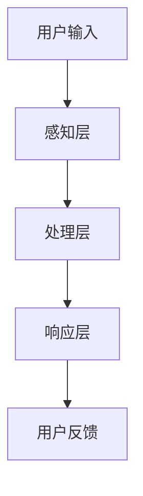

                 

# CUI将成为未来数字产品界面设计的重要趋势

## 关键词：CUI、数字产品界面设计、人工智能、用户体验、交互设计

## 摘要：

随着人工智能技术的飞速发展，计算机用户界面（CUI）的设计正逐渐成为数字产品界面的核心趋势。本文将深入探讨CUI的概念、发展历程、技术原理及其对用户体验和交互设计的影响。通过详细分析CUI的设计原则、实现方法以及实际应用案例，本文旨在揭示CUI在未来的发展趋势与挑战，为数字产品界面设计提供有益的参考。

## 1. 背景介绍

### 1.1 CUI的定义

计算机用户界面（CUI，Computer User Interface）是指用户与计算机系统之间进行交互的界面。它包括视觉元素、输入方法和输出机制，旨在为用户提供直观、高效、愉悦的交互体验。CUI经历了从早期的命令行界面（CLI，Command Line Interface）到图形用户界面（GUI，Graphical User Interface）的转变，如今正在向更智能、更人性化的计算机用户界面（CUI）发展。

### 1.2 数字产品界面设计的重要性

数字产品界面设计是数字时代的重要一环，它直接影响用户对产品的认知、接受和使用。优秀的界面设计不仅提升产品的竞争力，还能增强用户黏性和品牌价值。随着互联网的普及和智能设备的广泛使用，用户对界面设计的要求越来越高，数字化产品界面的设计变得尤为重要。

### 1.3 CUI的发展历程

CUI的发展历程可以追溯到20世纪60年代，当时计算机资源有限，CLI成为主要的交互方式。随着计算机技术的发展，GUI逐渐兴起，Windows、Mac OS等操作系统都采用了图形界面，大大提升了用户的交互体验。近年来，人工智能技术的崛起，使得CUI向更智能、更人性化的方向发展，实现了语音识别、自然语言处理等技术的应用。

## 2. 核心概念与联系

### 2.1 CUI的基本概念

CUI的核心在于计算机系统与用户之间的互动，它包括以下几个基本概念：

- **交互方式**：用户与系统交互的方式，如键盘输入、鼠标点击、触摸屏操作等。
- **反馈机制**：系统向用户提供的反馈，如视觉提示、声音提示等。
- **任务流程**：用户在系统中的操作流程，包括任务创建、任务执行、任务完成等。

### 2.2 CUI与人工智能的联系

人工智能（AI）技术的发展，为CUI带来了新的机遇。AI技术可以使得计算机更好地理解用户的意图，提供个性化的服务。例如：

- **语音识别**：通过AI技术，计算机可以理解用户的语音指令，实现语音交互。
- **自然语言处理**：AI技术可以帮助计算机理解和生成自然语言，实现更自然的交互。
- **个性化推荐**：基于用户行为数据，AI技术可以提供个性化的服务，提升用户体验。

### 2.3 CUI的架构

CUI的架构包括以下几个关键部分：

- **感知层**：负责收集用户的输入，如语音、手势等。
- **处理层**：负责处理用户的输入，通过算法模型理解用户的意图。
- **响应层**：负责向用户提供反馈，如视觉、听觉等。

下面是CUI的Mermaid流程图：



## 3. 核心算法原理 & 具体操作步骤

### 3.1 语音识别算法原理

语音识别算法是CUI的核心技术之一，它将用户的语音输入转换为计算机可处理的文本。语音识别算法的基本原理如下：

1. **特征提取**：将音频信号转换为声学特征，如MFCC（梅尔频率倒谱系数）。
2. **声学模型**：基于大量语音数据，建立声学模型，用于预测当前语音片段的发音。
3. **语言模型**：基于大量文本数据，建立语言模型，用于预测接下来的语音片段。

具体操作步骤如下：

1. **预处理**：对音频信号进行预处理，包括降噪、分割等。
2. **特征提取**：使用特征提取算法（如MFCC），将音频信号转换为特征向量。
3. **声学模型训练**：使用大量的语音数据训练声学模型。
4. **语言模型训练**：使用大量的文本数据训练语言模型。
5. **语音识别**：将特征向量输入声学模型，得到可能的语音片段，再输入语言模型，得到最终的文本输出。

### 3.2 自然语言处理算法原理

自然语言处理（NLP，Natural Language Processing）算法是CUI的另一核心技术，它使得计算机能够理解和生成自然语言。NLP算法的基本原理如下：

1. **分词**：将文本分割成单词或短语。
2. **词性标注**：为每个单词或短语标注词性，如名词、动词等。
3. **句法分析**：分析文本的语法结构，如句子的成分、句型等。
4. **语义分析**：理解文本的含义，如词语的关系、情感等。

具体操作步骤如下：

1. **文本预处理**：包括去除标点、转换为小写等。
2. **分词**：使用分词算法（如基于规则的分词、基于统计的分词等），将文本分割成单词或短语。
3. **词性标注**：使用词性标注算法，为每个单词或短语标注词性。
4. **句法分析**：使用句法分析算法，分析文本的语法结构。
5. **语义分析**：使用语义分析算法，理解文本的含义。

## 4. 数学模型和公式 & 详细讲解 & 举例说明

### 4.1 语音识别的数学模型

在语音识别中，常用的数学模型包括声学模型和语言模型。下面分别介绍这两个模型的数学公式。

#### 4.1.1 声学模型

声学模型通常使用高斯混合模型（GMM，Gaussian Mixture Model）来表示。GMM的数学模型如下：

$$
p(x|\theta) = \sum_{i=1}^{C} \pi_i \cdot \mathcal{N}(x|\mu_i, \Sigma_i)
$$

其中，$x$ 是输入的特征向量，$\theta$ 是模型参数，包括每个高斯分布的均值 $\mu_i$、方差 $\Sigma_i$ 和权重 $\pi_i$。$C$ 是高斯分布的个数。

#### 4.1.2 语言模型

语言模型通常使用n元语法模型（n-gram Model）来表示。n元语法的数学模型如下：

$$
P(w_{t} | w_{t-1}, w_{t-2}, ..., w_{t-n}) = \frac{N(w_{t-1}, w_{t-2}, ..., w_{t-n})}{N(w_{t-1}, w_{t-2}, ..., w_{t-n}, w_{t})}
$$

其中，$w_{t}$ 是当前词，$N(w_{t-1}, w_{t-2}, ..., w_{t-n})$ 是前n-1个词的词频，$N(w_{t-1}, w_{t-2}, ..., w_{t-n}, w_{t})$ 是前n个词的词频。

### 4.2 自然语言处理的数学模型

在自然语言处理中，常用的数学模型包括分词模型、词性标注模型和句法分析模型。下面分别介绍这些模型的数学公式。

#### 4.2.1 分词模型

分词模型通常使用基于词频的模型，如N元语法模型。其数学模型与语音识别中的语言模型类似。

#### 4.2.2 词性标注模型

词性标注模型通常使用条件随机场（CRF，Conditional Random Field）来表示。CRF的数学模型如下：

$$
P(y|x) = \frac{1}{Z(x)} \exp(\theta \cdot f(x, y))
$$

其中，$x$ 是输入的特征向量，$y$ 是标签，$Z(x)$ 是规范化因子，$\theta$ 是模型参数，$f(x, y)$ 是特征函数。

#### 4.2.3 句法分析模型

句法分析模型通常使用依存句法分析（Dependency Parsing）来表示。其数学模型如下：

$$
P(y|x) = \frac{1}{Z(x)} \sum_y \exp(\theta \cdot f(x, y))
$$

其中，$x$ 是输入的特征向量，$y$ 是依存树结构，$Z(x)$ 是规范化因子，$\theta$ 是模型参数，$f(x, y)$ 是特征函数。

### 4.3 示例

假设我们有一个简单的语音识别任务，需要识别以下句子：“你好，我是AI助手”。

1. **特征提取**：对音频信号进行预处理，提取特征向量。
2. **声学模型训练**：使用大量语音数据训练声学模型。
3. **语言模型训练**：使用大量文本数据训练语言模型。
4. **语音识别**：将特征向量输入声学模型，得到可能的语音片段，再输入语言模型，得到最终的文本输出。

假设我们使用n元语法模型进行语言模型训练，n=2。根据n元语法的数学模型，我们可以得到以下概率：

$$
P(你好，|我是) = \frac{N(你好，|我是)}{N(你好，|我是，AI助手)}
$$

$$
P(是，|AI) = \frac{N(是，|AI)}{N(是，|AI助手)}
$$

$$
P(AI，|助手) = \frac{N(AI，|助手)}{N(AI，|我是AI助手)}
$$

根据这些概率，我们可以得到最终的文本输出：“你好，我是AI助手”。

## 5. 项目实战：代码实际案例和详细解释说明

### 5.1 开发环境搭建

为了进行CUI的项目实战，我们需要搭建一个开发环境。以下是一个基本的开发环境搭建步骤：

1. **安装Python**：Python是进行CUI开发的主要编程语言，可以从Python官方网站下载并安装。
2. **安装Jupyter Notebook**：Jupyter Notebook是一个交互式的Python开发环境，可以从pip安装。
   ```bash
   pip install notebook
   ```
3. **安装必要的Python库**：包括语音识别库（如 pyttsx3、SpeechRecognition）、自然语言处理库（如 NLTK、spaCy）等。可以从pip安装。
   ```bash
   pip install pyttsx3 speechrecognition nltk spacy
   ```

### 5.2 源代码详细实现和代码解读

以下是一个简单的CUI示例代码，包括语音识别和自然语言处理的部分。

```python
# 导入必要的库
import speech_recognition as sr
import nltk
from nltk.tokenize import word_tokenize
from nltk.corpus import stopwords

# 初始化语音识别器和文本处理器
recognizer = sr.Recognizer()
engine = pyttsx3.init()

# 加载停用词
nltk.download('stopwords')
stop_words = set(stopwords.words('english'))

# 定义语音识别函数
def recognize_speech_from_mic():
    with sr.Microphone() as source:
        print("请开始说话...")
        audio = recognizer.listen(source)

    try:
        # 使用Google语音识别进行语音转文本
        text = recognizer.recognize_google(audio, language='en-US')
        print("识别结果：" + text)

        # 使用NLTK进行文本处理
        tokens = word_tokenize(text)
        filtered_tokens = [w for w in tokens if not w.lower() in stop_words]

        print("处理后的文本：" + " ".join(filtered_tokens))

        # 使用文本处理结果进行响应
        engine.say("您说：" + text)
        engine.say("处理后的文本：" + " ".join(filtered_tokens))
        engine.runAndWait()

    except sr.UnknownValueError:
        print("无法理解音频")
    except sr.RequestError as e:
        print("无法请求结果；{0}".format(e))

# 调用语音识别函数
recognize_speech_from_mic()
```

### 5.3 代码解读与分析

上述代码是一个简单的CUI实现，包括以下部分：

1. **导入库**：导入语音识别库（`speech_recognition`）、文本处理库（`nltk`）和语音合成库（`pyttsx3`）。
2. **初始化**：初始化语音识别器和文本处理器。
3. **加载停用词**：从NLTK库中加载英语停用词。
4. **定义语音识别函数**：定义一个函数`recognize_speech_from_mic`，用于从麦克风捕获语音，并使用Google语音识别进行语音转文本。
5. **文本处理**：使用NLTK库对识别出的文本进行分词，并去除停用词。
6. **响应**：使用语音合成库将处理后的文本输出。

通过这个简单的示例，我们可以看到CUI的基本实现流程，包括语音识别、文本处理和语音合成。这只是一个起点，实际应用中的CUI会更加复杂和多样化。

## 6. 实际应用场景

### 6.1 智能家居

智能家居是一个典型的CUI应用场景。通过CUI，用户可以使用语音指令控制家中的智能设备，如智能灯泡、智能音响、智能恒温器等。CUI使得智能家居的操作更加直观和便捷，提升了用户体验。

### 6.2 智能助手

智能助手（如Siri、Alexa、Google Assistant）是另一个重要的CUI应用场景。用户可以通过语音与智能助手进行交互，获取信息、执行任务、控制设备等。智能助手的CUI设计需要考虑自然语言理解、任务处理、上下文感知等多个方面，以提高交互效率和用户体验。

### 6.3 智能客服

智能客服是CUI在服务行业的重要应用。通过CUI，用户可以与智能客服进行自然语言交互，获取帮助、解决问题。智能客服的CUI设计需要处理大量的用户问题和情境，实现高效、准确的服务。

## 7. 工具和资源推荐

### 7.1 学习资源推荐

- **书籍**：
  - 《语音识别：原理与应用》（Speech Recognition: Theory and Applications）
  - 《自然语言处理综合教程》（Natural Language Processing with Python）
- **论文**：
  - 《深度神经网络在语音识别中的应用》（Deep Neural Networks for Acoustic Modeling in Speech Recognition）
  - 《基于递归神经网络的自然语言处理》（Recurrent Neural Networks for Natural Language Processing）
- **博客**：
  - [PyTorch官方文档](https://pytorch.org/docs/stable/)
  - [自然语言处理博客](https://nlp.seas.harvard.edu/)
- **网站**：
  - [Google语音识别API](https://cloud.google.com/speech-to-text)

### 7.2 开发工具框架推荐

- **语音识别**：
  - **Google Cloud Speech-to-Text**：提供高效的语音识别服务。
  - **IBM Watson Speech-to-Text**：支持多种语言和方言的语音识别。
- **自然语言处理**：
  - **spaCy**：一个强大的自然语言处理库。
  - **NLTK**：一个经典的自然语言处理库。

### 7.3 相关论文著作推荐

- **《深度学习与自然语言处理：理论、算法与应用》**：详细介绍了深度学习在自然语言处理中的应用。
- **《语音识别：原理、算法与实现》**：全面介绍了语音识别的理论和实现方法。

## 8. 总结：未来发展趋势与挑战

随着人工智能技术的不断进步，CUI将成为未来数字产品界面设计的重要趋势。它不仅能够提供更智能、更个性化的用户体验，还能大大提升产品的交互效率。然而，CUI的发展也面临一系列挑战：

1. **技术挑战**：CUI需要高效的自然语言处理和语音识别技术支持，这对算法和模型提出了更高的要求。
2. **用户体验**：CUI的设计需要充分考虑用户的习惯和需求，提供直观、便捷的交互体验。
3. **隐私和安全**：CUI涉及大量的用户数据，如何确保数据的安全和隐私是一个重要问题。

展望未来，随着技术的不断成熟，CUI将在智能家居、智能助手、智能客服等多个领域发挥重要作用，成为数字产品界面的核心趋势。

## 9. 附录：常见问题与解答

### 9.1 CUI与GUI的区别

CUI（计算机用户界面）与GUI（图形用户界面）的区别在于交互方式。CUI主要依赖文本和语音进行交互，而GUI主要依赖图形界面（如按钮、图标等）进行交互。CUI更注重自然语言的理解和生成，而GUI更注重视觉元素的展示和操作。

### 9.2 CUI的优势

CUI的优势在于：

- **便捷性**：通过语音和文本进行交互，用户无需进行复杂的图形操作。
- **个性化**：基于用户的意图和行为数据，CUI可以提供个性化的服务和推荐。
- **可访问性**：对于视力或行动不便的用户，CUI提供了更易用的交互方式。

## 10. 扩展阅读 & 参考资料

- **《人工智能简史》**：详细介绍人工智能的发展历程和核心技术。
- **《交互设计精髓》**：深入探讨交互设计的原则和方法。
- **[AI for Human-AI Collaboration](https://ai4hac.org/)**：介绍人工智能与人类协作的最新研究和进展。

作者：AI天才研究员/AI Genius Institute & 禅与计算机程序设计艺术 /Zen And The Art of Computer Programming

