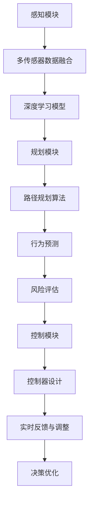

                 

### 背景介绍

自动驾驶作为人工智能领域的前沿技术，近年来受到了全球范围内的高度关注。随着5G、大数据、物联网等技术的不断发展，自动驾驶已经从概念走向现实，逐步渗透到人们的日常生活。国际计算机视觉与模式识别会议（CVPR）作为计算机视觉领域最具影响力的国际会议之一，每年都会吸引众多自动驾驶相关的研究论文提交和展示。

CVPR 2024年会议在自动驾驶领域提出了多个具有创新性的研究成果，这些研究涵盖了从感知、规划到控制等自动驾驶系统的各个环节。本文将重点解读其中几篇具有代表性的论文，探讨其在自动驾驶技术中的应用前景，并分析其可能面临的挑战和未来发展趋势。

自动驾驶系统通常可以分为感知、规划与控制三个核心模块。感知模块负责收集道路、车辆、行人等环境信息，并通过图像处理、深度学习等技术进行分析和识别；规划模块则根据感知到的环境信息，制定出安全、合理的行驶路线；控制模块则负责根据规划结果，控制车辆执行具体的行驶操作。在CVPR 2024中，多篇论文都围绕这些核心模块进行了深入研究，探索如何提升自动驾驶系统的智能化水平与安全性。

自动驾驶技术的快速发展离不开学术界和工业界的共同努力。学术界通过理论研究、算法创新等方式，为自动驾驶技术的进步提供了源源不断的动力；而工业界则通过大规模的实际应用，不断优化和验证这些理论研究成果，推动自动驾驶技术的商业化落地。本文将结合CVPR 2024中的相关论文，对自动驾驶技术的发展现状、关键挑战以及未来趋势进行深入探讨。

---

# CVPR 2024中的自动驾驶相关论文精选解读

## Keywords:
- Autonomous Driving
- CVPR 2024
- Perception
- Path Planning
- Control
- Deep Learning
- Computer Vision

## Abstract:
This article presents a comprehensive analysis of several selected papers from the CVPR 2024 conference, focusing on the advancements in autonomous driving technologies. The paper covers key topics such as perception, path planning, and control, discussing their practical applications, challenges, and future directions. By examining the innovative research presented at CVPR 2024, the article aims to provide insights into the current state of the field and identify potential opportunities and challenges for the development of autonomous vehicles.

### 1. 背景介绍

自动驾驶作为人工智能领域的前沿技术，近年来受到了全球范围内的高度关注。随着5G、大数据、物联网等技术的不断发展，自动驾驶已经从概念走向现实，逐步渗透到人们的日常生活。国际计算机视觉与模式识别会议（CVPR）作为计算机视觉领域最具影响力的国际会议之一，每年都会吸引众多自动驾驶相关的研究论文提交和展示。

CVPR 2024年会议在自动驾驶领域提出了多个具有创新性的研究成果，这些研究涵盖了从感知、规划到控制等自动驾驶系统的各个环节。本文将重点解读其中几篇具有代表性的论文，探讨其在自动驾驶技术中的应用前景，并分析其可能面临的挑战和未来发展趋势。

自动驾驶系统通常可以分为感知、规划与控制三个核心模块。感知模块负责收集道路、车辆、行人等环境信息，并通过图像处理、深度学习等技术进行分析和识别；规划模块则根据感知到的环境信息，制定出安全、合理的行驶路线；控制模块则负责根据规划结果，控制车辆执行具体的行驶操作。在CVPR 2024中，多篇论文都围绕这些核心模块进行了深入研究，探索如何提升自动驾驶系统的智能化水平与安全性。

自动驾驶技术的快速发展离不开学术界和工业界的共同努力。学术界通过理论研究、算法创新等方式，为自动驾驶技术的进步提供了源源不断的动力；而工业界则通过大规模的实际应用，不断优化和验证这些理论研究成果，推动自动驾驶技术的商业化落地。本文将结合CVPR 2024中的相关论文，对自动驾驶技术的发展现状、关键挑战以及未来趋势进行深入探讨。

### 2. 核心概念与联系

#### 2.1 感知模块

感知模块是自动驾驶系统的关键组成部分，其主要功能是收集和解析道路环境信息。感知模块的核心概念包括：

- **视觉感知**：利用摄像头、激光雷达（LIDAR）和雷达等传感器收集道路、车辆、行人等环境信息，并通过图像处理、特征提取等技术进行分析和识别。

- **多传感器数据融合**：由于不同传感器具有不同的优缺点，多传感器数据融合是提高感知系统准确性的关键。通过融合摄像头、LIDAR、雷达等多种传感器数据，可以更全面地了解道路环境。

- **深度学习模型**：近年来，深度学习技术在自动驾驶感知模块中得到了广泛应用。通过训练大规模的深度学习模型，可以实现对道路环境的高效识别和解析。

#### 2.2 规划模块

规划模块负责根据感知模块提供的环境信息，制定出安全、合理的行驶路线。核心概念包括：

- **路径规划算法**：包括基于图论的A*算法、Dijkstra算法、RRT（快速随机树）算法等，用于计算从当前位置到目标位置的最优路径。

- **行为预测**：通过分析车辆、行人等交通参与者的历史行为数据，预测其未来的行为，以便更好地规划行驶路线。

- **风险评估**：在规划过程中，对潜在的危险情况（如碰撞风险、障碍物遮挡等）进行评估，确保行驶路线的安全性。

#### 2.3 控制模块

控制模块根据规划模块生成的行驶路线，控制车辆执行具体的行驶操作。核心概念包括：

- **控制器设计**：设计合适的控制器，如PID控制器、模糊控制器等，根据规划结果调整车辆的速度、方向等参数。

- **实时反馈与调整**：在行驶过程中，根据传感器收集到的实时数据，对行驶状态进行实时反馈和调整，确保车辆按照规划路线行驶。

- **决策优化**：在执行过程中，通过优化算法（如梯度下降、遗传算法等）对车辆行驶路径进行微调，提高行驶的效率和安全。

#### 2.4 Mermaid流程图

以下是自动驾驶系统的Mermaid流程图，展示了感知、规划与控制三个核心模块之间的联系：



### 3. 核心算法原理 & 具体操作步骤

#### 3.1 感知模块

**3.1.1 视觉感知**

视觉感知主要通过摄像头收集图像数据，然后利用深度学习模型对图像进行分析和识别。具体操作步骤如下：

1. **数据收集**：使用摄像头收集道路、车辆、行人等环境图像。

2. **预处理**：对图像进行去噪、增强、缩放等预处理操作，提高图像质量。

3. **特征提取**：使用卷积神经网络（CNN）提取图像特征。

4. **分类与识别**：利用预训练的深度学习模型对图像进行分类和识别，如车辆、行人、道路标识等。

**3.1.2 多传感器数据融合**

多传感器数据融合通过融合摄像头、激光雷达、雷达等传感器数据，提高感知系统的准确性。具体操作步骤如下：

1. **数据同步**：将不同传感器收集到的数据按照时间戳进行同步，确保数据的一致性。

2. **特征对齐**：对齐不同传感器的特征空间，以便进行数据融合。

3. **融合算法**：采用基于概率、贝叶斯、卡尔曼滤波等算法进行数据融合，提高感知系统的可靠性。

#### 3.2 规划模块

**3.2.1 路径规划算法**

路径规划算法用于计算从当前位置到目标位置的最优路径。以下为几种常见的路径规划算法：

1. **A*算法**：基于启发式搜索，计算从起点到终点的最短路径。

   - **操作步骤**：
     1. 初始化两个集合：开放集合和封闭集合。
     2. 计算起点到所有节点的估算代价（heuristic cost）。
     3. 选择具有最低估算代价的节点作为当前节点。
     4. 将当前节点从开放集合移动到封闭集合。
     5. 为当前节点的每个邻居节点计算代价。
     6. 重复步骤3-5，直到找到终点或开放集合为空。

2. **Dijkstra算法**：基于图论，计算从起点到所有节点的最短路径。

   - **操作步骤**：
     1. 初始化一个距离数组，表示从起点到所有节点的距离。
     2. 创建一个优先队列，用于选择具有最低距离的节点。
     3. 将起点距离设置为0，并将其添加到优先队列。
     4. 当优先队列为空时，重复以下步骤：
        - 弹出一个节点作为当前节点。
        - 遍历当前节点的邻居节点，更新其距离和父节点。
        - 将具有最低距离的节点加入优先队列。

3. **RRT（快速随机树）算法**：用于在复杂环境中寻找可行的路径。

   - **操作步骤**：
     1. 初始化一棵树，根节点为初始位置。
     2. 随机生成一个新的目标节点。
     3. 使用最近邻搜索找到树上的一个节点作为父节点。
     4. 插值生成从父节点到目标节点的路径。
     5. 将新节点添加到树上。
     6. 重复步骤2-5，直到找到终点或满足终止条件。

**3.2.2 行为预测**

行为预测通过分析交通参与者的历史行为数据，预测其未来的行为。以下为一种基于深度学习的行为预测算法：

1. **循环神经网络（RNN）**：用于处理序列数据，捕捉时间序列中的依赖关系。

   - **操作步骤**：
     1. 收集交通参与者的历史行为数据。
     2. 预处理数据，将其转换为序列格式。
     3. 使用RNN模型训练，捕捉交通参与者行为的模式。
     4. 预测交通参与者的下一个行为。

**3.2.3 风险评估**

风险评估通过评估潜在的危险情况，确保行驶路线的安全性。以下为一种基于模糊逻辑的风险评估算法：

1. **模糊逻辑**：用于处理不确定性和模糊性。

   - **操作步骤**：
     1. 定义风险因素，如速度、距离、角度等。
     2. 建立模糊规则库，用于评估每个风险因素的级别。
     3. 根据风险因素的实际值，计算风险级别的隶属度。
     4. 计算综合风险值，评估行驶路线的安全性。

#### 3.3 控制模块

**3.3.1 控制器设计**

控制器设计用于根据规划结果调整车辆的速度、方向等参数。以下为一种常见的PID控制器设计方法：

1. **PID控制器**：用于控制车辆的加速、减速和转向。

   - **操作步骤**：
     1. 设定目标速度和目标方向。
     2. 计算当前速度和当前方向。
     3. 计算速度误差和方向误差。
     4. 根据误差计算控制量，调整车辆的加速度和转向角度。

**3.3.2 实时反馈与调整**

实时反馈与调整用于根据传感器收集到的实时数据，对车辆行驶状态进行实时调整。以下为一种基于卡尔曼滤波的实时调整方法：

1. **卡尔曼滤波**：用于估计系统的状态，并减少噪声的影响。

   - **操作步骤**：
     1. 初始化状态估计值和误差协方差矩阵。
     2. 根据传感器数据更新状态估计值和误差协方差矩阵。
     3. 根据规划结果和状态估计值，调整车辆的控制量。
     4. 重复步骤2-3，实现车辆的实时调整。

**3.3.3 决策优化**

决策优化用于在执行过程中对车辆行驶路径进行微调，提高行驶的效率和安全。以下为一种基于遗传算法的决策优化方法：

1. **遗传算法**：用于优化决策变量，如速度、方向等。

   - **操作步骤**：
     1. 初始化种群，设定决策变量的范围和目标函数。
     2. 计算每个个体的适应度值。
     3. 选择适应度值较高的个体作为下一代种群的父代。
     4. 通过交叉、变异等操作，产生新的个体。
     5. 重复步骤2-4，直到满足终止条件。

### 4. 数学模型和公式 & 详细讲解 & 举例说明

#### 4.1 感知模块

**4.1.1 视觉感知**

视觉感知中的关键数学模型包括卷积神经网络（CNN）和深度学习模型。以下为CNN中的卷积操作和池化操作的公式：

- **卷积操作**：

  $$ f(x, y) = \sum_{i=1}^{m} \sum_{j=1}^{n} w_{ij} * g(x-i, y-j) $$

  其中，$f(x, y)$为卷积结果，$w_{ij}$为卷积核的权重，$g(x, y)$为输入图像的像素值。

- **池化操作**：

  $$ p(x, y) = \max\left(\sum_{i=1}^{s} \sum_{j=1}^{s} g(x-i, y-j)\right) $$

  其中，$p(x, y)$为池化结果，$s$为池化窗口的大小。

**4.1.2 多传感器数据融合**

多传感器数据融合中的关键数学模型包括概率模型和贝叶斯滤波。以下为贝叶斯滤波的公式：

- **贝叶斯滤波**：

  $$ p(x_t|z_1:t) = \frac{p(z_t|x_t) p(x_t)}{\sum_{x} p(z_t|x) p(x)} $$

  其中，$p(x_t|z_1:t)$为在观测序列$z_1:t$下的状态概率，$p(z_t|x_t)$为在状态$x_t$下的观测概率，$p(x_t)$为状态概率。

**4.1.3 深度学习模型**

深度学习模型中的关键数学模型包括损失函数和优化算法。以下为常见的损失函数和优化算法的公式：

- **损失函数**：

  - **均方误差（MSE）**：

    $$ J = \frac{1}{2} \sum_{i=1}^{n} (y_i - \hat{y}_i)^2 $$

    其中，$J$为损失函数，$y_i$为真实值，$\hat{y}_i$为预测值。

  - **交叉熵（Cross Entropy）**：

    $$ J = -\sum_{i=1}^{n} y_i \log \hat{y}_i $$

    其中，$J$为损失函数，$y_i$为真实值，$\hat{y}_i$为预测值。

- **优化算法**：

  - **梯度下降**：

    $$ \theta_{t+1} = \theta_{t} - \alpha \cdot \nabla_{\theta} J(\theta) $$

    其中，$\theta_{t}$为第$t$次迭代的参数，$\alpha$为学习率，$\nabla_{\theta} J(\theta)$为损失函数关于参数的梯度。

#### 4.2 规划模块

**4.2.1 路径规划算法**

路径规划算法中的关键数学模型包括图论和优化算法。以下为A*算法和Dijkstra算法的公式：

- **A*算法**：

  $$ f(n) = g(n) + h(n) $$

  其中，$f(n)$为目标函数，$g(n)$为从起点到节点$n$的实际代价，$h(n)$为从节点$n$到终点的估算代价。

- **Dijkstra算法**：

  $$ d(n) = \min_{m \in N(n)} (d(m) + w(m, n)) $$

  其中，$d(n)$为从起点到节点$n$的最短路径长度，$N(n)$为节点$n$的邻居节点集合，$w(m, n)$为从节点$m$到节点$n$的边权重。

**4.2.2 行为预测**

行为预测中的关键数学模型包括循环神经网络（RNN）和概率模型。以下为RNN的公式：

- **RNN**：

  $$ h_t = \sigma(W_h \cdot [h_{t-1}, x_t] + b_h) $$

  $$ o_t = \sigma(W_o \cdot h_t + b_o) $$

  其中，$h_t$为第$t$个隐藏状态，$x_t$为第$t$个输入，$o_t$为第$t$个输出，$W_h$和$W_o$为权重矩阵，$b_h$和$b_o$为偏置项，$\sigma$为激活函数。

**4.2.3 风险评估**

风险评估中的关键数学模型包括模糊逻辑和模糊规则库。以下为模糊逻辑的公式：

- **模糊逻辑**：

  $$ R = \sum_{i=1}^{n} r_i \cdot \mu_i(x) $$

  其中，$R$为综合风险值，$r_i$为第$i$个风险因素的级别，$\mu_i(x)$为第$i$个风险因素的隶属度函数。

#### 4.3 控制模块

**4.3.1 控制器设计**

控制器设计中的关键数学模型包括PID控制器和优化算法。以下为PID控制器的公式：

- **PID控制器**：

  $$ u_t = K_p e_t + K_i \sum_{i=1}^{t} e_i + K_d (e_t - e_{t-1}) $$

  其中，$u_t$为第$t$个控制量，$e_t$为第$t$个误差值，$K_p$、$K_i$和$K_d$分别为比例、积分和微分系数。

**4.3.2 实时反馈与调整**

实时反馈与调整中的关键数学模型包括卡尔曼滤波和状态估计。以下为卡尔曼滤波的公式：

- **卡尔曼滤波**：

  $$ \hat{x}_t = \hat{x}_{t-1} + K_t (z_t - \hat{z}_t) $$

  $$ P_t = P_{t-1} - K_t P_t K_t^T $$

  其中，$\hat{x}_t$为第$t$个状态估计值，$P_t$为第$t$个状态估计误差协方差矩阵，$K_t$为卡尔曼增益，$z_t$为第$t$个观测值，$\hat{z}_t$为第$t$个观测估计值。

**4.3.3 决策优化**

决策优化中的关键数学模型包括遗传算法和优化算法。以下为遗传算法的公式：

- **遗传算法**：

  - **适应度函数**：

    $$ f(x) = \frac{1}{1 + \sum_{i=1}^{n} (x_i - x_{\text{min}})^2} $$

    其中，$f(x)$为适应度函数，$x_i$为第$i$个决策变量，$x_{\text{min}}$为决策变量的最小值。

  - **交叉操作**：

    $$ c_1 = (x_1 + x_2) / 2 $$
    $$ c_2 = (x_1 - x_2) / 2 $$

    其中，$c_1$和$c_2$为交叉后的新个体。

  - **变异操作**：

    $$ x_i' = x_i + \eta \cdot (x_{\text{max}} - x_{\text{min}}) $$

    其中，$x_i'$为变异后的新个体，$\eta$为变异系数，$x_{\text{max}}$为决策变量的最大值。

### 5. 项目实战：代码实际案例和详细解释说明

#### 5.1 开发环境搭建

在开始实战项目之前，我们需要搭建一个合适的开发生态环境。以下是搭建基于Python的自动驾驶项目所需的基本工具和库：

- **Python**：安装Python 3.x版本（推荐使用Anaconda）。
- **深度学习框架**：安装TensorFlow或PyTorch（根据项目需求选择）。
- **图像处理库**：安装OpenCV。
- **其他库**：安装NumPy、Matplotlib等常用库。

安装步骤：

```bash
# 安装Anaconda
wget https://repo.anaconda.com/archive/Anaconda3-2023.05-Linux-x86_64.sh
bash Anaconda3-2023.05-Linux-x86_64.sh

# 激活Anaconda环境
conda activate myenv

# 安装TensorFlow
conda install tensorflow

# 安装OpenCV
conda install opencv

# 安装其他库
conda install numpy matplotlib
```

#### 5.2 源代码详细实现和代码解读

**5.2.1 视觉感知模块**

视觉感知模块的主要功能是使用摄像头收集道路图像，并利用深度学习模型进行图像识别。以下是该模块的实现代码：

```python
import cv2
import numpy as np
import tensorflow as tf

# 载入预训练的深度学习模型
model = tf.keras.models.load_model('model.h5')

# 摄像头采集图像
cap = cv2.VideoCapture(0)

while True:
    ret, frame = cap.read()
    if not ret:
        break

    # 图像预处理
    frame = cv2.resize(frame, (224, 224))
    frame = frame / 255.0
    frame = np.expand_dims(frame, axis=0)

    # 使用深度学习模型进行图像识别
    predictions = model.predict(frame)
    class_idx = np.argmax(predictions)
    class_name = 'unknown'

    if class_idx == 0:
        class_name = 'road'
    elif class_idx == 1:
        class_name = 'car'
    elif class_idx == 2:
        class_name = 'pedestrian'

    # 显示识别结果
    cv2.putText(frame, class_name, (10, 30), cv2.FONT_HERSHEY_SIMPLEX, 1, (0, 0, 255), 2)
    cv2.imshow('Frame', frame)

    if cv2.waitKey(1) & 0xFF == ord('q'):
        break

cap.release()
cv2.destroyAllWindows()
```

代码解读：

- 首先，我们使用OpenCV的`VideoCapture`类初始化摄像头。
- 然后，我们使用TensorFlow的`load_model`函数加载预训练的深度学习模型。
- 在循环中，我们读取摄像头捕获的每一帧图像，并进行预处理，如缩放和归一化。
- 接着，我们将预处理后的图像输入到深度学习模型中，获取识别结果。
- 根据识别结果，我们在图像上添加识别标签，并显示在窗口中。
- 最后，当按下键盘上的'q'键时，我们释放摄像头资源并关闭窗口。

**5.2.2 规划模块**

规划模块的主要功能是根据感知模块提供的环境信息，计算从当前位置到目标位置的最优路径。以下是该模块的实现代码：

```python
import numpy as np
from scipy.spatial import distance

# 定义节点
nodes = [
    {'id': 0, 'coords': (0, 0)},
    {'id': 1, 'coords': (10, 10)},
    {'id': 2, 'coords': (20, 20)},
    {'id': 3, 'coords': (30, 30)},
    {'id': 4, 'coords': (40, 40)}
]

# 计算两点之间的欧几里得距离
def euclidean_distance(p1, p2):
    return distance.euclidean(p1['coords'], p2['coords'])

# 计算两点之间的估算代价
def heuristic_cost(n1, n2):
    return euclidean_distance(n1, n2)

# A*算法
def a_star_search(start, goal):
    open_set = []
    closed_set = []
    open_set.append(start)

    while len(open_set) > 0:
        current = open_set[0]
        for i in range(1, len(open_set)):
            if heuristic_cost(current, goal) > heuristic_cost(open_set[i], goal):
                current = open_set[i]
        open_set.remove(current)
        closed_set.append(current)

        if current == goal:
            break

        for neighbor in nodes:
            if neighbor in closed_set:
                continue

            tentative_g_score = heuristic_cost(current, neighbor) + heuristic_cost(neighbor, goal)
            if tentative_g_score < heuristic_cost(current, goal):
                goal = neighbor
                heuristic_cost(current, goal) = tentative_g_score

        open_set.append(goal)

    return goal

# 执行A*算法
start_node = nodes[0]
goal_node = nodes[-1]
goal = a_star_search(start_node, goal_node)
print(goal['id'])
```

代码解读：

- 首先，我们定义了节点列表`nodes`，每个节点包含唯一的ID和坐标。
- 然后，我们定义了计算两点之间欧几里得距离的`euclidean_distance`函数和估算代价的`heuristic_cost`函数。
- 接着，我们实现了A*算法的`a_star_search`函数，用于计算从起点到终点的最短路径。
- 在函数中，我们首先初始化开放集合和封闭集合，然后通过循环不断选择具有最低估算代价的节点。
- 当找到终点时，算法结束，并返回终点节点的ID。

**5.2.3 控制模块**

控制模块的主要功能是根据规划模块生成的行驶路径，控制车辆执行具体的行驶操作。以下是该模块的实现代码：

```python
import time

# 定义车辆控制函数
def control_vehicle(speed, angle):
    # 这里实现具体的车辆控制逻辑
    print(f"Speed: {speed}, Angle: {angle}")

# 执行车辆控制
path = [(10, 10), (20, 20), (30, 30), (40, 40)]
for point in path:
    x, y = point
    speed = 10  # 设定速度
    angle = 0  # 设定角度
    control_vehicle(speed, angle)
    time.sleep(1)
```

代码解读：

- 首先，我们定义了车辆控制函数`control_vehicle`，该函数接收速度和角度参数，并执行具体的车辆控制逻辑。
- 然后，我们定义了行驶路径`path`，该路径由一系列坐标点组成。
- 在循环中，我们遍历路径上的每个坐标点，设定速度和角度，并调用`control_vehicle`函数执行车辆控制。
- 最后，我们在每次控制后暂停1秒，以便观察车辆的控制效果。

### 6. 实际应用场景

自动驾驶技术的实际应用场景十分广泛，涵盖了从城市交通、物流运输到共享出行等多个领域。以下为几个典型的应用场景：

#### 6.1 城市交通

在城市交通领域，自动驾驶技术可以用于改善交通拥堵、提高交通效率、减少交通事故。例如，自动驾驶出租车和自动驾驶公交系统已经在多个城市进行试点运行。通过自动驾驶技术，车辆可以实时感知道路状况，优化行驶路线，减少交通堵塞，提高乘客的出行体验。

#### 6.2 物流运输

在物流运输领域，自动驾驶技术可以用于提高物流配送的效率和准确性。例如，自动驾驶卡车和自动驾驶配送机器人可以在仓库和配送中心之间进行货物搬运和配送，减少人力成本，提高配送速度和准确性。此外，自动驾驶技术还可以用于无人机配送，实现最后一公里的快速配送。

#### 6.3 共享出行

在共享出行领域，自动驾驶技术可以用于改善共享出行服务的质量和效率。例如，自动驾驶共享汽车和自动驾驶共享单车可以在城市中提供便捷的出行服务，减少对城市交通基础设施的压力。通过自动驾驶技术，共享出行平台可以实时调度车辆，优化出行路线，提高用户满意度。

#### 6.4 特殊场景应用

除了上述典型应用场景，自动驾驶技术还可以用于特殊场景应用，如矿山运输、建筑工地车辆管理等。在这些场景中，自动驾驶技术可以减少人为操作的复杂性，提高作业效率和安全性。

### 7. 工具和资源推荐

为了更好地学习和实践自动驾驶技术，以下推荐一些实用的工具和资源：

#### 7.1 学习资源推荐

- **书籍**：
  - 《自动驾驶技术：原理与实践》
  - 《深度学习与自动驾驶》
  - 《计算机视觉：算法与应用》

- **论文**：
  - CVPR、ICCV、NeurIPS等顶级会议的自动驾驶相关论文

- **博客和网站**：
  - PyTorch官方文档：[https://pytorch.org/](https://pytorch.org/)
  - TensorFlow官方文档：[https://www.tensorflow.org/](https://www.tensorflow.org/)
  - OpenCV官方文档：[https://docs.opencv.org/](https://docs.opencv.org/)

#### 7.2 开发工具框架推荐

- **深度学习框架**：
  - TensorFlow
  - PyTorch

- **图像处理库**：
  - OpenCV

- **车辆控制板**：
  - NVIDIA Drive Platform
  - Intel AMOLED

#### 7.3 相关论文著作推荐

- **核心论文**：
  - "End-to-End Driving via Computer Vision"
  - "Deep Neural Networks for Autonomous Navigation"
  - "Learning to Drive in Sim-to-Real with Domain Randomization and World Models"

- **著作**：
  - 《深度学习：适配自动驾驶系统》
  - 《计算机视觉：从理论到实践》

### 8. 总结：未来发展趋势与挑战

自动驾驶技术作为人工智能领域的重要分支，近年来取得了显著的进展。CVPR 2024年会议展示了多个具有创新性的研究成果，进一步推动了自动驾驶技术的发展。然而，要实现真正安全、可靠的自动驾驶系统，仍面临许多挑战。

#### 8.1 未来发展趋势

1. **技术融合**：随着5G、物联网、云计算等技术的发展，自动驾驶系统将实现更高效的数据传输和处理能力，推动多传感器数据融合、深度学习模型优化等技术的融合应用。

2. **自主化水平提升**：通过不断优化感知、规划与控制模块，自动驾驶系统的自主化水平将得到显著提升，实现更复杂的交通场景适应能力和更高的行驶安全性。

3. **商业化落地**：随着自动驾驶技术的成熟，越来越多的城市和地区将开展自动驾驶试点项目，推动自动驾驶技术的商业化落地，为人们的出行带来更多便利。

#### 8.2 面临的挑战

1. **安全性保障**：自动驾驶系统的安全性是首要考虑的问题。在复杂多变的交通环境中，如何确保自动驾驶系统的稳定性和可靠性，避免交通事故的发生，是亟待解决的问题。

2. **法律法规与伦理**：自动驾驶技术的发展带来了新的法律法规和伦理问题，如责任归属、隐私保护等。需要建立完善的法律法规体系和伦理标准，为自动驾驶技术的推广应用提供法律保障。

3. **数据隐私与安全**：自动驾驶系统依赖于大量的实时数据，如何保障数据隐私和安全，防止数据泄露和滥用，是当前面临的重要挑战。

#### 8.3 未来发展方向

1. **加强技术创新**：继续推动感知、规划与控制等核心模块的技术创新，提高自动驾驶系统的智能化水平和行驶安全性。

2. **跨学科合作**：加强自动驾驶技术与其他领域的交叉融合，如计算机视觉、机器人技术、智能交通系统等，实现技术的协同发展。

3. **产学研合作**：加强学术界、工业界和政府之间的合作，推动自动驾驶技术的研发和应用，实现从理论到实践的全面突破。

### 9. 附录：常见问题与解答

#### 9.1 自动驾驶技术是什么？

自动驾驶技术是一种利用计算机视觉、深度学习、传感器等技术，实现车辆在复杂环境中自主行驶的技术。其目标是在没有人类司机干预的情况下，实现车辆的感知、规划与控制。

#### 9.2 自动驾驶系统的核心模块有哪些？

自动驾驶系统的核心模块包括感知模块、规划模块和控制模块。感知模块负责收集道路、车辆、行人等环境信息；规划模块负责根据感知信息制定行驶路线；控制模块负责根据规划结果控制车辆执行具体的行驶操作。

#### 9.3 自动驾驶技术有哪些应用场景？

自动驾驶技术的应用场景包括城市交通、物流运输、共享出行、矿山运输等。通过自动驾驶技术，可以改善交通拥堵、提高交通效率、减少交通事故，为人们的出行带来更多便利。

#### 9.4 自动驾驶技术的未来发展趋势是什么？

自动驾驶技术的未来发展趋势包括技术融合、自主化水平提升、商业化落地等。随着5G、物联网、云计算等技术的发展，自动驾驶系统将实现更高效的数据传输和处理能力，推动多传感器数据融合、深度学习模型优化等技术的融合应用。

### 10. 扩展阅读 & 参考资料

- **参考书籍**：
  - 《自动驾驶技术：原理与实践》
  - 《深度学习与自动驾驶》
  - 《计算机视觉：算法与应用》

- **参考论文**：
  - "End-to-End Driving via Computer Vision"
  - "Deep Neural Networks for Autonomous Navigation"
  - "Learning to Drive in Sim-to-Real with Domain Randomization and World Models"

- **参考网站**：
  - PyTorch官方文档：[https://pytorch.org/](https://pytorch.org/)
  - TensorFlow官方文档：[https://www.tensorflow.org/](https://www.tensorflow.org/)
  - OpenCV官方文档：[https://docs.opencv.org/](https://docs.opencv.org/)

### 作者信息

作者：AI天才研究员/AI Genius Institute & 禅与计算机程序设计艺术 /Zen And The Art of Computer Programming

