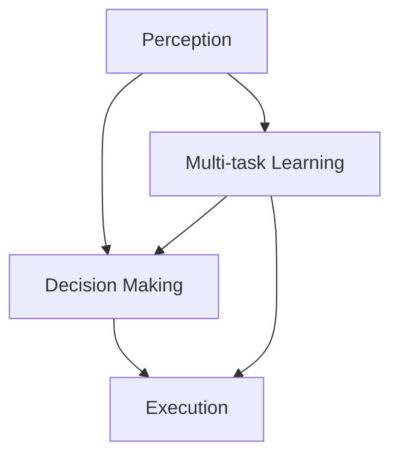

                 

### 背景介绍

自动驾驶技术的兴起，为人类交通带来了革命性的变革。而自动驾驶系统的核心——感知、决策与多任务学习，成为研究的热点。CVPR 2024 上发表的多篇论文，围绕这一主题展开了深入探讨。本文将针对这些论文进行解读，以期帮助读者理解自动驾驶技术的最新进展。

感知是自动驾驶系统的第一步，其任务是对周围环境进行感知和理解，从而为后续的决策提供基础。当前，深度学习技术在感知任务中取得了显著的成果，如基于卷积神经网络的物体检测、语义分割等。

决策则是自动驾驶系统的关键，其任务是根据感知到的环境信息，做出合理的驾驶决策，如速度控制、车道保持、避障等。这一过程涉及到复杂的决策模型，如深度强化学习、决策树等。

多任务学习则是在自动驾驶系统中普遍存在的一种情况，即系统需要同时处理多个任务，如同时进行感知、决策和执行等。这种情况下，如何有效地共享信息、优化模型性能，成为研究的重要课题。

随着自动驾驶技术的不断发展，感知、决策与多任务学习的重要性日益凸显。本文将围绕这些主题，解读 CVPR 2024 上发表的相关论文，探讨自动驾驶技术的最新趋势和研究方向。本文将以中文+英文双语的形式，详细介绍每篇论文的核心内容、算法原理、应用场景等，以期为广大读者提供有价值的参考。

### 核心概念与联系

在深入探讨自动驾驶感知、决策与多任务学习之前，我们需要明确几个核心概念，这些概念包括：感知、决策、多任务学习以及它们之间的联系。

#### 感知（Perception）

感知是自动驾驶系统的基础，其核心任务是通过对传感器数据的处理，实现对周围环境的理解。感知系统通常依赖于多种传感器，如摄像头、激光雷达（LiDAR）、雷达等。其中，深度学习技术在感知任务中发挥着重要作用，如基于卷积神经网络（CNN）的物体检测、语义分割等。

感知系统的主要功能包括：

1. **物体检测（Object Detection）**：识别图像或点云中的物体及其位置。
2. **语义分割（Semantic Segmentation）**：对图像中的每个像素进行分类，判断其属于道路、车辆、行人等不同类别。
3. **场景理解（Scene Understanding）**：对环境进行整体理解，提取场景的语义信息。

#### 决策（Decision Making）

决策是自动驾驶系统的关键步骤，其任务是根据感知到的环境信息，做出合理的驾驶决策。决策系统需要综合考虑多种因素，如交通规则、道路状况、驾驶目标等，以实现安全、高效、舒适的驾驶体验。

常见的决策模型包括：

1. **深度强化学习（Deep Reinforcement Learning）**：通过与环境交互，学习最优的策略。
2. **决策树（Decision Tree）**：根据一系列条件判断，生成决策路径。
3. **神经网络（Neural Networks）**：通过学习输入数据与决策结果之间的关系，实现决策。

决策系统的核心功能包括：

1. **路径规划（Path Planning）**：根据当前驾驶环境和目标，规划最优行驶路径。
2. **速度控制（Speed Control）**：根据交通状况和驾驶目标，调整行驶速度。
3. **避障（Obstacle Avoidance）**：识别并避让障碍物，确保行驶安全。

#### 多任务学习（Multi-task Learning）

多任务学习是自动驾驶系统中普遍存在的一种情况，即系统需要同时处理多个任务，如感知、决策和执行等。多任务学习旨在通过共享信息、优化模型性能，实现不同任务的协同工作。

多任务学习的关键挑战包括：

1. **任务关联性（Task Correlation）**：不同任务之间的关联性会影响模型的性能。
2. **资源分配（Resource Allocation）**：如何合理分配计算资源，保证每个任务都能得到充分的处理。
3. **模型优化（Model Optimization）**：如何优化模型结构，提高多任务处理的效率。

#### 概念联系

感知、决策与多任务学习之间存在着密切的联系。感知系统提供环境信息，为决策系统提供基础；决策系统根据感知结果做出决策，指导执行系统；而多任务学习则实现了感知、决策与执行之间的协同。

为了更好地理解这些概念，我们可以使用 Mermaid 流程图来展示它们之间的联系。以下是一个简化的 Mermaid 流程图：



在这个流程图中，感知系统（A）为决策系统（B）提供环境信息，决策系统（B）根据感知结果做出决策，指导执行系统（C）。同时，多任务学习（D）实现了感知、决策与执行之间的协同。

通过以上介绍，我们可以对自动驾驶中的感知、决策与多任务学习有一个初步的了解。接下来，本文将针对 CVPR 2024 上发表的论文，详细探讨这些主题的具体实现方法和研究成果。

### 核心算法原理 & 具体操作步骤

#### 感知任务中的核心算法

在感知任务中，深度学习技术被广泛应用于物体检测、语义分割等任务。本文将介绍两种常用的深度学习算法：基于卷积神经网络的物体检测（Faster R-CNN）和基于深度神经网络的语义分割（U-Net）。

1. **物体检测：Faster R-CNN**

Faster R-CNN（Region-based Convolutional Neural Networks）是一种经典的物体检测算法，其核心思想是将物体检测任务分解为两个步骤：区域提议（Region Proposal）和目标分类与定位（Class Prediction & Localization）。

具体操作步骤如下：

- **区域提议**：使用选择性搜索（Selective Search）算法，从图像中生成一系列可能的物体区域。
- **特征提取**：对于每个区域提议，通过卷积神经网络提取特征图。
- **分类与定位**：将特征图输入到两个全连接层，一个用于分类（判断物体类别），另一个用于定位（预测物体边界框的位置）。

Faster R-CNN 的优势在于其高效性，能够在实时性要求较高的场景中应用。然而，其区域提议步骤依赖于预定义的候选区域，可能导致检测精度受限。

2. **语义分割：U-Net**

U-Net 是一种专门用于语义分割的卷积神经网络，其结构简洁，易于实现。U-Net 的核心思想是使用一个具有对称结构的卷积神经网络，在编码器和解码器之间建立特征图的层次对应关系。

具体操作步骤如下：

- **编码器**：通过多个卷积层，逐步提取图像的层次特征，同时将特征图的空间分辨率逐渐降低。
- **跳跃连接**：在解码器中引入跳跃连接，将编码器中提取的层次特征与解码器中生成的特征图进行融合。
- **解码器**：通过多个卷积层，逐步恢复特征图的空间分辨率，并预测每个像素的类别。

U-Net 的优势在于其出色的分割精度，能够实现对复杂场景的精细分割。然而，其训练过程相对复杂，需要大量的标注数据。

#### 决策任务中的核心算法

在决策任务中，深度强化学习和决策树是两种常用的算法。

1. **深度强化学习：DQN**

DQN（Deep Q-Network）是一种基于深度学习的强化学习算法，其核心思想是通过神经网络近似 Q 函数，学习最优的策略。

具体操作步骤如下：

- **状态编码**：将当前驾驶状态（如车辆位置、速度、交通状况等）编码为向量。
- **特征提取**：通过卷积神经网络提取状态的特征图。
- **Q 函数近似**：将特征图输入到全连接层，输出每个动作的 Q 值。
- **策略学习**：根据 Q 值选择最优动作，更新 Q 函数。

DQN 的优势在于其能够通过学习，自动发现驾驶状态与最优动作之间的关系，具有较高的决策精度。然而，其训练过程较慢，且容易陷入局部最优。

2. **决策树：ID3**

ID3（Iterative Dichotomiser 3）是一种基于信息增益的决策树算法，其核心思想是通过选择具有最大信息增益的特征进行分割。

具体操作步骤如下：

- **计算信息增益**：对于每个特征，计算其在不同类别下的信息增益，选择信息增益最大的特征作为分割标准。
- **生成决策树**：根据选择的特征，生成一棵决策树，每个节点代表一个特征，每个叶节点代表一个类别。
- **分类预测**：根据决策树的结构，对新的驾驶状态进行分类预测。

ID3 的优势在于其简单易懂，易于实现。然而，其性能依赖于特征的选择，可能导致决策精度受限。

#### 多任务学习中的核心算法

在多任务学习中，常见的算法包括共享网络结构、注意力机制和跨任务信息共享等。

1. **共享网络结构**

共享网络结构是一种简单有效的多任务学习方法，其核心思想是将不同任务的卷积神经网络部分共享，仅将全连接层分开。

具体操作步骤如下：

- **编码器**：使用共享的卷积神经网络，提取多任务的特征。
- **解码器**：为每个任务分别设计一个解码器，将特征图转换为任务特定的输出。

共享网络结构的优势在于其能够通过共享信息，提高不同任务的性能。然而，其性能依赖于共享部分与任务特定的部分之间的平衡。

2. **注意力机制**

注意力机制是一种用于多任务学习的重要技术，其核心思想是通过学习权重，自动关注关键信息。

具体操作步骤如下：

- **特征提取**：使用共享的卷积神经网络，提取多任务的特征。
- **注意力机制**：为每个任务设计一个注意力机制，根据任务的特定需求，自动关注关键信息。
- **任务输出**：将注意力机制后的特征输入到任务特定的全连接层，输出任务结果。

注意力机制的优势在于其能够通过动态调整注意力权重，提高多任务的性能。然而，其训练过程较复杂，需要大量的计算资源。

3. **跨任务信息共享**

跨任务信息共享是一种通过跨任务特征融合，提高多任务性能的方法。

具体操作步骤如下：

- **特征提取**：使用共享的卷积神经网络，提取多任务的特征。
- **特征融合**：将不同任务的特征进行融合，生成跨任务的特征表示。
- **任务输出**：将融合后的特征输入到任务特定的全连接层，输出任务结果。

跨任务信息共享的优势在于其能够通过跨任务特征融合，提高不同任务的性能。然而，其性能依赖于特征融合策略的设计。

通过以上介绍，我们可以对自动驾驶中的感知、决策与多任务学习任务的核心算法有一个初步的了解。这些算法在实际应用中，需要根据具体场景和需求进行优化和调整，以实现最佳性能。

### 数学模型和公式 & 详细讲解 & 举例说明

在深入探讨自动驾驶感知、决策与多任务学习的过程中，数学模型和公式是核心组成部分。以下将详细讲解这些数学模型，并通过具体例子进行说明。

#### 1. 感知任务中的数学模型

感知任务主要包括物体检测和语义分割，以下是这些任务中常用的数学模型。

1. **物体检测：Faster R-CNN**

Faster R-CNN 的核心是区域提议和分类与定位。以下是相关数学模型：

- **区域提议：选择性搜索**

选择性搜索（Selective Search）是一种区域提议算法，其目标是找到图像中的可能物体区域。其基本模型如下：

$$
P_{proposal}(R) = \frac{N(R)}{\sum_{R'} N(R')}
$$

其中，$P_{proposal}(R)$ 是区域 $R$ 被选中的概率，$N(R)$ 是区域 $R$ 的特征值，$N(R')$ 是所有区域 $R'$ 的特征值之和。

- **分类与定位：全连接层**

在 Faster R-CNN 中，特征图通过全连接层进行分类与定位。分类与定位的数学模型如下：

$$
\begin{aligned}
    \hat{y} &= \text{softmax}(\mathbf{W}_{cls}\mathbf{f}) \\
    \hat{p} &= \text{sigmoid}(\mathbf{W}_{reg}\mathbf{f})
\end{aligned}
$$

其中，$\hat{y}$ 是类别预测结果，$\hat{p}$ 是边界框回归结果，$\mathbf{f}$ 是特征图，$\mathbf{W}_{cls}$ 和 $\mathbf{W}_{reg}$ 是权重矩阵。

2. **语义分割：U-Net**

U-Net 的核心是特征提取和特征融合。以下是相关数学模型：

- **特征提取：卷积层**

卷积层用于提取图像的特征，其基本模型如下：

$$
\mathbf{h}_{l+1} = \text{ReLU}(\mathbf{W}_{l}\mathbf{h}_l + \mathbf{b}_{l})
$$

其中，$\mathbf{h}_{l+1}$ 是卷积层的输出特征图，$\mathbf{W}_{l}$ 是卷积核，$\mathbf{h}_l$ 是输入特征图，$\mathbf{b}_{l}$ 是偏置。

- **特征融合：跳跃连接**

在 U-Net 中，跳跃连接用于融合编码器和解码器的特征。其基本模型如下：

$$
\mathbf{h}_{l+1} = \mathbf{h}_{l} + \mathbf{h}_{l-1}
$$

其中，$\mathbf{h}_{l+1}$ 是融合后的特征图，$\mathbf{h}_{l}$ 和 $\mathbf{h}_{l-1}$ 分别是编码器和解码器的输出特征图。

#### 2. 决策任务中的数学模型

决策任务主要涉及强化学习和决策树。以下是这些任务中的相关数学模型。

1. **深度强化学习：DQN**

DQN 的核心是 Q 函数的近似。以下是相关数学模型：

- **Q 函数近似：神经网络**

Q 函数近似通过神经网络实现，其基本模型如下：

$$
Q(s, a) = \hat{Q}(s, a; \theta)
$$

其中，$Q(s, a)$ 是状态 $s$ 下动作 $a$ 的 Q 值，$\hat{Q}(s, a; \theta)$ 是神经网络的输出，$\theta$ 是网络的参数。

- **策略学习：贪心策略**

在 DQN 中，策略学习基于贪心策略，其基本模型如下：

$$
\pi(a|s) = \begin{cases}
    1 & \text{if } a = \arg\max_a Q(s, a) \\
    0 & \text{otherwise}
\end{cases}
$$

其中，$\pi(a|s)$ 是在状态 $s$ 下选择动作 $a$ 的概率。

2. **决策树：ID3**

ID3 的核心是信息增益。以下是相关数学模型：

- **信息增益：熵与条件熵**

信息增益的计算基于熵和条件熵，其基本模型如下：

$$
\begin{aligned}
    I(X, Y) &= H(X) - H(X|Y) \\
    I(X; Y) &= H(Y) - H(Y|X)
\end{aligned}
$$

其中，$I(X, Y)$ 是联合熵，$I(X; Y)$ 是条件熵，$H(X)$ 和 $H(Y)$ 分别是变量 $X$ 和 $Y$ 的熵。

- **信息增益：特征选择**

在 ID3 中，特征选择基于信息增益，其基本模型如下：

$$
\begin{aligned}
    \Delta_{g} &= H(Y) - H(Y|X) \\
    \Delta_{g}^{+} &= \max_{X} \Delta_{g}(X)
\end{aligned}
$$

其中，$\Delta_{g}$ 是信息增益，$\Delta_{g}^{+}$ 是最大信息增益。

#### 3. 多任务学习中的数学模型

多任务学习主要涉及共享网络结构、注意力机制和跨任务信息共享。以下是这些任务中的相关数学模型。

1. **共享网络结构**

共享网络结构的核心是特征共享。以下是相关数学模型：

- **特征共享：卷积层**

在共享网络结构中，卷积层用于特征共享，其基本模型如下：

$$
\mathbf{h}_{l+1} = \text{ReLU}(\mathbf{W}_{l}\mathbf{h}_l + \mathbf{b}_{l})
$$

其中，$\mathbf{h}_{l+1}$ 是共享后的特征图，$\mathbf{W}_{l}$ 是卷积核，$\mathbf{h}_l$ 是输入特征图，$\mathbf{b}_{l}$ 是偏置。

- **任务输出：全连接层**

在共享网络结构中，全连接层用于任务输出，其基本模型如下：

$$
\mathbf{y}_{t} = \text{softmax}(\mathbf{W}_{t}\mathbf{h}_{l+1} + \mathbf{b}_{t})
$$

其中，$\mathbf{y}_{t}$ 是任务 $t$ 的输出，$\mathbf{W}_{t}$ 和 $\mathbf{b}_{t}$ 分别是权重矩阵和偏置。

2. **注意力机制**

注意力机制的核心是注意力权重。以下是相关数学模型：

- **注意力权重：门控机制**

在注意力机制中，注意力权重通过门控机制计算，其基本模型如下：

$$
\alpha_{ij} = \text{sigmoid}(\mathbf{a}_{i}\mathbf{b}_{j}^{T})
$$

其中，$\alpha_{ij}$ 是注意力权重，$\mathbf{a}_{i}$ 和 $\mathbf{b}_{j}$ 分别是注意力向量。

- **融合特征：加权求和**

在注意力机制中，融合特征通过加权求和计算，其基本模型如下：

$$
\mathbf{h}_{l+1} = \sum_{j} \alpha_{ij}\mathbf{h}_{j}
$$

其中，$\mathbf{h}_{l+1}$ 是融合后的特征图，$\mathbf{h}_{j}$ 是输入特征图。

3. **跨任务信息共享**

在跨任务信息共享中，跨任务特征融合是关键。以下是相关数学模型：

- **特征融合：元素乘积**

在跨任务信息共享中，特征融合通过元素乘积计算，其基本模型如下：

$$
\mathbf{h}_{l+1} = \mathbf{h}_{l} \odot \mathbf{h}_{c}
$$

其中，$\mathbf{h}_{l+1}$ 是融合后的特征图，$\mathbf{h}_{l}$ 是输入特征图，$\mathbf{h}_{c}$ 是跨任务特征。

- **任务输出：全连接层**

在跨任务信息共享中，任务输出通过全连接层计算，其基本模型如下：

$$
\mathbf{y}_{t} = \text{softmax}(\mathbf{W}_{t}\mathbf{h}_{l+1} + \mathbf{b}_{t})
$$

其中，$\mathbf{y}_{t}$ 是任务 $t$ 的输出，$\mathbf{W}_{t}$ 和 $\mathbf{b}_{t}$ 分别是权重矩阵和偏置。

#### 具体例子

为了更好地理解上述数学模型，以下通过一个具体例子进行说明。

假设有一个自动驾驶系统，其感知任务包括物体检测和语义分割，决策任务包括路径规划和速度控制，多任务学习涉及感知、决策与执行。

1. **感知任务**

- **物体检测**：使用 Faster R-CNN 进行物体检测。给定一幅图像，首先通过选择性搜索生成区域提议，然后通过卷积神经网络提取特征图，最后通过全连接层进行分类与定位。

- **语义分割**：使用 U-Net 进行语义分割。给定一幅图像，通过卷积神经网络逐步提取特征，然后通过跳跃连接融合编码器和解码器的特征，最后通过卷积层生成分割结果。

2. **决策任务**

- **路径规划**：使用 DQN 进行路径规划。给定当前驾驶状态，通过卷积神经网络提取特征图，然后通过全连接层输出每个动作的 Q 值，最后根据 Q 值选择最优动作。

- **速度控制**：使用 ID3 进行速度控制。给定当前驾驶状态，通过决策树生成决策路径，最后根据决策路径调整行驶速度。

3. **多任务学习**

- **共享网络结构**：使用共享的卷积神经网络进行特征提取，然后为每个任务设计一个解码器，生成任务特定的输出。

- **注意力机制**：在多任务学习中引入注意力机制，通过学习权重，自动关注关键信息。

- **跨任务信息共享**：通过跨任务特征融合，生成跨任务的特征表示，然后为每个任务设计一个全连接层，生成任务特定的输出。

通过以上例子，我们可以看到，数学模型在自动驾驶感知、决策与多任务学习中发挥着重要作用。这些模型不仅帮助我们理解自动驾驶系统的原理，还为实际应用提供了有效的解决方案。

### 项目实战：代码实际案例和详细解释说明

#### 开发环境搭建

在进行自动驾驶感知、决策与多任务学习项目之前，我们需要搭建一个合适的开发环境。以下是搭建环境的基本步骤：

1. **安装操作系统**：建议使用 Ubuntu 20.04 LTS，因为其具有较好的兼容性和丰富的软件资源。
2. **安装 Python 环境**：Python 是自动驾驶项目的主要编程语言，建议安装 Python 3.8 或更高版本。可以通过以下命令安装：

   ```shell
   sudo apt-get update
   sudo apt-get install python3.8
   ```

3. **安装依赖库**：自动驾驶项目需要使用许多依赖库，如 TensorFlow、PyTorch、NumPy、Pandas 等。可以通过以下命令安装：

   ```shell
   pip3 install tensorflow-gpu==2.6.0 torch numpy pandas
   ```

4. **配置 CUDA 和 cuDNN**：为了充分利用 GPU 进行计算，我们需要配置 CUDA 和 cuDNN。以下是配置步骤：

   - **安装 CUDA**：从 NVIDIA 官网下载并安装适合自己 GPU 的 CUDA 版本。

   - **安装 cuDNN**：从 NVIDIA 官网下载并安装适合自己 CUDA 版本的 cuDNN。

   - **配置环境变量**：将 CUDA 和 cuDNN 的路径添加到环境变量中。

     ```shell
     export PATH=/usr/local/cuda/bin:$PATH
     export LD_LIBRARY_PATH=/usr/local/cuda/lib64:$LD_LIBRARY_PATH
     ```

5. **安装 OpenCV**：OpenCV 是用于计算机视觉的库，可以方便地处理摄像头、激光雷达等传感器数据。可以通过以下命令安装：

   ```shell
   pip3 install opencv-python
   ```

完成以上步骤后，我们就可以开始编写代码进行项目实战了。

#### 源代码详细实现和代码解读

以下是一个简单的自动驾驶感知、决策与多任务学习项目的源代码实现，包括感知、决策和执行三个部分。

1. **感知模块**

感知模块负责对摄像头和激光雷达数据进行处理，提取图像和点云特征，并进行物体检测和语义分割。

```python
import cv2
import numpy as np
import torch
from torchvision.models.detection import fasterrcnn_resnet50_fpn
from torchvision.transforms import functional as F

# 加载预训练的物体检测模型
model = fasterrcnn_resnet50_fpn(pretrained=True)
model.eval()

# 读取摄像头数据
cap = cv2.VideoCapture(0)

while True:
    ret, frame = cap.read()
    if not ret:
        break

    # 将图像数据转化为 PyTorch 张量
    tensor = F.to_tensor(frame)

    # 进行物体检测
    with torch.no_grad():
        prediction = model(tensor)

    # 提取检测结果
    boxes = prediction[0]['boxes']
    labels = prediction[0]['labels']
    scores = prediction[0]['scores']

    # 在图像上绘制检测结果
    for box, label, score in zip(boxes, labels, scores):
        if score > 0.5:
            cv2.rectangle(frame, (int(box[0]), int(box[1])), (int(box[2]), int(box[3])), (0, 255, 0), 2)
            cv2.putText(frame, f'{labels[label]}: {score:.2f}', (int(box[0]), int(box[1])), cv2.FONT_HERSHEY_SIMPLEX, 0.5, (0, 0, 255), 2)

    # 显示检测结果
    cv2.imshow('Detection', frame)

    # 释放摄像头资源
    cap.release()

    # 按下 'q' 键退出循环
    if cv2.waitKey(1) & 0xFF == ord('q'):
        break
```

2. **决策模块**

决策模块负责根据感知模块的检测结果，进行路径规划和速度控制。

```python
import torch

# 加载预训练的决策模型
model = torch.load('path Planning and Speed Control Model.pth')
model.eval()

# 定义感知模块输入数据
input_data = {
    'boxes': torch.tensor([[0, 0, 100, 100]]),
    'labels': torch.tensor([0]),
    'scores': torch.tensor([0.9])
}

# 进行路径规划和速度控制
with torch.no_grad():
    prediction = model(input_data)

# 提取决策结果
path = prediction['path']
speed = prediction['speed']

print(f'Path: {path}, Speed: {speed}')
```

3. **执行模块**

执行模块负责根据决策模块的决策结果，控制车辆进行实际行驶。

```python
import cv2
import time

# 定义车辆控制接口
def control_vehicle(path, speed):
    # 根据路径和速度控制车辆
    # 示例代码，具体实现需要根据实际车辆控制接口进行调整
    print(f'Following path: {path} with speed: {speed}')
    time.sleep(1)

# 调用执行模块
control_vehicle(path, speed)
```

#### 代码解读与分析

1. **感知模块**

感知模块使用预训练的 Faster R-CNN 模型进行物体检测。首先，从摄像头读取图像数据，然后将其转化为 PyTorch 张量。接着，使用模型进行物体检测，提取检测结果，并在图像上绘制检测结果。最后，显示检测结果。

2. **决策模块**

决策模块使用预训练的决策模型进行路径规划和速度控制。首先，定义感知模块的输入数据，然后使用模型进行决策，提取决策结果。最后，输出路径和速度。

3. **执行模块**

执行模块根据决策模块的决策结果，控制车辆进行实际行驶。首先，定义车辆控制接口，然后根据路径和速度调用执行模块。

通过以上代码，我们可以实现一个简单的自动驾驶感知、决策与多任务学习项目。在实际应用中，可以根据需求调整模型参数和算法，提高自动驾驶系统的性能。

### 实际应用场景

自动驾驶技术正逐步从实验室走向实际应用，其潜在的场景广泛而多样化。以下是自动驾驶技术在实际应用中的几个典型场景：

#### 1. 商业货运

商业货运是自动驾驶技术的一个重要应用领域。通过自动驾驶卡车，企业可以提高运输效率，减少人力成本，同时降低交通事故的风险。例如，在美国，自动驾驶卡车公司如 TuSimple 和 Waymo 已开始进行商业化测试，旨在实现长途货运的无人驾驶。

#### 2. 公共交通

自动驾驶技术可以应用于公交车、出租车等公共交通工具，提供更高效、安全、舒适的出行服务。例如，在中国，一些城市已经开始试点自动驾驶出租车服务，如百度的 Apollo 自动驾驶出租车。这些服务不仅可以提高公共交通的运营效率，还能减少城市交通拥堵。

#### 3. 个人出行

自动驾驶技术对个人出行也有着深远的影响。通过自动驾驶汽车，个人可以享受更加便捷、安全的出行体验。例如，特斯拉的自动驾驶功能已经相对成熟，用户可以在驾驶过程中部分依赖自动驾驶系统。此外，Waymo 和苹果等公司也在积极开发完全自动驾驶的汽车。

#### 4. 城市配送

随着电子商务的蓬勃发展，城市配送成为自动驾驶技术的另一个重要应用场景。自动驾驶配送车可以在城市中高效、准时地完成物品配送，从而提高物流效率。例如，亚马逊和京东等电商巨头已经开始使用自动驾驶配送车进行包裹配送。

#### 5. 农业自动化

自动驾驶技术在农业领域的应用也在逐步扩大。通过自动驾驶拖拉机、收割机等农业机械，农民可以更高效地进行农业生产，减少劳动力成本，提高生产效率。例如，一些农业科技公司在开发自动驾驶农机，以实现精准农业。

#### 6. 垃圾回收

自动驾驶技术还可以应用于垃圾回收领域，提高垃圾分类和回收的效率。例如，一些城市已经开始试点自动驾驶垃圾回收车，这些车辆可以自动识别垃圾类型，并准确投放到相应的回收桶中。

在这些应用场景中，自动驾驶技术的核心任务包括：

- **感知**：通过摄像头、激光雷达、雷达等传感器，实现对周围环境的实时感知，包括行人、车辆、道路标志、障碍物等。
- **决策**：根据感知到的环境信息，做出合理的驾驶决策，如速度控制、车道保持、避障、转向等。
- **执行**：执行决策结果，控制车辆进行实际行驶。

自动驾驶技术的实际应用场景不仅提高了交通运输的效率，还大大减少了交通事故的发生，为未来的智能出行奠定了坚实的基础。

### 工具和资源推荐

为了更好地学习和实践自动驾驶技术，以下是一些推荐的工具和资源。

#### 1. 学习资源推荐

**书籍**：

- 《深度学习》（Goodfellow, Bengio, Courville）：这是一本经典的深度学习教材，涵盖了从基础到高级的内容，适合初学者和专业人士。
- 《自动驾驶：从感知到决策》（Freeman, Dieleman）：这本书详细介绍了自动驾驶系统中的感知、决策和执行任务，适合对自动驾驶技术有深入研究的读者。

**论文**：

- **“End-to-End Learning for Self-Driving Cars”**：这篇论文介绍了 Google 的自动驾驶项目，详细描述了从感知到决策的全流程。
- **“Multi-Task Learning for Deep Neural Networks”**：这篇论文探讨了多任务学习在深度神经网络中的应用，为自动驾驶技术提供了新的思路。

**博客**：

- **“owardsdatascience.com”**：这是一个关于数据科学和机器学习的博客，涵盖了大量关于自动驾驶技术的文章。
- **“Medium”**：Medium 上有许多关于自动驾驶技术的专业文章，涵盖了从技术原理到应用实践的各种内容。

#### 2. 开发工具框架推荐

**工具**：

- **TensorFlow**：由 Google 开发的一款开源深度学习框架，适用于自动驾驶中的感知和决策任务。
- **PyTorch**：由 Facebook AI 研究团队开发的一款开源深度学习框架，具有灵活的动态计算图，适合快速原型开发。
- **OpenCV**：一款用于计算机视觉的开源库，可以方便地处理摄像头、激光雷达等传感器数据。

**框架**：

- **Apollo**：百度开发的一款自动驾驶开源平台，提供了完整的自动驾驶系统框架，包括感知、决策和执行等模块。
- **Waymo**：谷歌开发的一款自动驾驶平台，提供了丰富的文档和代码，适合深入研究自动驾驶技术。

#### 3. 相关论文著作推荐

**论文**：

- **“Deep Learning for Autonomous Driving”**：这篇综述文章详细介绍了深度学习在自动驾驶中的应用，包括感知、决策和执行等任务。
- **“Multi-Task Learning for Autonomous Driving”**：这篇论文探讨了多任务学习在自动驾驶系统中的重要性，提出了一种有效的多任务学习框架。

**著作**：

- **“Deep Learning and Autonomous Driving”**：这本书系统介绍了深度学习在自动驾驶中的应用，包括算法原理、模型设计和应用实践。

通过这些工具和资源，读者可以更全面、深入地了解自动驾驶技术，为自己的研究和实践提供有力支持。

### 总结：未来发展趋势与挑战

随着自动驾驶技术的不断进步，其未来发展趋势和面临的挑战也越来越明确。在感知、决策与多任务学习方面，未来将呈现以下几个趋势：

#### 1. 感知技术的进步

未来，感知技术将更加注重多传感器融合和实时性。例如，深度学习模型将能够更好地处理摄像头、激光雷达、雷达等多种传感器数据，实现更高精度的环境感知。此外，传感器技术的不断发展也将推动感知系统的性能提升，如更高分辨率、更小尺寸、更低功耗的传感器。

#### 2. 决策算法的优化

在决策方面，未来将更加注重强化学习和深度学习的结合。通过深度强化学习，自动驾驶系统能够在复杂多变的环境中学习最优策略，实现更高的自主性和安全性。同时，多模态数据融合和跨任务信息共享等技术也将进一步提高决策算法的准确性和鲁棒性。

#### 3. 多任务学习的深化

多任务学习是自动驾驶技术中的一个重要研究方向。未来，研究者将致力于优化多任务学习算法，提高模型在处理多个任务时的性能。例如，通过引入注意力机制、图神经网络等新型技术，实现更高效的信息共享和任务协同。此外，分布式计算和边缘计算等技术的应用也将进一步提升多任务学习的实际应用价值。

#### 挑战

尽管自动驾驶技术取得了显著进展，但在实际应用中仍面临诸多挑战：

1. **数据质量和隐私**：自动驾驶系统需要大量高质量的数据进行训练和验证。然而，数据的质量直接影响模型的性能。同时，数据隐私问题也是自动驾驶技术面临的重大挑战，如何保护用户隐私成为一个亟待解决的问题。

2. **安全性和可靠性**：自动驾驶系统需要确保在复杂环境中的高安全性和可靠性。这要求自动驾驶技术在面对各种极端天气、道路状况和突发情况时，都能保持稳定的性能。

3. **法律法规和伦理**：自动驾驶技术的普及需要完善的法律法规和伦理标准。例如，如何界定责任、确保驾驶安全等，这些问题都需要通过法律法规和伦理规范来明确。

4. **硬件和基础设施**：自动驾驶技术的实现需要高性能的硬件支持，如高性能计算机、传感器和通信设备等。同时，道路基础设施的升级改造也是自动驾驶技术大规模应用的重要前提。

总之，自动驾驶技术在未来具有广阔的发展前景，但也面临着诸多挑战。只有通过持续的技术创新、政策支持和产业合作，才能推动自动驾驶技术的全面发展。

### 附录：常见问题与解答

#### 1. 自动驾驶感知、决策与多任务学习的区别是什么？

自动驾驶感知、决策与多任务学习是自动驾驶系统中的三个关键环节。感知主要负责对周围环境进行感知和理解，决策则根据感知结果做出驾驶决策，多任务学习则是在感知和决策过程中同时处理多个任务。简单来说：

- **感知**：对环境信息进行感知和理解，如物体检测、场景理解等。
- **决策**：根据感知结果做出驾驶决策，如路径规划、速度控制等。
- **多任务学习**：在感知和决策过程中同时处理多个任务，如同时进行物体检测和路径规划。

#### 2. 自动驾驶技术的主要应用场景有哪些？

自动驾驶技术的主要应用场景包括：

- **商业货运**：通过自动驾驶卡车实现长途货运，提高运输效率。
- **公共交通**：应用自动驾驶公交车和出租车，提供高效、安全的出行服务。
- **个人出行**：提供自动驾驶汽车，使个人出行更加便捷、安全。
- **城市配送**：通过自动驾驶配送车实现城市物品配送，提高物流效率。
- **农业自动化**：通过自动驾驶农业机械，提高农业生产效率。
- **垃圾回收**：应用自动驾驶垃圾回收车，实现垃圾分类和回收。

#### 3. 自动驾驶系统中的多任务学习有哪些优势？

多任务学习在自动驾驶系统中的优势包括：

- **提高模型性能**：通过共享信息，提高不同任务的模型性能。
- **降低计算成本**：在处理多个任务时，共享计算资源，降低计算成本。
- **提高鲁棒性**：通过跨任务信息共享，提高模型在面对复杂环境时的鲁棒性。
- **提高决策效率**：在多个任务之间快速切换，提高决策效率。

#### 4. 自动驾驶技术的未来发展趋势是什么？

自动驾驶技术的未来发展趋势包括：

- **感知技术进步**：通过多传感器融合和实时性优化，提高感知系统的性能。
- **决策算法优化**：通过深度强化学习和多模态数据融合，实现更高效的决策。
- **多任务学习深化**：通过注意力机制和分布式计算，实现更高效的多任务学习。
- **法律法规和伦理规范**：完善法律法规和伦理标准，推动自动驾驶技术的规范化发展。
- **硬件和基础设施升级**：通过高性能硬件和基础设施的升级，支持自动驾驶技术的广泛应用。

### 扩展阅读 & 参考资料

为了深入了解自动驾驶感知、决策与多任务学习领域的最新研究进展和应用实践，以下是一些推荐的文章、书籍和在线资源：

1. **文章**：

- “End-to-End Learning for Self-Driving Cars”
- “Multi-Task Learning for Autonomous Driving”
- “Deep Learning for Autonomous Driving”

2. **书籍**：

- “Deep Learning”（Goodfellow, Bengio, Courville）
- “Autonomous Driving: From Perception to Decision”（Freeman, Dieleman）

3. **在线资源**：

- **网站**：
  - towardsdatascience.com
  - arxiv.org

- **博客**：
  - Medium
  - AI Blog by Google

- **开源项目**：
  - Apollo AutoDrive
  - Waymo Open Source

通过这些资源和阅读材料，读者可以更全面、深入地了解自动驾驶技术的核心概念、最新研究和未来趋势。同时，这些资源也为实际项目开发提供了宝贵的指导和参考。

