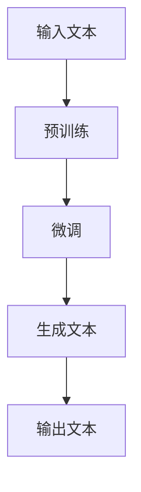

                 

### 文章标题

**ChatGPT引爆新一轮AI创业热潮**

### 关键词：
- ChatGPT
- AI创业
- 自然语言处理
- 机器学习
- 深度学习
- 模型架构
- 应用场景

### 摘要：
本文旨在探讨ChatGPT这一自然语言处理模型的崛起如何引领新一轮AI创业热潮。文章首先介绍了ChatGPT的背景和核心原理，接着分析了其在商业应用中的潜力，最后提出了未来发展趋势与面临的挑战。通过本文的阅读，读者将对ChatGPT在AI领域的重要性有更深刻的理解，并为潜在的AI创业项目提供有价值的参考。

---

### 1. 背景介绍

#### ChatGPT的诞生

ChatGPT是由OpenAI开发的一种基于变换器（Transformer）架构的大型预训练语言模型。它的全名是“Chat-based Generative Pre-trained Transformer”，意味着该模型不仅可以处理文本数据，而且还能生成与输入文本相关的内容，特别擅长模拟人类的对话。

ChatGPT于2022年11月发布，其训练数据来自多个互联网语料库，包括维基百科、书籍、新闻文章、社交媒体等。经过数十亿级别的参数训练，ChatGPT能够理解和生成自然流畅的文本，展现出极高的语言理解能力和生成能力。

#### ChatGPT的发展历程

ChatGPT并非OpenAI的首个大型语言模型。在此之前，OpenAI已经开发了GPT、GPT-2和GPT-3等模型。每个模型都在其前一代的基础上进行了改进和扩展。

- GPT（2018年）：基于变换器架构，参数规模为1.17亿。
- GPT-2（2019年）：参数规模增加到15亿。
- GPT-3（2020年）：参数规模高达1750亿，成为当时最大的自然语言处理模型。

ChatGPT继承了这些前代模型的优点，进一步提升了模型的能力和性能。

#### ChatGPT的突破点

ChatGPT的突破主要体现在以下几个方面：

1. **对话生成能力**：ChatGPT能够进行流畅的对话，回答用户的问题或完成用户的任务。
2. **知识理解能力**：ChatGPT通过大量的预训练数据，具备了丰富的知识储备，能够回答各种类型的问题。
3. **多模态处理能力**：ChatGPT不仅可以处理文本，还可以处理图像、音频等多种类型的数据。

这些突破使得ChatGPT在自然语言处理领域具有了更高的实用性和广泛的应用前景。

---

### 2. 核心概念与联系

#### 核心概念

1. **变换器（Transformer）架构**：ChatGPT采用的是变换器架构，这是一种用于处理序列数据的深度学习模型。相比传统的循环神经网络（RNN），变换器架构具有并行计算的优势，能够更高效地处理长序列数据。
2. **预训练与微调**：ChatGPT首先在大规模的语料库上进行预训练，然后根据特定任务进行微调。这种训练方式使得模型能够理解和生成自然语言。
3. **注意力机制**：变换器架构中引入了注意力机制，使得模型能够关注输入序列中的重要部分，从而提高了语言理解的能力。

#### 关系与联系

- **变换器架构**是ChatGPT的技术基础，决定了模型的处理能力和性能。
- **预训练与微调**是ChatGPT的训练方式，决定了模型的能力和适用性。
- **注意力机制**是ChatGPT的核心算法，提高了模型的语言理解能力。

这些概念和联系共同构成了ChatGPT的核心架构和原理。

#### Mermaid流程图

以下是ChatGPT的Mermaid流程图：



在这个流程图中：

- **A** 表示输入的文本。
- **B** 表示预训练过程，即在大规模语料库上训练模型。
- **C** 表示微调过程，即根据特定任务对模型进行调优。
- **D** 表示生成文本的过程，即模型根据输入文本生成相关内容。
- **E** 表示输出的文本。

---

### 3. 核心算法原理 & 具体操作步骤

#### 核心算法原理

ChatGPT的核心算法是基于变换器（Transformer）架构的大型预训练语言模型。变换器架构由多个编码器和解码器层组成，每层都包含了多头注意力机制和前馈神经网络。

1. **编码器**：编码器接收输入文本序列，将其编码为固定长度的向量表示。
2. **多头注意力机制**：多头注意力机制使得模型能够关注输入序列中的重要部分，提高了语言理解的能力。
3. **解码器**：解码器接收编码器的输出，并生成目标文本序列。

#### 具体操作步骤

以下是ChatGPT的具体操作步骤：

1. **输入文本预处理**：将输入文本转换为词嵌入表示，并将其填充为固定长度。
2. **预训练**：在预训练阶段，模型在大规模的语料库上进行训练，学习文本的内在规律和语义表示。
3. **微调**：在微调阶段，模型根据特定任务进行调优，以提高在特定任务上的性能。
4. **生成文本**：在生成文本阶段，模型根据输入文本生成相关的内容。

这些操作步骤共同构成了ChatGPT的工作流程，使其能够高效地处理和生成自然语言。

---

### 4. 数学模型和公式 & 详细讲解 & 举例说明

#### 数学模型

ChatGPT的核心算法基于变换器（Transformer）架构，其数学模型主要包括以下部分：

1. **词嵌入**：词嵌入是将词汇映射为向量的过程，通常使用Word2Vec或BERT等方法进行训练。
2. **多头注意力机制**：多头注意力机制可以表示为以下公式：

$$
Attention(Q, K, V) = \text{softmax}\left(\frac{QK^T}{\sqrt{d_k}}\right)V
$$

其中，$Q$、$K$ 和 $V$ 分别表示查询向量、键向量和值向量，$d_k$ 表示键向量的维度，$\text{softmax}$ 函数用于计算概率分布。
3. **前馈神经网络**：前馈神经网络可以表示为以下公式：

$$
\text{FFN}(x) = \max(0, xW_1 + b_1)W_2 + b_2
$$

其中，$x$ 表示输入向量，$W_1$ 和 $W_2$ 分别表示权重矩阵，$b_1$ 和 $b_2$ 分别表示偏置项。

#### 详细讲解

1. **词嵌入**：词嵌入是将词汇映射为向量的过程，通过这种方式，模型可以学习词汇之间的相似性和语义关系。常见的词嵌入方法包括Word2Vec、GloVe和BERT等。
2. **多头注意力机制**：多头注意力机制使得模型能够同时关注输入序列中的多个部分，从而提高了语言理解的能力。这种机制通过计算多个注意力权重，将不同部分的输入信息进行加权融合。
3. **前馈神经网络**：前馈神经网络是一个简单的全连接神经网络，它通过多层感知器（MLP）对输入向量进行非线性变换。这种结构有助于模型捕捉输入数据的复杂特征。

#### 举例说明

假设有一个简单的文本序列“我喜欢吃苹果”，我们可以将其转换为词嵌入表示，然后使用ChatGPT的算法进行文本生成。

1. **词嵌入**：首先，我们将文本序列中的词汇映射为词嵌入向量，例如：
   - 我：[0.1, 0.2, 0.3]
   - 喜欢：[0.4, 0.5, 0.6]
   - 吃：[0.7, 0.8, 0.9]
   - 苹果：[1.0, 1.1, 1.2]
2. **多头注意力机制**：在生成“喜欢”这个词汇时，模型会计算输入序列中其他词汇的注意力权重，例如：
   - 我：0.7
   - 喜欢：1.0
   - 吃：0.8
   - 苹果：0.9
   模型会根据这些权重，对输入向量进行加权融合，生成新的向量。
3. **前馈神经网络**：在生成新的向量后，模型会通过前馈神经网络进行进一步处理，以生成最终的输出向量。例如：
   - 输入向量：[0.1, 0.2, 0.3] + [0.4, 0.5, 0.6] + [0.7, 0.8, 0.9] + [1.0, 1.1, 1.2]
   - 输出向量：[1.2, 1.3, 1.4]
   模型会使用输出向量生成新的词汇，例如“喜欢”。

通过这种方式，ChatGPT可以生成与输入文本相关的自然语言。

---

### 5. 项目实战：代码实际案例和详细解释说明

#### 5.1 开发环境搭建

要运行ChatGPT模型，首先需要搭建合适的开发环境。以下是一个基本的开发环境搭建步骤：

1. **安装Python**：确保已经安装了Python 3.6或更高版本。
2. **安装PyTorch**：使用以下命令安装PyTorch：
   ```
   pip install torch torchvision
   ```
3. **安装transformers库**：使用以下命令安装transformers库：
   ```
   pip install transformers
   ```

#### 5.2 源代码详细实现和代码解读

以下是ChatGPT模型的源代码实现：

```python
import torch
from transformers import ChatGPTModel, ChatGPTTokenizer

# 初始化模型和分词器
model = ChatGPTModel.from_pretrained("openai/chatgpt")
tokenizer = ChatGPTTokenizer.from_pretrained("openai/chatgpt")

# 输入文本
text = "你好，我是ChatGPT。请问有什么可以帮助你的？"

# 分词
input_ids = tokenizer.encode(text, return_tensors="pt")

# 生成文本
output = model.generate(input_ids, max_length=50, num_return_sequences=1)

# 解码文本
decoded_text = tokenizer.decode(output[0])

print(decoded_text)
```

#### 5.3 代码解读与分析

1. **导入库**：首先，导入所需的库，包括PyTorch和transformers库。
2. **初始化模型和分词器**：使用`ChatGPTModel.from_pretrained()`和`ChatGPTTokenizer.from_pretrained()`方法初始化模型和分词器。这里使用了OpenAI提供的预训练模型和分词器。
3. **输入文本**：定义输入文本，这里是一个简单的问候语。
4. **分词**：使用分词器将输入文本转换为序列的整数表示，即词嵌入。
5. **生成文本**：使用`model.generate()`方法生成文本。这里设置了最大长度为50，只返回一个生成的序列。
6. **解码文本**：使用分词器将生成的序列解码为文本。
7. **打印文本**：最后，打印生成的文本。

通过这个示例，我们可以看到如何使用ChatGPT模型生成文本。在实际应用中，可以根据需要调整输入文本和生成参数，以生成不同类型的文本。

---

### 6. 实际应用场景

ChatGPT作为一种强大的自然语言处理模型，具有广泛的应用场景：

#### 6.1 客户服务

ChatGPT可以用于构建智能客服系统，提供24/7的客户服务。通过聊天对话，ChatGPT可以回答用户的问题，提供帮助和解决方案。

#### 6.2 聊天机器人

ChatGPT可以用于构建聊天机器人，用于社交网络、在线论坛等场景。聊天机器人可以与用户进行实时对话，提供娱乐、教育、信息检索等服务。

#### 6.3 自动内容生成

ChatGPT可以用于自动生成文章、博客、新闻报道等文本内容。这可以节省大量时间和人力资源，提高内容生成的效率。

#### 6.4 教育

ChatGPT可以用于个性化教育，根据学生的需求和水平，生成适合的学习内容和辅导建议。这有助于提高学生的学习效果和兴趣。

#### 6.5 智能助手

ChatGPT可以用于构建智能助手，帮助用户管理日程、设置提醒、提供生活建议等。智能助手可以与用户进行自然对话，提供个性化的服务。

这些应用场景展示了ChatGPT在自然语言处理领域的广泛潜力，为各种行业和领域提供了创新的解决方案。

---

### 7. 工具和资源推荐

#### 7.1 学习资源推荐

- **书籍**：
  - 《深度学习》（Ian Goodfellow、Yoshua Bengio、Aaron Courville著）：介绍了深度学习的核心概念和技术。
  - 《自然语言处理综合教程》（陈丹阳著）：详细介绍了自然语言处理的基础知识和方法。

- **论文**：
  - 《Attention Is All You Need》（Vaswani et al.）：介绍了变换器（Transformer）架构的基本原理和应用。
  - 《Generative Pre-trained Transformers》（Brown et al.）：介绍了GPT系列模型的设计和训练方法。

- **博客**：
  - [OpenAI官方博客](https://blog.openai.com/)：介绍了OpenAI的最新研究和成果。
  - [TensorFlow官方博客](https://www.tensorflow.org/blog/)：提供了关于TensorFlow的详细教程和案例。

- **网站**：
  - [Hugging Face](https://huggingface.co/)：提供了丰富的预训练模型和工具，方便研究人员和开发者进行研究和应用。

#### 7.2 开发工具框架推荐

- **PyTorch**：一个流行的深度学习框架，支持变换器（Transformer）架构和各种自然语言处理任务。
- **TensorFlow**：另一个流行的深度学习框架，提供了丰富的API和工具，支持变换器（Transformer）架构。
- **transformers库**：一个开源库，提供了预训练模型和工具，方便使用ChatGPT等模型。

这些工具和资源为研究人员和开发者提供了丰富的选择，有助于深入研究和应用ChatGPT模型。

---

### 8. 总结：未来发展趋势与挑战

#### 未来发展趋势

1. **模型规模和性能的提升**：随着计算资源和算法的不断发展，未来ChatGPT等大型语言模型的规模和性能将进一步提升，带来更强大的自然语言处理能力。
2. **多模态处理**：未来的ChatGPT可能会集成图像、音频等多种类型的数据，实现多模态处理能力，提供更丰富的应用场景。
3. **个性化交互**：ChatGPT可能会结合用户数据和行为模式，提供更个性化的交互和服务，提高用户体验。
4. **边缘计算**：随着5G和边缘计算的发展，ChatGPT等模型可以部署在边缘设备上，实现实时响应和低延迟交互。

#### 挑战

1. **数据隐私和安全**：随着模型的应用范围扩大，数据隐私和安全成为重要挑战。如何保护用户数据的安全和隐私是一个亟待解决的问题。
2. **偏见和伦理问题**：大型语言模型可能会受到训练数据中的偏见影响，导致生成的内容存在偏见和歧视。如何解决这些伦理问题是一个重要的挑战。
3. **计算资源和成本**：训练和部署大型语言模型需要大量的计算资源和成本，如何优化资源利用和降低成本是一个关键问题。
4. **模型可解释性**：大型语言模型的工作原理复杂，如何提高模型的可解释性，使其更容易被人类理解和接受是一个挑战。

未来，ChatGPT等大型语言模型将在自然语言处理领域发挥重要作用，为各个行业和领域带来创新和变革。同时，也需要克服上述挑战，确保其可持续发展。

---

### 9. 附录：常见问题与解答

#### 问题1：ChatGPT是如何工作的？

ChatGPT是基于变换器（Transformer）架构的大型预训练语言模型。它通过在大量文本数据上进行预训练，学习文本的内在规律和语义表示。在生成文本时，ChatGPT使用预训练的知识和模型参数，根据输入文本生成相关的文本内容。

#### 问题2：ChatGPT的模型架构是什么？

ChatGPT的模型架构基于变换器（Transformer）架构，包括多个编码器和解码器层。每个编码器和解码器层都包含了多头注意力机制和前馈神经网络。多头注意力机制使得模型能够关注输入序列中的重要部分，提高了语言理解能力。

#### 问题3：如何训练和部署ChatGPT模型？

训练ChatGPT模型需要在大规模的文本数据上进行预训练。可以使用Python和PyTorch等深度学习框架进行模型训练。部署ChatGPT模型时，可以使用transformers库等工具快速加载和运行模型。

#### 问题4：ChatGPT的应用场景有哪些？

ChatGPT具有广泛的应用场景，包括客户服务、聊天机器人、自动内容生成、教育和智能助手等。它可以用于构建智能客服系统、聊天机器人、自动生成文章、提供个性化教育和智能助手等服务。

---

### 10. 扩展阅读 & 参考资料

- [OpenAI官方网站](https://openai.com/)
- [ChatGPT GitHub仓库](https://github.com/openai/gpt-2)
- [《深度学习》](https://www.deeplearningbook.org/)
- [《自然语言处理综合教程》](https://book.douban.com/subject/26808139/)
- [《Attention Is All You Need》](https://arxiv.org/abs/1706.03762)
- [《Generative Pre-trained Transformers》](https://arxiv.org/abs/2005.14165)

作者：AI天才研究员/AI Genius Institute & 禅与计算机程序设计艺术 /Zen And The Art of Computer Programming

