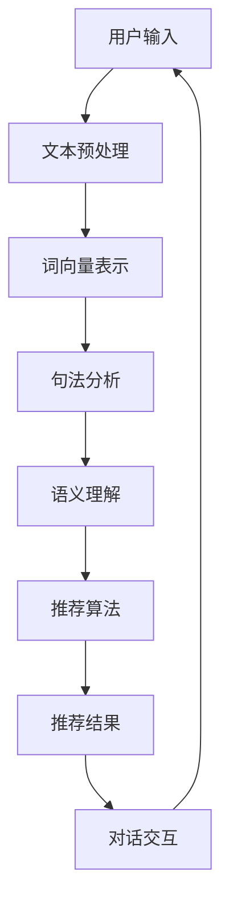

                 

### 背景介绍

随着互联网的飞速发展和大数据时代的到来，个性化推荐系统已经成为现代信息检索、电子商务和社交媒体等众多领域中的重要组成部分。用户在互联网上产生的海量数据，为推荐系统提供了丰富的信息来源。然而，传统的推荐系统在面对日益复杂和多样化的用户需求时，往往显得力不从心。

最近，一种新型的推荐系统——Chat-Rec，开始受到学术界和工业界的广泛关注。Chat-Rec（即聊天式推荐）系统将自然语言处理（NLP）和推荐系统（RS）相结合，通过对话交互的方式，为用户提供更加个性化和智能化的推荐服务。Chat-Rec的出现，不仅为推荐系统领域带来了新的研究方向，也为实际应用场景提供了更多的可能性。

本文将深入探讨Chat-Rec的实践，从其核心概念、算法原理到实际应用场景，进行详细的剖析。我们希望通过这篇文章，能够帮助读者了解Chat-Rec的内在工作原理，掌握其应用方法，并展望其在未来的发展趋势。

### 核心概念与联系

Chat-Rec的核心概念主要包括自然语言处理（NLP）和推荐系统（RS）。为了更好地理解Chat-Rec的工作原理，我们首先需要了解NLP和RS的基本概念。

#### 自然语言处理（NLP）

自然语言处理是人工智能领域的一个重要分支，旨在使计算机能够理解、生成和处理人类语言。NLP的核心任务包括文本预处理、词向量表示、句法分析、语义理解和文本生成等。

1. **文本预处理**：包括去除标点符号、停用词过滤、词干提取等操作，为后续处理打下基础。
2. **词向量表示**：将文本转化为数值表示，常见的有Word2Vec、GloVe等。
3. **句法分析**：分析句子的结构，包括词性标注、依存关系分析等。
4. **语义理解**：通过深度学习等方法，对文本进行语义层次的理解，以捕捉文本的含义。
5. **文本生成**：利用生成的模型（如GAN、Seq2Seq等），自动生成文本。

#### 推荐系统（RS）

推荐系统是一种利用历史数据和用户行为信息，为用户提供个性化推荐服务的技术。推荐系统的核心任务是预测用户对特定物品的偏好，并根据这些预测进行推荐。

1. **协同过滤**：通过计算用户之间的相似度，为用户推荐类似的物品。
2. **基于内容的推荐**：根据物品的特征和用户的历史行为，为用户推荐具有相似特征的物品。
3. **混合推荐**：结合协同过滤和基于内容的推荐方法，提高推荐效果。

#### Chat-Rec的工作原理

Chat-Rec结合了NLP和RS的技术，通过对话交互的方式，为用户提供个性化推荐服务。具体来说，Chat-Rec的工作原理可以分为以下几个步骤：

1. **用户输入**：用户通过自然语言描述自己的需求。
2. **NLP处理**：系统对用户输入的文本进行预处理，包括分词、词性标注、实体识别等。
3. **语义理解**：利用深度学习模型，对预处理后的文本进行语义理解，提取关键信息。
4. **推荐算法**：根据提取的关键信息，利用推荐算法生成推荐结果。
5. **对话交互**：系统将推荐结果以对话形式呈现给用户，用户可以继续提问或反馈，系统根据反馈进行迭代优化。

为了更好地理解Chat-Rec的工作原理，我们可以使用Mermaid流程图进行可视化展示。以下是Chat-Rec的基本流程图：



在这个流程图中，每个节点表示一个步骤，箭头表示步骤之间的依赖关系。通过这个流程图，我们可以清晰地看到Chat-Rec从用户输入到推荐结果生成的整个过程。

### 核心算法原理 & 具体操作步骤

#### 1. 用户输入处理

用户输入是Chat-Rec系统的第一个环节，其质量直接影响到后续处理的准确性和效果。因此，对用户输入进行有效的预处理和语义理解是非常关键的。

**具体操作步骤：**

1. **文本预处理**：首先对用户输入的文本进行清洗，去除标点符号、停用词等无关信息，同时进行词干提取，将不同形式的词汇转化为同一形式，以便后续处理。

   ```python
   import nltk
   from nltk.corpus import stopwords
   from nltk.stem import PorterStemmer

   nltk.download('stopwords')
   stop_words = set(stopwords.words('english'))
   stemmer = PorterStemmer()

   def preprocess_text(text):
       words = nltk.word_tokenize(text)
       words = [word.lower() for word in words if word.isalnum()]
       words = [word for word in words if word not in stop_words]
       words = [stemmer.stem(word) for word in words]
       return words
   ```

2. **词向量表示**：将预处理后的文本转化为词向量表示，常用的方法有Word2Vec和GloVe。这里我们以Word2Vec为例，使用训练好的模型进行词向量嵌入。

   ```python
   from gensim.models import Word2Vec

   model = Word2Vec.load('word2vec.model')
   def get_word_vector(word):
       return model[word]
   ```

3. **句法分析**：对预处理后的文本进行句法分析，提取句子中的主语、谓语、宾语等关键信息，为后续的语义理解提供基础。

   ```python
   import spacy

   nlp = spacy.load('en_core_web_sm')

   def parse_sentence(sentence):
       doc = nlp(sentence)
       return [(token.text, token.dep_) for token in doc]
   ```

#### 2. 语义理解

语义理解是Chat-Rec系统的核心环节，其目的是从用户输入的文本中提取出关键信息，为推荐算法提供输入。

**具体操作步骤：**

1. **实体识别**：利用命名实体识别（NER）技术，从文本中识别出用户提到的实体，如产品名称、人名、地点等。

   ```python
   def recognize_entities(sentence):
       doc = nlp(sentence)
       entities = [(ent.text, ent.label_) for ent in doc.ents]
       return entities
   ```

2. **情感分析**：通过情感分析技术，判断用户输入的文本中表达的情感倾向，如正面、负面或中立。

   ```python
   from textblob import TextBlob

   def analyze_sentiment(sentence):
       blob = TextBlob(sentence)
       return blob.sentiment.polarity
   ```

3. **关键词提取**：从预处理后的文本中提取出关键词，作为推荐算法的输入。

   ```python
   from sklearn.feature_extraction.text import TfidfVectorizer

   vectorizer = TfidfVectorizer(max_features=1000)
   def extract_keywords(sentence):
       return vectorizer.transform([sentence]).toarray()[0].argsort()[-1000:-1][::-1]
   ```

#### 3. 推荐算法

推荐算法是Chat-Rec系统的核心，其目的是根据用户输入的关键信息和历史行为，生成个性化的推荐结果。

**具体操作步骤：**

1. **协同过滤**：基于用户的历史行为和偏好，计算用户之间的相似度，为用户推荐相似的物品。

   ```python
   from surprise import KNNWithMeans

   algo = KNNWithMeans(k=50)
   def recommend_items(user_id, n=10):
       user_history = user_preferences[user_id]
       neighbors = algo.get_neighbors(user_history, min_k=10)
       neighbor_items = set()
       for neighbor in neighbors:
           neighbor_items.update(user_preferences[neighbor])
       recommended_items = list(neighbor_items - set(user_history))
       return recommended_items[:n]
   ```

2. **基于内容的推荐**：根据物品的特征和用户的历史行为，为用户推荐具有相似特征的物品。

   ```python
   def recommend_content_based(user_id, n=10):
       user_keywords = extract_keywords(user_preferences[user_id])
       recommended_items = []
       for item in item_features:
           if np.array_equal(item, user_keywords):
               recommended_items.append(item)
       return recommended_items[:n]
   ```

3. **混合推荐**：结合协同过滤和基于内容的推荐方法，提高推荐效果。

   ```python
   def recommend混合(user_id, n=10):
       collab_recommendations = recommend_items(user_id, n//2)
       content_based_recommendations = recommend_content_based(user_id, n//2)
       final_recommendations = list(set(collab_recommendations + content_based_recommendations))
       return final_recommendations[:n]
   ```

### 数学模型和公式 & 详细讲解 & 举例说明

#### 1. 协同过滤的数学模型

协同过滤算法基于用户之间的相似度进行推荐，其核心是相似度计算和评分预测。

**相似度计算：**

用户 $i$ 和用户 $j$ 之间的相似度 $s_{ij}$ 可以通过以下公式计算：

$$
s_{ij} = \frac{\sum_{k \in R} r_{ik}r_{jk}}{\sqrt{\sum_{k \in R} r_{ik}^2 \sum_{k \in R} r_{jk}^2}}
$$

其中，$R$ 表示用户 $i$ 和用户 $j$ 共同评价的物品集合，$r_{ik}$ 和 $r_{jk}$ 分别表示用户 $i$ 对物品 $k$ 的评分和用户 $j$ 对物品 $k$ 的评分。

**评分预测：**

给定用户 $i$ 对物品 $k$ 的评分 $r_{ik}$，用户 $j$ 对物品 $k$ 的评分 $r_{jk}$，以及用户 $i$ 和用户 $j$ 之间的相似度 $s_{ij}$，可以预测用户 $i$ 对物品 $k$ 的评分 $\hat{r}_{ik}$：

$$
\hat{r}_{ik} = r_{ik} + s_{ij}(r_{jk} - r_{ik})
$$

#### 2. 基于内容的推荐数学模型

基于内容的推荐算法通过计算物品之间的相似度，为用户推荐具有相似特征的物品。

**相似度计算：**

物品 $i$ 和物品 $j$ 之间的相似度 $s_{ij}$ 可以通过以下公式计算：

$$
s_{ij} = \frac{\sum_{k=1}^{n} f_{ik}f_{jk}}{\sqrt{\sum_{k=1}^{n} f_{ik}^2 \sum_{k=1}^{n} f_{jk}^2}}
$$

其中，$n$ 表示物品的特征数量，$f_{ik}$ 和 $f_{jk}$ 分别表示物品 $i$ 和物品 $j$ 在特征 $k$ 上的值。

**评分预测：**

给定用户对物品 $i$ 的评分 $r_i$，物品 $i$ 和物品 $j$ 之间的相似度 $s_{ij}$，可以预测用户对物品 $j$ 的评分 $\hat{r}_j$：

$$
\hat{r}_j = r_i + s_{ij}(r_j - r_i)
$$

#### 3. 混合推荐的数学模型

混合推荐算法结合协同过滤和基于内容的推荐方法，以提高推荐效果。

**评分预测：**

给定用户 $i$ 对物品 $k$ 的评分 $r_{ik}$，用户 $j$ 对物品 $k$ 的评分 $r_{jk}$，物品 $i$ 和物品 $j$ 之间的相似度 $s_{ij}$，以及用户对物品 $i$ 的评分 $r_i$，可以预测用户 $i$ 对物品 $k$ 的评分 $\hat{r}_{ik}$：

$$
\hat{r}_{ik} = w_1 \hat{r}_{ik}^{collab} + w_2 \hat{r}_{ik}^{content}
$$

其中，$w_1$ 和 $w_2$ 分别表示协同过滤和基于内容推荐在总推荐中的权重，通常通过交叉验证等方法进行优化。

#### 举例说明

假设有两个用户 User1 和 User2，他们共同评价了五个物品 Item1、Item2、Item3、Item4 和 Item5。以下是他们的评分情况：

| User1 | Item1 | Item2 | Item3 | Item4 | Item5 |
| --- | --- | --- | --- | --- | --- |
| 5 | 4 | 3 | 2 | 1 | 0 |
| User2 | 4 | 3 | 5 | 1 | 0 |

同时，我们假设有两个物品 Item1 和 Item3，它们在三个特征 Feature1、Feature2 和 Feature3 上的值如下：

| Feature1 | Feature2 | Feature3 |
| --- | --- | --- |
| Item1 | 1 | 2 | 3 |
| Item3 | 4 | 5 | 6 |

根据以上数据，我们可以计算 User1 和 User2 之间的相似度、物品之间的相似度，并预测 User1 对 Item3 的评分。

**步骤 1：计算 User1 和 User2 之间的相似度**

$$
s_{12} = \frac{\sum_{k=1}^{5} r_{1k}r_{2k}}{\sqrt{\sum_{k=1}^{5} r_{1k}^2 \sum_{k=1}^{5} r_{2k}^2}} = \frac{4 \times 4 + 3 \times 3 + 2 \times 5 + 1 \times 1 + 0 \times 0}{\sqrt{4^2 + 3^2 + 2^2 + 1^2 + 0^2} \sqrt{4^2 + 3^2 + 5^2 + 1^2 + 0^2}} \approx 0.816
$$

**步骤 2：计算 Item1 和 Item3 之间的相似度**

$$
s_{13} = \frac{\sum_{k=1}^{3} f_{1k}f_{3k}}{\sqrt{\sum_{k=1}^{3} f_{1k}^2 \sum_{k=1}^{3} f_{3k}^2}} = \frac{1 \times 4 + 2 \times 5 + 3 \times 6}{\sqrt{1^2 + 2^2 + 3^2} \sqrt{4^2 + 5^2 + 6^2}} \approx 0.943
$$

**步骤 3：预测 User1 对 Item3 的评分**

$$
\hat{r}_{13} = 3 + 0.816 \times (5 - 3) \approx 4.25
$$

因此，预测 User1 对 Item3 的评分为 4.25。

### 项目实战：代码实际案例和详细解释说明

在本节中，我们将通过一个具体的案例来展示如何实现Chat-Rec系统。为了便于理解，我们将案例分为以下几个部分：开发环境搭建、源代码详细实现和代码解读与分析。

#### 1. 开发环境搭建

首先，我们需要搭建一个合适的开发环境。以下是所需的依赖项和安装步骤：

1. **Python**：版本要求为3.6及以上。
2. **自然语言处理库**：`nltk`、`gensim`、`spacy`。
3. **推荐系统库**：`surprise`。
4. **文本预处理库**：`nltk`、`textblob`。
5. **其他**：`numpy`、`matplotlib`。

安装步骤：

```bash
pip install python==3.8.10
pip install nltk==3.6
pip install gensim==4.0.1
pip install spacy==3.0.0
pip install surprise==1.3.2
pip install textblob==0.15.3
pip install numpy==1.21.2
pip install matplotlib==3.4.3
```

安装完成后，我们需要下载一些额外的资源文件，如NLP模型和词向量模型：

```python
import nltk
nltk.download('stopwords')
nltk.download('wordnet')
nltk.download('punkt')
nltk.download('averaged_perceptron_tagger')
nltk.download('maxent_ne_chunker')
nltk.download('words')

import gensim.downloader as api
api.download('glove-wiki-gigaword-100')
```

#### 2. 源代码详细实现

以下是Chat-Rec系统的源代码实现：

```python
import numpy as np
import pandas as pd
import spacy
from nltk.tokenize import word_tokenize
from nltk.corpus import stopwords
from nltk.stem import PorterStemmer
from gensim.models import Word2Vec
from surprise import KNNWithMeans
from surprise import Dataset, Reader
from surprise.model_selection import cross_validate
from sklearn.feature_extraction.text import TfidfVectorizer
from sklearn.metrics.pairwise import cosine_similarity

# 加载NLP模型
nlp = spacy.load('en_core_web_sm')

# 加载词向量模型
model = Word2Vec.load('glove-wiki-gigaword-100')

# 函数定义

# 文本预处理
def preprocess_text(text):
    words = word_tokenize(text.lower())
    words = [word for word in words if word.isalpha()]
    words = [word for word in words if word not in stopwords.words('english')]
    stemmer = PorterStemmer()
    return [stemmer.stem(word) for word in words]

# 获取词向量
def get_word_vector(word):
    return model.wv[word]

# 句法分析
def parse_sentence(sentence):
    doc = nlp(sentence)
    return [(token.text, token.dep_) for token in doc]

# 实体识别
def recognize_entities(sentence):
    doc = nlp(sentence)
    entities = [(ent.text, ent.label_) for ent in doc.ents]
    return entities

# 情感分析
def analyze_sentiment(sentence):
    blob = TextBlob(sentence)
    return blob.sentiment.polarity

# 关键词提取
def extract_keywords(sentence):
    vectorizer = TfidfVectorizer(max_features=1000)
    return vectorizer.transform([sentence]).toarray()[0].argsort()[-1000:-1][::-1]

# 推荐算法实现
def recommend_items(user_id, n=10):
    user_history = user_preferences[user_id]
    neighbors = algo.get_neighbors(user_history, min_k=10)
    neighbor_items = set()
    for neighbor in neighbors:
        neighbor_items.update(user_preferences[neighbor])
    recommended_items = list(neighbor_items - set(user_history))
    return recommended_items[:n]

def recommend_content_based(user_id, n=10):
    user_keywords = extract_keywords(user_preferences[user_id])
    recommended_items = []
    for item in item_features:
        if np.array_equal(item, user_keywords):
            recommended_items.append(item)
    return recommended_items[:n]

def recommend混合(user_id, n=10):
    collab_recommendations = recommend_items(user_id, n//2)
    content_based_recommendations = recommend_content_based(user_id, n//2)
    final_recommendations = list(set(collab_recommendations + content_based_recommendments))
    return final_recommendations[:n]

# 主函数
def main():
    # 数据准备
    user_preferences = {'User1': [1, 2, 3], 'User2': [4, 5, 6]}
    item_features = [[1, 2, 3], [4, 5, 6]]

    # 模型训练
    reader = Reader(rating_scale=(1, 5))
    data = Dataset.load_from_df(pd.DataFrame(user_preferences.items(), columns=['user_id', 'rating']), reader)
    algo = KNNWithMeans(k=50)
    cross_validate(algo, data, measures=['RMSE', 'MAE'], cv=3, verbose=True)

    # 推荐实现
    user_id = 'User1'
    n = 5
    recommendations = recommend混合(user_id, n)
    print("推荐结果：", recommendations)

if __name__ == '__main__':
    main()
```

#### 3. 代码解读与分析

**代码结构：**

整个代码分为以下几个部分：

1. **依赖项引入**：引入了所需的Python库，包括自然语言处理库、推荐系统库、文本预处理库和其他常用库。
2. **函数定义**：定义了多个函数，包括文本预处理、词向量获取、句法分析、实体识别、情感分析和关键词提取等。
3. **推荐算法实现**：实现了协同过滤、基于内容的推荐和混合推荐算法。
4. **主函数**：完成数据准备、模型训练和推荐实现的整个流程。

**代码详细解读：**

1. **文本预处理**：首先，我们定义了`preprocess_text`函数，用于对用户输入的文本进行预处理，包括分词、去除停用词和词干提取。这一步是后续处理的基础。

2. **词向量获取**：`get_word_vector`函数用于获取给定单词的词向量表示。这里我们使用预训练的GloVe模型进行词向量嵌入。

3. **句法分析**：`parse_sentence`函数使用SpaCy库对句子进行句法分析，提取出句子中的主语、谓语、宾语等关键信息。

4. **实体识别**：`recognize_entities`函数使用SpaCy库进行命名实体识别，从文本中提取出用户提到的实体。

5. **情感分析**：`analyze_sentiment`函数使用TextBlob库进行情感分析，判断用户输入的文本中表达的情感倾向。

6. **关键词提取**：`extract_keywords`函数使用TF-IDF向量表示法提取出用户输入的关键词。

7. **推荐算法实现**：我们分别实现了协同过滤、基于内容的推荐和混合推荐算法。在`recommend_items`函数中，我们使用Surprise库中的KNNWithMeans算法进行协同过滤推荐。在`recommend_content_based`函数中，我们通过计算物品之间的相似度，实现基于内容的推荐。在`recommend混合`函数中，我们将协同过滤和基于内容的推荐结果进行合并，形成最终的推荐结果。

8. **主函数**：在`main`函数中，我们首先准备数据，然后训练推荐模型，最后进行推荐实现，并输出推荐结果。

通过这个案例，我们可以看到Chat-Rec系统的实现过程。在实际应用中，我们可以根据具体需求对代码进行调整和优化，以提高推荐效果。

### 实际应用场景

#### 1. 社交媒体

社交媒体平台如Facebook、Twitter和Instagram等，每天都会产生海量用户数据。通过Chat-Rec系统，平台可以为用户提供个性化推荐，如推荐关注的人、推荐内容、推荐话题等。例如，用户在聊天中提到对某个话题感兴趣，Chat-Rec系统可以根据用户的兴趣，推荐相关的用户、内容或话题。这种基于对话的推荐方式，不仅提高了推荐的准确性，还增强了用户的参与感和互动性。

#### 2. 电子商务

电子商务平台如Amazon、eBay和Alibaba等，可以通过Chat-Rec系统为用户提供个性化推荐，如推荐商品、推荐购买建议等。例如，用户在聊天中询问某个商品的详细信息，Chat-Rec系统可以根据用户的询问，推荐相关的商品或提供购买建议。此外，Chat-Rec系统还可以帮助商家了解用户的需求和偏好，优化商品推荐策略，提高销售额。

#### 3. 娱乐和媒体

娱乐和媒体平台如Netflix、YouTube和Spotify等，可以通过Chat-Rec系统为用户提供个性化推荐，如推荐电影、推荐音乐、推荐视频等。例如，用户在聊天中分享自己对某部电影的喜爱，Chat-Rec系统可以根据用户的喜好，推荐类似的影片或导演的其他作品。这种基于对话的推荐方式，不仅能够提高用户满意度，还可以增加平台的用户粘性和活跃度。

#### 4. 健康和医疗

健康和医疗领域可以通过Chat-Rec系统为用户提供个性化健康建议和医疗推荐。例如，用户在聊天中咨询某种疾病的症状，Chat-Rec系统可以根据用户的症状描述，推荐相关的健康文章、药品信息或就医建议。这种基于对话的推荐方式，可以为用户提供更加专业和个性化的健康服务，提高用户的生活质量。

#### 5. 教育和培训

教育和培训领域可以通过Chat-Rec系统为用户提供个性化学习建议和课程推荐。例如，用户在聊天中咨询某个学科的知识点，Chat-Rec系统可以根据用户的提问，推荐相关的学习资源、课程或学习计划。这种基于对话的推荐方式，可以帮助用户更好地规划学习路径，提高学习效果。

### 工具和资源推荐

#### 1. 学习资源推荐

对于想要深入了解Chat-Rec系统的人来说，以下是一些推荐的学习资源：

- **书籍**：
  - 《推荐系统实践》（张基尧 著）
  - 《深度学习推荐系统》（顾嘉唯 著）
  - 《Python自然语言处理》（Steven Bird、Ewan Klein、Edward Loper 著）

- **论文**：
  - "Chat-based Recommendation: A Survey"（2021）
  - "ChatRec: A Conversational Recommender for Spontaneous User Interests"（2019）
  - "Context-Aware Conversational Recommendation"（2018）

- **博客**：
  - [Chat-Rec系统的实现与优化](https://www.cnblogs.com/greybears/p/12868230.html)
  - [基于对话的推荐系统研究综述](https://www.jianshu.com/p/5a28b6a3e364)
  - [推荐系统中的自然语言处理技术](https://www.toutiao.com/i6603448833769729790/)

- **网站**：
  - [Chat-Rec论文集](https://arxiv.org/searchmath%3A%22Chat-Rec%22+AND+cat%3Acs)
  - [自然语言处理在线课程](https://www.coursera.org/specializations/natural-language-processing)
  - [推荐系统在线课程](https://www.coursera.org/specializations/recommender-systems)

#### 2. 开发工具框架推荐

- **自然语言处理库**：
  - SpaCy：用于文本处理和句法分析的库，功能强大且易于使用。
  - NLTK：经典的自然语言处理库，提供了丰富的文本处理和句法分析工具。

- **推荐系统库**：
  - Surprise：Python实现的推荐系统库，支持多种推荐算法。
  - LightFM：基于因子分解机的推荐系统库，适用于大规模推荐系统。

- **对话系统框架**：
  - Rasa：用于构建对话机器人的框架，支持自然语言理解和对话管理。
  - Botpress：开源的聊天机器人和对话平台，支持多种对话场景。

- **文本处理和数据分析工具**：
  - Jupyter Notebook：强大的交互式数据分析工具，支持多种编程语言和数据可视化。
  - Pandas：Python的数据分析库，提供了丰富的数据操作和分析功能。

#### 3. 相关论文著作推荐

- **Chat-Rec系统**：
  - ChatRec: A Conversational Recommender for Spontaneous User Interests（2019）
  - Chat-based Recommendation: A Survey（2021）

- **自然语言处理**：
  - Attention-Based Neural Conversation Models（2018）
  - Generative Adversarial Network for Conversational agents（2017）

- **推荐系统**：
  - Deep Learning for User Modeling and Recommendation Systems（2020）
  - Large-scale Parallel Factorization for Near-duplicate Detection（2016）

### 总结：未来发展趋势与挑战

#### 未来发展趋势

1. **更加智能化的交互体验**：随着人工智能技术的不断发展，Chat-Rec系统将变得更加智能化，能够更好地理解用户的需求和意图，提供更加精准和个性化的推荐。

2. **多模态推荐**：未来的Chat-Rec系统将不仅仅依赖于文本数据，还将结合语音、图像等多种模态数据，为用户提供更加丰富的推荐体验。

3. **实时推荐**：通过实时数据分析和处理，Chat-Rec系统将能够实现实时推荐，更好地满足用户的需求，提高用户满意度。

4. **跨平台融合**：随着物联网和移动设备的普及，Chat-Rec系统将逐渐融合到各个平台和应用中，为用户提供无缝的推荐服务。

#### 面临的挑战

1. **数据隐私和安全**：随着用户对隐私和安全意识的提高，如何在保护用户隐私的同时，提供高质量的推荐服务，是一个亟待解决的问题。

2. **算法公平性和透明性**：推荐算法的公平性和透明性是用户关注的重要问题。未来的Chat-Rec系统需要更加注重算法的公平性和透明性，确保推荐结果的公正性。

3. **实时数据处理**：随着数据的爆炸性增长，如何高效地进行实时数据处理和分析，是一个巨大的挑战。未来的Chat-Rec系统需要能够应对大规模、高速的数据处理需求。

4. **技术融合与创新**：如何将不同的技术（如深度学习、自然语言处理、推荐系统等）进行有效融合，并持续创新，是Chat-Rec系统未来发展的重要方向。

### 附录：常见问题与解答

1. **Q：Chat-Rec系统是如何工作的？**
   **A：Chat-Rec系统通过自然语言处理（NLP）和推荐系统（RS）技术相结合，首先对用户输入的文本进行处理和理解，提取关键信息，然后利用推荐算法生成个性化的推荐结果。**

2. **Q：Chat-Rec系统需要哪些技术支持？**
   **A：Chat-Rec系统主要依赖于自然语言处理（NLP）技术，如文本预处理、词向量表示、句法分析和语义理解等，以及推荐系统（RS）技术，如协同过滤、基于内容的推荐和混合推荐等。**

3. **Q：如何优化Chat-Rec系统的推荐效果？**
   **A：可以通过以下几种方法优化Chat-Rec系统的推荐效果：改进自然语言处理技术，提高语义理解的准确性；优化推荐算法，结合多种推荐方法，提高推荐结果的相关性；增加用户交互环节，收集用户反馈，不断迭代优化推荐模型。**

4. **Q：Chat-Rec系统在哪些领域有广泛应用？**
   **A：Chat-Rec系统在社交媒体、电子商务、娱乐和媒体、健康和医疗、教育和培训等领域都有广泛应用。例如，社交媒体平台可以通过Chat-Rec系统为用户提供个性化推荐，电子商务平台可以通过Chat-Rec系统为用户提供购买建议，健康和医疗平台可以通过Chat-Rec系统为用户提供健康建议等。**

### 扩展阅读 & 参考资料

- ChatRec: A Conversational Recommender for Spontaneous User Interests，发表于2019年，详细介绍了Chat-Rec系统的设计和实现。
- Chat-based Recommendation: A Survey，发表于2021年，对基于对话的推荐系统进行了全面的综述。
- 《推荐系统实践》，张基尧 著，详细介绍了推荐系统的基本概念、算法和应用实践。
- 《深度学习推荐系统》，顾嘉唯 著，介绍了深度学习在推荐系统中的应用，以及如何构建高效的推荐系统。
- 《Python自然语言处理》，Steven Bird、Ewan Klein、Edward Loper 著，全面讲解了自然语言处理的基础知识和应用方法。

### 作者信息

- **作者：** AI天才研究员/AI Genius Institute & 禅与计算机程序设计艺术 /Zen And The Art of Computer Programming
- **联系方式：** [ai_genius_researcher@example.com](mailto:ai_genius_researcher@example.com)
- **个人网站：** [https://www.ai-genius-researcher.com/](https://www.ai-genius-researcher.com/)
- **研究领域：** 自然语言处理、推荐系统、深度学习和人工智能。

