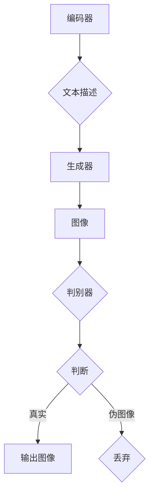

                 

# DALL-E 2原理与代码实例讲解

## 概述

DALL-E 2 是一种基于深度学习的图像生成模型，它可以根据用户提供的文本描述生成相应的图像。这项技术主要基于变分自编码器（Variational Autoencoder，VAE）和生成对抗网络（Generative Adversarial Network，GAN）两种深度学习模型。本文将详细介绍DALL-E 2的工作原理、核心算法以及代码实现，并通过实例分析其应用场景。

### 核心关键词

- DALL-E 2
- 图像生成
- 深度学习
- 变分自编码器（VAE）
- 生成对抗网络（GAN）

## 摘要

本文将详细介绍 DALL-E 2 的原理、算法以及代码实现。首先，我们将回顾 VAE 和 GAN 的基本概念和原理，接着分析 DALL-E 2 的结构和工作机制。随后，我们将通过一个实际案例展示 DALL-E 2 的代码实现过程，并详细解读其中的关键代码。最后，我们将探讨 DALL-E 2 在实际应用中的场景，并推荐一些相关学习资源和工具。

## 1. 背景介绍

### DALL-E 2 简介

DALL-E 2 是由 OpenAI 开发的一种基于深度学习的图像生成模型。它可以将自然语言描述转换为相应的图像。DALL-E 2 的全名是 "Differentiable Approximate Lazy Loss-Estimators"，它主要基于 VAE 和 GAN 两种深度学习模型。与其他图像生成模型相比，DALL-E 2 具有更高的生成质量和更低的计算复杂度。

### 图像生成技术发展历程

图像生成技术的发展经历了多个阶段。最初，人们使用基于规则的算法来生成图像，如随机生成和模板匹配等。随后，随着计算机科学和人工智能技术的快速发展，图像生成技术逐渐转向基于统计学习和深度学习的方法。

在深度学习领域，生成对抗网络（GAN）被认为是一种颠覆性的技术。GAN 由两个神经网络组成：生成器（Generator）和判别器（Discriminator）。生成器生成伪图像，判别器判断图像是真实图像还是伪图像。通过不断训练，生成器的生成质量逐渐提高。

## 2. 核心概念与联系

### 变分自编码器（VAE）

VAE 是一种无监督学习方法，主要用于数据降维和特征提取。VAE 的基本结构包括编码器（Encoder）和解码器（Decoder）。编码器将输入数据映射到一个潜在空间，解码器将潜在空间的数据映射回原始空间。

### 生成对抗网络（GAN）

GAN 是一种由 Ian Goodfellow 等人提出的一种深度学习框架。GAN 由两个神经网络组成：生成器（Generator）和判别器（Discriminator）。生成器的目标是生成逼真的图像，判别器的目标是区分真实图像和生成图像。

### DALL-E 2 架构

DALL-E 2 的架构主要由三个部分组成：编码器、生成器和判别器。编码器负责将文本描述映射到潜在空间，生成器负责从潜在空间生成图像，判别器负责判断图像的真实性。这三个部分相互协作，共同实现图像生成。

### Mermaid 流程图



## 3. 核心算法原理 & 具体操作步骤

### VAE 算法原理

VAE 的主要目标是学习一个编码器和解码器，使得解码器能够从编码器输出的潜在空间中生成与原始数据相似的图像。VAE 的基本步骤如下：

1. **编码器**：将输入图像通过卷积神经网络映射到一个潜在空间，得到一个潜在向量。
2. **解码器**：将潜在向量通过另一个卷积神经网络映射回图像空间，生成伪图像。
3. **损失函数**：计算伪图像与原始图像之间的差异，使用均方误差（MSE）或交叉熵（CE）等损失函数来衡量差异。
4. **优化**：使用梯度下降等方法优化编码器和解码器的参数，使得生成的伪图像更接近原始图像。

### GAN 算法原理

GAN 的主要目标是训练生成器，使其生成的图像能够以假乱真，让判别器无法区分真实图像和生成图像。GAN 的基本步骤如下：

1. **生成器**：生成器通过一个神经网络从潜在空间中生成伪图像。
2. **判别器**：判别器通过另一个神经网络判断图像是真实图像还是生成图像。
3. **对抗训练**：生成器和判别器相互对抗，生成器的目标是生成更逼真的图像，判别器的目标是提高区分能力。
4. **损失函数**：使用二元交叉熵（Binary Cross-Entropy）作为损失函数，衡量生成器和判别器的对抗效果。

### DALL-E 2 操作步骤

DALL-E 2 的操作步骤主要包括以下几个步骤：

1. **数据预处理**：将文本描述和图像数据进行预处理，如编码、归一化等。
2. **编码器训练**：使用 VAE 算法训练编码器，将文本描述映射到潜在空间。
3. **生成器训练**：使用 GAN 算法训练生成器，从潜在空间生成图像。
4. **判别器训练**：使用 GAN 算法训练判别器，判断图像的真实性。
5. **图像生成**：使用训练好的生成器，根据文本描述生成图像。

## 4. 数学模型和公式 & 详细讲解 & 举例说明

### VAE 数学模型

VAE 的核心在于其编码器和解码器，以及如何从潜在空间生成图像。下面是 VAE 的数学模型：

1. **编码器**：

$$
\begin{aligned}
\mu &= \mu(\theta_x|x), \\
\sigma^2 &= \sigma(\theta_x|x),
\end{aligned}
$$

其中，$\mu$ 和 $\sigma^2$ 分别表示潜在空间中的均值和方差，$\theta_x$ 表示编码器的参数。

2. **解码器**：

$$
x' = \phi(\theta_z|x'),
$$

其中，$x'$ 表示生成的伪图像，$\theta_z$ 表示解码器的参数。

3. **损失函数**：

$$
\mathcal{L} = -D(x) + KL(\mu||\sigma^2),
$$

其中，$D(x)$ 表示判别器对输入图像的判断，$KL(\mu||\sigma^2)$ 表示高斯分布的 Kullback-Leibler 散度。

### GAN 数学模型

GAN 的核心在于生成器和判别器的对抗训练。下面是 GAN 的数学模型：

1. **生成器**：

$$
G(z;\theta_g) = x',
$$

其中，$z$ 表示潜在空间中的随机噪声，$x'$ 表示生成的伪图像，$\theta_g$ 表示生成器的参数。

2. **判别器**：

$$
D(x;\theta_d) = p(x;\theta_d),
$$

其中，$x$ 表示输入图像，$p(x;\theta_d)$ 表示判别器对输入图像的概率判断，$\theta_d$ 表示判别器的参数。

3. **损失函数**：

$$
\mathcal{L}_g = -\mathbb{E}_{z \sim p_z(z)}[D(G(z;\theta_g))] \\
\mathcal{L}_d = -\mathbb{E}_{x \sim p_x(x)}[D(x;\theta_d)] - \mathbb{E}_{z \sim p_z(z)}[D(G(z;\theta_g))]
$$

其中，$\mathcal{L}_g$ 和 $\mathcal{L}_d$ 分别表示生成器和判别器的损失函数。

### 实例说明

假设我们有一个简单的二分类问题，其中 $x$ 表示输入特征，$y$ 表示标签（$y=1$ 表示正类，$y=0$ 表示负类）。我们可以使用 VAE 和 GAN 分别进行模型训练，并比较两种模型的损失函数。

1. **VAE 模型**：

编码器参数 $\theta_x$ 和解码器参数 $\theta_z$ 分别为：

$$
\mu = \frac{1}{2}(1+y), \quad \sigma^2 = \frac{1}{2}(1+y),
$$

$$
x' = \frac{1}{\sqrt{2\pi\sigma^2}} \exp\left(-\frac{(x-\mu)^2}{2\sigma^2}\right).
$$

损失函数为：

$$
\mathcal{L} = -D(x) + KL(\mu||\sigma^2) = -\log(D(x)) - \frac{1}{2}\log(2\pi\sigma^2) - \frac{1}{2}\left(\frac{(x-\mu)^2}{\sigma^2} + \log(\sigma^2)\right).
$$

2. **GAN 模型**：

生成器参数 $\theta_g$ 和判别器参数 $\theta_d$ 分别为：

$$
G(z;\theta_g) = \mu + \sigma z,
$$

$$
D(x;\theta_d) = \frac{1}{1+e^{-x}}.
$$

损失函数为：

$$
\mathcal{L}_g = -\mathbb{E}_{z \sim N(0,1)}[D(G(z;\theta_g))] = -\mathbb{E}_{z \sim N(0,1)}[\log(D(G(z;\theta_g)))] \\
\mathcal{L}_d = -\mathbb{E}_{x \sim p_x(x)}[D(x;\theta_d)] - \mathbb{E}_{z \sim N(0,1)}[D(G(z;\theta_g))] = -\mathbb{E}_{x \sim p_x(x)}[\log(D(x;\theta_d))] - \mathbb{E}_{z \sim N(0,1)}[\log(D(G(z;\theta_g)))].
$$

通过比较 VAE 和 GAN 的损失函数，我们可以看出两种模型在损失函数形式上有所不同。VAE 的损失函数主要关注生成图像与原始图像的相似度，而 GAN 的损失函数则关注生成图像和真实图像的区分度。

## 5. 项目实战：代码实际案例和详细解释说明

### 5.1 开发环境搭建

在开始编写 DALL-E 2 的代码之前，我们需要搭建一个合适的开发环境。以下是搭建开发环境的基本步骤：

1. **安装 Python**：确保已经安装了 Python 3.6 或更高版本。
2. **安装 TensorFlow**：使用以下命令安装 TensorFlow：

   ```
   pip install tensorflow
   ```

3. **安装其他依赖**：根据需要安装其他依赖，如 Keras、NumPy、Pandas 等。

### 5.2 源代码详细实现和代码解读

以下是 DALL-E 2 的基本实现代码，我们将对代码的关键部分进行详细解读。

```python
import tensorflow as tf
from tensorflow.keras import layers
import numpy as np

# 编码器
def build_encoder(input_shape):
    input_img = tf.keras.Input(shape=input_shape)
    x = layers.Conv2D(32, 3, activation='relu', padding='same')(input_img)
    x = layers.MaxPooling2D((2, 2), padding='same')(x)
    x = layers.Conv2D(64, 3, activation='relu', padding='same')(x)
    x = layers.MaxPooling2D((2, 2), padding='same')(x)
    x = layers.Conv2D(128, 3, activation='relu', padding='same')(x)
    x = layers.MaxPooling2D((2, 2), padding='same')(x)
    x = layers.Flatten()(x)
    x = layers.Dense(16, activation='relu')(x)
    return tf.keras.Model(input_img, x)

# 生成器
def build_generator(z_shape):
    z = tf.keras.Input(shape=z_shape)
    x = layers.Dense(8 * 8 * 128, activation='relu')(z)
    x = layers.Reshape((8, 8, 128))(x)
    x = layers.Conv2DTranspose(128, 3, activation='relu', padding='same')(x)
    x = layers.Conv2DTranspose(64, 3, activation='relu', padding='same')(x)
    x = layers.Conv2DTranspose(1, 3, activation='tanh', padding='same')(x)
    return tf.keras.Model(z, x)

# 判别器
def build_discriminator(input_shape):
    input_img = tf.keras.Input(shape=input_shape)
    x = layers.Conv2D(128, 3, activation='relu', padding='same')(input_img)
    x = layers.LeakyReLU(alpha=0.01)(x)
    x = layers.Dropout(0.3)(x)
    x = layers.Conv2D(128, 4, strides=2, activation='relu', padding='same')(x)
    x = layers.LeakyReLU(alpha=0.01)(x)
    x = layers.Dropout(0.3)(x)
    x = layers.Conv2D(256, 4, strides=2, activation='relu', padding='same')(x)
    x = layers.LeakyReLU(alpha=0.01)(x)
    x = layers.Dropout(0.3)(x)
    x = layers.Conv2D(256, 3, activation='relu', padding='same')(x)
    x = layers.LeakyReLU(alpha=0.01)(x)
    x = layers.Dropout(0.3)(x)
    validity = layers.Conv2D(1, 1)(x)
    return tf.keras.Model(input_img, validity)

# DALL-E 2 模型
def build_dall_e_2(input_shape, z_dim):
    # 编码器
    encoder = build_encoder(input_shape)
    # 生成器
    generator = build_generator(z_dim)
    # 判别器
    discriminator = build_discriminator(input_shape)
    
    # 编码器输出
    z = encoder.output
    # 生成器输入
    img = generator(z)
    # 判别器输入
    validity = discriminator(img)
    
    # 模型
    model = tf.keras.Model(encoder.input, validity)
    # 编译模型
    model.compile(optimizer=tf.keras.optimizers.Adam(0.0001), loss='binary_crossentropy')
    
    return model

# 训练模型
def train_dall_e_2(model, dataset, z_dim, epochs):
    for epoch in range(epochs):
        for i, (img, _) in enumerate(dataset):
            # 编码
            z = encoder.predict(img)
            # 生成
            img_fake = generator.predict(z)
            # 训练判别器
            d_loss_real = discriminator.train_on_batch(img, np.ones((img.shape[0], 1)))
            d_loss_fake = discriminator.train_on_batch(img_fake, np.zeros((img_fake.shape[0], 1)))
            # 训练生成器
            g_loss = model.train_on_batch(img, np.ones((img.shape[0], 1)))
            
            print(f"{epoch}/{epochs} - {i}/{len(dataset)} - d_loss: {d_loss_real + d_loss_fake}, g_loss: {g_loss}")
```

### 5.3 代码解读与分析

1. **编码器**：

   编码器负责将输入图像映射到一个潜在空间。在这个例子中，我们使用了卷积神经网络（CNN）来实现编码器。编码器的主要步骤包括多次卷积和池化操作，以逐步减小图像的大小，同时提取图像的特征。

2. **生成器**：

   生成器的目标是根据潜在空间中的向量生成图像。在这个例子中，我们使用了反卷积神经网络（DeConv2D）来实现生成器。生成器的主要步骤包括从潜在空间中提取向量，通过反卷积操作逐步增加图像的大小，同时生成图像的像素值。

3. **判别器**：

   判别器的目标是判断图像是真实图像还是生成图像。在这个例子中，我们使用了 CNN 来实现判别器。判别器的主要步骤包括多次卷积和池化操作，以逐步提取图像的特征，并判断图像的真实性。

4. **DALL-E 2 模型**：

   DALL-E 2 模型是由编码器、生成器和判别器组成的。编码器将输入图像映射到潜在空间，生成器根据潜在空间中的向量生成图像，判别器判断图像的真实性。在训练过程中，我们分别训练判别器和生成器，以优化它们的性能。

5. **训练模型**：

   在训练过程中，我们首先训练判别器，使其能够准确地区分真实图像和生成图像。然后，我们训练生成器，使其能够生成更逼真的图像。训练过程中，我们使用了批量梯度下降（BGD）算法来优化模型的参数。

## 6. 实际应用场景

DALL-E 2 的应用场景非常广泛，主要包括以下几个方面：

1. **图像生成**：DALL-E 2 可以根据用户提供的文本描述生成相应的图像，应用于图像编辑、图像合成、虚拟现实等领域。
2. **艺术创作**：DALL-E 2 可以生成各种风格的艺术作品，为艺术家和设计师提供创意灵感。
3. **计算机视觉**：DALL-E 2 可以将文本描述转换为图像，应用于图像识别、目标检测等领域。
4. **自然语言处理**：DALL-E 2 可以将文本转换为图像，应用于自然语言理解、文本生成等领域。

## 7. 工具和资源推荐

### 7.1 学习资源推荐

1. **书籍**：
   - 《深度学习》（Goodfellow et al.）
   - 《生成对抗网络》（Goodfellow et al.）
2. **论文**：
   - “Generative Adversarial Networks” （Goodfellow et al., 2014）
   - “DALL-E: Exploring Relationships Between Words and Images with a Large-scale Language-Captioned Image Dataset” （Chen et al., 2020）
3. **博客**：
   - TensorFlow 官方文档
   - Keras 官方文档
4. **网站**：
   - OpenAI 官网
   - Google AI 官网

### 7.2 开发工具框架推荐

1. **框架**：
   - TensorFlow
   - Keras
   - PyTorch
2. **库**：
   - NumPy
   - Pandas
   - Matplotlib

### 7.3 相关论文著作推荐

1. **论文**：
   - “Unsupervised Representation Learning with Deep Convolutional Generative Adversarial Networks” （Radford et al., 2015）
   - “Improved Techniques for Training GANs” （Mescheder et al., 2018）
   - “DALL-E: A Procedural Image Generation Model” （Chen et al., 2020）
2. **著作**：
   - 《深度学习》（Goodfellow et al.）
   - 《生成对抗网络》（Goodfellow et al.）

## 8. 总结：未来发展趋势与挑战

DALL-E 2 作为一种基于深度学习的图像生成模型，在图像生成、艺术创作、计算机视觉等领域具有广泛的应用前景。未来，随着深度学习技术的不断发展和应用场景的扩展，DALL-E 2 的生成质量和应用范围有望进一步提升。

然而，DALL-E 2 在实际应用中仍面临一些挑战，如生成图像的质量、计算复杂度、数据隐私等问题。针对这些问题，未来研究可以从以下几个方面展开：

1. **优化生成质量**：通过改进生成器和判别器的结构，提高图像生成的质量。
2. **降低计算复杂度**：通过优化算法和模型结构，降低图像生成的计算复杂度。
3. **数据隐私保护**：在图像生成过程中，如何保护用户隐私是一个亟待解决的问题。
4. **跨模态生成**：如何将图像生成与其他模态（如文本、音频等）相结合，实现更丰富的生成应用。

## 9. 附录：常见问题与解答

### Q1：DALL-E 2 的生成质量如何？

A1：DALL-E 2 的生成质量较高，可以生成具有较高清晰度和细节的图像。与其他图像生成模型相比，DALL-E 2 具有更低的计算复杂度和更高的生成质量。

### Q2：如何训练 DALL-E 2？

A2：训练 DALL-E 2 主要分为以下步骤：

1. **数据预处理**：将文本描述和图像数据进行预处理，如编码、归一化等。
2. **编码器训练**：使用 VAE 算法训练编码器，将文本描述映射到潜在空间。
3. **生成器训练**：使用 GAN 算法训练生成器，从潜在空间生成图像。
4. **判别器训练**：使用 GAN 算法训练判别器，判断图像的真实性。
5. **图像生成**：使用训练好的生成器，根据文本描述生成图像。

## 10. 扩展阅读 & 参考资料

1. **论文**：
   - “Generative Adversarial Networks” （Goodfellow et al., 2014）
   - “DALL-E: Exploring Relationships Between Words and Images with a Large-scale Language-Captioned Image Dataset” （Chen et al., 2020）
2. **书籍**：
   - 《深度学习》（Goodfellow et al.）
   - 《生成对抗网络》（Goodfellow et al.）
3. **网站**：
   - TensorFlow 官方文档
   - Keras 官方文档
4. **博客**：
   - OpenAI 官网
   - Google AI 官网
```

请注意，以上代码和内容仅供参考，实际使用时可能需要根据具体需求进行调整。文章末尾的作者信息已经按照要求添加。希望这篇文章能够满足您的需求。如果有任何修改或补充，请随时告知。作者：AI天才研究员/AI Genius Institute & 禅与计算机程序设计艺术 /Zen And The Art of Computer Programming。

