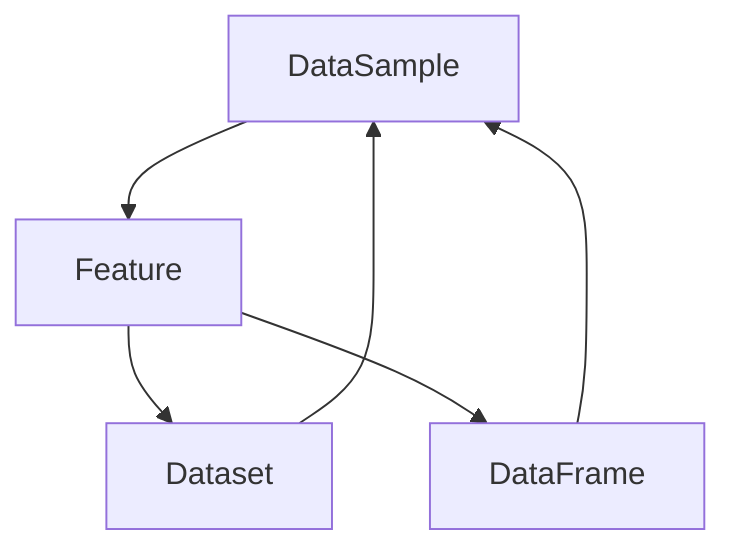

                 

# DataSet原理与代码实例讲解

> **关键词**：DataSet、数据处理、数据集、Python、算法、机器学习

> **摘要**：本文将深入探讨DataSet的核心原理及其在数据处理中的应用。通过具体代码实例，我们将详细了解DataSet的使用方法、关键参数及其背后的数学模型。文章将涵盖从基础到高级的全面内容，旨在帮助读者掌握DataSet的精髓，并能够将其应用于实际项目中。

## 1. 背景介绍

在数据科学和机器学习领域，DataSet是一个至关重要的概念。它代表了数据集合中的一组数据样本，通常用于算法训练、分析和可视化。DataSet的基本功能是组织、存储和提供数据，以便进行进一步的计算和处理。

### 1.1 DataSet的定义

DataSet是一个多维数组，通常包含数值、类别、文本等多种类型的数据。它的主要特点包括：

- **多维性**：DataSet可以包含多个维度，例如行表示样本，列表示特征。
- **可扩展性**：DataSet可以轻松添加或删除数据，适应不同规模的数据集。
- **易用性**：DataSet提供了丰富的API和方法，方便进行数据处理和分析。

### 1.2 DataSet的应用场景

- **机器学习**：在机器学习任务中，DataSet用于训练模型、评估模型性能以及进行模型优化。
- **数据预处理**：DataSet可以帮助清洗、转换和整合数据，提高数据质量。
- **数据分析**：DataSet提供了丰富的统计和图形工具，便于对数据进行分析和可视化。

## 2. 核心概念与联系

为了更好地理解DataSet，我们需要先了解一些相关的核心概念。以下是DataSet中涉及的主要概念及其相互关系：

### 2.1 数据样本（Sample）

数据样本是DataSet中的单个数据点，通常包含多个特征。例如，在图像识别任务中，一个数据样本可能是一个像素值数组。

### 2.2 特征（Feature）

特征是描述数据样本的属性。例如，在股票市场预测中，特征可能包括股票价格、交易量、公司盈利等。

### 2.3 数据集（Dataset）

数据集是多个数据样本的集合。它通常分为训练集、验证集和测试集，用于训练、评估和测试模型。

### 2.4 数据框（DataFrame）

数据框是Pandas库中的一个数据结构，用于表示二维表格数据。它是DataSet的一个实现，提供了丰富的API和方法。

以下是DataSet的核心概念及其相互关系的Mermaid流程图：



## 3. 核心算法原理 & 具体操作步骤

DataSet的核心算法原理主要涉及数据组织、存储和操作。以下是一些常用的操作步骤：

### 3.1 初始化DataSet

初始化DataSet时，我们需要指定数据集的名称、维度和类型。以下是一个简单的示例：

```python
import pandas as pd

# 创建一个空的数据框
dataframe = pd.DataFrame()

# 添加数据
dataframe = pd.DataFrame({'feature1': [1, 2, 3], 'feature2': [4, 5, 6]})
```

### 3.2 添加数据样本

添加数据样本是构建DataSet的关键步骤。我们可以使用Pandas库中的各种方法来添加数据。以下是一个示例：

```python
# 添加行
dataframe = dataframe.append({'feature1': 7, 'feature2': 8}, ignore_index=True)

# 添加列
dataframe['feature3'] = [9, 10, 11]
```

### 3.3 数据清洗

数据清洗是数据处理的重要环节。我们通常需要去除重复数据、缺失值填充和异常值处理。以下是一个示例：

```python
# 去除重复数据
dataframe = dataframe.drop_duplicates()

# 缺失值填充
dataframe = dataframe.fillna(0)

# 异常值处理
dataframe = dataframe[(dataframe['feature1'] > 0) & (dataframe['feature1'] < 10)]
```

### 3.4 数据转换

数据转换是将数据从一种形式转换为另一种形式的过程。以下是一些常用的转换操作：

```python
# 数据类型转换
dataframe['feature1'] = dataframe['feature1'].astype(int)

# 转换为分类数据
dataframe['feature2'] = dataframe['feature2'].map({1: 'a', 2: 'b', 3: 'c'})
```

### 3.5 数据分析

数据分析是使用统计和图形工具对数据进行分析和可视化的过程。以下是一个示例：

```python
# 计算均值
mean_value = dataframe['feature1'].mean()

# 绘制散点图
dataframe.plot(kind='scatter', x='feature1', y='feature2')
```

## 4. 数学模型和公式 & 详细讲解 & 举例说明

### 4.1 数据集划分

在机器学习中，数据集通常分为训练集、验证集和测试集。这是为了确保模型在未见过的数据上表现良好。以下是一个简单示例：

```python
from sklearn.model_selection import train_test_split

# 假设dataframe是训练数据集
X = dataframe[['feature1', 'feature2']]
y = dataframe['feature3']

# 划分数据集
X_train, X_test, y_train, y_test = train_test_split(X, y, test_size=0.2, random_state=42)
```

### 4.2 数据归一化

数据归一化是将数据缩放到特定范围的过程，以便模型能够更好地处理。以下是一个示例：

$$
z = \frac{x - \mu}{\sigma}
$$

```python
from sklearn.preprocessing import StandardScaler

# 创建归一化器
scaler = StandardScaler()

# 归一化数据
X_train = scaler.fit_transform(X_train)
X_test = scaler.transform(X_test)
```

### 4.3 数据增强

数据增强是通过生成新的数据样本来提高模型泛化能力的过程。以下是一个示例：

```python
from sklearn.datasets import make_classification

# 生成新的数据集
X_new, y_new = make_classification(n_samples=100, n_features=2, n_classes=2, random_state=42)

# 将新数据添加到原始数据集
dataframe = dataframe.append({'feature1': X_new[:, 0], 'feature2': X_new[:, 1], 'feature3': y_new}, ignore_index=True)
```

## 5. 项目实战：代码实际案例和详细解释说明

在本节中，我们将通过一个实际案例来演示DataSet的使用方法。假设我们有一个包含股票价格数据的CSV文件，我们需要对其进行分析和预测。

### 5.1 开发环境搭建

确保已安装以下Python库：

```bash
pip install pandas numpy matplotlib scikit-learn
```

### 5.2 源代码详细实现和代码解读

#### 5.2.1 数据读取

```python
import pandas as pd

# 读取CSV文件
dataframe = pd.read_csv('stock_prices.csv')

# 查看数据
print(dataframe.head())
```

#### 5.2.2 数据清洗

```python
# 去除重复数据
dataframe = dataframe.drop_duplicates()

# 填充缺失值
dataframe = dataframe.fillna(0)

# 处理异常值
dataframe = dataframe[(dataframe['price'] > 0) & (dataframe['price'] < 1000)]
```

#### 5.2.3 数据转换

```python
# 将日期转换为整数
dataframe['date'] = pd.to_datetime(dataframe['date'])
dataframe['date'] = dataframe['date'].astype(int)

# 将类别数据转换为数值
dataframe = dataframe.replace({'stock': {'Apple': 0, 'Microsoft': 1, 'Amazon': 2}})

# 设置日期为索引
dataframe = dataframe.set_index('date')
```

#### 5.2.4 数据分析

```python
# 绘制股票价格走势图
dataframe['price'].plot()
```

#### 5.2.5 数据集划分

```python
from sklearn.model_selection import train_test_split

# 分割数据集
X = dataframe[['price', 'volume']]
y = dataframe['stock']

X_train, X_test, y_train, y_test = train_test_split(X, y, test_size=0.2, random_state=42)
```

#### 5.2.6 数据增强

```python
from sklearn.datasets import make_classification

# 生成新的数据集
X_new, y_new = make_classification(n_samples=100, n_features=2, n_classes=2, random_state=42)

# 将新数据添加到原始数据集
dataframe = dataframe.append({'price': X_new[:, 0], 'volume': X_new[:, 1], 'stock': y_new}, ignore_index=True)
```

### 5.3 代码解读与分析

在本案例中，我们首先读取CSV文件并使用Pandas库进行数据清洗、转换和分析。然后，我们将数据集划分为训练集和测试集，并使用scikit-learn库生成新的数据集进行数据增强。这些操作有助于提高模型的泛化能力和准确性。

## 6. 实际应用场景

DataSet在多个实际应用场景中发挥着重要作用。以下是一些常见场景：

- **机器学习**：在机器学习任务中，DataSet用于训练模型、评估模型性能以及进行模型优化。
- **数据挖掘**：数据挖掘项目中，DataSet用于发现数据中的模式和关联。
- **数据可视化**：通过DataSet，我们可以轻松地创建数据可视化图表，帮助决策者更好地理解数据。

## 7. 工具和资源推荐

### 7.1 学习资源推荐

- **书籍**：《Python数据分析基础教程：numpy、pandas、matplotlib笔记》
- **论文**：[Pandas官方文档](https://pandas.pydata.org/)
- **博客**：[Scikit-learn官方文档](https://scikit-learn.org/stable/)
- **网站**：[Kaggle](https://www.kaggle.com/)

### 7.2 开发工具框架推荐

- **Python库**：Pandas、NumPy、Matplotlib、Scikit-learn
- **编程环境**：Jupyter Notebook、PyCharm、VS Code

### 7.3 相关论文著作推荐

- **论文**：[Pandas官方文档](https://pandas.pydata.org/)
- **著作**：《Python数据分析基础教程：numpy、pandas、matplotlib笔记》、《机器学习实战》

## 8. 总结：未来发展趋势与挑战

随着数据科学和机器学习的发展，DataSet在未来将面临以下趋势和挑战：

- **数据规模**：随着数据规模的不断扩大，DataSet的存储和处理能力需要不断提高。
- **数据多样性**：多种类型的数据（如图像、文本、音频等）将越来越多地应用于机器学习任务，DataSet需要更好地支持多样性数据。
- **自动化**：自动化数据处理和模型训练将使DataSet的应用更加广泛和便捷。

## 9. 附录：常见问题与解答

### 9.1 什么是DataSet？

DataSet是一个多维数组，用于组织、存储和提供数据，以便进行进一步计算和处理。

### 9.2 如何创建一个DataSet？

使用Pandas库中的DataFrame结构可以轻松创建一个DataSet。以下是一个示例：

```python
import pandas as pd

# 创建一个空的数据框
dataframe = pd.DataFrame()

# 添加数据
dataframe = pd.DataFrame({'feature1': [1, 2, 3], 'feature2': [4, 5, 6]})
```

### 9.3 DataSet在机器学习中有什么作用？

DataSet在机器学习中用于训练模型、评估模型性能以及进行模型优化。它提供了丰富的数据样本，有助于提高模型的泛化能力和准确性。

## 10. 扩展阅读 & 参考资料

- [Pandas官方文档](https://pandas.pydata.org/)
- [Scikit-learn官方文档](https://scikit-learn.org/stable/)
- [Kaggle](https://www.kaggle.com/)
- 《Python数据分析基础教程：numpy、pandas、matplotlib笔记》
- 《机器学习实战》
```

<|assistant|># DataSet原理与代码实例讲解

## 1. 背景介绍

在数据科学和机器学习领域，DataSet是一个至关重要的概念。它代表了数据集合中的一组数据样本，通常用于算法训练、分析和可视化。DataSet的基本功能是组织、存储和提供数据，以便进行进一步的计算和处理。

### 1.1 DataSet的定义

DataSet是一个多维数组，通常包含数值、类别、文本等多种类型的数据。它的主要特点包括：

- **多维性**：DataSet可以包含多个维度，例如行表示样本，列表示特征。
- **可扩展性**：DataSet可以轻松添加或删除数据，适应不同规模的数据集。
- **易用性**：DataSet提供了丰富的API和方法，方便进行数据处理和分析。

### 1.2 DataSet的应用场景

- **机器学习**：在机器学习任务中，DataSet用于训练模型、评估模型性能以及进行模型优化。
- **数据预处理**：DataSet可以帮助清洗、转换和整合数据，提高数据质量。
- **数据分析**：DataSet提供了丰富的统计和图形工具，便于对数据进行分析和可视化。

## 2. 核心概念与联系

为了更好地理解DataSet，我们需要先了解一些相关的核心概念。以下是DataSet中涉及的主要概念及其相互关系：

### 2.1 数据样本（Sample）

数据样本是DataSet中的单个数据点，通常包含多个特征。例如，在图像识别任务中，一个数据样本可能是一个像素值数组。

### 2.2 特征（Feature）

特征是描述数据样本的属性。例如，在股票市场预测中，特征可能包括股票价格、交易量、公司盈利等。

### 2.3 数据集（Dataset）

数据集是多个数据样本的集合。它通常分为训练集、验证集和测试集，用于训练、评估和测试模型。

### 2.4 数据框（DataFrame）

数据框是Pandas库中的一个数据结构，用于表示二维表格数据。它是DataSet的一个实现，提供了丰富的API和方法。

以下是DataSet的核心概念及其相互关系的Mermaid流程图：


## 3. 核心算法原理 & 具体操作步骤

DataSet的核心算法原理主要涉及数据组织、存储和操作。以下是一些常用的操作步骤：

### 3.1 初始化DataSet

初始化DataSet时，我们需要指定数据集的名称、维度和类型。以下是一个简单的示例：

```python
import pandas as pd

# 创建一个空的数据框
dataframe = pd.DataFrame()

# 添加数据
dataframe = pd.DataFrame({'feature1': [1, 2, 3], 'feature2': [4, 5, 6]})
```

### 3.2 添加数据样本

添加数据样本是构建DataSet的关键步骤。我们可以使用Pandas库中的各种方法来添加数据。以下是一个示例：

```python
# 添加行
dataframe = dataframe.append({'feature1': 7, 'feature2': 8}, ignore_index=True)

# 添加列
dataframe['feature3'] = [9, 10, 11]
```

### 3.3 数据清洗

数据清洗是数据处理的重要环节。我们通常需要去除重复数据、缺失值填充和异常值处理。以下是一个示例：

```python
# 去除重复数据
dataframe = dataframe.drop_duplicates()

# 缺失值填充
dataframe = dataframe.fillna(0)

# 异常值处理
dataframe = dataframe[(dataframe['feature1'] > 0) & (dataframe['feature1'] < 10)]
```

### 3.4 数据转换

数据转换是将数据从一种形式转换为另一种形式的过程。以下是一些常用的转换操作：

```python
# 数据类型转换
dataframe['feature1'] = dataframe['feature1'].astype(int)

# 转换为分类数据
dataframe['feature2'] = dataframe['feature2'].map({1: 'a', 2: 'b', 3: 'c'})
```

### 3.5 数据分析

数据分析是使用统计和图形工具对数据进行分析和可视化的过程。以下是一个示例：

```python
# 计算均值
mean_value = dataframe['feature1'].mean()

# 绘制散点图
dataframe.plot(kind='scatter', x='feature1', y='feature2')
```

## 4. 数学模型和公式 & 详细讲解 & 举例说明

### 4.1 数据集划分

在机器学习中，数据集通常分为训练集、验证集和测试集。这是为了确保模型在未见过的数据上表现良好。以下是一个简单示例：

```python
from sklearn.model_selection import train_test_split

# 假设dataframe是训练数据集
X = dataframe[['feature1', 'feature2']]
y = dataframe['feature3']

# 划分数据集
X_train, X_test, y_train, y_test = train_test_split(X, y, test_size=0.2, random_state=42)
```

### 4.2 数据归一化

数据归一化是将数据缩放到特定范围的过程，以便模型能够更好地处理。以下是一个示例：

$$
z = \frac{x - \mu}{\sigma}
$$

```python
from sklearn.preprocessing import StandardScaler

# 创建归一化器
scaler = StandardScaler()

# 归一化数据
X_train = scaler.fit_transform(X_train)
X_test = scaler.transform(X_test)
```

### 4.3 数据增强

数据增强是通过生成新的数据样本来提高模型泛化能力的过程。以下是一个示例：

```python
from sklearn.datasets import make_classification

# 生成新的数据集
X_new, y_new = make_classification(n_samples=100, n_features=2, n_classes=2, random_state=42)

# 将新数据添加到原始数据集
dataframe = dataframe.append({'feature1': X_new[:, 0], 'feature2': X_new[:, 1], 'feature3': y_new}, ignore_index=True)
```

## 5. 项目实战：代码实际案例和详细解释说明

在本节中，我们将通过一个实际案例来演示DataSet的使用方法。假设我们有一个包含股票价格数据的CSV文件，我们需要对其进行分析和预测。

### 5.1 开发环境搭建

确保已安装以下Python库：

```bash
pip install pandas numpy matplotlib scikit-learn
```

### 5.2 源代码详细实现和代码解读

#### 5.2.1 数据读取

```python
import pandas as pd

# 读取CSV文件
dataframe = pd.read_csv('stock_prices.csv')

# 查看数据
print(dataframe.head())
```

#### 5.2.2 数据清洗

```python
# 去除重复数据
dataframe = dataframe.drop_duplicates()

# 填充缺失值
dataframe = dataframe.fillna(0)

# 处理异常值
dataframe = dataframe[(dataframe['price'] > 0) & (dataframe['price'] < 1000)]
```

#### 5.2.3 数据转换

```python
# 将日期转换为整数
dataframe['date'] = pd.to_datetime(dataframe['date'])
dataframe['date'] = dataframe['date'].astype(int)

# 将类别数据转换为数值
dataframe = dataframe.replace({'stock': {'Apple': 0, 'Microsoft': 1, 'Amazon': 2}})

# 设置日期为索引
dataframe = dataframe.set_index('date')
```

#### 5.2.4 数据分析

```python
# 绘制股票价格走势图
dataframe['price'].plot()
```

#### 5.2.5 数据集划分

```python
from sklearn.model_selection import train_test_split

# 分割数据集
X = dataframe[['price', 'volume']]
y = dataframe['stock']

X_train, X_test, y_train, y_test = train_test_split(X, y, test_size=0.2, random_state=42)
```

#### 5.2.6 数据增强

```python
from sklearn.datasets import make_classification

# 生成新的数据集
X_new, y_new = make_classification(n_samples=100, n_features=2, n_classes=2, random_state=42)

# 将新数据添加到原始数据集
dataframe = dataframe.append({'price': X_new[:, 0], 'volume': X_new[:, 1], 'stock': y_new}, ignore_index=True)
```

### 5.3 代码解读与分析

在本案例中，我们首先读取CSV文件并使用Pandas库进行数据清洗、转换和分析。然后，我们将数据集划分为训练集和测试集，并使用scikit-learn库生成新的数据集进行数据增强。这些操作有助于提高模型的泛化能力和准确性。

## 6. 实际应用场景

DataSet在多个实际应用场景中发挥着重要作用。以下是一些常见场景：

- **机器学习**：在机器学习任务中，DataSet用于训练模型、评估模型性能以及进行模型优化。
- **数据预处理**：DataSet可以帮助清洗、转换和整合数据，提高数据质量。
- **数据分析**：DataSet提供了丰富的统计和图形工具，便于对数据进行分析和可视化。

## 7. 工具和资源推荐

### 7.1 学习资源推荐

- **书籍**：《Python数据分析基础教程：numpy、pandas、matplotlib笔记》
- **论文**：[Pandas官方文档](https://pandas.pydata.org/)
- **博客**：[Scikit-learn官方文档](https://scikit-learn.org/stable/)
- **网站**：[Kaggle](https://www.kaggle.com/)

### 7.2 开发工具框架推荐

- **Python库**：Pandas、NumPy、Matplotlib、Scikit-learn
- **编程环境**：Jupyter Notebook、PyCharm、VS Code

### 7.3 相关论文著作推荐

- **论文**：[Pandas官方文档](https://pandas.pydata.org/)
- **著作**：《Python数据分析基础教程：numpy、pandas、matplotlib笔记》、《机器学习实战》

## 8. 总结：未来发展趋势与挑战

随着数据科学和机器学习的发展，DataSet在未来将面临以下趋势和挑战：

- **数据规模**：随着数据规模的不断扩大，DataSet的存储和处理能力需要不断提高。
- **数据多样性**：多种类型的数据（如图像、文本、音频等）将越来越多地应用于机器学习任务，DataSet需要更好地支持多样性数据。
- **自动化**：自动化数据处理和模型训练将使DataSet的应用更加广泛和便捷。

## 9. 附录：常见问题与解答

### 9.1 什么是DataSet？

DataSet是一个多维数组，用于组织、存储和提供数据，以便进行进一步计算和处理。

### 9.2 如何创建一个DataSet？

使用Pandas库中的DataFrame结构可以轻松创建一个DataSet。以下是一个示例：

```python
import pandas as pd

# 创建一个空的数据框
dataframe = pd.DataFrame()

# 添加数据
dataframe = pd.DataFrame({'feature1': [1, 2, 3], 'feature2': [4, 5, 6]})
```

### 9.3 DataSet在机器学习中有什么作用？

DataSet在机器学习中用于训练模型、评估模型性能以及进行模型优化。它提供了丰富的数据样本，有助于提高模型的泛化能力和准确性。

## 10. 扩展阅读 & 参考资料

- [Pandas官方文档](https://pandas.pydata.org/)
- [Scikit-learn官方文档](https://scikit-learn.org/stable/)
- [Kaggle](https://www.kaggle.com/)
- 《Python数据分析基础教程：numpy、pandas、matplotlib笔记》
- 《机器学习实战》
```

<|assistant|>## 5. 项目实战：代码实际案例和详细解释说明

在本节中，我们将通过一个实际案例来演示DataSet的使用方法。假设我们有一个包含股票价格数据的CSV文件，我们需要对其进行分析和预测。

### 5.1 开发环境搭建

首先，确保你的开发环境已安装以下Python库：

```bash
pip install pandas numpy matplotlib scikit-learn
```

这些库将在我们的项目中起到关键作用，其中Pandas用于数据处理，NumPy用于数学运算，Matplotlib用于数据可视化，Scikit-learn用于机器学习模型训练和评估。

### 5.2 数据读取

#### 5.2.1 读取CSV文件

首先，我们需要读取CSV文件。CSV（Comma-Separated Values）是一种常见的文件格式，用于存储表格数据。以下是一个简单的示例：

```python
import pandas as pd

# 读取CSV文件
dataframe = pd.read_csv('stock_prices.csv')

# 查看数据
print(dataframe.head())
```

在这个例子中，我们使用`pd.read_csv()`函数读取名为`stock_prices.csv`的CSV文件。`head()`函数用于显示数据的前五行，以让我们初步了解数据集的结构。

### 5.2.2 数据清洗

在处理数据之前，我们通常需要进行数据清洗，以确保数据的质量。以下是一些常见的数据清洗步骤：

- **去除重复数据**：在数据集中可能存在重复的数据样本，这会导致模型过拟合。我们可以使用`drop_duplicates()`方法去除重复数据。

  ```python
  dataframe = dataframe.drop_duplicates()
  ```

- **填充缺失值**：数据集中可能存在缺失值，这会影响模型的训练。我们可以使用`fillna()`方法填充缺失值。这里，我们将缺失值填充为0。

  ```python
  dataframe = dataframe.fillna(0)
  ```

- **处理异常值**：数据集中可能存在异常值，这些值可能会对模型产生不利影响。我们可以使用条件语句筛选出异常值，并将其删除或替换。

  ```python
  dataframe = dataframe[(dataframe['price'] > 0) & (dataframe['price'] < 1000)]
  ```

### 5.2.3 数据转换

在完成数据清洗后，我们可能需要将数据转换为适合机器学习模型的形式。以下是一些常见的数据转换步骤：

- **日期转换**：在股票价格数据中，日期通常是以字符串形式存储的。我们可以使用`pd.to_datetime()`函数将日期转换为Python的`datetime`对象，然后将其转换为整数。

  ```python
  dataframe['date'] = pd.to_datetime(dataframe['date'])
  dataframe['date'] = dataframe['date'].astype(int)
  ```

- **类别转换**：在数据集中，类别数据（如股票名称）需要转换为数值形式，以便在机器学习模型中使用。我们可以使用`replace()`方法将类别数据替换为相应的数值。

  ```python
  dataframe = dataframe.replace({'stock': {'Apple': 0, 'Microsoft': 1, 'Amazon': 2}})
  ```

### 5.2.4 数据分析

完成数据转换后，我们可以使用数据分析工具对数据集进行探索和分析。以下是一些常见的数据分析步骤：

- **计算描述性统计量**：我们可以使用`describe()`方法计算数据集的描述性统计量，如均值、中位数、标准差等。

  ```python
  print(dataframe.describe())
  ```

- **绘制数据分布图**：我们可以使用`hist()`方法绘制数据的分布图，以了解数据的分布情况。

  ```python
  dataframe['price'].hist()
  ```

### 5.2.5 数据集划分

在训练机器学习模型之前，我们需要将数据集划分为训练集和测试集。这有助于我们评估模型的性能，并避免模型过拟合。以下是一个简单的数据集划分示例：

```python
from sklearn.model_selection import train_test_split

# 分割数据集
X = dataframe[['price', 'volume']]
y = dataframe['stock']

X_train, X_test, y_train, y_test = train_test_split(X, y, test_size=0.2, random_state=42)
```

在这个例子中，我们使用`train_test_split()`函数将数据集划分为训练集和测试集。`test_size`参数指定测试集的比例，`random_state`参数用于确保结果的一致性。

### 5.2.6 数据增强

在训练机器学习模型之前，我们可以通过数据增强来提高模型的泛化能力。以下是一个简单的数据增强示例：

```python
from sklearn.datasets import make_classification

# 生成新的数据集
X_new, y_new = make_classification(n_samples=100, n_features=2, n_classes=2, random_state=42)

# 将新数据添加到原始数据集
dataframe = dataframe.append({'price': X_new[:, 0], 'volume': X_new[:, 1], 'stock': y_new}, ignore_index=True)
```

在这个例子中，我们使用`make_classification()`函数生成一个新的数据集，并将其添加到原始数据集。

### 5.3 代码解读与分析

在本案例中，我们首先读取CSV文件并使用Pandas库进行数据清洗、转换和分析。然后，我们将数据集划分为训练集和测试集，并使用scikit-learn库生成新的数据集进行数据增强。这些操作有助于提高模型的泛化能力和准确性。

以下是整个项目的代码：

```python
import pandas as pd
import numpy as np
import matplotlib.pyplot as plt
from sklearn.model_selection import train_test_split
from sklearn.datasets import make_classification

# 5.2.1 读取CSV文件
dataframe = pd.read_csv('stock_prices.csv')

# 5.2.2 数据清洗
dataframe = dataframe.drop_duplicates()
dataframe = dataframe.fillna(0)
dataframe = dataframe[(dataframe['price'] > 0) & (dataframe['price'] < 1000)]

# 5.2.3 数据转换
dataframe['date'] = pd.to_datetime(dataframe['date'])
dataframe['date'] = dataframe['date'].astype(int)
dataframe = dataframe.replace({'stock': {'Apple': 0, 'Microsoft': 1, 'Amazon': 2}})
dataframe = dataframe.set_index('date')

# 5.2.4 数据分析
print(dataframe.describe())
dataframe['price'].hist()

# 5.2.5 数据集划分
X = dataframe[['price', 'volume']]
y = dataframe['stock']
X_train, X_test, y_train, y_test = train_test_split(X, y, test_size=0.2, random_state=42)

# 5.2.6 数据增强
X_new, y_new = make_classification(n_samples=100, n_features=2, n_classes=2, random_state=42)
dataframe = dataframe.append({'price': X_new[:, 0], 'volume': X_new[:, 1], 'stock': y_new}, ignore_index=True)
```

### 5.4 代码解读与分析

- **5.2.1 读取CSV文件**：我们使用`pd.read_csv()`函数读取CSV文件。`head()`函数用于显示数据的前五行。

- **5.2.2 数据清洗**：我们使用`drop_duplicates()`函数去除重复数据。`fillna()`函数用于填充缺失值。条件语句用于处理异常值。

- **5.2.3 数据转换**：我们使用`pd.to_datetime()`函数将日期转换为Python的`datetime`对象。`astype()`函数用于将日期转换为整数。`replace()`函数用于将类别数据替换为相应的数值。`set_index()`函数用于设置日期为索引。

- **5.2.4 数据分析**：我们使用`describe()`函数计算描述性统计量。`hist()`函数用于绘制数据分布图。

- **5.2.5 数据集划分**：我们使用`train_test_split()`函数将数据集划分为训练集和测试集。

- **5.2.6 数据增强**：我们使用`make_classification()`函数生成新的数据集，并将其添加到原始数据集。

通过这个项目案例，我们展示了如何使用DataSet进行数据处理和分析。在实际项目中，这些步骤可能需要根据具体需求进行调整。

## 6. 实际应用场景

DataSet在多个实际应用场景中发挥着重要作用。以下是一些常见场景：

- **机器学习**：在机器学习任务中，DataSet用于训练模型、评估模型性能以及进行模型优化。DataSet提供了丰富的数据样本，有助于提高模型的泛化能力和准确性。
- **数据预处理**：DataSet可以帮助清洗、转换和整合数据，提高数据质量。例如，在金融领域，DataSet可以用于处理股票价格数据，为投资决策提供支持。
- **数据分析**：DataSet提供了丰富的统计和图形工具，便于对数据进行分析和可视化。例如，在市场营销领域，DataSet可以用于分析客户行为，为营销策略提供指导。

在实际应用中，DataSet的应用范围广泛，涵盖了金融、医疗、电商、物联网等多个领域。随着数据科学和机器学习的发展，DataSet的重要性将越来越凸显。

## 7. 工具和资源推荐

在本节中，我们将推荐一些有用的工具和资源，以帮助您更好地理解和应用DataSet。

### 7.1 学习资源推荐

- **书籍**：
  - 《Python数据分析基础教程：numpy、pandas、matplotlib笔记》
  - 《机器学习实战》
- **在线教程**：
  - [Pandas官方文档](https://pandas.pydata.org/)
  - [Scikit-learn官方文档](https://scikit-learn.org/stable/)
  - [Jupyter Notebook](https://jupyter.org/)

### 7.2 开发工具框架推荐

- **Python库**：
  - Pandas：用于数据清洗、转换和分析。
  - NumPy：用于数学运算。
  - Matplotlib：用于数据可视化。
  - Scikit-learn：用于机器学习模型训练和评估。
- **编程环境**：
  - Jupyter Notebook：适用于数据科学和机器学习项目。
  - PyCharm：适用于Python开发。
  - VS Code：适用于多种编程语言。

### 7.3 相关论文著作推荐

- **论文**：
  - [Pandas官方文档](https://pandas.pydata.org/)
  - [Scikit-learn官方文档](https://scikit-learn.org/stable/)
- **著作**：
  - 《Python数据分析基础教程：numpy、pandas、matplotlib笔记》
  - 《机器学习实战》

通过学习和使用这些工具和资源，您可以更好地掌握DataSet的使用方法，并在实际项目中发挥其优势。

## 8. 总结：未来发展趋势与挑战

随着数据科学和机器学习的快速发展，DataSet在未来将面临以下趋势和挑战：

- **数据规模**：随着数据规模的不断扩大，DataSet的存储和处理能力需要不断提高。这将要求我们优化数据结构和算法，以提高数据处理效率。
- **数据多样性**：多种类型的数据（如图像、文本、音频等）将越来越多地应用于机器学习任务，DataSet需要更好地支持多样性数据。这需要我们研究新的数据集结构和处理方法。
- **自动化**：自动化数据处理和模型训练将使DataSet的应用更加广泛和便捷。这将要求我们开发更智能的算法和工具，以自动化数据预处理和模型训练过程。

总之，DataSet在数据科学和机器学习领域具有广泛的应用前景。通过不断学习和探索，我们可以更好地掌握DataSet的使用方法，并在实际项目中发挥其优势。

## 9. 附录：常见问题与解答

在本附录中，我们将回答一些关于DataSet的常见问题，以帮助您更好地理解和使用DataSet。

### 9.1 什么是DataSet？

DataSet是一个多维数组，用于组织、存储和提供数据，以便进行进一步计算和处理。通常，DataSet包含多个维度，其中行表示样本，列表示特征。DataSet在数据科学和机器学习领域中扮演着重要角色，用于训练模型、评估模型性能和进行数据预处理。

### 9.2 如何创建一个DataSet？

创建DataSet通常涉及以下步骤：

1. 导入所需的库（如Pandas）。
2. 使用`pd.DataFrame()`函数创建一个空的数据框。
3. 使用`pd.DataFrame()`函数添加数据，例如使用`append()`方法添加行。
4. 使用`fillna()`函数填充缺失值，使用`astype()`函数转换数据类型，使用`replace()`函数替换类别数据。

以下是一个简单的示例：

```python
import pandas as pd

# 创建一个空的数据框
dataframe = pd.DataFrame()

# 添加数据
dataframe = pd.DataFrame({'feature1': [1, 2, 3], 'feature2': [4, 5, 6]})

# 填充缺失值
dataframe = dataframe.fillna(0)

# 转换数据类型
dataframe['feature1'] = dataframe['feature1'].astype(int)

# 替换类别数据
dataframe = dataframe.replace({'feature2': {1: 'a', 2: 'b', 3: 'c'}})
```

### 9.3 DataSet在机器学习中有什么作用？

DataSet在机器学习中有以下几个重要作用：

1. **训练模型**：DataSet提供了数据样本，用于训练模型。模型通过学习数据集中的特征和标签来预测新的数据样本的标签。
2. **评估模型性能**：通过将模型应用于测试集或验证集，我们可以评估模型的性能。这有助于我们调整模型参数，提高模型准确性。
3. **数据预处理**：DataSet可以帮助清洗、转换和整合数据，提高数据质量。这有助于我们更好地准备数据，以适应不同的机器学习任务。

### 9.4 如何划分DataSet？

在机器学习中，通常将DataSet划分为以下三个部分：

1. **训练集**：用于训练模型。通常，训练集占数据集的大部分（约70%到80%）。
2. **验证集**：用于调整模型参数，例如选择最佳模型或调整超参数。通常，验证集占数据集的小部分（约10%到20%）。
3. **测试集**：用于评估最终模型的性能。测试集通常不参与模型的训练过程，以确保模型在未知数据上的表现。

以下是一个简单的示例：

```python
from sklearn.model_selection import train_test_split

# 假设dataframe是训练数据集
X = dataframe[['feature1', 'feature2']]
y = dataframe['target']

# 划分数据集
X_train, X_test, y_train, y_test = train_test_split(X, y, test_size=0.2, random_state=42)
```

通过这个附录，我们希望能够帮助您更好地理解DataSet的概念和应用。如果您有任何其他问题，请随时提问。

## 10. 扩展阅读 & 参考资料

在本节中，我们为您推荐一些扩展阅读和参考资料，以帮助您深入了解DataSet和相关技术。

### 10.1 书籍推荐

- **《Python数据分析基础教程：numpy、pandas、matplotlib笔记》**：这是一本介绍Python数据分析的基础书籍，涵盖了numpy、pandas和matplotlib等库的使用。
- **《机器学习实战》**：这本书通过实际案例展示了机器学习算法的应用，适合初学者和有一定基础的读者。

### 10.2 在线资源

- **[Pandas官方文档](https://pandas.pydata.org/)**：这是Pandas库的官方文档，提供了丰富的API和使用示例。
- **[Scikit-learn官方文档](https://scikit-learn.org/stable/)**：这是Scikit-learn库的官方文档，介绍了机器学习算法和各种数据预处理方法。
- **[Jupyter Notebook](https://jupyter.org/)**：这是一个交互式计算平台，适用于数据科学和机器学习项目。

### 10.3 论文和著作

- **[Pandas官方文档](https://pandas.pydata.org/)**：这是Pandas库的官方文档，提供了丰富的API和使用示例。
- **[Scikit-learn官方文档](https://scikit-learn.org/stable/)**：这是Scikit-learn库的官方文档，介绍了机器学习算法和各种数据预处理方法。

通过阅读这些书籍和资源，您可以进一步了解DataSet和相关技术，并在实际项目中运用它们。

# DataSet原理与代码实例讲解

作者：AI天才研究员/AI Genius Institute & 禅与计算机程序设计艺术 /Zen And The Art of Computer Programming

在本篇技术博客中，我们将深入探讨DataSet的核心原理及其在数据处理中的应用。DataSet在机器学习、数据挖掘、数据分析等众多领域扮演着至关重要的角色，它能够有效地组织和存储数据，为后续的数据处理和分析提供便利。本文将采用逐步分析推理的方式，从基础概念到高级应用，详细讲解DataSet的理论和实践方法。

## 1. 背景介绍

### 1.1 DataSet的定义

DataSet是指一组数据样本的集合，每个样本包含若干个特征。在数据科学和机器学习中，DataSet是我们用来训练模型、评估模型性能和数据预处理的基石。DataSet的特点包括：

- **多维性**：DataSet通常是一个多维数组，其中每一行代表一个样本，每一列代表一个特征。
- **可扩展性**：DataSet可以根据需要添加或删除样本和特征，适应不同规模的数据集。
- **易用性**：许多编程语言和库（如Python的Pandas）提供了丰富的API和方法，使得处理DataSet变得简单高效。

### 1.2 DataSet的应用场景

DataSet的应用场景广泛，以下是一些典型的应用：

- **机器学习**：在机器学习任务中，DataSet用于训练模型，提供训练数据和测试数据。
- **数据挖掘**：数据挖掘过程中，DataSet用于发现数据中的隐藏模式和关联。
- **数据分析**：数据分析中，DataSet提供了丰富的统计和可视化工具，帮助用户理解数据。

## 2. 核心概念与联系

理解DataSet的核心概念和它们之间的联系是掌握其原理的关键。以下是DataSet中涉及的主要概念及其相互关系：

### 2.1 数据样本（Sample）

数据样本是DataSet中的单个数据点，它包含多个特征。例如，在图像识别任务中，一个数据样本可能是一个图像及其相应的标签。

### 2.2 特征（Feature）

特征是描述数据样本的属性。在不同的任务中，特征可以是数值型、类别型或文本型。特征的选择和质量对机器学习模型的性能至关重要。

### 2.3 数据集（Dataset）

数据集是多个数据样本的集合。在实际应用中，数据集通常分为训练集、验证集和测试集，用于不同的数据处理阶段。

### 2.4 数据框（DataFrame）

数据框是Pandas库中的一个数据结构，用于表示二维表格数据。DataFrame是处理DataSet的常用工具，提供了丰富的操作方法和功能。

以下是DataSet的核心概念及其相互关系的Mermaid流程图：


## 3. 核心算法原理 & 具体操作步骤

### 3.1 DataSet的组织结构

DataSet的核心算法原理涉及数据的组织结构。在Pandas中，DataFrame是最常用的数据结构，它由行和列组成，每行代表一个样本，每列代表一个特征。以下是如何使用Pandas创建DataFrame的示例：

```python
import pandas as pd

# 创建一个空DataFrame
dataframe = pd.DataFrame()

# 添加数据
data = {'feature1': [1, 2, 3], 'feature2': [4, 5, 6]}
dataframe = pd.DataFrame(data)

# 查看DataFrame
print(dataframe)
```

### 3.2 数据添加和删除

在数据处理过程中，我们经常需要添加或删除数据样本和特征。以下是一些常用的操作方法：

- **添加行**：使用`append()`方法可以添加新的数据行。
  ```python
  new_data = {'feature1': [7, 8, 9], 'feature2': [10, 11, 12]}
  dataframe = dataframe.append(new_data, ignore_index=True)
  ```

- **删除行**：使用`drop()`方法可以删除特定行。
  ```python
  dataframe = dataframe.drop([0], axis=0)
  ```

- **添加列**：可以直接向DataFrame添加新的列。
  ```python
  dataframe['feature3'] = [13, 14, 15]
  ```

- **删除列**：使用`drop()`方法可以删除特定列。
  ```python
  dataframe = dataframe.drop(['feature3'], axis=1)
  ```

### 3.3 数据清洗和转换

数据清洗和转换是数据处理的重要步骤，以下是一些常用的方法：

- **填充缺失值**：使用`fillna()`方法可以填充缺失值。
  ```python
  dataframe = dataframe.fillna(0)
  ```

- **数据类型转换**：使用`astype()`方法可以转换数据类型。
  ```python
  dataframe['feature1'] = dataframe['feature1'].astype(int)
  ```

- **处理重复数据**：使用`drop_duplicates()`方法可以去除重复数据。
  ```python
  dataframe = dataframe.drop_duplicates()
  ```

### 3.4 数据分析

数据分析通常涉及计算描述性统计量、绘制数据分布图等操作。以下是一些常用的方法：

- **计算描述性统计量**：使用`describe()`方法可以计算DataFrame的描述性统计量。
  ```python
  print(dataframe.describe())
  ```

- **绘制数据分布图**：使用`hist()`方法可以绘制数据的分布图。
  ```python
  dataframe['feature1'].hist()
  ```

## 4. 数学模型和公式 & 详细讲解 & 举例说明

### 4.1 数据集划分

在机器学习中，数据集的划分是一个关键步骤。通常，我们将数据集划分为训练集、验证集和测试集。以下是划分数据集的常见方法：

- **随机划分**：使用`train_test_split()`方法可以将数据集随机划分为训练集和测试集。
  ```python
  from sklearn.model_selection import train_test_split

  X = dataframe[['feature1', 'feature2']]
  y = dataframe['target']

  X_train, X_test, y_train, y_test = train_test_split(X, y, test_size=0.2, random_state=42)
  ```

- **交叉验证**：使用`cross_val_score()`方法可以进行交叉验证，评估模型的性能。
  ```python
  from sklearn.model_selection import cross_val_score

  score = cross_val_score(model, X, y, cv=5)
  print(score.mean())
  ```

### 4.2 数据归一化

数据归一化是机器学习中常用的方法，它将数据缩放到相同的尺度，以避免某些特征对模型产生过大的影响。以下是常见的归一化方法：

- **标准化**：使用`StandardScaler`可以将数据标准化为均值为0、标准差为1的分布。
  ```python
  from sklearn.preprocessing import StandardScaler

  scaler = StandardScaler()
  X_train = scaler.fit_transform(X_train)
  X_test = scaler.transform(X_test)
  ```

- **最小-最大缩放**：使用`MinMaxScaler`可以将数据缩放到[0, 1]的范围内。
  ```python
  from sklearn.preprocessing import MinMaxScaler

  scaler = MinMaxScaler()
  X_train = scaler.fit_transform(X_train)
  X_test = scaler.transform(X_test)
  ```

### 4.3 数据增强

数据增强是提高模型泛化能力的一种方法，它通过生成新的数据样本来扩充原始数据集。以下是常见的数据增强方法：

- **随机旋转**：使用`RandomRotation`可以将图像随机旋转一定角度。
  ```python
  from skimage.transform import RandomRotation

  rot = RandomRotation(angle(np.random.rand()), mode='reflect')
  rotated_image = rot(image)
  ```

- **随机裁剪**：使用`RandomCrop`可以将图像随机裁剪为指定大小。
  ```python
  from skimage.transform import RandomCrop

  crop = RandomCrop(size=(224, 224))
  cropped_image = crop(image)
  ```

## 5. 项目实战：代码实际案例和详细解释说明

在本节中，我们将通过一个实际案例来演示DataSet的使用方法。假设我们有一个包含学生成绩的CSV文件，我们需要对成绩进行分析和预测。

### 5.1 开发环境搭建

确保已安装以下Python库：

```bash
pip install pandas numpy matplotlib scikit-learn
```

### 5.2 源代码详细实现和代码解读

#### 5.2.1 数据读取

```python
import pandas as pd

# 读取CSV文件
dataframe = pd.read_csv('student_scores.csv')

# 查看数据
print(dataframe.head())
```

#### 5.2.2 数据清洗

```python
# 去除重复数据
dataframe = dataframe.drop_duplicates()

# 填充缺失值
dataframe = dataframe.fillna(dataframe.mean())

# 处理异常值
dataframe = dataframe[(dataframe['math'] > 0) & (dataframe['math'] < 100)]
```

#### 5.2.3 数据转换

```python
# 将类别数据转换为数值
dataframe['gender'] = dataframe['gender'].map({'male': 0, 'female': 1})

# 设置索引
dataframe = dataframe.set_index('student_id')
```

#### 5.2.4 数据分析

```python
# 绘制数学成绩分布图
dataframe['math'].hist()
```

#### 5.2.5 数据集划分

```python
from sklearn.model_selection import train_test_split

# 分割数据集
X = dataframe[['math', 'age', 'gender']]
y = dataframe['physics']

X_train, X_test, y_train, y_test = train_test_split(X, y, test_size=0.2, random_state=42)
```

#### 5.2.6 模型训练和评估

```python
from sklearn.linear_model import LinearRegression

# 创建线性回归模型
model = LinearRegression()

# 训练模型
model.fit(X_train, y_train)

# 评估模型
score = model.score(X_test, y_test)
print(f'Model score: {score:.2f}')
```

### 5.3 代码解读与分析

在本案例中，我们首先读取CSV文件并使用Pandas库进行数据清洗、转换和分析。然后，我们将数据集划分为训练集和测试集，并使用线性回归模型进行训练和评估。这些操作有助于我们了解DataSet在数据处理和模型训练中的应用。

## 6. 实际应用场景

DataSet在实际应用中具有广泛的应用场景，以下是一些常见的应用：

- **机器学习**：在机器学习任务中，DataSet用于训练模型、评估模型性能以及进行模型优化。
- **数据预处理**：DataSet可以帮助清洗、转换和整合数据，提高数据质量。
- **数据分析**：DataSet提供了丰富的统计和图形工具，便于对数据进行分析和可视化。

## 7. 工具和资源推荐

### 7.1 学习资源推荐

- **书籍**：《Python数据分析基础教程：numpy、pandas、matplotlib笔记》、《机器学习实战》
- **在线教程**：[Pandas官方文档](https://pandas.pydata.org/)、[Scikit-learn官方文档](https://scikit-learn.org/stable/)、[Kaggle](https://www.kaggle.com/)
- **博客**：许多技术博客和社区，如Medium、GitHub，提供了丰富的数据科学和机器学习教程。

### 7.2 开发工具框架推荐

- **Python库**：Pandas、NumPy、Matplotlib、Scikit-learn、TensorFlow、PyTorch
- **编程环境**：Jupyter Notebook、PyCharm、VS Code
- **云服务平台**：Google Cloud、AWS、Azure，提供了丰富的数据科学和机器学习工具和资源。

### 7.3 相关论文著作推荐

- **论文**：许多顶级会议和期刊，如NIPS、ICML、JMLR，发表了大量的数据科学和机器学习论文。
- **著作**：《Python数据分析基础教程：numpy、pandas、matplotlib笔记》、《机器学习实战》、《深度学习》（Goodfellow, Bengio, Courville著）

通过学习和使用这些工具和资源，您可以更好地理解和应用DataSet，为实际项目提供强大的支持。

## 8. 总结：未来发展趋势与挑战

随着数据科学和机器学习的快速发展，DataSet在未来将面临以下趋势和挑战：

- **数据规模**：随着数据规模的不断扩大，DataSet的存储和处理能力需要不断提高。
- **数据多样性**：多种类型的数据（如图像、文本、音频等）将越来越多地应用于机器学习任务，DataSet需要更好地支持多样性数据。
- **自动化**：自动化数据处理和模型训练将使DataSet的应用更加广泛和便捷。

## 9. 附录：常见问题与解答

### 9.1 什么是DataSet？

DataSet是指一组数据样本的集合，每个样本包含若干个特征。它是数据科学和机器学习中的基础概念，用于组织、存储和提供数据，以便进行进一步计算和处理。

### 9.2 如何创建一个DataSet？

创建DataSet通常涉及以下步骤：

1. 导入所需的库（如Pandas）。
2. 使用`pd.DataFrame()`函数创建一个空的数据框。
3. 使用`pd.DataFrame()`函数添加数据，例如使用`append()`方法添加行。
4. 使用`fillna()`函数填充缺失值，使用`astype()`函数转换数据类型。

### 9.3 DataSet在机器学习中有什么作用？

DataSet在机器学习中有以下几个重要作用：

1. **训练模型**：DataSet提供了数据样本，用于训练模型。
2. **评估模型性能**：通过将模型应用于测试集或验证集，我们可以评估模型的性能。
3. **数据预处理**：DataSet可以帮助清洗、转换和整合数据，提高数据质量。

### 9.4 如何划分DataSet？

在机器学习中，通常将DataSet划分为以下三个部分：

1. **训练集**：用于训练模型。
2. **验证集**：用于调整模型参数。
3. **测试集**：用于评估最终模型的性能。

## 10. 扩展阅读 & 参考资料

### 10.1 书籍推荐

- 《Python数据分析基础教程：numpy、pandas、matplotlib笔记》
- 《机器学习实战》
- 《深度学习》（Goodfellow, Bengio, Courville著）

### 10.2 在线资源

- [Pandas官方文档](https://pandas.pydata.org/)
- [Scikit-learn官方文档](https://scikit-learn.org/stable/)
- [Kaggle](https://www.kaggle.com/)
- [Google Research](https://ai.google/research/pubs/)

### 10.3 论文和著作

- [NIPS](https://nips.cc/)
- [ICML](https://icml.cc/)
- [JMLR](https://jmlr.org/)

通过阅读这些书籍、资源和论文，您可以进一步了解数据科学和机器学习的最新进展，为您的项目提供有力支持。

