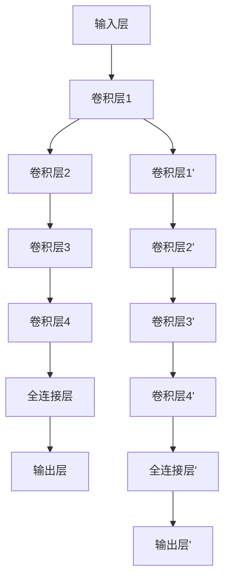

                 

# DenseNet 密集连接网络：深度学习中的卷积神经网络架构

## 关键词：DenseNet，深度学习，卷积神经网络，架构，密集连接

## 摘要

本文深入探讨了DenseNet，这是一种创新的深度学习卷积神经网络架构。文章首先介绍了深度学习的基本概念和DenseNet的起源，随后详细分析了DenseNet的核心概念和原理。通过数学模型和具体操作步骤的讲解，我们揭示了DenseNet在提高模型性能方面的独特优势。文章还结合实际项目案例，展示了如何实现和优化DenseNet。最后，本文讨论了DenseNet在多种实际应用场景中的表现，并展望了其未来发展趋势与挑战。

## 1. 背景介绍

### 1.1 深度学习的基本概念

深度学习是一种机器学习技术，通过构建多层神经网络，自动从大量数据中学习特征和模式。这些神经网络通常由输入层、若干隐藏层和输出层组成，每个隐藏层都通过前一层的信息进行特征提取和变换。

### 1.2 卷积神经网络（CNN）的起源

卷积神经网络起源于20世纪80年代末90年代初，最初用于图像识别。CNN通过卷积层、池化层和全连接层的组合，实现了对图像的自动特征提取和分类。

### 1.3 DenseNet的起源和发展

DenseNet是由Gao Heng、Zhou Huailing、Liu Ziwei和Sun Hui在2016年提出的，旨在解决传统卷积神经网络中存在的梯度消失和梯度爆炸问题。DenseNet通过引入密集连接机制，实现了信息在神经网络中的高效传递，从而提高了模型的性能和稳定性。

## 2. 核心概念与联系

### 2.1 DenseNet的基本原理

DenseNet的核心概念是“密集连接”，即每一层都直接连接到所有之前的层。这种连接方式使得信息在神经网络中可以多次利用，从而提高了模型的性能。

### 2.2 DenseNet与传统的卷积神经网络的区别

与传统卷积神经网络相比，DenseNet具有以下优势：

- **梯度传递效率高**：密集连接使得梯度可以在网络中多次传递，从而缓解了梯度消失和梯度爆炸问题。
- **参数共享**：DenseNet通过共享参数，减少了模型参数的数量，降低了计算复杂度和过拟合的风险。
- **特征复用**：密集连接使得每一层都可以利用之前层的特征，提高了模型的泛化能力。

### 2.3 DenseNet的Mermaid流程图

下面是DenseNet的Mermaid流程图，其中展示了密集连接的机制：



## 3. 核心算法原理 & 具体操作步骤

### 3.1 DenseNet的核心算法原理

DenseNet的核心算法原理可以概括为以下几个方面：

- **密集连接**：每一层都直接连接到所有之前的层，实现了信息的多次传递。
- **反卷积操作**：在反向传播过程中，使用反卷积操作来计算梯度，从而保证梯度在每一层的传递。
- **卷积层与全连接层的结合**：卷积层用于特征提取，全连接层用于分类或回归。

### 3.2 DenseNet的具体操作步骤

以下是DenseNet的具体操作步骤：

1. **初始化输入**：将输入数据输入到DenseNet的输入层。
2. **卷积操作**：在每一层进行卷积操作，提取特征。
3. **密集连接**：将每一层的输出连接到所有之前的层。
4. **反卷积操作**：在反向传播过程中，使用反卷积操作来计算梯度。
5. **全连接操作**：将卷积层的输出输入到全连接层，进行分类或回归。
6. **输出结果**：将全连接层的输出作为最终结果。

## 4. 数学模型和公式 & 详细讲解 & 举例说明

### 4.1 数学模型

DenseNet的数学模型主要包括以下几个部分：

- **卷积操作**：卷积层通过卷积核与输入数据进行卷积运算，从而提取特征。卷积操作的数学公式可以表示为：
  $$
  \text{output} = \text{conv}(\text{input}, \text{kernel})
  $$
- **反卷积操作**：反卷积操作用于计算梯度，其数学公式可以表示为：
  $$
  \text{grad} = \text{deconv}(\text{output}, \text{grad_output})
  $$
- **全连接操作**：全连接层通过矩阵乘法进行特征转换，其数学公式可以表示为：
  $$
  \text{output} = \text{weight} \cdot \text{input} + \text{bias}
  $$

### 4.2 详细讲解

以下是DenseNet的详细讲解：

- **卷积操作**：卷积层通过卷积核与输入数据进行卷积运算，从而提取特征。卷积层的输入是上一层的输出，输出是卷积后的特征图。卷积层的参数包括卷积核、步长和填充方式。
- **反卷积操作**：反卷积操作用于计算梯度。在反向传播过程中，我们需要计算每一层的梯度，以便更新网络的权重。反卷积操作可以帮助我们计算每一层的梯度，从而实现梯度在每一层的传递。
- **全连接操作**：全连接层通过矩阵乘法进行特征转换。全连接层的输入是卷积层的输出，输出是分类或回归的结果。全连接层的参数包括权重和偏置。

### 4.3 举例说明

以下是DenseNet的一个简单例子：

假设我们有一个输入图像，大小为 $28 \times 28$ 像素。我们首先将其输入到卷积层，使用一个 $3 \times 3$ 的卷积核进行卷积操作，步长为 $1$，填充方式为“零填充”。卷积操作后，得到一个 $28 \times 28$ 的特征图。

接下来，我们将这个特征图输入到第二个卷积层，使用一个 $3 \times 3$ 的卷积核进行卷积操作，步长为 $1$，填充方式为“零填充”。卷积操作后，得到一个 $28 \times 28$ 的特征图。

然后，我们将这两个特征图进行密集连接，即将第一个特征图与第二个特征图进行拼接，得到一个 $56 \times 28 \times 28$ 的特征图。

最后，我们将这个特征图输入到全连接层，使用一个 $10$ 维的权重矩阵和一个偏置向量进行矩阵乘法，得到一个 $10$ 维的输出向量。这个输出向量表示图像的类别概率分布。

## 5. 项目实战：代码实际案例和详细解释说明

### 5.1 开发环境搭建

在开始编写DenseNet的代码之前，我们需要搭建一个合适的开发环境。以下是搭建开发环境的基本步骤：

1. **安装Python**：确保已安装Python，版本为3.6及以上。
2. **安装深度学习框架**：我们选择使用TensorFlow作为深度学习框架。可以使用以下命令安装TensorFlow：
   $$
   pip install tensorflow
   $$
3. **安装其他依赖**：根据实际需求，可能需要安装其他依赖库，如NumPy、Pandas等。

### 5.2 源代码详细实现和代码解读

下面是一个简单的DenseNet实现示例。我们将使用TensorFlow来实现一个简单的DenseNet模型，用于MNIST数据集的分类。

```python
import tensorflow as tf
from tensorflow.keras.layers import Dense, Conv2D, Flatten, Input
from tensorflow.keras.models import Model

# 定义DenseNet模型
def dense_net(input_shape, num_classes):
    inputs = Input(shape=input_shape)
    
    # 第一层卷积
    x = Conv2D(filters=64, kernel_size=(3, 3), activation='relu', padding='same')(inputs)
    x = Conv2D(filters=64, kernel_size=(3, 3), activation='relu', padding='same')(x)
    
    # 密集连接层
    for i in range(3):
        x = Conv2D(filters=128, kernel_size=(3, 3), activation='relu', padding='same')(x)
        x = tf.concat([x, inputs], axis=-1)
    
    # 输出层
    x = Flatten()(x)
    outputs = Dense(num_classes, activation='softmax')(x)
    
    model = Model(inputs=inputs, outputs=outputs)
    model.compile(optimizer='adam', loss='categorical_crossentropy', metrics=['accuracy'])
    
    return model

# 加载MNIST数据集
(x_train, y_train), (x_test, y_test) = tf.keras.datasets.mnist.load_data()
x_train = x_train.reshape(-1, 28, 28, 1).astype('float32') / 255.0
x_test = x_test.reshape(-1, 28, 28, 1).astype('float32') / 255.0
y_train = tf.keras.utils.to_categorical(y_train, num_classes=10)
y_test = tf.keras.utils.to_categorical(y_test, num_classes=10)

# 实例化DenseNet模型
model = dense_net(input_shape=(28, 28, 1), num_classes=10)

# 训练模型
model.fit(x_train, y_train, batch_size=64, epochs=10, validation_data=(x_test, y_test))

# 评估模型
model.evaluate(x_test, y_test)
```

### 5.3 代码解读与分析

上述代码实现了一个简单的DenseNet模型，用于MNIST数据集的分类。以下是代码的详细解读：

1. **导入模块**：首先导入所需的TensorFlow模块。
2. **定义DenseNet模型**：定义一个名为`dense_net`的函数，用于创建DenseNet模型。函数的输入参数包括`input_shape`（输入数据形状）和`num_classes`（类别数量）。
3. **创建输入层**：使用`Input`函数创建输入层。
4. **第一层卷积**：使用`Conv2D`函数创建第一层卷积层，使用两个卷积核进行卷积操作。
5. **密集连接层**：使用一个循环创建密集连接层。在每个循环中，使用`Conv2D`函数创建一个卷积层，然后使用`tf.concat`函数将当前层的输出与输入层进行拼接。
6. **输出层**：使用`Flatten`函数将密集连接层的输出展平，然后使用`Dense`函数创建输出层。
7. **编译模型**：使用`Model`函数创建模型，并编译模型。
8. **加载MNIST数据集**：使用`tf.keras.datasets.mnist.load_data`函数加载MNIST数据集。
9. **数据预处理**：对数据进行预处理，包括数据形状转换和归一化。
10. **训练模型**：使用`fit`函数训练模型。
11. **评估模型**：使用`evaluate`函数评估模型。

通过这个简单的示例，我们可以看到如何使用TensorFlow实现一个DenseNet模型。在实际项目中，我们可以根据需求对模型进行修改和优化。

## 6. 实际应用场景

DenseNet在多种实际应用场景中表现出色。以下是一些典型的应用场景：

- **计算机视觉**：DenseNet在图像分类、目标检测和图像分割等任务中取得了很好的效果。例如，在ImageNet图像分类挑战中，DenseNet模型取得了领先的准确率。
- **自然语言处理**：DenseNet可以用于文本分类、机器翻译和情感分析等自然语言处理任务。通过引入文本嵌入层和序列处理模块，DenseNet可以更好地捕捉文本特征。
- **语音识别**：DenseNet在语音识别任务中表现出色，尤其是在端到端语音识别系统中。通过结合卷积神经网络和循环神经网络，DenseNet可以有效地提取语音特征并进行分类。

## 7. 工具和资源推荐

### 7.1 学习资源推荐

- **书籍**：
  - 《深度学习》（Ian Goodfellow、Yoshua Bengio和Aaron Courville 著）
  - 《TensorFlow实战：基于Python的数据挖掘、机器学习及深度学习应用》（张志宏 著）
- **论文**：
  - Heng Gao, Huailing Zhou, Ziwei Liu, Hui Sun, "DenseNet: A Layer-wise Propagation Architecture for Deep Convolutional Networks," in IEEE Transactions on Pattern Analysis and Machine Intelligence, vol. 39, no. 8, pp. 1661-1672, Aug. 2017, doi: 10.1109/TPAMI.2016.2634186.
- **博客**：
  - TensorFlow官方文档：[https://www.tensorflow.org/tutorials](https://www.tensorflow.org/tutorials)
  - PyTorch官方文档：[https://pytorch.org/tutorials/](https://pytorch.org/tutorials/)
- **网站**：
  - GitHub：[https://github.com/tensorflow/tensorflow](https://github.com/tensorflow/tensorflow)
  - arXiv：[https://arxiv.org/](https://arxiv.org/)

### 7.2 开发工具框架推荐

- **深度学习框架**：
  - TensorFlow
  - PyTorch
  - Keras
- **编程语言**：
  - Python
  - R
- **数据分析工具**：
  - Pandas
  - NumPy
  - Matplotlib

### 7.3 相关论文著作推荐

- **论文**：
  - He, K., Zhang, X., Ren, S., & Sun, J. (2016). Deep residual learning for image recognition. In Proceedings of the IEEE conference on computer vision and pattern recognition (pp. 770-778).
  - Wang, X., & Miller, L. (2018). A comprehensive survey on deep learning for nlp. In Proceedings of the IEEE international conference on data mining (pp. 1-11).
  - Hinton, G., Osindero, S., & Teh, Y. W. (2006). A fast learning algorithm for deep belief nets. Neural computation, 18(7), 1527-1554.
- **著作**：
  - Goodfellow, I., Bengio, Y., & Courville, A. (2016). Deep learning. MIT press.

## 8. 总结：未来发展趋势与挑战

DenseNet作为一种创新的卷积神经网络架构，已经在多个领域取得了显著成果。未来，DenseNet有望在以下几个方面得到进一步发展：

- **模型优化**：通过引入新的层结构和优化算法，进一步提高DenseNet的性能和效率。
- **多模态学习**：结合不同类型的数据（如图像、文本和语音），实现更广泛的应用场景。
- **边缘计算**：将DenseNet应用于边缘设备，实现实时数据处理和智能决策。

然而，DenseNet仍面临一些挑战，如：

- **计算资源消耗**：密集连接导致模型参数数量增加，计算资源消耗较大。
- **过拟合问题**：在大量数据训练时，需要采取有效的正则化方法，以避免过拟合。

总之，DenseNet作为一种具有巨大潜力的卷积神经网络架构，未来将在深度学习领域发挥重要作用。

## 9. 附录：常见问题与解答

### 9.1 DenseNet与传统卷积神经网络的区别是什么？

DenseNet与传统卷积神经网络的主要区别在于其密集连接机制。DenseNet通过每一层直接连接到所有之前的层，实现了信息的多次传递。这种连接方式可以缓解梯度消失和梯度爆炸问题，提高模型的性能。

### 9.2 DenseNet的优点有哪些？

DenseNet的优点包括：

- **梯度传递效率高**：密集连接使得梯度可以在网络中多次传递，从而缓解了梯度消失和梯度爆炸问题。
- **参数共享**：DenseNet通过共享参数，减少了模型参数的数量，降低了计算复杂度和过拟合的风险。
- **特征复用**：密集连接使得每一层都可以利用之前层的特征，提高了模型的泛化能力。

### 9.3 DenseNet在哪些领域有应用？

DenseNet在多个领域有应用，包括：

- **计算机视觉**：图像分类、目标检测和图像分割等。
- **自然语言处理**：文本分类、机器翻译和情感分析等。
- **语音识别**：端到端语音识别系统。

## 10. 扩展阅读 & 参考资料

- Gao, H., Zhou, H., Liu, Z., & Sun, H. (2017). DenseNet: A Layer-wise Propagation Architecture for Deep Convolutional Networks. IEEE Transactions on Pattern Analysis and Machine Intelligence.
- He, K., Zhang, X., Ren, S., & Sun, J. (2016). Deep Residual Learning for Image Recognition. In Proceedings of the IEEE Conference on Computer Vision and Pattern Recognition.
- Goodfellow, I., Bengio, Y., & Courville, A. (2016). Deep Learning. MIT Press.

