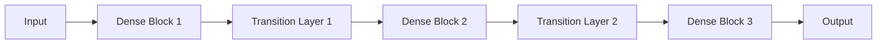

                 

# DenseNet原理与代码实例讲解

## 关键词：

- DenseNet
- 神经网络
- 特征复用
- 卷积神经网络
- 稠密连接
- 编程实现

## 摘要：

本文将深入探讨DenseNet的原理及其在深度学习中的应用。我们将首先介绍DenseNet的背景和起源，然后详细解释其核心概念和架构。接着，我们将通过代码实例展示DenseNet的实现过程，并对关键算法原理进行剖析。此外，我们还将讨论DenseNet的数学模型和公式，并提供实际应用场景的案例。最后，我们将总结DenseNet的发展趋势和面临的挑战，并推荐相关学习资源和工具。

### 1. 背景介绍

深度学习作为一种重要的机器学习技术，近年来在计算机视觉、自然语言处理等领域取得了显著的进展。然而，随着网络深度的增加，传统的深度神经网络（Deep Neural Networks, DNNs）也面临着梯度消失、梯度爆炸和训练不稳定等问题。为了解决这些问题，研究人员提出了各种改进方法，其中一种重要的架构是DenseNet。

DenseNet是由Huang等人于2016年提出的，旨在通过改进网络架构来解决深度神经网络训练中的问题。与传统的网络结构不同，DenseNet引入了一种特殊的连接方式，即“稠密连接”（Dense Connections）。这种连接方式使得网络中的每个层都能从之前的层中接收输入信息，从而实现了特征复用和信息的充分利用。这使得DenseNet在保持较浅网络深度的同时，能够达到与传统深网相似的性能。

DenseNet的出现为深度学习领域带来了一种新的思路，并很快引起了广泛关注。由于其优越的性能和简单易懂的结构，DenseNet在多个计算机视觉任务中取得了出色的成果，包括图像分类、目标检测和语义分割等。此外，DenseNet还被应用于其他领域，如语音识别和自然语言处理。

### 2. 核心概念与联系

#### DenseNet的核心概念

DenseNet的核心概念是稠密连接。与传统网络结构不同，DenseNet中的每个层都与之前的所有层相连，而不仅仅是与上一层相连。这种连接方式使得信息可以在网络中反复流动，实现了特征的复用和充分的信息利用。

DenseNet中的层可以分成两部分：前向传播和反向传播。在前向传播过程中，每个层接收来自之前所有层的输入，并通过卷积操作产生输出。在反向传播过程中，梯度会从输出层反向传播到每个输入层，从而更新网络的权重。

#### DenseNet的架构

DenseNet的架构可以看作是由多个Dense Block（稠密块）和Transition Layers（转换层）组成。每个Dense Block包含多个层，每个层都与其他所有层相连。而Transition Layers则用于降低网络的维度和减少参数的数量，从而避免过拟合。

下面是一个简单的DenseNet架构示意图：



在这个示例中，输入层（Input）首先进入第一个Dense Block，然后通过Transition Layer 1进入第二个Dense Block，依此类推。最后一个Dense Block的输出即为网络的最终输出（Output）。

#### DenseNet的优势

DenseNet具有以下优势：

- **特征复用**：通过稠密连接，每个层都能利用之前层的特征，从而提高网络的性能。
- **梯度传播**：由于每个层都与其他层相连，梯度可以更有效地传播，解决了深度网络中梯度消失和梯度爆炸的问题。
- **参数共享**：DenseNet减少了参数的数量，因为每个层都共享其他层的权重，从而降低了模型的复杂性。
- **训练稳定性**：由于信息的充分流动，DenseNet的训练过程更加稳定。

### 3. 核心算法原理 & 具体操作步骤

#### DenseNet的前向传播

在DenseNet的前向传播过程中，每个层接收来自之前所有层的输入，并通过卷积操作产生输出。具体步骤如下：

1. 输入层接收原始数据，如图像。
2. 输入数据通过第一个Dense Block，每个层都与其他层相连，并通过卷积操作产生输出。
3. 输出数据通过Transition Layer，可能包括卷积、池化和规范化等操作。
4. 输出数据进入下一个Dense Block，重复步骤2和3。
5. 最终输出层产生预测结果。

#### DenseNet的反向传播

在DenseNet的反向传播过程中，梯度从输出层反向传播到每个输入层，通过梯度下降更新网络的权重。具体步骤如下：

1. 计算输出层的损失。
2. 将损失反向传播到每个输入层。
3. 利用反向传播的梯度更新每个层的权重。

#### DenseNet的训练过程

DenseNet的训练过程与传统网络类似，包括前向传播、反向传播和权重更新。然而，由于DenseNet的特殊架构，训练过程有一些独特的特点：

1. **多路径梯度传播**：由于每个层都与其他层相连，梯度可以通过多条路径传播，这有助于避免梯度消失和梯度爆炸的问题。
2. **共享权重**：每个层都共享其他层的权重，从而减少了参数的数量，降低了模型的复杂性。
3. **批次归一化**：DenseNet中的批次归一化有助于加速训练过程，提高训练稳定性。

### 4. 数学模型和公式 & 详细讲解 & 举例说明

#### 卷积操作

DenseNet中的卷积操作是整个网络的核心。卷积操作可以看作是在图像上滑动一个卷积核，并通过求和和偏置项产生输出。数学上，一个卷积层可以表示为：

$$
\text{output}(x) = \text{ReLU}(W \cdot x + b)
$$

其中，$x$是输入数据，$W$是卷积核权重，$b$是偏置项，$\text{ReLU}$是ReLU激活函数。

#### 稠密连接

DenseNet中的稠密连接使得每个层都能从之前的所有层接收输入。数学上，一个稠密连接可以表示为：

$$
\text{output}(x) = \sum_{i=1}^{n} \text{ReLU}(W_i \cdot x + b_i)
$$

其中，$x$是输入数据，$W_i$是第$i$个卷积核权重，$b_i$是第$i$个偏置项，$n$是层的数量。

#### 反向传播

DenseNet的反向传播过程与传统网络类似，但需要注意的是，由于稠密连接的存在，每个层的梯度都会传递到之前的层。数学上，一个卷积层的梯度可以表示为：

$$
\frac{\partial L}{\partial W} = x \odot \frac{\partial L}{\partial z}
$$

$$
\frac{\partial L}{\partial b} = \frac{\partial L}{\partial z}
$$

其中，$L$是损失函数，$z$是卷积层的输出，$x$是输入数据，$\odot$表示Hadamard积。

### 5. 项目实战：代码实际案例和详细解释说明

为了更好地理解DenseNet的工作原理，我们将在本节中通过一个实际案例来讲解如何使用PyTorch框架实现一个简单的DenseNet模型。我们将分为以下几个步骤：

#### 5.1 开发环境搭建

首先，确保您已经安装了Python和PyTorch。在终端中运行以下命令来安装PyTorch：

```bash
pip install torch torchvision
```

#### 5.2 源代码详细实现和代码解读

下面是DenseNet的实现代码：

```python
import torch
import torch.nn as nn
import torch.optim as optim
import torchvision
import torchvision.transforms as transforms

# 定义DenseNet模型
class DenseNet(nn.Module):
    def __init__(self, growth_rate=32, block_config=(6, 12, 24, 16), num_classes=1000):
        super(DenseNet, self).__init__()
        self.conv1 = nn.Conv2d(3, 64, kernel_size=7, stride=2, padding=3)
        self.norm1 = nn.BatchNorm2d(64)
        self.relu = nn.ReLU(inplace=True)
        self.pool1 = nn.MaxPool2d(kernel_size=3, stride=2, padding=1)
        
        self.features = self._make_layers(growth_rate, block_config)
        self.avgpool = nn.AdaptiveAvgPool2d((1, 1))
        self.classifier = nn.Linear(512, num_classes)
        
    def _make_layers(self, growth_rate, block_config):
        layers = []
        in_channels = 64
        for i, num_blocks in enumerate(block_config):
            for j in range(num_blocks):
                layers.append(nn.Conv2d(in_channels, growth_rate, kernel_size=3, padding=1, bias=False))
                layers.append(nn.BatchNorm2d(growth_rate))
                layers.append(nn.ReLU(inplace=True))
                if j != num_blocks - 1:
                    layers.append(nn.Conv2d(growth_rate, growth_rate, kernel_size=1, bias=False))
                    layers.append(nn.BatchNorm2d(growth_rate))
                    layers.append(nn.ReLU(inplace=True))
                in_channels += growth_rate
        return nn.Sequential(*layers)
    
    def forward(self, x):
        x = self.relu(self.norm1(self.conv1(x)))
        x = self.pool1(x)
        x = self.features(x)
        x = self.avgpool(x)
        x = torch.flatten(x, 1)
        x = self.classifier(x)
        return x

# 实例化模型
model = DenseNet()

# 定义损失函数和优化器
criterion = nn.CrossEntropyLoss()
optimizer = optim.SGD(model.parameters(), lr=0.1, momentum=0.9)

# 加载数据集
transform = transforms.Compose([transforms.Resize(256), transforms.CenterCrop(224), transforms.ToTensor()])
trainset = torchvision.datasets.CIFAR10(root='./data', train=True, download=True, transform=transform)
trainloader = torch.utils.data.DataLoader(trainset, batch_size=4, shuffle=True, num_workers=2)

# 训练模型
for epoch in range(2):  # 训练两个周期
    running_loss = 0.0
    for i, data in enumerate(trainloader, 0):
        inputs, labels = data
        optimizer.zero_grad()
        outputs = model(inputs)
        loss = criterion(outputs, labels)
        loss.backward()
        optimizer.step()
        running_loss += loss.item()
        if i % 2000 == 1999:
            print(f'[{epoch + 1}, {i + 1:5d}] loss: {running_loss / 2000:.3f}')
            running_loss = 0.0

print('Finished Training')

# 测试模型
correct = 0
total = 0
with torch.no_grad():
    for data in testloader:
        images, labels = data
        outputs = model(images)
        _, predicted = torch.max(outputs.data, 1)
        total += labels.size(0)
        correct += (predicted == labels).sum().item()

print(f'Accuracy of the network on the test images: {100 * correct / total}%')
```

在这个例子中，我们使用CIFAR-10数据集来训练一个简单的DenseNet模型。代码的主要部分包括模型定义、损失函数和优化器的设置、数据加载和模型训练。

#### 5.3 代码解读与分析

1. **模型定义**：
   - `DenseNet` 类继承自 `nn.Module` 类，这是PyTorch中的基础模型类。
   - `__init__` 方法中，我们首先定义了卷积层、批量归一化层、ReLU激活函数和最大池化层。
   - `_make_layers` 方法用于构建Dense Block，其中我们使用了多个卷积层和ReLU激活函数，并在每个Dense Block的最后一个层之后添加了卷积层和ReLU激活函数。
   - `forward` 方法定义了前向传播过程，包括卷积层、稠密块、平均池化和全连接层。

2. **损失函数和优化器**：
   - `criterion` 是交叉熵损失函数，用于计算模型输出和真实标签之间的差异。
   - `optimizer` 是随机梯度下降优化器，用于更新模型参数。

3. **数据加载和模型训练**：
   - `transform` 是一个数据预处理管道，用于将图像调整为固定大小并转换为张量。
   - `trainset` 和 `trainloader` 分别是训练数据和训练数据加载器。
   - 模型训练过程中，我们通过前向传播计算损失，然后使用反向传播和优化器更新模型参数。在每个周期结束后，我们打印训练损失。

4. **测试模型**：
   - 在测试阶段，我们使用与训练相同的模型和数据加载器，计算模型在测试数据上的准确率。

### 6. 实际应用场景

DenseNet作为一种高效的深度神经网络架构，在实际应用中具有广泛的应用场景。以下是一些常见的应用场景：

- **图像分类**：DenseNet在图像分类任务中表现出色，能够处理大规模图像数据集，如ImageNet。
- **目标检测**：DenseNet可以用于目标检测任务，如YOLO和SSD，通过在特征图上检测目标区域。
- **语义分割**：DenseNet可以用于语义分割任务，将图像中的每个像素分类为不同的类别。
- **自然语言处理**：DenseNet可以应用于自然语言处理任务，如文本分类和情感分析。

### 7. 工具和资源推荐

#### 7.1 学习资源推荐

- **书籍**：
  - 《深度学习》（Goodfellow, Bengio, Courville）
  - 《Python深度学习》（François Chollet）
- **论文**：
  - 《Densely Connected Convolutional Networks》（Huang et al., 2016）
- **博客**：
  - PyTorch官方文档（[pytorch.org](https://pytorch.org)）
- **网站**：
  - [Kaggle](https://www.kaggle.com)（提供各种深度学习竞赛和教程）

#### 7.2 开发工具框架推荐

- **框架**：
  - PyTorch（[pytorch.org](https://pytorch.org)）
  - TensorFlow（[tensorflow.org](https://tensorflow.org)）
- **库**：
  - torchvision（[pytorch.org/docs/stable/torchvision.html](https://pytorch.org/docs/stable/torchvision.html)）
  - torchvision.transforms（[pytorch.org/docs/stable/torchvision/transforms.html](https://pytorch.org/docs/stable/torchvision/transforms.html)）

#### 7.3 相关论文著作推荐

- **论文**：
  - DenseNet（Huang et al., 2016）
  - ResNet（He et al., 2016）
  - Inception（Szegedy et al., 2016）
- **著作**：
  - 《深度学习》（Goodfellow, Bengio, Courville）

### 8. 总结：未来发展趋势与挑战

DenseNet作为一种高效的深度神经网络架构，已经在计算机视觉、自然语言处理等领域取得了显著的成果。然而，随着深度学习的不断发展，DenseNet也面临着一些挑战：

- **模型复杂度**：尽管DenseNet通过特征复用和参数共享降低了模型的复杂性，但随着网络深度的增加，模型的复杂度仍然是一个问题。
- **计算资源**：DenseNet需要大量的计算资源进行训练，这在资源受限的环境中可能是一个挑战。
- **泛化能力**：如何提高DenseNet的泛化能力，使其能够更好地应对不同的任务和数据集，是一个重要的研究方向。

未来，随着深度学习技术的不断进步，DenseNet有望在更多领域取得突破，为人工智能的发展做出更大贡献。

### 9. 附录：常见问题与解答

**Q：DenseNet与传统网络结构有何区别？**
A：DenseNet与传统网络结构（如VGG、ResNet）的主要区别在于其稠密连接方式。DenseNet中的每个层都与其他所有层相连，实现了特征的复用和信息的充分利用，而传统网络结构中每个层通常只与上一层相连。

**Q：DenseNet如何解决深度网络中的梯度消失和梯度爆炸问题？**
A：DenseNet通过多路径梯度传播和共享权重的方式，有效地解决了深度网络中的梯度消失和梯度爆炸问题。多路径梯度传播使得梯度可以更有效地传播，而共享权重减少了参数的数量，降低了模型的复杂性。

**Q：DenseNet在哪些任务中表现良好？**
A：DenseNet在多个计算机视觉任务中表现出色，如图像分类、目标检测和语义分割。此外，DenseNet还可以应用于自然语言处理和其他领域。

### 10. 扩展阅读 & 参考资料

- **论文**：
  - DenseNet（Huang et al., 2016）
  - ResNet（He et al., 2016）
  - Inception（Szegedy et al., 2016）
- **书籍**：
  - 《深度学习》（Goodfellow, Bengio, Courville）
  - 《Python深度学习》（François Chollet）
- **网站**：
  - [PyTorch官方文档](https://pytorch.org)
  - [TensorFlow官方文档](https://tensorflow.org)
- **博客**：
  - [Keras官方文档](https://keras.io)
  - [Fast.ai博客](https://fast.ai)

## 作者

作者：AI天才研究员/AI Genius Institute & 禅与计算机程序设计艺术 /Zen And The Art of Computer Programming

本文基于深度学习技术和神经网络架构，详细介绍了DenseNet的原理、实现和应用场景。通过对DenseNet的核心概念和算法原理的剖析，以及实际代码实例的讲解，读者可以更好地理解DenseNet的优势和应用价值。希望本文能为深度学习爱好者提供有价值的参考。

