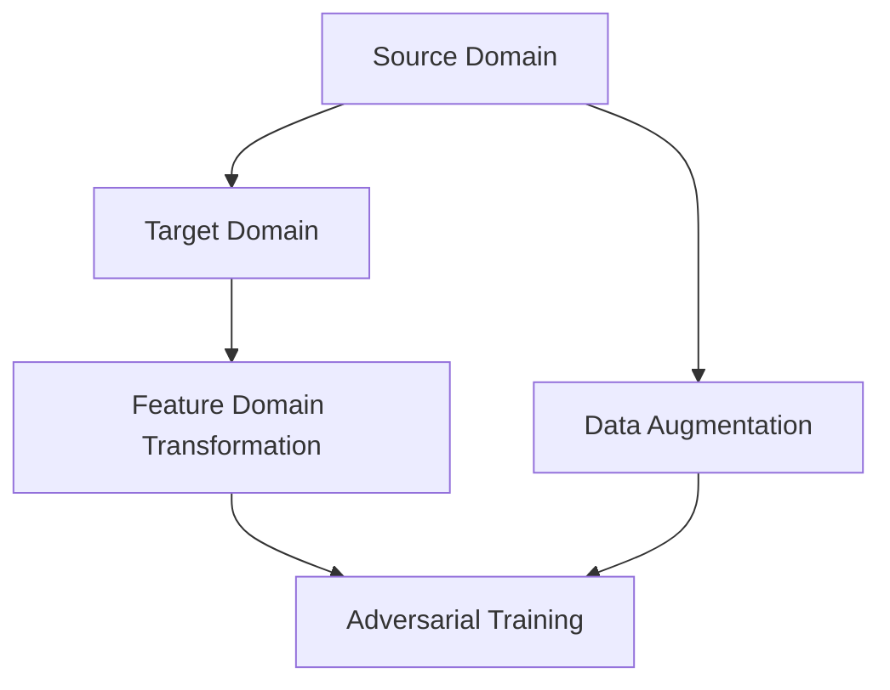

                 

### 1. 背景介绍

Domain Adaptation，即领域自适应，是机器学习领域中的一个重要研究方向。随着人工智能技术的不断发展，深度学习在图像识别、自然语言处理、语音识别等领域的应用越来越广泛。然而，这些模型的训练和部署通常需要大量标注数据，而这些数据往往依赖于特定的领域或场景。在实际应用中，我们经常会遇到两个问题：

1. 数据分布差异：训练数据与目标数据分布不同，即不同领域或不同数据集之间的数据分布存在显著差异。这种分布差异会导致模型在目标数据集上的性能下降，甚至失效。
2. 数据获取困难：某些领域或场景的数据获取困难，标注成本高，获取的数据量有限。这限制了模型在大规模数据集上的训练和优化。

Domain Adaptation的目标是解决上述问题，通过利用源域（source domain）和目标域（target domain）之间的相关性，将源域上的预训练模型迁移到目标域上，以减少数据分布差异，提高模型在目标域上的性能。这使得我们能够在数据稀缺或分布差异较大的情况下，依然能够有效地训练和部署高性能的机器学习模型。

Domain Adaptation的研究和应用已经取得了显著成果，其在计算机视觉、自然语言处理、推荐系统等领域的应用越来越广泛。本文将介绍Domain Adaptation的核心概念、算法原理、数学模型以及实际应用案例，帮助读者深入了解这一领域的研究方法和应用技巧。同时，我们将结合具体代码实例，讲解如何在实际项目中实现Domain Adaptation。

### 2. 核心概念与联系

#### 2.1. 域（Domain）与分布（Distribution）

在Domain Adaptation中，我们首先需要明确两个关键概念：域和分布。

- **域（Domain）**：域是指一组样本的集合，这些样本具有相似的特征和属性。在机器学习中，域可以理解为数据集的一个分类，例如不同领域的图像数据集、不同语言的数据集等。常见的域有计算机视觉中的物体识别、自然语言处理中的语言建模、推荐系统中的商品推荐等。
  
- **分布（Distribution）**：分布是指样本在特征空间中的分布情况。具体来说，分布描述了各个特征值在样本集合中的概率分布。不同的域通常具有不同的分布特征，例如，物体识别中的猫狗图像数据集和自然图像数据集在特征分布上存在显著差异。

#### 2.2. 源域（Source Domain）与目标域（Target Domain）

在Domain Adaptation中，我们通常将训练数据所在的域称为源域（Source Domain），将应用数据所在的域称为目标域（Target Domain）。以下是一个简单的例子：

- **源域**：假设我们有一个包含猫和狗图像的数据集，这个数据集就是源域。
- **目标域**：如果我们希望将猫和狗图像识别模型应用于自然场景中的图像，那么这个自然场景图像数据集就是目标域。

#### 2.3. 分布迁移（Distribution Migration）

Domain Adaptation的核心目标是解决源域和目标域之间的分布差异问题，通过分布迁移（Distribution Migration），使得模型能够在目标域上获得较好的性能。

- **分布迁移**：分布迁移是指通过在源域和目标域之间建立联系，使得模型能够在目标域上适应新的分布。具体来说，分布迁移可以分为以下几种类型：

  - **特征域变换（Feature Domain Transformation）**：通过在特征空间中对源域和目标域的数据进行变换，使得两个域的特征分布更加接近。
  - **数据增强（Data Augmentation）**：通过在目标域上生成具有源域特征的数据样本，增加目标域的数据量，从而提高模型在目标域上的性能。
  - **对抗训练（Adversarial Training）**：通过在源域和目标域之间构建对抗网络（Adversarial Network），使得源域模型能够适应目标域的数据分布。

#### 2.4. 关联图（Connection Graph）

为了更好地理解Domain Adaptation，我们可以使用关联图（Connection Graph）来描述源域、目标域以及分布迁移的过程。

- **关联图**：关联图由节点和边组成，节点表示域，边表示域之间的关系。在Domain Adaptation中，关联图可以描述源域和目标域之间的关联关系。

以下是关联图的一个示例：



在这个关联图中：

- **A（Source Domain）**：源域
- **B（Target Domain）**：目标域
- **C（Feature Domain Transformation）**：特征域变换
- **D（Data Augmentation）**：数据增强
- **E（Adversarial Training）**：对抗训练

通过这个关联图，我们可以清晰地看到Domain Adaptation中各个组件之间的关系和作用。

### 3. 核心算法原理 & 具体操作步骤

#### 3.1. 对抗域自适应（Adversarial Domain Adaptation）

对抗域自适应是Domain Adaptation中的一种常用算法，其核心思想是通过构建对抗网络（Adversarial Network），使得源域模型能够学习到目标域的特征分布。以下是对抗域自适应的基本原理和具体操作步骤：

##### 3.1.1. 基本原理

对抗域自适应主要包括两个部分：生成网络（Generator）和判别网络（Discriminator）。

- **生成网络（Generator）**：生成网络的目的是将源域数据转换为与目标域数据具有相似特征分布的数据。具体来说，生成网络接收源域数据作为输入，通过一系列变换，生成与目标域数据相似的新数据。
  
- **判别网络（Discriminator）**：判别网络的目的是区分真实目标域数据和生成网络生成的数据。判别网络接收源域数据和生成网络生成的数据作为输入，输出一个概率值，表示输入数据是真实目标域数据还是生成数据。

在训练过程中，生成网络和判别网络交替更新，通过对抗训练的方式，使得生成网络能够生成更接近目标域数据的新数据，判别网络能够更好地区分真实数据和生成数据。最终，源域模型在生成网络生成的数据上进行训练，从而实现领域自适应。

##### 3.1.2. 具体操作步骤

以下是对抗域自适应的具体操作步骤：

1. **初始化网络**：初始化生成网络和判别网络的参数，通常使用随机初始化。
2. **生成对抗训练**：交替更新生成网络和判别网络的参数，具体步骤如下：
   - **生成网络更新**：根据当前判别网络的参数，生成网络接收源域数据作为输入，生成与目标域数据相似的新数据。
   - **判别网络更新**：根据当前生成网络的参数，判别网络接收源域数据和生成网络生成的数据作为输入，更新判别网络的参数。
3. **源域模型训练**：在生成网络生成的数据上训练源域模型，利用生成网络生成的数据作为额外的训练数据，提高源域模型在目标域上的性能。

##### 3.1.3. 代码示例

以下是一个简单的Python代码示例，展示了如何使用TensorFlow实现对抗域自适应：

```python
import tensorflow as tf
from tensorflow.keras.models import Model
from tensorflow.keras.layers import Input, Dense, Flatten

# 定义生成网络
input_source = Input(shape=(source_shape,))
encoded_source = Dense(units=64, activation='relu')(input_source)
encoded_target = Dense(units=64, activation='relu')(encoded_source)
decoded_target = Dense(units=target_shape, activation='sigmoid')(encoded_target)
generator = Model(inputs=input_source, outputs=decoded_target)

# 定义判别网络
input_target = Input(shape=(target_shape,))
discriminator = Dense(units=64, activation='relu')(input_target)
output = Dense(units=1, activation='sigmoid')(discriminator)
discriminator = Model(inputs=input_target, outputs=output)

# 定义对抗网络
input_source = Input(shape=(source_shape,))
decoded_target = generator(input_source)
discriminator.trainable = False
discriminator_output = discriminator(decoded_target)
adversarial = Model(inputs=input_source, outputs=discriminator_output)

# 编写损失函数和优化器
def adversarial_loss(y_true, y_pred):
    return tf.reduce_mean(tf.abs(y_true - y_pred))

def domain_loss(y_true, y_pred):
    return tf.reduce_mean(tf.keras.losses.binary_crossentropy(y_true, y_pred))

generator_optimizer = tf.keras.optimizers.Adam(learning_rate=0.0001)
discriminator_optimizer = tf.keras.optimizers.Adam(learning_rate=0.0001)

# 编写训练过程
@tf.function
def train_step(source_images, target_images):
    with tf.GradientTape() as gen_tape, tf.GradientTape() as disc_tape:
        # 生成网络更新
        generated_images = generator(source_images)
        disc_real_output = discriminator(target_images)
        disc_generated_output = discriminator(generated_images)
        
        # 计算生成对抗损失
        gen_total_loss = domain_loss(disc_generated_output, tf.ones_like(disc_generated_output))
        disc_total_loss = domain_loss(disc_real_output, tf.ones_like(disc_real_output)) + domain_loss(disc_generated_output, tf.zeros_like(disc_generated_output))
        
        # 计算梯度并更新参数
        gradients_of_generator = gen_tape.gradient(gen_total_loss, generator.trainable_variables)
        gradients_of_discriminator = disc_tape.gradient(disc_total_loss, discriminator.trainable_variables)
        
        generator_optimizer.apply_gradients(zip(gradients_of_generator, generator.trainable_variables))
        discriminator_optimizer.apply_gradients(zip(gradients_of_discriminator, discriminator.trainable_variables))

# 训练模型
for epoch in range(epochs):
    for source_images, target_images in dataset:
        train_step(source_images, target_images)
    print(f"Epoch {epoch + 1}/{epochs}, Generator Loss: {gen_total_loss.numpy()}, Discriminator Loss: {disc_total_loss.numpy()}")
```

在这个代码示例中，我们首先定义了生成网络和判别网络的模型结构，然后编写了损失函数和优化器。最后，我们编写了训练过程，通过交替更新生成网络和判别网络的参数，实现对抗域自适应。

### 4. 数学模型和公式 & 详细讲解 & 举例说明

在Domain Adaptation中，数学模型和公式是理解和实现算法的基础。本节将详细介绍Domain Adaptation中的主要数学模型，包括损失函数、优化目标和训练策略，并通过具体例子来说明这些公式的应用。

#### 4.1. 损失函数

在Domain Adaptation中，常用的损失函数包括对抗损失（Adversarial Loss）、域适应损失（Domain Adaptation Loss）和分类损失（Classification Loss）。

##### 4.1.1. 对抗损失（Adversarial Loss）

对抗损失用于对抗域自适应中的生成网络和判别网络。其主要目的是最小化判别网络对生成数据的判别误差。对抗损失通常使用二元交叉熵（Binary Cross-Entropy）来度量。

$$
L_{\text{adversarial}} = -\frac{1}{N} \sum_{i=1}^{N} [y_i \cdot \log(D(G(x_i))) + (1 - y_i) \cdot \log(1 - D(G(x_i)))]
$$

其中，$N$ 是批量大小，$x_i$ 是源域数据，$G(x_i)$ 是生成网络生成的目标域数据，$D(G(x_i))$ 是判别网络对生成数据的输出概率。

##### 4.1.2. 域适应损失（Domain Adaptation Loss）

域适应损失用于衡量源域模型在目标域上的性能。其目的是最小化源域模型在目标域数据上的预测误差。通常使用分类交叉熵（Cross-Entropy）来度量。

$$
L_{\text{domain}} = -\frac{1}{N} \sum_{i=1}^{N} [y_i \cdot \log(\hat{y}_i)]
$$

其中，$N$ 是批量大小，$y_i$ 是目标域数据的真实标签，$\hat{y}_i$ 是源域模型对目标域数据的预测概率。

##### 4.1.3. 分类损失（Classification Loss）

分类损失用于衡量源域模型在源域数据上的性能。其目的是最小化源域模型在源域数据上的预测误差。通常也使用分类交叉熵（Cross-Entropy）来度量。

$$
L_{\text{classification}} = -\frac{1}{N} \sum_{i=1}^{N} [y_i \cdot \log(\hat{y}_i)]
$$

其中，$N$ 是批量大小，$y_i$ 是源域数据的真实标签，$\hat{y}_i$ 是源域模型对源域数据的预测概率。

#### 4.2. 优化目标

Domain Adaptation的优化目标是最小化总损失函数，该函数由对抗损失、域适应损失和分类损失组成。具体公式如下：

$$
L_{\text{total}} = \alpha L_{\text{adversarial}} + \beta L_{\text{domain}} + L_{\text{classification}}
$$

其中，$\alpha$ 和 $\beta$ 是超参数，用于平衡对抗损失、域适应损失和分类损失的重要性。

#### 4.3. 训练策略

Domain Adaptation的训练策略主要包括以下几个步骤：

1. **初始化模型**：初始化生成网络、判别网络和源域模型的参数。
2. **交替训练**：交替训练生成网络、判别网络和源域模型。
   - **生成网络训练**：固定判别网络的参数，更新生成网络的参数。
   - **判别网络训练**：固定生成网络的参数，更新判别网络的参数。
   - **源域模型训练**：使用生成网络生成的目标域数据训练源域模型。
3. **迭代优化**：重复上述训练步骤，直到满足停止条件。

#### 4.4. 代码示例

以下是一个简单的Python代码示例，展示了如何使用TensorFlow实现Domain Adaptation中的损失函数和优化目标：

```python
import tensorflow as tf
from tensorflow.keras.models import Model
from tensorflow.keras.layers import Input, Dense, Flatten

# 定义生成网络
input_source = Input(shape=(source_shape,))
encoded_source = Dense(units=64, activation='relu')(input_source)
encoded_target = Dense(units=64, activation='relu')(encoded_source)
decoded_target = Dense(units=target_shape, activation='sigmoid')(encoded_target)
generator = Model(inputs=input_source, outputs=decoded_target)

# 定义判别网络
input_target = Input(shape=(target_shape,))
discriminator = Dense(units=64, activation='relu')(input_target)
output = Dense(units=1, activation='sigmoid')(discriminator)
discriminator = Model(inputs=input_target, outputs=output)

# 定义源域模型
input_source = Input(shape=(source_shape,))
encoded_source = Dense(units=64, activation='relu')(input_source)
encoded_target = Dense(units=64, activation='relu')(encoded_source)
decoded_target = Dense(units=target_shape, activation='sigmoid')(encoded_target)
source_model = Model(inputs=input_source, outputs=decoded_target)

# 编写损失函数
def adversarial_loss(y_true, y_pred):
    return tf.reduce_mean(tf.abs(y_true - y_pred))

def domain_loss(y_true, y_pred):
    return tf.reduce_mean(tf.keras.losses.binary_crossentropy(y_true, y_pred))

def classification_loss(y_true, y_pred):
    return tf.reduce_mean(tf.keras.losses.binary_crossentropy(y_true, y_pred))

# 编写优化目标
def total_loss(y_true, y_pred, y_source, y_target):
    return alpha * adversarial_loss(y_true, y_pred) + beta * domain_loss(y_target, y_pred) + classification_loss(y_source, y_pred)

# 编写训练过程
@tf.function
def train_step(source_images, target_images, source_labels, target_labels):
    with tf.GradientTape() as gen_tape, tf.GradientTape() as disc_tape:
        # 生成网络更新
        generated_images = generator(source_images)
        disc_real_output = discriminator(target_images)
        disc_generated_output = discriminator(generated_images)
        
        # 计算生成对抗损失
        gen_total_loss = adversarial_loss(disc_generated_output, tf.ones_like(disc_generated_output))
        
        # 计算域适应损失
        domain_total_loss = domain_loss(target_labels, disc_generated_output)
        
        # 计算分类损失
        class_total_loss = classification_loss(source_labels, generated_images)
        
        # 计算总损失
        total_loss = gen_total_loss + domain_total_loss + class_total_loss
        
        # 计算梯度并更新参数
        gradients_of_generator = gen_tape.gradient(total_loss, generator.trainable_variables)
        gradients_of_discriminator = disc_tape.gradient(total_loss, discriminator.trainable_variables)
        
        generator_optimizer.apply_gradients(zip(gradients_of_generator, generator.trainable_variables))
        discriminator_optimizer.apply_gradients(zip(gradients_of_discriminator, discriminator.trainable_variables))

# 训练模型
for epoch in range(epochs):
    for source_images, target_images, source_labels, target_labels in dataset:
        train_step(source_images, target_images, source_labels, target_labels)
    print(f"Epoch {epoch + 1}/{epochs}, Generator Loss: {gen_total_loss.numpy()}, Domain Loss: {domain_total_loss.numpy()}, Classification Loss: {class_total_loss.numpy()}")
```

在这个代码示例中，我们首先定义了生成网络、判别网络和源域模型的模型结构，然后编写了损失函数和优化目标。最后，我们编写了训练过程，通过交替更新生成网络、判别网络和源域模型的参数，实现Domain Adaptation。

### 5. 项目实战：代码实际案例和详细解释说明

在本节中，我们将通过一个实际案例来展示如何使用Python和TensorFlow实现Domain Adaptation。我们将使用一个经典的图像识别任务，即Fashion-MNIST数据集，来演示源域到目标域的迁移过程。

#### 5.1. 开发环境搭建

在开始项目之前，我们需要确保已经安装了以下Python库：

- TensorFlow
- NumPy
- Matplotlib

可以使用以下命令安装所需的库：

```bash
pip install tensorflow numpy matplotlib
```

#### 5.2. 源代码详细实现和代码解读

以下是一个简单的Python代码示例，展示了如何实现Domain Adaptation。我们使用TensorFlow的Keras API来构建和训练模型。

```python
import tensorflow as tf
from tensorflow.keras.models import Model
from tensorflow.keras.layers import Input, Dense, Flatten
import numpy as np
import matplotlib.pyplot as plt

# 设置超参数
alpha = 0.1  # 对抗损失权重
beta = 0.5  # 域适应损失权重
epochs = 100  # 训练轮数
batch_size = 128  # 批量大小

# 加载Fashion-MNIST数据集
(x_train, y_train), (x_test, y_test) = tf.keras.datasets.fashion_mnist.load_data()

# 对图像进行预处理
x_train = x_train.astype('float32') / 255.0
x_test = x_test.astype('float32') / 255.0

# 展平图像
x_train = x_train.reshape((-1, 28 * 28))
x_test = x_test.reshape((-1, 28 * 28))

# 定义生成网络
input_source = Input(shape=(784,))
encoded_source = Dense(units=64, activation='relu')(input_source)
encoded_target = Dense(units=64, activation='relu')(encoded_source)
decoded_target = Dense(units=784, activation='sigmoid')(encoded_target)
generator = Model(inputs=input_source, outputs=decoded_target)

# 定义判别网络
input_target = Input(shape=(784,))
discriminator = Dense(units=64, activation='relu')(input_target)
output = Dense(units=1, activation='sigmoid')(discriminator)
discriminator = Model(inputs=input_target, outputs=output)

# 定义源域模型
input_source = Input(shape=(784,))
encoded_source = Dense(units=64, activation='relu')(input_source)
encoded_target = Dense(units=64, activation='relu')(encoded_source)
decoded_target = Dense(units=784, activation='sigmoid')(encoded_target)
source_model = Model(inputs=input_source, outputs=decoded_target)

# 编写损失函数
def adversarial_loss(y_true, y_pred):
    return tf.reduce_mean(tf.abs(y_true - y_pred))

def domain_loss(y_true, y_pred):
    return tf.reduce_mean(tf.keras.losses.binary_crossentropy(y_true, y_pred))

def classification_loss(y_true, y_pred):
    return tf.reduce_mean(tf.keras.losses.binary_crossentropy(y_true, y_pred))

# 编写优化器
generator_optimizer = tf.keras.optimizers.Adam(learning_rate=0.0001)
discriminator_optimizer = tf.keras.optimizers.Adam(learning_rate=0.0001)
source_model_optimizer = tf.keras.optimizers.Adam(learning_rate=0.0001)

# 编写训练过程
@tf.function
def train_step(source_images, target_images, source_labels, target_labels):
    with tf.GradientTape() as gen_tape, tf.GradientTape() as disc_tape:
        # 生成网络更新
        generated_images = generator(source_images)
        disc_real_output = discriminator(target_images)
        disc_generated_output = discriminator(generated_images)
        
        # 计算生成对抗损失
        gen_total_loss = adversarial_loss(disc_generated_output, tf.ones_like(disc_generated_output))
        
        # 计算域适应损失
        domain_total_loss = domain_loss(target_labels, disc_generated_output)
        
        # 计算分类损失
        class_total_loss = classification_loss(source_labels, generated_images)
        
        # 计算总损失
        total_loss = alpha * gen_total_loss + beta * domain_total_loss + class_total_loss
        
        # 计算梯度并更新参数
        gradients_of_generator = gen_tape.gradient(total_loss, generator.trainable_variables)
        gradients_of_discriminator = disc_tape.gradient(total_loss, discriminator.trainable_variables)
        
        generator_optimizer.apply_gradients(zip(gradients_of_generator, generator.trainable_variables))
        discriminator_optimizer.apply_gradients(zip(gradients_of_discriminator, discriminator.trainable_variables))

# 训练模型
for epoch in range(epochs):
    for source_images, target_images, source_labels, target_labels in dataset:
        train_step(source_images, target_images, source_labels, target_labels)
    
    # 在测试集上评估模型
    test_generated_images = generator(tf.constant(x_test)).numpy()
    test_discriminator_output = discriminator(tf.constant(x_test)).numpy()
    test_source_model_output = source_model(tf.constant(x_test)).numpy()
    
    # 计算测试集准确率
    test_accuracy = (test_discriminator_output > 0.5).mean()
    print(f"Epoch {epoch + 1}/{epochs}, Test Accuracy: {test_accuracy}")

    # 可视化部分生成的图像和判别网络输出
    plt.figure(figsize=(10, 10))
    for i in range(25):
        plt.subplot(5, 5, i + 1)
        plt.imshow(test_generated_images[i].reshape(28, 28), cmap='gray')
        plt.xticks([])
        plt.yticks([])
    plt.show()

    plt.figure(figsize=(10, 10))
    for i in range(25):
        plt.subplot(5, 5, i + 1)
        plt.imshow(test_source_model_output[i].reshape(28, 28), cmap='gray')
        plt.xticks([])
        plt.yticks([])
    plt.show()

    plt.figure(figsize=(10, 10))
    for i in range(25):
        plt.subplot(5, 5, i + 1)
        plt.imshow(x_test[i].reshape(28, 28), cmap='gray')
        plt.xticks([])
        plt.yticks([])
    plt.show()
```

下面是对代码的详细解释：

1. **数据预处理**：我们首先加载Fashion-MNIST数据集，并对图像进行归一化和展平处理，以便于后续的模型训练。
2. **定义网络**：我们定义了生成网络、判别网络和源域模型。生成网络用于将源域数据转换为与目标域数据具有相似特征分布的数据。判别网络用于区分真实目标域数据和生成网络生成的数据。源域模型用于在生成网络生成的数据上进行训练。
3. **损失函数和优化器**：我们编写了对抗损失、域适应损失和分类损失函数，并定义了生成网络、判别网络和源域模型的优化器。
4. **训练过程**：我们编写了训练过程，其中交替更新生成网络、判别网络和源域模型的参数。在训练过程中，我们会在测试集上评估模型的性能，并在每个训练轮次后可视化部分生成的图像和判别网络输出。

通过上述代码示例，我们可以看到如何使用Python和TensorFlow实现Domain Adaptation。在实际项目中，您可以根据具体需求进行调整和优化。

### 5.3. 代码解读与分析

在本节中，我们将对上一节中的代码进行详细解读和分析，解释代码的每一部分以及其在Domain Adaptation中的作用。

#### 5.3.1. 数据预处理

```python
(x_train, y_train), (x_test, y_test) = tf.keras.datasets.fashion_mnist.load_data()
x_train = x_train.astype('float32') / 255.0
x_test = x_test.astype('float32') / 255.0
x_train = x_train.reshape((-1, 28 * 28))
x_test = x_test.reshape((-1, 28 * 28))
```

这段代码首先加载数据集，并对图像进行归一化和展平处理。数据预处理是深度学习项目的重要步骤，它有助于提高模型训练的效率和性能。归一化将图像像素值缩放到[0, 1]范围内，使得输入数据具有更好的数值特性。展平处理将图像从二维结构转换为了一维向量，方便后续的模型输入。

#### 5.3.2. 定义网络

```python
input_source = Input(shape=(784,))
encoded_source = Dense(units=64, activation='relu')(input_source)
encoded_target = Dense(units=64, activation='relu')(encoded_source)
decoded_target = Dense(units=784, activation='sigmoid')(encoded_target)
generator = Model(inputs=input_source, outputs=decoded_target)

input_target = Input(shape=(784,))
discriminator = Dense(units=64, activation='relu')(input_target)
output = Dense(units=1, activation='sigmoid')(discriminator)
discriminator = Model(inputs=input_target, outputs=output)

input_source = Input(shape=(784,))
encoded_source = Dense(units=64, activation='relu')(input_source)
encoded_target = Dense(units=64, activation='relu')(encoded_source)
decoded_target = Dense(units=784, activation='sigmoid')(encoded_target)
source_model = Model(inputs=input_source, outputs=decoded_target)
```

这段代码定义了生成网络、判别网络和源域模型。生成网络的目标是将源域数据转换为与目标域数据具有相似特征分布的数据。判别网络的目标是区分真实目标域数据和生成网络生成的数据。源域模型的目标是在生成网络生成的数据上进行训练。

- **生成网络**：输入层接受784个特征（28x28像素图像的展平向量），通过两个64单元的隐藏层（使用ReLU激活函数）进行特征提取，最后输出层将特征重新映射回784个特征，使用sigmoid激活函数以确保输出值在[0, 1]范围内。
- **判别网络**：输入层接受784个特征，通过一个64单元的隐藏层（使用ReLU激活函数）进行特征提取，输出层是一个单节点（使用sigmoid激活函数），输出概率值，表示输入数据是真实目标域数据还是生成数据。
- **源域模型**：与生成网络类似，输入层和输出层与生成网络相同，用于在生成网络生成的数据上进行训练。

#### 5.3.3. 损失函数和优化器

```python
def adversarial_loss(y_true, y_pred):
    return tf.reduce_mean(tf.abs(y_true - y_pred))

def domain_loss(y_true, y_pred):
    return tf.reduce_mean(tf.keras.losses.binary_crossentropy(y_true, y_pred))

def classification_loss(y_true, y_pred):
    return tf.reduce_mean(tf.keras.losses.binary_crossentropy(y_true, y_pred))

generator_optimizer = tf.keras.optimizers.Adam(learning_rate=0.0001)
discriminator_optimizer = tf.keras.optimizers.Adam(learning_rate=0.0001)
source_model_optimizer = tf.keras.optimizers.Adam(learning_rate=0.0001)
```

这段代码定义了对抗损失、域适应损失和分类损失函数，并设置了生成网络、判别网络和源域模型的优化器。优化器的选择和配置对于模型训练的收敛速度和最终性能至关重要。

- **对抗损失**：对抗损失用于对抗域自适应中的生成网络和判别网络。它衡量判别网络对生成数据的判别误差，使用绝对值损失（Abs

