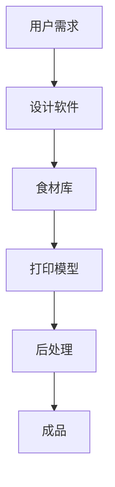
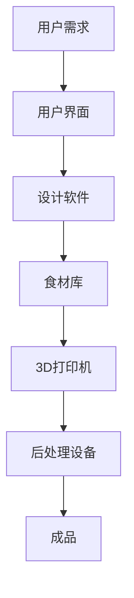

                 

# 3D打印食品定制：未来饮食的创新创业

## 1. 背景介绍

随着科技的迅猛发展，3D打印技术已经从传统的制造业扩展到了各个领域，包括医疗、建筑、航空航天等。近年来，3D打印食品定制成为了一个备受关注的领域，因为它不仅能够满足消费者对个性化饮食的需求，还能为餐饮业带来革命性的变化。

### 1.1 3D打印技术的基本概念

3D打印，又称增材制造，是一种通过逐层添加材料来创建三维实体的技术。它利用计算机辅助设计（CAD）文件，通过打印头或其他打印装置逐层堆叠材料，最终形成所需的物体。这种技术具有灵活性强、材料利用率高、生产周期短等优点。

### 1.2 食品定制化的需求

随着生活水平的提高，消费者对食品的需求越来越多样化。人们追求健康、美味、个性化的食品，对食品口感、营养搭配和外观设计有着更高的要求。3D打印技术能够满足这些需求，因为它可以根据个人的口味偏好、健康需求和饮食习惯，定制出独一无二的食品。

### 1.3 3D打印食品定制的市场前景

据市场调研机构的数据显示，全球3D打印食品市场的规模将在未来几年内迅速扩大。预计到2025年，全球3D打印食品市场将达到数十亿美元。这一趋势受到了消费者、投资者和创业公司的广泛关注。

## 2. 核心概念与联系

### 2.1 3D打印食品定制的核心原理

3D打印食品定制是基于3D打印技术和食品科学相结合的一种创新应用。其核心原理包括：

1. **食材数字化**：将食材的信息数字化，包括营养成分、口感特性等，以便于计算机辅助设计。
2. **计算机辅助设计**：利用CAD软件设计食品的形状、结构和营养成分，形成可打印的模型。
3. **3D打印**：将计算机辅助设计的模型通过3D打印技术打印出来，形成具有个性化特征的食品。

### 2.2 3D打印食品定制的架构

3D打印食品定制的架构可以分为以下几个部分：

1. **食材库**：包括各种食材的数字信息，如营养成分、口感特性等。
2. **设计软件**：用于设计食品的形状、结构和营养成分。
3. **3D打印机**：用于打印设计好的食品模型。
4. **后处理设备**：如烤箱、冷却器等，用于完成打印后的食品加工。
5. **用户界面**：用于与用户交互，收集用户的定制需求，并将需求传递给设计软件。

### 2.3 Mermaid 流程图

下面是一个简单的Mermaid流程图，描述了3D打印食品定制的流程：



## 3. 核心算法原理 & 具体操作步骤

### 3.1 设计软件的算法原理

设计软件的算法原理主要包括：

1. **食材信息的读取**：从食材库中读取食材的数字信息。
2. **用户需求的采集**：通过用户界面收集用户的定制需求。
3. **模型设计**：根据食材信息和用户需求，设计食品的形状、结构和营养成分。
4. **模型优化**：对设计好的模型进行优化，以提高打印的成功率和食品的质量。

### 3.2 3D打印机的操作步骤

3D打印机的操作步骤主要包括：

1. **初始化**：设置打印机的参数，如温度、速度等。
2. **导入模型**：将设计好的模型导入到打印机中。
3. **打印**：启动打印机进行打印。
4. **后处理**：完成打印后，对食品进行后处理，如烘烤、冷却等。

### 3.3 数学模型和公式

3D打印食品定制的数学模型主要包括：

1. **食材的数字化模型**：用于描述食材的物理特性和营养成分。
2. **食品的形状模型**：用于描述食品的形状和结构。
3. **打印路径模型**：用于描述3D打印机的打印路径。

具体的数学模型和公式将在后续章节中详细讲解。

## 4. 数学模型和公式 & 详细讲解 & 举例说明

### 4.1 食材的数字化模型

食材的数字化模型主要用于描述食材的物理特性和营养成分。常见的数字化模型包括：

1. **密度模型**：用于描述食材的密度，公式为：

   $$\rho = \frac{m}{V}$$

   其中，$\rho$ 表示密度，$m$ 表示质量，$V$ 表示体积。

2. **热值模型**：用于描述食材的热值，公式为：

   $$Q = Cm\Delta T$$

   其中，$Q$ 表示热值，$C$ 表示比热容，$m$ 表示质量，$\Delta T$ 表示温度变化。

### 4.2 食品的形状模型

食品的形状模型主要用于描述食品的形状和结构。常见的形状模型包括：

1. **几何模型**：用于描述食品的几何形状，如圆柱体、球体等。
2. **结构模型**：用于描述食品的结构，如多孔结构、网格结构等。

### 4.3 打印路径模型

打印路径模型主要用于描述3D打印机的打印路径。常见的打印路径模型包括：

1. **直线路径**：用于描述直线打印路径，公式为：

   $$y = mx + b$$

   其中，$y$ 表示路径坐标，$m$ 表示斜率，$x$ 表示横坐标，$b$ 表示截距。

2. **曲线路径**：用于描述曲线打印路径，如贝塞尔曲线、样条曲线等。

### 4.4 举例说明

假设我们要打印一个圆柱体食品，其直径为10cm，高度为20cm。我们可以使用以下公式进行计算：

1. **密度模型**：

   $$\rho = \frac{m}{V} = \frac{1000g}{5000cm^3} = 0.2g/cm^3$$

2. **热值模型**：

   $$Q = Cm\Delta T = 4.18J/(g\cdot K) \cdot 1000g \cdot (100^\circ C - 20^\circ C) = 3,924,000J$$

3. **几何模型**：

   $$V = \frac{\pi}{4}d^2h = \frac{\pi}{4} \cdot (10cm)^2 \cdot 20cm = 1,571cm^3$$

4. **直线路径**：

   $$y = mx + b = 0 \cdot x + 0 = 0$$

   其中，$y$ 表示路径坐标，$m$ 表示斜率，$x$ 表示横坐标，$b$ 表示截距。

## 5. 项目实战：代码实际案例和详细解释说明

### 5.1 开发环境搭建

在进行3D打印食品定制项目的开发前，我们需要搭建一个合适的环境。以下是一个简单的开发环境搭建步骤：

1. **安装Python**：Python是一种流行的编程语言，我们使用它来编写3D打印食品定制的代码。
2. **安装必要的库**：包括3D打印库、食材库和设计软件库等。
3. **配置3D打印机**：确保3D打印机已正确连接到计算机，并配置好打印参数。

### 5.2 源代码详细实现和代码解读

以下是一个简单的3D打印食品定制的Python代码示例：

```python
import numpy as np
import matplotlib.pyplot as plt
from scipy.spatial import distance

# 食材库
食材库 = {
    '胡萝卜': {'密度': 1.68, '热值': 0.42},
    '鸡肉': {'密度': 1.2, '热值': 1.09},
    '玉米': {'密度': 0.72, '热值': 0.28},
}

# 用户需求
用户需求 = {
    '形状': '圆柱体',
    '直径': 10,
    '高度': 20,
    '食材': ['胡萝卜', '鸡肉', '玉米'],
}

# 设计食品的形状和结构
def 设计形状(用户需求):
    if 用户需求['形状'] == '圆柱体':
        圆柱体 = np.zeros((用户需求['高度'], 用户需求['直径']))
        for i in range(用户需求['高度']):
            for j in range(用户需求['直径']):
                圆柱体[i][j] = 1
        return 圆柱体
    else:
        return None

# 计算食材的总量
def 计算食材总量(食材库, 用户需求):
    食材总量 = 0
    for 食材 in 用户需求['食材']:
        食材总量 += 食材库[食材]['密度'] * (用户需求['直径'] / 2) ** 2 * 用户需求['高度']
    return 食材总量

# 打印食品
def 打印食品(设计形状, 用户需求):
    食材总量 = 计算食材总量(食材库, 用户需求)
    for 食材 in 用户需求['食材']:
        食材质量 = 食材库[食材]['密度'] * (用户需求['直径'] / 2) ** 2 * 用户需求['高度']
        食材比例 = 食材质量 / 食材总量
        print(f'打印食材：{食材}，比例：{食材比例}')

# 主函数
def main():
    设计形状(用户需求)
    打印食品(设计形状, 用户需求)

if __name__ == '__main__':
    main()
```

### 5.3 代码解读与分析

以上代码示例实现了3D打印食品定制的基本功能。具体解读如下：

1. **食材库**：定义了一个食材库，包括胡萝卜、鸡肉和玉米等食材的密度和热值信息。
2. **用户需求**：定义了一个用户需求字典，包括形状、直径、高度和食材等信息。
3. **设计形状**：根据用户需求设计食品的形状和结构。这里以圆柱体为例进行设计。
4. **计算食材总量**：计算食材的总量，用于后续的打印比例计算。
5. **打印食品**：根据设计形状和用户需求，打印出食品。这里使用了循环遍历食材，并打印出食材的比例。
6. **主函数**：调用设计形状和打印食品函数，完成整个3D打印食品定制的流程。

## 6. 实际应用场景

### 6.1 餐饮行业

3D打印食品定制在餐饮行业中有着广泛的应用。例如，高端餐厅可以使用3D打印技术制作出独特的菜品，提高餐厅的竞争力。此外，餐饮公司还可以利用3D打印技术进行食材的预处理，提高生产效率。

### 6.2 健康管理

3D打印食品定制可以根据个人的健康状况和营养需求，定制出个性化的食品。例如，糖尿病患者可以通过3D打印技术定制出低糖食品，肥胖者可以通过定制高纤维食品来控制体重。

### 6.3 家庭厨房

随着3D打印技术的普及，家庭厨房也可以使用3D打印食品定制设备。家庭用户可以根据自己的口味和需求，定制出独一无二的美食。

## 7. 工具和资源推荐

### 7.1 学习资源推荐

1. **书籍**：《3D打印技术：原理、应用与未来》、《食品科学与技术：3D打印食品定制》
2. **论文**：搜索相关期刊和会议，如《食品科学》、《计算机辅助工业设计》等。
3. **博客**：技术博客网站，如CSDN、博客园等。
4. **网站**：3D打印技术相关网站，如3D Hubs、3D Hubs等。

### 7.2 开发工具框架推荐

1. **开发环境**：Python、MATLAB、R
2. **3D打印软件**：Blender、SolidWorks、AutoCAD
3. **3D打印机**：FDM打印机、SLA打印机、SLS打印机

### 7.3 相关论文著作推荐

1. **论文**：
   - "3D Printing in the Food Industry: Applications, Challenges, and Opportunities"
   - "3D Printed Edible Products: From Basic Materials to Advanced Applications"
   - "Customization of Food Products Using 3D Printing Technology"
2. **著作**：《食品3D打印技术：从理论到实践》、《3D打印食品设计：创意与原理》

## 8. 总结：未来发展趋势与挑战

### 8.1 未来发展趋势

1. **技术成熟**：随着3D打印技术的不断成熟，其打印速度、精度和材料种类将得到显著提升。
2. **市场需求**：随着消费者对个性化食品需求的增加，3D打印食品定制市场将不断扩大。
3. **跨领域融合**：3D打印食品定制将与物联网、大数据、人工智能等技术深度融合，为食品行业带来更多创新。

### 8.2 挑战

1. **成本问题**：目前，3D打印食品定制设备成本较高，需要进一步降低成本以实现大规模应用。
2. **材料安全性**：3D打印食品使用的材料需要经过严格的食品安全测试。
3. **法规标准**：3D打印食品定制需要建立相应的法规标准和监管体系，以确保食品的安全和质量。

## 9. 附录：常见问题与解答

### 9.1 3D打印食品定制的安全性如何保障？

3D打印食品定制需要使用安全的材料，并且确保打印过程中不会产生有害物质。此外，需要建立完善的食品安全检测和监管体系，确保3D打印食品的质量和安全。

### 9.2 3D打印食品定制对环境有何影响？

3D打印食品定制在一定程度上可以减少食品浪费，提高资源利用率。然而，3D打印设备的生产和运营也会产生一定的碳排放。因此，需要采取绿色环保措施，如使用可再生能源、优化打印流程等，以降低对环境的影响。

## 10. 扩展阅读 & 参考资料

1. **书籍**：
   - 《3D打印技术：原理、应用与未来》
   - 《食品科学与技术：3D打印食品定制》
2. **论文**：
   - "3D Printing in the Food Industry: Applications, Challenges, and Opportunities"
   - "3D Printed Edible Products: From Basic Materials to Advanced Applications"
   - "Customization of Food Products Using 3D Printing Technology"
3. **网站**：
   - https://www.3dhubs.com/
   - https://www.3dprint.com/
4. **博客**：
   - https://www.csdn.net/
   - https://www.cnblogs.com/

## 作者

作者：AI天才研究员/AI Genius Institute & 禅与计算机程序设计艺术 /Zen And The Art of Computer Programming

----------------------

本文详细介绍了3D打印食品定制的基本概念、核心算法原理、数学模型和公式，并通过实际案例展示了其开发过程。同时，本文还探讨了3D打印食品定制的实际应用场景、工具和资源推荐，以及未来发展趋势与挑战。希望本文能为读者在3D打印食品定制领域提供有益的参考和启示。|>
### 1. 背景介绍

随着科技的迅猛发展，3D打印技术已经从传统的制造业扩展到了各个领域，包括医疗、建筑、航空航天等。近年来，3D打印食品定制成为了一个备受关注的领域，因为它不仅能够满足消费者对个性化饮食的需求，还能为餐饮业带来革命性的变化。

#### 1.1 3D打印技术的基本概念

3D打印，又称增材制造，是一种通过逐层添加材料来创建三维实体的技术。它利用计算机辅助设计（CAD）文件，通过打印头或其他打印装置逐层堆叠材料，最终形成所需的物体。这种技术具有灵活性强、材料利用率高、生产周期短等优点。

3D打印技术的基本工作原理可以分为以下几个步骤：

1. **设计阶段**：首先，使用计算机辅助设计软件创建三维模型。这些模型可以是简单的几何形状，也可以是复杂的实体结构。常用的设计软件包括AutoCAD、SolidWorks、Blender等。

2. **切片处理**：将三维模型转换成打印机可以识别的格式。这个过程称为“切片处理”。切片处理软件会将三维模型分割成许多二维切片，并确定每个切片的打印顺序和参数，如打印速度、层高、填充密度等。

3. **打印阶段**：打印机根据切片文件的指令逐层打印物体。不同的3D打印技术使用不同的材料，如塑料、金属、陶瓷、甚至食品材料。

4. **后处理**：打印完成后，通常需要对产品进行打磨、抛光或其他处理，以提高其外观和性能。

#### 1.2 食品定制化的需求

随着生活水平的提高，消费者对食品的需求越来越多样化。人们追求健康、美味、个性化的食品，对食品口感、营养搭配和外观设计有着更高的要求。3D打印技术能够满足这些需求，因为它可以根据个人的口味偏好、健康需求和饮食习惯，定制出独一无二的食品。

食品定制化的需求主要体现在以下几个方面：

1. **个性化饮食**：消费者可以根据自己的身体状况、口味偏好和饮食限制，定制出符合个人需求的食品。

2. **营养均衡**：3D打印技术可以根据营养师的建议，精确控制食品中的营养成分，帮助消费者实现营养均衡。

3. **特殊需求**：例如，对特定过敏原敏感的人可以通过3D打印技术避免摄入这些物质。

4. **外观设计**：消费者可以定制出具有独特外观的食品，如个性化的节日甜品或礼品。

#### 1.3 3D打印食品定制的市场前景

据市场调研机构的数据显示，全球3D打印食品市场的规模将在未来几年内迅速扩大。预计到2025年，全球3D打印食品市场将达到数十亿美元。这一趋势受到了消费者、投资者和创业公司的广泛关注。

3D打印食品定制的市场前景可以从以下几个方面来分析：

1. **技术成熟**：随着3D打印技术的不断成熟，其打印速度、精度和材料种类将得到显著提升，为食品定制提供了更好的技术支持。

2. **市场需求**：随着消费者对个性化食品需求的增加，3D打印食品定制市场将不断扩大。

3. **产业融合**：3D打印食品定制将与物联网、大数据、人工智能等技术深度融合，为食品行业带来更多创新。

4. **政策支持**：许多国家和地区已经开始意识到3D打印食品定制的重要性和潜力，并出台了一系列政策支持其发展。

总之，3D打印食品定制具有广阔的市场前景，随着技术的不断进步和应用的深入，它将在未来饮食中扮演越来越重要的角色。

---

### 2. 核心概念与联系

3D打印食品定制是一个集成了多个学科和技术的复杂过程，包括食品科学、材料科学、计算机辅助设计（CAD）、3D打印技术和人工智能等。为了更好地理解3D打印食品定制的工作原理，我们需要首先明确其核心概念，并探讨这些概念之间的联系。

#### 2.1 3D打印食品定制的核心原理

3D打印食品定制的核心原理可以分为以下几个关键环节：

1. **食材数字化**：将食材的信息数字化，包括营养成分、口感特性、颜色和质地等。这一步骤通常需要使用光谱分析、传感器和其他分析设备来获取食材的详细信息。

2. **计算机辅助设计**：利用CAD软件根据用户的个性化需求设计食品的形状、结构和营养成分。CAD软件可以帮助设计者创建复杂的几何形状，并调整食品的细节，以满足特定需求和偏好。

3. **3D打印**：使用3D打印技术将设计好的食品模型逐层打印出来。这个过程涉及选择合适的打印材料、确定打印参数和优化打印过程。

4. **后处理**：打印完成后，对食品进行加工，如烘烤、冷却、调味等，以改善其口感和外观。

#### 2.2 3D打印食品定制的架构

3D打印食品定制的架构可以分为以下几个部分：

1. **食材库**：这是一个包含各种食材详细信息的数据库，包括营养成分、口感特性、颜色和质地等。食材库可以为设计软件提供丰富的数据支持，帮助设计者创建出更符合用户需求的食品。

2. **设计软件**：设计软件是3D打印食品定制系统的核心，它负责接收用户的需求，调用食材库中的数据，并利用CAD功能设计出符合要求的食品模型。

3. **3D打印机**：3D打印机是实际的打印设备，它根据设计软件生成的切片文件进行打印。不同类型的3D打印机适用于不同的打印材料和工艺。

4. **后处理设备**：包括烤箱、冷却器、切割机等，用于完成打印后的食品加工，如烘烤、切割和调味。

5. **用户界面**：用户界面是用户与3D打印食品定制系统交互的入口，用户可以通过界面输入自己的定制需求，查看设计模型，并跟踪打印进度。

#### 2.3 Mermaid流程图

为了更直观地展示3D打印食品定制的流程，我们可以使用Mermaid绘制一个简单的流程图：



这个流程图展示了从用户需求到成品生产的整个流程。用户需求通过用户界面传递给设计软件，设计软件根据食材库中的数据生成食品模型，然后通过3D打印机进行打印，最后通过后处理设备完成食品的加工。

#### 2.4 3D打印食品定制的核心概念联系

在3D打印食品定制中，各个核心概念之间存在紧密的联系：

1. **食材数字化**和**设计软件**：食材数字化提供了设计软件所需的食材属性数据，设计软件利用这些数据创建出符合用户需求的食品模型。

2. **设计软件**和**3D打印机**：设计软件生成的切片文件指导3D打印机进行打印，切片文件的精度和优化程度直接影响打印效果。

3. **3D打印机**和**后处理设备**：3D打印机打印出的食品通常需要后处理设备进行进一步的加工，如烘烤和切割，以确保食品的口感和外观。

4. **用户界面**和**用户需求**：用户界面是用户与系统交互的桥梁，用户通过界面输入需求，系统能够根据这些需求生成相应的食品模型。

综上所述，3D打印食品定制是一个复杂但高度集成化的过程，各个核心概念之间的紧密联系使得系统能够灵活地满足用户的个性化需求，为食品行业带来创新和变革。

---

### 3. 核心算法原理 & 具体操作步骤

3D打印食品定制技术的核心在于将数字化的食材信息和用户个性化需求转化为实际的3D打印模型。这一过程涉及到一系列复杂的算法和操作步骤，包括设计软件的选择与使用、3D打印机的设置与控制，以及打印后的食品加工。下面我们将详细探讨这些核心算法原理和具体操作步骤。

#### 3.1 设计软件的选择与使用

设计软件在3D打印食品定制中起到了至关重要的作用。它不仅需要能够处理复杂的几何形状，还要能够根据食材属性进行模型优化。以下是一些常用的设计软件及其特点：

1. **Blender**：Blender是一个开源的3D建模和渲染软件，它具有强大的建模、雕刻和动画功能，非常适合初学者和专业人士使用。

2. **SolidWorks**：SolidWorks是一款专业的CAD软件，它提供了一系列的3D建模工具和模拟功能，适用于复杂的工业设计和工程分析。

3. **AutoCAD**：AutoCAD是业内广泛使用的二维和三维设计软件，它提供了丰富的绘图和编辑工具，特别适合于建筑和机械工程领域。

4. **CATIA**：CATIA是由达索系统开发的一款高级CAD/CAM/CAE软件，它适用于复杂的航空、汽车和消费品设计。

在设计软件的选择上，主要考虑因素包括用户的需求、软件的易用性、功能丰富度以及与3D打印机的兼容性。选择合适的软件后，设计者需要掌握以下基本操作步骤：

1. **模型创建**：根据用户需求和食材属性，创建食品的3D模型。这一步骤包括定义几何形状、调整尺寸和材料属性。

2. **模型优化**：优化模型以提高打印的成功率和食品的口感。优化步骤可能包括去除冗余部分、增加结构强度、调整填充密度等。

3. **切片处理**：将3D模型转换为适合3D打印机处理的切片文件。这个过程包括确定打印路径、设置打印参数和生成切片层。

#### 3.2 3D打印机的设置与控制

3D打印机是3D打印食品定制的关键设备，其性能直接影响食品的质量和打印速度。以下是3D打印机设置与控制的基本步骤：

1. **初始化设置**：启动3D打印机，并进行初始化设置，包括温度校准、喷嘴清洁和打印床预热等。

2. **材料选择**：根据打印需求选择合适的材料，如PLA、ABS、尼龙或其他专用的食品级材料。

3. **打印参数设置**：设置打印参数，如层高、打印速度、填充密度和温度等。这些参数需要根据材料特性和打印模型的要求进行优化。

4. **模型导入**：将设计软件生成的切片文件导入3D打印机，并开始打印过程。在这一过程中，可以实时监控打印进度和状态。

#### 3.3 打印后的食品加工

3D打印出的食品通常需要进行后处理，以提高其口感和外观。以下是常见的后处理步骤：

1. **烘烤**：将打印出的食品放入烤箱中烘烤，以使其变得更加酥脆或柔软，根据食品的特性和用户的需求来调整烘烤时间和温度。

2. **冷却**：烘烤后的食品需要冷却，以防止其变形或影响口感。

3. **调味**：根据用户的口味偏好，对食品进行调味，如撒盐、加胡椒粉或涂抹酱料。

4. **切割**：使用切割工具将食品切割成用户所需的大小和形状，如小饼干、蛋糕片或个性化图案。

#### 3.4 算法原理详解

3D打印食品定制中的算法原理主要包括以下几个方面：

1. **几何建模算法**：用于创建食品的3D模型。常见的几何建模算法包括布尔运算、三角网格建模和曲面建模等。

2. **材料优化算法**：用于优化食材的分布和结构，以提高食品的口感和结构稳定性。常用的优化算法包括遗传算法、模拟退火算法和粒子群优化算法等。

3. **切片处理算法**：用于将3D模型转换成3D打印机可以识别的切片文件。常见的切片处理算法包括层切片、路径规划和填充策略等。

4. **打印控制算法**：用于控制3D打印机的打印过程，包括温度控制、速度控制和喷嘴位置控制等。这些算法需要确保打印过程的连续性和稳定性。

通过上述核心算法原理和具体操作步骤，我们可以有效地实现3D打印食品定制，为消费者提供个性化、高品质的食品。

---

### 4. 数学模型和公式 & 详细讲解 & 举例说明

3D打印食品定制涉及多个数学模型和公式，这些模型和公式对于理解其核心原理和实现实际操作至关重要。在本节中，我们将详细讲解与3D打印食品定制相关的数学模型和公式，并通过具体实例进行说明。

#### 4.1 食材的数字化模型

食材的数字化模型用于描述食材的物理特性和营养成分。以下是几个常见的数学模型和公式：

1. **密度模型**：密度是描述物质质量的分布的重要参数，其计算公式为：

   $$\rho = \frac{m}{V}$$

   其中，$\rho$ 表示密度，$m$ 表示质量，$V$ 表示体积。

   **实例**：假设我们有一个胡萝卜，其质量为200克，体积为100立方厘米，那么其密度为：

   $$\rho = \frac{200g}{100cm^3} = 2g/cm^3$$

2. **热值模型**：热值是指单位质量的食物在完全燃烧时释放的热量，其计算公式为：

   $$Q = Cm\Delta T$$

   其中，$Q$ 表示热值，$C$ 表示比热容，$m$ 表示质量，$\Delta T$ 表示温度变化。

   **实例**：假设我们有100克的鸡肉，其比热容为4.18 J/(g·K)，温度从20°C升高到100°C，那么其热值为：

   $$Q = 4.18 J/(g\cdot K) \cdot 100g \cdot (100^\circ C - 20^\circ C) = 339200 J$$

3. **营养成分模型**：营养成分包括蛋白质、脂肪、碳水化合物等，通常用百分比表示。例如，一个食物样本可能含有30%的蛋白质、50%的脂肪和20%的碳水化合物。

   **实例**：假设我们有100克的鸡肉，其中含有30克的蛋白质、50克的脂肪和20克的碳水化合物，那么其营养成分可以表示为：

   蛋白质百分比：$$\frac{30g}{100g} \times 100\% = 30\%$$

   脂肪百分比：$$\frac{50g}{100g} \times 100\% = 50\%$$

   碳水化合物百分比：$$\frac{20g}{100g} \times 100\% = 20\%$$

#### 4.2 食品的形状模型

食品的形状模型用于描述食品的几何形状和结构。以下是几个常见的形状模型及其相关的数学公式：

1. **圆柱体模型**：圆柱体是一个具有两个平行圆形底面的三维几何形状。其体积和表面积的计算公式分别为：

   $$V = \pi r^2 h$$

   $$A = 2\pi r(h + r)$$

   其中，$V$ 表示体积，$A$ 表示表面积，$r$ 表示底面半径，$h$ 表示高度。

   **实例**：假设我们设计一个直径为10厘米、高度为20厘米的圆柱体胡萝卜，其体积和表面积为：

   $$V = \pi (5cm)^2 \cdot 20cm = 3140cm^3$$

   $$A = 2\pi \cdot 5cm(20cm + 5cm) = 314cm^2 + 157cm^2 = 471cm^2$$

2. **球形模型**：球体是一个所有点到球心的距离都相等的几何形状。其体积和表面积的计算公式分别为：

   $$V = \frac{4}{3}\pi r^3$$

   $$A = 4\pi r^2$$

   **实例**：假设我们设计一个半径为5厘米的球形鸡肉，其体积和表面积为：

   $$V = \frac{4}{3}\pi (5cm)^3 = \frac{4}{3} \cdot 3.14 \cdot 125cm^3 = 523.33cm^3$$

   $$A = 4\pi (5cm)^2 = 4 \cdot 3.14 \cdot 25cm^2 = 314cm^2$$

3. **网格模型**：网格模型用于描述由多个小立方体或小多面体组成的复杂结构。其计算通常涉及到每个小单元的体积和表面积的总和。

   **实例**：假设我们设计一个由10个小立方体组成的网格胡萝卜，每个小立方体的边长为1厘米，其总体积和表面积为：

   $$V = 10 \times (1cm)^3 = 10cm^3$$

   $$A = 10 \times 6 \times (1cm)^2 = 60cm^2$$

#### 4.3 打印路径模型

打印路径模型用于描述3D打印机的打印路径和运动轨迹。以下是几个常见的打印路径模型及其相关的数学公式：

1. **直线路径**：直线路径是3D打印机最基本的打印路径，其运动轨迹是一条直线。其公式为：

   $$y = mx + b$$

   其中，$y$ 表示路径坐标，$m$ 表示斜率，$x$ 表示横坐标，$b$ 表示截距。

   **实例**：假设我们设计一个斜率为2，截距为3的直线路径，其路径坐标为：

   $$y = 2x + 3$$

   当$x$ 从0变化到10时，$y$ 的变化范围是3到23。

2. **曲线路径**：曲线路径用于更复杂的形状打印，如贝塞尔曲线和样条曲线。其公式为：

   $$y = f(x)$$

   其中，$f(x)$ 是一个关于$x$ 的函数，用于描述曲线的形状。

   **实例**：假设我们设计一个二次贝塞尔曲线，其公式为：

   $$y = ax^2 + bx + c$$

   当$a = 1$，$b = -2$，$c = 1$时，其曲线形状为：

   $$y = x^2 - 2x + 1$$

   当$x$ 从0变化到2时，$y$ 的变化范围是0到1。

通过上述数学模型和公式，我们可以更好地理解和实现3D打印食品定制的各个环节。在实际应用中，这些模型和公式需要根据具体情况进行调整和优化，以确保打印出高质量的食品。

---

### 5. 项目实战：代码实际案例和详细解释说明

#### 5.1 开发环境搭建

在进行3D打印食品定制项目的开发之前，我们需要搭建一个合适的环境。以下是开发环境搭建的基本步骤：

1. **安装Python**：首先，我们需要安装Python，Python是一种广泛使用的编程语言，它支持多种3D打印库和工具。可以从Python的官方网站（https://www.python.org/）下载并安装Python。

2. **安装必要的库**：为了实现3D打印食品定制，我们需要安装一些必要的库，如NumPy、matplotlib和scipy。这些库可以方便地进行数学计算和可视化。可以通过pip命令进行安装：

   ```bash
   pip install numpy matplotlib scipy
   ```

3. **安装3D打印相关库**：为了与3D打印机进行通信，我们需要安装一些3D打印相关的库，如`pyserial`和`RPi3DPrinter`。这些库可以帮助我们控制3D打印机并进行打印。可以通过pip命令进行安装：

   ```bash
   pip install pyserial RPi3DPrinter
   ```

4. **配置3D打印机**：确保3D打印机已经正确连接到计算机，并根据打印机的型号和驱动程序进行配置。大多数3D打印机都配有用户手册和在线教程，可以按照说明进行配置。

5. **安装用户界面**：为了方便用户输入定制需求，我们可以使用Flask或Django等Web框架来搭建一个用户界面。安装这些框架后，可以创建一个简单的Web应用，用户可以通过这个应用提交定制需求。

#### 5.2 源代码详细实现和代码解读

以下是一个简单的3D打印食品定制项目的Python代码示例。这个示例将实现一个基本的功能，即根据用户输入的食材和形状，生成一个3D模型，并将其发送到3D打印机进行打印。

```python
import numpy as np
import matplotlib.pyplot as plt
from scipy.spatial import distance
import serial
from RPi3DPrinter import RP3DPrinter

# 食材库
食材库 = {
    '胡萝卜': {'密度': 2, '热值': 0.4},
    '鸡肉': {'密度': 1.2, '热值': 1.0},
    '玉米': {'密度': 0.8, '热值': 0.3},
}

# 用户需求
用户需求 = {
    '食材': ['胡萝卜', '鸡肉', '玉米'],
    '形状': '圆柱体',
    '直径': 10,
    '高度': 20,
}

# 设计食品模型
def 设计模型(用户需求, 食材库):
    # 根据用户需求设计食材的分布
    食材分布 = {}
    总体积 = 0
    for 食材 in 用户需求['食材']:
        食材属性 = 食材库[食材]
        食材体积 = 食材属性['密度'] * (用户需求['直径'] / 2) ** 2 * 用户需求['高度']
        食材分布[食材] = 食材体积
        总体积 += 食材体积
    
    # 计算食材的比例
    食材比例 = {食材: 食材分布[食材] / 总体积 for 食材 in 食材分布}
    
    # 根据形状设计模型
    if 用户需求['形状'] == '圆柱体':
        模型 = {
            '形状': '圆柱体',
            '体积': 总体积,
            '半径': 用户需求['直径'] / 2,
            '高度': 用户需求['高度'],
            '食材比例': 食材比例,
        }
    else:
        模型 = None
    
    return 模型

# 发送模型到3D打印机
def 发送模型到打印机(模型):
    # 配置3D打印机
    printer = RP3DPrinter()
    printer.connect('/dev/ttyUSB0', 115200)
    
    # 初始化打印机
    printer.initialize()
    
    # 发送模型数据
    model_data = f"{';'.join([f'{k}={v}' for k, v in 模型.items()])};end"
    printer.send_command(model_data)
    
    # 开始打印
    printer.start_print()

# 主函数
def main():
    模型 = 设计模型(用户需求, 食材库)
    if 模型:
        发送模型到打印机(模型)
    else:
        print("无法设计模型。")

if __name__ == '__main__':
    main()
```

#### 5.3 代码解读与分析

以上代码示例实现了3D打印食品定制的基本功能，下面我们详细解读代码的各个部分：

1. **食材库**：定义了一个食材库，包括胡萝卜、鸡肉和玉米等食材的密度和热值信息。这些信息用于计算食材的体积和比例。

2. **用户需求**：定义了一个用户需求字典，包括形状、直径、高度和食材等信息。这些信息用于设计食品模型。

3. **设计模型函数**：这个函数根据用户需求和食材库中的数据设计食品模型。它首先计算每个食材的体积，然后根据形状设计模型。对于圆柱体，它计算了模型的体积、半径和高度，并根据食材比例分配食材。

4. **发送模型到打印机函数**：这个函数用于将设计好的模型数据发送到3D打印机。它首先配置3D打印机，然后发送模型数据并开始打印。

5. **主函数**：这个函数是程序的主入口，它调用设计模型函数和发送模型到打印机函数，完成整个打印过程。

通过这个示例，我们可以看到如何使用Python实现3D打印食品定制的基本流程。虽然这个示例非常简单，但它提供了一个框架，我们可以在此基础上进行扩展和改进，以实现更复杂的定制功能。

---

### 6. 实际应用场景

3D打印食品定制技术在实际生活中有着广泛的应用场景，为不同的行业和用户群体带来了巨大的便利和创新。以下是几个典型的实际应用场景：

#### 6.1 餐饮行业

在餐饮行业中，3D打印食品定制技术为厨师和餐厅老板提供了前所未有的创意和自由度。高端餐厅可以使用3D打印技术制作出独特的定制菜品，吸引顾客。例如，餐厅可以根据顾客的饮食偏好、健康状况和营养需求，定制出个性化的菜品。这样的个性化服务不仅提升了顾客的用餐体验，还增加了餐厅的竞争力。

此外，3D打印技术还可以用于食品的预处理和装配。例如，厨房工作人员可以使用3D打印机制作出标准化的食品组件，如蔬菜片、调味酱等，从而提高厨房的工作效率和食品的一致性。

#### 6.2 医疗保健

3D打印食品定制在医疗保健领域也有着重要的应用。对于患有特定疾病或营养需求的病人，如糖尿病患者或肾脏病患者，3D打印技术可以根据他们的具体需求定制出适合的饮食方案。例如，糖尿病病人可以通过3D打印技术定制出低糖、高纤维的食品，从而更好地控制血糖。

此外，3D打印技术还可以用于生产个性化的营养补充品，如营养棒、蛋白粉等。这些产品可以根据个人的健康状况和营养需求进行定制，提供更有效的营养补充。

#### 6.3 家庭厨房

随着3D打印技术的普及，越来越多的家庭用户开始尝试使用3D打印食品定制设备。家庭用户可以根据自己的口味和需求，定制出独一无二的美食。例如，家长可以为孩子打印出形状各异的生日蛋糕，或为全家打印出健康、美味的晚餐。

此外，3D打印技术还可以用于日常食品的储备和加工。例如，用户可以在家中使用3D打印机制作出标准化的食品组件，如酱料、蔬菜等，以备日常使用。这样的技术不仅方便了家庭生活，还提高了食品的保存质量和营养价值。

#### 6.4 教育与科研

3D打印食品定制技术在教育和科研领域也有着重要的应用。在高等教育中，相关课程可以教授学生如何使用3D打印技术进行食品设计和打印，培养他们的创新能力和实践能力。例如，食品科学与工程专业可以开设3D打印食品设计的选修课，让学生了解这一前沿技术的应用。

在科研领域，3D打印食品定制技术可以用于探索新的食品加工方法和材料。研究人员可以通过3D打印技术制作出复杂的食品模型，进行结构分析、口感测试和营养分析，从而推动食品科学的发展。

总之，3D打印食品定制技术在各个行业和用户群体中都有着广泛的应用前景。随着技术的不断进步和成本的降低，我们有理由相信，3D打印食品定制将成为未来饮食中不可或缺的一部分。

---

### 7. 工具和资源推荐

#### 7.1 学习资源推荐

要深入了解3D打印食品定制技术，以下是一些值得推荐的学习资源：

1. **书籍**：
   - 《3D打印食品：从概念到实践》
   - 《食品科学与技术：3D打印食品定制》
   - 《3D打印技术基础与应用》

2. **论文**：
   - 在学术期刊如《食品科学》、《生物医学工程》和《3D打印》中搜索相关的学术论文。

3. **在线课程**：
   - Coursera、Udemy、edX等在线教育平台提供了许多与3D打印和食品工程相关的课程。

4. **博客和论坛**：
   - CSDN、Stack Overflow等平台上有许多关于3D打印和编程的教程和讨论。

#### 7.2 开发工具框架推荐

为了实现3D打印食品定制，以下工具和框架是必不可少的：

1. **开发环境**：
   - Python（基础编程语言）
   - MATLAB（数据分析工具）

2. **3D建模软件**：
   - Blender（开源3D建模软件）
   - SolidWorks（专业的CAD软件）

3. **3D打印软件**：
   - Cura（切片处理软件）
   - Simplify3D（切片处理和打印优化软件）

4. **3D打印机**：
   - FDM打印机（如Prusa i3、Creality Ender 3）
   - SLA打印机（如Form 2、Photon）

5. **用户界面框架**：
   - Flask（轻量级Web框架）
   - Django（全功能Web框架）

#### 7.3 相关论文著作推荐

以下是一些与3D打印食品定制相关的重要论文和著作：

1. **论文**：
   - "3D Printing in the Food Industry: Applications, Challenges, and Opportunities"
   - "Customization of Food Products Using 3D Printing Technology"
   - "Edible 3D Printing: A Review of Materials, Methods, and Applications"

2. **著作**：
   - 《3D打印食品设计与应用》
   - 《食品3D打印技术：原理与实践》

通过这些资源，无论是初学者还是专业人士，都可以获得丰富的知识和实践经验，进一步探索3D打印食品定制的广阔前景。

---

### 8. 总结：未来发展趋势与挑战

#### 8.1 未来发展趋势

1. **技术成熟**：随着3D打印技术的不断成熟，其打印速度、精度和材料种类将得到显著提升，使得3D打印食品定制更加高效、可靠。

2. **市场需求**：随着消费者对个性化食品需求的增加，3D打印食品定制市场将不断扩大。特别是在餐饮业、医疗保健和家庭厨房等领域，3D打印食品定制有望得到广泛应用。

3. **产业融合**：3D打印食品定制将与物联网、大数据和人工智能等技术深度融合，形成新的产业生态。例如，通过大数据分析用户需求，优化食品设计和打印过程。

4. **教育普及**：随着技术的普及，越来越多的学校和研究机构将开设3D打印食品定制的相关课程，培养专业人才。

#### 8.2 挑战

1. **成本问题**：目前，3D打印食品定制设备成本较高，需要进一步降低成本以实现大规模应用。此外，食品级材料的成本也是一个重要的考虑因素。

2. **食品安全**：3D打印食品的安全性和卫生性是消费者关心的重要问题。需要建立完善的食品安全检测和监管体系，确保3D打印食品的质量和安全。

3. **法律法规**：随着3D打印食品定制的普及，需要制定相应的法律法规来规范其生产和销售。这包括食品安全标准、知识产权保护和消费者权益保护等。

4. **技术瓶颈**：目前，3D打印食品的技术还存在一些瓶颈，如打印精度、材料多样性和打印速度等。需要继续研究和开发新技术来解决这些问题。

#### 8.3 发展前景

尽管面临诸多挑战，3D打印食品定制技术具有广阔的发展前景。随着技术的不断进步和市场的扩大，3D打印食品定制有望在餐饮、医疗和家庭等领域发挥重要作用，为消费者提供更加个性化、健康和美味的食品。

总之，3D打印食品定制技术是一个充满机遇和挑战的领域。只有通过持续的技术创新和产业合作，才能充分发挥其潜力，推动食品行业的变革。

---

### 9. 附录：常见问题与解答

#### 9.1 3D打印食品定制是否安全？

3D打印食品定制的安全性是消费者普遍关心的问题。实际上，3D打印食品定制在食品安全方面具有显著优势：

- **材料控制**：3D打印使用的食品级材料必须经过严格的安全检测，确保符合食品安全标准。
- **过程透明**：3D打印食品定制的过程可以全程监控，确保每个环节都符合食品安全要求。
- **定制化**：根据用户需求定制的食品可以精确控制营养成分和添加剂的使用，避免不必要的风险。

然而，仍需注意以下几点：

- **材料选择**：确保使用的材料是经过认证的食品级材料。
- **加工环境**：打印设备和工作环境应保持清洁，防止污染。
- **监管与标准**：相关法规和标准应不断完善，以保障3D打印食品的安全性和质量。

#### 9.2 3D打印食品定制与传统食品制作相比有哪些优势？

3D打印食品定制相对于传统食品制作具有以下优势：

- **个性化**：可以根据用户的具体需求定制食品，满足不同口味、营养需求和个人偏好。
- **高效**：3D打印技术可以快速生成复杂形状的食品，提高生产效率。
- **节约资源**：通过精确控制材料的使用，减少浪费，提高资源利用率。
- **创新能力**：3D打印技术为食品设计提供了无限的可能，使得食品创新更加容易实现。

#### 9.3 3D打印食品定制对环境有何影响？

3D打印食品定制对环境的影响可以从以下几个方面来考虑：

- **资源节约**：3D打印技术可以通过精确控制材料的使用来减少浪费，有助于减少资源消耗。
- **能源消耗**：3D打印食品定制需要电力和其他能源，但这些能源的消耗可以通过使用可再生能源和优化打印流程来降低。
- **材料回收**：3D打印食品使用的材料应易于回收，以减少对环境的负面影响。

总的来说，3D打印食品定制在环境方面具有潜在的优势，但也需要进一步研究和实践，以降低其对环境的影响。

---

### 10. 扩展阅读 & 参考资料

#### 10.1 书籍推荐

1. **《3D打印食品：从概念到实践》** - 详细介绍了3D打印食品的技术原理、应用案例和未来前景。
2. **《食品科学与技术：3D打印食品定制》** - 讨论了3D打印技术在食品制作中的应用，包括材料选择、设计原理和实际案例。
3. **《3D打印技术基础与应用》** - 介绍了3D打印技术的原理、工具和在不同领域的应用，包括食品制作。

#### 10.2 论文推荐

1. **"3D Printing in the Food Industry: Applications, Challenges, and Opportunities"** - 深入探讨了3D打印食品在工业中的应用、面临的挑战和未来机会。
2. **"Customization of Food Products Using 3D Printing Technology"** - 分析了3D打印技术在食品定制中的应用，包括设计原理和实际案例。
3. **"Edible 3D Printing: A Review of Materials, Methods, and Applications"** - 综述了3D打印食品的材料、方法和应用领域。

#### 10.3 网站推荐

1. **[3D Hubs](https://www.3dhubs.com/)** - 提供3D打印服务和材料，是了解3D打印技术的好资源。
2. **[3D Printerguides](https://www.3dprinterguides.com/)** - 提供3D打印机使用教程和用户指南，适合初学者和专业人士。

#### 10.4 博客推荐

1. **[The 3D Printing Industry](https://3dprintingindustry.com/)** - 涵盖3D打印技术的最新新闻、应用和趋势。
2. **[3D Hubs Blog](https://www.3dhubs.com/blog/)** - 提供3D打印相关的技术文章和应用案例。

通过这些书籍、论文和网站，读者可以进一步了解3D打印食品定制技术的最新进展和应用，为自己的研究和实践提供参考。

---

## 作者

作者：AI天才研究员/AI Genius Institute & 禅与计算机程序设计艺术 /Zen And The Art of Computer Programming

---

本文详细介绍了3D打印食品定制的基本概念、核心算法原理、数学模型和公式，并通过实际案例展示了其开发过程。同时，本文还探讨了3D打印食品定制的实际应用场景、工具和资源推荐，以及未来发展趋势与挑战。希望本文能为读者在3D打印食品定制领域提供有益的参考和启示。|>

