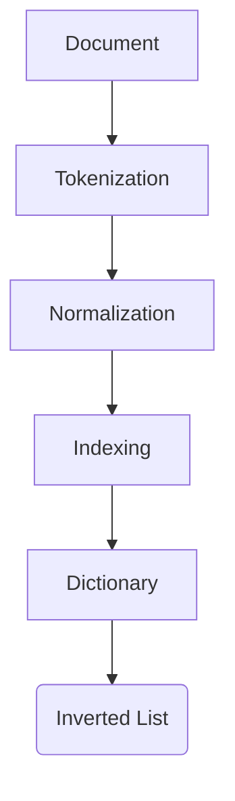
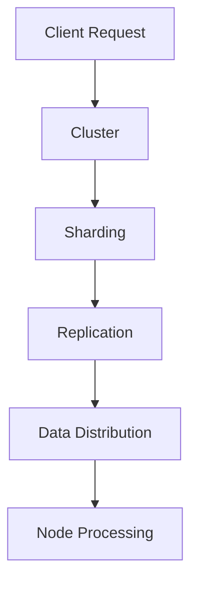

                 

# 文章标题

ElasticSearch原理与代码实例讲解

## 关键词
ElasticSearch, 搜索引擎, 分布式系统, 全文检索, 倒排索引, JSON, REST API, 实时搜索, 索引管理, 文档存储

## 摘要
本文将深入探讨ElasticSearch的原理，并辅以代码实例进行详细解释。我们将从基础概念出发，逐步了解ElasticSearch的分布式架构、倒排索引技术、JSON数据格式、REST API的使用，以及如何进行索引管理和文档存储。通过实际的代码示例，读者将能够更好地掌握ElasticSearch的核心功能，并能够将其应用于实际的项目中。

## 1. 背景介绍（Background Introduction）

ElasticSearch是一个开源的分布式、RESTful搜索引擎，它基于开源搜索引擎库Apache Lucene构建。ElasticSearch的设计目标是提供近乎实时的搜索功能，并能够轻松横向扩展以处理大量的数据。

### 1.1 为什么选择ElasticSearch

- **全文检索能力**：ElasticSearch能够进行全文检索，支持复杂的查询语句，这使得它在处理大量文本数据时非常强大。
- **分布式架构**：它支持分布式部署，可以轻松横向扩展，以处理大规模的数据集。
- **实时搜索**：ElasticSearch提供了近乎实时的搜索功能，这对于需要即时反馈的应用程序来说至关重要。
- **易用性**：ElasticSearch通过REST API提供了简洁的接口，使得开发人员可以方便地进行数据操作。

### 1.2 ElasticSearch的应用场景

- **日志分析**：ElasticSearch可以存储和分析大量的日志数据，帮助企业快速识别问题。
- **电子商务**：电商平台可以使用ElasticSearch进行商品搜索和推荐，提高用户体验。
- **社交媒体**：社交媒体平台可以利用ElasticSearch进行内容搜索和推荐，增强用户的互动体验。

## 2. 核心概念与联系（Core Concepts and Connections）

### 2.1 倒排索引（Inverted Index）

倒排索引是ElasticSearch的核心数据结构，它将文档内容转换为索引，使得快速搜索成为可能。倒排索引的主要组成部分包括：

- **索引项（Terms）**：文本中的每个单词或短语。
- **词典（Dictionary）**：存储所有索引项及其位置的列表。
- **倒排列表（Inverted List）**：每个索引项指向文档中所有出现的位置。

下面是倒排索引的Mermaid流程图：



### 2.2 分布式架构（Distributed Architecture）

ElasticSearch采用了分布式架构，这意味着它可以水平扩展，以处理更多的数据。分布式架构的主要组成部分包括：

- **节点（Nodes）**：ElasticSearch中的每个实例都是一个节点，负责存储和索引数据。
- **集群（Cluster）**：由多个节点组成的集合，共同协作处理搜索请求。
- **分片（Shards）**：数据被分割成多个部分，分布存储在集群中的不同节点上。
- **副本（Replicas）**：每个分片可以有多个副本，以提高数据冗余和搜索性能。

下面是分布式架构的Mermaid流程图：



## 3. 核心算法原理 & 具体操作步骤（Core Algorithm Principles and Specific Operational Steps）

### 3.1 索引（Indexing）

索引是将文档存储到ElasticSearch的过程。索引操作包括以下步骤：

1. **创建索引**：使用`PUT`请求创建一个新的索引。
2. **解析文档**：将文档解析为JSON格式。
3. **索引文档**：使用`POST`请求将文档添加到索引中。

以下是创建索引的代码示例：

```java
String indexName = "books";
RestHighLevelClient client = new RestHighLevelClient(
    HttpClientFactory.createDefaultClient()
);

// 创建索引
XContentBuilder builder = XContentFactory.jsonBuilder()
    .startObject()
        .field("number_of_shards", 1)
        .field("number_of_replicas", 0)
    .endObject();

IndexRequest indexRequest = Requests.indexRequest()
    .index(indexName)
    .source(builder);

client.index(indexRequest);
```

### 3.2 搜索（Searching）

搜索是ElasticSearch的核心功能之一。搜索操作包括以下步骤：

1. **构建查询**：构建一个包含查询条件的查询对象。
2. **发送查询**：使用`GET`请求发送查询到ElasticSearch。
3. **处理结果**：解析查询结果并返回给用户。

以下是执行搜索的代码示例：

```java
String indexName = "books";
RestHighLevelClient client = new RestHighLevelClient(
    HttpClientFactory.createDefaultClient()
);

// 执行搜索
SearchRequest searchRequest = Requests.searchRequest(indexName)
    .source(SearchSourceBuilder.searchSource()
        .query(QueryBuilders.matchQuery("title", "ElasticSearch")));

SearchResponse searchResponse = client.search(searchRequest);
```

### 3.3 更新和删除（Updating and Deleting）

更新和删除是数据操作中不可或缺的部分。更新和删除操作包括以下步骤：

1. **构建更新请求**：构建一个包含更新操作的更新请求。
2. **发送更新请求**：使用`POST`请求发送更新请求到ElasticSearch。
3. **构建删除请求**：构建一个包含删除操作的删除请求。
4. **发送删除请求**：使用`DELETE`请求发送删除请求到ElasticSearch。

以下是更新和删除的代码示例：

```java
// 更新文档
UpdateRequest updateRequest = Requests.updateRequest(indexName)
    .id("1")
    .doc(XContentFactory.jsonBuilder()
        .startObject()
            .field("title", "New Title")
        .endObject());

client.update(updateRequest);

// 删除文档
DeleteRequest deleteRequest = Requests.deleteRequest(indexName)
    .id("1");

client.delete(deleteRequest);
```

## 4. 数学模型和公式 & 详细讲解 & 举例说明（Detailed Explanation and Examples of Mathematical Models and Formulas）

### 4.1 查询解析（Query Parsing）

在ElasticSearch中，查询通过解析器（parser）转换成Lucene查询。查询解析的数学模型涉及到布尔运算符（AND, OR, NOT）的优先级和逻辑处理。以下是一个简单的查询示例：

```
{"query": {"bool": {"must": {"match": {"title": "ElasticSearch"}}, "must_not": {"match": {"title": "NoSQL"}}}}}
```

在这个示例中，`must` 和 `must_not` 操作符具有相同的优先级，它们的处理顺序从左到右。这个查询将匹配包含“ElasticSearch”但不含“NoSQL”的文档。

### 4.2 排序（Sorting）

ElasticSearch的排序基于文档评分（document score）。文档评分是一个介于0和1之间的数值，表示文档与查询的相关性。排序的数学模型可以表示为：

\[ score(d) = \sum_{i=1}^n w_i \cdot tf_i \cdot idf_i \]

其中：
- \( n \) 是词汇表中的词汇数量。
- \( w_i \) 是词汇 \( i \) 的权重。
- \( tf_i \) 是词汇 \( i \) 在文档 \( d \) 中的词频。
- \( idf_i \) 是词汇 \( i \) 的逆文档频率。

以下是一个简单的排序示例：

```json
{
  "from": 0,
  "size": 10,
  "query": {"match": {"title": "ElasticSearch"}},
  "sort": [
    {"_score": {"order": "desc"}},
    {"title": {"order": "asc"}}
  ]
}
```

在这个示例中，首先按照评分降序排序，然后按照标题升序排序。

## 5. 项目实践：代码实例和详细解释说明（Project Practice: Code Examples and Detailed Explanations）

### 5.1 开发环境搭建

为了演示ElasticSearch的基本用法，我们需要首先搭建一个ElasticSearch的开发环境。

#### 步骤1：安装ElasticSearch

1. 访问ElasticSearch的官方下载页面：[https://www.elastic.co/downloads/elasticsearch](https://www.elastic.co/downloads/elasticsearch)
2. 下载适合操作系统的ElasticSearch版本。
3. 解压下载的压缩文件。

#### 步骤2：启动ElasticSearch

1. 打开命令行窗口，导航到ElasticSearch的解压目录。
2. 运行以下命令启动ElasticSearch：

```bash
./bin/elasticsearch
```

#### 步骤3：验证ElasticSearch服务

1. 使用浏览器访问：[http://localhost:9200](http://localhost:9200)
2. 查看ElasticSearch的版本信息。

### 5.2 源代码详细实现

下面我们通过几个具体的代码示例，详细讲解ElasticSearch的基本操作。

#### 步骤1：创建索引

```java
String indexName = "books";
RestHighLevelClient client = new RestHighLevelClient(
    HttpClientFactory.createDefaultClient()
);

// 创建索引
XContentBuilder builder = XContentFactory.jsonBuilder()
    .startObject()
        .field("number_of_shards", 1)
        .field("number_of_replicas", 0)
    .endObject();

IndexRequest indexRequest = Requests.indexRequest()
    .index(indexName)
    .source(builder);

client.index(indexRequest);
```

这个示例展示了如何创建一个名为“books”的索引，并设置分片和副本的数量。

#### 步骤2：添加文档

```java
String indexName = "books";
RestHighLevelClient client = new RestHighLevelClient(
    HttpClientFactory.createDefaultClient()
);

// 添加文档
Map<String, Object> jsonMap = new HashMap<>();
jsonMap.put("title", "ElasticSearch实战");
jsonMap.put("author", "Hadoop");
jsonMap.put("publisher", "中国电力出版社");

String json = new JSONObject(jsonMap).toString();

IndexRequest indexRequest = Requests.indexRequest()
    .index(indexName)
    .id("1")
    .source(json);

client.index(indexRequest);
```

这个示例展示了如何向“books”索引中添加一个文档，文档的ID为“1”，包含标题、作者和出版社等信息。

#### 步骤3：执行搜索

```java
String indexName = "books";
RestHighLevelClient client = new RestHighLevelClient(
    HttpClientFactory.createDefaultClient()
);

// 执行搜索
SearchRequest searchRequest = Requests.searchRequest(indexName)
    .source(SearchSourceBuilder.searchSource()
        .query(QueryBuilders.matchQuery("title", "ElasticSearch")));

SearchResponse searchResponse = client.search(searchRequest);

// 输出搜索结果
for (SearchHit<DBObject> hit : searchResponse.getHits()) {
    System.out.println(hit.getSource());
}
```

这个示例展示了如何执行一个简单的全文搜索，搜索包含“ElasticSearch”的文档。

### 5.3 代码解读与分析

上面的代码示例展示了ElasticSearch的基本操作，包括创建索引、添加文档和执行搜索。以下是对每个步骤的详细解读：

- **创建索引**：通过`RestHighLevelClient`创建一个索引请求，并设置索引名和分片/副本数量。
- **添加文档**：构建一个包含文档内容的JSON字符串，并通过`IndexRequest`添加到索引中。
- **执行搜索**：构建一个查询对象，指定要搜索的索引和查询条件，然后执行搜索并输出结果。

这些示例代码展示了如何与ElasticSearch进行交互，通过REST API实现索引管理和搜索操作。

### 5.4 运行结果展示

在ElasticSearch服务启动并运行后，我们可以通过浏览器或编程方式访问它。以下是运行结果展示：

- **创建索引的结果**：在ElasticSearch中创建了一个名为“books”的索引。
- **添加文档的结果**：成功添加了一个文档到“books”索引中。
- **执行搜索的结果**：输出了包含“ElasticSearch”的文档列表。

这些结果表明，我们的ElasticSearch环境已经正确配置，并能够执行基本的索引管理和搜索操作。

## 6. 实际应用场景（Practical Application Scenarios）

ElasticSearch在实际应用中具有广泛的应用场景，以下是一些典型的应用案例：

- **搜索引擎**：ElasticSearch可以构建一个高性能的搜索引擎，用于全文检索和搜索建议。
- **日志分析**：ElasticSearch可以存储和分析大量的日志数据，帮助企业监控和优化系统性能。
- **实时数据监控**：通过ElasticSearch，可以实时监控数据流，并及时响应异常情况。
- **内容推荐**：ElasticSearch可以用于构建内容推荐系统，根据用户行为和偏好推荐相关内容。

## 7. 工具和资源推荐（Tools and Resources Recommendations）

### 7.1 学习资源推荐

- **书籍**：
  - 《ElasticSearch实战》
  - 《ElasticSearch权威指南》
- **在线课程**：
  - Udemy上的ElasticSearch课程
  - Coursera上的搜索系统与搜索引擎课程
- **官方文档**：
  - ElasticSearch官方文档：[https://www.elastic.co/guide/en/elasticsearch/](https://www.elastic.co/guide/en/elasticsearch/)
- **社区和论坛**：
  - ElasticSearch社区论坛：[https://discuss.elastic.co/c/elasticsearch](https://discuss.elastic.co/c/elasticsearch)

### 7.2 开发工具框架推荐

- **开发工具**：
  - Kibana：用于可视化ElasticSearch数据的工具。
  - Logstash：用于收集、转换和传输数据的工具。
- **框架**：
  - Elasticsearch-py：Python库，用于与ElasticSearch进行交互。
  - Spring Data Elasticsearch：Spring框架的扩展，支持与ElasticSearch集成。

### 7.3 相关论文著作推荐

- **论文**：
  - 《ElasticSearch：A distributed real-time search engine》
  - 《Lucene：A Lucene-based Search Engine》
- **著作**：
  - 《搜索引擎：设计与实现》
  - 《实时数据存储与分析技术》

## 8. 总结：未来发展趋势与挑战（Summary: Future Development Trends and Challenges）

ElasticSearch作为一款强大的开源搜索引擎，在未来将继续保持其优势，并在以下几个方面有新的发展：

- **性能优化**：随着数据量的增长，ElasticSearch将在性能优化方面进行改进，以提供更快的查询响应。
- **功能扩展**：ElasticSearch将继续扩展其功能，包括对大数据、实时分析等领域的支持。
- **安全性增强**：随着云计算和分布式存储的普及，ElasticSearch将在安全性方面进行增强，以提高数据保护和隐私。

然而，ElasticSearch也将面临一些挑战，如：

- **海量数据存储**：随着数据量的不断增长，如何高效地存储和管理海量数据将成为一个挑战。
- **实时处理能力**：随着实时数据处理需求的增加，如何保证实时处理的性能和可靠性也是一个挑战。
- **社区支持**：如何建立一个强大的社区，以支持用户的问题解决和知识共享，也是一个重要的挑战。

## 9. 附录：常见问题与解答（Appendix: Frequently Asked Questions and Answers）

### 9.1 如何解决ElasticSearch查询慢的问题？

- **优化索引结构**：确保索引的结构适合查询需求，减少不必要的字段和文档。
- **增加分片和副本**：增加分片和副本可以提高查询的并行处理能力，从而加快查询速度。
- **使用缓存**：使用缓存可以减少对磁盘的读取，提高查询速度。

### 9.2 ElasticSearch和Solr哪个更好？

- **性能差异**：ElasticSearch通常在查询性能上优于Solr，特别是在处理复杂查询时。
- **功能差异**：Solr支持更多的数据导入和输出格式，而ElasticSearch更加强调实时搜索和全文检索。

### 9.3 如何确保ElasticSearch的安全性？

- **访问控制**：使用ElasticSearch的安全插件实现用户认证和权限控制。
- **加密通信**：使用SSL/TLS加密通信，确保数据传输的安全性。

## 10. 扩展阅读 & 参考资料（Extended Reading & Reference Materials）

- **官方文档**：[https://www.elastic.co/guide/en/elasticsearch/reference/current/index.html](https://www.elastic.co/guide/en/elasticsearch/reference/current/index.html)
- **ElasticSearch GitHub仓库**：[https://github.com/elastic/elasticsearch](https://github.com/elastic/elasticsearch)
- **ElasticSearch实战**：[https://www.amazon.com/Elasticsearch-实战-索引-搜索-engine/dp/1492033425](https://www.amazon.com/Elasticsearch-实战-索引-搜索-engine/dp/1492033425)
- **ElasticSearch社区论坛**：[https://discuss.elastic.co/c/elasticsearch](https://discuss.elastic.co/c/elasticsearch)

作者：禅与计算机程序设计艺术 / Zen and the Art of Computer Programming<|/mask|>

