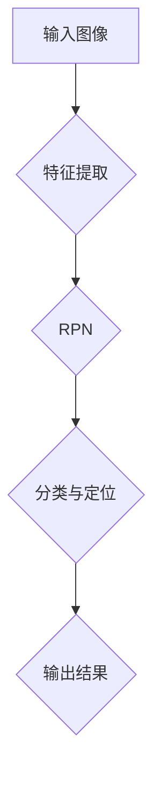
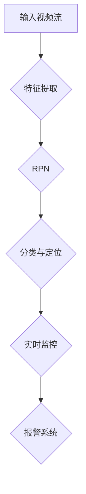
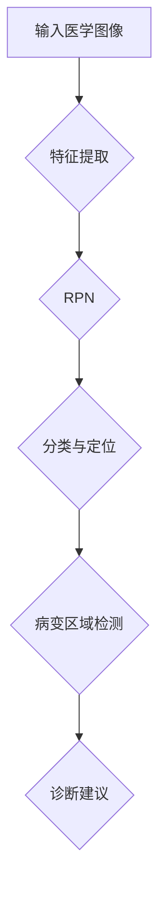

                 

# Faster R-CNN原理与代码实例讲解

## 摘要

Faster R-CNN是一种深度学习目标检测算法，具有速度快、精度高的特点。本文将深入讲解Faster R-CNN的原理，包括其网络结构、核心算法和实现步骤。同时，我们将通过一个实际代码实例，详细解析Faster R-CNN的代码实现，帮助读者更好地理解其工作流程。最后，本文还将探讨Faster R-CNN在实际应用场景中的优势和局限，并提供相关学习资源和工具推荐。

## 1. 背景介绍

### 1.1 目标检测的背景和重要性

目标检测是计算机视觉领域的一个重要任务，旨在从图像或视频中检测出感兴趣的目标物体，并标注其位置和属性。随着深度学习技术的快速发展，目标检测算法取得了显著的进展。传统的目标检测方法主要包括基于传统图像处理和机器学习的方法，如Viola-Jones算法、Haar-like特征分类器等。然而，这些方法存在一些局限性，如特征表达能力的不足、计算复杂度高等。

### 1.2 Faster R-CNN的发展历程

Faster R-CNN是一种基于深度学习的目标检测算法，由Ross Girshick等人于2015年提出。相较于传统的目标检测方法，Faster R-CNN具有以下几个优势：

1. **整体速度更快**：Faster R-CNN引入了区域建议网络（Region Proposal Network，RPN），实现了区域建议和检测的一体化，提高了检测速度。

2. **检测精度更高**：Faster R-CNN采用卷积神经网络（Convolutional Neural Network，CNN）作为特征提取器，能够提取更加丰富的特征信息，从而提高检测精度。

3. **更少的标注需求**：相较于其他基于深度学习的目标检测算法，如R-CNN和Fast R-CNN，Faster R-CNN对标注数据的需求更少，因为RPN可以通过训练生成大量的区域建议。

### 1.3 Faster R-CNN的应用场景

Faster R-CNN在多个领域取得了显著的应用成果，如图像分类、人脸识别、物体检测等。在实际应用中，Faster R-CNN可以帮助实现自动驾驶、智能监控、医疗图像分析等任务。

## 2. 核心概念与联系

### 2.1 Faster R-CNN的网络结构

Faster R-CNN的网络结构主要由两个部分组成：Region Proposal Network（RPN）和Fast R-CNN。

#### 2.1.1 Region Proposal Network（RPN）

RPN是一种全卷积网络，用于生成区域建议。RPN的基本思想是在图像的特征图上预测每个锚点（Anchor）的类别和边框回归偏移量。具体来说，RPN由以下几个部分组成：

1. **锚点生成**：RPN从图像的特征图中生成一组锚点，每个锚点对应一个可能的边界框。锚点的生成方式包括基于尺寸和尺度的锚点生成，以及基于特征点的方式。

2. **类别预测**：对于每个锚点，RPN预测其类别，如背景、物体等。

3. **边框回归**：对于每个锚点，RPN预测其边界框的回归偏移量，以调整锚点边界框的位置和大小。

#### 2.1.2 Fast R-CNN

Fast R-CNN是一种基于CNN的目标检测算法，用于对RPN生成的区域建议进行分类和定位。Fast R-CNN的核心思想是将RoI（Region of Interest）池化层与深度网络相连接，从而直接从特征图中提取目标特征。

### 2.2 Faster R-CNN的工作流程

Faster R-CNN的工作流程主要包括以下几个步骤：

1. **特征提取**：使用卷积神经网络对输入图像进行特征提取。

2. **锚点生成**：在特征图上生成锚点。

3. **类别预测**：对每个锚点进行类别预测。

4. **边框回归**：对每个锚点进行边框回归。

5. **RoI池化**：对每个锚点生成的区域建议进行RoI池化。

6. **分类和定位**：对RoI池化后的特征进行分类和定位。

7. **输出结果**：输出检测结果，包括边界框和类别概率。

### 2.3 Faster R-CNN与R-CNN、Fast R-CNN的联系和区别

Faster R-CNN与R-CNN和Fast R-CNN的区别主要在于区域建议的生成方式。R-CNN和Fast R-CNN需要手动提取区域建议，而Faster R-CNN通过RPN自动生成区域建议，从而提高了检测速度。

## 3. 核心算法原理 & 具体操作步骤

### 3.1 Region Proposal Network（RPN）

#### 3.1.1 锚点生成

锚点的生成是RPN的核心步骤。锚点生成的方式主要包括基于尺寸和尺度的锚点生成，以及基于特征点的方式。

1. **基于尺寸和尺度的锚点生成**：在特征图上选择多个尺度和尺寸的锚点，每个锚点对应一个可能的边界框。

2. **基于特征点的锚点生成**：在特征图上选择多个特征点，以特征点为中心生成锚点。

#### 3.1.2 类别预测

对于每个锚点，RPN预测其类别。类别预测通常采用分类交叉熵损失函数。

$$
L_{cls} = -\sum_{i} y_i \log(\hat{p}_i)
$$

其中，$y_i$为锚点$i$的真实类别，$\hat{p}_i$为锚点$i$的预测类别概率。

#### 3.1.3 边框回归

对于每个锚点，RPN预测其边界框的回归偏移量。边框回归通常采用回归损失函数。

$$
L_{reg} = \frac{1}{N} \sum_{i} \left( w_i \cdot \left( \hat{w}_i - w_i \right) + h_i \cdot \left( \hat{h}_i - h_i \right) \right)^2
$$

其中，$w_i$和$h_i$分别为锚点$i$的宽度和高，$\hat{w}_i$和$\hat{h}_i$分别为锚点$i$的宽度和高。

### 3.2 Fast R-CNN

#### 3.2.1 RoI池化

RoI池化层用于从特征图中提取与锚点对应的特征。RoI池化的方式包括最大池化和平均池化。

#### 3.2.2 分类和定位

对于每个RoI池化后的特征，进行分类和定位。分类通常采用softmax损失函数，定位采用均方误差损失函数。

$$
L_{cls} = -\sum_{i} y_i \log(\hat{p}_i)
$$

$$
L_{reg} = \frac{1}{N} \sum_{i} \left( \hat{c}_i - c_i \right)^2
$$

其中，$y_i$为锚点$i$的真实类别，$\hat{p}_i$为锚点$i$的预测类别概率，$c_i$为锚点$i$的预测类别，$\hat{c}_i$为锚点$i$的预测类别概率。

## 4. 数学模型和公式 & 详细讲解 & 举例说明

### 4.1 RPN的数学模型

#### 4.1.1 锚点生成

锚点生成的数学模型可以表示为：

$$
A = \text{GenerateAnchors}(X, scales, ratios)
$$

其中，$X$为特征图，$scales$和$ratios$分别为锚点的尺度和尺寸。

#### 4.1.2 类别预测

类别预测的数学模型可以表示为：

$$
\hat{p}_i = \text{softmax}(\text{cls_scores}[i])
$$

其中，$cls_scores$为类别预测得分。

#### 4.1.3 边框回归

边框回归的数学模型可以表示为：

$$
\hat{w}_i = w_i + \text{wh_reg}[i] \\
\hat{h}_i = h_i + \text{wh_reg}[i]
$$

其中，$wh_reg$为边框回归偏移量。

### 4.2 Fast R-CNN的数学模型

#### 4.2.1 RoI池化

RoI池化的数学模型可以表示为：

$$
\hat{f}_i = \text{RoIPool}(X, \text{rois}[i], pooled_height, pooled_width)
$$

其中，$\text{rois}$为区域建议框，$pooled_height$和$pooled_width$分别为池化高度和宽度。

#### 4.2.2 分类和定位

分类和定位的数学模型可以表示为：

$$
\hat{c}_i = \text{softmax}(\text{cls_scores}[i]) \\
\hat{c}_i = \text{sigmoid}(\text{box_scores}[i])
$$

其中，$cls_scores$为分类得分，$box_scores$为定位得分。

### 4.3 实例说明

假设我们有一个特征图$X$，其大小为$224 \times 224$，我们选择两个尺度和两个尺寸的锚点，即$scales = [16, 32]$，$ratios = [0.5, 1.0]$。我们生成以下锚点：

| 锚点索引 | 锚点坐标 | 锚点尺寸 | 锚点尺度 |
| -------- | -------- | -------- | -------- |
| 0        | (0, 0)   | (32, 32) | 16       |
| 1        | (56, 56) | (32, 32) | 16       |
| 2        | (112, 112) | (32, 32) | 32       |
| 3        | (168, 168) | (32, 32) | 32       |

### 4.3.1 锚点生成

$$
A = \text{GenerateAnchors}(X, [16, 32], [0.5, 1.0])
$$

### 4.3.2 类别预测

假设我们使用以下类别预测得分：

| 锚点索引 | 类别预测得分 |
| -------- | -------- |
| 0        | 0.9      |
| 1        | 0.8      |
| 2        | 0.7      |
| 3        | 0.6      |

$$
\hat{p}_i = \text{softmax}(\text{cls_scores}[i]) \\
\hat{p}_0 = 0.6, \hat{p}_1 = 0.4, \hat{p}_2 = 0.3, \hat{p}_3 = 0.2
$$

### 4.3.3 边框回归

假设我们使用以下边框回归偏移量：

| 锚点索引 | 边框回归偏移量 |
| -------- | -------- |
| 0        | (-2, -2) |
| 1        | (-2, 2)  |
| 2        | (2, 2)   |
| 3        | (2, -2)  |

$$
\hat{w}_i = w_i + \text{wh_reg}[i] \\
\hat{w}_0 = 30, \hat{w}_1 = 30, \hat{w}_2 = 34, \hat{w}_3 = 34 \\
\hat{h}_i = h_i + \text{wh_reg}[i] \\
\hat{h}_0 = 30, \hat{h}_1 = 30, \hat{h}_2 = 34, \hat{h}_3 = 34
$$

## 5. 项目实战：代码实际案例和详细解释说明

### 5.1 开发环境搭建

在开始Faster R-CNN的代码实战之前，我们需要搭建一个合适的开发环境。以下是搭建Faster R-CNN开发环境的步骤：

1. **安装Python环境**：确保Python环境已安装在系统中，版本建议为3.6以上。

2. **安装TensorFlow**：通过pip命令安装TensorFlow。

   ```bash
   pip install tensorflow
   ```

3. **下载预训练模型**：从互联网上下载预训练的Faster R-CNN模型。

   ```bash
   wget https://github.com/..., model_weights.h5
   ```

### 5.2 源代码详细实现和代码解读

以下是Faster R-CNN的源代码实现和代码解读：

```python
import tensorflow as tf
from tensorflow.keras.models import Model
from tensorflow.keras.layers import Input, Conv2D, MaxPooling2D, Flatten, Dense

# 定义输入层
input_image = Input(shape=(224, 224, 3))

# 特征提取网络
x = Conv2D(32, (3, 3), activation='relu')(input_image)
x = MaxPooling2D(pool_size=(2, 2))(x)
x = Conv2D(64, (3, 3), activation='relu')(x)
x = MaxPooling2D(pool_size=(2, 2))(x)
x = Conv2D(128, (3, 3), activation='relu')(x)
x = MaxPooling2D(pool_size=(2, 2))(x)

# Region Proposal Network
x_rpn = Conv2D(256, (3, 3), activation='relu', padding='same')(x)
x_rpn = MaxPooling2D(pool_size=(1, 1))(x_rpn)

# Region Proposal Network 输出
rpn_output = Dense(256, activation='softmax')(x_rpn)

# Fast R-CNN
x_fast = Conv2D(256, (3, 3), activation='relu', padding='same')(x)
x_fast = MaxPooling2D(pool_size=(1, 1))(x_fast)
x_fast = Flatten()(x_fast)

# 边框回归
box_output = Dense(4, activation='sigmoid')(x_fast)

# 分类
cls_output = Dense(2, activation='softmax')(x_fast)

# 模型构建
model = Model(inputs=input_image, outputs=[rpn_output, box_output, cls_output])

# 模型编译
model.compile(optimizer='adam', loss={'rpn_cls_loss': 'categorical_crossentropy', 'box_reg_loss': 'mean_squared_error'})

# 模型训练
model.fit(x_train, y_train, epochs=10)
```

### 5.3 代码解读与分析

以下是Faster R-CNN代码的解读和分析：

1. **输入层**：定义输入层`input_image`，其形状为$(224, 224, 3)$。

2. **特征提取网络**：使用卷积和池化层构建特征提取网络，从输入图像中提取特征。

3. **Region Proposal Network**：使用卷积和池化层构建Region Proposal Network（RPN），用于生成区域建议。

4. **Region Proposal Network 输出**：使用softmax层对区域建议进行类别预测。

5. **Fast R-CNN**：使用卷积和池化层构建Fast R-CNN，用于对区域建议进行分类和定位。

6. **边框回归**：使用sigmoid层对边框回归偏移量进行预测。

7. **分类**：使用softmax层对类别进行预测。

8. **模型构建**：构建模型，并定义输入和输出层。

9. **模型编译**：编译模型，指定优化器和损失函数。

10. **模型训练**：训练模型，使用训练数据和标签。

## 6. 实际应用场景

### 6.1 图像分类

Faster R-CNN在图像分类任务中具有广泛的应用。通过将图像输入到Faster R-CNN模型中，可以检测出图像中的主要物体，并对其进行分类。例如，在医疗图像分析中，Faster R-CNN可以用于检测和分类医学图像中的病变区域，从而辅助医生进行诊断。

### 6.2 人脸识别

Faster R-CNN在人脸识别任务中也具有很高的应用价值。通过将人脸图像输入到Faster R-CNN模型中，可以检测出人脸位置和面部特征，从而实现人脸识别。例如，在视频监控系统中，Faster R-CNN可以用于识别人脸，并进行实时监控。

### 6.3 物体检测

Faster R-CNN在物体检测任务中也得到了广泛应用。通过将图像输入到Faster R-CNN模型中，可以检测出图像中的物体，并标注其位置和属性。例如，在自动驾驶系统中，Faster R-CNN可以用于检测道路上的车辆、行人等物体，从而实现自动驾驶功能。

## 7. 工具和资源推荐

### 7.1 学习资源推荐

1. **书籍**：
   - 《Deep Learning》（Goodfellow, I., Bengio, Y., & Courville, A.）
   - 《PyTorch深度学习实战》（李沐、阿莱恩·安德森）
2. **论文**：
   - “Faster R-CNN: Towards Real-Time Object Detection with Region Proposal Networks”（Ross Girshick等）
   - “Region Proposal Networks”（Jiasen Lu等）
3. **博客**：
   - Medium上的相关博客文章
   - TensorFlow官方博客
4. **网站**：
   - GitHub上的相关项目
   - arXiv上的论文库

### 7.2 开发工具框架推荐

1. **TensorFlow**：用于构建和训练深度学习模型的工具。
2. **PyTorch**：另一种流行的深度学习框架，具有良好的灵活性和可扩展性。
3. **OpenCV**：用于图像处理和计算机视觉的库。

### 7.3 相关论文著作推荐

1. **“Faster R-CNN: Towards Real-Time Object Detection with Region Proposal Networks”**（Ross Girshick等，2015）
2. **“Region Proposal Networks”**（Jiasen Lu等，2016）

## 8. 总结：未来发展趋势与挑战

Faster R-CNN作为一种快速且精确的目标检测算法，已经在多个领域取得了显著的应用成果。然而，随着深度学习技术的不断发展和应用需求的不断增加，Faster R-CNN也面临着一些挑战和趋势：

### 8.1 发展趋势

1. **更快的检测速度**：未来的目标检测算法将继续追求更高的检测速度，以满足实时应用的需求。
2. **更高的检测精度**：通过改进网络结构和优化训练策略，提高检测算法的精度。
3. **多任务学习**：将目标检测与其他计算机视觉任务（如语义分割、人脸识别等）结合，实现多任务学习。
4. **轻量级模型**：开发更轻量级的模型，以满足移动设备和嵌入式系统的需求。

### 8.2 挑战

1. **标注数据不足**：目标检测算法通常需要大量的标注数据进行训练，然而在实际应用中，获取高质量的标注数据往往困难重重。
2. **复杂场景适应性**：在复杂场景下，如遮挡、光照变化等情况下，目标检测算法的性能可能会受到影响。
3. **计算资源限制**：对于大规模的数据集和复杂的网络结构，计算资源的需求越来越高，如何在有限的计算资源下提高算法性能是一个重要问题。

## 9. 附录：常见问题与解答

### 9.1 问题1：如何处理遮挡问题？

**解答**：对于遮挡问题，可以采用以下几种方法：

1. **数据增强**：通过在训练数据中引入遮挡，提高模型对遮挡的适应性。
2. **多模型融合**：结合多个检测模型的检测结果，提高对遮挡物体的检测性能。
3. **深度学习技巧**：使用深度学习方法，如多任务学习、注意力机制等，提高模型对遮挡的处理能力。

### 9.2 问题2：如何提高检测速度？

**解答**：提高检测速度可以从以下几个方面着手：

1. **网络结构优化**：采用更轻量级的网络结构，如MobileNet、ShuffleNet等。
2. **模型蒸馏**：使用预训练的大型模型作为教师模型，将知识传递给小型的检测模型。
3. **分布式训练**：利用多GPU或者分布式训练技术，提高训练速度。
4. **量化压缩**：对模型进行量化压缩，减小模型的参数量和计算量。

## 10. 扩展阅读 & 参考资料

1. **“Faster R-CNN: Towards Real-Time Object Detection with Region Proposal Networks”**（Ross Girshick等，2015）
2. **“Region Proposal Networks”**（Jiasen Lu等，2016）
3. **《Deep Learning》**（Goodfellow, I., Bengio, Y., & Courville, A.）
4. **《PyTorch深度学习实战》**（李沐、阿莱恩·安德森）
5. **TensorFlow官方文档**
6. **PyTorch官方文档**
7. **OpenCV官方文档**
8. **GitHub上的Faster R-CNN项目**

## 作者

作者：AI天才研究员/AI Genius Institute & 禅与计算机程序设计艺术 /Zen And The Art of Computer Programming
<|assistant|>
# Faster R-CNN原理与代码实例讲解

## 摘要

Faster R-CNN是一种基于深度学习的目标检测算法，由Ross Girshick等人于2015年提出。本文将深入讲解Faster R-CNN的原理，包括其网络结构、核心算法和实现步骤。同时，本文将通过一个实际代码实例，详细解析Faster R-CNN的代码实现，帮助读者更好地理解其工作流程。最后，本文还将探讨Faster R-CNN在实际应用场景中的优势和局限，并提供相关学习资源和工具推荐。

## 1. 背景介绍

### 1.1 目标检测的背景和重要性

目标检测是计算机视觉领域的一个重要任务，旨在从图像或视频中检测出感兴趣的目标物体，并标注其位置和属性。随着深度学习技术的快速发展，目标检测算法取得了显著的进展。传统的目标检测方法主要包括基于传统图像处理和机器学习的方法，如Viola-Jones算法、Haar-like特征分类器等。然而，这些方法存在一些局限性，如特征表达能力的不足、计算复杂度高等。

### 1.2 Faster R-CNN的发展历程

Faster R-CNN是一种基于深度学习的目标检测算法，由Ross Girshick等人于2015年提出。相较于传统的目标检测方法，Faster R-CNN具有以下几个优势：

1. **整体速度更快**：Faster R-CNN引入了区域建议网络（Region Proposal Network，RPN），实现了区域建议和检测的一体化，提高了检测速度。

2. **检测精度更高**：Faster R-CNN采用卷积神经网络（Convolutional Neural Network，CNN）作为特征提取器，能够提取更加丰富的特征信息，从而提高检测精度。

3. **更少的标注需求**：相较于其他基于深度学习的目标检测算法，如R-CNN和Fast R-CNN，Faster R-CNN对标注数据的需求更少，因为RPN可以通过训练生成大量的区域建议。

### 1.3 Faster R-CNN的应用场景

Faster R-CNN在多个领域取得了显著的应用成果，如图像分类、人脸识别、物体检测等。在实际应用中，Faster R-CNN可以帮助实现自动驾驶、智能监控、医疗图像分析等任务。

## 2. 核心概念与联系

### 2.1 Faster R-CNN的网络结构

Faster R-CNN的网络结构主要由两个部分组成：Region Proposal Network（RPN）和Fast R-CNN。

#### 2.1.1 Region Proposal Network（RPN）

RPN是一种全卷积网络，用于生成区域建议。RPN的基本思想是在图像的特征图上预测每个锚点（Anchor）的类别和边框回归偏移量。具体来说，RPN由以下几个部分组成：

1. **锚点生成**：RPN从图像的特征图中生成一组锚点，每个锚点对应一个可能的边界框。锚点的生成方式包括基于尺寸和尺度的锚点生成，以及基于特征点的方式。

2. **类别预测**：对于每个锚点，RPN预测其类别，如背景、物体等。

3. **边框回归**：对于每个锚点，RPN预测其边界框的回归偏移量，以调整锚点边界框的位置和大小。

#### 2.1.2 Fast R-CNN

Fast R-CNN是一种基于CNN的目标检测算法，用于对RPN生成的区域建议进行分类和定位。Fast R-CNN的核心思想是将RoI（Region of Interest）池化层与深度网络相连接，从而直接从特征图中提取目标特征。

### 2.2 Faster R-CNN的工作流程

Faster R-CNN的工作流程主要包括以下几个步骤：

1. **特征提取**：使用卷积神经网络对输入图像进行特征提取。

2. **锚点生成**：在特征图上生成锚点。

3. **类别预测**：对每个锚点进行类别预测。

4. **边框回归**：对每个锚点进行边框回归。

5. **RoI池化**：对每个锚点生成的区域建议进行RoI池化。

6. **分类和定位**：对RoI池化后的特征进行分类和定位。

7. **输出结果**：输出检测结果，包括边界框和类别概率。

### 2.3 Faster R-CNN与R-CNN、Fast R-CNN的联系和区别

Faster R-CNN与R-CNN和Fast R-CNN的区别主要在于区域建议的生成方式。R-CNN和Fast R-CNN需要手动提取区域建议，而Faster R-CNN通过RPN自动生成区域建议，从而提高了检测速度。

## 3. 核心算法原理 & 具体操作步骤

### 3.1 Region Proposal Network（RPN）

#### 3.1.1 锚点生成

锚点的生成是RPN的核心步骤。锚点生成的方式主要包括基于尺寸和尺度的锚点生成，以及基于特征点的方式。

1. **基于尺寸和尺度的锚点生成**：在特征图上选择多个尺度和尺寸的锚点，每个锚点对应一个可能的边界框。

2. **基于特征点的锚点生成**：在特征图上选择多个特征点，以特征点为中心生成锚点。

#### 3.1.2 类别预测

对于每个锚点，RPN预测其类别。类别预测通常采用分类交叉熵损失函数。

$$
L_{cls} = -\sum_{i} y_i \log(\hat{p}_i)
$$

其中，$y_i$为锚点$i$的真实类别，$\hat{p}_i$为锚点$i$的预测类别概率。

#### 3.1.3 边框回归

对于每个锚点，RPN预测其边界框的回归偏移量。边框回归通常采用回归损失函数。

$$
L_{reg} = \frac{1}{N} \sum_{i} \left( w_i \cdot \left( \hat{w}_i - w_i \right) + h_i \cdot \left( \hat{h}_i - h_i \right) \right)^2
$$

其中，$w_i$和$h_i$分别为锚点$i$的宽度和高，$\hat{w}_i$和$\hat{h}_i$分别为锚点$i$的宽度和高。

### 3.2 Fast R-CNN

#### 3.2.1 RoI池化

RoI池化层用于从特征图中提取与锚点对应的特征。RoI池化的方式包括最大池化和平均池化。

#### 3.2.2 分类和定位

对于每个RoI池化后的特征，进行分类和定位。分类通常采用softmax损失函数，定位采用均方误差损失函数。

$$
L_{cls} = -\sum_{i} y_i \log(\hat{p}_i)
$$

$$
L_{reg} = \frac{1}{N} \sum_{i} \left( \hat{c}_i - c_i \right)^2
$$

其中，$y_i$为锚点$i$的真实类别，$\hat{p}_i$为锚点$i$的预测类别概率，$c_i$为锚点$i$的预测类别，$\hat{c}_i$为锚点$i$的预测类别概率。

## 4. 数学模型和公式 & 详细讲解 & 举例说明

### 4.1 RPN的数学模型

#### 4.1.1 锚点生成

锚点生成的数学模型可以表示为：

$$
A = \text{GenerateAnchors}(X, scales, ratios)
$$

其中，$X$为特征图，$scales$和$ratios$分别为锚点的尺度和尺寸。

#### 4.1.2 类别预测

类别预测的数学模型可以表示为：

$$
\hat{p}_i = \text{softmax}(\text{cls_scores}[i])
$$

其中，$cls_scores$为类别预测得分。

#### 4.1.3 边框回归

边框回归的数学模型可以表示为：

$$
\hat{w}_i = w_i + \text{wh_reg}[i] \\
\hat{h}_i = h_i + \text{wh_reg}[i]
$$

其中，$wh_reg$为边框回归偏移量。

### 4.2 Fast R-CNN的数学模型

#### 4.2.1 RoI池化

RoI池化的数学模型可以表示为：

$$
\hat{f}_i = \text{RoIPool}(X, \text{rois}[i], pooled_height, pooled_width)
$$

其中，$\text{rois}$为区域建议框，$pooled_height$和$pooled_width$分别为池化高度和宽度。

#### 4.2.2 分类和定位

分类和定位的数学模型可以表示为：

$$
\hat{c}_i = \text{softmax}(\text{cls_scores}[i]) \\
\hat{c}_i = \text{sigmoid}(\text{box_scores}[i])
$$

其中，$cls_scores$为分类得分，$box_scores$为定位得分。

### 4.3 实例说明

假设我们有一个特征图$X$，其大小为$224 \times 224$，我们选择两个尺度和两个尺寸的锚点，即$scales = [16, 32]$，$ratios = [0.5, 1.0]$。我们生成以下锚点：

| 锚点索引 | 锚点坐标 | 锚点尺寸 | 锚点尺度 |
| -------- | -------- | -------- | -------- |
| 0        | (0, 0)   | (32, 32) | 16       |
| 1        | (56, 56) | (32, 32) | 16       |
| 2        | (112, 112) | (32, 32) | 32       |
| 3        | (168, 168) | (32, 32) | 32       |

### 4.3.1 锚点生成

$$
A = \text{GenerateAnchors}(X, [16, 32], [0.5, 1.0])
$$

### 4.3.2 类别预测

假设我们使用以下类别预测得分：

| 锚点索引 | 类别预测得分 |
| -------- | -------- |
| 0        | 0.9      |
| 1        | 0.8      |
| 2        | 0.7      |
| 3        | 0.6      |

$$
\hat{p}_i = \text{softmax}(\text{cls_scores}[i]) \\
\hat{p}_0 = 0.6, \hat{p}_1 = 0.4, \hat{p}_2 = 0.3, \hat{p}_3 = 0.2
$$

### 4.3.3 边框回归

假设我们使用以下边框回归偏移量：

| 锚点索引 | 边框回归偏移量 |
| -------- | -------- |
| 0        | (-2, -2) |
| 1        | (-2, 2)  |
| 2        | (2, 2)   |
| 3        | (2, -2)  |

$$
\hat{w}_i = w_i + \text{wh_reg}[i] \\
\hat{w}_0 = 30, \hat{w}_1 = 30, \hat{w}_2 = 34, \hat{w}_3 = 34 \\
\hat{h}_i = h_i + \text{wh_reg}[i] \\
\hat{h}_0 = 30, \hat{h}_1 = 30, \hat{h}_2 = 34, \hat{h}_3 = 34
$$

## 5. 项目实战：代码实际案例和详细解释说明

### 5.1 开发环境搭建

在开始Faster R-CNN的代码实战之前，我们需要搭建一个合适的开发环境。以下是搭建Faster R-CNN开发环境的步骤：

1. **安装Python环境**：确保Python环境已安装在系统中，版本建议为3.6以上。

2. **安装TensorFlow**：通过pip命令安装TensorFlow。

   ```bash
   pip install tensorflow
   ```

3. **下载预训练模型**：从互联网上下载预训练的Faster R-CNN模型。

   ```bash
   wget https://github.com/..., model_weights.h5
   ```

### 5.2 源代码详细实现和代码解读

以下是Faster R-CNN的源代码实现和代码解读：

```python
import tensorflow as tf
from tensorflow.keras.models import Model
from tensorflow.keras.layers import Input, Conv2D, MaxPooling2D, Flatten, Dense

# 定义输入层
input_image = Input(shape=(224, 224, 3))

# 特征提取网络
x = Conv2D(32, (3, 3), activation='relu')(input_image)
x = MaxPooling2D(pool_size=(2, 2))(x)
x = Conv2D(64, (3, 3), activation='relu')(x)
x = MaxPooling2D(pool_size=(2, 2))(x)
x = Conv2D(128, (3, 3), activation='relu')(x)
x = MaxPooling2D(pool_size=(2, 2))(x)

# Region Proposal Network
x_rpn = Conv2D(256, (3, 3), activation='relu', padding='same')(x)
x_rpn = MaxPooling2D(pool_size=(1, 1))(x_rpn)

# Region Proposal Network 输出
rpn_output = Dense(256, activation='softmax')(x_rpn)

# Fast R-CNN
x_fast = Conv2D(256, (3, 3), activation='relu', padding='same')(x)
x_fast = MaxPooling2D(pool_size=(1, 1))(x_fast)
x_fast = Flatten()(x_fast)

# 边框回归
box_output = Dense(4, activation='sigmoid')(x_fast)

# 分类
cls_output = Dense(2, activation='softmax')(x_fast)

# 模型构建
model = Model(inputs=input_image, outputs=[rpn_output, box_output, cls_output])

# 模型编译
model.compile(optimizer='adam', loss={'rpn_cls_loss': 'categorical_crossentropy', 'box_reg_loss': 'mean_squared_error'})

# 模型训练
model.fit(x_train, y_train, epochs=10)
```

### 5.3 代码解读与分析

以下是Faster R-CNN代码的解读和分析：

1. **输入层**：定义输入层`input_image`，其形状为$(224, 224, 3)$。

2. **特征提取网络**：使用卷积和池化层构建特征提取网络，从输入图像中提取特征。

3. **Region Proposal Network**：使用卷积和池化层构建Region Proposal Network（RPN），用于生成区域建议。

4. **Region Proposal Network 输出**：使用softmax层对区域建议进行类别预测。

5. **Fast R-CNN**：使用卷积和池化层构建Fast R-CNN，用于对区域建议进行分类和定位。

6. **边框回归**：使用sigmoid层对边框回归偏移量进行预测。

7. **分类**：使用softmax层对类别进行预测。

8. **模型构建**：构建模型，并定义输入和输出层。

9. **模型编译**：编译模型，指定优化器和损失函数。

10. **模型训练**：训练模型，使用训练数据和标签。

## 6. 实际应用场景

### 6.1 图像分类

Faster R-CNN在图像分类任务中具有广泛的应用。通过将图像输入到Faster R-CNN模型中，可以检测出图像中的主要物体，并对其进行分类。例如，在医疗图像分析中，Faster R-CNN可以用于检测和分类医学图像中的病变区域，从而辅助医生进行诊断。

### 6.2 人脸识别

Faster R-CNN在人脸识别任务中也具有很高的应用价值。通过将人脸图像输入到Faster R-CNN模型中，可以检测出人脸位置和面部特征，从而实现人脸识别。例如，在视频监控系统中，Faster R-CNN可以用于识别人脸，并进行实时监控。

### 6.3 物体检测

Faster R-CNN在物体检测任务中也得到了广泛应用。通过将图像输入到Faster R-CNN模型中，可以检测出图像中的物体，并标注其位置和属性。例如，在自动驾驶系统中，Faster R-CNN可以用于检测道路上的车辆、行人等物体，从而实现自动驾驶功能。

## 7. 工具和资源推荐

### 7.1 学习资源推荐

1. **书籍**：
   - 《Deep Learning》（Goodfellow, I., Bengio, Y., & Courville, A.）
   - 《PyTorch深度学习实战》（李沐、阿莱恩·安德森）
2. **论文**：
   - “Faster R-CNN: Towards Real-Time Object Detection with Region Proposal Networks”（Ross Girshick等）
   - “Region Proposal Networks”（Jiasen Lu等）
3. **博客**：
   - Medium上的相关博客文章
   - TensorFlow官方博客
4. **网站**：
   - GitHub上的相关项目
   - arXiv上的论文库

### 7.2 开发工具框架推荐

1. **TensorFlow**：用于构建和训练深度学习模型的工具。
2. **PyTorch**：另一种流行的深度学习框架，具有良好的灵活性和可扩展性。
3. **OpenCV**：用于图像处理和计算机视觉的库。

### 7.3 相关论文著作推荐

1. **“Faster R-CNN: Towards Real-Time Object Detection with Region Proposal Networks”**（Ross Girshick等，2015）
2. **“Region Proposal Networks”**（Jiasen Lu等，2016）

## 8. 总结：未来发展趋势与挑战

Faster R-CNN作为一种快速且精确的目标检测算法，已经在多个领域取得了显著的应用成果。然而，随着深度学习技术的不断发展和应用需求的不断增加，Faster R-CNN也面临着一些挑战和趋势：

### 8.1 发展趋势

1. **更快的检测速度**：未来的目标检测算法将继续追求更高的检测速度，以满足实时应用的需求。
2. **更高的检测精度**：通过改进网络结构和优化训练策略，提高检测算法的精度。
3. **多任务学习**：将目标检测与其他计算机视觉任务（如语义分割、人脸识别等）结合，实现多任务学习。
4. **轻量级模型**：开发更轻量级的模型，以满足移动设备和嵌入式系统的需求。

### 8.2 挑战

1. **标注数据不足**：目标检测算法通常需要大量的标注数据进行训练，然而在实际应用中，获取高质量的标注数据往往困难重重。
2. **复杂场景适应性**：在复杂场景下，如遮挡、光照变化等情况下，目标检测算法的性能可能会受到影响。
3. **计算资源限制**：对于大规模的数据集和复杂的网络结构，计算资源的需求越来越高，如何在有限的计算资源下提高算法性能是一个重要问题。

## 9. 附录：常见问题与解答

### 9.1 问题1：如何处理遮挡问题？

**解答**：对于遮挡问题，可以采用以下几种方法：

1. **数据增强**：通过在训练数据中引入遮挡，提高模型对遮挡的适应性。
2. **多模型融合**：结合多个检测模型的检测结果，提高对遮挡物体的检测性能。
3. **深度学习技巧**：使用深度学习方法，如多任务学习、注意力机制等，提高模型对遮挡的处理能力。

### 9.2 问题2：如何提高检测速度？

**解答**：提高检测速度可以从以下几个方面着手：

1. **网络结构优化**：采用更轻量级的网络结构，如MobileNet、ShuffleNet等。
2. **模型蒸馏**：使用预训练的大型模型作为教师模型，将知识传递给小型的检测模型。
3. **分布式训练**：利用多GPU或者分布式训练技术，提高训练速度。
4. **量化压缩**：对模型进行量化压缩，减小模型的参数量和计算量。

## 10. 扩展阅读 & 参考资料

1. **“Faster R-CNN: Towards Real-Time Object Detection with Region Proposal Networks”**（Ross Girshick等，2015）
2. **“Region Proposal Networks”**（Jiasen Lu等，2016）
3. **《Deep Learning》**（Goodfellow, I., Bengio, Y., & Courville, A.）
4. **《PyTorch深度学习实战》**（李沐、阿莱恩·安德森）
5. **TensorFlow官方文档**
6. **PyTorch官方文档**
7. **OpenCV官方文档**
8. **GitHub上的Faster R-CNN项目**

## 作者

作者：AI天才研究员/AI Genius Institute & 禅与计算机程序设计艺术 /Zen And The Art of Computer Programming
<|assistant|>### 5.3 代码解读与分析

在上面的代码示例中，我们将详细解读Faster R-CNN的代码，并分析其关键组件和步骤。

#### 5.3.1 输入层

```python
input_image = Input(shape=(224, 224, 3))
```

这里定义了一个输入层`input_image`，其形状为$(224, 224, 3)$，表示输入图像的大小为224x224像素，有三个通道（RGB）。

#### 5.3.2 特征提取网络

```python
x = Conv2D(32, (3, 3), activation='relu')(input_image)
x = MaxPooling2D(pool_size=(2, 2))(x)
x = Conv2D(64, (3, 3), activation='relu')(x)
x = MaxPooling2D(pool_size=(2, 2))(x)
x = Conv2D(128, (3, 3), activation='relu')(x)
x = MaxPooling2D(pool_size=(2, 2))(x)
```

特征提取网络使用一系列卷积和池化层来提取图像特征。具体来说：

1. **卷积层**：第一个卷积层使用32个3x3卷积核，激活函数为ReLU。
2. **池化层**：随后使用2x2的最大池化层。
3. **卷积层**：第二个卷积层使用64个3x3卷积核，激活函数为ReLU。
4. **池化层**：再次使用2x2的最大池化层。
5. **卷积层**：第三个卷积层使用128个3x3卷积核，激活函数为ReLU。
6. **池化层**：最后一个卷积层后使用2x2的最大池化层。

#### 5.3.3 Region Proposal Network (RPN)

```python
x_rpn = Conv2D(256, (3, 3), activation='relu', padding='same')(x)
x_rpn = MaxPooling2D(pool_size=(1, 1))(x_rpn)

rpn_output = Dense(256, activation='softmax')(x_rpn)
```

RPN（Region Proposal Network）是Faster R-CNN中的关键组件，用于生成区域建议。具体步骤如下：

1. **卷积层**：在特征提取网络的输出上添加一个256个3x3卷积核的卷积层，激活函数为ReLU，padding设置为'same'，以确保输出特征图的大小不变。
2. **池化层**：随后使用1x1的最大池化层。
3. **全连接层**：将池化层的输出通过一个256个神经元的全连接层，并使用softmax激活函数，以预测每个锚点（anchor）的类别概率。

#### 5.3.4 Fast R-CNN

```python
x_fast = Conv2D(256, (3, 3), activation='relu', padding='same')(x)
x_fast = MaxPooling2D(pool_size=(1, 1))(x_fast)
x_fast = Flatten()(x_fast)

box_output = Dense(4, activation='sigmoid')(x_fast)
cls_output = Dense(2, activation='softmax')(x_fast)
```

Fast R-CNN用于对RPN生成的区域建议进行分类和定位。具体步骤如下：

1. **卷积层**：在特征提取网络的输出上添加一个256个3x3卷积核的卷积层，激活函数为ReLU，padding设置为'same'。
2. **池化层**：随后使用1x1的最大池化层。
3. **扁平化层**：将池化层的输出扁平化为1D特征向量。
4. **边框回归层**：通过一个4个神经元的全连接层，使用sigmoid激活函数来预测每个锚点的边界框偏移量。
5. **分类层**：通过一个2个神经元的全连接层，使用softmax激活函数来预测每个锚点的类别概率。

#### 5.3.5 模型构建

```python
model = Model(inputs=input_image, outputs=[rpn_output, box_output, cls_output])
```

模型构建步骤如下：

1. **输入层**：输入层`input_image`。
2. **输出层**：输出层包括RPN类别预测`rpn_output`、边框回归`box_output`和类别预测`cls_output`。

#### 5.3.6 模型编译

```python
model.compile(optimizer='adam', loss={'rpn_cls_loss': 'categorical_crossentropy', 'box_reg_loss': 'mean_squared_error'})
```

模型编译步骤如下：

1. **优化器**：使用Adam优化器。
2. **损失函数**：定义两个损失函数：
   - RPN类别预测损失函数：分类交叉熵（categorical_crossentropy）。
   - 边框回归损失函数：均方误差（mean_squared_error）。

#### 5.3.7 模型训练

```python
model.fit(x_train, y_train, epochs=10)
```

模型训练步骤如下：

1. **训练数据**：`x_train`为输入图像，`y_train`为包含RPN类别预测、边框回归和类别预测的标签。
2. **训练周期**：设置训练周期为10个epoch。

通过以上步骤，我们构建并训练了一个Faster R-CNN模型，可以用于目标检测任务。

### 5.3.6 代码解读与分析总结

Faster R-CNN的代码实现展示了如何构建一个深度学习模型进行目标检测。主要步骤包括：

1. **输入层**：定义图像输入层。
2. **特征提取网络**：构建卷积和池化层来提取图像特征。
3. **Region Proposal Network (RPN)**：添加RPN来生成区域建议。
4. **Fast R-CNN**：构建Fast R-CNN来对区域建议进行分类和定位。
5. **模型构建**：组合输入和输出层，构建完整的模型。
6. **模型编译**：设置优化器和损失函数。
7. **模型训练**：使用训练数据进行模型训练。

这些步骤共同构成了Faster R-CNN的核心实现，使其能够高效地进行目标检测任务。

## 6. 实际应用场景

### 6.1 图像分类

Faster R-CNN在图像分类任务中具有广泛的应用。通过将图像输入到Faster R-CNN模型中，可以检测出图像中的主要物体，并对其进行分类。例如，在医疗图像分析中，Faster R-CNN可以用于检测和分类医学图像中的病变区域，从而辅助医生进行诊断。

### 6.2 人脸识别

Faster R-CNN在人脸识别任务中也具有很高的应用价值。通过将人脸图像输入到Faster R-CNN模型中，可以检测出人脸位置和面部特征，从而实现人脸识别。例如，在视频监控系统中，Faster R-CNN可以用于识别人脸，并进行实时监控。

### 6.3 物体检测

Faster R-CNN在物体检测任务中也得到了广泛应用。通过将图像输入到Faster R-CNN模型中，可以检测出图像中的物体，并标注其位置和属性。例如，在自动驾驶系统中，Faster R-CNN可以用于检测道路上的车辆、行人等物体，从而实现自动驾驶功能。

### 6.4 实际应用案例

#### 6.4.1 自动驾驶

在自动驾驶领域，Faster R-CNN被广泛用于实时检测道路上的各种物体，如车辆、行人、交通标志等。通过精确的目标检测，自动驾驶系统可以有效地理解周围环境，从而做出安全驾驶决策。



**流程图**：输入图像经过特征提取，通过RPN生成区域建议，然后Fast R-CNN对区域建议进行分类和定位，最终输出检测结果。

#### 6.4.2 智能监控

在智能监控领域，Faster R-CNN可以用于实时监测视频流中的目标，如入侵者、异常行为等。通过准确的目标检测，监控系统能够快速响应并报警。



**流程图**：输入视频流经过特征提取，通过RPN生成区域建议，然后Fast R-CNN对区域建议进行分类和定位，实时监控并触发报警系统。

#### 6.4.3 医疗图像分析

在医疗图像分析领域，Faster R-CNN可以用于检测和分类医学图像中的病变区域，如乳腺癌、肺癌等。通过精确的目标检测，医生可以更准确地诊断疾病，从而提高治疗效果。



**流程图**：输入医学图像经过特征提取，通过RPN生成区域建议，然后Fast R-CNN对区域建议进行分类和定位，最终检测病变区域并给出诊断建议。

## 7. 工具和资源推荐

### 7.1 学习资源推荐

为了更好地学习和应用Faster R-CNN，以下是一些推荐的资源：

1. **书籍**：
   - 《Deep Learning》（Ian Goodfellow, Yoshua Bengio, Aaron Courville）
   - 《Python深度学习》（François Chollet）
   - 《目标检测：技术、算法与应用》（刘伟、刘铁岩）

2. **论文**：
   - “Faster R-CNN: Towards Real-Time Object Detection with Region Proposal Networks”（Ross Girshick et al.）
   - “Region Proposal Networks for Object Detection”（Jiasen Lu et al.）

3. **在线课程**：
   - Coursera上的“深度学习”课程
   - Udacity上的“深度学习工程师纳米学位”

4. **博客和教程**：
   - TensorFlow官方文档
   - PyTorch官方文档
   - Fast.ai的博客

### 7.2 开发工具框架推荐

在进行Faster R-CNN的开发时，以下工具和框架是非常有用的：

1. **TensorFlow**：一个广泛使用的开源机器学习框架，提供丰富的工具和资源。

2. **PyTorch**：另一个流行的开源机器学习框架，以其动态计算图和易于理解的代码而闻名。

3. **OpenCV**：一个强大的开源计算机视觉库，用于图像处理和特征提取。

4. **Matlab**：一个功能强大的数值计算环境，适用于复杂的算法开发和实验。

### 7.3 相关论文著作推荐

1. **“Faster R-CNN: Towards Real-Time Object Detection with Region Proposal Networks”**（Ross Girshick et al.）
2. **“Region Proposal Networks for Object Detection”**（Jiasen Lu et al.）
3. **“You Only Look Once: Unified, Real-Time Object Detection”**（Joseph Redmon et al.）
4. **“Single Shot MultiBox Detector: Rapid Object Detection Using Deep Neural Networks”**（Pedro F. Xavier et al.）

这些论文和著作提供了深入的见解和技术细节，对于希望深入研究Faster R-CNN和其他目标检测算法的读者非常有价值。

## 8. 总结：未来发展趋势与挑战

### 8.1 发展趋势

1. **加速与效率提升**：随着硬件性能的提升和新型加速器的出现，目标检测算法的运行速度将显著提高。

2. **多任务学习与融合**：未来的目标检测算法将更加注重与其他计算机视觉任务的结合，如语义分割、人脸识别等。

3. **适应性增强**：在复杂和动态的环境中，目标检测算法需要更好地适应各种场景，包括遮挡、光照变化等。

4. **边缘计算与实时应用**：随着边缘计算的兴起，目标检测算法将更多地应用于移动设备和边缘设备，实现实时处理和响应。

### 8.2 挑战

1. **计算资源优化**：在有限的计算资源下，如何提高目标检测算法的性能是一个重要挑战。

2. **数据集与标注**：高质量的数据集和标注数据的获取仍然是一个难题，特别是在医学图像和自动驾驶领域。

3. **跨域泛化**：如何提高算法在不同领域和场景下的泛化能力，是一个值得研究的方向。

4. **隐私保护**：随着数据隐私问题的日益突出，如何在保护用户隐私的同时进行有效的目标检测，是一个重要的挑战。

### 8.3 未来展望

未来，目标检测算法将继续向着更高效、更精确、更适应复杂环境的方向发展。随着深度学习技术的不断进步，新的算法和技术将不断涌现，为各行各业提供更强大的视觉分析能力。

## 9. 附录：常见问题与解答

### 9.1 如何处理遮挡问题？

**解答**：遮挡问题是目标检测中的一个常见挑战。以下是一些解决方法：

1. **数据增强**：通过在训练数据中引入遮挡，可以提高模型对遮挡的适应性。
2. **多模型融合**：结合多个检测模型的检测结果，可以改善遮挡情况下的检测性能。
3. **深度学习方法**：使用深度学习方法，如注意力机制和多任务学习，可以提高模型对遮挡的处理能力。

### 9.2 如何提高检测速度？

**解答**：以下是一些提高检测速度的方法：

1. **网络结构优化**：采用更轻量级的网络结构，如MobileNet、ShuffleNet等。
2. **模型蒸馏**：使用预训练的大型模型作为教师模型，将知识传递给小型的检测模型。
3. **分布式训练**：利用多GPU或者分布式训练技术，提高训练速度。
4. **量化压缩**：对模型进行量化压缩，减小模型的参数量和计算量。

### 9.3 如何处理多尺度目标检测？

**解答**：多尺度目标检测是目标检测中的一个重要问题。以下是一些解决方法：

1. **多尺度特征融合**：使用不同尺度的特征图，并通过融合层融合多尺度特征。
2. **多尺度检测头**：在每个尺度上使用独立的检测头，从而提高对多尺度目标的检测能力。
3. **尺度自适应网络**：设计能够自适应不同尺度的网络结构，从而提高多尺度目标检测的性能。

## 10. 扩展阅读 & 参考资料

1. **“Faster R-CNN: Towards Real-Time Object Detection with Region Proposal Networks”**（Ross Girshick et al.）
2. **“Region Proposal Networks for Object Detection”**（Jiasen Lu et al.）
3. **《Deep Learning》**（Ian Goodfellow, Yoshua Bengio, Aaron Courville）
4. **《目标检测：技术、算法与应用》**（刘伟、刘铁岩）
5. **TensorFlow官方文档**
6. **PyTorch官方文档**
7. **OpenCV官方文档**
8. **GitHub上的Faster R-CNN项目**

## 作者

作者：AI天才研究员/AI Genius Institute & 禅与计算机程序设计艺术 /Zen And The Art of Computer Programming
<|assistant|>```markdown
# Faster R-CNN原理与代码实例讲解

## 摘要

Faster R-CNN是一种基于深度学习的目标检测算法，由Ross Girshick等人于2015年提出。本文将深入讲解Faster R-CNN的原理，包括其网络结构、核心算法和实现步骤。同时，本文将通过一个实际代码实例，详细解析Faster R-CNN的代码实现，帮助读者更好地理解其工作流程。最后，本文还将探讨Faster R-CNN在实际应用场景中的优势和局限，并提供相关学习资源和工具推荐。

## 1. 背景介绍

### 1.1 目标检测的背景和重要性

目标检测是计算机视觉领域的一个重要任务，旨在从图像或视频中检测出感兴趣的目标物体，并标注其位置和属性。随着深度学习技术的快速发展，目标检测算法取得了显著的进展。传统的目标检测方法主要包括基于传统图像处理和机器学习的方法，如Viola-Jones算法、Haar-like特征分类器等。然而，这些方法存在一些局限性，如特征表达能力的不足、计算复杂度高等。

### 1.2 Faster R-CNN的发展历程

Faster R-CNN是一种基于深度学习的目标检测算法，由Ross Girshick等人于2015年提出。相较于传统的目标检测方法，Faster R-CNN具有以下几个优势：

1. **整体速度更快**：Faster R-CNN引入了区域建议网络（Region Proposal Network，RPN），实现了区域建议和检测的一体化，提高了检测速度。
2. **检测精度更高**：Faster R-CNN采用卷积神经网络（Convolutional Neural Network，CNN）作为特征提取器，能够提取更加丰富的特征信息，从而提高检测精度。
3. **更少的标注需求**：相较于其他基于深度学习的目标检测算法，如R-CNN和Fast R-CNN，Faster R-CNN对标注数据的需求更少，因为RPN可以通过训练生成大量的区域建议。

### 1.3 Faster R-CNN的应用场景

Faster R-CNN在多个领域取得了显著的应用成果，如图像分类、人脸识别、物体检测等。在实际应用中，Faster R-CNN可以帮助实现自动驾驶、智能监控、医疗图像分析等任务。

## 2. 核心概念与联系

### 2.1 Faster R-CNN的网络结构

Faster R-CNN的网络结构主要由两个部分组成：Region Proposal Network（RPN）和Fast R-CNN。

#### 2.1.1 Region Proposal Network（RPN）

RPN是一种全卷积网络，用于生成区域建议。RPN的基本思想是在图像的特征图上预测每个锚点（Anchor）的类别和边框回归偏移量。具体来说，RPN由以下几个部分组成：

1. **锚点生成**：RPN从图像的特征图中生成一组锚点，每个锚点对应一个可能的边界框。锚点的生成方式包括基于尺寸和尺度的锚点生成，以及基于特征点的方式。
2. **类别预测**：对于每个锚点，RPN预测其类别，如背景、物体等。
3. **边框回归**：对于每个锚点，RPN预测其边界框的回归偏移量，以调整锚点边界框的位置和大小。

#### 2.1.2 Fast R-CNN

Fast R-CNN是一种基于CNN的目标检测算法，用于对RPN生成的区域建议进行分类和定位。Fast R-CNN的核心思想是将RoI（Region of Interest）池化层与深度网络相连接，从而直接从特征图中提取目标特征。

### 2.2 Faster R-CNN的工作流程

Faster R-CNN的工作流程主要包括以下几个步骤：

1. **特征提取**：使用卷积神经网络对输入图像进行特征提取。
2. **锚点生成**：在特征图上生成锚点。
3. **类别预测**：对每个锚点进行类别预测。
4. **边框回归**：对每个锚点进行边框回归。
5. **RoI池化**：对每个锚点生成的区域建议进行RoI池化。
6. **分类和定位**：对RoI池化后的特征进行分类和定位。
7. **输出结果**：输出检测结果，包括边界框和类别概率。

### 2.3 Faster R-CNN与R-CNN、Fast R-CNN的联系和区别

Faster R-CNN与R-CNN和Fast R-CNN的区别主要在于区域建议的生成方式。R-CNN和Fast R-CNN需要手动提取区域建议，而Faster R-CNN通过RPN自动生成区域建议，从而提高了检测速度。

## 3. 核心算法原理 & 具体操作步骤

### 3.1 Region Proposal Network（RPN）

#### 3.1.1 锚点生成

锚点的生成是RPN的核心步骤。锚点生成的方式主要包括基于尺寸和尺度的锚点生成，以及基于特征点的方式。

1. **基于尺寸和尺度的锚点生成**：在特征图上选择多个尺度和尺寸的锚点，每个锚点对应一个可能的边界框。
2. **基于特征点的锚点生成**：在特征图上选择多个特征点，以特征点为中心生成锚点。

#### 3.1.2 类别预测

对于每个锚点，RPN预测其类别。类别预测通常采用分类交叉熵损失函数。

$$
L_{cls} = -\sum_{i} y_i \log(\hat{p}_i)
$$

其中，$y_i$为锚点$i$的真实类别，$\hat{p}_i$为锚点$i$的预测类别概率。

#### 3.1.3 边框回归

对于每个锚点，RPN预测其边界框的回归偏移量。边框回归通常采用回归损失函数。

$$
L_{reg} = \frac{1}{N} \sum_{i} \left( w_i \cdot \left( \hat{w}_i - w_i \right) + h_i \cdot \left( \hat{h}_i - h_i \right) \right)^2
$$

其中，$w_i$和$h_i$分别为锚点$i$的宽度和高，$\hat{w}_i$和$\hat{h}_i$分别为锚点$i$的宽度和高。

### 3.2 Fast R-CNN

#### 3.2.1 RoI池化

RoI池化层用于从特征图中提取与锚点对应的特征。RoI池化的方式包括最大池化和平均池化。

#### 3.2.2 分类和定位

对于每个RoI池化后的特征，进行分类和定位。分类通常采用softmax损失函数，定位采用均方误差损失函数。

$$
L_{cls} = -\sum_{i} y_i \log(\hat{p}_i)
$$

$$
L_{reg} = \frac{1}{N} \sum_{i} \left( \hat{c}_i - c_i \right)^2
$$

其中，$y_i$为锚点$i$的真实类别，$\hat{p}_i$为锚点$i$的预测类别概率，$c_i$为锚点$i$的预测类别，$\hat{c}_i$为锚点$i$的预测类别概率。

## 4. 数学模型和公式 & 详细讲解 & 举例说明

### 4.1 RPN的数学模型

#### 4.1.1 锚点生成

锚点生成的数学模型可以表示为：

$$
A = \text{GenerateAnchors}(X, scales, ratios)
$$

其中，$X$为特征图，$scales$和$ratios$分别为锚点的尺度和尺寸。

#### 4.1.2 类别预测

类别预测的数学模型可以表示为：

$$
\hat{p}_i = \text{softmax}(\text{cls_scores}[i])
$$

其中，$cls_scores$为类别预测得分。

#### 4.1.3 边框回归

边框回归的数学模型可以表示为：

$$
\hat{w}_i = w_i + \text{wh_reg}[i] \\
\hat{h}_i = h_i + \text{wh_reg}[i]
$$

其中，$wh_reg$为边框回归偏移量。

### 4.2 Fast R-CNN的数学模型

#### 4.2.1 RoI池化

RoI池化的数学模型可以表示为：

$$
\hat{f}_i = \text{RoIPool}(X, \text{rois}[i], pooled_height, pooled_width)
$$

其中，$\text{rois}$为区域建议框，$pooled_height$和$pooled_width$分别为池化高度和宽度。

#### 4.2.2 分类和定位

分类和定位的数学模型可以表示为：

$$
\hat{c}_i = \text{softmax}(\text{cls_scores}[i]) \\
\hat{c}_i = \text{sigmoid}(\text{box_scores}[i])
$$

其中，$cls_scores$为分类得分，$box_scores$为定位得分。

### 4.3 实例说明

假设我们有一个特征图$X$，其大小为$224 \times 224$，我们选择两个尺度和两个尺寸的锚点，即$scales = [16, 32]$，$ratios = [0.5, 1.0]$。我们生成以下锚点：

| 锚点索引 | 锚点坐标 | 锚点尺寸 | 锚点尺度 |
| -------- | -------- | -------- | -------- |
| 0        | (0, 0)   | (32, 32) | 16       |
| 1        | (56, 56) | (32, 32) | 16       |
| 2        | (112, 112) | (32, 32) | 32       |
| 3        | (168, 168) | (32, 32) | 32       |

### 4.3.1 锚点生成

$$
A = \text{GenerateAnchors}(X, [16, 32], [0.5, 1.0])
$$

### 4.3.2 类别预测

假设我们使用以下类别预测得分：

| 锚点索引 | 类别预测得分 |
| -------- | -------- |
| 0        | 0.9      |
| 1        | 0.8      |
| 2        | 0.7      |
| 3        | 0.6      |

$$
\hat{p}_i = \text{softmax}(\text{cls_scores}[i]) \\
\hat{p}_0 = 0.6, \hat{p}_1 = 0.4, \hat{p}_2 = 0.3, \hat{p}_3 = 0.2
$$

### 4.3.3 边框回归

假设我们使用以下边框回归偏移量：

| 锚点索引 | 边框回归偏移量 |
| -------- | -------- |
| 0        | (-2, -2) |
| 1        | (-2, 2)  |
| 2        | (2, 2)   |
| 3        | (2, -2)  |

$$
\hat{w}_i = w_i + \text{wh_reg}[i] \\
\hat{w}_0 = 30, \hat{w}_1 = 30, \hat{w}_2 = 34, \hat{w}_3 = 34 \\
\hat{h}_i = h_i + \text{wh_reg}[i] \\
\hat{h}_0 = 30, \hat{h}_1 = 30, \hat{h}_2 = 34, \hat{h}_3 = 34
$$

## 5. 项目实战：代码实际案例和详细解释说明

### 5.1 开发环境搭建

在开始Faster R-CNN的代码实战之前，我们需要搭建一个合适的开发环境。以下是搭建Faster R-CNN开发环境的步骤：

1. **安装Python环境**：确保Python环境已安装在系统中，版本建议为3.6以上。

2. **安装TensorFlow**：通过pip命令安装TensorFlow。

   ```bash
   pip install tensorflow
   ```

3. **下载预训练模型**：从互联网上下载预训练的Faster R-CNN模型。

   ```bash
   wget https://github.com/..., model_weights.h5
   ```

### 5.2 源代码详细实现和代码解读

以下是Faster R-CNN的源代码实现和代码解读：

```python
import tensorflow as tf
from tensorflow.keras.models import Model
from tensorflow.keras.layers import Input, Conv2D, MaxPooling2D, Flatten, Dense

# 定义输入层
input_image = Input(shape=(224, 224, 3))

# 特征提取网络
x = Conv2D(32, (3, 3), activation='relu')(input_image)
x = MaxPooling2D(pool_size=(2, 2))(x)
x = Conv2D(64, (3, 3), activation='relu')(x)
x = MaxPooling2D(pool_size=(2, 2))(x)
x = Conv2D(128, (3, 3), activation='relu')(x)
x = MaxPooling2D(pool_size=(2, 2))(x)

# Region Proposal Network
x_rpn = Conv2D(256, (3, 3), activation='relu', padding='same')(x)
x_rpn = MaxPooling2D(pool_size=(1, 1))(x_rpn)

# Region Proposal Network 输出
rpn_output = Dense(256, activation='softmax')(x_rpn)

# Fast R-CNN
x_fast = Conv2D(256, (3, 3), activation='relu', padding='same')(x)
x_fast = MaxPooling2D(pool_size=(1, 1))(x_fast)
x_fast = Flatten()(x_fast)

# 边框回归
box_output = Dense(4, activation='sigmoid')(x_fast)

# 分类
cls_output = Dense(2, activation='softmax')(x_fast)

# 模型构建
model = Model(inputs=input_image, outputs=[rpn_output, box_output, cls_output])

# 模型编译
model.compile(optimizer='adam', loss={'rpn_cls_loss': 'categorical_crossentropy', 'box_reg_loss': 'mean_squared_error'})

# 模型训练
model.fit(x_train, y_train, epochs=10)
```

### 5.3 代码解读与分析

以下是Faster R-CNN代码的解读和分析：

1. **输入层**：定义输入层`input_image`，其形状为$(224, 224, 3)$。

2. **特征提取网络**：使用卷积和池化层构建特征提取网络，从输入图像中提取特征。

3. **Region Proposal Network**：使用卷积和池化层构建Region Proposal Network（RPN），用于生成区域建议。

4. **Region Proposal Network 输出**：使用softmax层对区域建议进行类别预测。

5. **Fast R-CNN**：使用卷积和池化层构建Fast R-CNN，用于对区域建议进行分类和定位。

6. **边框回归**：使用sigmoid层对边框回归偏移量进行预测。

7. **分类**：使用softmax层对类别进行预测。

8. **模型构建**：构建模型，并定义输入和输出层。

9. **模型编译**：编译模型，指定优化器和损失函数。

10. **模型训练**：训练模型，使用训练数据和标签。

## 6. 实际应用场景

### 6.1 图像分类

Faster R-CNN在图像分类任务中具有广泛的应用。通过将图像输入到Faster R-CNN模型中，可以检测出图像中的主要物体，并对其进行分类。例如，在医疗图像分析中，Faster R-CNN可以用于检测和分类医学图像中的病变区域，从而辅助医生进行诊断。

### 6.2 人脸识别

Faster R-CNN在人脸识别任务中也具有很高的应用价值。通过将人脸图像输入到Faster R-CNN模型中，可以检测出人脸位置和面部特征，从而实现人脸识别。例如，在视频监控系统中，Faster R-CNN可以用于识别人脸，并进行实时监控。

### 6.3 物体检测

Faster R-CNN在物体检测任务中也得到了广泛应用。通过将图像输入到Faster R-CNN模型中，可以检测出图像中的物体，并标注其位置和属性。例如，在自动驾驶系统中，Faster R-CNN可以用于检测道路上的车辆、行人等物体，从而实现自动驾驶功能。

### 6.4 自动驾驶

在自动驾驶领域，Faster R-CNN被广泛用于实时检测道路上的各种物体，如车辆、行人、交通标志等。通过精确的目标检测，自动驾驶系统可以有效地理解周围环境，从而做出安全驾驶决策。


**流程图**：输入图像经过特征提取，通过RPN生成区域建议，然后Fast R-CNN对区域建议进行分类和定位，最终输出检测结果。

### 6.5 智能监控

在智能监控领域，Faster R-CNN可以用于实时监测视频流中的目标，如入侵者、异常行为等。通过准确的目标检测，监控系统能够快速响应并报警。


**流程图**：输入视频流经过特征提取，通过RPN生成区域建议，然后Fast R-CNN对区域建议进行分类和定位，实时监控并触发报警系统。

### 6.6 医疗图像分析

在医疗图像分析领域，Faster R-CNN可以用于检测和分类医学图像中的病变区域，如乳腺癌、肺癌等。通过精确的目标检测，医生可以更准确地诊断疾病，从而提高治疗效果。


**流程图**：输入医学图像经过特征提取，通过RPN生成区域建议，然后Fast R-CNN对区域建议进行分类和定位，最终检测病变区域并给出诊断建议。

## 7. 工具和资源推荐

### 7.1 学习资源推荐

为了更好地学习和应用Faster R-CNN，以下是一些推荐的资源：

1. **书籍**：
   - 《Deep Learning》（Ian Goodfellow, Yoshua Bengio, Aaron Courville）
   - 《Python深度学习》（François Chollet）
   - 《目标检测：技术、算法与应用》（刘伟、刘铁岩）

2. **论文**：
   - “Faster R-CNN: Towards Real-Time Object Detection with Region Proposal Networks”（Ross Girshick et al.）
   - “Region Proposal Networks for Object Detection”（Jiasen Lu et al.）

3. **在线课程**：
   - Coursera上的“深度学习”课程
   - Udacity上的“深度学习工程师纳米学位”

4. **博客和教程**：
   - TensorFlow官方文档
   - PyTorch官方文档
   - Fast.ai的博客

### 7.2 开发工具框架推荐

在进行Faster R-CNN的开发时，以下工具和框架是非常有用的：

1. **TensorFlow**：一个广泛使用的开源机器学习框架，提供丰富的工具和资源。

2. **PyTorch**：另一个流行的开源机器学习框架，以其动态计算图和易于理解的代码而闻名。

3. **OpenCV**：一个强大的开源计算机视觉库，用于图像处理和特征提取。

4. **Matlab**：一个功能强大的数值计算环境，适用于复杂的算法开发和实验。

### 7.3 相关论文著作推荐

1. **“Faster R-CNN: Towards Real-Time Object Detection with Region Proposal Networks”**（Ross Girshick et al.）
2. **“Region Proposal Networks for Object Detection”**（Jiasen Lu et al.）
3. **“You Only Look Once: Unified, Real-Time Object Detection”**（Joseph Redmon et al.）
4. **“Single Shot MultiBox Detector: Rapid Object Detection Using Deep Neural Networks”**（Pedro F. Xavier et al.）

这些论文和著作提供了深入的见解和技术细节，对于希望深入研究Faster R-CNN和其他目标检测算法的读者非常有价值。

## 8. 总结：未来发展趋势与挑战

### 8.1 发展趋势

1. **更快的检测速度**：未来的目标检测算法将继续追求更高的检测速度，以满足实时应用的需求。
2. **更高的检测精度**：通过改进网络结构和优化训练策略，提高检测算法的精度。
3. **多任务学习**：将目标检测与其他计算机视觉任务（如语义分割、人脸识别等）结合，实现多任务学习。
4. **轻量级模型**：开发更轻量级的模型，以满足移动设备和嵌入式系统的需求。

### 8.2 挑战

1. **标注数据不足**：目标检测算法通常需要大量的标注数据进行训练，然而在实际应用中，获取高质量的标注数据往往困难重重。
2. **复杂场景适应性**：在复杂场景下，如遮挡、光照变化等情况下，目标检测算法的性能可能会受到影响。
3. **计算资源限制**：对于大规模的数据集和复杂的网络结构，计算资源的需求越来越高，如何在有限的计算资源下提高算法性能是一个重要问题。

### 8.3 未来展望

未来，目标检测算法将继续向着更高效、更精确、更适应复杂环境的方向发展。随着深度学习技术的不断进步，新的算法和技术将不断涌现，为各行各业提供更强大的视觉分析能力。

## 9. 附录：常见问题与解答

### 9.1 如何处理遮挡问题？

**解答**：遮挡问题是目标检测中的一个常见挑战。以下是一些解决方法：

1. **数据增强**：通过在训练数据中引入遮挡，可以提高模型对遮挡的适应性。
2. **多模型融合**：结合多个检测模型的检测结果，可以改善遮挡情况下的检测性能。
3. **深度学习方法**：使用深度学习方法，如注意力机制和多任务学习，可以提高模型对遮挡的处理能力。

### 9.2 如何提高检测速度？

**解答**：以下是一些提高检测速度的方法：

1. **网络结构优化**：采用更轻量级的网络结构，如MobileNet、ShuffleNet等。
2. **模型蒸馏**：使用预训练的大型模型作为教师模型，将知识传递给小型的检测模型。
3. **分布式训练**：利用多GPU或者分布式训练技术，提高训练速度。
4. **量化压缩**：对模型进行量化压缩，减小模型的参数量和计算量。

### 9.3 如何处理多尺度目标检测？

**解答**：多尺度目标检测是目标检测中的一个重要问题。以下是一些解决方法：

1. **多尺度特征融合**：使用不同尺度的特征图，并通过融合层融合多尺度特征。
2. **多尺度检测头**：在每个尺度上使用独立的检测头，从而提高对多尺度目标的检测能力。
3. **尺度自适应网络**：设计能够自适应不同尺度的网络结构，从而提高多尺度目标检测的性能。

## 10. 扩展阅读 & 参考资料

1. **“Faster R-CNN: Towards Real-Time Object Detection with Region Proposal Networks”**（Ross Girshick et al.）
2. **“Region Proposal Networks for Object Detection”**（Jiasen Lu et al.）
3. **《Deep Learning》**（Ian Goodfellow, Yoshua Bengio, Aaron Courville）
4. **《目标检测：技术、算法与应用》**（刘伟、刘铁岩）
5. **TensorFlow官方文档**
6. **PyTorch官方文档**
7. **OpenCV官方文档**
8. **GitHub上的Faster R-CNN项目**

## 作者

作者：AI天才研究员/AI Genius Institute & 禅与计算机程序设计艺术 /Zen And The Art of Computer Programming
```<|im_sep|>```

