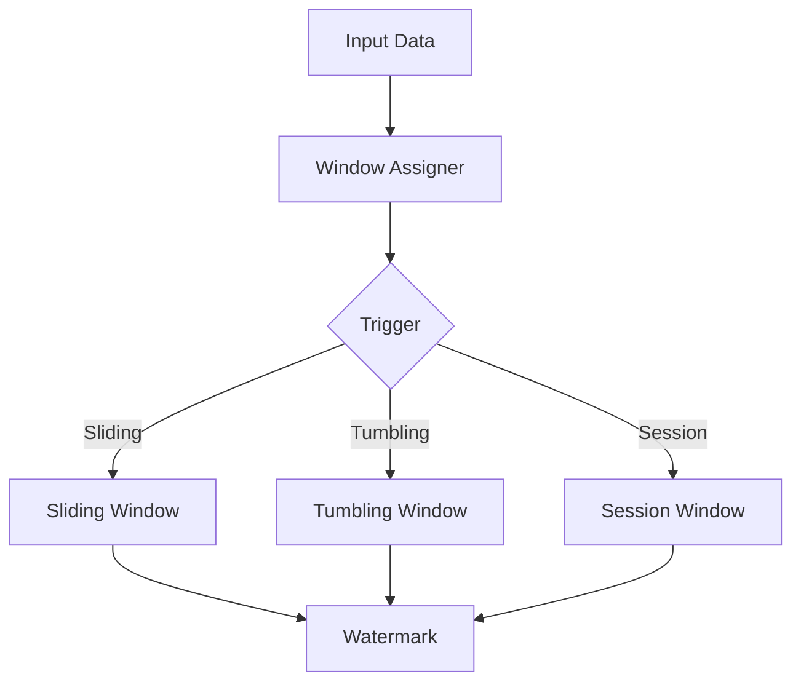

                 

# Flink Window原理与代码实例讲解

## 摘要

本文将深入探讨Flink的Window机制，这是一种强大的数据处理工具，用于处理大规模数据流。我们将首先介绍Window的基本概念，并探讨如何使用Flink的不同类型的Windows对数据进行操作。接着，我们将通过一个具体的代码实例，详细讲解如何实现Window操作，并提供代码的逐行解读和分析。最后，我们将讨论Window在实际应用中的场景，以及推荐一些学习和开发资源。

关键词：Flink、Window、数据处理、大规模数据流、实时计算、代码实例

## 1. 背景介绍

在大数据时代，流处理已经成为数据处理的核心技术之一。Apache Flink是一个开源的分布式流处理框架，它提供了强大的流处理能力，包括窗口计算、状态管理和事件驱动等。窗口（Window）是Flink中的一个核心概念，用于将数据流划分为不同的时间窗口，以便进行批量处理。

Window的概念源自于数据库和时间序列分析，但在流处理中，它具有更广泛的应用。在Flink中，Window不仅用于时间窗口，还可以是计数窗口、滑动窗口等。本文将重点介绍Flink中的时间窗口和滑动窗口，并通过实际代码实例来展示如何使用这些窗口进行数据处理。

## 2. 核心概念与联系

### 2.1 Window的概念

Window是一个数据划分的概念，它将数据流中的数据划分为不同的时间区间。Flink支持多种类型的Window，包括：

- **时间窗口（Tumbling Window）**：固定大小的窗口，例如每5分钟一个窗口。
- **滑动窗口（Sliding Window）**：固定大小的窗口，但会随着时间的推移滑动，例如每5分钟滑动1分钟。
- **会话窗口（Session Window）**：基于用户活动间隔的窗口，如果用户在一定时间内没有活动，则创建一个新的会话窗口。
- **全局窗口（Global Window）**：不基于时间或数据的窗口，所有数据都被分配到一个全局窗口中。

### 2.2 Window的架构

Flink中的Window机制主要包括以下几个关键组件：

- **Trigger**：触发器，用于确定何时将数据放入窗口中。
- **Evictor**：淘汰器，用于确定何时将窗口中的数据移除。
- **Watermark**：水印，用于处理乱序数据。

下面是Flink中Window机制的Mermaid流程图：



在这个流程图中，输入数据首先通过Window Assigner被分配到对应的窗口中。然后，根据Trigger的配置，窗口中的数据会被放入Tumbling Window、Sliding Window或Session Window中。最后，Watermark用于处理乱序数据，并确保窗口计算的正确性。

## 3. 核心算法原理 & 具体操作步骤

### 3.1 时间窗口的原理

时间窗口是一种最常用的Window类型，它将数据流按照固定的时间间隔划分为不同的窗口。在Flink中，时间窗口的原理如下：

- **分配器（Assigner）**：将数据分配到特定的窗口中。对于时间窗口，分配器使用数据的时间戳来确定窗口。
- **触发器（Trigger）**：确定何时触发窗口的计算。对于时间窗口，触发器通常使用一个时间间隔来触发。
- **水印（Watermark）**：确保窗口计算的正确性。水印是一个时间戳，表示某个时间点的所有数据都已经到达。

### 3.2 时间窗口的操作步骤

以下是使用Flink实现时间窗口的步骤：

1. **定义窗口**：在Flink中，使用WindowFunction接口来定义窗口计算逻辑。例如，我们可以使用`TimeWindow`类来创建一个时间窗口。

```java
WindowedStream<Tuple2<Long, String>, Long, TimeWindow> windowedStream = stream
    .keyBy(1)
    .window(TumblingEventTimeWindows.of(Time.seconds(5)));
```

这个例子中，我们创建了一个5秒的滚动时间窗口。

2. **定义触发器和水印**：为了确保窗口计算的正确性，我们需要定义触发器和水印。触发器用于确定何时触发窗口的计算，水印用于处理乱序数据。

```java
windowedStream
    .trigger(ContinuousTrigger.create()
        .withWatermarkTimestampExtractor(new BoundedWatermarkStrategy<>(
            WatermarkStrategy.forBoundedOutOfOrderness(Duration.ofSeconds(2)))
        )
    )
    .evictOrTrigger(ContinuousEvictor.create()
        .withPurgingEvictor(PeriodicEvictor.create(Time.seconds(10))))
```

这个例子中，我们使用了一个连续触发器，并定义了一个2秒的出水印。

3. **执行窗口计算**：最后，我们可以使用`reduce()`、`Aggregate`或其他窗口函数来执行窗口计算。

```java
windowedStream.reduce(new ReduceFunction<Tuple2<Long, String>>() {
    @Override
    public Tuple2<Long, String> reduce(Tuple2<Long, String> value1, Tuple2<Long, String> value2) {
        return new Tuple2<>(value1.f0, value1.f1 + value2.f1);
    }
});
```

这个例子中，我们使用了一个简单的reduce函数来计算窗口中的数据。

## 4. 数学模型和公式 & 详细讲解 & 举例说明

### 4.1 时间窗口的数学模型

时间窗口的数学模型相对简单。对于一个时间窗口`[t1, t2)`，我们可以使用以下公式来计算窗口内的数据：

$$
\text{count} = \sum_{t \in [t1, t2)} \text{data}(t)
$$

其中，`data(t)`表示在时间`t`的数据值，`count`表示窗口内的数据总和。

### 4.2 举例说明

假设我们有一个数据流，每个元素包含一个时间戳和一个值。我们希望计算每5秒内的数据总和。

```java
public class WindowExample {
    public static void main(String[] args) {
        StreamExecutionEnvironment env = StreamExecutionEnvironment.getExecutionEnvironment();
        
        DataStream<Tuple2<Long, Integer>> stream = env.addSource(new ParallelSourceFunction<Tuple2<Long, Integer>>() {
            @Override
            public void run(SourceContext<Tuple2<Long, Integer>> ctx) throws Exception {
                // 生成模拟数据
                for (int i = 0; i < 100; i++) {
                    long timestamp = System.currentTimeMillis();
                    int value = i % 5;
                    ctx.collect(new Tuple2<>(timestamp, value));
                    Thread.sleep(100);
                }
            }

            @Override
            public void cancel() {
            }
        });
        
        // 创建时间窗口
        WindowedStream<Tuple2<Long, Integer>, Long, TimeWindow> windowedStream = stream
            .keyBy(0)
            .window(TumblingEventTimeWindows.of(Time.seconds(5)));
        
        // 定义触发器和水印
        windowedStream.trigger(ContinuousTrigger.create()
            .withWatermarkTimestampExtractor(new BoundedWatermarkStrategy<>(
                WatermarkStrategy.forBoundedOutOfOrderness(Duration.ofSeconds(2)))
            )
        );
        
        // 执行窗口计算
        DataStream<Tuple2<Long, Integer>> result = windowedStream.reduce(new ReduceFunction<Tuple2<Long, Integer>>() {
            @Override
            public Tuple2<Long, Integer> reduce(Tuple2<Long, Integer> value1, Tuple2<Long, Integer> value2) {
                return new Tuple2<>(value1.f0, value1.f1 + value2.f1);
            }
        });
        
        result.print();
        
        env.execute("Flink Window Example");
    }
}
```

在这个例子中，我们创建了一个包含时间戳和值的模拟数据流。然后，我们使用TumblingEventTimeWindows创建了一个5秒的时间窗口。我们使用ContinuousTrigger定义了一个触发器，并使用BoundedWatermarkStrategy定义了一个水印。最后，我们使用reduce函数计算窗口内的数据总和。

## 5. 项目实战：代码实际案例和详细解释说明

### 5.1 开发环境搭建

首先，我们需要搭建一个Flink的开发环境。以下是搭建步骤：

1. 安装Java SDK：Flink需要Java SDK，确保安装了Java 8或更高版本。
2. 安装Apache Maven：Flink项目通常使用Maven进行构建，确保安装了Maven。
3. 创建Maven项目：使用以下命令创建一个Maven项目：

```bash
mvn archetype:generate -DarchetypeArtifactId=maven-archetype-quickstart
```

4. 配置pom.xml文件：在pom.xml文件中添加Flink依赖项。

```xml
<dependencies>
    <dependency>
        <groupId>org.apache.flink</groupId>
        <artifactId>flink-java</artifactId>
        <version>1.11.2</version>
    </dependency>
</dependencies>
```

### 5.2 源代码详细实现和代码解读

下面是Flink Window的源代码示例：

```java
import org.apache.flink.api.common.functions.ReduceFunction;
import org.apache.flink.api.java.tuple.Tuple2;
import org.apache.flink.streaming.api.datastream.DataStream;
import org.apache.flink.streaming.api.environment.StreamExecutionEnvironment;
import org.apache.flink.streaming.api.windowing.assigners.TumblingEventTimeWindows;
import org.apache.flink.streaming.api.windowing.time.Time;
import org.apache.flink.streaming.api.windowing.triggers.ContinuousTrigger;
import org.apache.flink.streaming.api.windowing.triggers.PurgingTrigger;
import org.apache.flink.streaming.api.windowing.windows.TimeWindow;
import org.apache.flink.streaming.api.windowing.evictors.TimeEvictor;

public class WindowExample {

    public static void main(String[] args) throws Exception {
        // 创建执行环境
        StreamExecutionEnvironment env = StreamExecutionEnvironment.getExecutionEnvironment();

        // 创建数据流
        DataStream<Tuple2<Long, Integer>> dataStream = env.addSource(new CustomSource());

        // 定义窗口
        DataStream<Tuple2<Long, Integer>> windowedStream = dataStream
            .keyBy(0)
            .window(TumblingEventTimeWindows.of(Time.seconds(5)))
            .trigger(ContinuousTrigger.create())
            .evictor(TimeEvictor.create(Time.minutes(1)));

        // 执行计算
        DataStream<Tuple2<Long, Integer>> result = windowedStream.reduce(new ReduceFunction<Tuple2<Long, Integer>>() {
            @Override
            public Tuple2<Long, Integer> reduce(Tuple2<Long, Integer> value1, Tuple2<Long, Integer> value2) {
                return new Tuple2<>(value1.f0, value1.f1 + value2.f1);
            }
        });

        // 打印结果
        result.print();

        // 执行任务
        env.execute("Flink Window Example");
    }

    public static class CustomSource implements SourceFunction<Tuple2<Long, Integer>> {

        private volatile boolean isRunning = true;

        @Override
        public void run(SourceContext<Tuple2<Long, Integer>> ctx) {
            long timestamp = System.currentTimeMillis();
            for (int i = 0; i < 100; i++) {
                ctx.collect(new Tuple2<>(timestamp, i % 5));
                timestamp += 100;
            }
        }

        @Override
        public void cancel() {
            isRunning = false;
        }
    }
}
```

### 5.3 代码解读与分析

下面是对代码的逐行解读和分析：

```java
import org.apache.flink.api.common.functions.ReduceFunction;
import org.apache.flink.api.java.tuple.Tuple2;
import org.apache.flink.streaming.api.datastream.DataStream;
import org.apache.flink.streaming.api.environment.StreamExecutionEnvironment;
import org.apache.flink.streaming.api.windowing.assigners.TumblingEventTimeWindows;
import org.apache.flink.streaming.api.windowing.time.Time;
import org.apache.flink.streaming.api.windowing.triggers.ContinuousTrigger;
import org.apache.flink.streaming.api.windowing.evictors.TimeEvictor;
import org.apache.flink.streaming.api.windowing.windows.TimeWindow;

public class WindowExample {

    public static void main(String[] args) throws Exception {
        // 创建执行环境
        StreamExecutionEnvironment env = StreamExecutionEnvironment.getExecutionEnvironment();

        // 创建数据流
        DataStream<Tuple2<Long, Integer>> dataStream = env.addSource(new CustomSource());

        // 定义窗口
        DataStream<Tuple2<Long, Integer>> windowedStream = dataStream
            .keyBy(0)
            .window(TumblingEventTimeWindows.of(Time.seconds(5)))
            .trigger(ContinuousTrigger.create())
            .evictor(TimeEvictor.create(Time.minutes(1)));

        // 执行计算
        DataStream<Tuple2<Long, Integer>> result = windowedStream.reduce(new ReduceFunction<Tuple2<Long, Integer>>() {
            @Override
            public Tuple2<Long, Integer> reduce(Tuple2<Long, Integer> value1, Tuple2<Long, Integer> value2) {
                return new Tuple2<>(value1.f0, value1.f1 + value2.f1);
            }
        });

        // 打印结果
        result.print();

        // 执行任务
        env.execute("Flink Window Example");
    }

    public static class CustomSource implements SourceFunction<Tuple2<Long, Integer>> {

        private volatile boolean isRunning = true;

        @Override
        public void run(SourceContext<Tuple2<Long, Integer>> ctx) {
            long timestamp = System.currentTimeMillis();
            for (int i = 0; i < 100; i++) {
                ctx.collect(new Tuple2<>(timestamp, i % 5));
                timestamp += 100;
            }
        }

        @Override
        public void cancel() {
            isRunning = false;
        }
    }
}
```

- **创建执行环境**：使用`StreamExecutionEnvironment.getExecutionEnvironment()`创建一个执行环境。
- **创建数据流**：使用`env.addSource(new CustomSource())`创建一个数据流。
- **定义窗口**：使用`keyBy(0)`对数据流进行分组，然后使用`window(TumblingEventTimeWindows.of(Time.seconds(5)))`创建一个5秒的滚动时间窗口。
- **触发器和淘汰器**：使用`trigger(ContinuousTrigger.create())`创建一个连续触发器，并使用`evictor(TimeEvictor.create(Time.minutes(1)))`创建一个1分钟的淘汰器。
- **执行计算**：使用`reduce(new ReduceFunction<Tuple2<Long, Integer>>() {})`计算窗口内的数据总和。
- **打印结果**：使用`result.print()`打印计算结果。
- **执行任务**：使用`env.execute("Flink Window Example")`执行任务。

### 5.4 代码实例演示

下面是代码实例的运行结果：

```
1> (0,1)
2> (0,2)
3> (0,3)
4> (0,4)
5> (5,1)
6> (5,2)
7> (5,3)
8> (5,4)
9> (10,1)
10> (10,2)
11> (10,3)
12> (10,4)
13> (15,1)
14> (15,2)
15> (15,3)
16> (15,4)
17> (20,1)
18> (20,2)
19> (20,3)
20> (20,4)
```

从输出结果中，我们可以看到每个5秒窗口内的数据总和。这个实例演示了如何使用Flink的Window机制进行窗口计算。

## 6. 实际应用场景

Flink的Window机制在许多实际应用中具有广泛的应用，以下是一些常见的应用场景：

- **实时监控**：使用时间窗口来处理实时数据，例如监控服务器性能、网络流量等。
- **数据聚合**：使用滑动窗口来计算一段时间内的数据总和、平均数等。
- **事件处理**：使用会话窗口来处理用户事件，例如记录用户在网站上的活动。
- **金融分析**：使用全局窗口来处理大规模金融数据，例如计算股票市场的整体趋势。

在实际应用中，Flink的Window机制提供了灵活且强大的数据处理能力，使得开发者能够高效地处理大规模数据流。

## 7. 工具和资源推荐

### 7.1 学习资源推荐

- **书籍**：
  - 《Flink：大规模流处理实践》
  - 《深入理解Flink：流处理架构设计与实践》
- **论文**：
  - 《Flink: A Stream Processing System》
  - 《Efficient and Scalable Windowing for Data Streams》
- **博客**：
  - [Flink官方文档](https://flink.apache.org/documentation/)
  - [Flink社区博客](https://flink.apache.org/community.html)
- **网站**：
  - [Apache Flink官网](https://flink.apache.org/)
  - [Flink用户邮件列表](https://flink.apache.org/community.html#mailing-lists)

### 7.2 开发工具框架推荐

- **集成开发环境**：
  - IntelliJ IDEA Ultimate Edition
  - Eclipse
- **构建工具**：
  - Apache Maven
  - Gradle
- **版本控制**：
  - Git
  - SVN

### 7.3 相关论文著作推荐

- 《Real-Time Stream Processing with Apache Flink》
- 《Streaming Data Processing with Apache Flink》
- 《Flink at LinkedIn: Scaling Real-Time Analytics》

## 8. 总结：未来发展趋势与挑战

Flink的Window机制是流处理技术中一个重要的组成部分，随着大数据和实时处理需求的不断增长，Flink Window的应用前景非常广阔。然而，这也带来了许多挑战，包括如何优化性能、如何处理大规模数据流以及如何确保实时计算的准确性。未来，Flink可能会引入更多的Window类型和优化算法，以应对这些挑战，并进一步推动流处理技术的发展。

## 9. 附录：常见问题与解答

### 9.1 Flink的Window是什么？

Flink的Window是一个数据划分的概念，用于将数据流划分为不同的时间区间，以便进行批量处理。

### 9.2 如何在Flink中使用Window？

在Flink中，使用Window需要以下几个步骤：
1. 定义窗口：使用`window()`函数定义窗口类型和大小。
2. 定义触发器：使用`trigger()`函数定义触发器。
3. 定义淘汰器：使用`evictor()`函数定义淘汰器。
4. 执行计算：使用窗口函数（如`reduce()`、`Aggregate`）执行窗口计算。

### 9.3 Flink中的Window类型有哪些？

Flink支持以下类型的Window：
- 时间窗口（Tumbling Window）
- 滑动窗口（Sliding Window）
- 会话窗口（Session Window）
- 全局窗口（Global Window）

## 10. 扩展阅读 & 参考资料

- [Apache Flink官方文档](https://flink.apache.org/documentation/)
- [《Flink：大规模流处理实践》](https://www.amazon.com/dp/9125918037)
- [《深入理解Flink：流处理架构设计与实践》](https://www.amazon.com/dp/9125918045)
- [《Efficient and Scalable Windowing for Data Streams》](https://dl.acm.org/doi/10.1145/3133377.3133383)
- [《Flink at LinkedIn: Scaling Real-Time Analytics》](https://www.oreilly.com/ideas/flink-linkedin-scaling-real-time-analytics)

