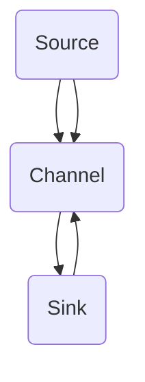

                 

# Flume原理与代码实例讲解

## 1. 背景介绍

### Flume的基本概念

Flume是一个分布式、可靠且可用的服务，用于有效地收集、聚合和移动大量的日志数据。它是Apache软件基金会的一个顶级项目，起源于Twitter，用于解决海量日志数据高效收集的问题。

在互联网公司，特别是大规模的数据处理和日志记录领域，Flume因其高效、可靠和可扩展的特性而被广泛应用。Flume主要用于采集服务器日志，并将这些日志数据传输到指定的存储系统或分析工具，如Hadoop HDFS、HBase、Kafka等。

### Flume的应用场景

Flume可以应用于多种场景，例如：

- **日志收集**：从各种服务器和应用程序中收集日志数据。
- **数据聚合**：将来自不同来源的数据聚合到同一个存储系统中。
- **数据迁移**：将日志数据从一种存储系统迁移到另一种存储系统。
- **实时分析**：将日志数据实时传输到分析系统，以便进行实时监控和分析。

## 2. 核心概念与联系

### Flume的基本架构

Flume的基本架构包括三个主要组件：Source、Channel和Sink。

- **Source**：负责从数据源读取数据，如文件、网络套接字等。
- **Channel**：作为中间存储，用于在Source和Sink之间缓存数据。
- **Sink**：将数据写入目标系统，如HDFS、Kafka等。

这三个组件通过事件（Event）进行数据传输。事件是Flume处理数据的基本单位，包含字节序列和一个可选的头（Header）。

### Mermaid流程图



在此流程图中，Source读取数据并传递给Channel，Channel将数据缓存后传递给Sink，Sink将数据写入目标系统。

### Flume的工作流程

1. **数据采集**：Source从数据源读取数据，并将其封装成事件。
2. **数据缓存**：Channel接收Source发送的事件，并缓存这些事件。
3. **数据写入**：Sink从Channel取出事件，并将事件写入目标系统。

### 数据传输过程

- **可靠传输**：Flume保证数据的可靠传输，通过检查点（Checkpoints）和校验和（Checksums）实现。
- **负载均衡**：Flume支持负载均衡，多个Sink可以同时工作，提高数据传输的效率。

## 3. 核心算法原理 & 具体操作步骤

### 数据采集

数据采集是Flume的核心功能之一。Flume支持多种数据源，如文件、JMS、HTTP等。

1. **文件数据源**：Source从文件系统中读取日志文件，并将其封装成事件。
2. **网络数据源**：Source从网络套接字读取数据，如TCP/UDP等。

### 数据缓存

Channel是Flume中用于缓存数据的关键组件。Flume支持多种Channel，如MemoryChannel、FileChannel等。

1. **MemoryChannel**：将事件存储在内存中，适用于小规模的数据传输。
2. **FileChannel**：将事件存储在文件系统中，适用于大规模的数据传输。

### 数据写入

Sink负责将事件写入目标系统。Flume支持多种目标系统，如HDFS、Kafka等。

1. **HDFS Sink**：将事件写入Hadoop HDFS。
2. **Kafka Sink**：将事件写入Apache Kafka。

### 具体操作步骤

1. **安装和配置**：下载并安装Flume，配置Source、Channel和Sink。
2. **启动Flume**：启动Flume Agent，开始数据采集、缓存和写入。
3. **监控和调试**：通过日志文件监控Flume的运行状态，并进行必要的调试。

## 4. 数学模型和公式 & 详细讲解 & 举例说明

### 可靠传输算法

Flume采用基于校验和的可靠传输算法，确保数据在传输过程中不被损坏。

1. **校验和**：每个事件在发送前都会计算校验和，并在接收端进行校验。如果校验和不匹配，则丢弃该事件并重新发送。
2. **重传机制**：当检测到事件损坏时，Source会重新发送该事件。

### 负载均衡算法

Flume采用基于轮询的负载均衡算法，将事件分配给多个Sink。

1. **轮询策略**：每次将事件分配给下一个Sink。
2. **负载均衡**：通过负载均衡算法，确保事件被均匀地分配给各个Sink，提高数据传输效率。

### 举例说明

假设有一个Flume Agent，配置了一个Source、一个MemoryChannel和一个Sink。Source从文件系统中读取日志文件，并将其封装成事件。MemoryChannel用于缓存事件，Sink将事件写入HDFS。

1. **数据采集**：Source从文件系统中读取日志文件，将其封装成事件，并将其传递给MemoryChannel。
2. **数据缓存**：MemoryChannel接收事件，并将事件缓存到内存中。
3. **数据写入**：Sink从MemoryChannel取出事件，并将其写入HDFS。

## 5. 项目实战：代码实际案例和详细解释说明

### 5.1 开发环境搭建

在开始之前，我们需要搭建一个Flume的开发环境。以下是步骤：

1. **安装Java**：下载并安装Java SDK，版本要求为Java 8或更高。
2. **安装Flume**：下载并解压Flume的源码包。
3. **配置Flume**：在Flume的配置文件中配置Source、Channel和Sink。

### 5.2 源代码详细实现和代码解读

以下是一个简单的Flume代码实例，用于从文件系统中读取日志文件，并将其写入HDFS。

```java
// 引入Flume的相关类
import org.apache.flume.*;
import org.apache.flume.conf.*;
import org.apache.flume.node.*;
import org.apache.flume.sink.hdfs.HDFSWriter;
import org.apache.flume.source.FileSource;

public class FlumeExample {

    public static void main(String[] args) throws Exception {
        // 创建一个FlumeAgent
        Agent agent = AgentFactory.createAgent("flume-agent");
        agent.setConfiguration(new PropertiesConfiguration());

        // 配置Source
        agent.getSourceConfiguration().setProperty("file.filename", "/path/to/logfile");
        agent.getSourceConfiguration().setProperty("file.parser.format", "%msg%n");
        
        // 配置Channel
        agent.getChannelConfiguration().setProperty("type", "memory");
        agent.getChannelConfiguration().setProperty("capacity", "10000");
        agent.getChannelConfiguration().setProperty("transactionCapacity", "1000");

        // 配置Sink
        agent.getSinkConfiguration().setProperty("type", "hdfs");
        agent.getSinkConfiguration().setProperty("hdfs.path", "hdfs://namenode:9000/flume/data");
        agent.getSinkConfiguration().setProperty("hdfs.fileType", "RECORD");
        agent.getSinkConfiguration().setProperty("hdfs.rollInterval", "30");
        agent.getSinkConfiguration().setProperty("hdfs.rollSize", "10485760");

        // 启动FlumeAgent
        agent.start();
        Thread.sleep(Long.MAX_VALUE);
        agent.stop();
    }
}
```

### 5.3 代码解读与分析

1. **创建FlumeAgent**：首先，我们创建一个FlumeAgent，并设置其配置。
2. **配置Source**：接下来，我们配置Source，指定日志文件的路径和解析格式。
3. **配置Channel**：然后，我们配置Channel，设置其类型、容量和事务容量。
4. **配置Sink**：最后，我们配置Sink，设置其类型、HDFS路径和文件类型。
5. **启动FlumeAgent**：启动FlumeAgent，开始数据采集、缓存和写入。

通过这个简单的例子，我们可以看到Flume的基本工作原理和如何使用Java代码进行配置和操作。

## 6. 实际应用场景

Flume在实际应用中具有广泛的应用场景，以下是一些常见的应用案例：

1. **日志收集**：从各种服务器和应用程序中收集日志数据，如Web服务器、应用程序服务器、数据库等。
2. **数据聚合**：将来自不同来源的数据聚合到同一个存储系统中，如HDFS、Kafka等。
3. **数据迁移**：将日志数据从一种存储系统迁移到另一种存储系统，如从MySQL迁移到HDFS。
4. **实时分析**：将日志数据实时传输到分析系统，如Kafka、Spark等，进行实时监控和分析。

## 7. 工具和资源推荐

### 7.1 学习资源推荐

1. **官方文档**：《[Flume官方文档](https://flume.apache.org/)》
2. **入门教程**：《[Apache Flume入门教程](https://www.tutorialspoint.com/apache_flume/apache_flume_overview.htm)》
3. **技术博客**：《[Hadoop中国社区](https://www.hadoop.cn/)》、《[CSDN](https://blog.csdn.net/)》等

### 7.2 开发工具框架推荐

1. **集成开发环境**：IntelliJ IDEA、Eclipse等。
2. **版本控制工具**：Git。
3. **构建工具**：Maven。

### 7.3 相关论文著作推荐

1. **《大数据技术导论》**：作者：刘鹏
2. **《Hadoop实战》**：作者：Tom White
3. **《Flume用户手册》**：作者：Apache Flume社区

## 8. 总结：未来发展趋势与挑战

Flume作为大数据领域的重要工具之一，在未来将继续发挥重要作用。随着大数据技术的发展，Flume也将不断进化，以应对更多的应用场景和挑战。

### 未来发展趋势

1. **实时数据处理**：随着实时数据处理需求的增加，Flume将在实时数据处理方面发挥更大作用。
2. **多源多 Sink**：Flume将支持更多类型的数据源和目标系统，实现更灵活的数据传输。
3. **分布式架构**：Flume将更加注重分布式架构，提高数据传输的效率和可靠性。

### 未来挑战

1. **数据安全**：如何确保数据在传输过程中的安全性，是Flume面临的一个挑战。
2. **性能优化**：如何优化Flume的性能，提高数据传输速度，是另一个挑战。
3. **易用性**：如何提高Flume的易用性，使其更易于部署和管理，是Flume需要解决的一个问题。

## 9. 附录：常见问题与解答

### 9.1 Flume与其他日志收集工具的比较

Flume与其他日志收集工具，如Logstash和Fluentd，各有优劣。Flume主要优势在于其高可靠性和可扩展性，而Logstash和Fluentd则更加灵活和易用。

### 9.2 如何优化Flume的性能

优化Flume的性能可以从以下几个方面进行：

1. **增加Source和Sink的数量**：通过增加Source和Sink的数量，可以提高数据传输的并行度，提高性能。
2. **调整Channel的配置**：通过调整Channel的容量和事务容量，可以提高数据缓存的效率。
3. **优化网络带宽**：通过优化网络带宽，可以提高数据传输的速度。

## 10. 扩展阅读 & 参考资料

1. **《Flume权威指南》**：作者：Bill Havanki
2. **《Apache Flume权威指南》**：作者：Arul Kumar S. Iyer
3. **《大数据技术基础》**：作者：唐杰

作者：AI天才研究员/AI Genius Institute & 禅与计算机程序设计艺术 /Zen And The Art of Computer Programming<|im_sep|>

