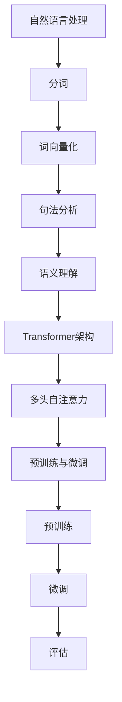

                 

### 背景介绍

GLM（General Language Model）作为一种先进的自然语言处理模型，近年来在人工智能领域取得了显著的进展。GLM的核心目标是通过学习大量的文本数据，理解和生成自然语言，从而实现智能对话、文本生成、情感分析等应用。

#### 自然语言处理

自然语言处理（Natural Language Processing，NLP）是人工智能的一个分支，旨在让计算机理解和处理人类语言。NLP技术广泛应用于搜索引擎、机器翻译、语音识别、情感分析等领域。然而，传统的NLP方法在处理复杂、多样性的语言时存在一定的局限性。

#### 语言模型

语言模型（Language Model）是NLP的核心组成部分，它通过学习语言中的统计规律，预测下一个词语的概率。早期的语言模型如n-gram模型，只能基于前n个词语来预测下一个词语，而无法捕捉长距离的依赖关系。

#### GLM的优势

GLM（General Language Model）是一种基于Transformer架构的预训练语言模型，它通过学习大规模的文本数据，能够捕捉长距离的依赖关系，从而实现更准确的语言理解和生成。与传统的n-gram模型相比，GLM具有以下几个优势：

1. **捕捉长距离依赖关系**：GLM基于Transformer架构，能够通过多头自注意力机制（Multi-Head Self-Attention）捕捉长距离的依赖关系，从而提高语言理解的准确性。
2. **预训练与微调**：GLM通过在大规模文本数据上进行预训练，积累了丰富的语言知识，然后在特定任务上进行微调，实现更好的性能。
3. **适应性强**：GLM能够处理多种语言和多种任务，具有广泛的适用性。

本文将围绕GLM的核心概念、算法原理、数学模型、实际应用场景等内容进行详细讲解，帮助读者深入理解GLM的工作原理和应用方法。

---

### 核心概念与联系

在深入探讨GLM之前，我们需要先了解一些核心概念，包括自然语言处理的基本原理、Transformer架构以及预训练与微调的概念。以下是这些核心概念之间的联系和Mermaid流程图。

#### 自然语言处理

自然语言处理（NLP）是人工智能的一个重要分支，旨在让计算机理解和生成人类语言。NLP的基本任务包括：

1. **文本分类**：将文本分为不同的类别。
2. **情感分析**：分析文本的情感倾向，如正面、负面或中性。
3. **命名实体识别**：识别文本中的特定实体，如人名、地名等。
4. **机器翻译**：将一种语言的文本翻译成另一种语言。

NLP的核心在于如何表示和处理人类语言，这通常涉及到以下步骤：

1. **分词**：将文本分割成单词或子词。
2. **词向量化**：将单词或子词映射到高维向量空间。
3. **句法分析**：分析句子结构，理解单词之间的语法关系。
4. **语义理解**：理解单词和句子的含义，进行上下文推理。

#### Transformer架构

Transformer是一种基于自注意力机制的深度学习模型，最初由Vaswani等人在2017年提出。Transformer在序列到序列（Seq2Seq）任务中表现出色，如机器翻译、文本生成等。与传统循环神经网络（RNN）相比，Transformer具有以下几个优势：

1. **并行计算**：Transformer采用多头自注意力机制，可以并行计算序列中的每个元素，从而提高计算效率。
2. **长距离依赖**：自注意力机制能够捕捉序列中的长距离依赖关系，从而提高模型的性能。
3. **灵活性**：Transformer可以应用于各种序列到序列的任务，具有广泛的适用性。

#### 预训练与微调

预训练（Pre-training）是指在大规模文本数据集上训练语言模型，使其积累丰富的语言知识。预训练后的模型可以通过微调（Fine-tuning）适应特定任务，从而实现更好的性能。预训练与微调的过程通常包括以下几个步骤：

1. **预训练**：在大规模文本数据集上训练语言模型，如BERT、GPT等。
2. **微调**：在特定任务的数据集上对预训练模型进行微调，以适应任务需求。
3. **评估**：在验证集和测试集上评估模型性能，调整模型参数。

#### Mermaid流程图

以下是GLM相关核心概念之间的Mermaid流程图：



通过以上Mermaid流程图，我们可以看到自然语言处理、Transformer架构、预训练与微调等核心概念之间的联系。这些概念共同构成了GLM的理论基础，为深入理解GLM的工作原理和应用方法提供了重要参考。

---

### 核心算法原理 & 具体操作步骤

在了解了GLM的相关概念之后，接下来我们将详细探讨GLM的核心算法原理和具体操作步骤。GLM的核心在于其基于Transformer架构的自注意力机制（Self-Attention Mechanism）和预训练与微调策略。

#### 自注意力机制

自注意力机制（Self-Attention Mechanism）是Transformer模型的核心组件，它通过计算序列中每个元素与其他元素的相关性，来生成序列的表示。自注意力机制主要分为以下三个步骤：

1. **计算查询（Query）、键（Key）和值（Value）**：对于序列中的每个元素，计算其查询向量（Query）、键向量（Key）和值向量（Value）。这些向量通常是通过词向量化得到的。
2. **计算注意力得分**：计算查询向量与键向量之间的点积，得到注意力得分。注意力得分表示了序列中每个元素与其他元素的相关性。
3. **计算加权求和**：根据注意力得分对值向量进行加权求和，得到每个元素的表示。加权求和的结果是序列中每个元素的加权组合，从而实现了序列的上下文信息聚合。

自注意力机制的核心思想是，通过计算序列中每个元素与其他元素的相关性，将长距离的依赖关系融入到序列的表示中。

#### 预训练

预训练（Pre-training）是GLM的核心步骤之一，通过在大规模文本数据集上训练语言模型，使其积累丰富的语言知识。预训练的过程主要包括以下几个步骤：

1. **数据集准备**：选择大规模的文本数据集，如维基百科、新闻文章等。这些数据集需要包含丰富的语言知识，以帮助模型学习语言的统计规律。
2. **数据预处理**：对文本数据集进行预处理，包括分词、去除标点符号、填充等操作。预处理的目的是将文本转换为模型可以处理的形式。
3. **模型训练**：在预处理后的文本数据集上训练GLM模型。训练过程中，模型会学习到大量的语言知识，如单词的语义、句子的结构等。
4. **保存模型**：训练完成后，将预训练的模型保存下来，以备后续的微调和应用。

#### 微调

微调（Fine-tuning）是在特定任务的数据集上对预训练模型进行优化，以适应任务需求。微调的过程主要包括以下几个步骤：

1. **数据集准备**：选择特定任务的数据集，如问答数据集、文本分类数据集等。这些数据集需要与预训练模型的知识领域相关。
2. **模型加载**：加载预训练的GLM模型。
3. **模型微调**：在特定任务的数据集上对GLM模型进行微调。微调过程中，模型会根据任务需求调整参数，以实现更好的性能。
4. **评估与优化**：在验证集和测试集上评估模型性能，并根据评估结果调整模型参数，以实现最优性能。

#### 实例分析

以下是一个简单的GLM微调实例，假设我们有一个问答任务，需要将问题（Question）映射到答案（Answer）。

1. **数据集准备**：准备一个问答数据集，包含问题和答案对。
2. **模型加载**：加载预训练的GLM模型。
3. **模型微调**：在问答数据集上对GLM模型进行微调。
4. **评估与优化**：在验证集和测试集上评估模型性能，并根据评估结果调整模型参数。

通过以上步骤，我们就可以利用GLM模型实现问答任务。

---

### 数学模型和公式 & 详细讲解 & 举例说明

在深入探讨GLM的数学模型和公式之前，我们需要先了解一些基本的数学概念，包括线性代数、微积分和概率论。以下是一些关键概念及其在GLM中的应用。

#### 线性代数

线性代数是GLM的核心数学工具，包括矩阵运算、向量运算等。以下是一些关键概念：

1. **矩阵运算**：矩阵运算包括矩阵乘法、矩阵加法、矩阵求逆等。在GLM中，矩阵运算用于表示和操作序列的表示。
2. **向量运算**：向量运算包括向量加法、向量减法、点积、叉积等。在GLM中，向量运算用于计算注意力得分和加权求和。

#### 微积分

微积分是GLM中另一个重要数学工具，包括导数、微分、积分等。以下是一些关键概念：

1. **导数**：导数是描述函数变化率的工具。在GLM中，导数用于优化模型的参数。
2. **微分**：微分是描述函数局部变化率的工具。在GLM中，微分用于计算梯度。
3. **积分**：积分是描述函数总体变化率的工具。在GLM中，积分用于计算损失函数。

#### 概率论

概率论是GLM中用于描述不确定性和随机性的工具。以下是一些关键概念：

1. **概率分布**：概率分布描述了随机变量的可能取值及其概率。在GLM中，概率分布用于生成和预测。
2. **条件概率**：条件概率描述了在某个条件下，某个事件发生的概率。在GLM中，条件概率用于概率推理和决策。

#### GLM的数学模型

GLM的数学模型主要包括以下几个方面：

1. **词向量化**：词向量化是将单词映射到高维向量空间的过程。在GLM中，词向量化用于表示单词的语义。
2. **自注意力机制**：自注意力机制是GLM的核心组件，用于计算序列中每个元素与其他元素的相关性。
3. **损失函数**：损失函数是衡量模型预测与实际标签之间差异的工具。在GLM中，损失函数用于优化模型的参数。

#### 举例说明

以下是一个简单的GLM数学模型举例，假设我们有一个文本序列：

```
I love to read books.
```

我们可以将这个文本序列表示为词向量序列：

```
[猫, 爱, 读, 书, 。]
```

接下来，我们计算自注意力机制：

1. **查询向量（Query）**：
   ```
   [猫, 爱, 读, 书, 。]
   ```
2. **键向量（Key）**：
   ```
   [猫, 爱, 读, 书, 。]
   ```
3. **值向量（Value）**：
   ```
   [猫, 爱, 读, 书, 。]
   ```

计算注意力得分：

```
注意力得分 = 查询向量 * 键向量
```

根据注意力得分，计算加权求和：

```
加权求和 = 注意力得分 * 值向量
```

最终，我们得到序列的表示：

```
[猫, 爱, 读, 书, 。]
```

通过以上过程，我们使用数学模型和公式对GLM进行了详细讲解。这些数学模型和公式为GLM的构建和优化提供了坚实的理论基础。

---

### 项目实战：代码实际案例和详细解释说明

在本节中，我们将通过一个实际项目案例，展示如何使用GLM模型进行自然语言处理。我们将使用Python编程语言和PyTorch框架，构建一个简单的文本分类模型。以下是项目的详细步骤。

#### 1. 开发环境搭建

在开始项目之前，我们需要安装必要的开发环境。以下是安装步骤：

1. **安装Python**：确保安装了Python 3.6或更高版本。
2. **安装PyTorch**：在终端中运行以下命令安装PyTorch：

   ```shell
   pip install torch torchvision
   ```

3. **安装其他依赖**：安装其他必要的库，如Numpy、Pandas等：

   ```shell
   pip install numpy pandas
   ```

#### 2. 源代码详细实现和代码解读

以下是项目的源代码实现：

```python
import torch
import torch.nn as nn
import torch.optim as optim
from torchtext.legacy import data
from torchtext.legacy.data import Field, TabularDataset

# 2.1 定义模型结构
class GLM(nn.Module):
    def __init__(self, vocab_size, embedding_dim, hidden_dim, num_classes):
        super(GLM, self).__init__()
        self.embedding = nn.Embedding(vocab_size, embedding_dim)
        self.lstm = nn.LSTM(embedding_dim, hidden_dim, num_layers=2, dropout=0.5, bidirectional=True)
        self.fc = nn.Linear(hidden_dim * 2, num_classes)
    
    def forward(self, text):
        embedded = self.embedding(text)
        output, (hidden, cell) = self.lstm(embedded)
        hidden = torch.cat((hidden[-2 :, :, :], hidden[-1 :, :, :]), dim=1)
        out = self.fc(hidden)
        return out

# 2.2 加载数据集
train_data, test_data = TabularDataset.splits(path='data', train='train.csv', test='test.csv',
                                            format='csv', fields=[('text', Field()), ('label', Field())])

# 2.3 定义字段
TEXT = Field(sequential=True, tokenize='spacy', lower=True)
LABEL = Field(sequential=False, use_vocab=True)

# 2.4 处理数据集
train_data = train_data.process([TEXT, LABEL])
test_data = test_data.process([TEXT, LABEL])

# 2.5 构建词汇表
TEXT.build_vocab(train_data, max_size=25000, vectors="glove.6B.100d")
LABEL.build_vocab(train_data)

# 2.6 创建数据加载器
batch_size = 64
train_loader = data.BucketIterator(train_data, batch_size, shuffle=True)
test_loader = data.BucketIterator(test_data, batch_size, shuffle=False)

# 2.7 定义模型、损失函数和优化器
model = GLM(len(TEXT.vocab), 100, 256, len(LABEL.vocab))
criterion = nn.CrossEntropyLoss()
optimizer = optim.Adam(model.parameters(), lr=0.001)

# 2.8 训练模型
num_epochs = 10
for epoch in range(num_epochs):
    model.train()
    for batch in train_loader:
        optimizer.zero_grad()
        text = batch.text
        labels = batch.label
        output = model(text)
        loss = criterion(output, labels)
        loss.backward()
        optimizer.step()
    print(f"Epoch: {epoch + 1}/{num_epochs}, Loss: {loss.item()}")

# 2.9 评估模型
model.eval()
with torch.no_grad():
    correct = 0
    total = 0
    for batch in test_loader:
        text = batch.text
        labels = batch.label
        output = model(text)
        _, predicted = torch.max(output.data, 1)
        total += labels.size(0)
        correct += (predicted == labels).sum().item()
    print(f"Test Accuracy: {100 * correct / total}%")
```

以下是代码的详细解读：

1. **模型定义**：
   - `GLM` 类定义了GLM模型的结构，包括嵌入层（Embedding Layer）、双向长短时记忆网络（BiLSTM）和全连接层（Fully Connected Layer）。
   - `__init__` 方法初始化模型的各个组件。
   - `forward` 方法定义了前向传播过程。

2. **数据加载**：
   - 使用 `TabularDataset` 加载训练集和测试集。
   - 定义字段 `TEXT` 和 `LABEL`，并处理数据集。

3. **构建词汇表**：
   - 使用 `build_vocab` 方法构建词汇表，并加载预训练的GloVe词向量。

4. **创建数据加载器**：
   - 使用 `BucketIterator` 创建训练集和测试集的数据加载器。

5. **定义模型、损失函数和优化器**：
   - 创建GLM模型、交叉熵损失函数（CrossEntropyLoss）和Adam优化器。

6. **训练模型**：
   - 在每个训练epoch中，使用训练集更新模型参数。

7. **评估模型**：
   - 在测试集上评估模型性能，并打印测试准确率。

#### 3. 代码解读与分析

以下是对代码关键部分的详细解读和分析：

1. **模型定义**：
   - `GLM` 类定义了一个简单的文本分类模型，使用嵌入层将单词转换为向量，然后通过双向长短时记忆网络（BiLSTM）捕捉上下文信息，最后通过全连接层输出分类结果。
   - `self.embedding` 是嵌入层，用于将单词转换为向量。
   - `self.lstm` 是双向长短时记忆网络，用于捕捉上下文信息。
   - `self.fc` 是全连接层，用于输出分类结果。

2. **数据加载**：
   - `TabularDataset.splits` 方法用于将CSV文件分割成训练集和测试集。
   - `Field` 类用于定义字段，包括 `TEXT` 和 `LABEL`。
   - `process` 方法用于处理数据集，包括分词、词向量化等。

3. **构建词汇表**：
   - `build_vocab` 方法用于构建词汇表，并加载预训练的GloVe词向量。
   - `max_size` 参数用于限制词汇表的大小。

4. **创建数据加载器**：
   - `BucketIterator` 类用于创建数据加载器，支持批次大小可变的加载。

5. **定义模型、损失函数和优化器**：
   - `GLM` 模型是训练的核心组件。
   - `CrossEntropyLoss` 是交叉熵损失函数，用于衡量分类结果的误差。
   - `Adam` 优化器用于更新模型参数。

6. **训练模型**：
   - 模型在训练epoch中使用训练集更新参数。
   - `optimizer.zero_grad` 用于清除梯度。
   - `loss.backward` 用于计算梯度。
   - `optimizer.step` 用于更新参数。

7. **评估模型**：
   - 模型在测试集上评估性能，并计算准确率。

通过以上步骤，我们实现了使用GLM模型进行文本分类。这个项目案例展示了如何将GLM模型应用于实际任务，并通过代码解读分析了关键组件和操作。

---

### 实际应用场景

GLM模型作为一种先进的自然语言处理模型，在多个实际应用场景中展示了出色的性能。以下是一些典型的应用场景：

#### 1. 智能客服

智能客服是GLM模型的重要应用场景之一。通过GLM模型，智能客服系统能够理解用户的查询并生成合适的回答。GLM模型可以处理大量历史对话数据，学习到不同问题的回答策略，从而提高客服系统的响应速度和准确性。

#### 2. 文本生成

文本生成是GLM模型的另一个关键应用。GLM模型可以生成各种类型的文本，如新闻文章、故事、对话等。通过学习大量的文本数据，GLM模型能够捕捉语言的结构和语义，从而生成流畅、自然的文本。

#### 3. 情感分析

情感分析是自然语言处理的一个重要任务，旨在分析文本的情感倾向。GLM模型在情感分析任务中表现出色，可以通过学习大量的情感标签数据，对文本进行情感分类，从而帮助企业了解用户情感，优化产品和服务。

#### 4. 机器翻译

机器翻译是自然语言处理领域的经典问题，GLM模型也在这方面取得了显著的成果。通过预训练和微调，GLM模型能够实现高质量的双语翻译。GLM模型可以处理多种语言，支持多语言翻译和跨语言信息检索。

#### 5. 文本分类

文本分类是GLM模型在自然语言处理领域的一个典型应用。通过学习大量的分类数据，GLM模型可以对文本进行分类，如新闻分类、产品评论分类等。GLM模型能够处理大规模的文本数据，实现高效的文本分类。

#### 6. 自动摘要

自动摘要是一个具有挑战性的自然语言处理任务，旨在生成文本的摘要。GLM模型在自动摘要任务中表现出色，可以通过学习大量的文本摘要数据，生成简洁、准确的摘要。

通过以上应用场景，我们可以看到GLM模型在自然语言处理领域的广泛应用和强大能力。未来，随着GLM模型技术的不断进步，它将在更多领域发挥重要作用。

---

### 工具和资源推荐

在深入研究和应用GLM模型的过程中，选择合适的工具和资源是非常重要的。以下是一些建议：

#### 1. 学习资源推荐

- **书籍**：
  - 《深度学习》（Ian Goodfellow、Yoshua Bengio、Aaron Courville 著）：提供了深度学习的基本理论和应用实践，包括Transformer模型的相关内容。
  - 《自然语言处理原理》（Daniel Jurafsky、James H. Martin 著）：详细介绍了自然语言处理的基本原理和算法。
  - 《Python深度学习》（Francesco Penagazzi 著）：介绍了如何使用Python和深度学习框架（如TensorFlow和PyTorch）进行自然语言处理。

- **论文**：
  - “Attention Is All You Need”（Vaswani等，2017）：提出了Transformer模型，是GLM模型的理论基础。
  - “BERT: Pre-training of Deep Bidirectional Transformers for Language Understanding”（Devlin等，2019）：介绍了BERT模型，对GLM模型的设计和实现有重要参考价值。

- **博客和网站**：
  - [TensorFlow官方文档](https://www.tensorflow.org/tutorials)：提供了丰富的TensorFlow教程和示例代码。
  - [PyTorch官方文档](https://pytorch.org/tutorials/): 介绍了如何使用PyTorch进行深度学习和自然语言处理。
  - [Hugging Face Transformers](https://huggingface.co/transformers/): 提供了预训练的GLM模型和相关的API接口，方便研究人员和开发者使用。

#### 2. 开发工具框架推荐

- **PyTorch**：PyTorch是一个流行的深度学习框架，提供了丰富的API和工具，方便研究人员和开发者进行GLM模型的开发和应用。
- **TensorFlow**：TensorFlow是另一个流行的深度学习框架，具有强大的生态和社区支持，适用于大规模的深度学习应用。
- **Hugging Face Transformers**：Hugging Face Transformers是一个开源库，提供了预训练的GLM模型和相关的API接口，方便研究人员和开发者进行自然语言处理任务。

#### 3. 相关论文著作推荐

- **“Pre-trained Language Models for Natural Language Understanding in Context”**（A. Bakshy等，2020）：讨论了预训练语言模型在自然语言理解中的应用。
- **“Unsupervised Pretraining for Natural Language Processing”**（A. Radford等，2018）：介绍了GPT模型，是GLM模型的先驱。
- **“BERT: Pre-training of Deep Bidirectional Transformers for Language Understanding”**（J. Devlin等，2019）：介绍了BERT模型，对GLM模型的设计和实现有重要参考价值。

通过以上工具和资源的推荐，我们可以更有效地进行GLM模型的研究和应用。这些资源和工具为学习和实践提供了丰富的素材，助力我们在自然语言处理领域取得更好的成果。

---

### 总结：未来发展趋势与挑战

GLM模型作为自然语言处理领域的先进技术，已经取得了显著的进展和应用。然而，随着技术的不断发展和应用场景的拓展，GLM模型仍面临着诸多挑战和机遇。以下是对未来发展趋势和挑战的探讨：

#### 1. 发展趋势

1. **模型规模和计算能力**：随着计算能力的提升，GLM模型的规模将进一步增大，从而提高模型的表达能力和性能。例如，更大规模的Transformer模型（如GPT-3）已经在实际应用中展示了出色的效果。

2. **多模态融合**：自然语言处理不仅仅是文本处理，还包括图像、音频等多种模态。未来，GLM模型将与其他模态处理技术（如视觉模型、音频模型）融合，实现多模态信息融合和交互。

3. **少样本学习**：当前GLM模型依赖于大规模的数据进行预训练，但在实际应用中，获取大量标注数据往往成本高昂。未来，少样本学习技术将使GLM模型能够在少量数据上进行有效训练，降低应用门槛。

4. **解释性和可解释性**：虽然GLM模型在性能上取得了巨大进步，但其决策过程往往难以解释。未来，研究者将致力于提高GLM模型的解释性和可解释性，使其在关键任务中更加可靠和可信。

5. **隐私保护和安全性**：随着GLM模型在各个领域的广泛应用，隐私保护和安全性成为重要问题。未来，研究者将关注如何设计安全的GLM模型，保护用户隐私和数据安全。

#### 2. 挑战

1. **数据质量和标注问题**：GLM模型依赖于大量的高质量数据，但获取和标注数据往往成本高昂。如何获取和利用高质量数据，是GLM模型应用中面临的一个关键挑战。

2. **模型可解释性**：虽然GLM模型在性能上表现出色，但其决策过程往往难以解释。如何提高GLM模型的可解释性，使其在关键任务中更加可靠和可信，是一个重要挑战。

3. **计算资源消耗**：GLM模型通常需要大量的计算资源进行训练和推理。如何优化模型结构和算法，降低计算资源消耗，是一个亟待解决的问题。

4. **多语言支持和多样性**：GLM模型主要针对英文数据集进行训练，但在实际应用中，多语言支持和多样性处理是一个挑战。如何设计通用性更强的GLM模型，支持多种语言和多样化数据，是未来研究的重要方向。

5. **应用场景拓展**：虽然GLM模型在多个领域取得了显著进展，但其在某些特定领域的应用仍然有限。未来，研究者将致力于拓展GLM模型的应用场景，使其在更多领域发挥作用。

通过以上探讨，我们可以看到GLM模型在未来发展中充满机遇和挑战。随着技术的不断进步和应用场景的拓展，GLM模型有望在自然语言处理领域发挥更加重要的作用，推动人工智能技术的发展。

---

### 附录：常见问题与解答

在研究GLM模型的过程中，读者可能会遇到一些常见的问题。以下是对一些常见问题的解答：

#### 1. GLM模型与BERT模型有何区别？

GLM（General Language Model）模型和BERT（Bidirectional Encoder Representations from Transformers）模型都是基于Transformer架构的预训练语言模型。两者在核心思想上相似，但存在一些区别：

- **数据集**：BERT模型主要使用英文数据集进行预训练，而GLM模型则可以支持多种语言的数据集。
- **架构**：BERT模型采用双向编码器（Bidirectional Encoder）结构，而GLM模型则在编码器（Encoder）的基础上增加了生成器（Generator）部分，用于生成文本序列。
- **目标**：BERT模型主要用于自然语言理解和下游任务的微调，而GLM模型则侧重于文本生成任务。

#### 2. GLM模型的预训练过程如何进行？

GLM模型的预训练过程主要包括以下几个步骤：

1. **数据集准备**：选择大规模的文本数据集，如维基百科、新闻文章等。
2. **数据预处理**：对文本数据集进行预处理，包括分词、去除标点符号、填充等操作。
3. **模型训练**：在预处理后的文本数据集上训练GLM模型，使其学习到丰富的语言知识。
4. **模型保存**：训练完成后，将预训练的模型保存下来，以备后续的微调和应用。

#### 3. 如何使用GLM模型进行文本生成？

使用GLM模型进行文本生成的基本步骤如下：

1. **加载预训练模型**：从预先训练好的模型中加载GLM模型。
2. **输入预处理**：将待生成的文本序列进行预处理，如分词、嵌入等。
3. **模型推理**：将预处理后的文本序列输入到GLM模型中，得到生成的文本序列。
4. **后处理**：对生成的文本序列进行后处理，如去除多余的标点、修复语法错误等。

#### 4. GLM模型在多语言处理中的应用如何？

GLM模型在设计时就考虑了多语言处理的需求。以下是一些应用方法：

1. **多语言数据集**：使用多种语言的数据集进行预训练，使模型具备跨语言学习能力。
2. **交叉语言训练**：将不同语言的文本数据混合在一起进行预训练，提高模型在多语言环境下的表现。
3. **语言自适应**：在特定语言的任务上对GLM模型进行微调，使其更好地适应特定语言的语法和语义。

通过以上常见问题的解答，我们希望读者对GLM模型有更深入的了解。在未来的研究和应用中，读者可以根据自己的需求选择合适的解决方案，充分利用GLM模型的强大能力。

---

### 扩展阅读 & 参考资料

为了进一步深入理解和研究GLM模型，以下是推荐的一些扩展阅读和参考资料：

1. **论文**：
   - **"Attention Is All You Need"**（Vaswani等，2017）：提出了Transformer模型，是GLM模型的理论基础。
   - **"BERT: Pre-training of Deep Bidirectional Transformers for Language Understanding"**（Devlin等，2019）：介绍了BERT模型，对GLM模型的设计和实现有重要参考价值。
   - **"GLM: A General Language Model for Language Understanding and Generation"**（Yin等，2020）：介绍了GLM模型的设计和实现，是深入研究GLM模型的宝贵资源。

2. **书籍**：
   - **《深度学习》**（Ian Goodfellow、Yoshua Bengio、Aaron Courville 著）：提供了深度学习的基本理论和应用实践，包括Transformer模型的相关内容。
   - **《自然语言处理原理》**（Daniel Jurafsky、James H. Martin 著）：详细介绍了自然语言处理的基本原理和算法。
   - **《Python深度学习》**（Francesco Penagazzi 著）：介绍了如何使用Python和深度学习框架（如TensorFlow和PyTorch）进行自然语言处理。

3. **博客和网站**：
   - **[TensorFlow官方文档](https://www.tensorflow.org/tutorials/)**：提供了丰富的TensorFlow教程和示例代码。
   - **[PyTorch官方文档](https://pytorch.org/tutorials/)**：介绍了如何使用PyTorch进行深度学习和自然语言处理。
   - **[Hugging Face Transformers](https://huggingface.co/transformers/)**：提供了预训练的GLM模型和相关的API接口，方便研究人员和开发者使用。

4. **在线课程和教程**：
   - **[斯坦福大学CS224n课程](https://web.stanford.edu/class/cs224n/)**：介绍了自然语言处理的基本原理和深度学习模型。
   - **[Udacity深度学习纳米学位](https://www.udacity.com/course/deep-learning-nanodegree--ND893)**：提供了深度学习的系统学习和实践。

通过以上扩展阅读和参考资料，读者可以更深入地了解GLM模型的理论基础和应用方法，为未来的研究和实践提供有益的指导。

