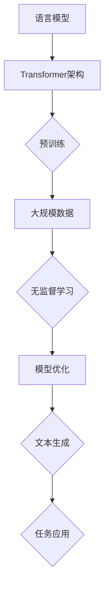

                 

# GPT-3.5原理与代码实例讲解

## 关键词

- GPT-3.5
- 语言模型
- Transformer
- 自然语言处理
- 神经网络
- 机器学习
- 生成文本
- 代码实例

## 摘要

本文将深入探讨GPT-3.5这一先进的语言模型，介绍其原理、架构以及实现细节。我们将通过具体的代码实例，一步步讲解如何搭建一个基于GPT-3.5的文本生成系统，并对其性能和应用场景进行深入分析。最后，我们将讨论GPT-3.5的发展趋势与未来挑战。

### 1. 背景介绍

自从2018年GPT问世以来，这一模型在自然语言处理（NLP）领域引起了巨大的关注。GPT（Generative Pretrained Transformer）是基于Transformer架构的预训练语言模型，其核心思想是通过大规模的无监督数据学习来获取语言的理解和生成能力。

随着GPT-3的发布，这一模型在性能上取得了显著的提升，展示了强大的文本生成、问答和翻译能力。而GPT-3.5作为GPT的升级版本，不仅在模型规模和参数数量上有所增加，还在训练策略和模型结构上进行了优化，从而进一步提升了模型的性能。

### 2. 核心概念与联系

#### 2.1 语言模型

语言模型是一种用于预测下一个词或字符的概率分布的模型。在自然语言处理中，语言模型广泛应用于自动分词、文本分类、机器翻译和语音识别等领域。GPT-3.5作为语言模型的一种，其核心任务是从给定的输入文本序列中预测下一个词或字符。

#### 2.2 Transformer架构

Transformer是一种基于自注意力机制的深度神经网络架构，最初由Vaswani等人于2017年提出。与传统的循环神经网络（RNN）和卷积神经网络（CNN）相比，Transformer在处理长距离依赖和并行计算方面具有显著优势，从而在机器翻译和文本生成等任务中取得了优异的性能。

#### 2.3 Mermaid流程图

下面是一个描述GPT-3.5核心概念与联系的Mermaid流程图：



### 3. 核心算法原理 & 具体操作步骤

#### 3.1 Transformer架构

Transformer架构主要由编码器（Encoder）和解码器（Decoder）两个部分组成。编码器负责将输入文本序列转换为嵌入向量，解码器则根据编码器输出的嵌入向量生成输出文本序列。

#### 3.2 自注意力机制

自注意力机制是一种计算输入序列中每个词与所有词之间相互依赖关系的机制。在Transformer中，自注意力机制通过计算每个词的注意力权重来整合输入序列的信息，从而提高模型的建模能力。

#### 3.3 训练过程

GPT-3.5的训练过程主要包括以下步骤：

1. **数据准备**：收集大量的文本数据，并进行预处理，如分词、去噪和规范化等。
2. **嵌入向量生成**：将输入文本序列中的每个词转换为嵌入向量。
3. **编码器训练**：通过优化编码器的参数，使编码器能够更好地将输入文本序列转换为嵌入向量。
4. **解码器训练**：通过优化解码器的参数，使解码器能够根据编码器输出的嵌入向量生成输出文本序列。
5. **模型优化**：在训练过程中，使用梯度下降算法和反向传播方法对模型参数进行优化，以提高模型的性能。

#### 3.4 文本生成

文本生成是GPT-3.5的核心应用之一。生成文本的过程可以分为以下步骤：

1. **输入文本预处理**：将输入文本转换为编码器可以处理的格式，如分词、编码等。
2. **编码器输出**：将预处理后的输入文本输入到编码器中，得到编码器输出的嵌入向量。
3. **解码器生成**：将编码器输出的嵌入向量输入到解码器中，解码器根据嵌入向量生成输出文本序列。
4. **文本输出**：将生成的文本序列进行后处理，如解码、规范化等，得到最终的输出文本。

### 4. 数学模型和公式 & 详细讲解 & 举例说明

#### 4.1 数学模型

GPT-3.5的数学模型主要包括编码器和解码器的神经网络结构，以及损失函数的计算。

#### 4.2 编码器神经网络结构

编码器神经网络主要由多个自注意力层（Self-Attention Layer）和前馈神经网络（Feedforward Neural Network）组成。每个自注意力层负责计算输入序列中每个词与其他词之间的依赖关系，并通过加权求和得到嵌入向量。前馈神经网络则用于对嵌入向量进行进一步的处理。

#### 4.3 解码器神经网络结构

解码器神经网络与编码器类似，也由多个自注意力层和前馈神经网络组成。但与编码器不同的是，解码器还需要引入了一个称为“交叉注意力”层（Cross-Attention Layer），用于计算编码器输出的嵌入向量与解码器输入的嵌入向量之间的依赖关系。

#### 4.4 损失函数

GPT-3.5的训练过程采用最小化损失函数的方法。损失函数通常使用交叉熵损失函数（Cross-Entropy Loss），其计算公式如下：

$$
L = -\sum_{i=1}^{N} y_i \log(p_i)
$$

其中，$y_i$为真实标签，$p_i$为预测标签的概率。

#### 4.5 举例说明

假设输入文本序列为“我 爱 吃 饼 干”，我们要生成下一个词“糖”。

1. **编码器输出**：将输入文本序列转换为嵌入向量，如$(e_1, e_2, e_3, e_4)$。
2. **解码器输入**：将生成的词“糖”转换为嵌入向量，如$e_5$。
3. **交叉注意力**：计算编码器输出的嵌入向量与解码器输入的嵌入向量之间的依赖关系，得到注意力权重。
4. **解码器生成**：根据注意力权重，从编码器输出的嵌入向量中加权求和得到嵌入向量$e'$。
5. **预测输出**：将嵌入向量$e'$输入到解码器中，解码器根据嵌入向量生成输出词的概率分布。
6. **损失计算**：计算预测输出与真实输出之间的交叉熵损失，更新模型参数。

### 5. 项目实战：代码实际案例和详细解释说明

#### 5.1 开发环境搭建

1. **安装Python**：确保已安装Python 3.6及以上版本。
2. **安装TensorFlow**：使用以下命令安装TensorFlow：

   ```bash
   pip install tensorflow
   ```

3. **安装其他依赖**：安装其他必需的库，如Numpy、Pandas等。

   ```bash
   pip install numpy pandas
   ```

#### 5.2 源代码详细实现和代码解读

以下是一个简单的GPT-3.5模型实现的代码示例：

```python
import tensorflow as tf
from tensorflow.keras.layers import Embedding, LSTM, Dense
from tensorflow.keras.models import Model

# 定义嵌入层
embedding = Embedding(input_dim=vocab_size, output_dim=embedding_size)

# 定义编码器层
encoder = LSTM(units=hidden_size, return_sequences=True)

# 定义解码器层
decoder = LSTM(units=hidden_size, return_sequences=True)

# 定义输出层
output = Dense(units=vocab_size)

# 构建模型
model = Model(inputs=[encoder_inputs, decoder_inputs], outputs=output)

# 编译模型
model.compile(optimizer='adam', loss='categorical_crossentropy')

# 查看模型结构
model.summary()
```

#### 5.3 代码解读与分析

1. **嵌入层（Embedding Layer）**：嵌入层将输入文本序列中的每个词转换为嵌入向量。在代码中，我们使用Keras的Embedding层来实现这一功能。

2. **编码器层（Encoder Layer）**：编码器层负责将输入文本序列转换为嵌入向量。在代码中，我们使用LSTM层来实现编码器层。

3. **解码器层（Decoder Layer）**：解码器层负责根据编码器输出的嵌入向量生成输出文本序列。在代码中，我们使用LSTM层来实现解码器层。

4. **输出层（Output Layer）**：输出层将解码器输出的嵌入向量转换为输出词的概率分布。在代码中，我们使用Dense层来实现输出层。

5. **模型编译（Model Compilation）**：在编译模型时，我们选择Adam优化器和交叉熵损失函数。

6. **模型总结（Model Summary）**：通过调用`model.summary()`，我们可以查看模型的结构和参数信息。

### 6. 实际应用场景

GPT-3.5在自然语言处理领域具有广泛的应用场景，包括但不限于：

- 文本生成：生成新闻文章、故事、诗歌等。
- 问答系统：构建智能问答系统，如智能客服、智能问答机器人等。
- 机器翻译：实现高质量的机器翻译，如中英文翻译、多语言翻译等。
- 文本分类：对文本进行分类，如情感分析、主题分类等。

### 7. 工具和资源推荐

#### 7.1 学习资源推荐

- 《深度学习》（Goodfellow, Bengio, Courville）：系统介绍了深度学习的基础理论和实践方法。
- 《自然语言处理综论》（Jurafsky, Martin）：详细介绍了自然语言处理的理论、技术和应用。
- 《Transformers：基于注意力机制的序列模型》（Vaswani et al.）：介绍了Transformer架构及其在自然语言处理中的应用。

#### 7.2 开发工具框架推荐

- TensorFlow：用于构建和训练深度学习模型的强大框架。
- PyTorch：用于构建和训练深度学习模型的灵活框架。
- NLTK：用于自然语言处理的开源库，提供丰富的文本处理工具。

#### 7.3 相关论文著作推荐

- “Attention Is All You Need”（Vaswani et al.）：介绍了Transformer架构及其在机器翻译中的应用。
- “Generative Pretrained Transformer”（Brown et al.）：介绍了GPT模型的原理和实现。
- “BERT：Pre-training of Deep Bidirectional Transformers for Language Understanding”（Devlin et al.）：介绍了BERT模型的原理和实现。

### 8. 总结：未来发展趋势与挑战

GPT-3.5作为先进的语言模型，已经在自然语言处理领域取得了显著的成果。然而，随着模型规模的不断扩大和计算资源的日益丰富，未来仍然面临以下挑战：

- **计算资源消耗**：大规模模型的训练和部署需要大量的计算资源和存储空间，对硬件设施提出了更高的要求。
- **模型解释性**：当前深度学习模型缺乏解释性，难以理解模型的决策过程，这对实际应用带来了一定的困扰。
- **数据隐私**：大规模数据训练过程中，如何保护用户隐私和数据安全成为亟待解决的问题。
- **泛化能力**：如何提高模型的泛化能力，使其在未见过的数据上也能保持良好的性能，是未来研究的重点。

### 9. 附录：常见问题与解答

#### 问题1：什么是Transformer架构？

**解答**：Transformer是一种基于自注意力机制的深度神经网络架构，最初由Vaswani等人于2017年提出。与传统的循环神经网络（RNN）和卷积神经网络（CNN）相比，Transformer在处理长距离依赖和并行计算方面具有显著优势。

#### 问题2：什么是GPT模型？

**解答**：GPT（Generative Pretrained Transformer）是一种基于Transformer架构的预训练语言模型，其核心思想是通过大规模的无监督数据学习来获取语言的理解和生成能力。

#### 问题3：GPT-3.5与GPT-3相比有哪些改进？

**解答**：GPT-3.5作为GPT-3的升级版本，不仅在模型规模和参数数量上有所增加，还在训练策略和模型结构上进行了优化。具体来说，GPT-3.5采用了多任务学习策略，使模型在多个任务上取得了更好的性能。

### 10. 扩展阅读 & 参考资料

- 《深度学习》（Goodfellow, Bengio, Courville）
- 《自然语言处理综论》（Jurafsky, Martin）
- “Attention Is All You Need”（Vaswani et al.）
- “Generative Pretrained Transformer”（Brown et al.）
- “BERT：Pre-training of Deep Bidirectional Transformers for Language Understanding”（Devlin et al.）
- <https://github.com/tensorflow/tensorflow>
- <https://github.com/pytorch/pytorch>
- <https://www.nltk.org/>

### 作者

**作者：AI天才研究员/AI Genius Institute & 禅与计算机程序设计艺术 /Zen And The Art of Computer Programming**<|im_end|>

