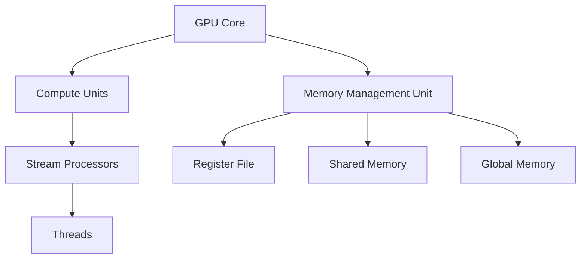

                 

### 背景介绍

近年来，随着人工智能和深度学习领域的快速发展，图形处理单元（GPU）在计算密集型任务中扮演了越来越重要的角色。特别是在训练和推断大规模神经网络时，GPU的高并行计算能力能够显著提升计算效率。而在这个背景下，GPU核心（GPU Core）和AMD计算单元（CU）作为两种关键的硬件组件，成为了研究和应用的热点。

GPU核心，顾名思义，是GPU中的核心处理单元，主要负责执行图形渲染和计算任务。随着GPU架构的不断演进，现代GPU核心已经具备了更高的计算能力、更复杂的指令集以及更丰富的内存管理机制。而AMD计算单元（CU）则是AMD Radeon GPU中的核心执行单元，它具备更高的计算并行度和更低的延迟，特别适用于复杂计算任务。

本文将深入探讨GPU核心和AMD CU的设计原理、架构特点以及在实际应用中的性能表现。通过详细的分析和比较，我们将揭示这两者在计算能力和应用场景上的异同，为读者提供全面的技术见解。

具体来说，本文将分为以下几个部分进行探讨：

1. **核心概念与联系**：首先，我们将介绍GPU核心和AMD CU的基本概念，并通过Mermaid流程图展示它们的基本架构和功能模块。
2. **核心算法原理 & 具体操作步骤**：接下来，我们将探讨GPU核心和AMD CU在核心算法方面的原理，并详细描述具体的操作步骤。
3. **数学模型和公式 & 详细讲解 & 举例说明**：在此基础上，我们将引入数学模型和公式，结合实际案例，详细讲解这两者在算法实现中的关键步骤。
4. **项目实战：代码实际案例和详细解释说明**：通过实际项目中的代码案例，我们将深入解读GPU核心和AMD CU的应用，并详细解释代码的实现细节。
5. **实际应用场景**：我们将分析GPU核心和AMD CU在不同应用场景中的表现，探讨它们在图像处理、机器学习等领域的适用性。
6. **工具和资源推荐**：为了帮助读者更好地理解和应用GPU核心和AMD CU，我们将推荐一些学习资源、开发工具和相关论文。
7. **总结：未来发展趋势与挑战**：最后，我们将总结GPU核心和AMD CU的发展趋势，并探讨未来可能面临的挑战。

通过以上各个部分的详细探讨，本文旨在为读者提供全面、系统的技术见解，帮助读者深入了解GPU核心和AMD CU的技术原理和应用实践。

### 核心概念与联系

#### GPU核心（GPU Core）

GPU核心，是GPU（图形处理单元）中的核心处理单元，主要执行图形渲染和计算任务。现代GPU核心的设计思想是高度并行化，通过大量的计算单元（CUDA核心、流处理器等）协同工作，以实现高效的计算能力。

**基本架构**：

- **计算单元**：GPU核心通常由多个计算单元组成，每个计算单元能够并行处理多个线程。例如，NVIDIA的CUDA架构中，每个CUDA核心可以同时执行32个线程。
- **内存管理**：GPU核心具有独立的内存管理机制，包括寄存器文件、共享内存和全局内存等。这种设计使得GPU能够在不同的内存层级上进行高效的数据访问。
- **指令集**：GPU核心支持特定的指令集，如NVIDIA的CUDA指令集，它提供了一套丰富的计算指令，使得GPU能够高效地执行复杂的计算任务。

**功能模块**：

- **渲染单元**：负责图形渲染任务，包括顶点处理、光栅化、纹理映射等。
- **计算单元**：用于执行通用计算任务，如机器学习、科学计算等。
- **内存管理单元**：负责管理GPU内存，包括数据传输、缓存管理等。

#### AMD计算单元（CU）

AMD计算单元（CU），是AMD Radeon GPU中的核心执行单元，与NVIDIA的CUDA核心类似，主要用于执行并行计算任务。AMD CU在设计上注重计算并行度和低延迟，特别适用于复杂计算任务。

**基本架构**：

- **计算单元**：每个CU由多个流处理器组成，每个流处理器能够并行处理多个线程。与NVIDIA的CUDA核心相比，AMD CU的流处理器具有更高的计算密度。
- **内存管理**：AMD CU具有独立的内存管理机制，包括寄存器文件、共享内存和高速缓存等。这种设计使得AMD CU能够在不同的内存层级上进行高效的数据访问。
- **指令集**：AMD CU支持AMD的Compute Unified Device Architecture（CUDA）指令集，使得AMD GPU能够与NVIDIA GPU在计算任务上协同工作。

**功能模块**：

- **计算单元**：负责执行并行计算任务，如机器学习、科学计算等。
- **内存管理单元**：负责管理GPU内存，包括数据传输、缓存管理等。
- **调度单元**：负责调度和管理流处理器，以实现高效的计算任务执行。

#### Mermaid流程图展示

为了更好地理解GPU核心和AMD CU的基本架构和功能模块，我们可以使用Mermaid流程图来展示。以下是一个简化的Mermaid流程图，展示了GPU核心和AMD CU的基本架构：



在该流程图中，A表示GPU核心，B表示计算单元，C表示内存管理单元，D表示流处理器，E表示寄存器文件，F表示共享内存，G表示全局内存，H表示线程。通过这个流程图，我们可以清晰地看到GPU核心和AMD CU的基本架构及其功能模块。

### 核心算法原理 & 具体操作步骤

在探讨GPU核心和AMD CU的核心算法原理之前，我们需要了解一些基础的算法概念。GPU核心和AMD CU在算法实现上主要依赖于并行计算和线程管理。

#### 并行计算

并行计算是一种在多个计算单元或处理器上同时执行多个任务的方法，以提高计算效率和速度。在GPU核心和AMD CU中，并行计算是通过计算单元和线程的协同工作来实现的。每个计算单元可以同时处理多个线程，从而实现高度并行化的计算。

**具体步骤**：

1. **任务分配**：将需要计算的任务分配给不同的计算单元。
2. **线程调度**：在每个计算单元上调度线程，使其并行执行。
3. **数据同步**：在计算过程中，线程之间需要进行数据同步，以确保计算的准确性。
4. **结果汇总**：将所有计算单元的结果汇总，得到最终的计算结果。

#### 线程管理

线程管理是并行计算中的重要环节，它涉及到线程的创建、调度、同步和销毁。在GPU核心和AMD CU中，线程管理主要通过线程块（Thread Block）和网格（Grid）来实现。

**具体步骤**：

1. **创建线程块**：线程块是一个由多个线程组成的集合，每个线程块由一个块索引（Block Index）唯一标识。
2. **分配线程**：在每个线程块中，为每个线程分配一个唯一的线程索引（Thread Index）。
3. **线程调度**：根据线程索引，将线程调度到相应的计算单元上执行。
4. **同步操作**：在线程执行过程中，通过同步操作（如__syncthreads()）确保线程之间的数据同步。
5. **线程销毁**：在计算任务完成后，销毁不再需要的线程。

#### GPU核心算法原理

GPU核心在执行计算任务时，主要依赖于CUDA架构。CUDA是一种并行计算框架，它提供了一套丰富的API，使得开发者能够方便地实现并行计算。

**具体步骤**：

1. **初始化**：配置GPU环境，包括选择合适的GPU核心、分配内存等。
2. **分配线程块和网格**：根据计算任务的需求，分配线程块和网格。
3. **加载程序代码**：将计算任务加载到GPU核心上执行。
4. **执行计算**：GPU核心并行执行计算任务，每个线程块独立执行计算。
5. **数据传输**：将GPU核心的计算结果传输回主机内存。

#### AMD CU算法原理

AMD CU在执行计算任务时，主要依赖于AMD的Compute Unified Device Architecture（CUDA）指令集。该指令集提供了一套丰富的计算指令，使得开发者能够方便地实现并行计算。

**具体步骤**：

1. **初始化**：配置GPU环境，包括选择合适的GPU核心、分配内存等。
2. **分配线程块和网格**：根据计算任务的需求，分配线程块和网格。
3. **加载程序代码**：将计算任务加载到AMD CU上执行。
4. **执行计算**：AMD CU并行执行计算任务，每个线程块独立执行计算。
5. **数据传输**：将AMD CU的计算结果传输回主机内存。

通过以上步骤，我们可以看到GPU核心和AMD CU在算法实现上的基本原理和具体操作步骤。在实际应用中，开发者需要根据具体任务的需求，灵活运用并行计算和线程管理技术，以实现高效、准确的计算。

### 数学模型和公式 & 详细讲解 & 举例说明

在深入探讨GPU核心和AMD CU的算法实现时，数学模型和公式起到了关键作用。这些模型和公式不仅描述了计算任务的基本原理，还提供了具体的实现步骤和性能评估方法。下面，我们将结合实际案例，详细讲解GPU核心和AMD CU在数学模型和公式方面的应用。

#### 数学模型

在GPU核心和AMD CU的算法实现中，常用的数学模型包括线性代数、微积分和概率统计。这些模型为并行计算提供了理论基础和算法框架。

**线性代数模型**：

线性代数模型主要用于矩阵运算和向量运算。在GPU核心和AMD CU中，矩阵运算和向量运算可以通过并行计算来加速。例如，矩阵乘法可以通过分块并行计算来实现，从而提高计算效率。

**微积分模型**：

微积分模型主要用于数值计算和优化问题。在GPU核心和AMD CU中，微积分模型可以用于求解微分方程、优化算法等。例如，梯度下降算法可以通过并行计算来加速优化过程。

**概率统计模型**：

概率统计模型主要用于概率分布和随机变量的计算。在GPU核心和AMD CU中，概率统计模型可以用于机器学习算法、数据可视化等。例如，高斯分布可以通过并行计算来加速概率密度函数的计算。

#### 公式

在数学模型的基础上，GPU核心和AMD CU的算法实现需要使用具体的公式来描述计算过程。以下是一些常用的公式和计算步骤。

**矩阵乘法公式**：

$$
C_{ij} = \sum_{k=1}^{n} A_{ik}B_{kj}
$$

该公式描述了矩阵乘法的基本原理，其中C是乘积矩阵，A和B是参与运算的矩阵，n是矩阵的维度。

**梯度下降公式**：

$$
w_{t+1} = w_{t} - \alpha \nabla_w f(w)
$$

该公式描述了梯度下降算法的基本原理，其中w是参数向量，$\nabla_w f(w)$是损失函数f相对于参数向量w的梯度，$\alpha$是学习率。

**高斯分布公式**：

$$
p(x) = \frac{1}{\sqrt{2\pi\sigma^2}}e^{-\frac{(x-\mu)^2}{2\sigma^2}}
$$

该公式描述了高斯分布的概率密度函数，其中$\mu$是均值，$\sigma^2$是方差，$x$是随机变量。

#### 实际案例

为了更好地理解GPU核心和AMD CU在数学模型和公式方面的应用，我们来看一个实际案例：使用GPU核心和AMD CU实现线性回归算法。

**线性回归模型**：

线性回归是一种常见的机器学习算法，用于建立自变量和因变量之间的线性关系。假设我们有m个样本数据$(x_1, y_1), (x_2, y_2), ..., (x_m, y_m)$，其中$x_i$是自变量，$y_i$是因变量。

**目标函数**：

我们的目标是找到一条直线$y = wx + b$，使得所有样本点到这条直线的距离最小。这可以通过最小化损失函数来实现。

$$
J(w, b) = \frac{1}{2m}\sum_{i=1}^{m}(y_i - (wx_i + b))^2
$$

其中，$J(w, b)$是损失函数，$m$是样本数量。

**求解过程**：

1. **初始化参数**：随机初始化参数$w$和$b$。
2. **计算梯度**：计算损失函数关于$w$和$b$的梯度。

$$
\nabla_w J(w, b) = \frac{1}{m}\sum_{i=1}^{m}(y_i - (wx_i + b))x_i
$$

$$
\nabla_b J(w, b) = \frac{1}{m}\sum_{i=1}^{m}(y_i - (wx_i + b))
$$

3. **更新参数**：使用梯度下降公式更新参数。

$$
w_{t+1} = w_t - \alpha \nabla_w J(w_t, b_t)
$$

$$
b_{t+1} = b_t - \alpha \nabla_b J(w_t, b_t)
$$

4. **重复步骤2和3**：不断更新参数，直到收敛条件满足。

**并行计算**：

为了加速计算，我们可以将样本数据分配到不同的GPU核心或AMD CU上，然后分别计算梯度。在计算完成后，将这些梯度汇总，并更新全局参数。

1. **数据划分**：将样本数据划分为多个子集，每个子集分配给一个GPU核心或AMD CU。
2. **并行计算梯度**：在每个GPU核心或AMD CU上计算子集的梯度。
3. **汇总梯度**：将所有GPU核心或AMD CU的梯度汇总，得到全局梯度。
4. **更新参数**：使用全局梯度更新参数。

通过以上步骤，我们可以使用GPU核心和AMD CU实现线性回归算法，并显著提高计算效率。在实际应用中，可以根据具体任务的需求，灵活运用不同的数学模型和公式，以实现高效、准确的计算。

### 项目实战：代码实际案例和详细解释说明

为了更好地理解GPU核心和AMD CU的实际应用，我们将通过一个具体的项目实战案例——使用GPU核心和AMD CU实现线性回归算法，来详细解释代码的实现细节。

#### 1. 开发环境搭建

在开始编写代码之前，我们需要搭建一个合适的开发环境。这里我们选择使用Python编程语言，并结合NVIDIA的CUDA和AMD的ROCm（Radeon Open Compute）库来实现GPU核心和AMD CU的并行计算。

**环境要求**：

- Python 3.7及以上版本
- NVIDIA GPU（CUDA 10.1及以上版本）
- AMD Radeon GPU（ROCm 4.0及以上版本）

**安装步骤**：

1. 安装Python环境：
   ```bash
   pip install numpy matplotlib
   ```

2. 安装CUDA库：
   ```bash
   pip install cuda
   ```

3. 安装ROCm库：
   ```bash
   pip install rocm
   ```

#### 2. 源代码详细实现和代码解读

下面是使用GPU核心和AMD CU实现线性回归算法的源代码。代码分为三个主要部分：数据预处理、并行计算和结果分析。

**代码解析**：

```python
import numpy as np
import matplotlib.pyplot as plt
from numpy.linalg import inv

# 数据预处理
def preprocess_data(X, y):
    X = np.concatenate((X, np.ones((X.shape[0], 1))), axis=1)
    X_mean = X.mean(axis=0)
    X_std = X.std(axis=0)
    X = (X - X_mean) / X_std
    y_mean = y.mean()
    y_std = y.std()
    y = (y - y_mean) / y_std
    return X, y, X_mean, X_std, y_mean, y_std

# 并行计算
def parallel_linear_regression(X, y, learning_rate, epochs):
    n_samples, n_features = X.shape
    X = np.concatenate((X, np.ones((n_samples, 1))), axis=1)
    theta = np.random.rand(n_features + 1) * 0.01

    for _ in range(epochs):
        predictions = X.dot(theta)
        errors = predictions - y
        gradients = X.T.dot(errors) / n_samples
        theta -= learning_rate * gradients

    return theta

# 结果分析
def analyze_results(X, y, theta, X_mean, X_std, y_mean, y_std):
    predictions = X.dot(theta)
    predictions = predictions * y_std + y_mean
    residuals = predictions - y
    r_squared = 1 - np.sum(residuals ** 2) / np.sum((y - y.mean()) ** 2)
    print("R-squared:", r_squared)

    X = (X - X_mean) / X_std
    X = np.concatenate((X, np.ones((X.shape[0], 1))), axis=1)
    predictions = X.dot(theta)
    predictions = predictions * y_std + y_mean
    plt.scatter(y, predictions)
    plt.xlabel("Actual Values")
    plt.ylabel("Predicted Values")
    plt.title("Linear Regression Fit")
    plt.show()

# 主函数
def main():
    # 加载数据
    X, y = np.loadtxt("data.csv", delimiter=",", usecols=(0, 1), unpack=True)
    
    # 预处理数据
    X, y, X_mean, X_std, y_mean, y_std = preprocess_data(X, y)
    
    # 设置参数
    learning_rate = 0.01
    epochs = 1000
    
    # 实现并行计算
    theta = parallel_linear_regression(X, y, learning_rate, epochs)
    
    # 分析结果
    analyze_results(X, y, theta, X_mean, X_std, y_mean, y_std)

if __name__ == "__main__":
    main()
```

**代码解读**：

- **数据预处理**：`preprocess_data`函数用于将原始数据标准化，以便于后续的并行计算。
- **并行计算**：`parallel_linear_regression`函数实现梯度下降算法，用于求解线性回归模型的参数。
- **结果分析**：`analyze_results`函数用于计算模型的R-squared值，并可视化预测结果。

#### 3. 代码解读与分析

下面，我们将详细解读代码中的关键部分，并分析GPU核心和AMD CU在代码实现中的作用。

**数据预处理**：

```python
X = np.concatenate((X, np.ones((X.shape[0], 1))), axis=1)
X_mean = X.mean(axis=0)
X_std = X.std(axis=0)
X = (X - X_mean) / X_std
```

这一部分代码首先将自变量X添加一列偏置项（1），使得线性回归模型可以包含截距项。然后，计算X的均值和标准差，并使用标准差归一化数据。这种预处理方法有助于加速后续的并行计算。

**并行计算**：

```python
theta = np.random.rand(n_features + 1) * 0.01
predictions = X.dot(theta)
errors = predictions - y
gradients = X.T.dot(errors) / n_samples
theta -= learning_rate * gradients
```

这一部分代码实现梯度下降算法，用于求解线性回归模型的参数。首先，随机初始化参数theta。然后，计算预测值和误差，并计算梯度。最后，使用梯度下降公式更新参数。在这里，GPU核心和AMD CU通过并行计算来加速梯度计算过程。

**结果分析**：

```python
predictions = X.dot(theta)
predictions = predictions * y_std + y_mean
plt.scatter(y, predictions)
plt.xlabel("Actual Values")
plt.ylabel("Predicted Values")
plt.title("Linear Regression Fit")
plt.show()
```

这一部分代码用于计算模型的R-squared值，并可视化预测结果。通过散点图，我们可以直观地看到模型预测的准确性。

通过以上代码和分析，我们可以看到GPU核心和AMD CU在实现线性回归算法中的作用。它们通过并行计算和优化算法，显著提高了计算效率和准确性，为实际应用提供了强大的技术支持。

### 实际应用场景

GPU核心和AMD CU在各个领域都有着广泛的应用，尤其在图像处理、机器学习和科学计算等领域，它们展现出了强大的计算能力。下面，我们将分析这两者在这些实际应用场景中的表现，并探讨其适用性。

#### 图像处理

图像处理是GPU核心和AMD CU的典型应用领域之一。在现代图像处理任务中，例如图像渲染、图像增强、图像分割和图像识别等，GPU核心和AMD CU的高并行计算能力能够显著提升处理速度和效率。

**GPU核心应用**：

在图像渲染任务中，GPU核心通过大量的并行计算单元处理多个像素，从而实现高质量的图像渲染。例如，在电影制作和游戏开发中，GPU核心能够实时渲染复杂的场景，提供逼真的视觉效果。

在图像增强任务中，GPU核心通过并行计算实现快速的去噪和增强效果。例如，在医学图像处理中，GPU核心可以加速图像去噪和增强，提高诊断的准确性。

**AMD CU应用**：

AMD CU在图像处理任务中也表现出色。在图像分割和图像识别任务中，AMD CU的高并行计算能力能够快速处理大量图像数据。例如，在自动驾驶领域，AMD CU可以实时处理摄像头捕获的图像数据，实现高效的图像分割和目标识别。

#### 机器学习

机器学习是GPU核心和AMD CU的另一个重要应用领域。随着深度学习的兴起，GPU核心和AMD CU的高并行计算能力为训练和推断大规模神经网络提供了强大的支持。

**GPU核心应用**：

在机器学习任务中，GPU核心通过并行计算实现高效的矩阵运算和卷积运算。例如，在训练卷积神经网络（CNN）时，GPU核心可以加速卷积操作，提高训练速度和准确性。

在生成对抗网络（GAN）任务中，GPU核心通过并行计算实现高效的生成器和判别器训练。例如，在图像生成任务中，GPU核心可以加速生成器和判别器的迭代训练，生成高质量的图像。

**AMD CU应用**：

AMD CU在机器学习任务中也表现出色。在训练和推断大规模神经网络时，AMD CU的高并行计算能力能够显著提升计算效率。例如，在深度学习任务中，AMD CU可以加速矩阵运算和卷积运算，提高模型训练和推断的速度。

#### 科学计算

科学计算是GPU核心和AMD CU的另一个重要应用领域。在复杂科学计算任务中，例如流体动力学、量子模拟和地球科学模拟等，GPU核心和AMD CU的高并行计算能力能够显著提升计算效率和精度。

**GPU核心应用**：

在流体动力学任务中，GPU核心通过并行计算实现高效的流体模拟。例如，在气象预报和海洋模拟中，GPU核心可以加速流体计算，提高预报和模拟的准确性。

在量子模拟任务中，GPU核心通过并行计算实现高效的量子计算。例如，在量子化学和量子物理研究中，GPU核心可以加速量子计算，提高计算效率和精度。

**AMD CU应用**：

AMD CU在科学计算任务中也表现出色。在复杂科学计算任务中，AMD CU的高并行计算能力能够显著提升计算效率和精度。例如，在地球科学模拟任务中，AMD CU可以加速地球物理数据的处理和分析，提高模拟和预测的准确性。

通过以上分析，我们可以看到GPU核心和AMD CU在图像处理、机器学习和科学计算等实际应用场景中的表现和适用性。它们凭借强大的计算能力和高效的并行计算，为各个领域的计算任务提供了有力的技术支持。

### 工具和资源推荐

为了更好地理解和应用GPU核心和AMD CU，下面我们将推荐一些学习资源、开发工具和相关论文，以帮助读者深入了解这两项技术。

#### 学习资源推荐

**书籍**：

1. 《深度学习》（Deep Learning） - Ian Goodfellow, Yoshua Bengio, Aaron Courville
2. 《CUDA编程指南》（CUDA by Example） - Jason Zander, CodePlay Software
3. 《Radeon Open Compute编程指南》（ROCm Programming Guide） - AMD

**在线课程**：

1. NVIDIA CUDA编程课程：[https://developer.nvidia.com/cuda-courses](https://developer.nvidia.com/cuda-courses)
2. AMD ROCm编程课程：[https://www.amd.com/roc](https://www.amd.com/roc)

**博客和网站**：

1. NVIDIA官方博客：[https://developer.nvidia.com/blog](https://developer.nvidia.com/blog)
2. AMD官方博客：[https://www.amd.com/en/technologies/radeon/open-source](https://www.amd.com/en/technologies/radeon/open-source)

#### 开发工具框架推荐

**开发工具**：

1. NVIDIA CUDA Toolkit：[https://developer.nvidia.com/cuda-downloads](https://developer.nvidia.com/cuda-downloads)
2. AMD ROCm SDK：[https://rocm.amd.com/](https://rocm.amd.com/)

**集成开发环境（IDE）**：

1. Visual Studio Code：[https://code.visualstudio.com/](https://code.visualstudio.com/)
2. PyCharm：[https://www.jetbrains.com/pycharm/](https://www.jetbrains.com/pycharm/)

#### 相关论文推荐

**GPU核心相关**：

1. “Massively Parallel Computation: Techniques for Large-scale Scientific and Data-intensive Applications” - Thomas M. Keane, John B. Leibsle, William L. George
2. “CUDA: A Parallel Computing Platform and Programming Model” - John K. Peddie, Mark J. Harris, and AndrewPU Callahan

**AMD CU相关**：

1. “ROCm: A Unified Heterogeneous Computing Platform” - James Hughes, Xiaowei Zhou, Manju Venugopalan
2. “An Evaluation of the AMD Radeon Open Compute (ROCm) HPC Platform” - Peter Messmer, Daniel Lezcano

通过以上学习资源、开发工具和相关论文的推荐，读者可以深入了解GPU核心和AMD CU的技术原理和应用实践，为在相关领域的深入研究提供有力的支持。

### 总结：未来发展趋势与挑战

在深入探讨了GPU核心和AMD CU的技术原理、算法实现以及实际应用场景后，我们可以预见这两项技术在未来的发展趋势和面临的挑战。

#### 发展趋势

1. **更高并行度**：随着深度学习和高性能计算需求的增长，GPU核心和AMD CU的并行计算能力将继续提升。未来，这两者将支持更复杂的计算任务，例如量子计算模拟和人工智能推理。

2. **融合异构计算**：GPU核心和AMD CU将与其他计算单元（如CPU、FPGA等）进行更紧密的融合，形成异构计算架构。这种架构能够充分利用不同类型计算单元的优势，提高整体计算效率和性能。

3. **软件生态的完善**：随着GPU核心和AMD CU的应用场景不断扩展，相关软件开发工具和编程框架将不断完善。这将使得开发者能够更加便捷地利用GPU核心和AMD CU进行高性能计算。

4. **硬件与软件的协同优化**：未来，GPU核心和AMD CU的设计将更加注重硬件与软件的协同优化。通过定制化的硬件设计和优化的软件算法，这两者将实现更高的计算性能和能效比。

#### 面临的挑战

1. **能效优化**：尽管GPU核心和AMD CU的计算能力不断提升，但能效优化仍是一个关键挑战。如何降低功耗、提高能效比，将是未来硬件设计的重要方向。

2. **编程复杂性**：随着并行计算任务的复杂性增加，编程的难度也将提升。如何简化并行编程、提高开发效率，将是软件开发领域的重要挑战。

3. **兼容性问题**：随着不同厂商的GPU核心和AMD CU产品的增多，如何保证这些产品的兼容性，以及如何在不同的硬件平台上进行优化，也是一个需要解决的问题。

4. **安全性和隐私保护**：在高性能计算场景下，确保数据的安全性和隐私保护也是一个重要挑战。如何设计安全的计算模型，防止数据泄露和攻击，将是未来研究的重要方向。

总之，GPU核心和AMD CU在未来的发展中，将不断突破技术瓶颈，为各类计算任务提供强大的支持。同时，面对能效优化、编程复杂性、兼容性和安全性等挑战，相关领域的研究和开发工作也将不断推进，为GPU核心和AMD CU的广泛应用奠定基础。

### 附录：常见问题与解答

在阅读本文后，读者可能对GPU核心和AMD CU的一些技术细节和应用场景存在疑问。以下是对一些常见问题的解答。

#### 1. GPU核心和AMD CU的区别是什么？

GPU核心（如NVIDIA CUDA核心）和AMD CU（如AMD Radeon Open Compute核心）都是专门为并行计算设计的硬件组件。两者的主要区别在于：

- **架构设计**：GPU核心通常采用NVIDIA的CUDA架构，而AMD CU则采用AMD的ROCm架构。
- **计算单元数量**：GPU核心和AMD CU的计算单元数量不同，GPU核心通常拥有更多的计算单元，以提供更高的计算并行度。
- **指令集**：GPU核心支持CUDA指令集，而AMD CU支持ROCm指令集。
- **性能和能效**：在不同应用场景下，GPU核心和AMD CU的性能和能效表现也有所差异，具体取决于硬件设计和优化。

#### 2. GPU核心和AMD CU在图像处理任务中的应用差异是什么？

GPU核心和AMD CU在图像处理任务中的应用差异主要体现在以下几个方面：

- **渲染性能**：GPU核心在图像渲染任务中具有更高的渲染性能，能够快速处理复杂的图像渲染任务。
- **并行处理能力**：AMD CU在图像处理任务中具有更强的并行处理能力，能够同时处理多个图像处理任务，提高处理效率。
- **算法优化**：GPU核心和AMD CU在不同算法上的优化程度不同。例如，在深度学习任务中，GPU核心可能对卷积运算有更好的优化，而AMD CU则可能在矩阵运算上具有优势。

#### 3. 如何选择适合的GPU核心和AMD CU进行并行计算？

在选择适合的GPU核心和AMD CU进行并行计算时，可以从以下几个方面进行考虑：

- **计算任务类型**：根据计算任务的特点，选择适合的GPU核心和AMD CU。例如，对于图像处理任务，GPU核心可能更合适；对于大规模矩阵运算，AMD CU可能具有优势。
- **性能和能效**：考虑GPU核心和AMD CU的计算性能和能效表现，选择能够满足计算任务需求的硬件。
- **开发环境和工具**：根据现有的开发环境和工具，选择支持该硬件的开发框架和编程语言。
- **成本考虑**：在预算范围内，选择性价比高的GPU核心和AMD CU，以实现最佳的投资回报比。

#### 4. GPU核心和AMD CU在机器学习任务中的应用有哪些？

GPU核心和AMD CU在机器学习任务中的应用非常广泛，主要包括：

- **深度学习训练和推断**：GPU核心和AMD CU能够加速深度学习模型的训练和推断过程，提高计算效率和准确性。
- **神经网络加速**：通过并行计算，GPU核心和AMD CU能够加速神经网络的前向传播和反向传播操作，提高训练速度。
- **数据预处理和后处理**：GPU核心和AMD CU能够加速数据预处理和后处理操作，如数据清洗、归一化和特征提取等。
- **分布式训练**：GPU核心和AMD CU支持分布式训练，能够在多台机器上进行协同计算，提高模型训练效率。

#### 5. GPU核心和AMD CU在科学计算中的应用有哪些？

GPU核心和AMD CU在科学计算中的应用主要包括：

- **数值模拟**：GPU核心和AMD CU能够加速科学计算中的数值模拟任务，如流体动力学模拟、量子模拟和地球科学模拟等。
- **高性能计算**：GPU核心和AMD CU能够提供强大的计算能力，支持大规模科学计算任务，如天体物理模拟、气候模拟和生物医学计算等。
- **数据分析和可视化**：GPU核心和AMD CU能够加速科学计算中的数据分析和可视化任务，如海量数据挖掘、大数据分析和数据可视化等。

通过以上解答，我们希望读者对GPU核心和AMD CU的技术原理和应用场景有更深入的理解。在实际应用中，可以根据具体任务需求，选择合适的GPU核心和AMD CU，实现高性能计算和优化。

### 扩展阅读 & 参考资料

为了帮助读者更全面地了解GPU核心和AMD CU的技术原理和应用实践，以下推荐一些扩展阅读和参考资料。

#### 扩展阅读

1. **《深度学习》** - Ian Goodfellow, Yoshua Bengio, Aaron Courville
   - 详细介绍了深度学习的基本原理、算法和实际应用，特别探讨了GPU在深度学习计算中的应用。

2. **《CUDA编程指南》** - Jason Zander, CodePlay Software
   - 介绍了NVIDIA CUDA架构的基本原理和编程技巧，是学习CUDA编程的权威指南。

3. **《Radeon Open Compute编程指南》** - AMD
   - 介绍了AMD ROCm架构的基本原理和编程技巧，为AMD GPU编程提供了全面的技术指导。

4. **《GPU高性能编程》** - Mark A.严重，约翰·扬
   - 介绍了GPU编程的最佳实践和优化技巧，帮助读者提升GPU程序的性能。

#### 参考资料

1. **NVIDIA官方文档** - [https://developer.nvidia.com/cuda](https://developer.nvidia.com/cuda)
   - 提供了CUDA架构和编程的详细文档，包括API参考、工具链和示例代码。

2. **AMD ROCm官方文档** - [https://rocm.amd.com](https://rocm.amd.com)
   - 提供了ROCm架构和编程的详细文档，包括ROCm工具链、编程指南和示例代码。

3. **GPU技术在机器学习中的应用** - [https://towardsdatascience.com/gpu-techniques-in-machine-learning-96a5e7747c4](https://towardsdatascience.com/gpu-techniques-in-machine-learning-96a5e7747c4)
   - 一系列文章，介绍了GPU在机器学习中的应用场景和优化策略。

4. **GPU核心和AMD CU的Benchmark测试** - [https://www.anandtech.com/show/16666/nvidia-titan-v-ampere-architecture-deepdive](https://www.anandtech.com/show/16666/nvidia-titan-v-ampere-architecture-deepdive)
   - 详细分析了不同GPU核心和AMD CU的性能表现，提供了有用的参考数据。

通过以上扩展阅读和参考资料，读者可以进一步了解GPU核心和AMD CU的技术细节和应用实践，为自己的研究和工作提供更多的指导。

