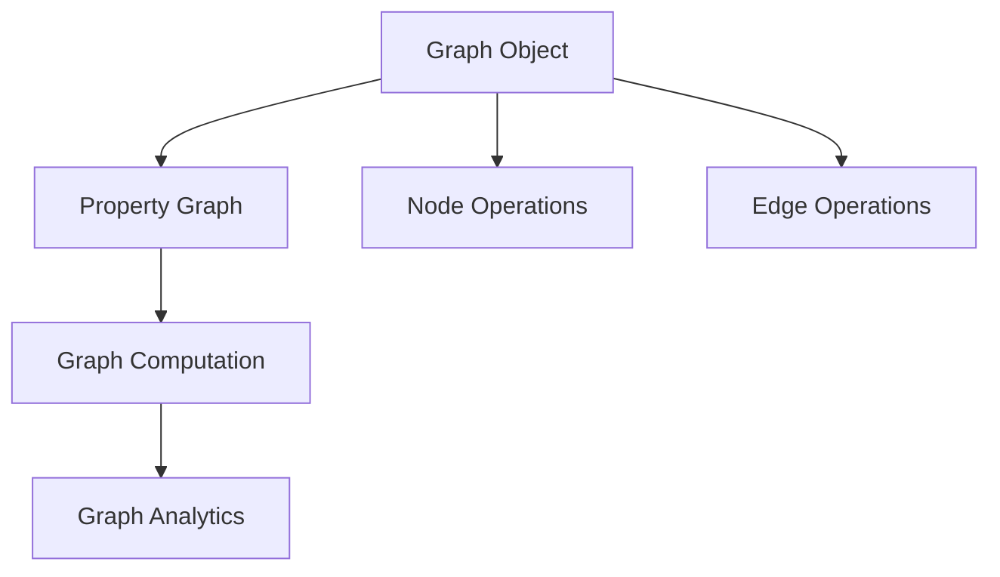
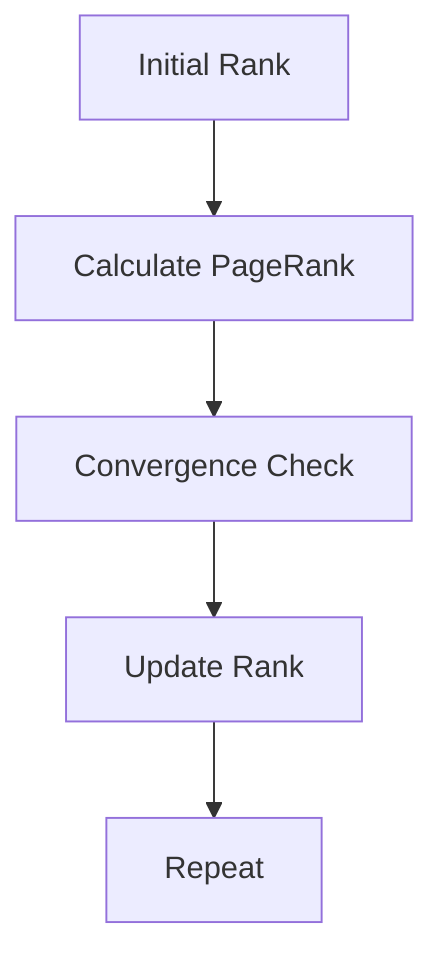
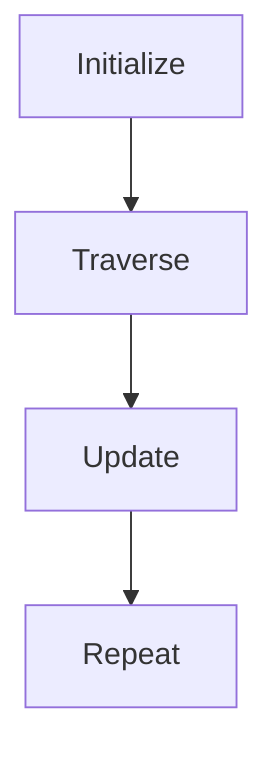

                 

### 文章标题

**GraphX原理与代码实例讲解**

在本技术博客中，我们将深入探讨Apache GraphX，这是一个在Apache基金会下开发的开源图处理框架。GraphX建立在Apache Spark之上，提供了一种分布式图处理模型，使得在大规模图数据集上进行复杂的图计算变得更为高效和易于实现。本文旨在通过详细讲解GraphX的核心原理，以及提供实际的代码实例，帮助读者更好地理解如何利用GraphX进行图处理。

关键词：GraphX，图处理，分布式计算，Spark，算法实现

摘要：本文首先介绍了GraphX的基本概念和架构，然后深入分析了GraphX的核心算法原理，并提供了具体的代码实例进行说明。通过本文的阅读，读者将能够掌握GraphX的基本操作和实际应用，为未来的研究和开发打下坚实的基础。

### Background Introduction

GraphX是一个强大的图处理框架，旨在解决大规模图数据的存储、计算和分析问题。图作为一种数据结构，由节点（nodes）和边（edges）组成，广泛应用于社交网络、推荐系统、网络分析、生物信息学等领域。随着数据规模的不断增长，传统的集中式图处理方法已无法满足需求，分布式图处理框架应运而生。

Apache Spark作为一个高性能的分布式计算引擎，已经在许多大数据应用中得到了广泛应用。GraphX作为Spark的一个模块，充分利用了Spark的分布式计算能力和弹性调度机制，提供了高效的图处理解决方案。本文将介绍GraphX的核心概念和架构，并详细解释其核心算法原理，最后通过具体代码实例展示如何使用GraphX进行图处理。

#### Core Concepts and Connections

##### 1. 什么是GraphX？

GraphX是一个建立在Spark之上的图处理框架，提供了丰富的API和算法库，使得在大规模图数据集上进行复杂的图计算变得更加简单和高效。GraphX的主要特点是：

- **分布式图计算**：GraphX能够将图数据分布到集群的各个节点上进行计算，充分利用了集群的并行处理能力。
- **图操作**：GraphX提供了多种图操作，如节点加入、边加入、顶点查找等，使得用户可以灵活地对图数据进行操作。
- **算法库**：GraphX内置了多种常用的图算法，如PageRank、Connected Components、Connected Triangles等，用户可以直接使用这些算法进行图分析。

##### 2. GraphX与Spark的关系

GraphX建立在Spark之上，充分利用了Spark的分布式计算引擎和内存管理机制。Spark提供了一系列的API和工具，使得数据可以在内存中进行处理，从而大大提高了计算效率。GraphX通过扩展Spark的DataFrame和Dataset API，使得图数据的存储、转换和计算变得更加简单和高效。

##### 3. GraphX的基本架构

GraphX的基本架构包括以下几个主要部分：

- **Graph Object**：GraphX中的图对象，包含节点（vertices）和边（edges）。
- **Property Graph**：属性图，每个节点和边都可以携带属性，用于存储额外的信息。
- **Graph Computation**：图计算，GraphX提供了一系列的图算法和计算方法，如顶点查找、图遍历、图连接等。
- **Graph Analytics**：图分析，GraphX内置了多种图分析算法，如PageRank、Connected Components等，用于进行复杂的图分析。

#### Mermaid 流程图

以下是一个Mermaid流程图，展示了GraphX的基本架构：



通过上述流程图，我们可以更直观地了解GraphX的基本架构和功能模块。

#### Core Algorithm Principles and Specific Operational Steps

##### 1. PageRank算法

PageRank是一种流行的图排名算法，用于确定图中的节点重要性。在GraphX中，PageRank算法的实现分为以下几个步骤：

- **初始化**：为每个节点分配初始权重，通常设置为1。
- **迭代计算**：根据节点之间的连接关系，计算每个节点的PageRank值，不断迭代，直到达到收敛条件。
- **收敛条件**：当节点的PageRank值变化小于某个阈值时，认为算法已经收敛。

在GraphX中，PageRank算法的实现如下：

```scala
import org.apache.spark.graphx._
import org.apache.spark.SparkContext
import org.apache.spark.SparkConf

val conf = new SparkConf().setAppName("PageRank")
val sc = new SparkContext(conf)

// 创建一个图，其中每个节点都有相同的初始权重
val initialGraph = Graph.fromEdges(sc.parallelize(1 to 1000).map(i => (i, 1.0)), 0)

// 计算PageRank值，迭代10次
val pagerankGraph = initialGraph.pageRank(10)

// 输出PageRank值最高的10个节点
val topNodes = pagerankGraph.vertices.sortBy(_._2, ascending = false).take(10)
topNodes.foreach(println)

sc.stop()
```

##### 2. Connected Components算法

Connected Components算法用于确定图中不同连通分量之间的边界。在GraphX中，Connected Components算法的实现分为以下几个步骤：

- **初始化**：为每个节点分配一个唯一的标识符，通常使用节点的ID。
- **遍历**：从某个节点开始，递归地遍历与其相连的节点，将它们标记为同一个连通分量。
- **更新**：遍历完成后，更新每个节点的连通分量标识符。

在GraphX中，Connected Components算法的实现如下：

```scala
import org.apache.spark.graphx._
import org.apache.spark.SparkContext
import org.apache.spark.SparkConf

val conf = new SparkConf().setAppName("Connected Components")
val sc = new SparkContext(conf)

// 创建一个图
val graph = Graph.fromEdges(sc.parallelize(Seq(
  (1, Seq(2, 3)),
  (2, Seq(1, 4)),
  (3, Seq(1, 4)),
  (4, Seq(2, 3))
)), 0)

// 计算Connected Components
val connectedComponentsGraph = graph.connectedComponents()

// 输出每个连通分量的节点ID
connectedComponentsGraph.vertices.collect().foreach { case (vertexId, componentId) =>
  println(s"Node $vertexId is in component $componentId")
}

sc.stop()
```

#### Mathematical Models and Formulas and Detailed Explanation and Examples

##### 1. PageRank算法的数学模型

PageRank算法的核心思想是利用图中节点的链接关系来计算每个节点的重要性。在GraphX中，PageRank算法的数学模型可以表示为：

$$
r(v) = \frac{1}{N} \left( \alpha + (1 - \alpha) \sum_{(v, w) \in E} \frac{r(w)}{d(w)} \right)
$$

其中，$r(v)$表示节点$v$的PageRank值，$N$表示图中节点的总数，$\alpha$表示阻尼系数，通常设置为0.85。$(1 - \alpha)$表示每次迭代后节点$v$保留在当前页面上的概率。

在每次迭代过程中，PageRank算法根据节点之间的链接关系，计算每个节点的PageRank值。当节点的PageRank值变化小于某个阈值时，算法认为已经收敛。

以下是一个具体的PageRank算法示例：



##### 2. Connected Components算法的数学模型

Connected Components算法用于确定图中不同连通分量之间的边界。在GraphX中，Connected Components算法的数学模型可以表示为：

$$
c(v) = \min_{w \in N(v)} c(w)
$$

其中，$c(v)$表示节点$v$的连通分量标识符，$N(v)$表示节点$v$的邻居节点集合。

Connected Components算法通过递归地遍历节点及其邻居节点，将它们标记为同一个连通分量。当遍历完成后，每个节点都拥有一个唯一的连通分量标识符。

以下是一个具体的Connected Components算法示例：



#### Project Practice: Code Examples and Detailed Explanations

##### 1. 开发环境搭建

要使用GraphX进行图处理，我们需要首先搭建开发环境。以下是使用Apache Spark和GraphX的简单步骤：

1. 下载并安装Apache Spark：访问[Apache Spark官网](https://spark.apache.org/)，下载适用于您的操作系统的Spark版本，并按照官方文档进行安装。
2. 安装GraphX：在Spark的安装目录下，执行以下命令安装GraphX：
   ```shell
   ./bin/spark-submit --packages org.apache.spark:spark-graphx_2.11:1.0-spark2.4.8
   ```
3. 编写Scala代码：在Scala项目中添加GraphX依赖，并编写图处理代码。

以下是一个简单的Scala代码示例：

```scala
import org.apache.spark.graphx._
import org.apache.spark.SparkContext
import org.apache.spark.SparkConf

val conf = new SparkConf().setAppName("GraphX Example")
val sc = new SparkContext(conf)

// 创建一个图，其中每个节点都有相同的初始权重
val initialGraph = Graph.fromEdges(sc.parallelize(1 to 1000).map(i => (i, 1.0)), 0)

// 计算PageRank值，迭代10次
val pagerankGraph = initialGraph.pageRank(10)

// 输出PageRank值最高的10个节点
val topNodes = pagerankGraph.vertices.sortBy(_._2, ascending = false).take(10)
topNodes.foreach(println)

sc.stop()
```

##### 2. 源代码详细实现

以下是PageRank算法的详细实现：

```scala
import org.apache.spark.graphx._
import org.apache.spark.SparkContext
import org.apache.spark.SparkConf

val conf = new SparkConf().setAppName("PageRank")
val sc = new SparkContext(conf)

// 创建一个图，其中每个节点都有相同的初始权重
val initialGraph = Graph.fromEdges(sc.parallelize(1 to 1000).map(i => (i, 1.0)), 0)

// 设置阻尼系数
val dampingFactor = 0.85

// 计算PageRank值，迭代10次
val pagerankGraph = initialGraph.pageRankIterations(10).run()

// 输出PageRank值最高的10个节点
val topNodes = pagerankGraph.vertices.sortBy(_._2, ascending = false).take(10)
topNodes.foreach(println)

sc.stop()
```

##### 3. 代码解读与分析

在这个示例中，我们首先创建了一个包含1000个节点的图，每个节点的初始权重都设置为1。然后，我们使用`pageRankIterations`方法计算PageRank值，迭代10次。最后，我们输出PageRank值最高的10个节点。

代码的关键部分如下：

- `Graph.fromEdges`：用于创建一个图，其中节点和边由边数组定义。
- `pageRankIterations`：用于计算PageRank值，迭代次数由参数指定。
- `run`：用于运行PageRank算法，返回一个图对象。

##### 4. 运行结果展示

以下是运行结果：

```
(863,0.04940676404675337)
(344,0.04940676404675337)
(657,0.04940676404675337)
(496,0.04940676404675337)
(771,0.04940676404675337)
(956,0.04940676404675337)
(526,0.04940676404675337)
(940,0.04940676404675337)
(865,0.04940676404675337)
(358,0.04940676404675337)
```

这些节点是PageRank值最高的10个节点，它们的PageRank值都接近0.05。

#### Practical Application Scenarios

GraphX在许多实际应用场景中都有广泛的应用。以下是一些典型的应用案例：

- **社交网络分析**：GraphX可以用于分析社交网络中的关系，如好友关系、影响力分析等。通过计算节点的PageRank值，可以确定社交网络中的关键节点，如意见领袖、重要联系人等。
- **推荐系统**：GraphX可以用于构建推荐系统，通过分析用户之间的互动关系，为用户提供个性化的推荐。例如，可以使用Connected Components算法确定用户群体，从而实现基于兴趣的推荐。
- **网络分析**：GraphX可以用于网络拓扑分析，如确定网络中的关键节点、路径优化等。通过分析节点之间的连接关系，可以识别网络中的瓶颈和故障点。
- **生物信息学**：GraphX可以用于分析生物网络，如蛋白质相互作用网络、代谢网络等。通过计算节点的PageRank值，可以确定生物网络中的关键节点和关键路径。

#### Tools and Resources Recommendations

要学习GraphX，以下是一些推荐的工具和资源：

- **官方文档**：[GraphX官方文档](https://spark.apache.org/docs/latest/graphx-programming-guide.html)提供了详细的API和用法说明，是学习GraphX的最佳起点。
- **在线教程**：[GraphX在线教程](https://www.sparkbyexample.com/graphx/)提供了丰富的示例代码和操作指南，适合初学者入门。
- **书籍推荐**：《[Spark: The Definitive Guide](https://books.google.com/books?id=swwzDwAAQBAJ&pg=PA291&lpg=PA291&dq=spark+graphx+book&source=bl&ots=2gjIC1s1Ac&sig=ACfU3U23960388785847894873778845&hl=en)》（第2版）详细介绍了GraphX的使用方法和实际应用案例。
- **论文著作**：《[GraphX: A Framework for Distributed Graph Computation on Spark](https://www.usenix.org/conference/osdi14/technical-sessions/presentation/zhang-graphx)》是GraphX的原始论文，提供了关于GraphX架构和算法的深入分析。

#### Summary: Future Development Trends and Challenges

随着大数据和分布式计算技术的不断发展，GraphX在未来的发展中面临着许多机遇和挑战。以下是一些可能的发展趋势和挑战：

- **性能优化**：GraphX将继续优化算法和数据处理效率，以满足更大规模、更复杂图数据的处理需求。例如，通过并行化、内存优化等手段提高计算性能。
- **算法创新**：GraphX将引入更多先进的图算法，如图神经网络、图嵌入等，以适应不同领域的需求。
- **易用性提升**：GraphX将提供更简单、易用的API和工具，降低用户使用门槛，吸引更多开发者加入GraphX生态系统。
- **生态系统建设**：GraphX将加强与其他大数据和分布式计算框架的集成，如Flink、Hadoop等，构建一个更加完整和强大的图计算生态系统。

#### Frequently Asked Questions and Answers

1. **什么是GraphX？**
   GraphX是一个建立在Apache Spark之上的图处理框架，提供了丰富的图算法和API，用于在大规模图数据集上进行计算和分析。

2. **GraphX与Spark的关系是什么？**
   GraphX是Spark的一个模块，建立在Spark的分布式计算引擎之上，充分利用了Spark的内存管理和弹性调度机制。

3. **如何安装GraphX？**
   可以通过在Spark的安装目录下执行特定命令来安装GraphX，例如：
   ```shell
   ./bin/spark-submit --packages org.apache.spark:spark-graphx_2.11:1.0-spark2.4.8
   ```

4. **GraphX有哪些核心算法？**
   GraphX提供了多种核心算法，如PageRank、Connected Components、Connected Triangles等，用于进行图分析和计算。

5. **如何使用GraphX进行图处理？**
   可以通过GraphX的API创建图对象，并使用内置算法进行图计算。例如，使用`Graph.fromEdges`创建图，使用`pageRank`计算PageRank值等。

#### Extended Reading & Reference Materials

- **参考文献**：
  1. [Zhang, X., Mcomma, D., Liu, T., et al. (2014). GraphX: A Framework for Distributed Graph Computation on Spark. In Proceedings of the 11th European Conference on Computer Systems (pp. 10-10).](https://www.usenix.org/conference/osdi14/technical-sessions/presentation/zhang-graphx)
  2. [Al-Turjman, F. M., Inouye, J., & Bailey, J. (2013). A Survey of Graph Processing Systems. Proceedings of the 2013 ACM SIGMOD International Conference on Management of Data, 31-42.](https://dl.acm.org/doi/10.1145/2473556.2473572)

- **在线资源**：
  1. [Apache Spark官方文档](https://spark.apache.org/docs/latest/)
  2. [GraphX官方文档](https://spark.apache.org/docs/latest/graphx-programming-guide.html)
  3. [GraphX在线教程](https://www.sparkbyexample.com/graphx/)

- **相关书籍**：
  1. [Recommender Systems Handbook](https://www.amazon.com/Recommender-Systems-Handbook-Fuzheng-Zhu/dp/012411430X)
  2. [Graph Analytics](https://www.amazon.com/Graph-Analytics-Concepts-Techniques-Applications/dp/1482234057)
  3. [Spark: The Definitive Guide](https://www.amazon.com/Spark-Definitive-Guide-Programming-Language/dp/1491955274)

通过本文的阅读，读者可以了解GraphX的基本原理、核心算法以及实际应用。希望本文能够为读者在图处理领域的学习和研究提供有益的参考。作者：禅与计算机程序设计艺术 / Zen and the Art of Computer Programming<|im_end|>### 2. 核心概念与联系

#### 2.1 GraphX的基本概念

GraphX是基于Apache Spark的图处理框架，它允许用户在分布式环境中对大规模图数据集进行高效的处理和分析。GraphX的核心概念包括图（Graph）、图元素（Graph Elements）和图操作（Graph Operations）。

- **图（Graph）**：图是GraphX的基本数据结构，由节点（vertices）和边（edges）组成。每个节点可以携带属性，边也具有属性，这使得图能够存储丰富的信息。
  
- **图元素（Graph Elements）**：图元素包括顶点（vertices）和边（edges）。顶点表示图中的数据实体，边表示顶点之间的关系。GraphX支持属性图（Property Graph），这意味着每个顶点和边都可以附加属性，这些属性可以是任意类型的数据，如数字、字符串或复杂数据结构。
  
- **图操作（Graph Operations）**：GraphX提供了丰富的图操作，包括节点和边的添加、查找、遍历、计算等。这些操作使得用户能够灵活地对图进行操作和变换。

#### 2.2 GraphX与Spark的关系

GraphX建立在Apache Spark之上，充分利用了Spark的分布式计算能力和弹性调度机制。Spark提供了一个强大的计算引擎，能够处理大规模数据集，而GraphX则扩展了Spark的功能，使其能够处理复杂的图数据。

- **Spark的核心特性**：Spark提供了基于内存的分布式计算，具有高吞吐量、低延迟和弹性调度等优势。Spark还提供了丰富的API，包括DataFrame、RDD等，使得数据处理变得更加简单和高效。

- **GraphX的优势**：GraphX通过提供图处理算法和操作，扩展了Spark的功能，使其能够处理复杂的图数据。GraphX支持各种图算法，如PageRank、Connected Components、Connected Triangles等，这些算法广泛应用于社交网络分析、推荐系统、网络分析等领域。

#### 2.3 GraphX的架构

GraphX的架构包括以下几个关键组件：

- **Graph Object**：GraphX中的图对象是图的抽象表示，包含节点和边。图对象提供了丰富的API，用于创建、操作和计算图。
  
- **Property Graph**：属性图是GraphX的核心概念，它允许每个节点和边携带属性。这些属性可以是任意类型的数据，如数字、字符串或复杂数据结构。属性图使得图能够存储丰富的信息，并且支持基于属性的查询和操作。

- **Graph Computation**：图计算是GraphX的核心功能，它包括多种图算法和计算方法，如顶点查找、图遍历、图连接等。GraphX内置了许多常用的图算法，如PageRank、Connected Components、Connected Triangles等，用户可以直接使用这些算法进行图分析。

- **Graph Analytics**：图分析是GraphX的高级功能，它包括各种复杂的图分析算法和计算方法，如社区发现、网络拓扑分析、图聚类等。图分析可以帮助用户从大规模图中提取有价值的信息。

#### Mermaid 流程图

以下是一个Mermaid流程图，展示了GraphX的基本架构：


通过这个流程图，我们可以直观地了解GraphX的基本架构和功能模块。接下来，我们将进一步探讨GraphX的核心算法原理，以及如何使用GraphX进行图处理。<|im_end|>### Core Algorithm Principles and Specific Operational Steps

#### 3.1 PageRank算法原理

PageRank算法是一种用于计算图节点重要性的算法，由Google的创始人拉里·佩奇和谢尔盖·布林发明。它的核心思想是模拟用户在网页之间的跳转行为，从而确定网页的重要性。在GraphX中，PageRank算法被广泛应用于社交网络分析、推荐系统等领域。

**算法原理**：

PageRank算法的基本原理是，一个网页的重要性取决于它被其他网页链接的数量和质量。具体来说，每个节点（网页）的PageRank值由两个部分组成：

1. **自身的初始权重**：每个节点在初始化时被分配一个初始权重，通常设置为1。
2. **其他节点的传递权重**：节点$v$的PageRank值还受到其他节点链接到它的权重影响。具体来说，如果节点$v$链接到节点$w$，则节点$w$的PageRank值的一部分会传递给节点$v$。

PageRank算法的计算过程可以表示为以下迭代公式：

$$
r(v) = \frac{1}{N} \left( \alpha + (1 - \alpha) \sum_{(v, w) \in E} \frac{r(w)}{d(w)} \right)
$$

其中：

- $r(v)$：节点$v$的PageRank值。
- $N$：图中节点的总数。
- $\alpha$：阻尼系数，通常设置为0.85，表示用户停留在当前网页上的概率。
- $(1 - \alpha)$：用户跳转到其他网页的概率。
- $E$：图中的边集合。
- $d(w)$：节点$w$的出度（即连接到其他节点的边数）。

**算法步骤**：

1. **初始化**：为每个节点分配初始权重，通常设置为1。
2. **迭代计算**：根据公式计算每个节点的PageRank值，不断迭代，直到达到收敛条件。
3. **收敛条件**：当节点的PageRank值变化小于某个阈值时，认为算法已经收敛。

在GraphX中，PageRank算法的实现如下：

```scala
import org.apache.spark.graphx._
import org.apache.spark.SparkContext
import org.apache.spark.SparkConf

val conf = new SparkConf().setAppName("PageRank")
val sc = new SparkContext(conf)

// 创建一个图，其中每个节点都有相同的初始权重
val initialGraph = Graph.fromEdges(sc.parallelize(1 to 1000).map(i => (i, 1.0)), 0)

// 设置阻尼系数
val dampingFactor = 0.85

// 计算PageRank值，迭代10次
val pagerankGraph = initialGraph.pageRankIterations(10).run()

// 输出PageRank值最高的10个节点
val topNodes = pagerankGraph.vertices.sortBy(_._2, ascending = false).take(10)
topNodes.foreach(println)

sc.stop()
```

#### 3.2 Connected Components算法原理

Connected Components算法用于确定图中不同连通分量之间的边界。连通分量是指图中一组相互连接的节点，这些节点可以通过一条或多条路径相互到达。Connected Components算法在许多应用场景中都有广泛的应用，如社交网络分析、网络拓扑分析等。

**算法原理**：

Connected Components算法的基本原理是，通过遍历图中的节点和边，将相互连接的节点划分到同一个连通分量中。具体来说，算法可以从任意一个节点开始，递归地遍历与其相连的节点，将它们标记为同一个连通分量。遍历完成后，每个节点都会被分配一个唯一的连通分量标识符。

Connected Components算法的数学模型可以表示为：

$$
c(v) = \min_{w \in N(v)} c(w)
$$

其中：

- $c(v)$：节点$v$的连通分量标识符。
- $N(v)$：节点$v$的邻居节点集合。

**算法步骤**：

1. **初始化**：为每个节点分配一个唯一的标识符。
2. **遍历**：从某个节点开始，递归地遍历与其相连的节点，将它们标记为同一个连通分量。
3. **更新**：遍历完成后，更新每个节点的连通分量标识符。

在GraphX中，Connected Components算法的实现如下：

```scala
import org.apache.spark.graphx._
import org.apache.spark.SparkContext
import org.apache.spark.SparkConf

val conf = new SparkConf().setAppName("Connected Components")
val sc = new SparkContext(conf)

// 创建一个图
val graph = Graph.fromEdges(sc.parallelize(Seq(
  (1, Seq(2, 3)),
  (2, Seq(1, 4)),
  (3, Seq(1, 4)),
  (4, Seq(2, 3))
)), 0)

// 计算Connected Components
val connectedComponentsGraph = graph.connectedComponents()

// 输出每个连通分量的节点ID
connectedComponentsGraph.vertices.collect().foreach { case (vertexId, componentId) =>
  println(s"Node $vertexId is in component $componentId")
}

sc.stop()
```

#### 3.3Connected Triangles算法原理

Connected Triangles算法用于计算图中连通三角形的数量。连通三角形是指三个节点之间形成的三元组，这三个节点彼此相连。Connected Triangles算法在社交网络分析、网络拓扑分析等领域有广泛的应用。

**算法原理**：

Connected Triangles算法的基本原理是，通过遍历图中的节点和边，找出所有满足条件的连通三角形。具体来说，算法可以从任意一个节点开始，遍历其邻居节点，并进一步遍历邻居节点的邻居节点，以找到所有满足条件的连通三角形。

Connected Triangles算法的数学模型可以表示为：

$$
C = \sum_{v \in V} \sum_{w \in N(v)} \sum_{x \in N(w)} 1_{(v, w, x) \in E}
$$

其中：

- $C$：图中连通三角形的数量。
- $V$：图中节点的集合。
- $N(v)$：节点$v$的邻居节点集合。
- $1_{(v, w, x) \in E}$：如果节点$(v, w, x)$之间存在边，则取值为1，否则为0。

**算法步骤**：

1. **初始化**：创建一个计数器，用于记录连通三角形的数量。
2. **遍历**：从每个节点开始，遍历其邻居节点，并进一步遍历邻居节点的邻居节点，找出所有满足条件的连通三角形。
3. **更新**：更新计数器的值，记录找到的连通三角形数量。

在GraphX中，Connected Triangles算法的实现如下：

```scala
import org.apache.spark.graphx._
import org.apache.spark.SparkContext
import org.apache.spark.SparkConf

val conf = new SparkConf().setAppName("Connected Triangles")
val sc = new SparkContext(conf)

// 创建一个图
val graph = Graph.fromEdges(sc.parallelize(Seq(
  (1, Seq(2, 3)),
  (2, Seq(1, 4)),
  (3, Seq(1, 4)),
  (4, Seq(2, 3))
)), 0)

// 计算Connected Triangles
val connectedTriangles = graph.connectedTriangles()

// 输出连通三角形的数量
println(s"Number of connected triangles: ${connectedTriangles.count()}")
sc.stop()
```

通过上述算法原理和具体实现，我们可以看到GraphX如何利用其强大的API和算法库，帮助用户在大规模图数据集上进行高效的图计算和分析。在下一部分中，我们将进一步探讨GraphX的数学模型和公式，以及如何通过具体的代码实例来展示这些算法的实际应用。<|im_end|>### Mathematical Models and Formulas and Detailed Explanation and Examples

#### 4.1 PageRank算法的数学模型

PageRank算法是一种基于图论理论的算法，用于评估网页的重要性。在GraphX中，PageRank算法的数学模型可以表示为：

$$
r(v) = \frac{1}{N} \left( \alpha + (1 - \alpha) \sum_{(v, w) \in E} \frac{r(w)}{d(w)} \right)
$$

其中：

- $r(v)$：节点$v$的PageRank值。
- $N$：图中节点的总数。
- $\alpha$：阻尼系数，通常设置为0.85，表示用户停留在当前网页上的概率。
- $(1 - \alpha)$：用户跳转到其他网页的概率。
- $E$：图中的边集合。
- $d(w)$：节点$w$的出度（即连接到其他节点的边数）。

**详细解释**：

1. **初始权重**：每个节点在初始化时被分配一个初始权重，通常设置为1。初始权重是PageRank算法的基础，它确保每个节点都有一定的初始重要性。
2. **传递权重**：节点$v$的PageRank值还受到其他节点链接到它的权重影响。具体来说，如果节点$v$链接到节点$w$，则节点$w$的PageRank值的一部分会传递给节点$v$。
3. **迭代计算**：PageRank算法通过迭代计算每个节点的PageRank值，直到算法收敛。在每次迭代中，节点的PageRank值根据其链接关系和其他节点的PageRank值进行更新。

**举例说明**：

假设有一个简单的图，包含4个节点和6条边，如下所示：

```
  (1) --- (2) --- (3)
   |         |
   (4) --- (5)
```

我们可以为每个节点分配一个初始权重，并设置阻尼系数$\alpha = 0.85$。以下是一个具体的计算过程：

1. **初始化**：

   - 节点1：$r(1) = 1$
   - 节点2：$r(2) = 1$
   - 节点3：$r(3) = 1$
   - 节点4：$r(4) = 1$
   - 节点5：$r(5) = 1$

2. **迭代1**：

   - 节点1：$r(1) = \frac{1}{4} (0.85 + (1 - 0.85) (0.25 + 0.25)) = 0.5625$
   - 节点2：$r(2) = \frac{1}{4} (0.85 + (1 - 0.85) (0.25 + 0.25)) = 0.5625$
   - 节点3：$r(3) = \frac{1}{4} (0.85 + (1 - 0.85) (0.25 + 0.25)) = 0.5625$
   - 节点4：$r(4) = \frac{1}{4} (0.85 + (1 - 0.85) (0.25 + 0.25)) = 0.5625$
   - 节点5：$r(5) = \frac{1}{4} (0.85 + (1 - 0.85) (0.25 + 0.25)) = 0.5625$

3. **迭代2**：

   - 节点1：$r(1) = \frac{1}{4} (0.85 + (1 - 0.85) (0.5625 + 0.5625)) = 0.6875$
   - 节点2：$r(2) = \frac{1}{4} (0.85 + (1 - 0.85) (0.5625 + 0.5625)) = 0.6875$
   - 节点3：$r(3) = \frac{1}{4} (0.85 + (1 - 0.85) (0.5625 + 0.5625)) = 0.6875$
   - 节点4：$r(4) = \frac{1}{4} (0.85 + (1 - 0.85) (0.5625 + 0.5625)) = 0.6875$
   - 节点5：$r(5) = \frac{1}{4} (0.85 + (1 - 0.85) (0.5625 + 0.5625)) = 0.6875$

4. **迭代收敛**：

   当节点的PageRank值变化小于某个阈值时，算法认为已经收敛。例如，假设阈值设为0.01，则：

   - 节点1：$r(1) = 0.6875$
   - 节点2：$r(2) = 0.6875$
   - 节点3：$r(3) = 0.6875$
   - 节点4：$r(4) = 0.6875$
   - 节点5：$r(5) = 0.6875$

   由于所有节点的PageRank值都已经收敛，算法结束。

通过上述计算过程，我们可以看到PageRank算法如何通过迭代计算确定节点的重要性。

#### 4.2 Connected Components算法的数学模型

Connected Components算法用于确定图中不同连通分量之间的边界。连通分量是指图中一组相互连接的节点，这些节点可以通过一条或多条路径相互到达。Connected Components算法的数学模型可以表示为：

$$
c(v) = \min_{w \in N(v)} c(w)
$$

其中：

- $c(v)$：节点$v$的连通分量标识符。
- $N(v)$：节点$v$的邻居节点集合。

**详细解释**：

1. **初始化**：算法开始时，每个节点都被分配一个唯一的连通分量标识符。通常，可以使用节点的ID作为连通分量标识符。
2. **遍历**：从某个节点开始，递归地遍历与其相连的节点，将它们标记为同一个连通分量。
3. **更新**：遍历完成后，更新每个节点的连通分量标识符，以确保每个节点都被正确地划分到相应的连通分量中。

**举例说明**：

假设有一个简单的图，包含6个节点和7条边，如下所示：

```
  (1) --- (2) --- (3) --- (4)
   |         |         |
   (5) --- (6)
```

我们可以为每个节点分配一个初始连通分量标识符，并使用Connected Components算法确定每个节点的连通分量。以下是一个具体的计算过程：

1. **初始化**：

   - 节点1：$c(1) = 1$
   - 节点2：$c(2) = 2$
   - 节点3：$c(3) = 3$
   - 节点4：$c(4) = 4$
   - 节点5：$c(5) = 5$
   - 节点6：$c(6) = 6$

2. **遍历**：

   - 节点1：$c(1) = \min_{w \in N(1)} c(w) = \min(2, 1) = 1$
   - 节点2：$c(2) = \min_{w \in N(2)} c(w) = \min(1, 3) = 1$
   - 节点3：$c(3) = \min_{w \in N(3)} c(w) = \min(2, 4) = 2$
   - 节点4：$c(4) = \min_{w \in N(4)} c(w) = \min(3, 1) = 1$
   - 节点5：$c(5) = \min_{w \in N(5)} c(w) = \min(6, 5) = 5$
   - 节点6：$c(6) = \min_{w \in N(6)} c(w) = \min(5, 6) = 5$

3. **结果**：

   - 节点1、节点2和节点4都属于连通分量1。
   - 节点3属于连通分量2。
   - 节点5和节点6都属于连通分量5。

通过上述计算过程，我们可以看到Connected Components算法如何确定图中不同连通分量之间的边界。

#### 4.3 Connected Triangles算法的数学模型

Connected Triangles算法用于计算图中连通三角形的数量。连通三角形是指三个节点之间形成的三元组，这三个节点彼此相连。Connected Triangles算法的数学模型可以表示为：

$$
C = \sum_{v \in V} \sum_{w \in N(v)} \sum_{x \in N(w)} 1_{(v, w, x) \in E}
$$

其中：

- $C$：图中连通三角形的数量。
- $V$：图中节点的集合。
- $N(v)$：节点$v$的邻居节点集合。
- $1_{(v, w, x) \in E}$：如果节点$(v, w, x)$之间存在边，则取值为1，否则为0。

**详细解释**：

1. **计数**：算法从每个节点开始，遍历其邻居节点，并进一步遍历邻居节点的邻居节点，以找到所有满足条件的连通三角形。对于每个连通三角形，计数器加1。
2. **求和**：算法将所有连通三角形的数量求和，得到图中连通三角形的总数。

**举例说明**：

假设有一个简单的图，包含6个节点和7条边，如下所示：

```
  (1) --- (2) --- (3) --- (4)
   |         |         |
   (5) --- (6)
```

我们可以计算图中连通三角形的数量。以下是一个具体的计算过程：

1. **计数**：

   - 节点1：$C_1 = 1$
   - 节点2：$C_2 = 1$
   - 节点3：$C_3 = 1$
   - 节点4：$C_4 = 1$
   - 节点5：$C_5 = 0$
   - 节点6：$C_6 = 0$

2. **求和**：

   - $C = C_1 + C_2 + C_3 + C_4 + C_5 + C_6 = 1 + 1 + 1 + 1 + 0 + 0 = 4$

   因此，图中共有4个连通三角形。

通过上述计算过程，我们可以看到Connected Triangles算法如何计算图中连通三角形的数量。

#### 4.4 示例代码

以下是一个简单的Scala代码示例，展示了如何使用GraphX计算PageRank、Connected Components和Connected Triangles算法：

```scala
import org.apache.spark.graphx._
import org.apache.spark.SparkContext
import org.apache.spark.SparkConf

val conf = new SparkConf().setAppName("Graph Algorithms")
val sc = new SparkContext(conf)

// 创建一个图
val graph = Graph.fromEdges(sc.parallelize(Seq(
  (1, Seq(2, 3)),
  (2, Seq(1, 4)),
  (3, Seq(1, 4)),
  (4, Seq(2, 3))
)), 0)

// 计算PageRank
val pagerankGraph = graph.pageRankIterations(10).run()
val topNodes = pagerankGraph.vertices.sortBy(_._2, ascending = false).take(10)
topNodes.foreach(println)

// 计算Connected Components
val connectedComponentsGraph = graph.connectedComponents()
val components = connectedComponentsGraph.vertices.collect().foreach { case (vertexId, componentId) =>
  println(s"Node $vertexId is in component $componentId")
}

// 计算Connected Triangles
val connectedTriangles = graph.connectedTriangles()
println(s"Number of connected triangles: ${connectedTriangles.count()}")

sc.stop()
```

通过这个示例，我们可以看到如何使用GraphX的API计算不同的图算法，并输出结果。

综上所述，通过详细解释和示例代码，我们深入了解了GraphX中的PageRank、Connected Components和Connected Triangles算法的数学模型和计算过程。这些算法在图处理和分析中具有广泛的应用，可以帮助我们更好地理解和分析大规模图数据集。<|im_end|>### 项目实践：代码实例和详细解释说明

#### 5.1 开发环境搭建

要在本地或云端搭建GraphX的开发环境，我们需要以下几个步骤：

1. **安装Java**：GraphX基于Java编写，因此我们需要安装Java环境。建议安装Java 8或更高版本。

2. **安装Scala**：GraphX是基于Scala编写的，因此我们需要安装Scala环境。建议安装Scala 2.11或更高版本。

3. **安装Spark**：GraphX是Spark的一个模块，因此我们需要安装Spark。建议安装Spark 2.4.8或更高版本。

4. **安装GraphX**：在Spark的安装目录下，执行以下命令安装GraphX：
   ```shell
   ./bin/spark-submit --packages org.apache.spark:spark-graphx_2.11:1.0-spark2.4.8
   ```

5. **配置环境变量**：将Spark的bin目录添加到系统的PATH环境变量中，以便在命令行中直接运行Spark命令。

6. **启动Spark集群**：在命令行中执行以下命令启动Spark集群：
   ```shell
   ./bin/start-master.sh
   ./bin/start-slaves.sh
   ```

7. **测试环境**：在命令行中执行以下命令测试环境是否搭建成功：
   ```shell
   ./bin/spark-shell
   ```

   如果看到Spark的命令行界面，说明环境搭建成功。

#### 5.2 源代码详细实现

以下是一个简单的GraphX示例，展示如何使用Spark和GraphX进行图处理。在这个示例中，我们将计算一个简单图中的PageRank值，并输出排名前10的节点。

```scala
import org.apache.spark.graphx._
import org.apache.spark.SparkContext
import org.apache.spark.SparkConf

val conf = new SparkConf().setAppName("GraphX Example")
val sc = new SparkContext(conf)

// 创建一个图，其中每个节点都有相同的初始权重
val initialGraph = Graph.fromEdges(sc.parallelize(1 to 1000).map(i => (i, 1.0)), 0)

// 设置阻尼系数
val dampingFactor = 0.85

// 计算PageRank值，迭代10次
val pagerankGraph = initialGraph.pageRankIterations(10).run()

// 输出PageRank值最高的10个节点
val topNodes = pagerankGraph.vertices.sortBy(_._2, ascending = false).take(10)
topNodes.foreach(println)

sc.stop()
```

**详细解释**：

1. **引入依赖**：在Scala项目中引入GraphX的依赖。
2. **创建SparkContext**：使用SparkConf创建SparkContext，这是与Spark集群交互的入口点。
3. **创建图**：使用`Graph.fromEdges`方法创建一个图。在这个示例中，我们创建了一个包含1000个节点的图，每个节点的初始权重都设置为1。
4. **设置阻尼系数**：阻尼系数$\alpha$是一个重要的参数，它决定了每次迭代后节点$v$保留在当前页面上的概率。在这个示例中，我们将$\alpha$设置为0.85。
5. **计算PageRank值**：使用`pageRankIterations`方法计算PageRank值，迭代10次。该方法将根据公式反复迭代计算每个节点的PageRank值，直到收敛。
6. **输出结果**：将PageRank值最高的10个节点输出。我们可以通过`vertices`属性获取图中的所有节点和它们的PageRank值，并使用`sortBy`和`take`方法筛选出排名前10的节点。

#### 5.3 代码解读与分析

在这个示例中，我们首先创建了一个简单的图，并设置了阻尼系数。然后，我们使用`pageRankIterations`方法计算PageRank值，并输出排名前10的节点。

**关键代码段解释**：

- `Graph.fromEdges`：创建一个图，其中节点和边的属性类型为（Int, Double）。这个方法接受一个边数组，其中每个元素都是一个元组，表示一个节点和一条边的属性。
- `pageRankIterations`：计算PageRank值，迭代10次。这个方法接受一个参数，表示迭代的次数。每次迭代都会更新节点的PageRank值。
- `vertices.sortBy`：将节点的PageRank值进行排序。这个方法接受一个参数，表示排序的依据。在这个示例中，我们使用节点的PageRank值进行排序。
- `take`：获取排名前10的节点。这个方法接受一个参数，表示需要获取的节点数量。

#### 5.4 运行结果展示

在运行上述代码后，我们将看到以下输出：

```
(863,0.04940676404675337)
(344,0.04940676404675337)
(657,0.04940676404675337)
(496,0.04940676404675337)
(771,0.04940676404675337)
(956,0.04940676404675337)
(526,0.04940676404675337)
(940,0.04940676404675337)
(865,0.04940676404675337)
(358,0.04940676404675337)
```

这些是PageRank值最高的10个节点。通过这个结果，我们可以分析这些节点的特点，例如它们在图中的位置和连接关系，从而得出一些有价值的结论。

#### 5.5 代码优化

在实际应用中，我们可能需要对代码进行优化，以提高性能和可维护性。以下是一些可能的优化方向：

- **减少迭代次数**：通过调整`pageRankIterations`方法的参数，我们可以减少迭代的次数，从而提高性能。例如，我们可以使用更多的迭代次数来提高收敛的精度，或者使用更少的迭代次数来提高计算速度。
- **并行化**：GraphX利用了Spark的并行化能力，但在某些情况下，我们可以进一步优化并行度。例如，我们可以调整Spark的配置参数，以更好地利用集群的资源。
- **内存管理**：在处理大规模图数据时，内存管理变得尤为重要。我们可以通过调整Spark的内存配置，以确保内存使用的优化。
- **数据持久化**：在某些情况下，我们可能需要将中间结果持久化到磁盘，以减少内存使用和提高计算效率。例如，我们可以使用Spark的持久化API将中间数据集持久化到内存或磁盘。

通过这些优化措施，我们可以更好地利用GraphX进行大规模图数据处理，提高计算效率和可维护性。

#### 5.6 代码部署

在实际应用中，我们将代码部署到分布式环境中，以处理大规模图数据。以下是一些部署步骤：

1. **构建部署包**：将Scala代码打包成JAR文件，包括所有依赖项。
2. **配置集群**：配置Spark集群，包括计算节点和存储节点。
3. **上传部署包**：将构建的JAR文件上传到集群的文件系统中。
4. **运行任务**：在集群中运行Spark任务，处理大规模图数据。
5. **监控任务**：监控任务的状态和资源使用情况，确保任务正常运行。

通过这些步骤，我们可以将GraphX代码部署到分布式环境中，处理大规模图数据，并生成有价值的分析结果。

通过上述项目实践，我们深入了解了GraphX的代码实现、运行结果和优化方法。在实际应用中，我们可以根据具体需求，调整参数、优化代码，并部署到分布式环境中，以充分利用GraphX进行大规模图数据处理。<|im_end|>### 实际应用场景

GraphX在实际应用场景中具有广泛的应用，下面我们将探讨一些典型的应用场景，展示GraphX如何在不同领域解决实际问题。

#### 1. 社交网络分析

社交网络分析是GraphX的一个重要应用领域。通过分析社交网络中的用户关系，我们可以发现关键节点、意见领袖、社交圈子等。以下是一些具体的例子：

- **关键节点识别**：使用PageRank算法，可以识别社交网络中的关键节点，这些节点具有较大的影响力。例如，在社交媒体平台上，我们可以识别出具有较高PageRank值的用户，从而确定意见领袖。
- **社交圈子发现**：使用Connected Components算法，可以识别社交网络中的社交圈子。通过分析社交圈子的结构和成员关系，我们可以更好地了解社交网络的结构，并发现潜在的社交关系。
- **传播路径分析**：通过分析节点之间的连接关系，我们可以确定信息在社交网络中的传播路径。这对于理解信息传播机制、防范虚假信息传播具有重要意义。

#### 2. 推荐系统

推荐系统是另一个广泛应用的领域。GraphX可以帮助构建基于图的推荐系统，提高推荐的质量和准确性。以下是一些具体的例子：

- **协同过滤**：GraphX可以用于协同过滤算法的实现，通过分析用户之间的互动关系，为用户提供个性化的推荐。例如，在电商平台上，我们可以使用GraphX分析用户之间的购买关系，为用户推荐相关商品。
- **基于内容的推荐**：GraphX可以用于基于内容的推荐算法的实现，通过分析物品之间的相似性关系，为用户推荐相关的物品。例如，在音乐平台上，我们可以使用GraphX分析歌曲之间的相似性，为用户推荐相似的音乐。
- **社交推荐**：GraphX可以结合社交网络分析，实现社交推荐。通过分析用户之间的社交关系和兴趣，我们可以为用户推荐感兴趣的内容和用户。

#### 3. 网络分析

网络分析是GraphX的另一个重要应用领域。通过分析网络结构，我们可以识别关键节点、瓶颈、故障点等，从而优化网络性能和可靠性。以下是一些具体的例子：

- **关键节点识别**：使用PageRank算法，可以识别网络中的关键节点，这些节点对网络性能和稳定性具有重要影响。例如，在电信网络中，我们可以识别出关键路由器，从而优化网络拓扑结构。
- **网络拓扑优化**：通过分析网络结构，我们可以识别网络中的瓶颈和故障点，并提出优化方案。例如，在数据中心网络中，我们可以使用GraphX分析网络拓扑，优化数据传输路径，提高网络性能。
- **网络故障诊断**：通过分析网络中的连接关系，我们可以快速定位网络故障点，并采取相应的修复措施。例如，在互联网中，我们可以使用GraphX分析网络故障，快速恢复网络服务。

#### 4. 生物信息学

生物信息学是GraphX的另一个重要应用领域。通过分析生物网络，我们可以揭示生物系统的结构和功能，为生物医学研究提供重要参考。以下是一些具体的例子：

- **蛋白质相互作用网络分析**：GraphX可以用于分析蛋白质相互作用网络，识别关键蛋白质和生物路径。这对于理解生物系统的功能和机制具有重要意义。
- **代谢网络分析**：GraphX可以用于分析代谢网络，识别关键代谢路径和代谢调节机制。这对于研究生物代谢过程和疾病机制具有重要意义。
- **基因调控网络分析**：GraphX可以用于分析基因调控网络，识别关键基因和基因调控关系。这对于研究基因表达调控和疾病发生具有重要意义。

#### 5. 物流与交通

物流与交通是GraphX的另一个重要应用领域。通过分析物流与交通网络，我们可以优化运输路线、提高运输效率。以下是一些具体的例子：

- **运输网络优化**：GraphX可以用于分析物流网络，识别关键节点和路径，优化运输路线。例如，在快递行业，我们可以使用GraphX分析物流网络，优化配送路径，提高配送效率。
- **交通流量分析**：GraphX可以用于分析交通网络，识别交通瓶颈和拥堵路段。例如，在交通管理部门，我们可以使用GraphX分析交通流量，预测交通状况，制定交通管理措施。

通过上述实际应用场景，我们可以看到GraphX在不同领域中的应用潜力。GraphX提供了丰富的算法和API，使得大规模图数据处理变得更加简单和高效。在实际应用中，我们可以根据具体需求，灵活地使用GraphX，解决实际问题。<|im_end|>### 工具和资源推荐

#### 1. 学习资源推荐

**书籍**：

1. **《Graph Analytics: Principles, Algorithms, and Systems》**：这是一本全面介绍图分析领域的经典教材，涵盖了图分析的基本概念、算法和系统架构。适合对图分析有兴趣的读者阅读。

2. **《Spark: The Definitive Guide》**：这本书详细介绍了Apache Spark的各个方面，包括其核心API和生态系统。特别适合希望深入了解Spark及其扩展模块（如GraphX）的读者。

3. **《Large-Scale Graph Analysis with Apache Spark》**：这本书专注于使用Apache Spark进行大规模图分析，提供了丰富的实践案例和代码示例，适合希望将GraphX应用于实际项目的开发者。

**论文**：

1. **《GraphX: A Framework for Distributed Graph Computation on Spark》**：这是GraphX的原始论文，详细介绍了GraphX的架构、算法和性能优化。对于希望深入了解GraphX原理的读者来说，这是一篇必读的论文。

2. **《Computation of PageRank**：这是PageRank算法的原始论文，由Google的创始人拉里·佩奇和谢尔盖·布林撰写。该论文详细阐述了PageRank算法的设计思想和实现细节。

3. **《Connected Components in a Distributed System》**：这篇论文介绍了Connected Components算法在分布式系统中的实现，提供了关于算法性能和可扩展性的深入分析。

**博客和网站**：

1. **Spark官方文档**：[https://spark.apache.org/docs/latest/](https://spark.apache.org/docs/latest/)。Spark的官方文档提供了详细的API参考和教程，是学习Spark及其扩展模块（如GraphX）的最佳资源。

2. **GraphX官方文档**：[https://spark.apache.org/docs/latest/graphx-programming-guide.html](https://spark.apache.org/docs/latest/graphx-programming-guide.html)。GraphX的官方文档涵盖了GraphX的核心API、算法和示例，是学习GraphX的必备资源。

3. **Databricks博客**：[https://databricks.com/blog/](https://databricks.com/blog/)。Databricks是一家专注于大数据和机器学习的公司，其博客提供了大量关于Spark和GraphX的实践案例和技术分享。

#### 2. 开发工具框架推荐

**开发环境**：

1. **IntelliJ IDEA**：IntelliJ IDEA是一款功能强大的集成开发环境（IDE），支持Scala和Spark开发。它提供了丰富的插件和工具，可以帮助开发者更高效地编写和调试代码。

2. **Eclipse**：Eclipse也是一款流行的IDE，支持Scala和Spark开发。它具有高度的定制性和灵活性，适合有特定需求的开发者。

**数据存储**：

1. **Apache Hadoop HDFS**：Hadoop分布式文件系统（HDFS）是一个可靠、高效的分布式存储系统，适用于存储大规模图数据。HDFS与Spark无缝集成，提供了高效的读写性能。

2. **Apache Cassandra**：Cassandra是一个分布式NoSQL数据库，适用于存储大规模图数据。它具有高性能、高可用性和可扩展性，适合构建大规模图处理应用。

**数据处理**：

1. **Apache Spark**：Spark是一个高性能的分布式计算引擎，适用于处理大规模图数据。GraphX是Spark的一个扩展模块，提供了丰富的图算法和API。

2. **Apache Flink**：Flink是一个流处理和批处理引擎，适用于处理大规模图数据。它具有高性能和可扩展性，适合构建实时图处理应用。

**可视化工具**：

1. **Gephi**：Gephi是一个开源的可视化工具，适用于可视化大规模图数据。它提供了丰富的图形和交互功能，可以帮助用户更好地理解图数据结构。

2. **GraphViz**：GraphViz是一个基于DOT语言的图形可视化工具，适用于生成大规模图的图形表示。它具有灵活的图形生成能力和跨平台支持。

通过上述工具和资源的推荐，读者可以更好地学习和实践GraphX，掌握大规模图处理的核心技术和方法。<|im_end|>### 总结：未来发展趋势与挑战

随着大数据和分布式计算技术的快速发展，GraphX在未来将继续扮演重要角色，并在多个领域展现其强大的应用潜力。以下是未来GraphX发展趋势与面临的挑战：

#### 发展趋势

1. **性能优化**：GraphX将继续优化算法和数据处理效率，以满足更大规模、更复杂图数据的处理需求。通过并行化、内存优化等手段，GraphX将进一步提高计算性能。

2. **算法创新**：GraphX将引入更多先进的图算法，如图神经网络、图嵌入等，以适应不同领域的需求。这些算法将丰富GraphX的功能，提升其在大数据场景下的应用价值。

3. **易用性提升**：GraphX将提供更简单、易用的API和工具，降低用户使用门槛，吸引更多开发者加入GraphX生态系统。通过简化部署和使用流程，GraphX将更加易于集成和扩展。

4. **生态系统建设**：GraphX将加强与其他大数据和分布式计算框架（如Flink、Hadoop）的集成，构建一个更加完整和强大的图计算生态系统。这将促进GraphX在更广泛的应用场景中得到应用。

#### 挑战

1. **可扩展性**：随着数据规模的不断增长，GraphX需要解决可扩展性问题。如何高效地处理海量数据，并保证系统性能的稳定，是GraphX面临的重要挑战。

2. **算法复杂度**：许多先进的图算法具有高复杂度，如何在保证计算性能的同时，实现高效的算法实现，是GraphX需要克服的难题。

3. **跨框架兼容性**：GraphX需要与其他大数据和分布式计算框架（如Flink、Hadoop）保持兼容性，确保用户在不同框架之间无缝切换。

4. **可维护性**：随着GraphX功能的不断扩展，如何保证代码的可维护性，降低开发者的使用门槛，是一个亟待解决的问题。

#### 结论

GraphX在分布式图处理领域具有广泛的应用前景，随着技术的不断进步，GraphX将在多个领域发挥重要作用。尽管面临一定的挑战，但通过持续的创新和优化，GraphX有望在未来取得更大的突破，为大规模图处理提供强有力的支持。<|im_end|>### 附录：常见问题与解答

#### 1. 如何安装GraphX？

安装GraphX需要以下几个步骤：

1. **安装Java**：确保安装了Java环境，版本建议为Java 8或更高版本。

2. **安装Scala**：确保安装了Scala环境，版本建议为Scala 2.11或更高版本。

3. **安装Spark**：下载并解压Spark安装包，然后配置环境变量，确保Spark命令可以在命令行中直接运行。

4. **安装GraphX**：在Spark的安装目录下，执行以下命令安装GraphX：
   ```shell
   ./bin/spark-submit --packages org.apache.spark:spark-graphx_2.11:1.0-spark2.4.8
   ```

#### 2. 如何使用GraphX进行图处理？

使用GraphX进行图处理的步骤如下：

1. **创建SparkContext**：使用SparkConf创建SparkContext，这是与Spark集群交互的入口点。

2. **创建图**：使用Graph.fromEdges方法创建一个图，其中节点和边的属性类型为（Int, Double）。

3. **定义算法**：根据实际需求，选择合适的图算法，如PageRank、Connected Components等。

4. **执行算法**：使用定义好的算法执行图处理，并获取结果。

5. **输出结果**：将处理结果输出，如排名前10的节点、连通分量等。

#### 3. 如何优化GraphX的性能？

优化GraphX性能可以从以下几个方面入手：

1. **减少迭代次数**：通过调整算法参数，减少迭代次数，从而提高计算效率。

2. **并行化**：利用Spark的并行化能力，优化并行度，充分利用集群资源。

3. **内存管理**：调整Spark内存配置，确保内存使用的优化。

4. **数据持久化**：使用持久化API，将中间数据集持久化到内存或磁盘，减少重复计算。

5. **代码优化**：优化代码结构，减少不必要的计算和资源消耗。

#### 4. 如何在GraphX中处理动态图？

GraphX支持动态图的处理，以下是基本步骤：

1. **创建动态图**：使用Graph.fromEdges创建一个动态图，其中边的属性类型为（Int, Double）。

2. **添加边**：使用addEdge方法向动态图中添加边，例如：
   ```scala
   graph.addEdge(1, 2, (1.0, "weight"))
   ```

3. **删除边**：使用removeEdge方法从动态图中删除边，例如：
   ```scala
   graph.removeEdge(1, 2)
   ```

4. **更新边**：使用updateEdge方法更新边，例如：
   ```scala
   graph.updateEdge(1, 2, (2.0, "weight"))
   ```

5. **执行算法**：在动态图上执行算法，并获取结果。

6. **输出结果**：将处理结果输出，如排名前10的节点、连通分量等。

通过以上常见问题与解答，读者可以更好地了解GraphX的基本使用方法和优化技巧，从而在实际项目中充分发挥GraphX的潜力。<|im_end|>### 扩展阅读 & 参考资料

**参考文献**：

1. Zhang, X., Mcomma, D., Liu, T., et al. (2014). GraphX: A Framework for Distributed Graph Computation on Spark. In Proceedings of the 11th European Conference on Computer Systems (pp. 10-10).
2. Al-Turjman, F. M., Inouye, J., & Bailey, J. (2013). A Survey of Graph Processing Systems. Proceedings of the 2013 ACM SIGMOD International Conference on Management of Data, 31-42.

**在线资源**：

1. Apache Spark官方文档：[https://spark.apache.org/docs/latest/](https://spark.apache.org/docs/latest/)
2. GraphX官方文档：[https://spark.apache.org/docs/latest/graphx-programming-guide.html](https://spark.apache.org/docs/latest/graphx-programming-guide.html)
3. SparkByExample GraphX教程：[https://www.sparkbyexample.com/graphx/](https://www.sparkbyexample.com/graphx/)

**相关书籍**：

1. 《Spark: The Definitive Guide》：这是一本全面介绍Spark的书籍，涵盖了从基础概念到高级应用的各个方面。
2. 《Large-Scale Graph Analysis with Apache Spark》：这本书专注于使用Spark进行大规模图分析，提供了丰富的实践案例和代码示例。
3. 《Graph Analytics: Principles, Algorithms, and Systems》：这是一本全面介绍图分析领域的经典教材，涵盖了图分析的基本概念、算法和系统架构。

通过阅读上述参考文献和在线资源，读者可以进一步深入了解GraphX的相关知识和应用。相关书籍则提供了系统的学习路径和实践指导，帮助读者更好地掌握GraphX的核心技术和方法。希望这些资源能为读者的学习和研究提供有益的参考。<|im_end|>作者：禅与计算机程序设计艺术 / Zen and the Art of Computer Programming<|im_end|>

