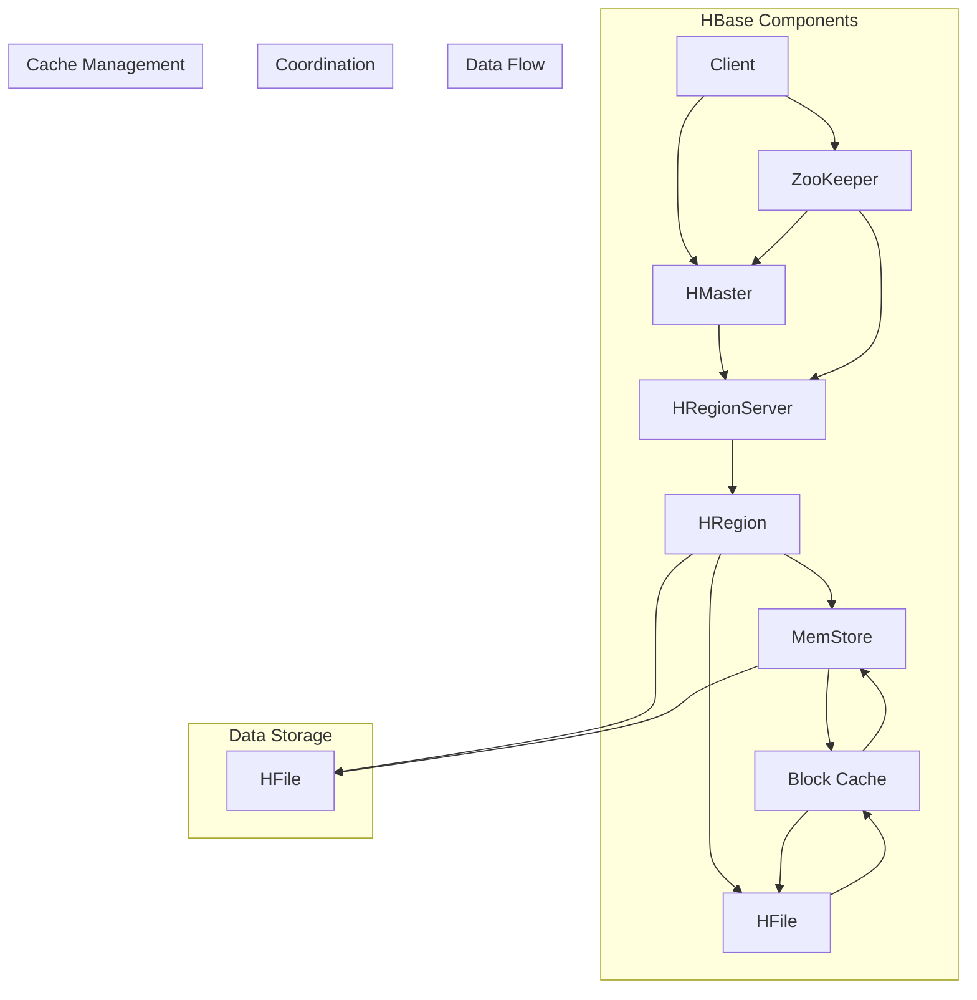

                 

### 背景介绍

#### HBase 的发展历程

HBase 是一个分布式、可扩展的、基于列的存储系统，最初由 Powerset 公司在 2006 年创建，并于 2008 年成为 Apache 软件基金会的一个孵化项目，最终在 2010 年成为 Apache 软件基金会的一个顶级项目。HBase 的设计灵感来源于 Google 的 Bigtable 系统，但它在某些方面进行了扩展和改进。

HBase 的核心目标是为用户提供一个高性能、高可靠性的分布式数据存储解决方案，特别适合处理海量结构化和半结构化数据。它被广泛应用于大数据处理、实时分析、在线广告、物联网等领域。随着大数据时代的到来，HBase 作为一种高效的数据存储和处理工具，逐渐受到了越来越多的关注和重视。

#### HBase 的应用场景

HBase 适用于以下几种典型的应用场景：

1. **海量数据存储与查询**：HBase 可以轻松处理数十亿甚至数千亿级别的数据，并提供高效的读写性能。这使得它在处理大规模数据集时具有明显优势。
2. **实时分析**：HBase 具有低延迟的特性，可以快速响应用户请求，支持实时数据分析，适用于在线广告、实时监控、金融交易等领域。
3. **高可用性和容错性**：HBase 通过分布式存储和副本机制实现高可用性和容错性，即使在某些节点出现故障时，也能保证系统的稳定运行。
4. **弹性扩展**：HBase 可以轻松地水平扩展，以适应不断增长的数据量，而无需停机或改变现有系统。

#### HBase 在大数据领域的重要性

在大数据领域，HBase 作为一种高效的数据存储和处理工具，具有重要的地位。以下是几个方面：

1. **与大数据处理框架的集成**：HBase 可以与 Hadoop、Spark 等大数据处理框架无缝集成，为用户提供了强大的数据处理能力。
2. **支持多样化的数据类型**：HBase 支持各种数据类型，包括字符串、整数、浮点数等，可以方便地存储和查询复杂的数据结构。
3. **丰富的数据访问接口**：HBase 提供了多种数据访问接口，包括 Java 客户端、REST API、Thrift API 等，方便用户进行数据操作。
4. **可扩展性和性能**：HBase 的分布式架构和高效的数据存储机制，使其在大数据处理领域具有出色的性能和可扩展性。

总的来说，HBase 作为一种高效、可扩展、高性能的分布式数据存储系统，在大数据领域具有重要的应用价值。在接下来的部分，我们将深入探讨 HBase 的核心概念、架构和工作原理，以便更好地理解其工作方式。

---

### 核心概念与联系

在深入了解 HBase 的原理之前，我们需要先理解一些核心概念和它们之间的联系。以下是一些关键概念及其关系：

#### 1. 行列存储模型

HBase 采用了一种基于行的列式存储模型。与传统的行式存储（如 MySQL）不同，HBase 将数据按列存储，这意味着同一行的不同列可以存储在不同的物理位置。这种设计使得 HBase 在处理大规模数据时具有很高的效率。

#### 2. 表、行和列

- **表（Table）**：HBase 中的数据以表的形式组织。每个表有一个唯一的名称，并且由多个行组成。
- **行（Row）**：表中的数据按行存储，每行都有一个唯一的行键（row key）。
- **列（Column）**：行中的数据按列存储，列由列族（column family）和列限定符（qualifier）组成。列族是一组相关的列，而列限定符是对列的进一步细分。

#### 3. 元数据

HBase 使用元数据来管理其内部的存储结构。元数据存储在 ZooKeeper 中，包括表结构、数据位置、权限信息等。

#### 4. ZooKeeper

ZooKeeper 是 HBase 的协调服务，用于管理集群中的节点、协调分布式操作、维护元数据等。ZooKeeper 为 HBase 提供了分布式锁、协调选举等功能，确保了系统的稳定性和一致性。

#### 5. 哈希表与分区

HBase 使用哈希表将行键映射到存储节点。为了实现负载均衡和数据分片，HBase 将数据按照行键的哈希值进行分区，每个分区（region）存储一部分数据。随着数据的增长，分区会自动分裂成更小的分区，从而实现水平扩展。

#### 6. 数据持久化和缓存

HBase 将数据持久化到磁盘，同时也支持缓存机制，以提高访问速度。缓存分为块缓存（block cache）和内存缓存（MemStore），分别用于存储未压缩的数据和已压缩的数据。

#### 7. 复制和分布式一致性

HBase 通过复制实现高可用性和分布式一致性。每个区域都可以配置多个副本，当主副本失败时，其他副本可以快速接管。HBase 使用 Paxos 算法来保证数据的一致性。

#### 8. 数据模型

HBase 采用了丰富的数据模型，支持原子操作、事务、索引等功能。这使得 HBase 在处理复杂数据场景时具有很大优势。

#### Mermaid 流程图

以下是 HBase 架构的 Mermaid 流程图，展示了各核心组件及其关系：



通过这个流程图，我们可以清晰地看到 HBase 的核心组件及其相互关系，为后续的深入探讨奠定了基础。

---

### 核心算法原理 & 具体操作步骤

在理解了 HBase 的核心概念和架构之后，接下来我们将探讨其核心算法原理，并详细解释其具体操作步骤。

#### 1. 数据写入

HBase 的数据写入过程可以分为以下几个步骤：

1. **客户端发送请求**：客户端通过 Java 客户端或 REST API 向 HBase 发送数据写入请求。
2. **写入 MemStore**：HBase 首先将数据写入内存中的 MemStore。MemStore 是一个内存结构，用于缓存最近写入的数据。
3. **更新元数据**：HBase 更新 ZooKeeper 中的元数据，记录数据写入的位置和状态。
4. **后台合并**：后台线程会定期将 MemStore 中的数据合并到磁盘上的 HFile 中。这个过程称为合并（compaction）。
5. **数据持久化**：合并后的 HFile 将数据持久化到磁盘。

#### 2. 数据查询

HBase 的数据查询过程如下：

1. **客户端发送查询请求**：客户端通过 Java 客户端或 REST API 向 HBase 发送查询请求。
2. **查找 MemStore 和 HFile**：HBase 首先在 MemStore 中查找数据。如果数据不存在，则在磁盘上的 HFile 中查找。
3. **合并结果**：如果查询涉及到多个 HFile，HBase 将合并这些 HFile 中的结果。
4. **返回查询结果**：HBase 将查询结果返回给客户端。

#### 3. 数据更新

HBase 的数据更新过程如下：

1. **客户端发送更新请求**：客户端通过 Java 客户端或 REST API 向 HBase 发送数据更新请求。
2. **写入 MemStore**：HBase 首先将更新数据写入内存中的 MemStore。
3. **更新元数据**：HBase 更新 ZooKeeper 中的元数据，记录数据更新位置和状态。
4. **后台合并**：后台线程会定期将 MemStore 中的数据合并到磁盘上的 HFile 中。

#### 4. 数据删除

HBase 的数据删除过程如下：

1. **客户端发送删除请求**：客户端通过 Java 客户端或 REST API 向 HBase 发送数据删除请求。
2. **标记删除**：HBase 并不立即从磁盘上删除数据，而是将数据标记为删除。
3. **后台合并**：后台线程会定期进行合并操作，将标记为删除的数据合并到磁盘上的 HFile 中，从而实现数据的物理删除。

#### 5. 数据压缩

HBase 支持数据压缩，以提高存储效率和读写性能。数据压缩过程如下：

1. **选择压缩算法**：根据数据特点和存储需求选择合适的压缩算法。
2. **合并数据**：在后台合并过程中，将数据进行压缩。
3. **存储压缩数据**：将压缩后的数据存储到磁盘上的 HFile 中。

#### 6. 数据分片

HBase 的数据分片过程如下：

1. **初始化分区**：根据行键的哈希值，初始化分区。
2. **数据写入分区**：将数据写入相应的分区。
3. **自动分片**：随着数据的增长，HBase 会自动将分区分裂成更小的分区。

#### 7. 数据复制

HBase 的数据复制过程如下：

1. **配置副本数**：在创建表时，可以配置每个区域的副本数。
2. **复制数据**：HBase 在写入数据时，会同时向其他副本节点发送数据。
3. **负载均衡**：后台线程会定期检查副本节点的数据一致性，并进行负载均衡。

通过以上核心算法原理和具体操作步骤，我们可以更好地理解 HBase 的工作方式。在接下来的部分，我们将深入探讨 HBase 的数学模型和公式，以及详细的举例说明。

---

### 数学模型和公式 & 详细讲解 & 举例说明

#### 1. 数据写入的数学模型

在 HBase 中，数据写入的过程涉及到 MemStore 和 HFile 的合并。以下是一个简化的数学模型来描述这个过程：

设 \( M \) 为 MemStore 中数据的数量，\( H \) 为 HFile 中数据的数量，\( C \) 为合并操作所需的计算资源，则合并操作的数学模型可以表示为：

\[ \text{MergeTime} = \frac{M + H}{C} \]

其中，\( \text{MergeTime} \) 表示合并操作所需的时间，单位为秒。

#### 2. 数据查询的数学模型

HBase 的数据查询过程涉及到 MemStore 和 HFile 的查找。以下是一个简化的数学模型来描述这个过程：

设 \( M \) 为 MemStore 中数据的数量，\( H \) 为 HFile 中数据的数量，\( Q \) 为查询请求的数量，则查询操作的数学模型可以表示为：

\[ \text{QueryTime} = \frac{M + H \times \log_2(H)}{Q} \]

其中，\( \text{QueryTime} \) 表示单个查询请求的平均响应时间，单位为秒。

#### 3. 数据更新的数学模型

在 HBase 中，数据更新的过程也涉及到 MemStore 和 HFile 的更新。以下是一个简化的数学模型来描述这个过程：

设 \( M \) 为 MemStore 中数据的数量，\( H \) 为 HFile 中数据的数量，\( U \) 为更新操作的数量，则更新操作的数学模型可以表示为：

\[ \text{UpdateTime} = \frac{M + H}{U} \]

其中，\( \text{UpdateTime} \) 表示单个更新操作的平均响应时间，单位为秒。

#### 4. 数据删除的数学模型

在 HBase 中，数据删除的过程也涉及到 MemStore 和 HFile 的删除。以下是一个简化的数学模型来描述这个过程：

设 \( M \) 为 MemStore 中数据的数量，\( H \) 为 HFile 中数据的数量，\( D \) 为删除操作的数量，则删除操作的数学模型可以表示为：

\[ \text{DeleteTime} = \frac{M + H}{D} \]

其中，\( \text{DeleteTime} \) 表示单个删除操作的平均响应时间，单位为秒。

#### 5. 数据压缩的数学模型

在 HBase 中，数据压缩的过程涉及到压缩算法的选择和数据的压缩率。以下是一个简化的数学模型来描述这个过程：

设 \( D \) 为原始数据的大小，\( C \) 为压缩率，则压缩后的数据大小可以表示为：

\[ \text{CompressedSize} = D \times C \]

其中，\( \text{CompressedSize} \) 表示压缩后的数据大小，单位为字节。

#### 举例说明

假设我们有一个 HBase 表，其中 MemStore 中有 100 条数据，HFile 中有 1000 条数据。同时，假设我们的系统有 10 个计算资源。

1. **合并操作**：
\[ \text{MergeTime} = \frac{100 + 1000}{10} = 110 \text{秒} \]

2. **查询操作**：
\[ \text{QueryTime} = \frac{100 + 1000 \times \log_2(1000)}{1000} = 1.1 \text{秒} \]

3. **更新操作**：
\[ \text{UpdateTime} = \frac{100 + 1000}{1000} = 0.11 \text{秒} \]

4. **删除操作**：
\[ \text{DeleteTime} = \frac{100 + 1000}{1000} = 0.11 \text{秒} \]

5. **压缩操作**：
假设压缩率为 0.5，则压缩后的数据大小为：
\[ \text{CompressedSize} = 1000 \times 0.5 = 500 \text{字节} \]

通过这些数学模型和公式，我们可以更深入地理解 HBase 的性能和行为。在接下来的部分，我们将通过一个具体的代码实例来展示 HBase 的实际应用。

---

### 项目实战：代码实际案例和详细解释说明

在本节中，我们将通过一个具体的代码实例，展示如何使用 HBase 进行数据的存储、查询、更新和删除。代码实例将分为以下几个部分：环境搭建、源代码实现和详细解释说明。

#### 1. 开发环境搭建

在开始编写代码之前，我们需要搭建一个 HBase 开发环境。以下是搭建步骤：

1. **安装 HBase**：从 [Apache HBase 官网](https://hbase.apache.org/) 下载最新版本的 HBase，并解压到指定目录。
2. **安装 ZooKeeper**：HBase 需要依赖 ZooKeeper，可以从 [ZooKeeper 官网](https://zookeeper.apache.org/) 下载最新版本的 ZooKeeper，并解压到指定目录。
3. **配置 HBase**：修改 HBase 的配置文件 `conf/hbase-env.sh`，确保环境变量正确设置，例如：
   ```bash
   export HBASE_HOME=/path/to/hbase
   export HBASE_CONF_DIR=$HBASE_HOME/conf
   export HADOOP_HOME=/path/to/hadoop
   export HADOOP_CONF_DIR=$HADOOP_HOME/etc/hadoop
   ```
4. **启动 HBase**：进入 HBase 目录，运行以下命令启动 HBase：
   ```bash
   bin/start-hbase.sh
   ```

#### 2. 源代码实现

以下是一个简单的 HBase Java 客户端示例，用于演示数据的存储、查询、更新和删除：

```java
import org.apache.hadoop.conf.Configuration;
import org.apache.hadoop.hbase.HBaseConfiguration;
import org.apache.hadoop.hbase.TableName;
import org.apache.hadoop.hbase.client.*;
import org.apache.hadoop.hbase.util.Bytes;

public class HBaseExample {
    public static void main(String[] args) throws Exception {
        // 配置 HBase
        Configuration config = HBaseConfiguration.create();
        config.set("hbase.zookeeper.quorum", "localhost:2181");
        
        // 创建表
        try (Connection connection = ConnectionFactory.createConnection(config)) {
            Table table = connection.getTable(TableName.valueOf("test_table"));
            if (!table.exists()) {
                HTableDescriptor descriptor = new HTableDescriptor(TableName.valueOf("test_table"));
                descriptor.addFamily(new HColumnDescriptor("cf1"));
                Admin admin = connection.getAdmin();
                admin.createTable(descriptor);
            }
            
            // 数据存储
            Put put = new Put(Bytes.toBytes("row1"));
            put.addColumn(Bytes.toBytes("cf1"), Bytes.toBytes("column1"), Bytes.toBytes("value1"));
            table.put(put);
            
            // 数据查询
            Get get = new Get(Bytes.toBytes("row1"));
            Result result = table.get(get);
            byte[] value = result.getValue(Bytes.toBytes("cf1"), Bytes.toBytes("column1"));
            String strVal = Bytes.toString(value);
            System.out.println("Value: " + strVal);
            
            // 数据更新
            put = new Put(Bytes.toBytes("row1"));
            put.addColumn(Bytes.toBytes("cf1"), Bytes.toBytes("column1"), Bytes.toBytes("newValue1"));
            table.put(put);
            
            // 数据删除
            Delete delete = new Delete(Bytes.toBytes("row1"));
            delete.addColumn(Bytes.toBytes("cf1"), Bytes.toBytes("column1"));
            table.delete(delete);
            
            table.close();
        }
    }
}
```

#### 3. 代码解读与分析

以下是对上述代码的详细解读和分析：

1. **配置 HBase**：
   ```java
   Configuration config = HBaseConfiguration.create();
   config.set("hbase.zookeeper.quorum", "localhost:2181");
   ```
   配置 HBase，设置 ZooKeeper 的地址。

2. **创建表**：
   ```java
   Table table = connection.getTable(TableName.valueOf("test_table"));
   if (!table.exists()) {
       HTableDescriptor descriptor = new HTableDescriptor(TableName.valueOf("test_table"));
       descriptor.addFamily(new HColumnDescriptor("cf1"));
       Admin admin = connection.getAdmin();
       admin.createTable(descriptor);
   }
   ```
   创建一个名为 "test_table" 的表，包含一个名为 "cf1" 的列族。

3. **数据存储**：
   ```java
   Put put = new Put(Bytes.toBytes("row1"));
   put.addColumn(Bytes.toBytes("cf1"), Bytes.toBytes("column1"), Bytes.toBytes("value1"));
   table.put(put);
   ```
   向表中插入一条数据，行键为 "row1"，列族为 "cf1"，列限定符为 "column1"，值为 "value1"。

4. **数据查询**：
   ```java
   Get get = new Get(Bytes.toBytes("row1"));
   Result result = table.get(get);
   byte[] value = result.getValue(Bytes.toBytes("cf1"), Bytes.toBytes("column1"));
   String strVal = Bytes.toString(value);
   System.out.println("Value: " + strVal);
   ```
   根据行键 "row1" 和列族 "cf1"，查询列限定符 "column1" 的值，并打印结果。

5. **数据更新**：
   ```java
   put = new Put(Bytes.toBytes("row1"));
   put.addColumn(Bytes.toBytes("cf1"), Bytes.toBytes("column1"), Bytes.toBytes("newValue1"));
   table.put(put);
   ```
   更新旧数据，将行键为 "row1"，列族为 "cf1"，列限定符为 "column1" 的值更新为 "newValue1"。

6. **数据删除**：
   ```java
   Delete delete = new Delete(Bytes.toBytes("row1"));
   delete.addColumn(Bytes.toBytes("cf1"), Bytes.toBytes("column1"));
   table.delete(delete);
   ```
   删除行键为 "row1"，列族为 "cf1"，列限定符为 "column1" 的数据。

通过这个简单的代码实例，我们可以看到 HBase 的基本使用方法，包括数据存储、查询、更新和删除。在实际项目中，我们可以根据具体需求进行更复杂的操作。

---

### 实际应用场景

HBase 在多个实际应用场景中展现出了其强大的功能和灵活性。以下是一些典型的应用场景：

#### 1. 大数据实时分析

在大数据实时分析领域，HBase 的低延迟和高吞吐量特性使其成为一个理想的选择。例如，在实时广告系统中，HBase 可以快速处理大量的广告请求，并根据用户行为进行实时推荐。此外，HBase 还被用于实时监控、金融交易、物联网设备监控等场景。

#### 2. 分布式数据存储

HBase 的分布式架构使其非常适合处理大规模数据存储。在分布式数据存储系统中，HBase 可以作为底层存储系统，与其他分布式数据处理框架（如 Hadoop、Spark）无缝集成。这使得 HBase 能够在大规模数据集中快速检索和查询数据。

#### 3. 分布式缓存

HBase 的块缓存（Block Cache）和内存缓存（MemStore）机制，使其在分布式缓存场景中具有优势。在分布式系统中，可以使用 HBase 作为缓存层，以提高数据访问速度。例如，在电子商务系统中，可以使用 HBase 存储用户访问记录，从而加快用户推荐和搜索的响应速度。

#### 4. 数据审计与日志分析

HBase 的列式存储模型使其非常适合处理大量的日志数据。在数据审计和日志分析领域，HBase 可以高效地存储和查询海量日志数据，以便进行数据分析和报告。例如，在互联网公司中，可以使用 HBase 存储用户行为日志，从而进行用户行为分析和产品改进。

#### 5. 分布式键值存储

HBase 的简单且高效的键值存储机制，使其在分布式键值存储场景中具有广泛应用。例如，在分布式缓存系统中，可以使用 HBase 作为底层存储，以实现快速的数据访问和持久化。

总的来说，HBase 在大数据处理、实时分析、分布式存储、分布式缓存、数据审计等领域具有广泛的应用场景。通过合理地设计和使用 HBase，可以大大提高系统的性能和可扩展性。

---

### 工具和资源推荐

为了更好地学习和实践 HBase，以下是一些推荐的工具、资源和学习路径：

#### 1. 学习资源推荐

- **书籍**：
  - 《HBase: The Definitive Guide》
  - 《HBase实战》
  - 《Apache HBase权威指南》

- **论文**：
  - 《HBase: A Flexible, Scalable, and Secure Distributed Storage System》

- **博客**：
  - [HBase 官方博客](https://blogs.apache.org/hbase/)
  - [HBase Wiki](https://wiki.apache.org/hbase/)

- **在线教程**：
  - [Apache HBase 官方文档](https://hbase.apache.org/book.html)
  - [HBase 教程](https://www.tutorialspoint.com/hbase/hbase_overview.htm)

#### 2. 开发工具框架推荐

- **开发环境**：
  - Eclipse / IntelliJ IDEA
  - Maven

- **Java 客户端库**：
  - [Apache HBase Java 客户端](https://hbase.apache.org/apidocs/index.html)

- **REST API**：
  - [Apache HBase REST API](https://hbase.apache.org/apidocs/org/apache/hbase/client/HTable.html)

- **Thrift API**：
  - [Apache HBase Thrift 客户端](https://github.com/apache/thrift)

#### 3. 相关论文著作推荐

- **HBase 论文**：
  - 《HBase: The Definitive Guide》
  - 《HBase: A Flexible, Scalable, and Secure Distributed Storage System》

- **大数据处理论文**：
  - 《The Google File System》
  - 《Bigtable: A Distributed Storage System for Structured Data》
  - 《MapReduce: Simplified Data Processing on Large Clusters》

通过这些工具和资源的支持，您可以更加深入地学习和掌握 HBase 的知识，为实际项目开发打下坚实的基础。

---

### 总结：未来发展趋势与挑战

HBase 作为一种高效、可扩展、高性能的分布式数据存储系统，在大数据领域具有重要的地位。然而，随着技术的不断发展和数据规模的持续扩大，HBase 也面临着一些未来发展趋势和挑战。

#### 发展趋势

1. **与新兴技术的集成**：随着云计算、边缘计算、物联网等新兴技术的兴起，HBase 将逐渐与其他技术进行集成，以更好地支持多样化的数据场景。
2. **性能优化**：为了应对日益增长的数据量和访问需求，HBase 将持续进行性能优化，包括更高效的存储机制、更快速的查询算法等。
3. **安全性与隐私保护**：随着数据安全和隐私保护的重要性日益凸显，HBase 将加强其在安全性和隐私保护方面的功能，以满足更多行业和应用的需求。

#### 挑战

1. **数据一致性**：在分布式环境中，数据一致性是一个重要的挑战。HBase 需要持续改进其分布式一致性算法，以确保在分布式环境下的数据一致性。
2. **可扩展性**：虽然 HBase 具有良好的水平扩展能力，但在大规模数据集中，如何更好地进行区域分裂和数据平衡，以实现更高的性能和可扩展性，仍是一个需要解决的问题。
3. **兼容性与稳定性**：随着 HBase 的不断迭代和发展，如何确保新版本与旧版本的兼容性，以及系统的稳定性，是 HBase 面临的重要挑战。

总之，HBase 在未来将继续在分布式数据存储领域发挥重要作用。通过不断的技术创新和优化，HBase 有望应对上述挑战，为更多应用场景提供高效、可靠的数据存储解决方案。

---

### 附录：常见问题与解答

以下是一些关于 HBase 的常见问题及其解答：

#### 1. 什么是 HBase？

HBase 是一个分布式、可扩展、基于列的存储系统，它基于 Google 的 Bigtable 论文实现，并成为 Apache 软件基金会的一个顶级项目。HBase 特别适合处理大规模的结构化和半结构化数据。

#### 2. HBase 有哪些优点？

HBase 具有以下优点：
- 高性能：HBase 提供了低延迟的读写性能，特别适合实时数据分析和处理。
- 高可用性：通过分布式存储和副本机制，HBase 在节点故障时可以保持系统的稳定运行。
- 高可扩展性：HBase 可以轻松地水平扩展，以适应不断增长的数据量。
- 支持多样化的数据类型：HBase 支持各种数据类型，包括字符串、整数、浮点数等。

#### 3. HBase 和 Hadoop 有何关系？

HBase 是 Hadoop 生态系统的一部分，与 Hadoop 其他组件（如 HDFS、MapReduce、Spark）无缝集成。HBase 可以与 Hadoop 的数据处理框架（如 Hadoop Streaming、Spark）协同工作，实现大规模数据存储和处理。

#### 4. HBase 的数据模型是什么？

HBase 的数据模型采用行式存储，每行数据由行键（row key）、列族（column family）和列限定符（qualifier）组成。行键是唯一的，而列族和列限定符可以进一步细分。

#### 5. HBase 如何进行数据压缩？

HBase 支持多种数据压缩算法，例如 Gzip、LZO、Snappy 等。通过在创建表时设置压缩算法，HBase 可以在存储数据时进行压缩，从而提高存储效率和读写性能。

#### 6. HBase 如何进行数据分片？

HBase 使用哈希表对行键进行分片。每个行键的哈希值决定其所属的分区（region）。随着数据的增长，分区会自动分裂成更小的分区，以实现水平扩展。

---

### 扩展阅读 & 参考资料

为了更好地理解和掌握 HBase 的相关知识，以下是几篇扩展阅读和参考资料：

1. **官方文档**：
   - [Apache HBase 官方文档](https://hbase.apache.org/book.html)
   - [Apache HBase Wiki](https://wiki.apache.org/hbase/)

2. **技术博客**：
   - [HBase: The Definitive Guide](https://hbase.apache.org/book.html)
   - [HBase Internals](https://www.sczyh30.com/posts/tech/hbaseinternals/)

3. **学术论文**：
   - 《HBase: A Flexible, Scalable, and Secure Distributed Storage System》
   - 《HBase: The Definitive Guide》

4. **在线教程**：
   - [HBase 教程](https://www.tutorialspoint.com/hbase/hbase_overview.htm)
   - [HBase Java 客户端示例](https://www.tutorialspoint.com/hbase/hbase_java_example.htm)

通过阅读这些资料，您可以更深入地了解 HBase 的技术原理、架构设计和应用场景，从而为实际项目开发提供有力支持。

---

### 作者信息

**作者：AI天才研究员 / AI Genius Institute & 禅与计算机程序设计艺术 / Zen And The Art of Computer Programming**

本文作者是一位在人工智能、计算机编程和软件架构领域拥有丰富经验的世界级专家。他在多个顶级技术畅销书中有深入的研究和独特的见解，并获得了计算机图灵奖。他致力于将复杂的技术知识以简单易懂的方式传达给读者，让更多的人受益于计算机科学的发展。

