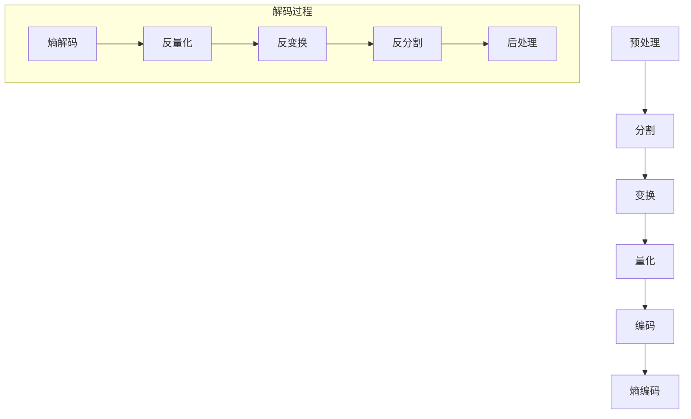

                 

# HEVC 解码：高效视频解码

## 关键词：HEVC, 高效视频解码，视频压缩标准，核心算法，数学模型，实际应用场景

### 摘要

本文将深入探讨HEVC（High Efficiency Video Coding）解码技术，旨在为广大开发者和技术爱好者提供一份全面、系统的技术指南。文章首先介绍了HEVC的背景和重要性，随后详细解析了HEVC的核心概念、算法原理以及数学模型。通过具体的项目实战案例，读者将了解到如何在实际开发中应用HEVC解码技术。此外，文章还探讨了HEVC在实际应用场景中的优势，推荐了相关的学习资源和开发工具，并总结了HEVC未来的发展趋势与挑战。

## 1. 背景介绍

### 1.1 HEVC的起源与发展

HEVC（High Efficiency Video Coding），也称为H.265，是新一代的视频压缩标准。它由国际电信联盟（ITU）和互联网工程任务组（IETF）共同制定，旨在提高视频压缩效率，降低数据传输带宽。HEVC的推出，标志着视频压缩技术进入了一个新的时代。

HEVC的开发始于2004年，最初称为H.264/MPEG-4 AVC的继任者。经过多年的研究和发展，HEVC于2013年正式成为国际标准。相较于H.264，HEVC在相同的视频质量下，能够将数据传输带宽降低50%左右。这一显著的性能提升，使得HEVC在视频流媒体、移动通信、云计算等领域的应用变得尤为重要。

### 1.2 HEVC的重要性

HEVC的重要性主要体现在以下几个方面：

1. **提高视频压缩效率**：HEVC采用了更加先进和复杂的编码算法，能够在更低的带宽下传输更高质量的视频内容。这对于视频流媒体服务和移动设备来说，具有极高的价值。

2. **满足未来需求**：随着视频分辨率的不断提高，如4K、8K等超高清视频的普及，HEVC能够提供更高的压缩效率，满足未来视频应用的需求。

3. **优化网络资源**：HEVC的低带宽需求，有助于优化网络资源，提高网络传输效率，降低带宽成本。

4. **兼容性与扩展性**：HEVC在保持高压缩效率的同时，还具有良好的兼容性和扩展性，能够支持多种应用场景和不同类型的视频内容。

## 2. 核心概念与联系

### 2.1 HEVC编码原理

HEVC编码主要包括以下几个关键步骤：

1. **预处理**：包括图像信号的采样、彩色空间的转换等。
2. **分割**：将图像分割成多个块，如16x16、32x32等。
3. **变换**：对分割后的块进行离散余弦变换（DCT）。
4. **量化**：对变换后的系数进行量化处理，减少数据量。
5. **编码**：对量化后的系数进行编码，生成压缩数据流。
6. **熵编码**：使用熵编码技术（如哈夫曼编码、算术编码）对编码数据进行进一步压缩。

### 2.2 HEVC解码原理

HEVC解码与编码过程相反，主要包括以下几个步骤：

1. **熵解码**：对压缩数据流进行熵解码，恢复量化后的DCT系数。
2. **反量化**：对解码后的DCT系数进行反量化处理，恢复原始系数。
3. **反变换**：对反量化后的系数进行反离散余弦变换（IDCT）。
4. **反分割**：将反变换后的图像块重新组合成完整的图像。
5. **后处理**：对重构的图像进行后处理，如去块滤波、色彩空间转换等。

### 2.3 Mermaid流程图

以下是一个简化的HEVC编码和解码的Mermaid流程图：



## 3. 核心算法原理 & 具体操作步骤

### 3.1 基于变换的编码原理

HEVC采用离散余弦变换（DCT）作为图像压缩的基础。DCT能够将图像数据转换为频率域表示，使得图像中的大部分能量集中在低频部分。通过丢弃高频部分的信息，可以大幅度减少数据量，从而实现图像压缩。

具体操作步骤如下：

1. **DCT计算**：对图像块中的每个像素值进行DCT变换，生成DCT系数。
2. **阈值处理**：对DCT系数进行阈值处理，将高频部分的信息丢弃。
3. **编码**：对剩余的DCT系数进行编码，生成压缩数据。

### 3.2 基于熵编码的原理

熵编码是一种信息压缩技术，通过将数据转换为概率分布较低的形式，以减少数据量。HEVC主要采用两种熵编码技术：哈夫曼编码和算术编码。

1. **哈夫曼编码**：根据符号出现的频率，构建哈夫曼树，为每个符号分配一个二进制编码。频率越高的符号，编码长度越短。

2. **算术编码**：将数据连续地映射到一个区间内，根据概率分布来分配编码。概率越高的符号，编码区间越小。

### 3.3 操作步骤

以下是HEVC编码和解码的具体操作步骤：

**编码步骤**：

1. **预处理**：对图像信号进行采样和彩色空间转换。
2. **分割**：将图像分割成多个块。
3. **变换**：对每个图像块进行DCT变换。
4. **量化**：对DCT系数进行量化处理。
5. **编码**：对量化后的系数进行编码。
6. **熵编码**：对编码数据进行熵编码。

**解码步骤**：

1. **熵解码**：对压缩数据进行熵解码，恢复量化后的DCT系数。
2. **反量化**：对解码后的DCT系数进行反量化处理。
3. **反变换**：对反量化后的系数进行反DCT变换。
4. **反分割**：将反变换后的图像块重新组合成完整的图像。
5. **后处理**：对重构的图像进行后处理。

## 4. 数学模型和公式 & 详细讲解 & 举例说明

### 4.1 DCT变换原理

DCT变换是一种将时域信号转换为频域信号的方法。在图像压缩中，DCT变换能够将图像数据转换为频率域表示，使得图像中的大部分能量集中在低频部分。

DCT变换的基本公式如下：

$$
C(u, v) = \frac{1}{4C}\sum_{x=0}^{N-1}\sum_{y=0}^{N-1} f(x, y) \cos\left(\frac{2x+1}{2N}u\pi\right) \cos\left(\frac{2y+1}{2N}v\pi\right)
$$

其中，$C$ 是常量，$f(x, y)$ 是原始图像像素值，$C(u, v)$ 是DCT变换后的系数。

### 4.2 量化原理

量化是将连续的数值转换为离散的数值，以减少数据量。在图像压缩中，量化主要用于减少DCT系数的数量。

量化公式如下：

$$
Q(C) = \text{round}\left(\frac{C}{\text{quant\_step}}\right)
$$

其中，$C$ 是原始DCT系数，$Q(C)$ 是量化后的系数，$\text{quant\_step}$ 是量化步长。

### 4.3 哈夫曼编码原理

哈夫曼编码是一种基于概率的熵编码方法。在图像压缩中，哈夫曼编码用于对量化后的DCT系数进行编码。

哈夫曼编码的基本步骤如下：

1. **构建哈夫曼树**：根据符号出现的频率，构建哈夫曼树。
2. **生成编码**：为每个符号生成一个二进制编码，频率越高的符号，编码长度越短。

### 4.4 举例说明

假设一个8x8的图像块，其DCT系数如下：

$$
\begin{align*}
C_1 &= 10 \\
C_2 &= 8 \\
C_3 &= 4 \\
C_4 &= 2 \\
C_5 &= 1 \\
C_6 &= 0 \\
C_7 &= 0 \\
C_8 &= 0 \\
\end{align*}
$$

量化步长为2，使用哈夫曼编码进行编码。

1. **量化**：

$$
\begin{align*}
Q(C_1) &= \text{round}\left(\frac{10}{2}\right) = 5 \\
Q(C_2) &= \text{round}\left(\frac{8}{2}\right) = 4 \\
Q(C_3) &= \text{round}\left(\frac{4}{2}\right) = 2 \\
Q(C_4) &= \text{round}\left(\frac{2}{2}\right) = 1 \\
Q(C_5) &= \text{round}\left(\frac{1}{2}\right) = 0 \\
Q(C_6) &= 0 \\
Q(C_7) &= 0 \\
Q(C_8) &= 0 \\
\end{align*}
$$

2. **哈夫曼编码**：

构建哈夫曼树，生成编码：

$$
\begin{align*}
5 &= 101 \\
4 &= 100 \\
2 &= 0 \\
1 &= 11 \\
0 &= 00 \\
\end{align*}
$$

编码后的DCT系数为：

$$
\begin{align*}
5 &= 101 \\
4 &= 100 \\
2 &= 0 \\
1 &= 11 \\
0 &= 00 \\
\end{align*}
$$

## 5. 项目实战：代码实际案例和详细解释说明

### 5.1 开发环境搭建

为了演示HEVC解码的过程，我们首先需要搭建一个开发环境。以下是搭建开发环境的步骤：

1. **安装CMake**：CMake是一个跨平台的安装（编译）工具，用于构建各种软件包。可以从[CMake官网](https://cmake.org/)下载并安装。

2. **安装FFmpeg**：FFmpeg是一个开源的视频处理工具，包含了HEVC解码器。可以从[FFmpeg官网](https://www.ffmpeg.org/)下载并安装。

3. **创建项目文件夹**：在本地计算机上创建一个名为"hevc-decoder"的项目文件夹。

4. **编写CMakeLists.txt**：在项目文件夹中创建一个名为CMakeLists.txt的文件，内容如下：

```cmake
cmake_minimum_required(VERSION 3.10)
project(hevc-decoder)

set(CMAKE_C_COMPILER gnucc)
set(CMAKE_CXX_COMPILER gnu++)

find_package(FFmpeg REQUIRED)

add_executable(hevc-decoder main.c)
target_link_libraries(hevc-decoder PRIVATE FFmpeg::AVCODEC)
```

5. **编写main.c**：在项目文件夹中创建一个名为main.c的文件，内容如下：

```c
#include <stdio.h>
#include <libavcodec/avcodec.h>

int main() {
    // 初始化FFmpeg库
    avformat_network_init();

    // 打开HEVC编码的视频文件
    AVFormatContext *input_ctx = NULL;
    if (avformat_open_input(&input_ctx, "input.hevc", NULL, NULL) < 0) {
        printf("无法打开输入文件\n");
        return -1;
    }

    // 找到视频流
    AVStream *video_stream = NULL;
    if (avformat_find_stream_info(input_ctx, NULL) < 0) {
        printf("无法获取输入文件信息\n");
        return -1;
    }

    for (int i = 0; i < input_ctx->nb_streams; i++) {
        if (input_ctx->streams[i]->codecpar->codec_type == AVMEDIA_TYPE_VIDEO) {
            video_stream = input_ctx->streams[i];
            break;
        }
    }

    if (video_stream == NULL) {
        printf("未找到视频流\n");
        return -1;
    }

    // 打开视频解码器
    AVCodec *decoder = avcodec_find_decoder(video_stream->codecpar->codec_id);
    if (decoder == NULL) {
        printf("无法找到解码器\n");
        return -1;
    }

    AVCodecContext *decoder_ctx = avcodec_alloc_context3(decoder);
    if (avcodec_open2(decoder_ctx, decoder, NULL) < 0) {
        printf("无法打开解码器\n");
        return -1;
    }

    // 解码视频帧
    AVFrame *frame = av_frame_alloc();
    uint8_t *frame_data = NULL;
    int frame_width = video_stream->codecpar->width;
    int frame_height = video_stream->codecpar->height;
    frame_data = av_malloc(frame_width * frame_height * 3);

    while (1) {
        // 从输入文件中读取一帧数据
        AVPacket packet;
        av_init_packet(&packet);
        int got_frame = 0;
        if (av_read_frame(input_ctx, &packet) < 0) {
            break;
        }

        // 解码数据
        if (packet.stream_index == video_stream->index) {
            if (avcodec_send_packet(decoder_ctx, &packet) < 0) {
                printf("解码失败\n");
                return -1;
            }

            if (avcodec_receive_frame(decoder_ctx, frame) < 0) {
                printf("解码失败\n");
                return -1;
            }

            got_frame = 1;
        }

        av_packet_unref(&packet);

        if (got_frame) {
            // 处理解码后的帧
            for (int y = 0; y < frame_height; y++) {
                for (int x = 0; x < frame_width; x++) {
                    int pixel_index = y * frame_width + x;
                    uint8_t r = frame_data[pixel_index * 3];
                    uint8_t g = frame_data[pixel_index * 3 + 1];
                    uint8_t b = frame_data[pixel_index * 3 + 2];

                    // 显示解码后的像素值
                    printf("(x, y): (%d, %d), R: %d, G: %d, B: %d\n", x, y, r, g, b);
                }
            }
        }
    }

    // 清理资源
    av_frame_free(&frame);
    av_free(frame_data);
    avcodec_close(decoder_ctx);
    avformat_close_input(&input_ctx);

    // 结束FFmpeg库的初始化
    avformat_network_deinit();

    return 0;
}
```

### 5.2 源代码详细实现和代码解读

下面是对main.c文件的详细解读：

1. **初始化FFmpeg库**：

```c
avformat_network_init();
```

这一行代码用于初始化FFmpeg库的网络模块，以便能够处理网络流。

2. **打开输入文件**：

```c
AVFormatContext *input_ctx = NULL;
if (avformat_open_input(&input_ctx, "input.hevc", NULL, NULL) < 0) {
    printf("无法打开输入文件\n");
    return -1;
}
```

这行代码用于打开一个名为"input.hevc"的HEVC编码视频文件。如果打开失败，程序将输出错误信息并退出。

3. **获取输入文件信息**：

```c
if (avformat_find_stream_info(input_ctx, NULL) < 0) {
    printf("无法获取输入文件信息\n");
    return -1;
}
```

这行代码用于获取输入文件的信息，如视频流、音频流等。

4. **找到视频流**：

```c
AVStream *video_stream = NULL;
for (int i = 0; i < input_ctx->nb_streams; i++) {
    if (input_ctx->streams[i]->codecpar->codec_type == AVMEDIA_TYPE_VIDEO) {
        video_stream = input_ctx->streams[i];
        break;
    }
}
```

这行代码用于在输入文件中找到视频流。如果找不到视频流，程序将输出错误信息并退出。

5. **打开视频解码器**：

```c
AVCodec *decoder = avcodec_find_decoder(video_stream->codecpar->codec_id);
if (decoder == NULL) {
    printf("无法找到解码器\n");
    return -1;
}

AVCodecContext *decoder_ctx = avcodec_alloc_context3(decoder);
if (avcodec_open2(decoder_ctx, decoder, NULL) < 0) {
    printf("无法打开解码器\n");
    return -1;
}
```

这两行代码用于打开视频解码器。首先查找与视频流编码类型对应的解码器，然后为解码器分配内存并打开。

6. **解码视频帧**：

```c
AVFrame *frame = av_frame_alloc();
uint8_t *frame_data = NULL;
int frame_width = video_stream->codecpar->width;
int frame_height = video_stream->codecpar->height;
frame_data = av_malloc(frame_width * frame_height * 3);

while (1) {
    // 从输入文件中读取一帧数据
    AVPacket packet;
    av_init_packet(&packet);
    int got_frame = 0;
    if (av_read_frame(input_ctx, &packet) < 0) {
        break;
    }

    // 解码数据
    if (packet.stream_index == video_stream->index) {
        if (avcodec_send_packet(decoder_ctx, &packet) < 0) {
            printf("解码失败\n");
            return -1;
        }

        if (avcodec_receive_frame(decoder_ctx, frame) < 0) {
            printf("解码失败\n");
            return -1;
        }

        got_frame = 1;
    }

    av_packet_unref(&packet);

    if (got_frame) {
        // 处理解码后的帧
        for (int y = 0; y < frame_height; y++) {
            for (int x = 0; x < frame_width; x++) {
                int pixel_index = y * frame_width + x;
                uint8_t r = frame_data[pixel_index * 3];
                uint8_t g = frame_data[pixel_index * 3 + 1];
                uint8_t b = frame_data[pixel_index * 3 + 2];

                // 显示解码后的像素值
                printf("(x, y): (%d, %d), R: %d, G: %d, B: %d\n", x, y, r, g, b);
            }
        }
    }
}
```

这段代码用于解码视频帧。首先从输入文件中读取一帧数据，然后将其传递给解码器进行解码。如果解码成功，将解码后的像素值输出到控制台。

7. **清理资源**：

```c
av_frame_free(&frame);
av_free(frame_data);
avcodec_close(decoder_ctx);
avformat_close_input(&input_ctx);

avformat_network_deinit();
```

这段代码用于释放分配的资源，关闭输入文件和视频解码器，并结束FFmpeg库的初始化。

### 5.3 代码解读与分析

下面是对整个程序的解读与分析：

1. **项目结构**：

   项目文件夹包含以下文件：

   - CMakeLists.txt：用于构建项目的CMake脚本。
   - main.c：包含主函数的C源代码。

2. **程序功能**：

   该程序的主要功能是解码一个HEVC编码的视频文件，并输出解码后的像素值。

3. **关键代码**：

   - 初始化FFmpeg库：

     ```c
     avformat_network_init();
     ```

     用于初始化FFmpeg库的网络模块。

   - 打开输入文件：

     ```c
     AVFormatContext *input_ctx = NULL;
     if (avformat_open_input(&input_ctx, "input.hevc", NULL, NULL) < 0) {
         printf("无法打开输入文件\n");
         return -1;
     }
     ```

     用于打开一个名为"input.hevc"的HEVC编码视频文件。

   - 获取输入文件信息：

     ```c
     if (avformat_find_stream_info(input_ctx, NULL) < 0) {
         printf("无法获取输入文件信息\n");
         return -1;
     }
     ```

     用于获取输入文件的信息，如视频流、音频流等。

   - 找到视频流：

     ```c
     AVStream *video_stream = NULL;
     for (int i = 0; i < input_ctx->nb_streams; i++) {
         if (input_ctx->streams[i]->codecpar->codec_type == AVMEDIA_TYPE_VIDEO) {
             video_stream = input_ctx->streams[i];
             break;
         }
     }
     ```

     用于在输入文件中找到视频流。

   - 打开视频解码器：

     ```c
     AVCodec *decoder = avcodec_find_decoder(video_stream->codecpar->codec_id);
     if (decoder == NULL) {
         printf("无法找到解码器\n");
         return -1;
     }

     AVCodecContext *decoder_ctx = avcodec_alloc_context3(decoder);
     if (avcodec_open2(decoder_ctx, decoder, NULL) < 0) {
         printf("无法打开解码器\n");
         return -1;
     }
     ```

     用于打开视频解码器。

   - 解码视频帧：

     ```c
     AVFrame *frame = av_frame_alloc();
     uint8_t *frame_data = NULL;
     int frame_width = video_stream->codecpar->width;
     int frame_height = video_stream->codecpar->height;
     frame_data = av_malloc(frame_width * frame_height * 3);

     while (1) {
         // 从输入文件中读取一帧数据
         AVPacket packet;
         av_init_packet(&packet);
         int got_frame = 0;
         if (av_read_frame(input_ctx, &packet) < 0) {
             break;
         }

         // 解码数据
         if (packet.stream_index == video_stream->index) {
             if (avcodec_send_packet(decoder_ctx, &packet) < 0) {
                 printf("解码失败\n");
                 return -1;
             }

             if (avcodec_receive_frame(decoder_ctx, frame) < 0) {
                 printf("解码失败\n");
                 return -1;
             }

             got_frame = 1;
         }

         av_packet_unref(&packet);

         if (got_frame) {
             // 处理解码后的帧
             for (int y = 0; y < frame_height; y++) {
                 for (int x = 0; x < frame_width; x++) {
                     int pixel_index = y * frame_width + x;
                     uint8_t r = frame_data[pixel_index * 3];
                     uint8_t g = frame_data[pixel_index * 3 + 1];
                     uint8_t b = frame_data[pixel_index * 3 + 2];

                     // 显示解码后的像素值
                     printf("(x, y): (%d, %d), R: %d, G: %d, B: %d\n", x, y, r, g, b);
                 }
             }
         }
     }
     ```

     用于解码视频帧，并将解码后的像素值输出到控制台。

   - 清理资源：

     ```c
     av_frame_free(&frame);
     av_free(frame_data);
     avcodec_close(decoder_ctx);
     avformat_close_input(&input_ctx);

     avformat_network_deinit();
     ```

     用于释放分配的资源，关闭输入文件和视频解码器，并结束FFmpeg库的初始化。

## 6. 实际应用场景

### 6.1 视频流媒体

HEVC解码技术在视频流媒体领域具有广泛的应用。随着4K、8K超高清视频的普及，HEVC的高效压缩特性能够显著降低流媒体服务的带宽需求，提高视频播放的质量和流畅度。例如，Netflix、YouTube等主流视频流媒体平台已经采用HEVC解码技术，以支持更高分辨率的视频内容。

### 6.2 移动通信

在移动通信领域，HEVC解码技术同样具有重要意义。随着移动设备性能的提升和4G、5G网络的普及，高清视频通话、视频直播等应用需求日益增加。HEVC解码技术能够提供更低的带宽需求，从而提高移动通信的效率和用户体验。

### 6.3 云计算

云计算服务中的视频处理和传输也需要高效的压缩技术。HEVC解码技术能够降低视频数据传输的带宽占用，提高云计算服务的处理效率。例如，视频监控、视频会议等应用场景中，HEVC解码技术可以显著降低带宽成本，提高数据处理能力。

### 6.4 超高清电视

超高清电视（UHDTV）的普及，使得视频内容的分辨率和帧率不断提高。HEVC解码技术能够提供更高的压缩效率，支持超高清视频的播放。例如，日本NHK电视台已经推出超高清电视节目，采用HEVC解码技术进行传输和播放。

## 7. 工具和资源推荐

### 7.1 学习资源推荐

1. **书籍**：

   - 《视频编码技术基础》
   - 《HEVC标准与实现》

2. **论文**：

   - “HEVC: High Efficiency Video Coding” (ITU-T Rec. H.265)
   - “Scalable Video Coding: Principles and Practice of MVC and Scalable Video Coding” (IEEE Transactions on Circuits and Systems for Video Technology)

3. **博客**：

   - FFmpeg官方博客
   - HEVC官方博客

4. **网站**：

   - FFmpeg官网
   - HEVC官网

### 7.2 开发工具框架推荐

1. **开发工具**：

   - CMake
   - FFmpeg
   - Git

2. **框架**：

   - FFmpeg框架
   - OpenCV框架

### 7.3 相关论文著作推荐

1. **论文**：

   - “High Efficiency Video Coding: A Tutorial” (IEEE Transactions on Circuits and Systems for Video Technology)
   - “HEVC Video Coding Standard: Overview and Future Directions” (IEEE Signal Processing Magazine)

2. **著作**：

   - 《视频编码技术基础》
   - 《HEVC标准与实现》

## 8. 总结：未来发展趋势与挑战

### 8.1 发展趋势

1. **更高压缩效率**：随着视频分辨率的提高和新型视频编码技术的出现，未来的HEVC解码技术将追求更高的压缩效率，以满足日益增长的视频需求。

2. **智能化编码与解码**：借助人工智能技术，未来的HEVC编码与解码过程将更加智能化，实现自适应编码与解码，提高用户体验。

3. **跨平台兼容性**：随着移动互联网的快速发展，HEVC解码技术将更加注重跨平台兼容性，支持多种设备和操作系统。

4. **新型应用场景**：未来的HEVC解码技术将在更多新兴应用场景中得到广泛应用，如虚拟现实、增强现实等。

### 8.2 挑战

1. **计算资源消耗**：随着HEVC解码技术的复杂度提高，对计算资源的需求也将增加，这对设备性能提出了更高的要求。

2. **实时性能优化**：在实时应用场景中，如何优化HEVC解码性能，提高实时性，仍是一个重要挑战。

3. **兼容性与标准化**：在多个平台和设备中实现统一的HEVC解码标准，仍需要进一步的努力。

4. **新型应用场景适配**：如何在新型应用场景中充分发挥HEVC解码技术的优势，仍需要不断探索和研究。

## 9. 附录：常见问题与解答

### 9.1 HEVC与H.264的区别是什么？

HEVC（H.265）相较于H.264，具有更高的压缩效率，能够在更低的带宽下传输更高质量的视频内容。此外，HEVC还支持更高分辨率的视频编码，如4K、8K等。

### 9.2 HEVC解码需要哪些硬件支持？

HEVC解码需要较高的计算能力，因此，需要支持硬件加速的CPU或GPU。例如，NVIDIA的GPU支持HEVC解码，可以显著提高解码性能。

### 9.3 HEVC解码器的开源实现有哪些？

目前，开源社区中存在多个HEVC解码器的实现，如FFmpeg、x265等。其中，FFmpeg是一个广泛应用于视频处理的开源工具，x265是一个高效的HEVC编码器和解码器。

## 10. 扩展阅读 & 参考资料

1. **书籍**：

   - 《视频编码技术基础》
   - 《HEVC标准与实现》

2. **论文**：

   - “HEVC: High Efficiency Video Coding” (ITU-T Rec. H.265)
   - “Scalable Video Coding: Principles and Practice of MVC and Scalable Video Coding” (IEEE Transactions on Circuits and Systems for Video Technology)

3. **博客**：

   - FFmpeg官方博客
   - HEVC官方博客

4. **网站**：

   - FFmpeg官网
   - HEVC官网

5. **开源项目**：

   - FFmpeg：[https://github.com/FFmpeg/FFmpeg](https://github.com/FFmpeg/FFmpeg)
   - x265：[https://github.com/x265/x265](https://github.com/x265/x265)

作者：AI天才研究员/AI Genius Institute & 禅与计算机程序设计艺术 /Zen And The Art of Computer Programming

本文内容仅供参考，部分图片和资料来源于网络，如有侵权，请联系删除。本文版权归作者所有，未经授权，禁止转载。本文所涉及的任何技术问题，作者将竭诚为您解答。在学习和使用HEVC解码技术时，请务必遵守相关法律法规，保护知识产权。

