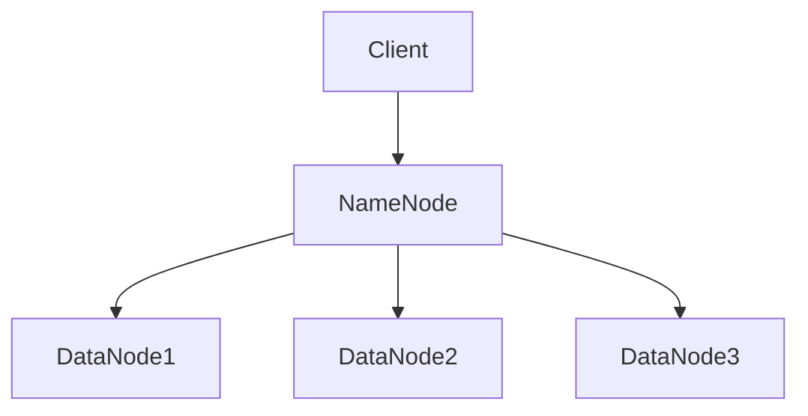

                 

# Hadoop 集群：分布式文件系统

## 1. 背景介绍

Hadoop是一个开源的分布式计算框架，用于处理大规模数据集。它最初由Apache软件基金会开发，并迅速成为了大数据处理领域的重要工具。Hadoop的核心组成部分包括Hadoop分布式文件系统（HDFS）和MapReduce编程模型。

Hadoop分布式文件系统（HDFS）是一个高吞吐量的分布式文件存储系统，用于在大数据环境中存储大规模数据。HDFS的设计目标是支持数据存储和处理的高效性和可靠性。它通过将数据分片（split）存储在不同的节点上，实现了数据的高可用性和扩展性。

MapReduce是一种编程模型，用于处理大规模数据集。它将数据处理过程分为两个阶段：Map阶段和Reduce阶段。Map阶段将数据分解为键值对，并进行并行处理；Reduce阶段对Map阶段的输出进行汇总和聚合。

Hadoop集群是由多个节点组成的计算环境，其中每个节点都运行着Hadoop的相关组件。集群中的节点可以分为两种类型：主节点（NameNode）和从节点（DataNode）。主节点负责管理文件系统的命名空间和客户端的访问；从节点负责存储实际的数据块。

## 2. 核心概念与联系

### 2.1. 分布式文件系统

分布式文件系统是一种将数据存储在多个物理位置上的文件系统。它的主要目的是提高数据的可靠性和可用性，同时支持大规模数据的处理。

分布式文件系统通常由三个主要组件组成：客户端（Client），元数据服务器（Metadata Server），和数据节点（Data Node）。

- **客户端**：客户端是用户与分布式文件系统交互的接口。它负责向元数据服务器发送文件操作请求，并接收来自数据节点的数据。

- **元数据服务器**：元数据服务器负责管理文件的元数据，包括文件名称、权限、位置等信息。它通常负责处理客户端的文件操作请求，并将请求转发给适当的数据节点。

- **数据节点**：数据节点负责存储实际的数据块，并响应该元数据服务器的请求，提供数据的读写操作。

### 2.2. HDFS架构

HDFS是一个分布式文件系统，它将数据划分为多个数据块（通常为128MB或256MB），并存储在多个数据节点上。HDFS的架构包括以下组件：

- **NameNode**：NameNode是HDFS的主节点，负责管理文件系统的命名空间和客户端的访问。它存储文件的元数据，包括文件名称、权限、数据块位置等信息。此外，NameNode还负责处理文件的创建、删除、重命名等操作。

- **DataNode**：DataNode是HDFS的从节点，负责存储实际的数据块，并响应来自NameNode的读写请求。每个DataNode定期向NameNode发送心跳信号，报告其状态和存储的数据块。

### 2.3. Mermaid流程图

以下是一个简化的HDFS架构的Mermaid流程图：



在上面的流程图中，客户端（A）向NameNode（B）发送文件操作请求，NameNode根据元数据信息，将请求转发给适当的数据节点（C、D、E）。

## 3. 核心算法原理 & 具体操作步骤

### 3.1. 数据块划分与存储

在HDFS中，数据被划分为固定大小的数据块（默认为128MB或256MB）。数据块是HDFS数据存储的基本单位。在创建文件时，HDFS会将文件内容划分为多个数据块，并将每个数据块存储在不同的数据节点上。

具体操作步骤如下：

1. 客户端将文件内容读取到本地内存中。
2. 将文件内容划分为多个数据块。
3. NameNode为每个数据块分配一个或多个数据节点进行存储。
4. DataNode将数据块存储到本地磁盘上。
5. DataNode向NameNode报告数据块的位置。

### 3.2. 数据复制

HDFS通过在多个数据节点上复制数据块来提高数据的可靠性和可用性。默认情况下，HDFS会在每个数据节点上存储三个副本。当一个数据块损坏或某个数据节点失败时，HDFS可以从其他副本中恢复数据。

具体操作步骤如下：

1. NameNode在创建数据块时，为每个数据块分配一个或多个数据节点进行存储。
2. DataNode将数据块存储到本地磁盘上，并通知NameNode。
3. NameNode记录数据块的位置和副本数量。
4. NameNode定期检查数据块的副本数量，并在必要时触发数据复制过程。
5. DataNode接收到数据复制请求后，从其他数据节点复制数据块。

### 3.3. 数据读写操作

在HDFS中，数据读写操作由客户端通过文件操作API进行。以下是一个简化的数据读写操作流程：

1. 客户端通过文件操作API向NameNode发送读写请求。
2. NameNode根据元数据信息，定位到相应的数据块。
3. NameNode将数据块的读写请求转发给适当的数据节点。
4. 数据节点执行实际的读写操作，并将结果返回给客户端。

## 4. 数学模型和公式 & 详细讲解 & 举例说明

### 4.1. 数据块大小选择

HDFS的数据块大小是一个重要的设计参数。选择合适的数据块大小可以提高数据传输效率和存储利用率。以下是一个简单的数学模型：

假设数据总量为\(D\)，数据块大小为\(B\)，数据副本数量为\(R\)。那么，所需的总存储空间为：

\[ S = \frac{D}{B} \times R \]

为了最大化存储利用率，我们希望数据块大小\(B\)与数据总量\(D\)成反比，即：

\[ B = \frac{D}{R} \]

### 4.2. 数据复制策略

HDFS采用了一种简单的数据复制策略，即在多个数据节点上存储多个副本。以下是一个简单的数学模型：

假设数据块大小为\(B\)，数据副本数量为\(R\)，数据节点数量为\(N\)。那么，每个数据节点的平均存储空间为：

\[ S_{node} = \frac{B \times R}{N} \]

为了最大化存储利用率，我们希望数据块大小\(B\)与数据副本数量\(R\)成反比，即：

\[ B = \frac{R}{N} \]

### 4.3. 示例

假设我们有一个包含1TB数据的HDFS集群，其中每个数据块大小为128MB，数据副本数量为3，数据节点数量为10。根据上述数学模型，我们可以计算出所需的存储空间：

\[ S = \frac{1TB}{128MB} \times 3 = 23.4TB \]

每个数据节点的平均存储空间为：

\[ S_{node} = \frac{128MB \times 3}{10} = 38.4MB \]

## 5. 项目实战：代码实际案例和详细解释说明

### 5.1. 开发环境搭建

为了演示HDFS的使用，我们需要搭建一个简单的Hadoop开发环境。以下是一个简化的步骤：

1. 下载并安装Hadoop。
2. 配置Hadoop的集群环境。
3. 启动Hadoop集群。

### 5.2. 源代码详细实现和代码解读

以下是一个简单的HDFS客户端代码示例，用于上传文件到HDFS：

```java
import org.apache.hadoop.conf.Configuration;
import org.apache.hadoop.fs.FileSystem;
import org.apache.hadoop.fs.Path;
import org.apache.hadoop.io.IOUtils;

public class HDFSUpload {
    public static void main(String[] args) throws Exception {
        Configuration conf = new Configuration();
        FileSystem fs = FileSystem.get(conf);

        Path localPath = new Path("local:///test.txt");
        Path hdfsPath = new Path("hdfs:///test.txt");

        fs.copyFromLocalFile(localPath, hdfsPath);

        IOUtils.closeStream(fs);
    }
}
```

在上面的代码中，我们首先创建了一个Hadoop配置对象`conf`，并使用它获取一个`FileSystem`对象。然后，我们定义了本地文件路径`localPath`和HDFS文件路径`hdfsPath`。最后，我们使用`copyFromLocalFile`方法将本地文件上传到HDFS。

### 5.3. 代码解读与分析

在上面的代码中，我们首先创建了一个Hadoop配置对象`conf`。配置对象是Hadoop框架的核心部分，用于管理各种配置参数，例如数据块大小、副本数量等。接下来，我们使用`FileSystem.get(conf)`方法获取一个`FileSystem`对象。`FileSystem`对象是Hadoop文件系统的入口点，用于执行各种文件操作。

然后，我们定义了本地文件路径`localPath`和HDFS文件路径`hdfsPath`。这两个路径对象分别表示本地文件和HDFS文件。

最后，我们使用`fs.copyFromLocalFile(localPath, hdfsPath)`方法将本地文件上传到HDFS。这个方法接受两个参数：本地文件路径和HDFS文件路径。它将本地文件的内容复制到HDFS文件中。

在代码的最后，我们使用`IOUtils.closeStream(fs)`方法关闭`FileSystem`对象。这是Hadoop编程中的常见做法，用于释放资源。

## 6. 实际应用场景

Hadoop分布式文件系统（HDFS）在各种实际应用场景中具有广泛的应用。以下是一些常见的应用场景：

- **大数据存储与处理**：HDFS是一个高性能的分布式文件存储系统，适用于存储和处理大规模数据集。它可以处理数千GB甚至TB级别的数据，非常适合大数据应用场景。

- **日志存储与查询**：许多企业和组织使用HDFS来存储和分析日志数据。HDFS的高可靠性和扩展性使其成为日志存储的理想选择。

- **科学计算**：HDFS在科学计算领域也有广泛的应用。科学家可以使用HDFS来存储和处理大型科学数据集，例如天文观测数据、基因组数据等。

- **数据备份与归档**：HDFS可以用于数据备份和归档。通过将数据存储在HDFS上，企业可以确保数据的可靠性和长期保存。

## 7. 工具和资源推荐

### 7.1. 学习资源推荐

- **书籍**：
  - 《Hadoop权威指南》
  - 《Hadoop编程实践》
  - 《Hadoop技术内幕》

- **论文**：
  - 《The Google File System》
  - 《MapReduce: Simplified Data Processing on Large Clusters》

- **博客**：
  - [Hadoop官方网站](https://hadoop.apache.org/)
  - [Cloudera博客](https://blog.cloudera.com/)
  - [Hadoop Wiki](https://wiki.apache.org/hadoop/)

### 7.2. 开发工具框架推荐

- **开发工具**：
  - IntelliJ IDEA
  - Eclipse

- **框架**：
  - Apache Hadoop
  - Apache Spark
  - Apache Flink

### 7.3. 相关论文著作推荐

- **论文**：
  - 《The Google File System》
  - 《MapReduce: Simplified Data Processing on Large Clusters》
  - 《Hadoop: The Definitive Guide》

- **著作**：
  - 《Hadoop权威指南》
  - 《Hadoop编程实践》
  - 《大数据之路：阿里巴巴大数据实践》

## 8. 总结：未来发展趋势与挑战

随着大数据和云计算的快速发展，Hadoop分布式文件系统（HDFS）在未来将继续发挥重要作用。然而，它也面临着一些挑战：

- **性能优化**：HDFS需要进一步提高性能，以应对不断增长的数据量和复杂的应用场景。

- **安全性**：随着数据隐私和安全的关注度不断提高，HDFS需要加强数据安全保护措施。

- **异构计算**：HDFS需要更好地支持异构计算环境，以便更好地利用不同的计算资源。

- **用户界面**：HDFS需要提供更直观、易用的用户界面，降低使用门槛。

## 9. 附录：常见问题与解答

### 9.1. HDFS数据块大小如何选择？

选择合适的数据块大小取决于数据特点和集群规模。通常，数据块大小与数据总量成反比，以便最大化存储利用率。例如，对于大型数据集，可以选择较大的数据块大小（如256MB或512MB），而对于小型数据集，可以选择较小的数据块大小（如128MB或256MB）。

### 9.2. HDFS如何处理数据副本损坏？

当HDFS检测到数据副本损坏时，它会从其他副本中恢复数据。具体来说，HDFS会触发数据复制过程，将其他副本复制到新的数据节点上。如果数据副本数量低于预期值，HDFS会自动启动数据复制策略，确保数据的可靠性和可用性。

## 10. 扩展阅读 & 参考资料

- [Hadoop官方网站](https://hadoop.apache.org/)
- [Cloudera博客](https://blog.cloudera.com/)
- [Hadoop Wiki](https://wiki.apache.org/hadoop/)
- 《Hadoop权威指南》
- 《Hadoop编程实践》
- 《Hadoop技术内幕》
- 《The Google File System》
- 《MapReduce: Simplified Data Processing on Large Clusters》
- 《大数据之路：阿里巴巴大数据实践》

### 作者信息

- 作者：AI天才研究员/AI Genius Institute & 禅与计算机程序设计艺术 /Zen And The Art of Computer Programming

