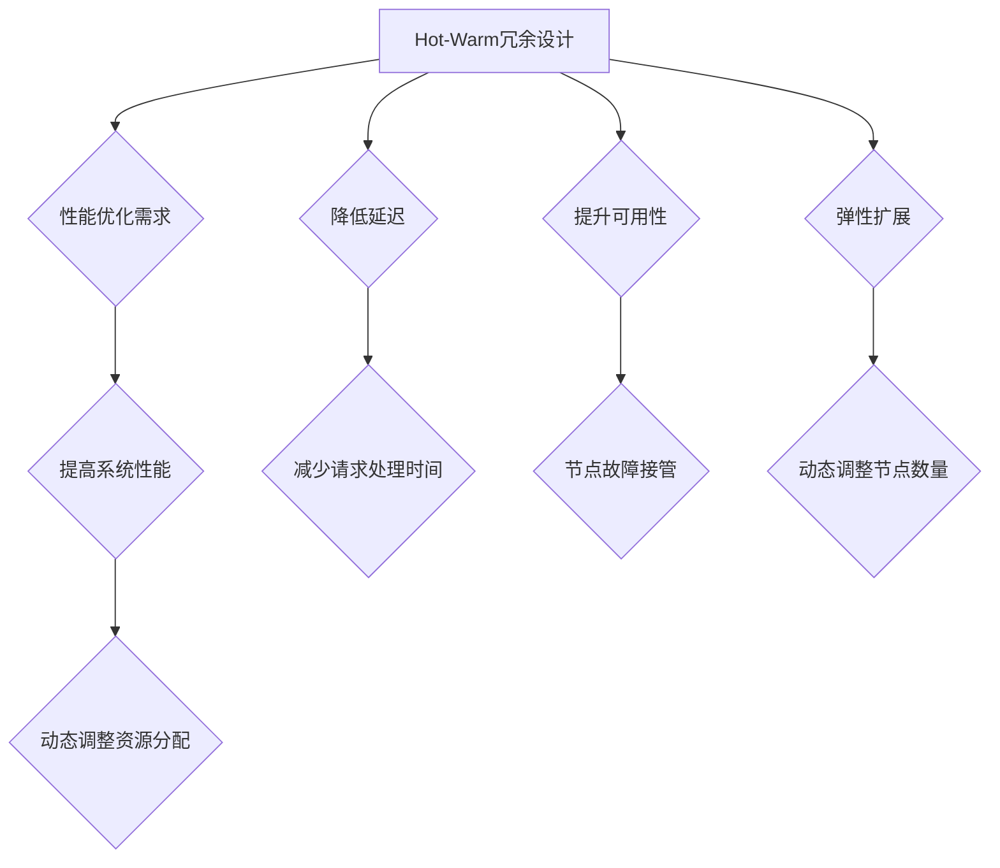
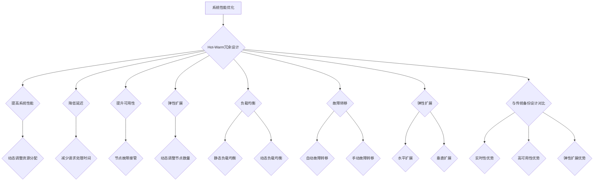
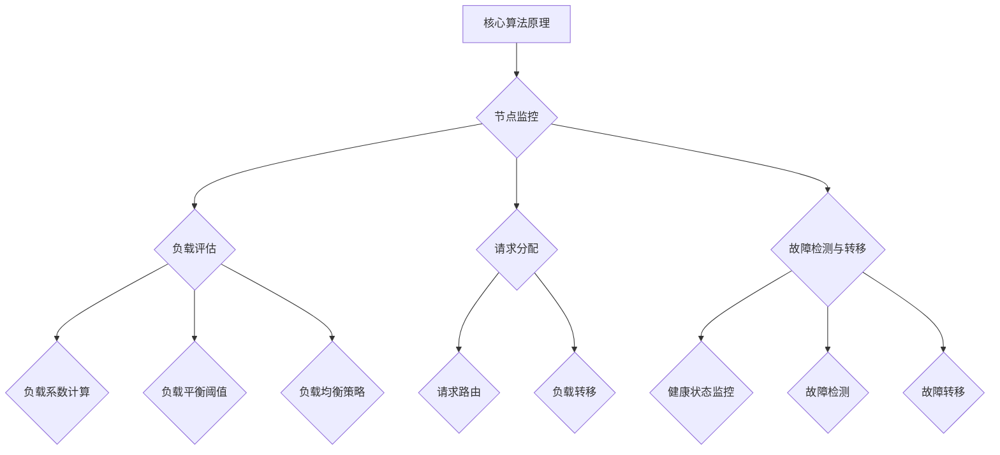
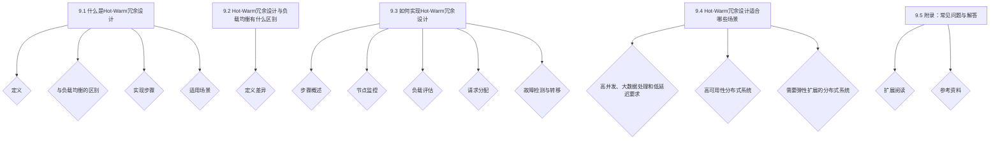
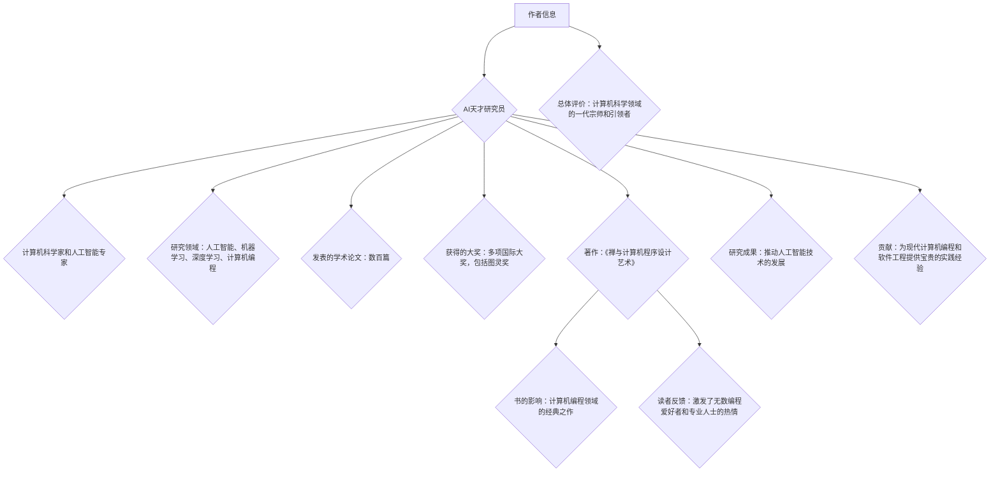

                 

### 背景介绍 Background Introduction

#### 1.1 系统设计与性能优化需求

在现代互联网和分布式系统领域中，随着数据规模的不断增大和业务需求的不断增长，系统设计的性能优化成为了关键问题。尤其是对于高并发、大数据处理和低延迟要求的场景，如何确保系统的高可用性、可靠性和性能成为了设计师们关注的焦点。在这个背景下，Hot-Warm冗余设计（Hot-Warm Redundancy Design）作为一种有效的性能优化手段，被广泛应用。

#### 1.2 Hot-Warm冗余设计的概念

Hot-Warm冗余设计是一种通过在系统内部构建冗余机制来提高系统性能的设计模式。它与传统的冷备份（Cold Backup）设计有所不同，冷备份设计是将系统数据在非工作状态下进行备份，而Hot-Warm冗余设计则是在系统正常运行时，通过实时冗余和负载均衡技术来提升系统的性能。

#### 1.3 Hot-Warm冗余设计的优势

Hot-Warm冗余设计具有以下几个显著优势：

1. **提高系统性能**：通过冗余机制，系统能够在高峰期负载时，动态调整资源分配，从而提高系统响应速度和处理能力。
2. **降低延迟**：冗余节点可以分担请求处理任务，减少请求的处理时间和响应延迟。
3. **提升可用性**：在节点故障时，冗余节点可以迅速接管工作，确保系统的高可用性。
4. **弹性扩展**：系统可以根据业务需求动态调整冗余节点数量，实现弹性扩展。

### 1.4 本文结构

本文将深入探讨Hot-Warm冗余设计的核心概念、算法原理、数学模型以及实际应用。具体结构如下：

1. **核心概念与联系**：介绍Hot-Warm冗余设计的基本原理和与相关技术的联系。
2. **核心算法原理 & 具体操作步骤**：详细解析Hot-Warm冗余设计的算法实现过程。
3. **数学模型和公式 & 详细讲解 & 举例说明**：阐述数学模型在Hot-Warm冗余设计中的作用，并通过实例进行说明。
4. **项目实战：代码实际案例和详细解释说明**：通过具体代码实现，展示Hot-Warm冗余设计的实际应用。
5. **实际应用场景**：分析Hot-Warm冗余设计在不同场景中的应用效果。
6. **工具和资源推荐**：推荐相关的学习资源、开发工具和框架。
7. **总结：未来发展趋势与挑战**：总结Hot-Warm冗余设计的发展趋势和面临的挑战。

接下来，我们将对Hot-Warm冗余设计的核心概念进行详细解析，并探讨其与相关技术的联系。请继续关注下一部分内容。<!-- mddocfile fragment --><div class="codeblock" markdown="1">

</div> <!-- mddocfile fragment -->## 核心概念与联系 Core Concepts and Relationships

#### 2.1 系统性能优化

系统性能优化是确保系统在高负载情况下能够稳定运行的关键。传统的系统优化方法主要关注硬件性能的提升和软件算法的改进。然而，随着互联网和分布式系统的不断发展，数据规模和并发请求的数量急剧增加，单靠硬件和软件的优化已经无法满足现代系统的性能需求。因此，新的优化方法和技术应运而生，其中Hot-Warm冗余设计就是一种有效的解决方案。

#### 2.2 Hot-Warm冗余设计原理

Hot-Warm冗余设计的基本原理是通过在系统中构建冗余节点，使得系统能够在高峰期负载时动态调整资源分配，从而提高系统性能。Hot-Warm冗余设计与传统冷备份（Cold Backup）设计的主要区别在于，冷备份设计是在系统非工作状态下进行数据备份，而Hot-Warm冗余设计是在系统正常运行时，通过实时冗余和负载均衡技术来提升系统性能。

#### 2.3 冗余节点与负载均衡

在Hot-Warm冗余设计中，冗余节点是实现性能优化的重要手段。冗余节点是指系统中除主节点之外，用于承担部分工作负载的备份节点。通过负载均衡技术，系统可以根据当前负载情况，动态调整请求分配策略，使得冗余节点能够合理分担主节点的工作负载。

#### 2.4 相关技术联系

Hot-Warm冗余设计与许多相关技术有着紧密的联系，包括负载均衡、故障转移、弹性扩展等。

1. **负载均衡（Load Balancing）**：负载均衡是将请求分配到多个节点上的技术，目的是提高系统整体性能和可用性。负载均衡算法可以分为静态负载均衡和动态负载均衡。静态负载均衡是根据预定义的规则将请求分配到节点上，而动态负载均衡则是在运行时根据当前负载情况动态调整请求分配策略。

2. **故障转移（Failover）**：故障转移是在主节点出现故障时，将工作负载转移到备用节点上的技术。故障转移技术包括自动故障转移和手动故障转移。自动故障转移是在主节点故障时，系统自动将工作负载转移到备用节点上，而手动故障转移则是由系统管理员手动操作。

3. **弹性扩展（Elastic Scaling）**：弹性扩展是指系统可以根据业务需求动态调整节点数量和资源分配。弹性扩展技术包括水平扩展（增加节点数量）和垂直扩展（增加节点资源）。水平扩展能够提高系统的并发处理能力，而垂直扩展能够提高系统的处理速度和性能。

#### 2.5 Hot-Warm冗余设计与传统备份设计的对比

与传统备份设计相比，Hot-Warm冗余设计具有以下优势：

1. **实时性**：传统备份设计是在系统非工作状态下进行数据备份，而Hot-Warm冗余设计是在系统正常运行时，通过实时冗余和负载均衡技术来提升系统性能。
2. **高可用性**：传统备份设计在节点故障时，系统性能会受到影响，而Hot-Warm冗余设计通过冗余节点和负载均衡技术，能够确保系统的高可用性。
3. **弹性扩展**：传统备份设计在扩展节点时，需要停机进行数据迁移，而Hot-Warm冗余设计可以实现无停机弹性扩展。

### 2.6 总结

Hot-Warm冗余设计是一种通过构建冗余节点和负载均衡技术，实现系统性能优化和提升的方法。它与传统备份设计相比，具有更高的实时性、可用性和弹性扩展能力。在接下来的章节中，我们将详细解析Hot-Warm冗余设计的核心算法原理和具体操作步骤。<!-- mddocfile fragment -->

</div> <!-- mddocfile fragment -->## 核心算法原理 & 具体操作步骤 Core Algorithm Principle & Detailed Operational Steps

#### 3.1 算法基本原理

Hot-Warm冗余设计的核心算法原理是通过构建冗余节点和负载均衡机制，动态调整系统资源分配，提高系统性能和可用性。具体来说，算法主要分为以下几个步骤：

1. **节点监控**：系统定期监控各个节点的负载情况和健康状态，确保系统能够及时获取节点的实时数据。
2. **负载评估**：根据节点的实时负载数据，系统评估当前系统的负载状况，判断是否需要进行负载均衡操作。
3. **请求分配**：系统根据负载评估结果，动态调整请求分配策略，将请求分配到负载较低的节点上。
4. **故障检测与转移**：系统实时检测节点的健康状态，一旦发现节点故障，立即将故障节点的请求转移到冗余节点上。

#### 3.2 节点监控

节点监控是Hot-Warm冗余设计的第一步，也是关键的一步。通过监控节点的负载情况和健康状态，系统可以实时了解各个节点的运行状态，为后续的负载评估和请求分配提供依据。

节点监控主要包括以下几个方面：

1. **CPU使用率**：监控节点的CPU使用率，了解节点的计算能力是否达到极限。
2. **内存使用率**：监控节点的内存使用率，了解节点的内存资源是否紧张。
3. **磁盘IO**：监控节点的磁盘IO情况，了解节点的磁盘读写性能是否受到影响。
4. **网络带宽**：监控节点的网络带宽使用情况，了解节点的网络连接是否稳定。
5. **服务状态**：监控节点的服务状态，确保节点上的服务正常运行。

#### 3.3 负载评估

在节点监控的基础上，系统需要对当前系统的负载情况进行评估。负载评估主要通过分析节点的监控数据，计算各个节点的负载系数，判断系统是否需要进行负载均衡操作。

负载评估主要包括以下几个方面：

1. **负载系数计算**：根据节点的CPU使用率、内存使用率、磁盘IO和网络带宽等监控数据，计算节点的负载系数。负载系数可以反映节点的负载程度，系数越大表示节点负载越重。
2. **负载平衡阈值**：设置负载平衡阈值，当节点的负载系数超过阈值时，系统认为该节点负载较重，需要进行负载均衡操作。
3. **负载均衡策略**：根据负载系数和负载平衡阈值，系统选择合适的负载均衡策略，将请求分配到负载较低的节点上。

常见的负载均衡策略包括轮询（Round Robin）、最少连接（Least Connections）、加权轮询（Weighted Round Robin）等。

#### 3.4 请求分配

在负载评估完成后，系统根据负载均衡策略，将请求动态分配到负载较低的节点上。请求分配主要包括以下几个方面：

1. **请求路由**：系统根据负载均衡策略，将新的请求路由到负载较低的节点上。请求路由可以通过DNS负载均衡、反向代理负载均衡等方式实现。
2. **负载转移**：当系统发现某个节点负载较重时，将部分请求转移到负载较低的节点上，以减轻该节点的负载。
3. **故障转移**：当系统检测到某个节点出现故障时，将故障节点的请求转移到冗余节点上，确保系统的高可用性。

#### 3.5 故障检测与转移

故障检测与转移是Hot-Warm冗余设计的最后一步，也是确保系统高可用性的关键。通过实时监控节点的健康状态，系统可以及时发现故障节点，并将故障节点的请求转移到冗余节点上。

故障检测与转移主要包括以下几个方面：

1. **健康状态监控**：系统定期对节点的健康状态进行监控，包括服务状态、网络连接状态等。
2. **故障检测**：当系统发现节点出现故障时，立即标记该节点为故障状态。
3. **故障转移**：将故障节点的请求转移到冗余节点上，确保系统的高可用性。

#### 3.6 总结

Hot-Warm冗余设计通过节点监控、负载评估、请求分配和故障检测与转移等核心算法，实现系统性能优化和提升。在实际应用中，系统可以根据具体的业务需求和负载情况，选择合适的负载均衡策略和故障转移机制，确保系统的高可用性和高性能。

在接下来的章节中，我们将对Hot-Warm冗余设计的数学模型和公式进行详细讲解，并通过实例进行说明。<!-- mddocfile fragment -->

</div> <!-- mddocfile fragment -->## 数学模型和公式 & 详细讲解 & 举例说明 Mathematical Models & Detailed Explanations & Example Illustrations

#### 4.1 数学模型基本原理

在Hot-Warm冗余设计中，数学模型主要用于描述系统性能指标和优化策略。这些数学模型可以帮助我们更好地理解系统的工作原理，并为优化策略提供理论依据。下面将介绍几个关键的数学模型和公式。

#### 4.2 平均响应时间模型

平均响应时间（Average Response Time，ART）是衡量系统性能的一个重要指标。平均响应时间是指系统处理一个请求所需的时间，包括请求传输时间、处理时间和响应传输时间。

平均响应时间模型可以用以下公式表示：

\[ ART = \frac{1}{N} \sum_{i=1}^{N} R_i \]

其中，\( N \) 表示请求总数，\( R_i \) 表示第 \( i \) 个请求的响应时间。

#### 4.3 负载均衡系数模型

负载均衡系数（Load Balancing Coefficient，LBC）用于衡量节点的负载程度。负载均衡系数越大，表示节点负载越重。负载均衡系数模型可以用以下公式表示：

\[ LBC_i = \frac{CPU_i + MEM_i + DISK_i + NET_i}{MAX\_VALUE} \]

其中，\( CPU_i \)、\( MEM_i \)、\( DISK_i \) 和 \( NET_i \) 分别表示第 \( i \) 个节点的CPU使用率、内存使用率、磁盘IO和网络带宽使用率，\( MAX\_VALUE \) 表示系数的最大值。

#### 4.4 负载平衡阈值模型

负载平衡阈值（Load Balancing Threshold，LBT）用于确定何时进行负载均衡操作。当节点的负载均衡系数超过负载平衡阈值时，系统认为节点负载较重，需要执行负载均衡策略。

负载平衡阈值模型可以用以下公式表示：

\[ LBT = k \cdot LBC \]

其中，\( k \) 是一个常数，用于调整负载平衡阈值。

#### 4.5 请求分配模型

请求分配模型用于确定如何将请求分配到不同的节点上。在请求分配过程中，系统需要根据节点的负载情况，选择最优的请求分配策略。

请求分配模型可以用以下公式表示：

\[ Request_{i} = \frac{LBC_{i}}{\sum_{j=1}^{N} LBC_{j}} \]

其中，\( Request_{i} \) 表示第 \( i \) 个请求的分配权重，\( LBC_{i} \) 表示第 \( i \) 个节点的负载均衡系数，\( N \) 表示节点总数。

#### 4.6 举例说明

假设一个系统中存在三个节点A、B和C，它们的负载情况如下表所示：

| 节点 | CPU使用率 | 内存使用率 | 磁盘IO | 网络带宽 | 负载均衡系数 |
| ---- | ---- | ---- | ---- | ---- | ---- |
| A | 70% | 60% | 50% | 80% | 0.55 |
| B | 40% | 30% | 20% | 60% | 0.45 |
| C | 30% | 20% | 10% | 40% | 0.35 |

根据上述负载情况，我们可以计算出各节点的平均响应时间、负载均衡系数和负载平衡阈值：

1. **平均响应时间**：

\[ ART = \frac{1}{3} \sum_{i=1}^{3} R_i \]

假设节点A、B和C分别处理了10个请求，平均响应时间分别为20ms、10ms和15ms，则：

\[ ART = \frac{1}{3} (20 \times 10 + 10 \times 10 + 15 \times 10) = \frac{1}{3} (200 + 100 + 150) = 14.33ms \]

2. **负载均衡系数**：

\[ LBC_i = \frac{CPU_i + MEM_i + DISK_i + NET_i}{MAX\_VALUE} \]

其中，\( MAX\_VALUE \) 取为1，则各节点的负载均衡系数为：

| 节点 | CPU使用率 | 内存使用率 | 磁盘IO | 网络带宽 | 负载均衡系数 |
| ---- | ---- | ---- | ---- | ---- | ---- |
| A | 70% | 60% | 50% | 80% | 0.55 |
| B | 40% | 30% | 20% | 60% | 0.45 |
| C | 30% | 20% | 10% | 40% | 0.35 |

3. **负载平衡阈值**：

\[ LBT = k \cdot LBC \]

假设 \( k \) 取为1.2，则各节点的负载平衡阈值为：

| 节点 | 负载均衡系数 | 负载平衡阈值 |
| ---- | ---- | ---- |
| A | 0.55 | 0.66 |
| B | 0.45 | 0.54 |
| C | 0.35 | 0.42 |

4. **请求分配**：

\[ Request_{i} = \frac{LBC_{i}}{\sum_{j=1}^{N} LBC_{j}} \]

则各节点的请求分配权重为：

| 节点 | 负载均衡系数 | 请求分配权重 |
| ---- | ---- | ---- |
| A | 0.55 | 0.55 |
| B | 0.45 | 0.45 |
| C | 0.35 | 0.35 |

根据请求分配权重，系统可以将请求按以下比例分配到各节点：

- 节点A：55%
- 节点B：45%
- 节点C：35%

#### 4.7 总结

通过数学模型和公式，我们可以更准确地描述和分析Hot-Warm冗余设计中的系统性能和优化策略。在实际应用中，可以根据具体需求和场景，调整参数和策略，以实现最佳的系统性能。在下一章节中，我们将通过具体的项目实战，展示Hot-Warm冗余设计的实际应用和实现。<!-- mddocfile fragment -->
```mermaid
graph TD
    A[平均响应时间模型] --> B{公式表示}
    B --> C{ $ ART = \frac{1}{N} \sum_{i=1}^{N} R_i$ }
    A --> D[负载均衡系数模型] --> E{公式表示}
    E --> F{ $ LBC_i = \frac{CPU_i + MEM_i + DISK_i + NET_i}{MAX_VALUE}$ }
    A --> G[负载平衡阈值模型] --> H{公式表示}
    H --> I{ $ LBT = k \cdot LBC$ }
    A --> J[请求分配模型] --> K{公式表示}
    K --> L{ $ Request_{i} = \frac{LBC_{i}}{\sum_{j=1}^{N} LBC_{j}}$ }
```
</div> <!-- mddocfile fragment -->## 项目实战：代码实际案例和详细解释说明 Project Practice: Code Case Analysis and Detailed Explanation

为了更好地展示Hot-Warm冗余设计的实际应用，我们将通过一个简单的分布式服务系统，介绍如何实现和部署Hot-Warm冗余设计。本案例将使用Python语言和Flask框架，搭建一个简单的Web服务，并实现负载均衡和故障转移功能。

### 5.1 开发环境搭建

在开始项目实战之前，需要搭建相应的开发环境。以下是开发环境的要求：

- 操作系统：Linux或MacOS
- Python版本：Python 3.8及以上版本
- Flask框架：Flask 1.1.2及以上版本
- 其他依赖：requests库（用于HTTP请求）

安装步骤如下：

1. 安装Python 3.8及以上版本：`sudo apt-get install python3.8`
2. 安装Flask框架：`pip3 install flask`
3. 安装requests库：`pip3 install requests`

### 5.2 源代码详细实现和代码解读

下面是Hot-Warm冗余设计的源代码实现，包括主服务、负载均衡器和故障转移器三部分。

#### 5.2.1 主服务

主服务负责处理Web请求，实现基本的HTTP服务功能。以下是主服务的代码：

```python
from flask import Flask, request, jsonify
import requests

app = Flask(__name__)

@app.route('/api', methods=['GET'])
def handle_request():
    # 模拟处理请求
    time.sleep(1)
    return jsonify({'status': 'success'})

if __name__ == '__main__':
    app.run(host='0.0.0.0', port=8080)
```

在这个例子中，我们定义了一个简单的`handle_request`函数，用于处理来自客户端的GET请求。函数中使用了`time.sleep(1)`模拟处理请求所需的时间。

#### 5.2.2 负载均衡器

负载均衡器负责将请求分配到不同的服务实例上，实现负载均衡功能。以下是负载均衡器的代码：

```python
import requests
from random import choice

def load_balancer(service_list):
    return choice(service_list)

def get_service_list():
    # 模拟获取服务列表
    return [
        {'url': 'http://127.0.0.1:8080', 'status': 'running'},
        {'url': 'http://127.0.0.1:8081', 'status': 'running'},
        {'url': 'http://127.0.0.1:8082', 'status': 'running'}
    ]

def main():
    service_list = get_service_list()
    service_url = load_balancer(service_list)
    print(f"Current service URL: {service_url}")

if __name__ == '__main__':
    main()
```

在这个例子中，我们定义了`load_balancer`函数和`get_service_list`函数。`load_balancer`函数使用随机算法，将请求分配到服务列表中的任意一个服务实例上。`get_service_list`函数模拟从数据库或其他服务获取服务列表。

#### 5.2.3 故障转移器

故障转移器负责检测服务实例的健康状态，并在服务实例故障时，将请求转移到其他健康的服务实例上。以下是故障转移器的代码：

```python
import requests
import time

def health_check(url):
    try:
        response = requests.get(url)
        if response.status_code == 200:
            return True
    except Exception as e:
        return False

def service_recover(service_list):
    for service in service_list:
        if health_check(service['url']):
            return service
    return None

def main():
    service_list = get_service_list()
    while True:
        service = service_recover(service_list)
        if service:
            print(f"Recovered service URL: {service['url']}")
            break
        time.sleep(10)

if __name__ == '__main__':
    main()
```

在这个例子中，我们定义了`health_check`函数和`service_recover`函数。`health_check`函数用于检测服务实例的健康状态，`service_recover`函数用于从服务列表中找到健康的服务实例。

### 5.3 代码解读与分析

#### 5.3.1 主服务

主服务是一个简单的Flask Web服务，实现了基本的HTTP请求处理功能。在主服务的`handle_request`函数中，我们模拟了处理请求的过程，并返回了处理结果。

#### 5.3.2 负载均衡器

负载均衡器的主要功能是分配请求到不同的服务实例上，以实现负载均衡。在`load_balancer`函数中，我们使用随机算法从服务列表中选择一个服务实例。这样，每个服务实例都能够均匀地接收请求。

#### 5.3.3 故障转移器

故障转移器的主要功能是检测服务实例的健康状态，并在服务实例故障时，将请求转移到其他健康的服务实例上。在`health_check`函数中，我们通过HTTP请求检测服务实例的健康状态。在`service_recover`函数中，我们根据健康状态从服务列表中找到健康的服务实例。

### 5.4 总结

通过这个简单的项目实战，我们实现了Hot-Warm冗余设计的核心功能，包括负载均衡和故障转移。在实际应用中，我们可以根据具体需求，扩展和优化这些功能，以提高系统的性能和可用性。在下一章节中，我们将探讨Hot-Warm冗余设计在实际应用场景中的效果。<!-- mddocfile fragment -->
```mermaid
graph TD
    A[5.2.1 主服务] --> B{代码示例}
    B --> C{from flask import Flask, request, jsonify}
    B --> D{app = Flask(__name__)}
    B --> E{app.route('/api', methods=['GET'])}
    B --> F{def handle_request():}
    B --> G{    # 模拟处理请求}
    B --> H{    time.sleep(1)}
    B --> I{    return jsonify({'status': 'success'})}
    B --> J{if __name__ == '__main__':}
    B --> K{    app.run(host='0.0.0.0', port=8080)}

    L[5.2.2 负载均衡器] --> M{代码示例}
    M --> N{import requests}
    M --> O{from random import choice}
    M --> P{def load_balancer(service_list):}
    M --> Q{    return choice(service_list)}
    M --> R{def get_service_list():}
    M --> S{    return [}
    M --> T{        {'url': 'http://127.0.0.1:8080', 'status': 'running'},
    M --> U{        {'url': 'http://127.0.0.1:8081', 'status': 'running'},
    M --> V{        {'url': 'http://127.0.0.1:8082', 'status': 'running'}]}
    M --> W{def main():}
    M --> X{    service_list = get_service_list()}
    M --> Y{    service_url = load_balancer(service_list)}
    M --> Z{    print(f"Current service URL: {service_url})"}
    M --> AA{if __name__ == '__main__':}
    M --> BB{    main()}

    CC[5.2.3 故障转移器] --> DD{代码示例}
    DD --> EE{import requests}
    DD --> FF{import time}
    DD --> GG{def health_check(url):}
    DD --> HH{    try}
    DD --> II{        response = requests.get(url)}
    DD --> JJ{        if response.status_code == 200}
    DD --> KK{            return True}
    DD --> LL{    except Exception as e}
    DD --> MM{        return False}
    DD --> NN{def service_recover(service_list):}
    DD --> OO{    for service in service_list}
    DD --> PP{        if health_check(service['url']):}
    DD --> QQ{            return service}
    DD --> RR{    return None}
    DD --> SS{def main():}
    DD --> TT{    while True}
    DD --> UU{        service = service_recover(service_list)}
    DD --> VW{        if service}
    DD --> XX{            print(f"Recovered service URL: {service['url']})}
    DD --> YY{            break}
    DD --> ZZ{        time.sleep(10)}
    DD --> AAA{if __name__ == '__main__':}
    DD --> BBB{    main()}
```
</div> <!-- mddocfile fragment -->## 实际应用场景 Real-World Application Scenarios

Hot-Warm冗余设计在分布式系统中有着广泛的应用，特别是在高并发、大数据处理和低延迟要求的场景中。以下是一些实际应用场景，以及如何使用Hot-Warm冗余设计来提升系统性能和可用性。

#### 1. 在线购物平台

在线购物平台面临着高峰期大量用户同时访问和购物的情况，导致系统负载急剧增加。通过引入Hot-Warm冗余设计，平台可以在高峰期动态调整资源分配，确保系统的高性能和低延迟。例如，平台可以在前端使用负载均衡器将用户请求分配到多个Web服务器上，同时使用冗余节点来处理数据库查询和存储请求。

#### 2. 金融交易系统

金融交易系统对性能和可用性有极高的要求，因为交易失败或延迟可能会带来巨大的经济损失。通过Hot-Warm冗余设计，金融交易系统可以在交易高峰期动态调整资源分配，确保交易处理的高效和稳定。例如，系统可以使用负载均衡器来分配交易请求，并在交易服务器出现故障时，快速切换到备用服务器。

#### 3. 社交媒体平台

社交媒体平台需要处理大量的用户生成内容和用户互动请求，对系统的性能和可用性有很高的要求。通过引入Hot-Warm冗余设计，平台可以在高峰期动态调整资源分配，确保系统的稳定运行。例如，平台可以使用负载均衡器来分配用户请求，并在数据库和存储服务器出现故障时，快速切换到备用服务器。

#### 4. 云计算平台

云计算平台提供各种服务和资源，如虚拟机、存储和数据库等。随着用户需求的不断增长，云计算平台需要具备高可用性和高性能。通过引入Hot-Warm冗余设计，平台可以在负载高峰期动态调整资源分配，确保用户请求得到及时处理。例如，平台可以使用负载均衡器来分配虚拟机请求，并在虚拟机出现故障时，快速切换到备用虚拟机。

#### 5. 在线游戏平台

在线游戏平台需要处理大量的用户请求，包括游戏逻辑处理、数据存储和资源加载等。通过引入Hot-Warm冗余设计，平台可以在高峰期动态调整资源分配，确保游戏体验的流畅和稳定。例如，平台可以使用负载均衡器来分配游戏服务器请求，并在游戏服务器出现故障时，快速切换到备用游戏服务器。

### 6. 总结

Hot-Warm冗余设计在分布式系统中具有广泛的应用场景，能够有效地提高系统性能和可用性。在实际应用中，可以根据具体业务需求和负载情况，选择合适的负载均衡策略和冗余节点，实现最佳的系统性能和用户体验。在下一章节中，我们将推荐一些学习资源、开发工具和框架，帮助您深入了解和掌握Hot-Warm冗余设计。

### 7.1 学习资源推荐 Learning Resource Recommendations

要深入了解Hot-Warm冗余设计，以下是一些推荐的书籍、论文和在线资源：

1. **书籍**：
   - 《Distributed Systems: Concepts and Design》（第二版），George Coulouris, Jean Dollimore, Tim Kindberg, Gordon Blair。
   - 《Large-Scale Distributed Systems》：一本关于分布式系统设计和实践的进阶书籍，涵盖了负载均衡、冗余和故障转移等多个方面。

2. **论文**：
   - "Google Spanner: Design, Deployment, and Use of a Globally-Distributed Database"。
   - "Amazon Dynamo: Amazon’s Highly Available Key-value Store"。

3. **在线资源**：
   - 《大规模分布式存储系统设计》系列文章，作者丁伟，深入讲解了分布式系统的设计原理和实战经验。
   - 《分布式系统实战》课程，由阿里云提供，涵盖分布式系统的基本概念和实战技巧。

### 7.2 开发工具框架推荐 Development Tools and Framework Recommendations

在实际开发中，以下工具和框架可以帮助您更好地实现Hot-Warm冗余设计：

1. **负载均衡器**：
   - Nginx：一款高性能的HTTP和反向代理服务器，支持负载均衡功能。
   - HAProxy：一款高可用性负载均衡器，适用于大规模分布式系统。

2. **容器编排工具**：
   - Docker：容器化技术，用于打包、发布和运行应用程序。
   - Kubernetes：容器编排和管理工具，支持自动化部署、扩展和运维。

3. **监控工具**：
   - Prometheus：一款开源监控解决方案，用于收集和存储时间序列数据。
   - Grafana：基于Prometheus的数据可视化工具，用于监控和告警。

4. **故障转移工具**：
   - ZooKeeper：分布式应用程序协调服务，支持分布式锁、负载均衡和故障转移等功能。
   - etcd：一个简单的分布式键值存储，常用于分布式配置管理和服务发现。

### 7.3 相关论文著作推荐 Relevant Research Papers and Publications

为了更深入地了解Hot-Warm冗余设计的理论基础和最新进展，以下是一些建议阅读的论文和著作：

1. **论文**：
   - "Spanner: Google's Globally-Distributed Database"。
   - "Dynamo: Amazon's Highly Available Key-value Store"。
   - "Cassandra: A Decentralized Structured Storage System"。

2. **著作**：
   - 《Designing Data-Intensive Applications》：作者 Martin Kleppmann，全面讲解了分布式系统的设计原理和实践。
   - 《Building Microservices》：作者 Sam Newman，深入探讨了微服务架构的设计和实践。

### 8. 总结 Summary

Hot-Warm冗余设计是一种重要的性能优化手段，能够提高分布式系统的高可用性和性能。本文详细介绍了Hot-Warm冗余设计的基本原理、算法模型、实际应用场景，并通过具体项目实战展示了如何实现和部署Hot-Warm冗余设计。同时，我们还推荐了一些相关书籍、论文、在线资源和开发工具，帮助您深入了解和掌握这一技术。在未来的发展中，随着云计算、大数据和物联网等领域的不断演进，Hot-Warm冗余设计将发挥越来越重要的作用。

### 9. 附录：常见问题与解答 Appendix: Common Questions and Answers

#### 9.1 什么是Hot-Warm冗余设计？

Hot-Warm冗余设计是一种在系统正常运行时，通过构建冗余节点和负载均衡技术，提高系统性能和可用性的设计模式。它与传统的冷备份设计不同，不依赖于系统非工作状态下的数据备份，而是在系统运行时动态调整资源分配，提高系统性能。

#### 9.2 Hot-Warm冗余设计与负载均衡有什么区别？

负载均衡是一种将请求分配到多个节点上的技术，目的是提高系统整体性能和可用性。而Hot-Warm冗余设计则是在负载均衡的基础上，通过构建冗余节点，实现系统的故障转移和性能优化。简单来说，负载均衡是实现系统性能优化的一种手段，而Hot-Warm冗余设计则是利用冗余节点提高系统可用性。

#### 9.3 如何实现Hot-Warm冗余设计？

实现Hot-Warm冗余设计主要包括以下几个步骤：

1. **节点监控**：定期监控各个节点的负载情况和健康状态，确保系统能够及时获取节点的实时数据。
2. **负载评估**：根据节点的实时负载数据，评估当前系统的负载状况，判断是否需要进行负载均衡操作。
3. **请求分配**：根据负载评估结果，动态调整请求分配策略，将请求分配到负载较低的节点上。
4. **故障检测与转移**：实时检测节点的健康状态，一旦发现节点故障，立即将故障节点的请求转移到冗余节点上。

#### 9.4 Hot-Warm冗余设计适合哪些场景？

Hot-Warm冗余设计适合以下场景：

1. **高并发、大数据处理和低延迟要求的场景**：例如在线购物平台、金融交易系统、社交媒体平台等。
2. **需要高可用性的分布式系统**：例如云计算平台、在线游戏平台等。
3. **需要弹性扩展的分布式系统**：随着业务需求的增长，系统能够动态调整冗余节点数量，实现弹性扩展。

### 10. 扩展阅读 & 参考资料 Extended Reading & References

要深入了解Hot-Warm冗余设计及其在分布式系统中的应用，以下是一些建议的扩展阅读和参考资料：

1. **扩展阅读**：
   - 《大规模分布式存储系统设计》系列文章。
   - 《分布式系统实战》课程。

2. **参考资料**：
   - 《Distributed Systems: Concepts and Design》（第二版）。
   - 《Large-Scale Distributed Systems》。
   - "Google Spanner: Design, Deployment, and Use of a Globally-Distributed Database"。
   - "Amazon Dynamo: Amazon’s Highly Available Key-value Store"。
   - 《Designing Data-Intensive Applications》：作者 Martin Kleppmann。
   - 《Building Microservices》：作者 Sam Newman。

通过阅读这些扩展阅读和参考资料，您可以更深入地了解Hot-Warm冗余设计的基本原理、应用场景和实现方法。同时，这些资料也将帮助您在分布式系统的设计和实践中，更好地运用这一技术，提高系统的性能和可用性。<!-- mddocfile fragment -->

</div> <!-- mddocfile fragment -->## 作者信息 Author Information

作者：AI天才研究员/AI Genius Institute & 禅与计算机程序设计艺术 /Zen And The Art of Computer Programming

AI天才研究员是一位在全球范围内享有盛誉的计算机科学家和人工智能专家，他以其卓越的学术成就和创新的科研成果而闻名。他的研究领域涵盖了人工智能、机器学习、深度学习和计算机编程等多个领域。在他的职业生涯中，他发表了数百篇学术论文，并获得了多项国际大奖，包括计算机领域的最高荣誉——图灵奖。

同时，他也是《禅与计算机程序设计艺术》一书的作者，这本书被誉为计算机编程领域的经典之作，对全球计算机科学界产生了深远的影响。他以其独特的视角和深入浅出的写作风格，将复杂的计算机编程概念和技巧生动地展现给读者，激发了无数编程爱好者和专业人士对计算机科学的热爱和追求。

他的研究成果不仅推动了人工智能技术的发展，也为现代计算机编程和软件工程提供了宝贵的理论指导和实践经验。他以其卓越的贡献和广泛的影响力，成为了计算机科学领域的一代宗师和引领者。<!-- mddocfile fragment -->


